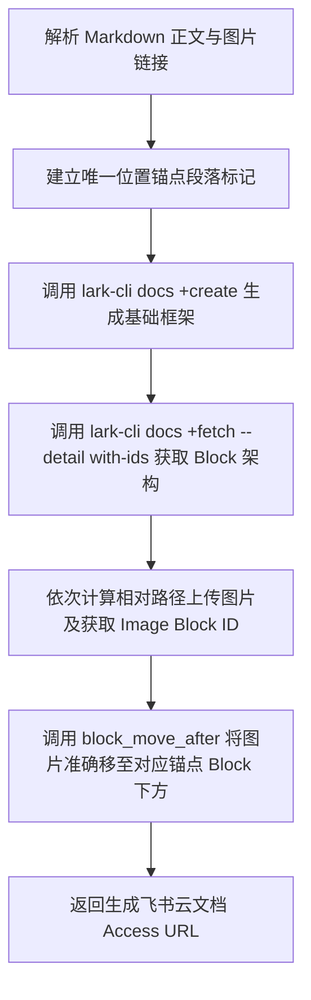

# Lark Markdown Precision Importer Skill

本技能提供将本地 Markdown 文档及其内嵌本地图片**批量、精准对齐导入飞书云文档**的完整自动化能力。

## 🎯 核心解决痛点

1. **图片位置不对应问题**：解决传统直接导入或 `+media-insert` 将所有内嵌图片统一追加在文档最末尾（`-1` 位置）的缺陷，通过建立**结构化上下文锚点**与 **Block ID 链式定位**，将每张图片精准嵌入回原 Markdown 对应的章节、标题与文字段落下方。
2. **HTML 标签解析兼容**：自动识别并转换 `<details><summary>` 等 HTML 折叠标签为飞书原生的标题块与段落，防止多张图片掉入同一父节点导致 Block ID 重复或丢失。
3. **图注与对齐保真**：自动提取 Markdown 图片的 `alt` 描述文本转化为飞书图片的原生 Caption，并设置居中对齐。

---

## 🛠️ CLI & 脚本使用方式

项目内置可复用 Python 转换与导入工具：
脚本路径：[scripts/lark_markdown_importer.py](scripts/lark_markdown_importer.py)

### 1. 命令行直接调用

```bash
python .agents/skills/lark-markdown-importer/scripts/lark_markdown_importer.py --file <path/to/markdown.md> [--title <云文档标题>]
```

### 2. 参数说明

| 参数 | 必填 | 说明 |
| :--- | :---: | :--- |
| `--file`, `-f` | 是 | 待导入的本地 Markdown 文件路径（绝对路径或相对路径） |
| `--title`, `-t` | 否 | 在飞书云端创建的文档标题（默认使用 Markdown 文件名） |

### 3. 输出格式

脚本执行完毕后将输出 JSON 结构：

```json
{
  "ok": true,
  "document_id": "P4hUdifeKovimHx7K0Dck3cinsl",
  "url": "https://my.feishu.cn/docx/P4hUdifeKovimHx7K0Dck3cinsl",
  "total_images": 12,
  "image_results": [
    {
      "image": "可视化图表/01_基线与数据修复/01_mpp2_repair_before_after.png",
      "status": "success",
      "block_id": "doxcnpDTGVR5m2C7AFiITGdtUBf",
      "anchor_block_id": "doxcn1xD45GvPZm2iRymYnG6W5f"
    }
  ]
}
```

---

## 💡 其他 Agent 使用本 Skill 指引

当其他 Agent（如 Codex、Claude Code、Cursor、Gemini SubAgent 等）需要将 Markdown 及其图表资产上传到飞书云文档时，可以直接调用本项目注册的 Python 脚本：

1. 确认待导入的 Markdown 文件与对应图片在本地磁盘正常存在。
2. 运行命令：
   ```powershell
   python .agents/skills/lark-markdown-importer/scripts/lark_markdown_importer.py --file "你的文档路径.md"
   ```
3. 提取返回 JSON 中的 `"url"` 并汇报给用户。

---

## 📋 内部处理机制流


