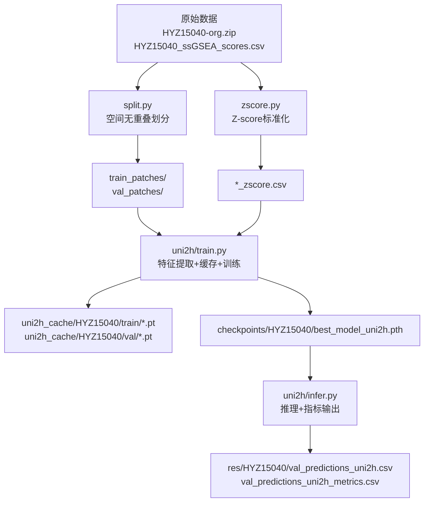
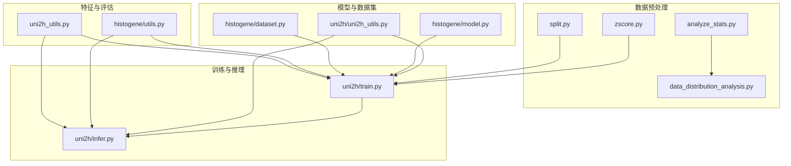
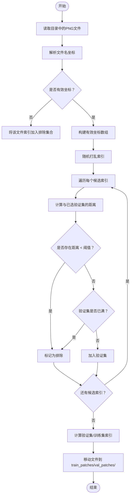
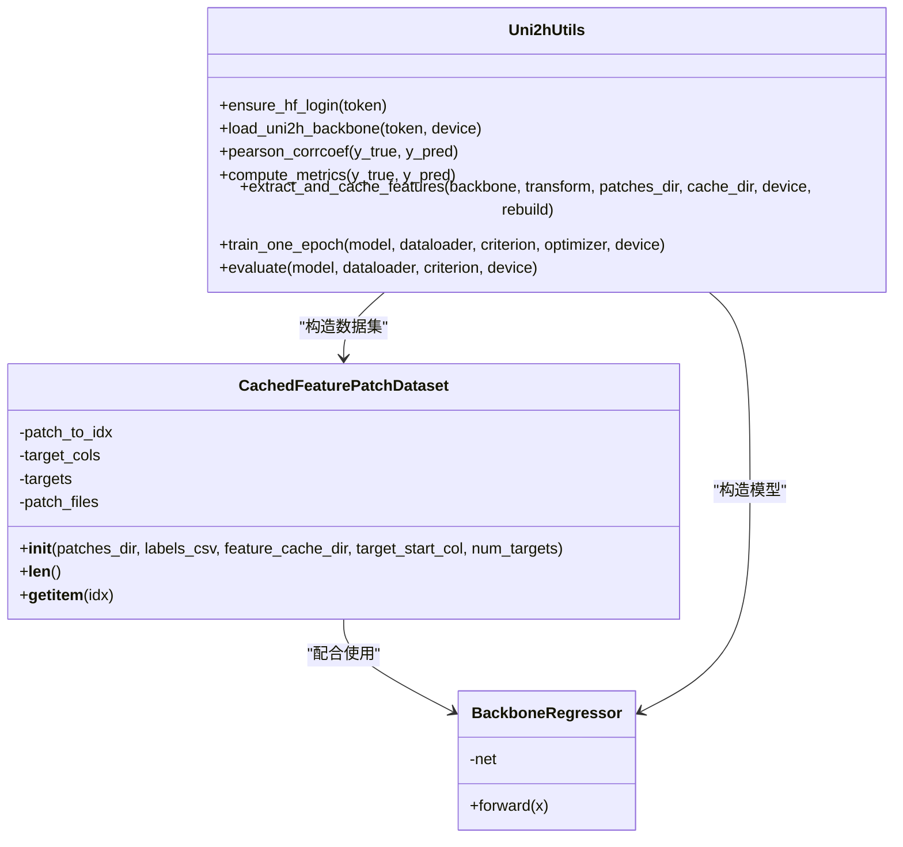
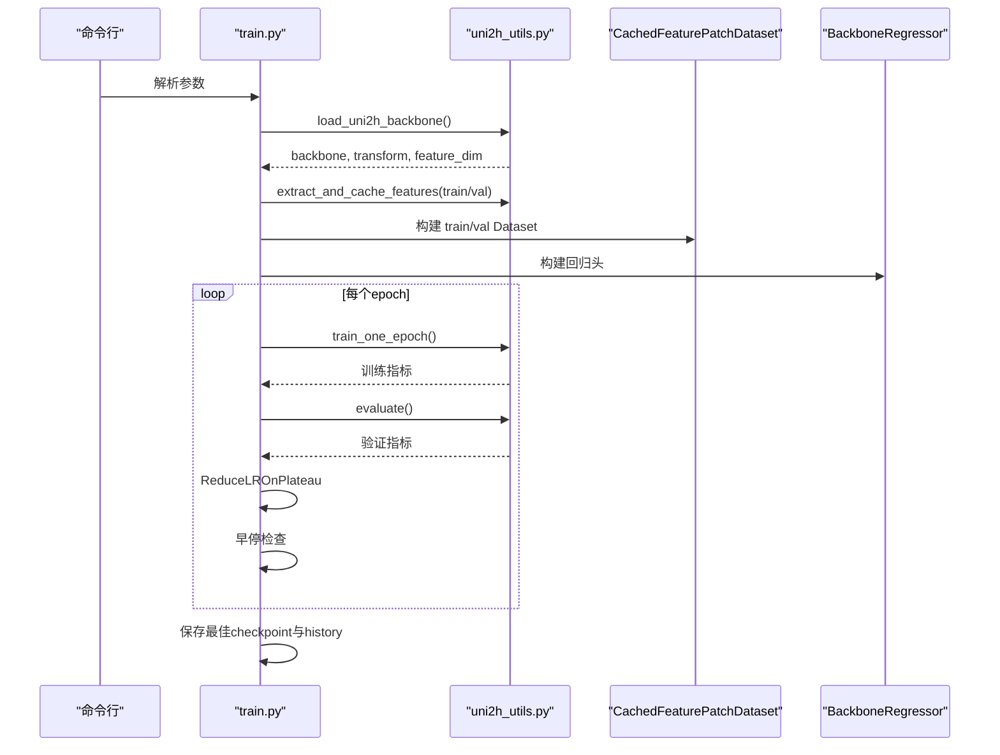
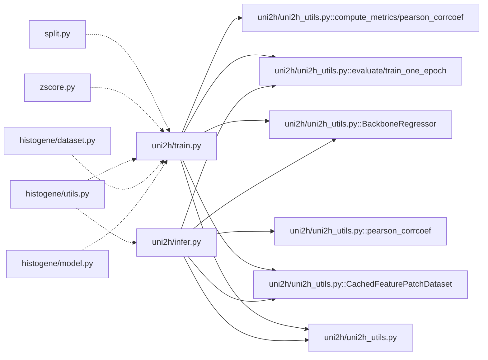

# 工具函数库

<cite>
**本文引用的文件**
- [README.md](file://README.md)
- [split.py](file://split.py)
- [zscore.py](file://zscore.py)
- [analyze_stats.py](file://analyze_stats.py)
- [data_distribution_analysis.py](file://data_distribution_analysis.py)
- [histogene/utils.py](file://histogene/utils.py)
- [histogene/dataset.py](file://histogene/dataset.py)
- [histogene/model.py](file://histogene/model.py)
- [uni2h/uni2h_utils.py](file://uni2h/uni2h_utils.py)
- [uni2h/train.py](file://uni2h/train.py)
- [uni2h/infer.py](file://uni2h/infer.py)
- [PFMval学习指南.md](file://PFMval学习指南.md)
- [split_解读指南.md](file://split_解读指南.md)
- [uni2h_utils_解读指南.md](file://uni2h_utils_解读指南.md)
</cite>

## 目录
1. [简介](#简介)
2. [项目结构](#项目结构)
3. [核心组件](#核心组件)
4. [架构总览](#架构总览)
5. [详细组件分析](#详细组件分析)
6. [依赖关系分析](#依赖关系分析)
7. [性能考量](#性能考量)
8. [故障排查指南](#故障排查指南)
9. [结论](#结论)
10. [附录](#附录)

## 简介
本文件为工具函数库的技术参考文档，覆盖数据处理、模型操作、性能评估等核心工具函数，提供完整的API说明、调用模式、依赖关系、错误处理与调试建议，并给出扩展与复用指导及最佳实践。

## 项目结构
项目采用“数据预处理 + 特征提取 + 模型训练/推理”的流水线式组织：
- 数据预处理：split.py（空间无重叠划分）、zscore.py（Z-score标准化）
- 特征提取与缓存：uni2h_utils.py（UNI2-h backbone加载、特征提取与缓存、指标计算、数据集与回归头）
- 训练与推理：uni2h/train.py、uni2h/infer.py
- 历史模型适配：histogene/utils.py（指标计算）、histogene/dataset.py（HisToGene数据集适配）、histogene/model.py（HisToGene模型）

**图表来源**
- [PFMval学习指南.md:340-369](file://PFMval学习指南.md#L340-L369)
- [README.md:1-44](file://README.md#L1-L44)

**章节来源**
- [README.md:1-44](file://README.md#L1-L44)
- [PFMval学习指南.md:1-18](file://PFMval学习指南.md#L1-L18)

## 核心组件
- 数据预处理工具
  - 空间无重叠划分：split.py
  - Z-score标准化：zscore.py
  - 统计分析与可视化：analyze_stats.py、data_distribution_analysis.py
- 特征提取与评估工具
  - UNI2-h加载与特征提取：uni2h_utils.py
  - 指标计算：histogene/utils.py、uni2h_utils.py
  - 数据集适配：histogene/dataset.py、uni2h/uni2h_utils.py
  - 回归头模型：uni2h/uni2h_utils.py、histogene/model.py
- 训练与推理
  - 训练脚本：uni2h/train.py
  - 推理脚本：uni2h/infer.py

**章节来源**
- [split.py:1-200](file://split.py#L1-L200)
- [zscore.py:1-203](file://zscore.py#L1-L203)
- [analyze_stats.py:1-40](file://analyze_stats.py#L1-L40)
- [data_distribution_analysis.py:1-482](file://data_distribution_analysis.py#L1-L482)
- [histogene/utils.py:1-31](file://histogene/utils.py#L1-L31)
- [histogene/dataset.py:1-118](file://histogene/dataset.py#L1-L118)
- [histogene/model.py:1-160](file://histogene/model.py#L1-L160)
- [uni2h/uni2h_utils.py:1-303](file://uni2h/uni2h_utils.py#L1-L303)
- [uni2h/train.py:1-227](file://uni2h/train.py#L1-L227)
- [uni2h/infer.py:1-175](file://uni2h/infer.py#L1-L175)

## 架构总览
工具函数库围绕“特征提取 + 指标计算 + 数据集适配 + 训练/推理”四大域构建，形成可复用、可扩展的工具函数库。

**图表来源**
- [PFMval学习指南.md:249-321](file://PFMval学习指南.md#L249-L321)
- [uni2h_utils_解读指南.md:119-182](file://uni2h_utils_解读指南.md#L119-L182)

## 详细组件分析

### 数据预处理工具

#### 空间无重叠划分（split.py）
- 功能：基于文件名坐标（如 patch_x4641_y16969.png）解析坐标，使用贪心算法按空间距离阈值选择验证集，避免空间泄漏。
- 关键函数
  - parse_coordinates_from_filename：从文件名解析 x,y 坐标
  - find_valid_indices_to_exclude：基于距离阈值与目标比例，返回应排除在验证集外的索引集合
  - main：读取目录、调用划分、创建输出目录、移动文件、输出坐标统计
- 参数与行为
  - distance_threshold_px：距离阈值（像素）
  - val_size_fraction：验证集比例
  - random_state：随机种子
- 复杂度与性能
  - 时间复杂度：O(N^2)（两两距离比较），N 为有效 patch 数
  - 空间复杂度：O(N)
- 错误处理
  - 文件名格式不匹配时返回 None 并打印警告
  - 无有效坐标时提示并返回全部索引以排除
- 使用示例
  - 修改 patches_dir、val_size_fraction、distance_threshold_px 后运行 main()

**图表来源**
- [split.py:22-96](file://split.py#L22-L96)

**章节来源**
- [split.py:1-200](file://split.py#L1-L200)
- [split_解读指南.md:36-77](file://split_解读指南.md#L36-L77)

#### Z-score标准化（zscore.py）
- 功能：对 CSV 最后 N 列（默认8列）执行 Z-score 标准化，输出统计摘要与可选输出文件。
- 关键函数
  - get_target_columns：取最后 num_target_cols 列作为目标列
  - ensure_numeric_columns：确保目标列可转为数值，非数值位置置为 NaN
  - compute_stats：计算 count_non_null、missing、mean、std、min、25%、median、75%、max
  - zscore_by_column：按列做 z-score，处理标准差为 0 的列
  - make_output_path：生成输出文件路径
  - main：读取、打印基本信息、目标列选择、数值转换、统计、可选 zscore、保存输出
- 参数与行为
  - CSV_PATH：输入 CSV 路径
  - NUM_TARGET_COLS：目标列数量
  - DO_ZSCORE：是否执行 zscore
  - DDOF：标准差自由度（1=样本标准差）
  - SAVE_OUTPUT：是否保存输出
- 复杂度与性能
  - 时间复杂度：O(N×C)，N 为样本数，C 为目标列数
  - 空间复杂度：O(N×C)
- 错误处理
  - NUM_TARGET_COLS ≤ 0 或超过总列数时报错
  - 标准差为 0 的列跳过 zscore 并警告
- 使用示例
  - 修改 CSV_PATH、NUM_TARGET_COLS、DO_ZSCORE、DDOF、SAVE_OUTPUT 后运行 main()

**章节来源**
- [zscore.py:1-203](file://zscore.py#L1-L203)

#### 统计分析与可视化（analyze_stats.py、data_distribution_analysis.py）
- 功能：对基因集评分列进行描述性统计、正态性检验（Shapiro-Wilk、D’Agostino-Pearson）、异常值检测（IQR）、可视化（直方图、QQ图、箱线图、偏度峰度对比、相关性热力图）。
- 关键函数
  - analyze_stats.py：逐列计算均值、中位数、标准差、偏度、峰度、Shapiro-Wilk、D’Agostino-Pearson、分位数、IQR、异常值数量
  - data_distribution_analysis.py：封装加载数据、计算统计、打印汇总、保存 CSV、生成各类图表、打印正态性结论、主流程 main
- 参数与行为
  - 输出目录 OUTPUT_DIR：analysis_output/
  - 中文字体设置、Matplotlib DPI、Seaborn 配色
- 复杂度与性能
  - 统计计算 O(N)，绘图 O(N×C)
- 错误处理
  - 大样本 Shapiro 检验采样至 5000
  - 异常值检测基于 IQR 规则
- 使用示例
  - 直接运行 data_distribution_analysis.py，或在 analyze_stats.py 中读取 CSV 并打印统计

**章节来源**
- [analyze_stats.py:1-40](file://analyze_stats.py#L1-L40)
- [data_distribution_analysis.py:1-482](file://data_distribution_analysis.py#L1-L482)

### 特征提取与评估工具

#### UNI2-h 工具库（uni2h_utils.py）
- 功能：加载 UNI2-h backbone、官方预处理 transform、特征提取与缓存、指标计算（MSE、MAE、R²、PCC）、PyTorch Dataset、回归头 MLP、训练/验证循环。
- 关键函数与类
  - ensure_hf_login：HuggingFace 登录认证
  - load_uni2h_backbone：加载冻结 UNI2-h backbone、transform、返回特征维度
  - pearson_corrcoef：计算 PCC（1D 向量）
  - compute_metrics：计算 per-target 指标并取平均（忽略 NaN）
  - extract_and_cache_features：批量提取特征并保存 .pt 文件（支持断点续传）
  - CachedFeaturePatchDataset：从缓存加载特征 + 从 CSV 读标签
  - BackboneRegressor：回归头 MLP（LayerNorm → Linear → GELU → Dropout → Linear）
  - train_one_epoch / evaluate：标准训练/验证循环
- 参数与行为
  - DEFAULT_MODEL_ID、DEFAULT_FEATURE_DIM、DEFAULT_TARGET_START_COL、DEFAULT_NUM_TARGETS
  - backbone 冻结 requires_grad=False
  - 缓存目录按 split 名称组织（train/val）
- 复杂度与性能
  - 特征提取：O(B×T)，B 为 batch，T 为特征维度
  - 训练/验证：O(B×(F→H→O))，F=1536，H 为隐藏维度，O=目标数
- 错误处理
  - 缓存文件缺失抛出 FileNotFoundError
  - 输入形状验证与 NaN 处理
- 使用示例
  - 在 train.py/infer.py 中导入并调用上述函数/类

**图表来源**
- [uni2h/uni2h_utils.py:173-247](file://uni2h/uni2h_utils.py#L173-L247)

**章节来源**
- [uni2h/uni2h_utils.py:1-303](file://uni2h/uni2h_utils.py#L1-L303)

#### 指标计算工具（histogene/utils.py）
- 功能：计算 PCC、MSE、MAE、R²，兼容 Tensor/NumPy 输入。
- 关键函数
  - pearson_corrcoef：标准化后计算 PCC
  - compute_metrics：统一返回 {'mse','mae','r2','pcc'}

**章节来源**
- [histogene/utils.py:1-31](file://histogene/utils.py#L1-L31)

#### 数据集适配（histogene/dataset.py）
- 功能：从 PNG 图像目录加载样本，解析坐标，匹配标签，支持坐标归一化映射。
- 关键类
  - HisToGeneDataset：__getitem__ 返回 image、pos_x、pos_y、targets
- 参数与行为
  - n_pos：位置编码最大索引
  - coord_stats：训练集坐标统计，推理时传入以保持一致性

**章节来源**
- [histogene/dataset.py:1-118](file://histogene/dataset.py#L1-L118)

#### 模型适配（histogene/model.py）
- 功能：HisToGene 适配版 ViT-MLP 架构，输入图像与坐标，输出 8 通路 ssGSEA 评分。
- 关键类
  - Attention、FeedForward、TransformerBlock、HisToGeneModel
- 参数与行为
  - img_size、patch_size、dim、depth、heads、mlp_dim、n_pos、n_targets、dropout

**章节来源**
- [histogene/model.py:1-160](file://histogene/model.py#L1-L160)

### 训练与推理

#### 训练脚本（uni2h/train.py）
- 功能：加载 UNI2-h backbone，提取并缓存特征，构建数据集与 DataLoader，训练回归头，早停与学习率调度，保存最佳 checkpoint 与历史。
- 关键流程
  - load_uni2h_backbone → extract_and_cache_features → CachedFeaturePatchDataset → DataLoader → BackboneRegressor → train_one_epoch/evaluate → 早停/调度 → 保存 checkpoint/history
- 参数与行为
  - batch_size、num_epochs、learning_rate、hidden_dim、dropout、early_stop_patience、min_delta、target_start_col、num_targets、rebuild_cache

**图表来源**
- [uni2h/train.py:52-224](file://uni2h/train.py#L52-L224)
- [uni2h/uni2h_utils.py:251-303](file://uni2h/uni2h_utils.py#L251-L303)

**章节来源**
- [uni2h/train.py:1-227](file://uni2h/train.py#L1-L227)

#### 推理脚本（uni2h/infer.py）
- 功能：加载 checkpoint 重建模型，提取特征并缓存，批量推理，计算 per-target 指标与宏平均，输出预测与指标 CSV。
- 关键流程
  - 加载 checkpoint → load_uni2h_backbone → extract_and_cache_features → CachedFeaturePatchDataset → DataLoader → BackboneRegressor → 推理 → per-target 指标 → 宏平均 → 保存结果

**章节来源**
- [uni2h/infer.py:1-175](file://uni2h/infer.py#L1-L175)

## 依赖关系分析

**图表来源**
- [PFMval学习指南.md:255-321](file://PFMval学习指南.md#L255-L321)

**章节来源**
- [PFMval学习指南.md:249-499](file://PFMval学习指南.md#L249-L499)

## 性能考量
- 特征提取与缓存
  - 使用 torch.inference_mode() 与 eval() 减少梯度计算与 BN 更新开销
  - 设备移动与非阻塞传输（non_blocking=True）减少 CPU-GPU 同步等待
  - 断点续传（rebuild=False）避免重复计算
- 训练优化
  - Backbone 冻结（requires_grad=False）显著降低显存与计算
  - ReduceLROnPlateau 与早停（patience）避免无效训练
  - DataLoader pin_memory 与 num_workers 优化数据加载
- 指标计算
  - compute_metrics 对 per-target 指标取平均（忽略 NaN），提升鲁棒性
  - PCC 计算前展平与空/零方差保护

[本节为通用性能讨论，无需特定文件引用]

## 故障排查指南
- HuggingFace 认证失败
  - 确认 HF_TOKEN 环境变量或命令行参数设置正确
  - 参考：ensure_hf_login 的 token 优先级
- 特征缓存缺失
  - 确认 cache_root 与 split 名称一致，先运行特征提取
- 文件名解析失败
  - 确保 patch 文件名格式为 patch_x{d}_y{d}.png
- GPU 显存不足
  - 降低 batch_size，确保特征用 CPU 加载
- 标签与图片不匹配
  - 检查 CSV 第一列 patch_id 与文件名一致
- Z-score 后 NaN
  - 检查常数列或缺失值
- 推理指标全 NaN
  - 检查预测值是否有常数列或极端异常值

**章节来源**
- [uni2h_utils_解读指南.md:769-780](file://uni2h_utils_解读指南.md#L769-L780)
- [PFMval学习指南.md:161-171](file://PFMval学习指南.md#L161-L171)

## 结论
工具函数库围绕“数据预处理 → 特征提取 → 指标计算 → 训练/推理”的完整链路，提供了可复用、可扩展的工具函数与脚本。通过冻结 UNI2-h backbone 与特征缓存策略，显著降低了计算与存储成本；通过 per-target 指标与宏平均，提供了全面的评估视角。建议在实际使用中遵循参数校准、早停与学习率调度、坐标一致性与数据质量检查等最佳实践。

[本节为总结性内容，无需特定文件引用]

## 附录

### API 参考（函数/类签名与说明）
- split.py
  - parse_coordinates_from_filename(filename)：从文件名解析坐标
  - find_valid_indices_to_exclude(patch_filenames, val_size_fraction, distance_threshold, random_state)：返回排除索引
  - main()：执行划分、创建目录、移动文件、输出统计
- zscore.py
  - get_target_columns(df, num_target_cols)：取最后 N 列为目标列
  - ensure_numeric_columns(df, cols)：确保列可转为数值
  - compute_stats(df, cols, ddof)：计算统计量
  - zscore_by_column(df, cols, ddof)：按列 zscore
  - make_output_path(csv_path, suffix)：生成输出路径
  - main()：主流程
- analyze_stats.py
  - 逐列统计与检验（均值、中位数、标准差、偏度、峰度、Shapiro-Wilk、D’Agostino-Pearson、分位数、IQR、异常值）
- data_distribution_analysis.py
  - load_data、calculate_statistics、print_statistics_table、save_statistics_csv、plot_*、print_normality_conclusion、main
- histogene/utils.py
  - pearson_corrcoef(y_true, y_pred)：计算 PCC
  - compute_metrics(y_true, y_pred)：计算 MSE、MAE、R²、PCC
- histogene/dataset.py
  - HisToGeneDataset：__init__/__getitem__/get_coord_stats/_coord_to_index
- histogene/model.py
  - Attention、FeedForward、TransformerBlock、HisToGeneModel.forward
- uni2h/uni2h_utils.py
  - ensure_hf_login(token)、load_uni2h_backbone(token, device)、pearson_corrcoef、compute_metrics、extract_and_cache_features、CachedFeaturePatchDataset、BackboneRegressor、train_one_epoch、evaluate
- uni2h/train.py
  - build_argparser()、main()：训练全流程
- uni2h/infer.py
  - build_argparser()、main()：推理全流程

**章节来源**
- [split.py:1-200](file://split.py#L1-L200)
- [zscore.py:1-203](file://zscore.py#L1-L203)
- [analyze_stats.py:1-40](file://analyze_stats.py#L1-L40)
- [data_distribution_analysis.py:1-482](file://data_distribution_analysis.py#L1-L482)
- [histogene/utils.py:1-31](file://histogene/utils.py#L1-L31)
- [histogene/dataset.py:1-118](file://histogene/dataset.py#L1-L118)
- [histogene/model.py:1-160](file://histogene/model.py#L1-L160)
- [uni2h/uni2h_utils.py:1-303](file://uni2h/uni2h_utils.py#L1-L303)
- [uni2h/train.py:1-227](file://uni2h/train.py#L1-L227)
- [uni2h/infer.py:1-175](file://uni2h/infer.py#L1-L175)

### 扩展与定制指导
- 新增数据预处理
  - 在 split.py/zscore.py 基础上新增函数，保持独立脚本特性，避免引入跨模块依赖
- 新增评估指标
  - 在 histogene/utils.py/uni2h/uni2h_utils.py 中新增指标函数，统一返回字典格式
- 新增模型架构
  - 在 histogene/model.py/uni2h/uni2h_utils.py 中新增类，确保与 Dataset/Loader 的接口一致
- 新增数据集适配
  - 在 histogene/dataset.py/uni2h/uni2h_utils.py 中新增 Dataset 类，确保 __getitem__ 返回 (feature/target) 或 (image/pos/target)
- 配置与日志
  - 使用 argparse 统一参数解析，结合日志打印关键信息与进度
- 错误处理与调试
  - 对输入形状、缓存文件、坐标解析、数值稳定性进行保护性检查，必要时抛出明确异常

[本节为通用指导，无需特定文件引用]