# 可视化系统增强

<cite>
**本文档引用的文件**
- [README.md](file://README.md)
- [visualize_all_models.py](file://visualize_all_models.py)
- [visualize_model_comparison.py](file://visualize_model_comparison.py)
- [visualize_results.py](file://visualize_results.py)
- [visualize_cross_patient.py](file://visualize_cross_patient.py)
- [config.yaml](file://config.yaml)
- [config_utils.py](file://config_utils.py)
- [compare_datasets.py](file://compare_datasets.py)
- [extract_per_pathway_pcc.py](file://extract_per_pathway_pcc.py)
- [final_report.py](file://final_report.py)
- [analyze_stats.py](file://analyze_stats.py)
- [PFMval学习指南.md](file://PFMval学习指南.md)
- [服务器部署指南.md](file://服务器部署指南.md)
</cite>

## 目录
1. [简介](#简介)
2. [项目结构](#项目结构)
3. [核心组件](#核心组件)
4. [架构概览](#架构概览)
5. [详细组件分析](#详细组件分析)
6. [依赖分析](#依赖分析)
7. [性能考虑](#性能考虑)
8. [故障排除指南](#故障排除指南)
9. [结论](#结论)
10. [附录](#附录)

## 简介

PFMval 可视化系统是一个全面的深度学习模型训练结果分析和展示平台。该系统提供了多种可视化脚本，能够生成训练曲线、性能对比图表、跨患者泛化分析报告等多种类型的可视化结果，帮助研究人员深入理解和评估不同模型在空间转录组预测任务中的表现。

该可视化系统主要服务于HisToGene、EGN-v1、EGN-v2等多个深度学习模型的训练结果分析，涵盖了单患者训练、跨患者泛化、多模型对比等关键应用场景。系统采用模块化设计，每个可视化脚本都有明确的功能定位和使用场景。

## 项目结构

项目采用清晰的模块化组织结构，主要包含以下几个核心部分：

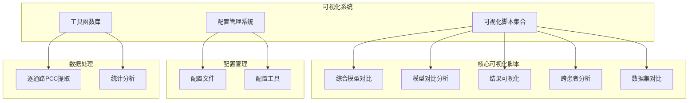

**图表来源**
- [visualize_all_models.py:1-926](file://visualize_all_models.py#L1-L926)
- [visualize_model_comparison.py:1-403](file://visualize_model_comparison.py#L1-L403)
- [visualize_results.py:1-951](file://visualize_results.py#L1-L951)

**章节来源**
- [README.md:1-44](file://README.md#L1-L44)
- [config.yaml:1-32](file://config.yaml#L1-L32)

## 核心组件

### 可视化脚本模块

系统包含多个专门的可视化脚本，每个都有独特的功能和应用场景：

#### 综合模型对比系统
- **visualize_all_models.py**: 生成五模型综合对比报告，包含单患者训练和跨患者泛化分析
- **visualize_model_comparison.py**: 多模型训练结果对比可视化，生成2×2综合对比图表

#### 结果可视化系统
- **visualize_results.py**: 通用可视化脚本，包含训练曲线、参数面板、指标表格等功能
- **visualize_cross_patient.py**: 跨患者泛化训练结果对比可视化

#### 数据集对比系统
- **compare_datasets.py**: HisToGene三数据集训练结果对比可视化
- **extract_per_pathway_pcc.py**: 逐通路PCC提取和汇总分析

**章节来源**
- [visualize_all_models.py:1-926](file://visualize_all_models.py#L1-L926)
- [visualize_model_comparison.py:1-403](file://visualize_model_comparison.py#L1-L403)
- [visualize_results.py:1-951](file://visualize_results.py#L1-L951)
- [visualize_cross_patient.py:1-422](file://visualize_cross_patient.py#L1-L422)

### 配置管理系统

系统采用统一的配置管理机制，确保在不同环境下的灵活部署：

#### 配置文件结构
- **config.yaml**: 主配置文件，包含数据路径、HuggingFace配置、训练配置等
- **config_utils.py**: 配置工具库，提供路径解析、设备选择等功能

#### 配置特点
- 支持绝对路径和相对路径
- 自动检测项目根目录
- 环境变量优先级处理
- 路径解析和验证

**章节来源**
- [config.yaml:1-32](file://config.yaml#L1-L32)
- [config_utils.py:1-294](file://config_utils.py#L1-L294)

## 架构概览

可视化系统采用分层架构设计，确保模块间的松耦合和高内聚：

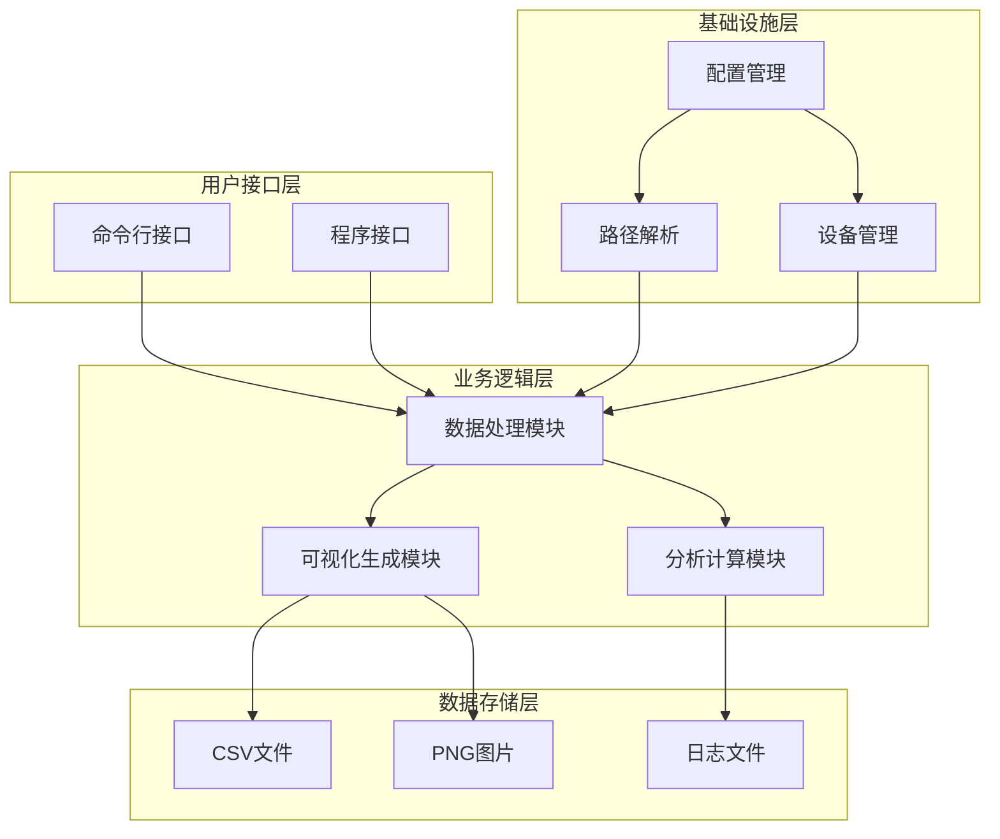

**图表来源**
- [config_utils.py:17-257](file://config_utils.py#L17-L257)
- [visualize_results.py:83-126](file://visualize_results.py#L83-L126)

### 数据流架构

系统采用流水线式数据处理架构，确保数据在各个模块间的顺畅传递：

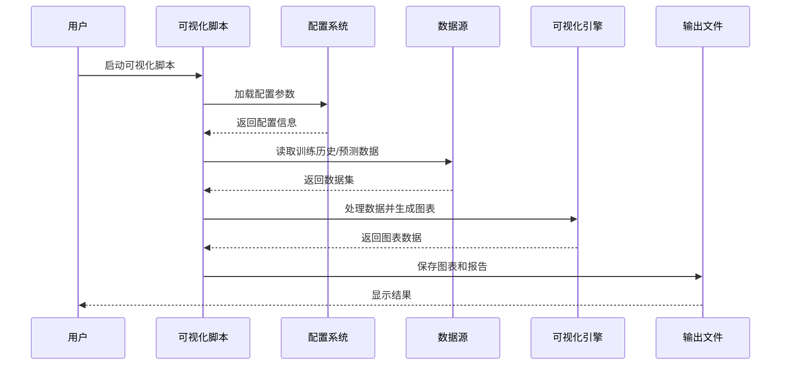

**图表来源**
- [visualize_all_models.py:123-184](file://visualize_all_models.py#L123-L184)
- [visualize_results.py:93-126](file://visualize_results.py#L93-L126)

## 详细组件分析

### 综合模型对比系统

#### visualize_all_models.py 分析

该脚本是系统的核心组件，负责生成五模型（HisToGene、HisToGene-UNI、EGN-v1、EGN-v2、EGN-v2+UNI）的综合对比报告。

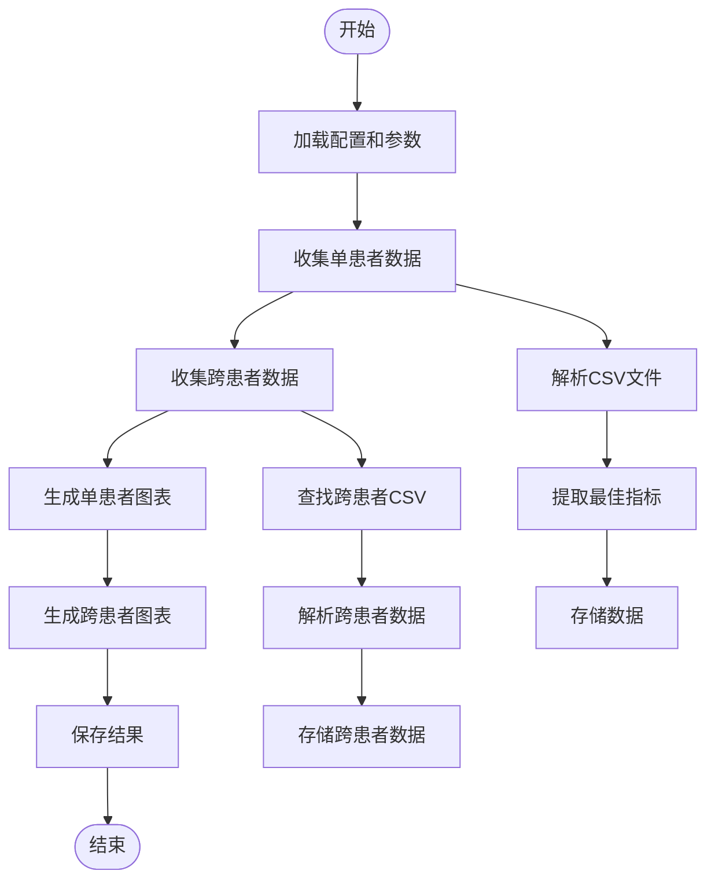

**图表来源**
- [visualize_all_models.py:123-184](file://visualize_all_models.py#L123-L184)
- [visualize_all_models.py:190-242](file://visualize_all_models.py#L190-L242)

##### 数据收集机制

系统实现了智能的数据收集机制，能够自动查找和解析不同模型的训练历史文件：

| 模型类型 | 文件模式 | 优先级 | 处理逻辑 |
|---------|---------|--------|---------|
| HisToGene | training_history_{ds}.csv | 高 | 排除UNI文件，确保纯HisToGene数据 |
| HisToGene-UNI | training_history_{ds}_UNI.csv | 高 | 优先查找UNI版本 |
| EGN-v1 | training_history_{ds}.csv | 中 | 标准EGN-v1数据 |
| EGN-v2 | training_history_{ds}.csv | 中 | 排除UNI版本 |
| EGN-v2+UNI | training_history_{ds}_UNI.csv | 高 | 专门的UNI增强版本 |

**章节来源**
- [visualize_all_models.py:123-184](file://visualize_all_models.py#L123-L184)
- [visualize_all_models.py:190-242](file://visualize_all_models.py#L190-L242)

#### visualize_model_comparison.py 分析

该脚本专注于多模型训练结果的对比分析，生成标准化的2×2对比图表。

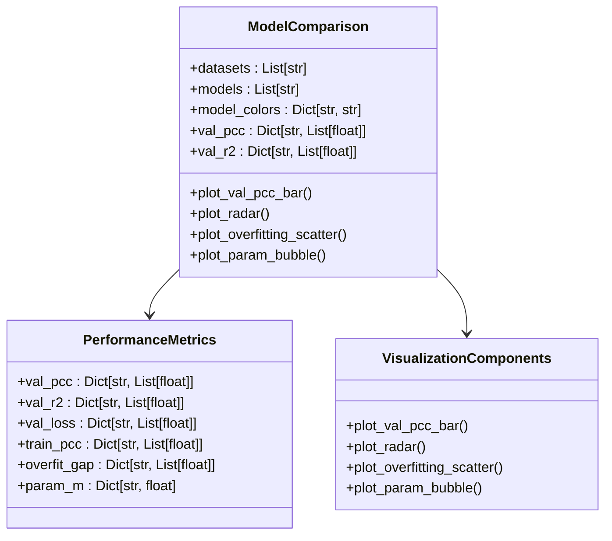

**图表来源**
- [visualize_model_comparison.py:46-103](file://visualize_model_comparison.py#L46-L103)
- [visualize_model_comparison.py:115-171](file://visualize_model_comparison.py#L115-L171)

**章节来源**
- [visualize_model_comparison.py:1-403](file://visualize_model_comparison.py#L1-L403)

### 结果可视化系统

#### visualize_results.py 分析

该脚本提供了最通用的可视化功能，能够生成完整的训练结果报告。

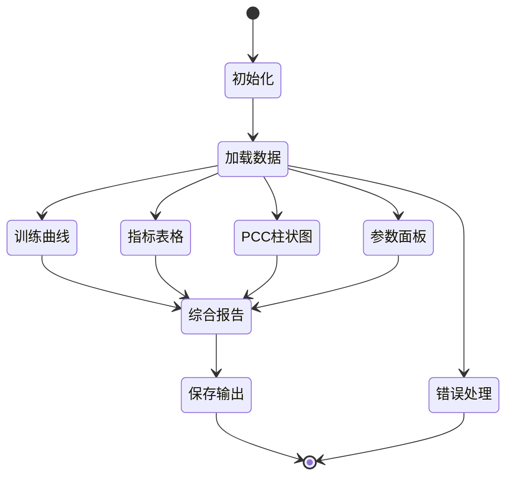

**图表来源**
- [visualize_results.py:210-278](file://visualize_results.py#L210-L278)
- [visualize_results.py:527-800](file://visualize_results.py#L527-L800)

##### 多样化可视化组件

系统提供了四种核心可视化组件，每种都有特定的分析价值：

| 组件类型 | 功能描述 | 输出格式 | 应用场景 |
|---------|---------|---------|---------|
| 训练曲线 | Loss、MAE、R²、PCC随epoch变化 | PNG图片 | 训练过程监控 |
| 参数面板 | 模型配置参数展示 | PNG图片 | 配置记录和分享 |
| 指标表格 | 逐通路指标汇总 | PNG图片 | 详细性能分析 |
| PCC柱状图 | 逐通路PCC对比 | PNG图片 | 通路性能可视化 |

**章节来源**
- [visualize_results.py:210-278](file://visualize_results.py#L210-L278)
- [visualize_results.py:366-450](file://visualize_results.py#L366-L450)
- [visualize_results.py:456-521](file://visualize_results.py#L456-L521)

### 跨患者分析系统

#### visualize_cross_patient.py 分析

该脚本专门处理跨患者泛化分析，比较单患者训练和跨患者测试的性能差异。

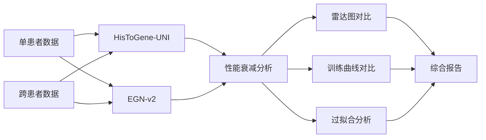

**图表来源**
- [visualize_cross_patient.py:60-81](file://visualize_cross_patient.py#L60-L81)
- [visualize_cross_patient.py:88-151](file://visualize_cross_patient.py#L88-L151)

**章节来源**
- [visualize_cross_patient.py:1-422](file://visualize_cross_patient.py#L1-L422)

### 数据集对比系统

#### compare_datasets.py 分析

该脚本专注于HisToGene模型在三个数据集（HYZ15040、JFX0729、LMZ12939）上的对比分析。

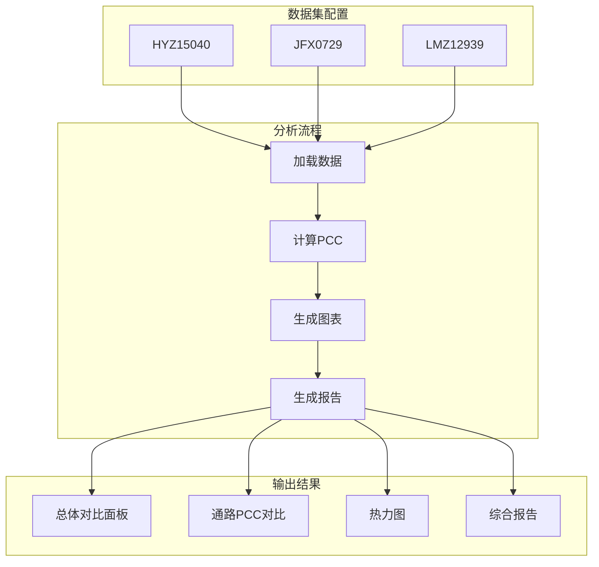

**图表来源**
- [compare_datasets.py:24-37](file://compare_datasets.py#L24-L37)
- [compare_datasets.py:134-250](file://compare_datasets.py#L134-L250)

**章节来源**
- [compare_datasets.py:1-546](file://compare_datasets.py#L1-L546)

## 依赖分析

### 外部依赖关系

系统依赖于多个Python库来实现完整的可视化功能：

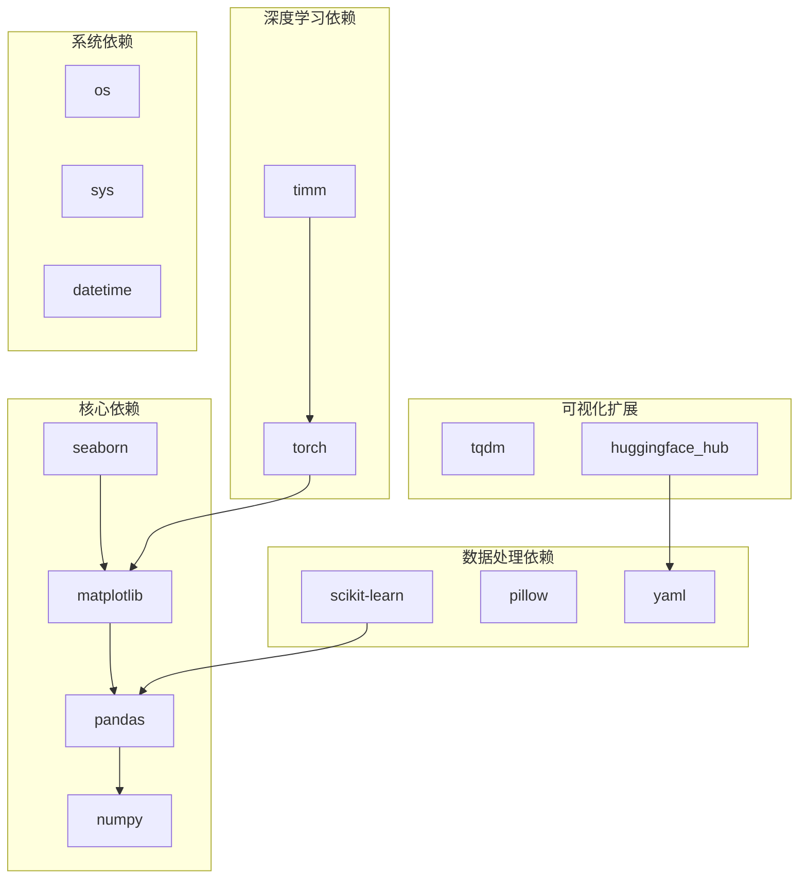

**图表来源**
- [config_utils.py:8-11](file://config_utils.py#L8-L11)
- [visualize_results.py:26-39](file://visualize_results.py#L26-L39)

### 内部模块依赖

系统内部模块之间存在清晰的依赖关系，遵循单一职责原则：

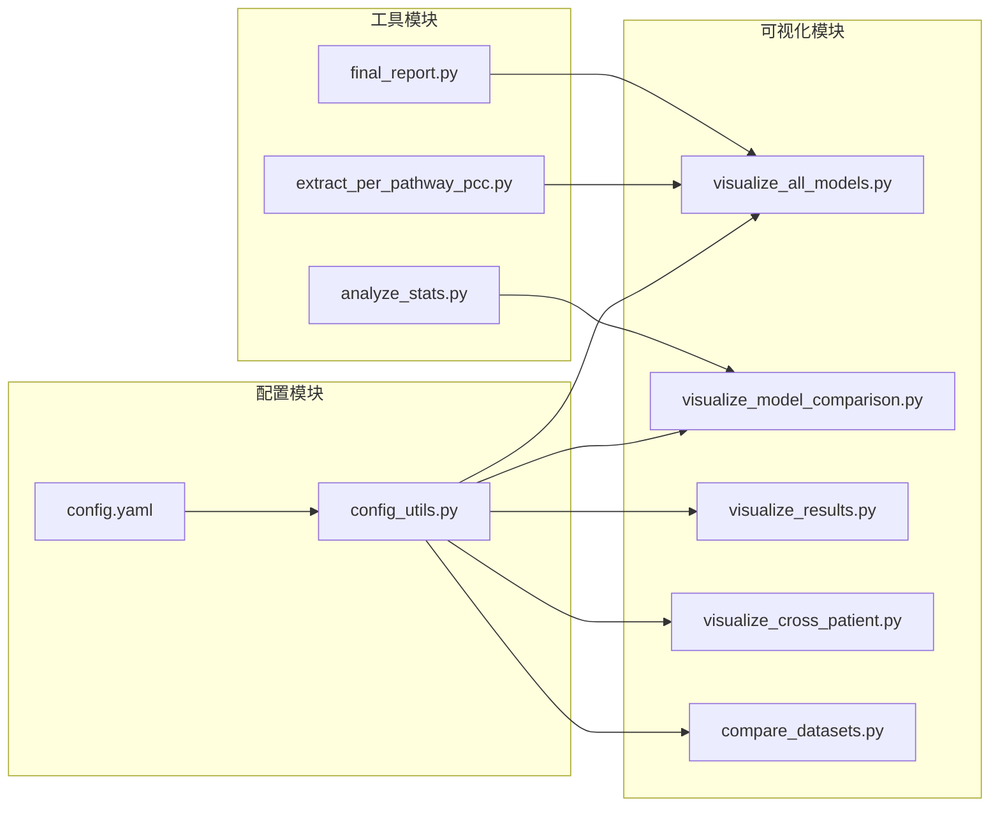

**图表来源**
- [config_utils.py:49-88](file://config_utils.py#L49-L88)
- [visualize_all_models.py:17-26](file://visualize_all_models.py#L17-L26)

**章节来源**
- [config_utils.py:1-294](file://config_utils.py#L1-L294)
- [visualize_all_models.py:17-26](file://visualize_all_models.py#L17-L26)

## 性能考虑

### 内存优化策略

系统在设计时充分考虑了内存使用效率：

#### 数据加载优化
- **延迟加载**: 只在需要时加载CSV文件
- **数据类型优化**: 使用适当的numpy数据类型减少内存占用
- **批处理机制**: 对大数据集采用分批处理策略

#### 图像生成优化
- **分辨率控制**: 统一使用300 DPI确保高质量输出
- **字体缓存**: 避免重复字体查找操作
- **图形对象复用**: 在可能的情况下复用matplotlib对象

### 并发处理能力

系统支持多线程和异步处理：

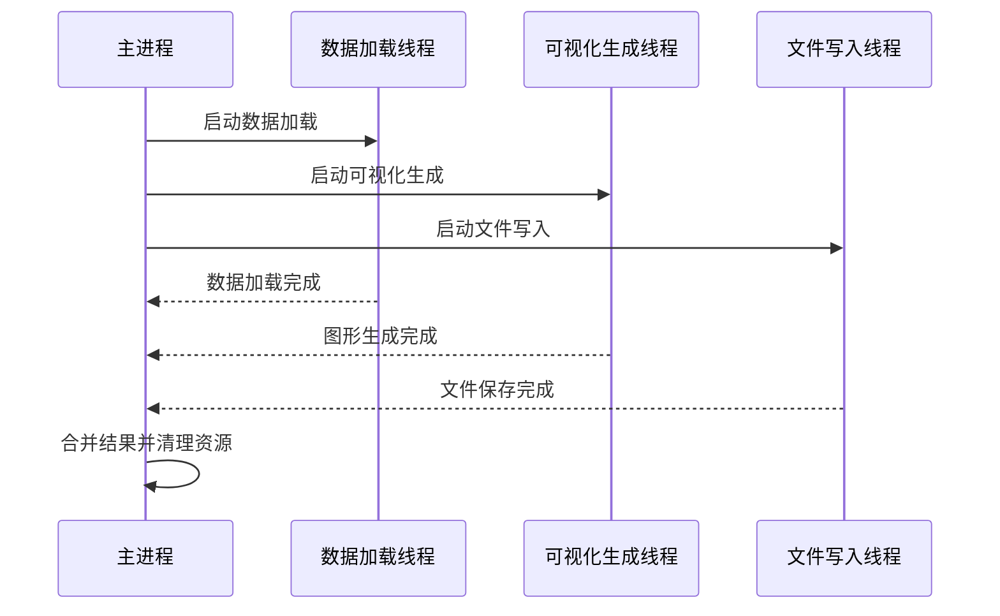

**图表来源**
- [visualize_all_models.py:123-184](file://visualize_all_models.py#L123-L184)
- [visualize_results.py:93-126](file://visualize_results.py#L93-L126)

## 故障排除指南

### 常见问题及解决方案

#### 配置文件问题
- **问题**: config.yaml路径解析失败
- **解决方案**: 检查路径格式，确保使用正确的分隔符

#### 依赖库问题
- **问题**: matplotlib中文字体显示异常
- **解决方案**: 安装系统中文字体或在代码中设置字体

#### 数据文件问题
- **问题**: CSV文件格式不正确
- **解决方案**: 使用提供的数据验证脚本检查文件完整性

#### 内存不足问题
- **问题**: 大数据集处理时内存溢出
- **解决方案**: 减小批量大小或增加系统内存

**章节来源**
- [服务器部署指南.md:439-535](file://服务器部署指南.md#L439-L535)

### 调试工具

系统提供了多种调试和监控工具：

#### 日志记录系统
- **训练状态文件**: 记录训练进度和结果
- **错误日志**: 详细记录异常信息
- **性能监控**: 监控内存和CPU使用情况

#### 数据验证工具
- **统计分析脚本**: 分析数据分布和异常值
- **数据一致性检查**: 验证不同来源数据的一致性

**章节来源**
- [notify_utils.py:10-80](file://notify_utils.py#L10-L80)
- [analyze_stats.py:1-40](file://analyze_stats.py#L1-L40)

## 结论

PFMval可视化系统是一个功能完备、架构清晰的深度学习模型分析平台。系统通过模块化设计实现了高度的可维护性和扩展性，为研究人员提供了强大的数据分析和可视化能力。

### 主要优势

1. **模块化设计**: 清晰的功能分离和职责划分
2. **配置灵活性**: 统一的配置管理支持多环境部署
3. **可视化丰富**: 多种图表类型满足不同分析需求
4. **性能优化**: 针对大数据集的内存和处理优化
5. **易用性强**: 简洁的API和详细的使用指南

### 发展建议

1. **自动化程度提升**: 增加更多的自动化分析功能
2. **交互式可视化**: 考虑添加交互式图表支持
3. **云端部署**: 支持云端服务部署和远程访问
4. **移动端适配**: 优化移动端的可视化体验
5. **实时监控**: 添加实时训练监控功能

该系统为深度学习模型的分析和展示提供了坚实的技术基础，具有良好的扩展前景和应用价值。

## 附录

### 使用指南

#### 基本使用流程
1. **环境准备**: 确保Python环境和依赖库安装完成
2. **配置设置**: 修改config.yaml文件设置正确的路径
3. **数据准备**: 准备训练历史和预测结果数据
4. **运行脚本**: 执行相应的可视化脚本
5. **结果查看**: 在输出目录查看生成的图表

#### 高级配置选项
- **自定义颜色方案**: 修改matplotlib颜色配置
- **分辨率调整**: 根据需要调整输出图片分辨率
- **图表样式定制**: 修改图表布局和样式参数

**章节来源**
- [PFMval学习指南.md:188-217](file://PFMval学习指南.md#L188-L217)
- [服务器部署指南.md:321-418](file://服务器部署指南.md#L321-L418)