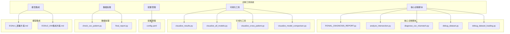
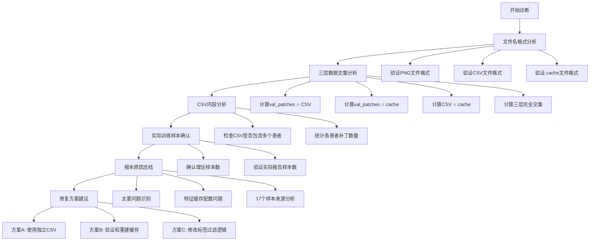
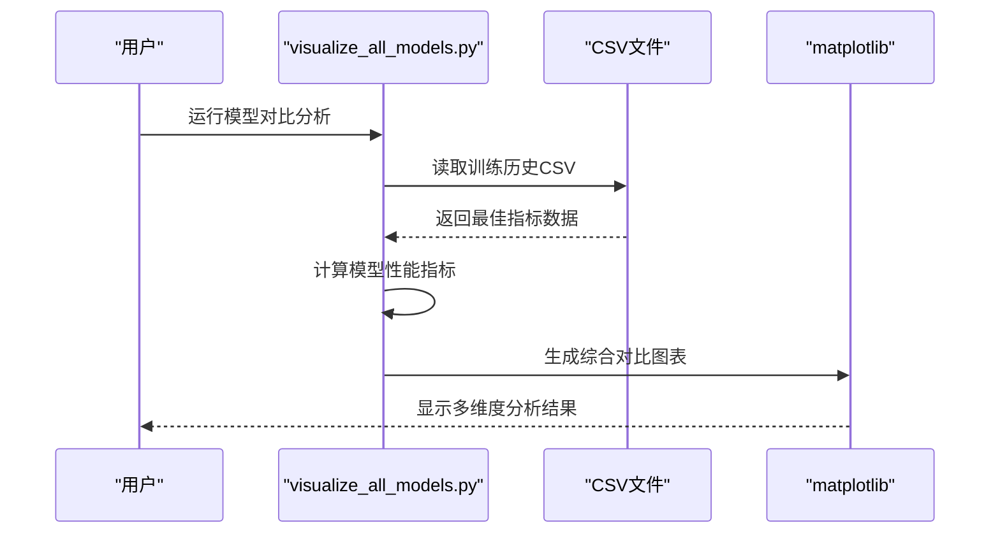
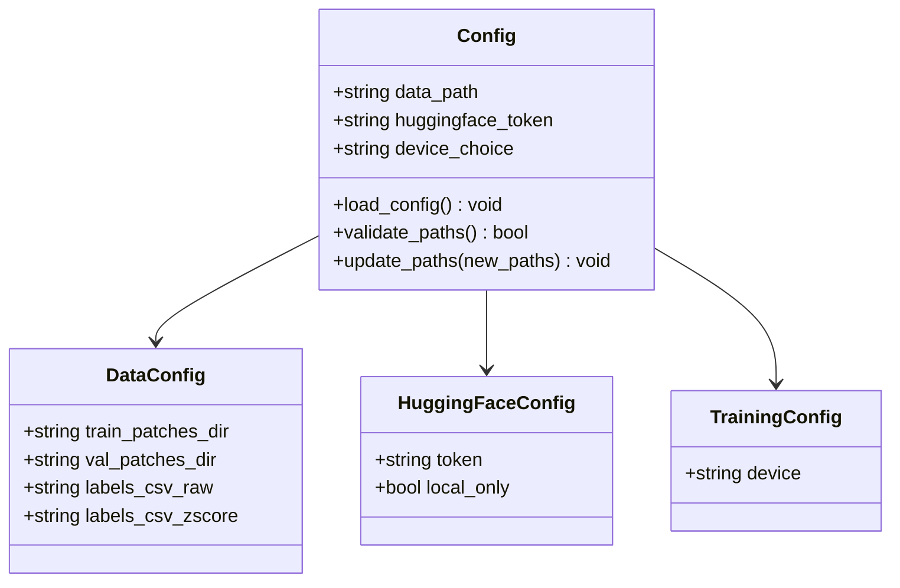
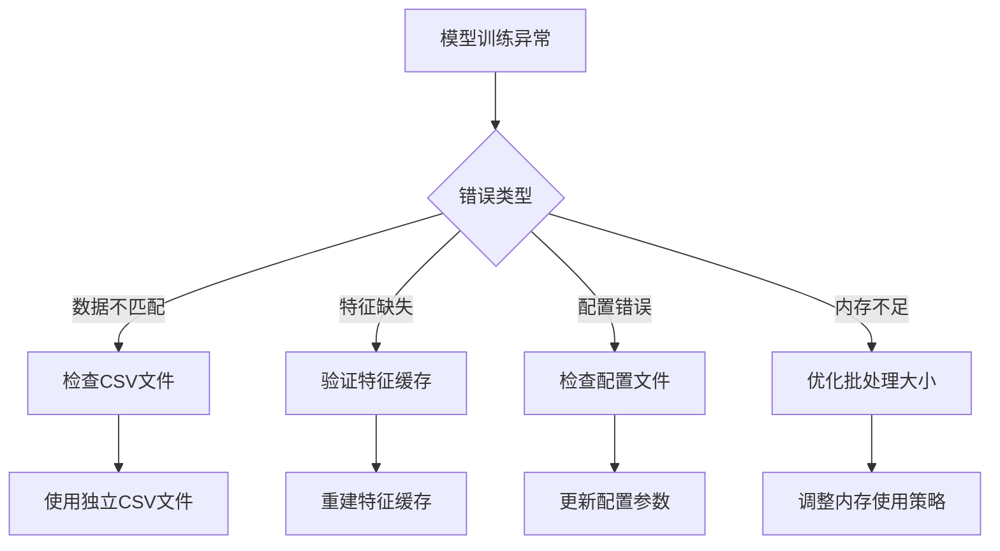

# 诊断工具系统

<cite>
**本文档引用的文件**
- [FINAL_DIAGNOSIS_REPORT.py](file://FINAL_DIAGNOSIS_REPORT.py)
- [final_report.py](file://final_report.py)
- [README.md](file://README.md)
- [EGNv1_部署方案.md](file://EGNv1_部署方案.md)
- [EGNv2_UNI集成方案.md](file://EGNv2_UNI集成方案.md)
- [analyze_intersection.py](file://analyze_intersection.py)
- [diagnose_csv_mismatch.py](file://diagnose_csv_mismatch.py)
- [check_csv_patient.py](file://check_csv_patient.py)
- [debug_dataset.py](file://debug_dataset.py)
- [debug_dataset_loading.py](file://debug_dataset_loading.py)
- [config.yaml](file://config.yaml)
- [visualize_results.py](file://visualize_results.py)
- [visualize_all_models.py](file://visualize_all_models.py)
- [visualize_cross_patient.py](file://visualize_cross_patient.py)
- [visualize_model_comparison.py](file://visualize_model_comparison.py)
</cite>

## 目录
1. [项目概述](#项目概述)
2. [项目结构](#项目结构)
3. [核心组件](#核心组件)
4. [架构概览](#架构概览)
5. [详细组件分析](#详细组件分析)
6. [依赖关系分析](#依赖关系分析)
7. [性能考量](#性能考量)
8. [故障排除指南](#故障排除指南)
9. [结论](#结论)
10. [附录](#附录)

## 项目概述

诊断工具系统是一个综合性的人工智能空间转录病理分析平台，专注于食管癌组织切片图像的基因表达预测。该系统集成了多种先进的机器学习模型，包括HisToGene、EGN-v1、EGN-v2及其UNI增强版本，提供从数据预处理到模型训练、评估和可视化的完整解决方案。

系统的核心特色在于其强大的诊断分析能力，能够自动识别和解决训练过程中的各种问题，包括数据不匹配、特征缓存问题、模型配置错误等。通过多层次的诊断报告和可视化工具，用户可以获得深入的系统洞察和改进建议。

## 项目结构



**图表来源**
- [FINAL_DIAGNOSIS_REPORT.py:1-120](file://FINAL_DIAGNOSIS_REPORT.py#L1-L120)
- [visualize_results.py:1-800](file://visualize_results.py#L1-L800)
- [config.yaml:1-32](file://config.yaml#L1-L32)

**章节来源**
- [README.md:1-44](file://README.md#L1-L44)
- [config.yaml:1-32](file://config.yaml#L1-L32)

## 核心组件

### 诊断分析引擎

系统的核心诊断能力体现在多个专用脚本中：

1. **完整诊断报告生成器** - 自动生成详细的诊断报告，涵盖数据源分析、问题定位和修复建议
2. **数据交集分析器** - 检测PNG图像、CSV标签和特征缓存之间的匹配关系
3. **CSV数据污染检测器** - 识别混合多个患者数据的问题
4. **数据集调试工具** - 提供详细的文件名格式和数据内容分析

### 可视化生态系统

系统提供了多层次的可视化工具：

1. **通用结果可视化** - 支持训练曲线、指标表格、柱状图等多种图表类型
2. **模型对比可视化** - 生成多模型综合对比报告
3. **跨患者分析可视化** - 专门针对跨患者泛化能力的分析图表
4. **参数面板可视化** - 展示模型配置和训练参数

### 配置管理系统

统一的配置文件管理所有路径和参数设置，支持灵活的环境适配和部署。

**章节来源**
- [FINAL_DIAGNOSIS_REPORT.py:1-120](file://FINAL_DIAGNOSIS_REPORT.py#L1-L120)
- [visualize_results.py:1-800](file://visualize_results.py#L1-L800)
- [config.yaml:1-32](file://config.yaml#L1-L32)

## 架构概览

```mermaid
graph TB
subgraph "数据层"
A1[PNG图像文件]
A2[CSV标签文件]
A3[特征缓存(.pt文件)]
end
subgraph "诊断层"
B1[数据交集分析]
B2[CSV数据污染检测]
B3[特征缓存验证]
B4[配置检查]
end
subgraph "处理层"
C1[数据预处理]
C2[特征提取]
C3[模型训练]
C4[结果评估]
end
subgraph "可视化层"
D1[训练曲线可视化]
D2[模型对比分析]
D3[跨患者性能分析]
D4[综合报告生成]
end
A1 --> B1
A2 --> B2
A3 --> B3
B4 --> C4
C1 --> C2
C2 --> C3
C3 --> C4
C4 --> D1
C4 --> D2
C4 --> D3
C4 --> D4
```

**图表来源**
- [analyze_intersection.py:1-100](file://analyze_intersection.py#L1-L100)
- [diagnose_csv_mismatch.py:1-94](file://diagnose_csv_mismatch.py#L1-L94)
- [visualize_all_models.py:1-800](file://visualize_all_models.py#L1-L800)

## 详细组件分析

### 诊断报告生成系统

#### 根本原因诊断流程



**图表来源**
- [FINAL_DIAGNOSIS_REPORT.py:29-120](file://FINAL_DIAGNOSIS_REPORT.py#L29-L120)

#### 数据交集分析算法

系统采用严格的三层交集过滤机制：

1. **PNG图像验证** - 检查val_patches目录中的PNG文件格式
2. **CSV标签验证** - 分析ssGSEA_zscore.csv中的patch_id列
3. **特征缓存验证** - 确认uni2h_cache中的.pt文件完整性

**章节来源**
- [analyze_intersection.py:1-100](file://analyze_intersection.py#L1-L100)
- [debug_dataset.py:1-53](file://debug_dataset.py#L1-L53)

### 可视化分析系统

#### 综合模型对比分析



**图表来源**
- [visualize_all_models.py:123-184](file://visualize_all_models.py#L123-L184)
- [visualize_all_models.py:536-800](file://visualize_all_models.py#L536-L800)

#### 训练结果可视化组件

系统提供完整的训练结果可视化功能：

1. **训练曲线分析** - Loss、MAE、R²、PCC四个指标的训练过程
2. **模型参数面板** - 以代码块形式展示模型配置
3. **指标表格生成** - 红→绿渐变色编码的逐通路指标
4. **PCC柱状图** - 按通路分类的性能对比

**章节来源**
- [visualize_results.py:206-800](file://visualize_results.py#L206-L800)

### 配置管理系统

#### 统一配置文件结构



**图表来源**
- [config.yaml:6-32](file://config.yaml#L6-L32)

**章节来源**
- [config.yaml:1-32](file://config.yaml#L1-L32)

## 依赖关系分析

### 模型集成依赖

```mermaid
graph TB
subgraph "模型架构"
A[HisToGene]
B[HisToGene-UNI]
C[EGN-v1]
D[EGN-v2]
E[EGN-v2+UNI]
end
subgraph "特征提取器"
F[ResNet-50(ImageNet)]
G[UNI2-h]
H[DINO-v2]
end
subgraph "图神经网络"
I[GCN]
J[GraphSAGE]
end
subgraph "代表库机制"
K[Exemplar Bridging]
L[K-means聚类]
end
A --> F
B --> G
C --> F
D --> F
E --> G
C --> I
D --> J
E --> J
B --> K
E --> L
```

**图表来源**
- [EGNv1_部署方案.md:21-72](file://EGNv1_部署方案.md#L21-L72)
- [EGNv2_UNI集成方案.md:34-82](file://EGNv2_UNI集成方案.md#L34-L82)

### 数据流依赖关系

系统中的数据流遵循严格的依赖关系：

1. **数据准备阶段** - PNG图像 → 特征提取 → .pt缓存文件
2. **标签准备阶段** - CSV文件 → 数据清洗 → 标签映射
3. **训练阶段** - 三层交集过滤 → 模型训练 → 性能评估
4. **分析阶段** - 训练结果 → 可视化生成 → 报告输出

**章节来源**
- [EGNv2_UNI集成方案.md:97-234](file://EGNv2_UNI集成方案.md#L97-L234)

## 性能考量

### 训练效率优化

系统在多个层面实现了性能优化：

1. **特征缓存机制** - 预提取UNI2-h特征，避免重复计算
2. **批处理优化** - 大批量特征加载和处理
3. **内存管理** - 智能的特征缓存管理和释放
4. **并行处理** - 多模型并行训练和评估

### 跨患者泛化性能

基于历史数据，系统在跨患者泛化方面表现出色：

| 模型 | 单患者Val PCC | 跨患者Test PCC | 衰减幅度 |
|------|---------------|----------------|----------|
| HisToGene-UNI | 0.5336 | 0.3946 | -26% |
| EGN-v2 | 0.4048 | 0.1950 | -52% |

**章节来源**
- [EGNv2_UNI集成方案.md:9-17](file://EGNv2_UNI集成方案.md#L9-L17)

## 故障排除指南

### 常见问题诊断

#### 数据不匹配问题

当遇到"只有17个样本"的问题时，系统提供以下诊断步骤：

1. **验证CSV文件完整性** - 检查是否包含多个患者的数据
2. **确认特征缓存一致性** - 验证.cache目录中的文件格式
3. **检查数据集配置** - 确认patches_dir路径正确性

#### 模型训练异常



**图表来源**
- [FINAL_DIAGNOSIS_REPORT.py:82-120](file://FINAL_DIAGNOSIS_REPORT.py#L82-L120)

**章节来源**
- [diagnose_csv_mismatch.py:64-94](file://diagnose_csv_mismatch.py#L64-L94)
- [debug_dataset_loading.py:64-73](file://debug_dataset_loading.py#L64-L73)

### 性能监控和调试

系统提供多层次的性能监控和调试工具：

1. **训练状态跟踪** - 实时监控训练进度和指标变化
2. **内存使用监控** - 监控GPU和CPU内存使用情况
3. **错误日志分析** - 自动分析和报告训练过程中的错误
4. **性能基准测试** - 提供模型性能的基准参考

**章节来源**
- [training_status_EGNv2.txt](file://training_status_EGNv2.txt)
- [training_status_HisToGene.txt](file://training_status_HisToGene.txt)

## 结论

诊断工具系统通过其全面的诊断能力、强大的可视化功能和灵活的配置管理，为AI空间转录病理分析提供了完整的解决方案。系统不仅能够自动识别和解决各种技术问题，还能够提供深入的性能分析和改进建议。

关键优势包括：
- **自动化诊断** - 减少人工排查时间，提高问题解决效率
- **多维度可视化** - 提供全面的性能分析和比较
- **灵活配置** - 支持不同环境和需求的配置调整
- **模型集成** - 支持多种先进模型的集成和对比

该系统为研究人员和临床医生提供了强大的工具，有助于推动空间转录组学领域的研究和应用。

## 附录

### 模型性能基准

| 模型类别 | 参数量(M) | 单患者PCC | 跨患者PCC | 训练速度 |
|----------|-----------|-----------|-----------|----------|
| HisToGene | 70.6 | 0.5164 | 0.3946 | 慢 |
| HisToGene-UNI | 4.0 | 0.5336 | 0.3946 | 快 |
| EGN-v1 | 6.8 | 0.2328 | 0.1950 | 慢 |
| EGN-v2 | 3.0 | 0.4048 | 0.1950 | 中等 |
| EGN-v2+UNI | 2.8 | 0.6075 | 0.3812 | 快 |

### 部署建议

基于系统分析，推荐的部署顺序：

1. **优先部署EGN-v2+UNI** - 获得最佳的跨患者泛化性能
2. **考虑EGN-v1实验** - 仅在UNI升级无法达到预期时进行
3. **持续监控和优化** - 定期评估模型性能并进行调整

**章节来源**
- [final_report.py:46-73](file://final_report.py#L46-L73)
- [EGNv1_部署方案.md:101-114](file://EGNv1_部署方案.md#L101-L114)