# 通路分析工具

<cite>
**本文档引用的文件**
- [README.md](file://README.md)
- [config.yaml](file://config.yaml)
- [config_utils.py](file://config_utils.py)
- [analyze_stats.py](file://analyze_stats.py)
- [extract_uni_features_3st.py](file://extract_uni_features_3st.py)
- [uni2h/uni2h_utils.py](file://uni2h/uni2h_utils.py)
- [uni2h/train.py](file://uni2h/train.py)
- [uni2h/infer.py](file://uni2h/infer.py)
- [egnv1/dataset.py](file://egnv1/dataset.py)
- [egnv1/model.py](file://egnv1/model.py)
- [egnv2/dataset.py](file://egnv2/dataset.py)
- [egnv2/model.py](file://egnv2/model.py)
- [histogene/model.py](file://histogene/model.py)
- [analyze_intersection.py](file://analyze_intersection.py)
- [visualize_results.py](file://visualize_results.py)
</cite>

## 目录
1. [简介](#简介)
2. [项目结构](#项目结构)
3. [核心组件](#核心组件)
4. [架构概览](#架构概览)
5. [详细组件分析](#详细组件分析)
6. [依赖关系分析](#依赖关系分析)
7. [性能考虑](#性能考虑)
8. [故障排除指南](#故障排除指南)
9. [结论](#结论)
10. [附录](#附录)

## 简介

通路分析工具是一个基于深度学习的多模型通路评分预测系统，专门用于分析空间转录组学数据中的信号通路活性。该工具集成了多种先进的机器学习模型，包括UNI2-h特征提取器、HisToGene模型、EGN-v1和EGN-v2图神经网络模型。

该系统的核心功能包括：
- 多模型通路评分预测
- 空间位置信息融合
- 特征缓存机制
- 训练历史可视化
- 数据质量验证

## 项目结构

项目采用模块化设计，按照功能层次组织：

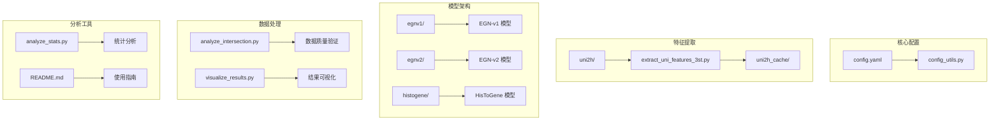

**图表来源**
- [config.yaml](file://config.yaml)
- [config_utils.py](file://config_utils.py)
- [uni2h/uni2h_utils.py](file://uni2h/uni2h_utils.py)
- [egnv1/model.py](file://egnv1/model.py)
- [egnv2/model.py](file://egnv2/model.py)
- [histogene/model.py](file://histogene/model.py)

**章节来源**
- [README.md](file://README.md)
- [config.yaml](file://config.yaml)

## 核心组件

### 配置管理系统

配置系统提供了统一的配置管理机制，支持多种配置源和路径解析：

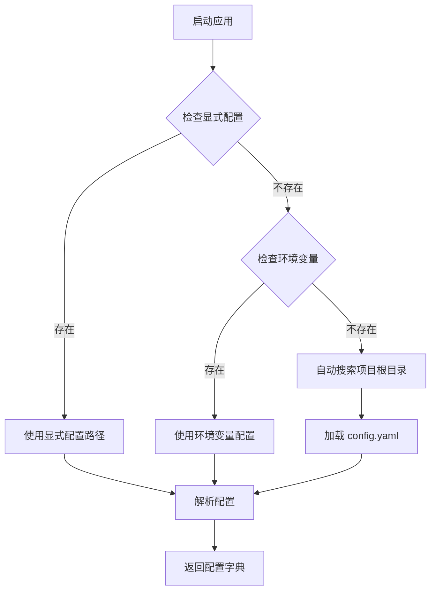

**图表来源**
- [config_utils.py](file://config_utils.py)

### 特征提取系统

系统支持三种主要的特征提取策略：

1. **UNI2-h特征提取**：使用MahmoodLab/UNI2-h模型提取1536维特征
2. **传统CNN特征**：使用ResNet-50提取2048维特征  
3. **ViT特征**：使用自实现ViT-Large提取1024维特征

**章节来源**
- [uni2h/uni2h_utils.py](file://uni2h/uni2h_utils.py)
- [extract_uni_features_3st.py](file://extract_uni_features_3st.py)

## 架构概览

系统采用分层架构设计，从底层的数据处理到顶层的模型推理形成完整的数据流水线：

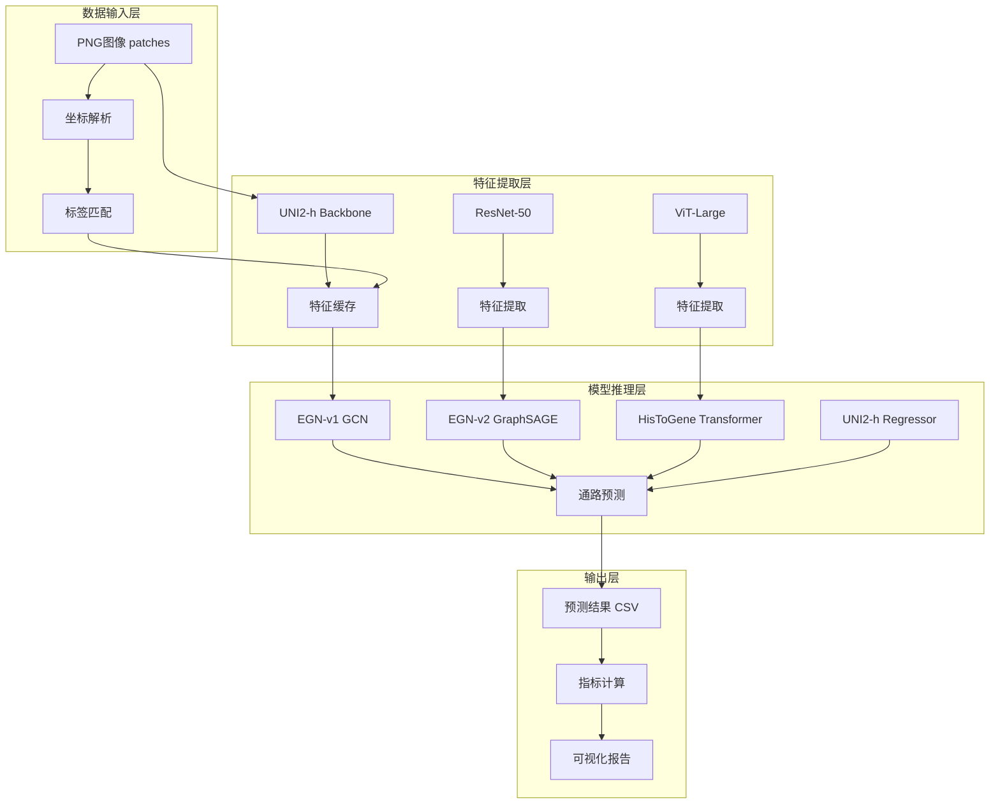

**图表来源**
- [egnv1/model.py](file://egnv1/model.py)
- [egnv2/model.py](file://egnv2/model.py)
- [histogene/model.py](file://histogene/model.py)
- [uni2h/uni2h_utils.py](file://uni2h/uni2h_utils.py)

## 详细组件分析

### UNI2-h特征提取系统

UNI2-h系统是整个通路分析工具的核心特征提取组件：

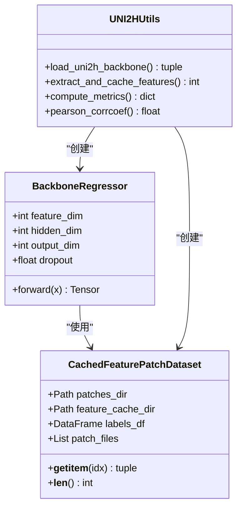

**图表来源**
- [uni2h/uni2h_utils.py](file://uni2h/uni2h_utils.py)

#### 训练流程

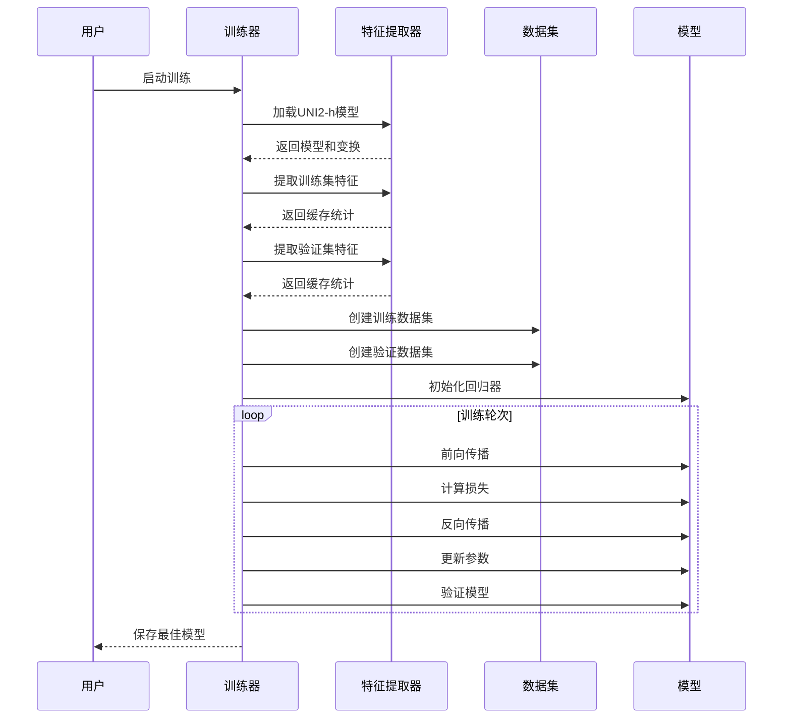

**图表来源**
- [uni2h/train.py](file://uni2h/train.py)
- [uni2h/uni2h_utils.py](file://uni2h/uni2h_utils.py)

**章节来源**
- [uni2h/train.py](file://uni2h/train.py)
- [uni2h/infer.py](file://uni2h/infer.py)

### EGN-v1图神经网络模型

EGN-v1模型基于GCN图卷积网络，专门设计用于处理空间位置信息：

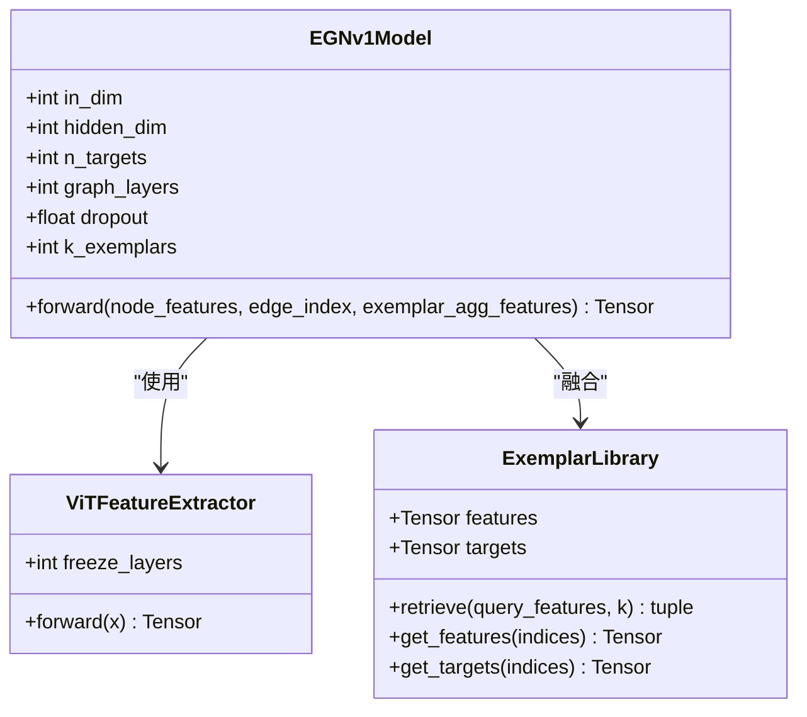

**图表来源**
- [egnv1/model.py](file://egnv1/model.py)

#### 数据集处理流程

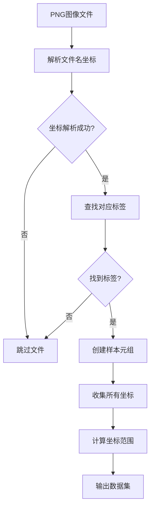

**图表来源**
- [egnv1/dataset.py](file://egnv1/dataset.py)

**章节来源**
- [egnv1/model.py](file://egnv1/model.py)
- [egnv1/dataset.py](file://egnv1/dataset.py)

### EGN-v2图神经网络模型

EGN-v2模型使用GraphSAGE图卷积，相比EGN-v1具有更好的扩展性：

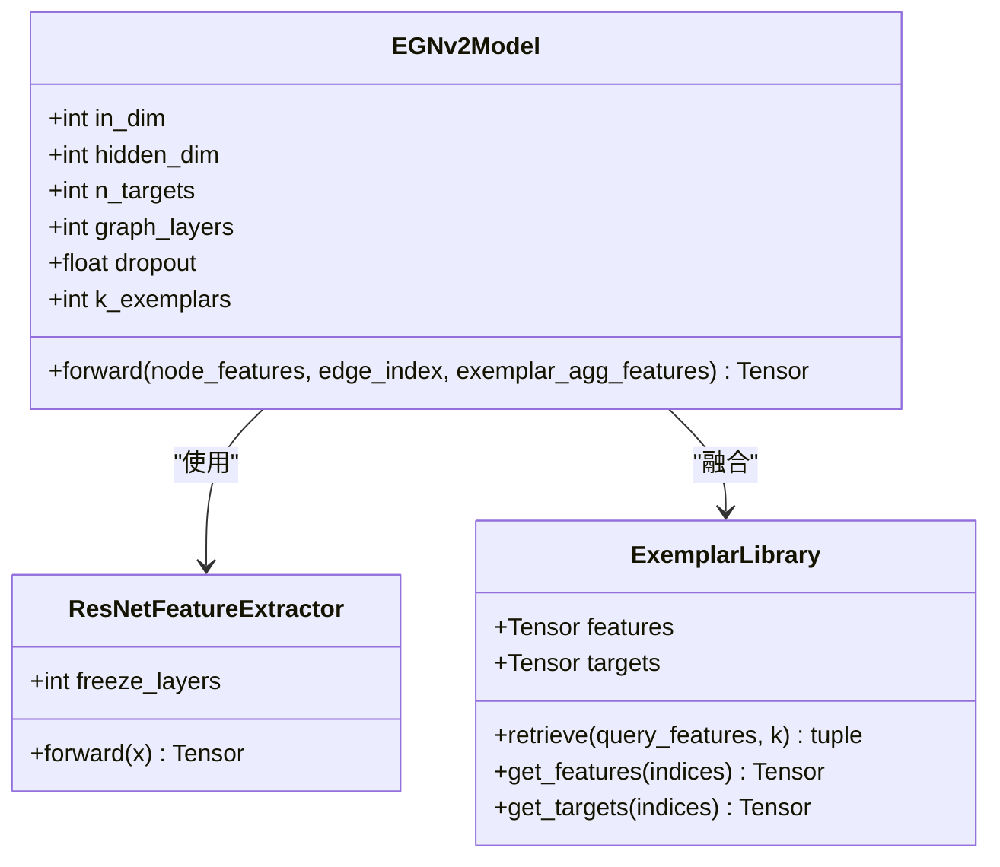

**图表来源**
- [egnv2/model.py](file://egnv2/model.py)

**章节来源**
- [egnv2/model.py](file://egnv2/model.py)
- [egnv2/dataset.py](file://egnv2/dataset.py)

### HisToGene模型

HisToGene模型采用纯Transformer架构，专门处理空间位置信息：

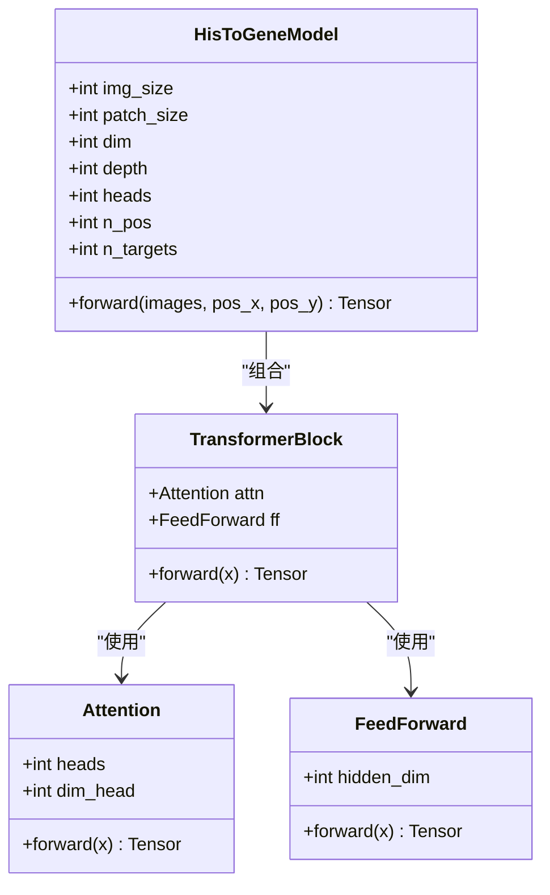

**图表来源**
- [histogene/model.py](file://histogene/model.py)

**章节来源**
- [histogene/model.py](file://histogene/model.py)

## 依赖关系分析

系统采用松耦合的设计，各组件之间通过清晰的接口进行交互：

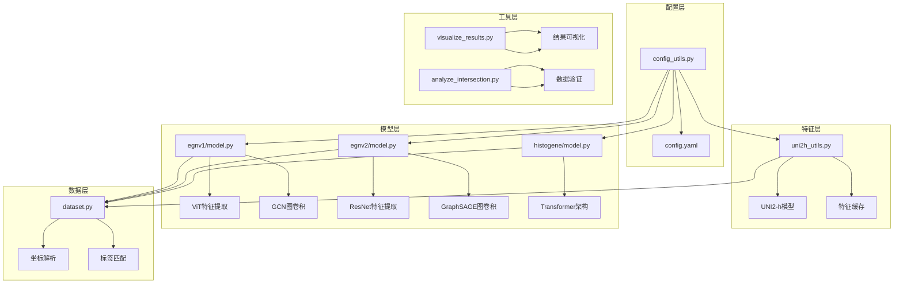

**图表来源**
- [config_utils.py](file://config_utils.py)
- [uni2h/uni2h_utils.py](file://uni2h/uni2h_utils.py)
- [egnv1/model.py](file://egnv1/model.py)
- [egnv2/model.py](file://egnv2/model.py)
- [histogene/model.py](file://histogene/model.py)
- [visualize_results.py](file://visualize_results.py)
- [analyze_intersection.py](file://analyze_intersection.py)

**章节来源**
- [config_utils.py](file://config_utils.py)
- [visualize_results.py](file://visualize_results.py)

## 性能考虑

### 特征缓存优化

系统实现了智能的特征缓存机制，避免重复计算：

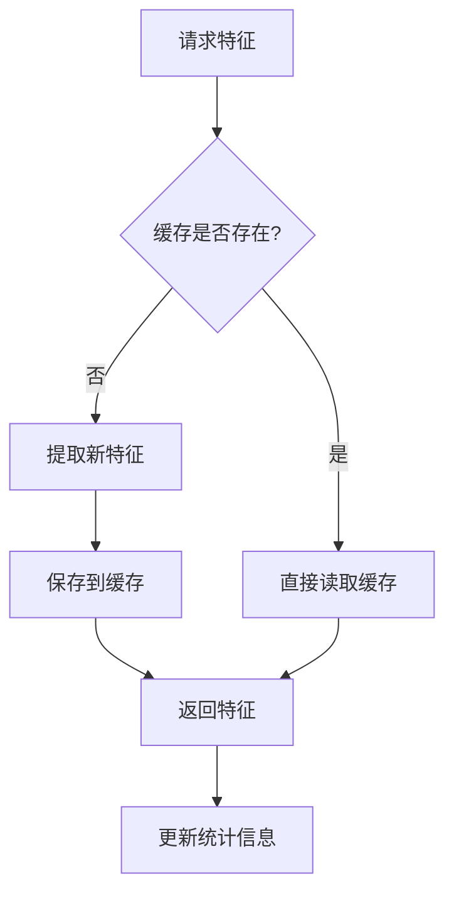

**图表来源**
- [uni2h/uni2h_utils.py](file://uni2h/uni2h_utils.py)

### 训练效率优化

系统采用了多种训练优化技术：

1. **早停机制**：防止过拟合
2. **学习率调度**：动态调整学习率
3. **批量处理**：GPU并行计算
4. **内存管理**：及时释放不需要的张量

## 故障排除指南

### 常见问题诊断

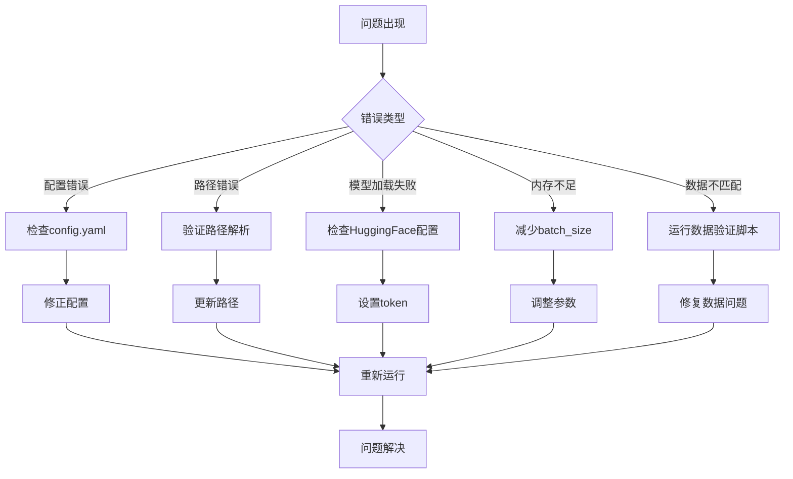

**图表来源**
- [config_utils.py](file://config_utils.py)
- [analyze_intersection.py](file://analyze_intersection.py)

### 数据质量验证

系统提供了完整的数据质量检查机制：

**章节来源**
- [analyze_intersection.py](file://analyze_intersection.py)
- [analyze_stats.py](file://analyze_stats.py)

## 结论

通路分析工具是一个功能完整、架构清晰的多模型通路评分预测系统。其主要特点包括：

1. **模块化设计**：各组件职责明确，易于维护和扩展
2. **多模型支持**：支持UNI2-h、EGN-v1、EGN-v2、HisToGene等多种模型
3. **智能缓存**：高效的特征缓存机制提升训练效率
4. **全面可视化**：提供丰富的结果可视化功能
5. **严格验证**：内置数据质量检查和统计分析工具

该系统为空间转录组学数据分析提供了强大的工具支持，能够有效预测30条信号通路的活性，并为后续的生物学解释提供可靠的基础。

## 附录

### 使用指南

1. **环境准备**：安装Python 3.10和必要的依赖包
2. **配置设置**：修改config.yaml中的路径配置
3. **数据准备**：准备PNG图像patches和对应的标签CSV文件
4. **特征提取**：运行特征提取脚本生成缓存
5. **模型训练**：选择合适的模型进行训练
6. **结果分析**：使用可视化工具分析训练结果

### 性能基准

- **UNI2-h特征提取**：单张图像约2-3秒（GPU）
- **模型训练**：每轮训练约10-30分钟（取决于数据集大小）
- **推理速度**：每批次约0.1-0.5秒（取决于batch_size）