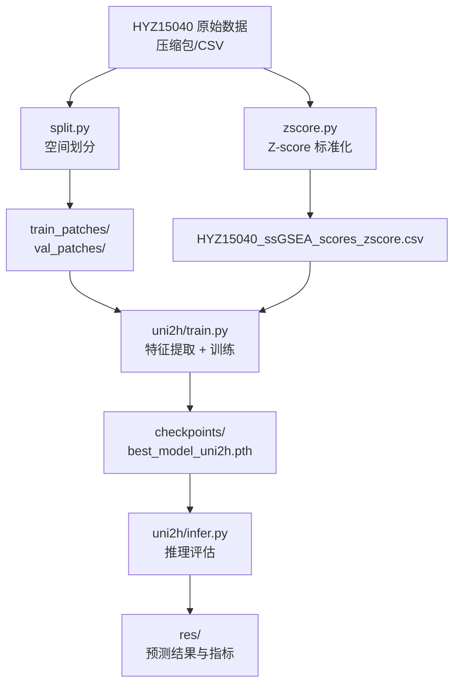
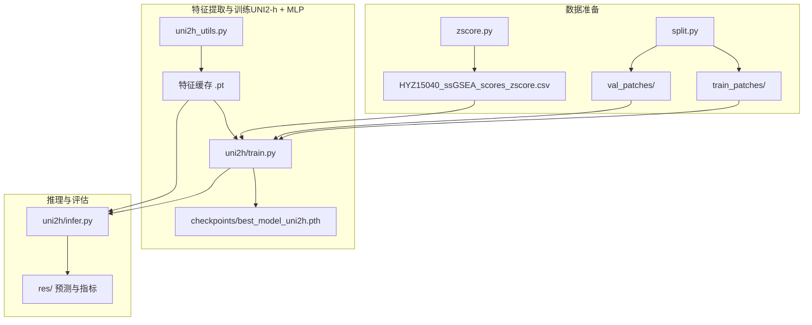
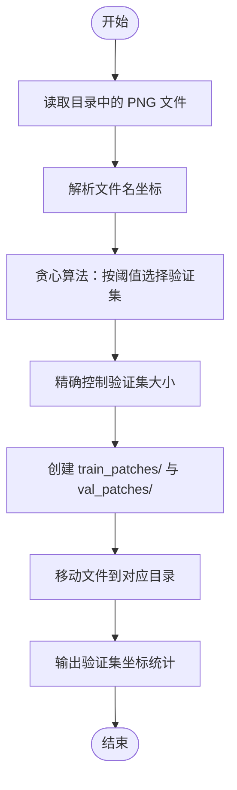
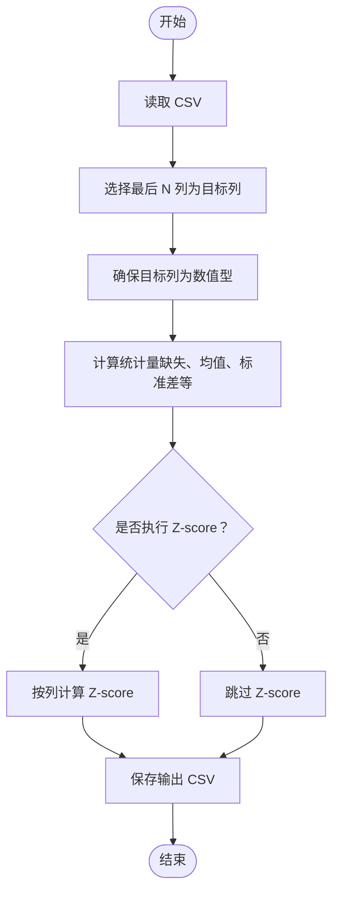
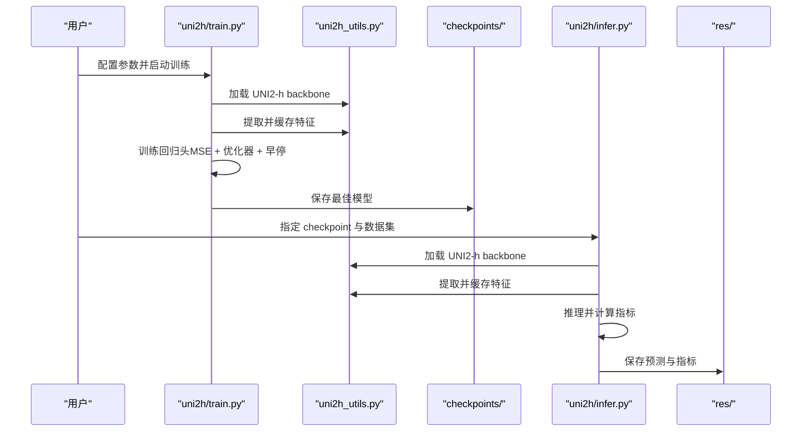
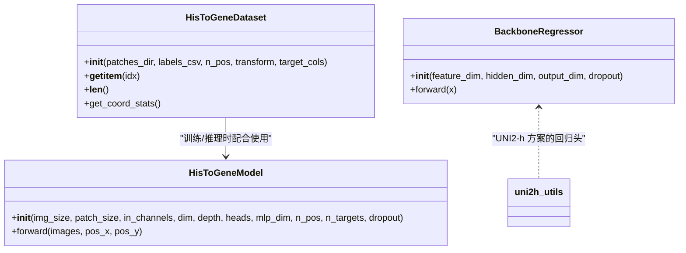
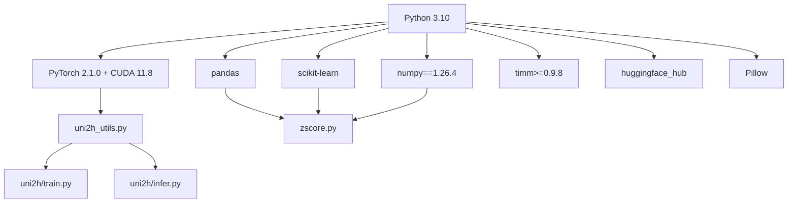

# 快速开始

<cite>
**本文引用的文件**
- [README.md](file://README.md)
- [split.py](file://split.py)
- [zscore.py](file://zscore.py)
- [uni2h_utils.py](file://uni2h/uni2h_utils.py)
- [train.py](file://uni2h/train.py)
- [infer.py](file://uni2h/infer.py)
- [dataset.py](file://histogene/dataset.py)
- [model.py](file://histogene/model.py)
- [train.py](file://histogene/train.py)
- [infer.py](file://histogene/infer.py)
- [analyze_stats.py](file://analyze_stats.py)
- [data_distribution_analysis.py](file://data_distribution_analysis.py)
- [HisToGene应用规划.md](file://HisToGene应用规划.md)
- [split_解读指南.md](file://split_解读指南.md)
- [uni2h_utils_解读指南.md](file://uni2h_utils_解读指南.md)
</cite>

## 目录
1. [简介](#简介)
2. [项目结构](#项目结构)
3. [核心组件](#核心组件)
4. [架构总览](#架构总览)
5. [详细组件分析](#详细组件分析)
6. [依赖分析](#依赖分析)
7. [性能考虑](#性能考虑)
8. [故障排查指南](#故障排查指南)
9. [结论](#结论)
10. [附录](#附录)

## 简介
本指南面向首次接触 PFMval 项目的用户，帮助你在约 30 分钟内完成环境搭建、数据准备与首次运行。你将学会：
- 搭建 Python 3.10 + PyTorch 2.1.0 + CUDA 11.8 的运行环境
- 安装必需依赖（pandas、scikit-learn、numpy、timm、huggingface_hub 等）
- 准备 HYZ15040 数据集（下载、解压、组织结构）
- 使用 split.py 进行空间无重叠划分
- 使用 zscore.py 进行 Z-score 标准化
- 运行 UNI2-h + MLP 的训练与推理示例
- 了解 HisToGene（可选）的适配与训练流程

## 项目结构
项目采用“数据预处理 + 特征提取 + 训练/推理”的分层结构：
- 数据预处理：split.py（空间划分）、zscore.py（标签标准化）
- 特征提取与训练：uni2h_utils.py（工具库）+ uni2h/train.py（训练）+ uni2h/infer.py（推理）
- 可选实现：histogene/ 目录下的 HisToGene 适配版本（ViT + 位置编码）

**图表来源**
- [README.md: 17-39:17-39](file://README.md#L17-L39)
- [split.py: 99-199:99-199](file://split.py#L99-L199)
- [zscore.py: 141-202:141-202](file://zscore.py#L141-L202)
- [uni2h/train.py: 52-226:52-226](file://uni2h/train.py#L52-L226)
- [uni2h/infer.py: 43-174:43-174](file://uni2h/infer.py#L43-L174)

**章节来源**
- [README.md: 17-39:17-39](file://README.md#L17-L39)

## 核心组件
- 环境与依赖
  - Python 3.10、PyTorch 2.1.0 + CUDA 11.8、pandas、scikit-learn、numpy==1.26.4、timm>=0.9.8、huggingface_hub、Pillow
- 数据预处理
  - split.py：按空间距离阈值（默认 350px）划分训练/验证集，避免空间泄漏
  - zscore.py：对 CSV 最后 8 列（ssGSEA 通路评分）执行 Z-score 标准化
- 特征提取与训练
  - uni2h_utils.py：加载 UNI2-h backbone、特征提取与缓存、Dataset、回归头、指标计算
  - uni2h/train.py：冻结 UNI2-h，训练轻量回归头，保存最佳模型
  - uni2h/infer.py：加载最佳模型，对验证集进行推理与指标评估
- 可选：HisToGene 适配
  - histogene/dataset.py、model.py、train.py、infer.py：基于 ViT + 位置编码的端到端实现

**章节来源**
- [README.md: 17-39:17-39](file://README.md#L17-L39)
- [split.py: 99-199:99-199](file://split.py#L99-L199)
- [zscore.py: 141-202:141-202](file://zscore.py#L141-L202)
- [uni2h_utils.py: 31-70:31-70](file://uni2h/uni2h_utils.py#L31-L70)
- [uni2h/train.py: 52-226:52-226](file://uni2h/train.py#L52-L226)
- [uni2h/infer.py: 43-174:43-174](file://uni2h/infer.py#L43-L174)

## 架构总览
下图展示了从原始数据到训练/推理的完整流程，以及各组件间的调用关系。

**图表来源**
- [split.py: 99-199:99-199](file://split.py#L99-L199)
- [zscore.py: 141-202:141-202](file://zscore.py#L141-L202)
- [uni2h_utils.py: 138-169:138-169](file://uni2h/uni2h_utils.py#L138-L169)
- [uni2h/train.py: 52-226:52-226](file://uni2h/train.py#L52-L226)
- [uni2h/infer.py: 43-174:43-174](file://uni2h/infer.py#L43-L174)

## 详细组件分析

### 环境与依赖安装
- 建议使用 conda 创建隔离环境
- 安装 PyTorch 2.1.0 + CUDA 11.8（与 README 一致）
- 安装依赖：pandas、scikit-learn、pillow、numpy==1.26.4、huggingface_hub、timm>=0.9.8
- 版本兼容性要点
  - PyTorch 与 torchvision/torchaudio 需保持版本一致
  - numpy 固定 1.26.4，避免与新版本 pandas/scikit-learn 的兼容问题
  - timm>=0.9.8，确保与 UNI2-h 加载接口兼容

**章节来源**
- [README.md: 17-28:17-28](file://README.md#L17-L28)

### 数据准备与组织
- 下载并解压 HYZ15040 原始数据（压缩包），确保包含 patch 图像与 ssGSEA 评分 CSV
- 组织结构建议
  - HYZ15040/（根目录）
    - train_patches/（训练集）
    - val_patches/（验证集）
    - HYZ15040_ssGSEA_scores.csv（原始标签）
    - HYZ15040_ssGSEA_scores_zscore.csv（标准化标签）
- 运行前检查
  - 确认 CSV 第一列是 patch 文件名（含 .png）
  - 确认 CSV 最后 8 列为目标通路评分

**章节来源**
- [README.md: 4-7:4-7](file://README.md#L4-L7)

### 使用 split.py 进行数据划分
- 功能概述
  - 从文件名解析坐标（patch_x4641_y16969.png）
  - 基于欧氏距离阈值（默认 350px）进行贪心划分
  - 输出 train_patches/ 与 val_patches/ 目录
- 关键参数
  - patches_dir：修改为你的 HYZ15040 数据根目录
  - val_size_fraction：验证集比例（默认 0.1）
  - distance_threshold_px：空间距离阈值（默认 350）
  - random_state：随机种子（默认 42）
- 运行方式
  - 在项目根目录执行：python split.py
  - 注意：该脚本会移动文件（shutil.move），请提前备份原始数据

**图表来源**
- [split.py: 99-199:99-199](file://split.py#L99-L199)

**章节来源**
- [split.py: 99-199:99-199](file://split.py#L99-L199)
- [split_解读指南.md: 280-298:280-298](file://split_解读指南.md#L280-L298)

### 使用 zscore.py 进行标准化
- 功能概述
  - 对 CSV 最后 N 列（默认 8 列）执行 Z-score 标准化：z = (x - mean) / std
  - 统计每列缺失、均值、标准差、分位数等信息
  - 保存标准化后的 CSV（默认追加 _zscore 后缀）
- 关键参数
  - CSV_PATH：输入 CSV 路径
  - NUM_TARGET_COLS：目标列数量（默认 8）
  - DO_ZSCORE：是否执行 Z-score（默认 True）
  - SAVED_OUTPUT：是否保存输出（默认 True）
  - DDOF：标准差自由度（1=样本标准差，默认）
- 运行方式
  - 在项目根目录执行：python zscore.py

**图表来源**
- [zscore.py: 141-202:141-202](file://zscore.py#L141-L202)

**章节来源**
- [zscore.py: 141-202:141-202](file://zscore.py#L141-L202)

### 基本使用示例（训练与推理）
- 训练（UNI2-h + MLP）
  - 进入 uni2h 目录
  - 修改 train.py 中的路径与 HF token
  - 运行：python train.py --train_patches_dir ... --val_patches_dir ... --labels_csv ... --hf_token ...
  - 输出：checkpoints/ 目录下的最佳模型与训练历史 CSV
- 推理（UNI2-h + MLP）
  - 修改 infer.py 中的路径与 HF token
  - 运行：python infer.py --split_patches_dir ... --labels_csv ... --checkpoint_path ... --hf_token ...
  - 输出：res/ 目录下的预测 CSV 与指标 CSV

**图表来源**
- [uni2h/train.py: 52-226:52-226](file://uni2h/train.py#L52-L226)
- [uni2h/infer.py: 43-174:43-174](file://uni2h/infer.py#L43-L174)
- [uni2h_utils.py: 31-70:31-70](file://uni2h/uni2h_utils.py#L31-L70)

**章节来源**
- [README.md: 30-39:30-39](file://README.md#L30-L39)
- [uni2h/train.py: 52-226:52-226](file://uni2h/train.py#L52-L226)
- [uni2h/infer.py: 43-174:43-174](file://uni2h/infer.py#L43-L174)

### 可选：HisToGene 适配与训练
- 适配要点
  - 从文件名解析坐标（x, y），归一化到 [0, n_pos-1]
  - 使用 ViT + 位置编码（CLS token + 位置嵌入）+ MLP 回归头
  - 损失函数可选用 Huber Loss 以提升鲁棒性
- 训练流程
  - 数据集：HisToGeneDataset（返回 image、pos_x、pos_y、targets）
  - 模型：HisToGeneModel（ViT + MLP head）
  - 训练：train.py（早停 + 学习率调度 + 保存最佳模型）
  - 推理：infer.py（逐通路指标 + 宏平均）

**图表来源**
- [dataset.py: 23-118:23-118](file://histogene/dataset.py#L23-L118)
- [model.py: 64-160:64-160](file://histogene/model.py#L64-L160)
- [uni2h_utils.py: 228-247:228-247](file://uni2h/uni2h_utils.py#L228-L247)

**章节来源**
- [HisToGene应用规划.md: 70-92:70-92](file://HisToGene应用规划.md#L70-L92)
- [dataset.py: 23-118:23-118](file://histogene/dataset.py#L23-L118)
- [model.py: 64-160:64-160](file://histogene/model.py#L64-L160)
- [train.py: 174-337:174-337](file://histogene/train.py#L174-L337)
- [infer.py: 66-168:66-168](file://histogene/infer.py#L66-L168)

## 依赖分析
- 直接依赖
  - split.py：os、shutil、numpy、pandas（通过 zscore.py 间接使用）、sklearn（train.py 中使用）
  - zscore.py：pandas、numpy、os
  - uni2h_utils.py：timm、huggingface_hub、PIL、torch、pandas、numpy、sklearn
  - uni2h/train.py、infer.py：torch、pandas、numpy、sklearn、einops（可选）
  - histogene/*：torch、pandas、numpy、sklearn、PIL、einops
- 版本与兼容性
  - PyTorch 2.1.0 + torchvision 0.16.0 + torchaudio 2.1.0 + CUDA 11.8
  - numpy==1.26.4
  - timm>=0.9.8
  - huggingface_hub（用于 UNI2-h 模型下载）

**图表来源**
- [README.md: 17-28:17-28](file://README.md#L17-L28)
- [uni2h_utils.py: 12-16:12-16](file://uni2h/uni2h_utils.py#L12-L16)
- [zscore.py: 1-4:1-4](file://zscore.py#L1-L4)

**章节来源**
- [README.md: 17-28:17-28](file://README.md#L17-L28)

## 性能考虑
- 训练效率
  - UNI2-h 特征提取一次性完成并缓存，训练时直接加载 .pt 文件，显著减少重复计算
  - 回归头轻量（1536→256→8），显存占用低，适合中小规模数据集
- 超参数建议
  - batch_size：GPU 显存紧张时可降至 64/128
  - learning_rate：1e-4 到 1e-3 之间尝试
  - hidden_dim：256 左右为起点，过拟合时可降至 128
  - dropout：0.2~0.5，缓解过拟合
  - early_stop_patience：10（UNI2-h），HisToGene 可适当放宽至 15~20
- 数据增强
  - UNI2-h 方案冻结 backbone，主要在回归头训练阶段使用数据增强
  - HisToGene 方案可适度使用随机翻转、旋转等增强，避免过度破坏组织形态

[本节为通用指导，不直接分析具体文件]

## 故障排查指南
- 环境与依赖
  - CUDA 与 PyTorch 版本不匹配：确保安装与 README 一致的组合
  - numpy 版本冲突：固定为 1.26.4
  - timm 版本过低：升级至 >=0.9.8
- 数据路径与文件名
  - split.py 报路径错误：确认 patches_dir 指向 HYZ15040 根目录
  - 文件名格式不符：确保为 patch_xNNNN_yNNNN.png
  - zscore.py 标签列数不匹配：NUM_TARGET_COLS 与 CSV 最后列数一致
- 特征提取与缓存
  - HF token 未配置：在 train.py/infer.py 中设置 --hf_token 或环境变量
  - 特征缓存缺失：先运行特征提取，再进行训练/推理
- 训练与推理
  - GPU 显存不足：降低 batch_size，或使用 CPU 加载缓存特征
  - 过拟合：增大 dropout、减小 hidden_dim、降低学习率、增加早停耐心
  - 指标异常（NaN）：检查标签是否存在常数列或极端异常值

**章节来源**
- [README.md: 17-39:17-39](file://README.md#L17-L39)
- [split_解读指南.md: 339-381:339-381](file://split_解读指南.md#L339-L381)
- [uni2h_utils_解读指南.md: 188-215:188-215](file://uni2h_utils_解读指南.md#L188-L215)

## 结论
通过本指南，你已完成：
- 环境搭建与依赖安装
- HYZ15040 数据集准备与组织
- 使用 split.py 与 zscore.py 完成数据预处理
- 运行 UNI2-h + MLP 的训练与推理
- 了解 HisToGene 适配方案与关键参数

建议下一步：
- 使用 analyze_stats.py 与 data_distribution_analysis.py 对标签分布进行深入分析
- 尝试调整超参数，观察训练曲线与指标变化
- 对比 UNI2-h 与 HisToGene 的性能，选择更适合的方案

[本节为总结性内容，不直接分析具体文件]

## 附录

### 常用命令速查
- 环境与依赖
  - conda create -n pfmval python=3.10
  - conda activate pfmval
  - conda install pytorch==2.1.0 torchvision==0.16.0 torchaudio==2.1.0 pytorch-cuda=11.8 -c pytorch -c nvidia
  - pip install pandas scikit-learn pillow numpy==1.26.4 huggingface_hub timm>=0.9.8
- 数据预处理
  - python split.py
  - python zscore.py
- 训练（UNI2-h + MLP）
  - cd uni2h
  - python train.py --train_patches_dir ... --val_patches_dir ... --labels_csv ... --hf_token ...
- 推理（UNI2-h + MLP）
  - python infer.py --split_patches_dir ... --labels_csv ... --checkpoint_path ... --hf_token ...

**章节来源**
- [README.md: 17-39:17-39](file://README.md#L17-L39)
- [PFMval学习指南.md: 188-217:188-217](file://PFMval学习指南.md#L188-L217)

### 数据与文件对照
- HYZ15040 原始压缩包 → 解压后得到 patch 图像与 CSV
- split.py 输出 → train_patches/ 与 val_patches/
- zscore.py 输出 → HYZ15040_ssGSEA_scores_zscore.csv
- UNI2-h 训练 → checkpoints/best_model_uni2h.pth
- UNI2-h 推理 → res/ 下的预测与指标 CSV

**章节来源**
- [README.md: 4-7:4-7](file://README.md#L4-L7)