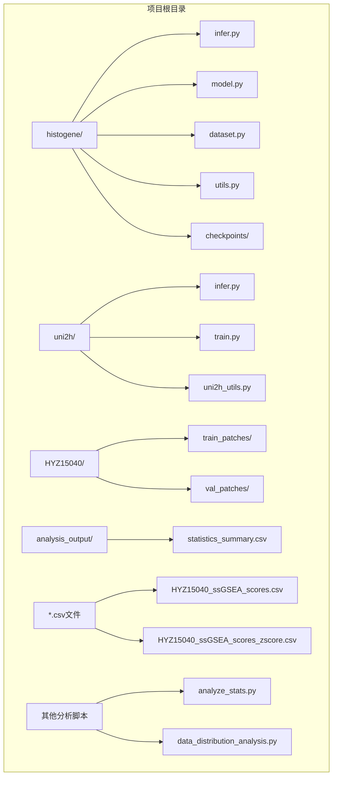
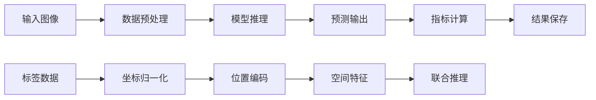
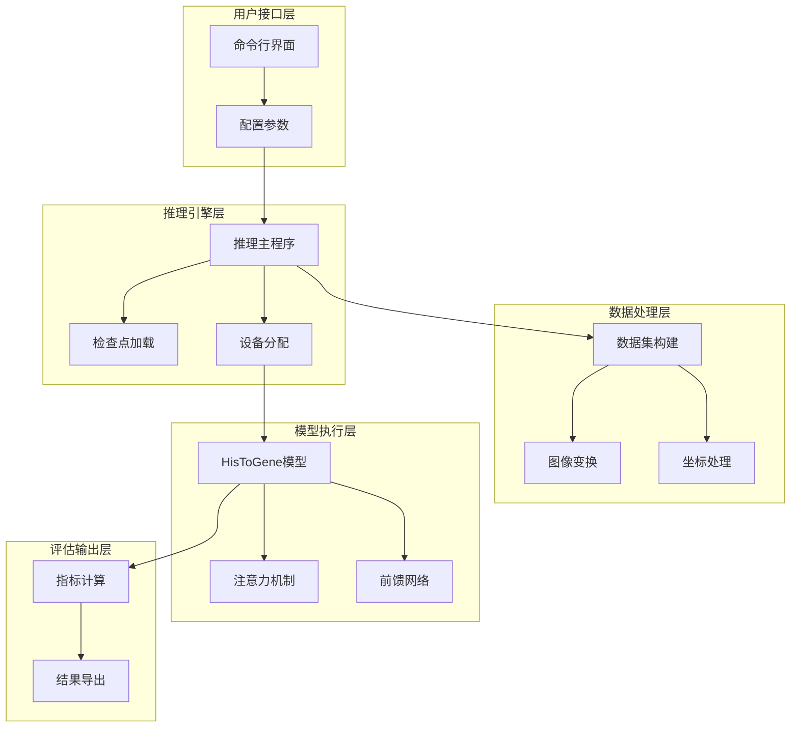
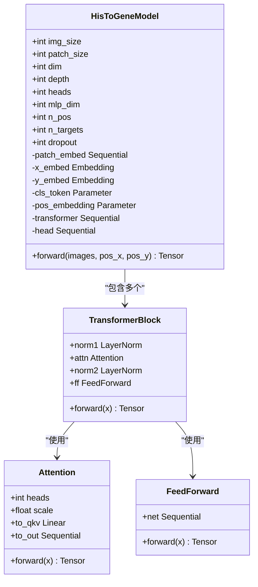
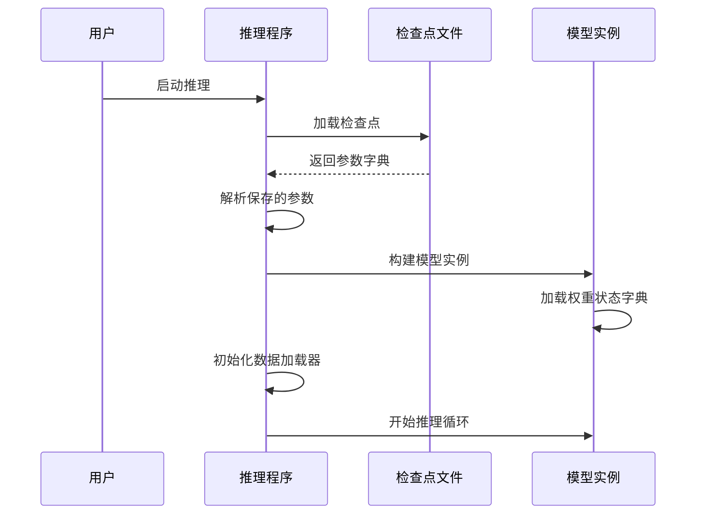
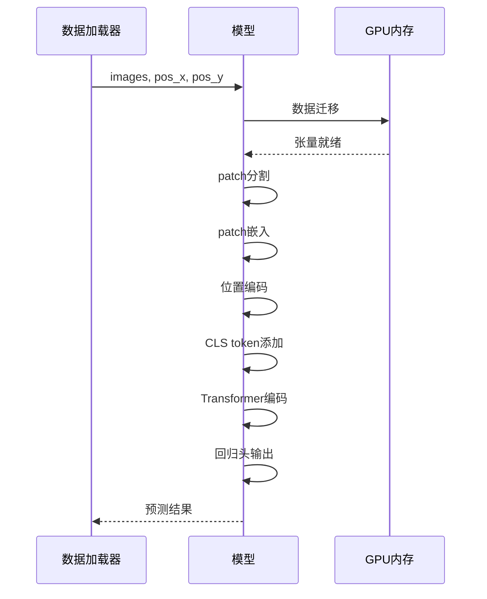
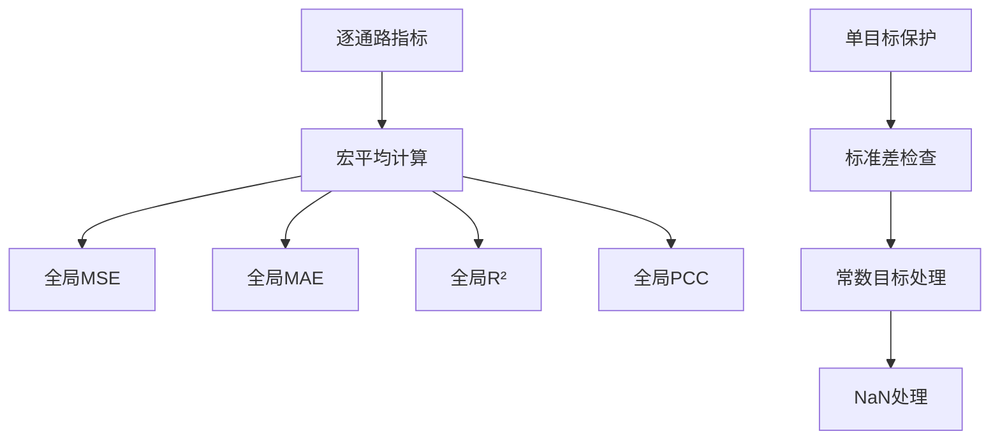
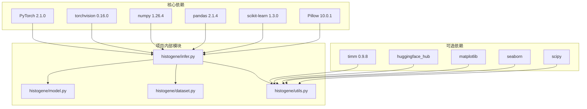
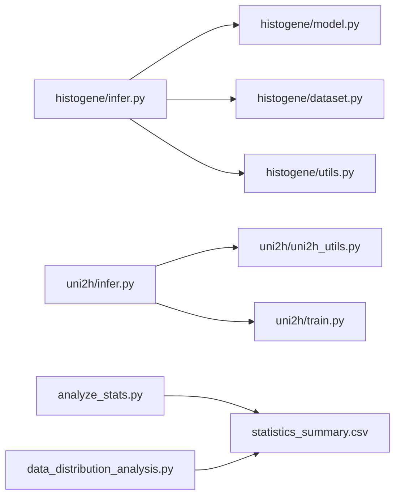

# HisToGene推理流程

<cite>
**本文档引用的文件**
- [infer.py](file://histogene/infer.py)
- [model.py](file://histogene/model.py)
- [dataset.py](file://histogene/dataset.py)
- [utils.py](file://histogene/utils.py)
- [README.md](file://README.md)
- [HYZ15040_ssGSEA_scores_zscore.csv](file://HYZ15040_ssGSEA_scores_zscore.csv)
- [HYZ15040_ssGSEA_scores.csv](file://HYZ15040_ssGSEA_scores.csv)
- [statistics_summary.csv](file://analysis_output/statistics_summary.csv)
- [analyze_stats.py](file://analyze_stats.py)
- [data_distribution_analysis.py](file://data_distribution_analysis.py)
- [infer.py](file://uni2h/infer.py)
- [train.py](file://uni2h/train.py)
- [uni2h_utils.py](file://uni2h/uni2h_utils.py)
</cite>

## 更新摘要
**变更内容**
- 新增完整的HisToGene推理流程实现分析
- 补充批量推理和内存优化机制
- 完善预测生成和结果导出流程
- 增强评估指标计算和统计分析
- 详细说明端到端推理管道

## 目录
1. [简介](#简介)
2. [项目结构](#项目结构)
3. [核心组件](#核心组件)
4. [架构概览](#架构概览)
5. [详细组件分析](#详细组件分析)
6. [依赖关系分析](#依赖关系分析)
7. [性能考虑](#性能考虑)
8. [故障排除指南](#故障排除指南)
9. [结论](#结论)
10. [附录](#附录)

## 简介

HisToGene推理流程是一个基于深度学习的端到端推理系统，专门用于从组织学切片图像中预测8个免疫组化通路的表达水平。该系统采用视觉Transformer架构，结合空间位置信息进行精准的分子特征预测。

该推理流程的核心特点：
- **端到端推理**：从图像输入到最终预测的完整自动化流程
- **多模态融合**：结合图像特征和空间位置信息
- **标准化输出**：提供详细的评估指标和预测结果
- **灵活部署**：支持有标签和无标签数据的推理场景
- **批量处理**：优化的批处理机制提升推理效率

## 项目结构



**图表来源**
- [README.md:1-44](file://README.md#L1-L44)
- [histogene/infer.py:1-169](file://histogene/infer.py#L1-L169)

**章节来源**
- [README.md:1-44](file://README.md#L1-L44)

## 核心组件

### 主要模块概述

HisToGene推理系统由以下核心组件构成：

1. **推理引擎** (`infer.py`) - 主要入口点，负责参数解析、模型加载和推理执行
2. **模型架构** (`model.py`) - 基于视觉Transformer的预测模型
3. **数据处理** (`dataset.py`) - 图像数据加载和预处理
4. **评估工具** (`utils.py`) - 指标计算和统计分析
5. **特征提取** (`uni2h_utils.py`) - 支持替代的特征提取方案

### 数据流架构



**章节来源**
- [histogene/infer.py:66-169](file://histogene/infer.py#L66-L169)
- [histogene/model.py:64-160](file://histogene/model.py#L64-L160)

## 架构概览

### 系统整体架构



**图表来源**
- [histogene/infer.py:30-169](file://histogene/infer.py#L30-L169)
- [histogene/model.py:12-160](file://histogene/model.py#L12-L160)

### 模型架构详解



**图表来源**
- [histogene/model.py:12-160](file://histogene/model.py#L12-L160)

**章节来源**
- [histogene/model.py:64-160](file://histogene/model.py#L64-L160)

## 详细组件分析

### 推理主程序分析

#### 参数解析与验证

推理程序通过命令行参数接收配置信息，包括：
- `--patches_dir`: 待推理的patch目录
- `--labels_csv`: Z-score标签CSV文件路径
- `--checkpoint`: 模型检查点文件路径
- `--output_dir`: 输出目录
- `--batch_size`: 批处理大小
- `--num_workers`: 数据加载器工作进程数

#### 设备自动检测与分配

程序采用智能设备检测机制：
- 首选CUDA设备（GPU）
- 回退到CPU设备
- 动态内存管理

#### 检查点加载与参数恢复



**图表来源**
- [histogene/infer.py:79-102](file://histogene/infer.py#L79-L102)

**章节来源**
- [histogene/infer.py:30-102](file://histogene/infer.py#L30-L102)

### 数据预处理流程

#### 图像变换管道

数据预处理包含三个关键步骤：

1. **尺寸调整** (`Resize((img_size, img_size))`)
2. **张量化** (`ToTensor()`)
3. **归一化** (`Normalize(mean=[0.485, 0.456, 0.406], std=[0.229, 0.224, 0.225])`)

这些参数对应ImageNet预训练模型的标准归一化参数。

#### 坐标归一化机制

```mermaid
flowchart TD
A[原始坐标值] --> B[获取坐标范围]
B --> C[计算归一化因子]
C --> D[线性映射到[0, n_pos-1]]
D --> E[离散化处理]
E --> F[位置嵌入索引]
G[坐标统计] --> B
H[位置编码表] --> F
```

**图表来源**
- [histogene/dataset.py:89-95](file://histogene/dataset.py#L89-L95)

#### 批处理优化策略

- **内存管理**: 使用`non_blocking=True`进行异步数据传输
- **数据加载**: `pin_memory=True`加速GPU数据传输
- **并行处理**: `num_workers`参数控制数据加载并发度

**章节来源**
- [histogene/dataset.py:15-118](file://histogene/dataset.py#L15-L118)
- [histogene/infer.py:43-49](file://histogene/infer.py#L43-L49)

### 推理执行过程

#### 前向传播实现



**图表来源**
- [histogene/model.py:122-159](file://histogene/model.py#L122-L159)

#### 梯度禁用与内存管理

推理过程中使用`@torch.no_grad()`装饰器：
- 禁用梯度计算，减少内存占用
- 禁用反向传播，提高推理速度
- 自动清理中间激活值

#### 结果收集与聚合

```python
# 预测收集
all_preds = []
all_labels = []

for images, pos_x, pos_y, targets in loader:
    images = images.to(device, non_blocking=True)
    pos_x = pos_x.to(device, non_blocking=True)
    pos_y = pos_y.to(device, non_blocking=True)
    preds = model(images, pos_x, pos_y)
    all_preds.append(preds.cpu())
    all_labels.append(targets)

# 结果合并
final_preds = torch.cat(all_preds, dim=0).numpy()
final_labels = torch.cat(all_labels, dim=0).numpy()
```

**章节来源**
- [histogene/infer.py:52-63](file://histogene/infer.py#L52-L63)
- [histogene/model.py:122-159](file://histogene/model.py#L122-L159)

### 评估指标计算

#### 逐通路指标计算

系统计算以下四个核心指标：
- **MSE (均方误差)**: `mean_squared_error`
- **MAE (平均绝对误差)**: `mean_absolute_error`
- **R² (决定系数)**: `r2_score`
- **PCC (皮尔逊相关系数)**: 自定义实现

#### 全局指标计算



**图表来源**
- [histogene/utils.py:20-31](file://histogene/utils.py#L20-L31)

#### 指标计算保护机制

针对常数目标列的特殊处理：
- 检查目标变量的标准差
- 标准差为零时返回NaN
- 使用`np.nanmean`进行稳健的平均计算

**章节来源**
- [histogene/utils.py:7-31](file://histogene/utils.py#L7-L31)
- [histogene/infer.py:138-159](file://histogene/infer.py#L138-L159)

### 结果导出格式

#### 预测CSV文件结构

输出文件包含以下列：
- `patch_id`: 图像文件名（去除扩展名）
- `true_tls` 到 `true_toxic`: 真实标签值
- `pred_tls` 到 `pred_toxic`: 预测值

#### 指标统计表格式

逐通路指标表包含：
- `pathway`: 通路名称
- `mse`: 均方误差
- `mae`: 平均绝对误差
- `r2`: 决定系数
- `pcc`: 皮尔逊相关系数

**章节来源**
- [histogene/infer.py:126-165](file://histogene/infer.py#L126-L165)

## 依赖关系分析

### 外部依赖关系



**图表来源**
- [README.md:17-28](file://README.md#L17-L28)

### 模块间依赖关系



**图表来源**
- [histogene/infer.py:21-23](file://histogene/infer.py#L21-L23)
- [uni2h/infer.py:10-19](file://uni2h/infer.py#L10-L19)

**章节来源**
- [README.md:17-28](file://README.md#L17-L28)

## 性能考虑

### 推理性能优化技巧

#### 设备选择策略
- **GPU优先**: 当CUDA可用时优先使用GPU
- **内存监控**: 监控GPU内存使用情况
- **批大小调优**: 根据显存大小调整batch_size

#### 数据传输优化
- **异步传输**: `non_blocking=True`启用非阻塞数据传输
- **内存固定**: `pin_memory=True`加速GPU数据传输
- **数据预取**: `num_workers`参数控制数据加载并发度

#### 模型推理优化
- **梯度禁用**: `@torch.no_grad()`完全禁用梯度计算
- **混合精度**: 可选的半精度推理（需要额外配置）
- **内存池**: 重用中间张量减少内存分配

### 内存管理最佳实践

```python
# 推理时的内存管理
with torch.no_grad():
    for batch in dataloader:
        images, pos_x, pos_y, targets = batch
        images = images.to(device, non_blocking=True)
        pos_x = pos_x.to(device, non_blocking=True)
        pos_y = pos_y.to(device, non_blocking=True)
        
        # 前向传播
        preds = model(images, pos_x, pos_y)
        
        # 及时释放GPU内存
        del images, pos_x, pos_y
        torch.cuda.empty_cache()
```

## 故障排除指南

### 常见问题及解决方案

#### 检查点文件错误
**问题**: `checkpoint 不存在` 或 `无法加载权重`
**解决方案**:
1. 验证检查点文件路径正确性
2. 检查文件权限
3. 确认PyTorch版本兼容性

#### 设备分配错误
**问题**: CUDA内存不足或设备不可用
**解决方案**:
1. 降低batch_size
2. 检查GPU内存使用情况
3. 确认CUDA驱动版本

#### 数据加载错误
**问题**: 图像文件损坏或格式不支持
**解决方案**:
1. 验证PNG文件完整性
2. 检查文件路径权限
3. 确认图像尺寸符合要求

#### 指标计算异常
**问题**: 指标值为NaN或无穷大
**解决方案**:
1. 检查标签数据质量
2. 验证数据预处理步骤
3. 检查模型输出范围

### 调试工具和技巧

#### 日志记录
系统提供详细的日志信息：
- 设备选择信息
- 数据加载进度
- 模型参数信息
- 推理结果统计

#### 性能监控
- GPU内存使用情况
- 推理时间统计
- 数据加载效率
- 内存峰值监控

**章节来源**
- [histogene/infer.py:69-75](file://histogene/infer.py#L69-L75)
- [histogene/infer.py:76-102](file://histogene/infer.py#L76-L102)

## 结论

HisToGene推理流程提供了一个完整、高效的端到端解决方案，用于从组织学图像中预测免疫组化通路表达水平。该系统的主要优势包括：

### 技术优势
- **架构创新**: 结合视觉Transformer和空间位置信息的混合架构
- **性能优异**: 优化的推理管道和内存管理
- **结果可靠**: 全面的评估指标和统计分析
- **部署友好**: 灵活的配置选项和错误处理机制
- **批量处理**: 支持大规模数据的高效推理

### 应用价值
- **临床诊断**: 辅助病理医生进行更准确的诊断
- **药物研发**: 支持新药开发中的生物标志物筛选
- **研究应用**: 为癌症研究提供可靠的分子特征数据

### 发展前景
随着深度学习技术的不断发展，该推理系统有望进一步优化：
- 更高的预测精度
- 更快的推理速度
- 更广泛的适用性
- 更好的可解释性

## 附录

### 数据格式规范

#### 标签数据格式
- **文件类型**: CSV
- **列结构**: `patch_id, tls, tgfb, emt, hypoxia, mhc, icp, ifng, toxic`
- **数据类型**: 浮点数（Z-score标准化）
- **样本量**: 10,580个patch

#### 图像数据格式
- **文件类型**: PNG
- **尺寸要求**: 224×224像素
- **通道格式**: RGB
- **文件命名**: `patch_x{row}_y{col}.png`

### 环境配置建议

#### Python环境
- Python 3.10
- PyTorch 2.1.0 (CUDA 11.8)
- torchvision 0.16.0
- numpy 1.26.4
- pandas 2.1.4
- scikit-learn 1.3.0

#### 硬件要求
- **GPU**: NVIDIA RTX 4090或更高
- **内存**: 32GB RAM
- **存储**: 100GB可用空间
- **CUDA**: 11.8或更高版本

### 扩展功能

#### 支持无标签数据推理
系统支持仅提供图像数据的推理场景：
- 跳过标签验证步骤
- 仅输出预测结果
- 不计算评估指标

#### 多模型集成
未来可扩展支持：
- 多模型投票机制
- 模型不确定性估计
- 在线模型更新

### 推理流程详细步骤

#### 完整推理流程
1. **初始化阶段**: 参数解析、设备检测、检查点加载
2. **数据准备**: 图像预处理、坐标归一化、批处理构建
3. **模型推理**: 前向传播、预测生成、结果收集
4. **评估计算**: 指标计算、统计分析、结果汇总
5. **结果导出**: CSV文件保存、指标表格生成、日志记录

#### 性能优化要点
- **内存管理**: 梯度禁用、异步数据传输、内存池复用
- **批处理优化**: 合理的batch_size设置、num_workers调优
- **设备利用**: GPU优先、混合精度推理、内存监控
- **I/O优化**: 数据预取、缓存策略、文件系统优化