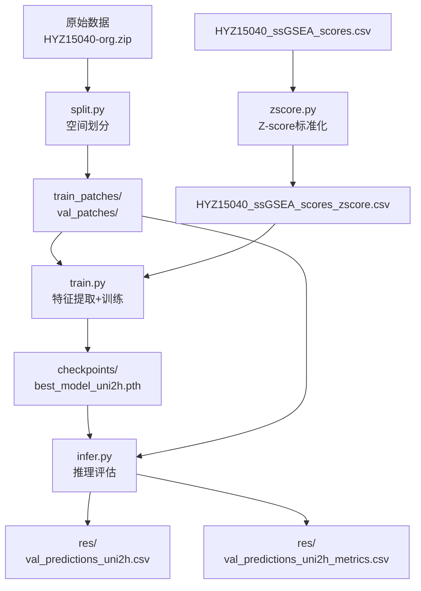
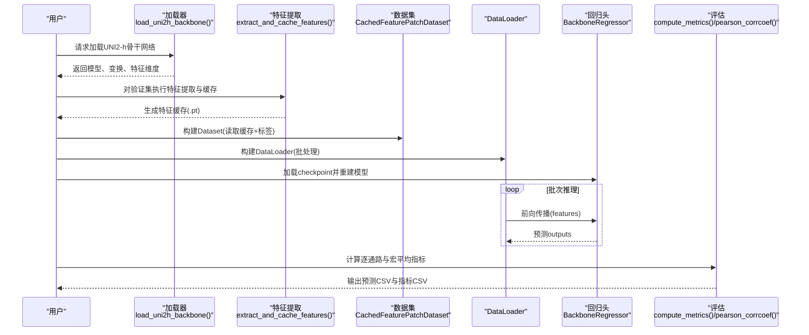
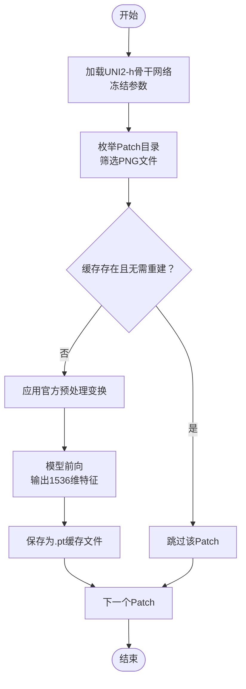
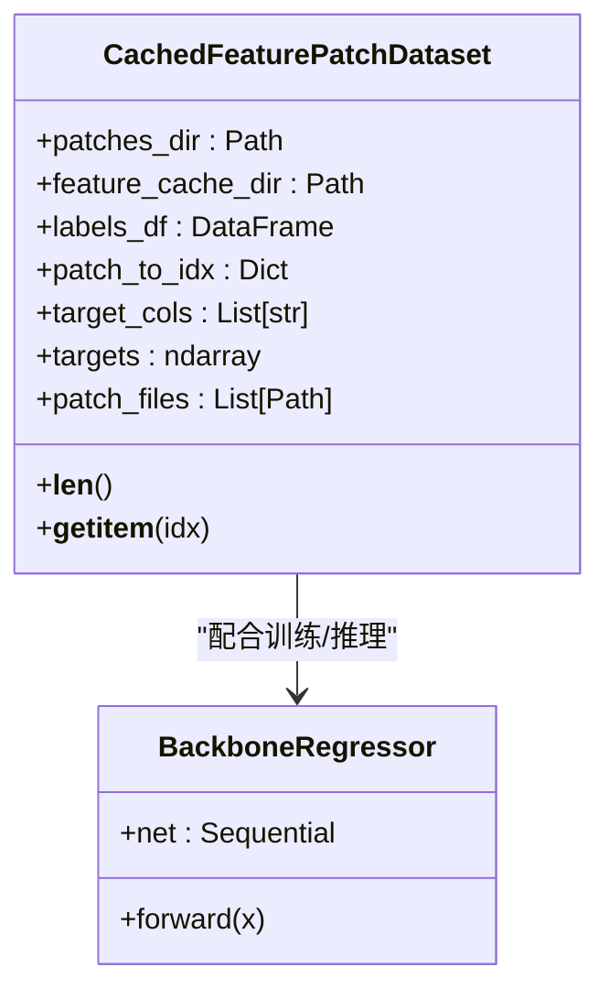
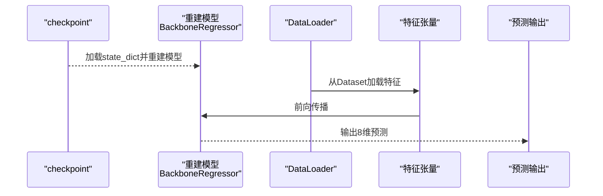
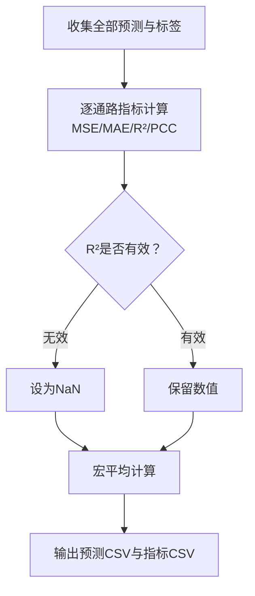
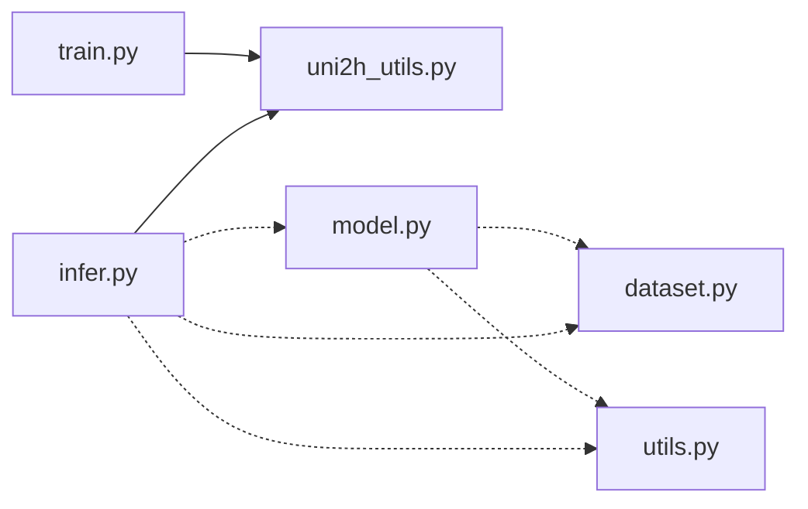

# UNI2-h+MLP推理流程

<cite>
**本文引用的文件**
- [README.md](file://README.md)
- [uni2h/uni2h_utils.py](file://uni2h/uni2h_utils.py)
- [uni2h/infer.py](file://uni2h/infer.py)
- [uni2h/train.py](file://uni2h/train.py)
- [histogene/model.py](file://histogene/model.py)
- [histogene/infer.py](file://histogene/infer.py)
- [histogene/dataset.py](file://histogene/dataset.py)
- [histogene/utils.py](file://histogene/utils.py)
- [HYZ15040_ssGSEA_scores_zscore.csv](file://HYZ15040_ssGSEA_scores_zscore.csv)
- [analyze_stats.py](file://analyze_stats.py)
- [HisToGene应用规划.md](file://HisToGene应用规划.md)
- [PFMval学习指南.md](file://PFMval学习指南.md)
</cite>

## 目录
1. [简介](#简介)
2. [项目结构](#项目结构)
3. [核心组件](#核心组件)
4. [架构总览](#架构总览)
5. [详细组件分析](#详细组件分析)
6. [依赖分析](#依赖分析)
7. [性能考虑](#性能考虑)
8. [故障排查指南](#故障排查指南)
9. [结论](#结论)
10. [附录](#附录)

## 简介
本技术文档围绕“UNI2-h+MLP”两阶段推理流程展开，系统阐述从图像Patch到基因集评分预测的完整管线。该流程采用两阶段策略：
- 特征提取阶段：使用冻结的UNI2-h骨干网络提取1536维视觉特征，并将特征缓存至磁盘，支持断点续传与重复利用。
- 回归预测阶段：加载预训练的轻量回归头（MLP），对缓存特征进行端到端回归，输出8个ssGSEA通路评分，并计算MSE、MAE、R²、PCC等指标。

同时，文档提供与HisToGene模型的对比分析，涵盖数据流、模型结构、评估指标与推理策略的差异，并给出批量推理优化、并行处理技巧及硬件资源建议。

## 项目结构
项目由数据预处理脚本、UNI2-h+MLP推理模块、HisToGene适配模块与配套文档组成。核心文件如下：
- 数据预处理：split.py（空间无重叠划分）、zscore.py（Z-score标准化）
- UNI2-h+MLP：uni2h_utils.py（工具库）、train.py（训练）、infer.py（推理）
- HisToGene适配：histogene/model.py（模型）、histogene/dataset.py（数据集）、histogene/infer.py（推理）、histogene/utils.py（指标）

图表来源
- [PFMval学习指南.md:339-369](file://PFMval学习指南.md#L339-L369)
- [README.md:1-44](file://README.md#L1-L44)

章节来源
- [README.md:1-44](file://README.md#L1-L44)
- [PFMval学习指南.md:1-248](file://PFMval学习指南.md#L1-L248)

## 核心组件
- UNI2-h骨干网络：从HuggingFace加载冻结的ViT模型，输出1536维特征；提供官方预处理变换。
- 特征缓存机制：遍历Patch目录，对每个PNG图像执行预处理与前向，将特征向量保存为.pt文件，支持断点续传与重建。
- CachedFeaturePatchDataset：从缓存目录读取特征，从CSV读取标签，按Patch文件名与标签对齐，构建PyTorch Dataset。
- BackboneRegressor（MLP回归头）：轻量三层MLP，输入1536维，输出8维通路评分。
- 推理评估：加载checkpoint重建模型，对验证集进行批量推理，计算逐通路与宏平均指标，并输出预测结果与指标CSV。

章节来源
- [uni2h/uni2h_utils.py:32-70](file://uni2h/uni2h_utils.py#L32-L70)
- [uni2h/uni2h_utils.py:138-169](file://uni2h/uni2h_utils.py#L138-L169)
- [uni2h/uni2h_utils.py:173-225](file://uni2h/uni2h_utils.py#L173-L225)
- [uni2h/uni2h_utils.py:228-247](file://uni2h/uni2h_utils.py#L228-L247)
- [uni2h/infer.py:43-171](file://uni2h/infer.py#L43-L171)

## 架构总览
两阶段推理流程的总体架构如下：
- 阶段1：特征提取与缓存
  - 加载UNI2-h骨干网络（冻结）
  - 对验证集Patch目录执行特征提取，按Patch文件名生成特征缓存
- 阶段2：回归预测与评估
  - 从checkpoint加载回归头参数
  - 构建CachedFeaturePatchDataset，使用DataLoader进行批量推理
  - 计算逐通路与宏平均指标，输出预测与指标CSV

图表来源
- [uni2h/infer.py:43-171](file://uni2h/infer.py#L43-L171)
- [uni2h/uni2h_utils.py:32-70](file://uni2h/uni2h_utils.py#L32-L70)
- [uni2h/uni2h_utils.py:138-169](file://uni2h/uni2h_utils.py#L138-L169)
- [uni2h/uni2h_utils.py:173-225](file://uni2h/uni2h_utils.py#L173-L225)
- [uni2h/uni2h_utils.py:90-134](file://uni2h/uni2h_utils.py#L90-L134)

章节来源
- [uni2h/infer.py:43-171](file://uni2h/infer.py#L43-L171)

## 详细组件分析

### 特征提取与缓存机制
- 加载UNI2-h骨干网络：从HuggingFace加载预训练模型，设置为eval模式并冻结参数；返回官方预处理变换。
- 特征提取与缓存：遍历Patch目录，打开PNG图像，应用官方预处理变换，送入模型前向得到1536维特征，detach到CPU并保存为.pt文件；若缓存存在且未选择重建，则跳过。
- 断点续传：缓存文件按Patch文件名命名，支持增量提取与重复运行。

图表来源
- [uni2h/uni2h_utils.py:32-70](file://uni2h/uni2h_utils.py#L32-L70)
- [uni2h/uni2h_utils.py:138-169](file://uni2h/uni2h_utils.py#L138-L169)

章节来源
- [uni2h/uni2h_utils.py:32-70](file://uni2h/uni2h_utils.py#L32-L70)
- [uni2h/uni2h_utils.py:138-169](file://uni2h/uni2h_utils.py#L138-L169)

### 数据集与特征组织
- CachedFeaturePatchDataset：从Patch目录读取PNG文件，解析文件名得到Patch ID；从CSV读取对应8个通路评分；按Patch ID与缓存目录中的特征文件名对齐；从缓存目录加载.pt特征，支持字典键兼容（feature键）；返回特征张量与标签张量。
- 标签组织：CSV第一列为Patch ID，后续8列为通路评分；目标列范围由参数控制，默认从第2列起取8列。

图表来源
- [uni2h/uni2h_utils.py:173-225](file://uni2h/uni2h_utils.py#L173-L225)
- [uni2h/uni2h_utils.py:228-247](file://uni2h/uni2h_utils.py#L228-L247)

章节来源
- [uni2h/uni2h_utils.py:173-225](file://uni2h/uni2h_utils.py#L173-L225)

### MLP回归模型推理
- 模型重建：从checkpoint读取模型参数字典，重建BackboneRegressor，设置为eval模式。
- 输入预处理：特征从缓存加载为张量，dtype转换为float32；不进行归一化（注释处可选）。
- 前向传播：将特征张量送入回归头，得到8维预测向量。
- 批量推理：使用DataLoader按批次进行推理，收集全部预测与标签，用于指标计算。

图表来源
- [uni2h/infer.py:92-113](file://uni2h/infer.py#L92-L113)
- [uni2h/uni2h_utils.py:228-247](file://uni2h/uni2h_utils.py#L228-L247)

章节来源
- [uni2h/infer.py:92-113](file://uni2h/infer.py#L92-L113)

### 评估指标计算与后处理
- 指标计算：对每个通路分别计算MSE、MAE、R²、PCC；当标签或预测为常数时，R²设为NaN；宏平均为8个通路指标的均值。
- 后处理：将预测结果与真实标签按Patch ID对齐，输出CSV；同时输出指标汇总CSV，包含逐通路与宏平均行。
- 与HisToGene对比：HisToGene使用端到端图像输入+空间位置编码，UNI2-h+MLP使用预提取特征+轻量回归头；两者均使用MSE、MAE、R²、PCC评估，但HisToGene额外考虑空间位置信息。

图表来源
- [uni2h/infer.py:118-156](file://uni2h/infer.py#L118-L156)
- [uni2h/uni2h_utils.py:90-134](file://uni2h/uni2h_utils.py#L90-L134)
- [HisToGene应用规划.md:80-91](file://HisToGene应用规划.md#L80-L91)

章节来源
- [uni2h/infer.py:118-156](file://uni2h/infer.py#L118-L156)
- [uni2h/uni2h_utils.py:90-134](file://uni2h/uni2h_utils.py#L90-L134)
- [HisToGene应用规划.md:80-91](file://HisToGene应用规划.md#L80-L91)

### 与HisToGene模型的对比分析
- 模型结构差异：UNI2-h+MLP采用冻结的ViT骨干+轻量MLP回归头；HisToGene采用端到端ViT+MLP头，显式引入空间位置编码。
- 输入与标签：两者均使用Patch图像与8通路评分；HisToGene从文件名解析坐标并进行位置编码，UNI2-h+MLP直接使用缓存特征。
- 训练与推理：UNI2-h+MLP两阶段（特征提取+回归头训练），HisToGene端到端训练；两者评估指标一致。
- 数据分布与异常值：HisToGene建议使用Huber Loss等对异常值鲁棒的损失函数；本项目使用MSE，可通过数据预处理（Z-score）缓解异常值影响。

章节来源
- [HisToGene应用规划.md:80-91](file://HisToGene应用规划.md#L80-L91)
- [HisToGene应用规划.md:305-320](file://HisToGene应用规划.md#L305-L320)
- [HYZ15040_ssGSEA_scores_zscore.csv:1-200](file://HYZ15040_ssGSEA_scores_zscore.csv#L1-L200)

## 依赖分析
- 文件间导入关系：train.py与infer.py均import uni2h_utils.py中的工具函数与类；HisToGene模块独立于主流程，提供对比参考。
- 数据依赖：推理阶段依赖特征缓存目录与标准化后的标签CSV；特征缓存按Patch文件名与缓存文件名对齐。

图表来源
- [PFMval学习指南.md:299-304](file://PFMval学习指南.md#L299-L304)
- [uni2h/infer.py:10-19](file://uni2h/infer.py#L10-L19)
- [uni2h/train.py:12-21](file://uni2h/train.py#L12-L21)

章节来源
- [PFMval学习指南.md:299-304](file://PFMval学习指南.md#L299-L304)

## 性能考虑
- 批量推理优化
  - 批大小：根据GPU显存调整batch_size（默认256），必要时降至128或64。
  - 数据加载：num_workers=0可减少上下文切换开销；pin_memory在CUDA可用时启用以加速主机到设备传输。
  - 设备选择：优先使用GPU；若显存不足，可将特征加载在CPU，推理时再移动到设备。
- 并行处理技巧
  - 特征提取阶段：可并行化不同Split的特征提取任务（如train/val分别运行），但需确保缓存目录隔离。
  - 推理阶段：DataLoader的num_workers与pin_memory配合，减少I/O瓶颈。
- 内存优化策略
  - 特征缓存：避免重复计算，显著降低推理阶段的内存压力。
  - 模型参数：UNI2-h骨干冻结，仅训练MLP回归头，参数量小，适合大规模推理。
- 硬件资源需求
  - GPU：建议至少12GB显存（如RTX 4090/3090）；若显存紧张，降低batch_size并启用pin_memory。
  - CPU：足够的内存以承载特征缓存（约1536维×Patch数量×4字节）。
  - 存储：特征缓存占用较大，建议使用SSD以提升I/O性能。

章节来源
- [uni2h/infer.py:84-90](file://uni2h/infer.py#L84-L90)
- [uni2h/train.py:102-115](file://uni2h/train.py#L102-L115)
- [PFMval学习指南.md:161-171](file://PFMval学习指南.md#L161-L171)

## 故障排查指南
- HF Token认证失败：注册HuggingFace账号并配置Access Token；确保网络可达。
- 坐标解析失败：确认Patch文件名格式为patch_xXXXX_yXXXX.png。
- 特征缓存缺失：检查缓存目录路径与名称一致性；必要时开启rebuild_cache重新提取。
- GPU显存不足：降低batch_size；关闭num_workers；确保特征加载在CPU。
- 标签与图片不匹配：核对CSV第一列patch_id与文件名一致；检查目标列范围。
- Z-score后出现NaN：检查是否存在常数列或缺失值；必要时删除或插补。
- 推理指标全NaN：检查预测值是否为常数列或存在极端异常值；使用异常值检测方法（如IQR）清洗数据。

章节来源
- [PFMval学习指南.md:161-171](file://PFMval学习指南.md#L161-L171)
- [analyze_stats.py:1-40](file://analyze_stats.py#L1-L40)

## 结论
UNI2-h+MLP推理流程通过“特征提取+轻量回归”的两阶段策略，在保证性能的同时显著降低了计算与存储成本。特征缓存机制实现了高效的重复利用与断点续传；MLP回归头结构简单、易于部署；评估指标与HisToGene一致，便于横向对比。结合批量推理优化与硬件资源建议，可在实际场景中稳定高效地完成大规模Patch的ssGSEA通路评分预测。

## 附录
- 数据分布分析：可使用analyze_stats.py对8个通路评分进行描述性统计与异常值检测，辅助异常值清洗与模型鲁棒性评估。
- HisToGene适配：若需端到端图像输入与空间位置编码，可参考histogene模块的模型、数据集与推理脚本，与UNI2-h+MLP方案进行对比实验。

章节来源
- [analyze_stats.py:1-40](file://analyze_stats.py#L1-L40)
- [HisToGene应用规划.md:1-1092](file://HisToGene应用规划.md#L1-L1092)