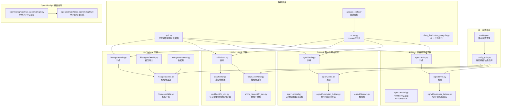
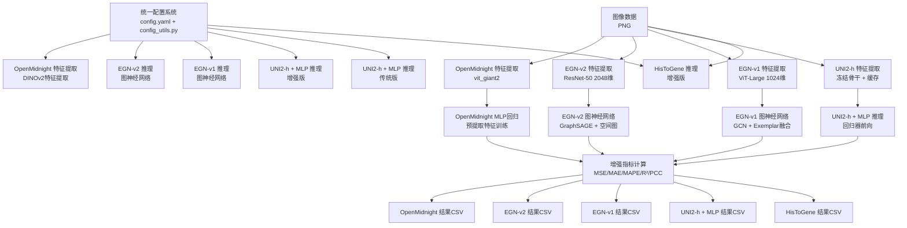
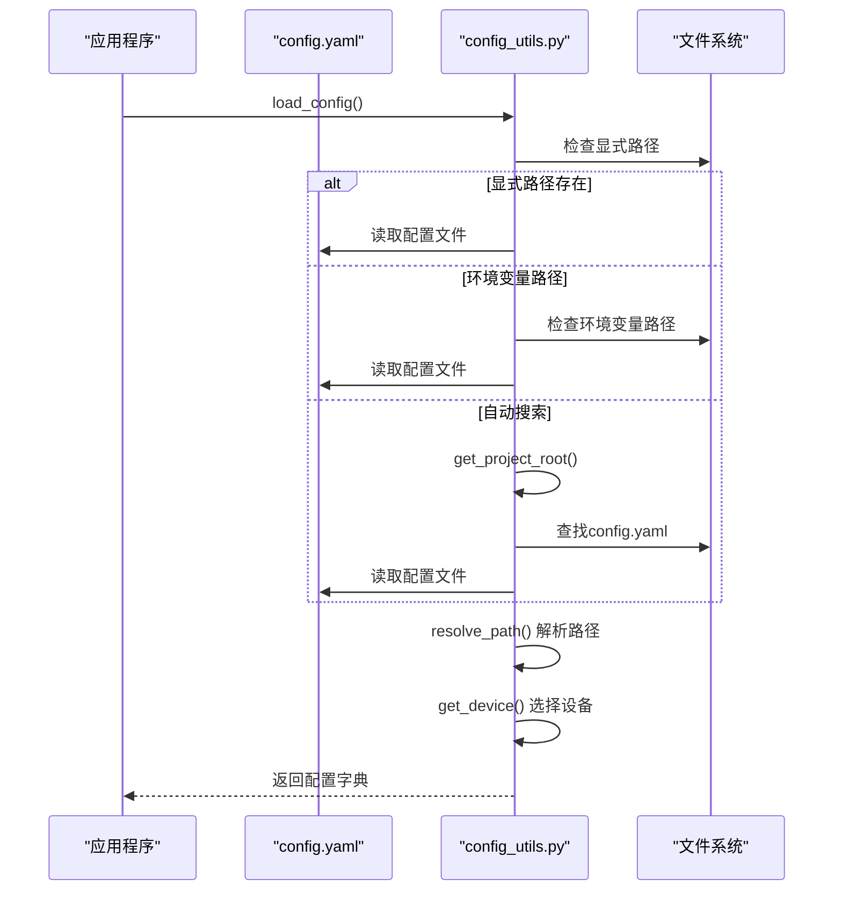
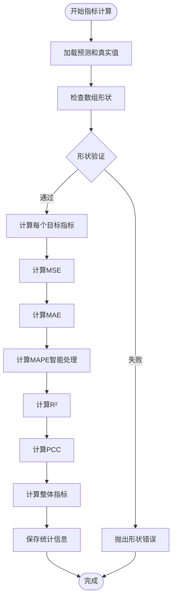
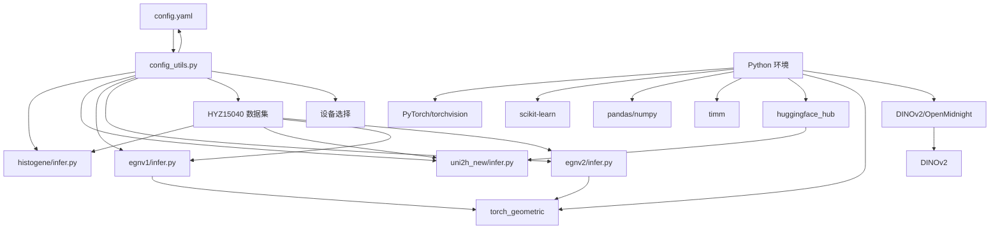

# 推理评估系统

<cite>
**本文引用的文件**
- [README.md](file://README.md)
- [config.yaml](file://config.yaml)
- [config_utils.py](file://config_utils.py)
- [histogene/infer.py](file://histogene/infer.py)
- [histogene/model.py](file://histogene/model.py)
- [histogene/dataset.py](file://histogene/dataset.py)
- [histogene/utils.py](file://histogene/utils.py)
- [uni2h/infer.py](file://uni2h/infer.py)
- [uni2h/uni2h_utils.py](file://uni2h/uni2h_utils.py)
- [uni2h/train.py](file://uni2h/train.py)
- [uni2h_new/infer.py](file://uni2h_new/infer.py)
- [uni2h_new/uni2h_des.py](file://uni2h_new/uni2h_des.py)
- [egnv1/infer.py](file://egnv1/infer.py)
- [egnv1/model.py](file://egnv1/model.py)
- [egnv1/dataset.py](file://egnv1/dataset.py)
- [egnv1/exemplar_builder.py](file://egnv1/exemplar_builder.py)
- [egnv1/train.py](file://egnv1/train.py)
- [egnv2/infer.py](file://egnv2/infer.py)
- [egnv2/model.py](file://egnv2/model.py)
- [egnv2/exemplar_builder.py](file://egnv2/exemplar_builder.py)
- [egnv2/train.py](file://egnv2/train.py)
- [openmidnight/extract_openmidnight.py](file://openmidnight/extract_openmidnight.py)
- [openmidnight/train_openmidnight.py](file://openmidnight/train_openmidnight.py)
- [split.py](file://split.py)
- [zscore.py](file://zscore.py)
- [analyze_stats.py](file://analyze_stats.py)
- [HYZ15040_ssGSEA_scores.csv](file://HYZ15040_ssGSEA_scores.csv)
- [analysis_output/statistics_summary.csv](file://analysis_output/statistics_summary.csv)
- [data_distribution_analysis.py](file://data_distribution_analysis.py)
</cite>

## 更新摘要
**变更内容**
- 新增EGN模型推理流程（EGNv1和EGNv2），支持图神经网络推理
- 新增OpenMidnight特征提取能力，支持DINOv2视觉特征提取
- 增强评估指标体系，新增MAPE（平均绝对百分比误差）指标
- 改进UNI2-h推理流程，支持动态特征提取和缓存管理
- 优化数据标准化流程，提供z-score统计信息持久化
- 增强配置工具的路径解析和设备选择功能

## 目录
1. [简介](#简介)
2. [项目结构](#项目结构)
3. [核心组件](#核心组件)
4. [架构总览](#架构总览)
5. [详细组件分析](#详细组件分析)
6. [依赖关系分析](#依赖关系分析)
7. [性能考量](#性能考量)
8. [故障排查指南](#故障排查指南)
9. [结论](#结论)
10. [附录](#附录)

## 简介
本项目提供四类推理评估流程，用于将组织学切片图像映射到8条通路的ssGSEA评分，并进行统计指标评估与结果导出。系统经过重大升级，引入了统一配置管理系统、增强的评估指标体系和改进的推理流程。

**更新亮点**
- **统一配置系统**：通过config.yaml集中管理所有路径配置，支持相对路径和绝对路径解析
- **增强评估指标**：新增MAPE（平均绝对百分比误差）指标，提供更全面的性能评估
- **改进推理流程**：UNI2-h推理支持动态特征提取、缓存管理和本地模式
- **优化数据处理**：z-score标准化提供统计信息持久化，支持历史记录追踪
- **新增EGN模型**：支持基于图神经网络的推理流程，包括EGNv1（ViT特征）和EGNv2（ResNet特征）
- **新增OpenMidnight特征提取**：支持DINOv2视觉特征提取和MLP回归器训练

四类流程的主要差异在于特征来源与推理策略：
- **HisToGene**：直接以图像为输入，通过视觉Transformer提取空间位置信息与图像特征，端到端回归8条通路评分
- **UNI2-h + MLP**：冻结UNI2-h骨干网络，先提取1536维特征并缓存，再用轻量级MLP回归器进行回归预测
- **EGN-v1**：基于ViT-Large特征的图神经网络，使用GCN图卷积和代表库融合
- **EGN-v2**：基于ResNet-50特征的图神经网络，使用GraphSAGE图卷积和空间图构建

系统同时提供数据划分、z-score标准化、统计分析与可视化工具，支持批量推理与结果对比分析。

## 项目结构
- **config.yaml**：统一配置文件，集中管理数据路径、HuggingFace配置和训练参数
- **config_utils.py**：配置工具模块，提供路径解析、设备选择和配置加载功能
- **histogene**：HisToGene模型与训练/推理脚本
- **uni2h**：UNI2-h特征提取与回归器训练/推理脚本（传统版本）
- **uni2h_new**：UNI2-h增强版本，支持MAPE指标和改进的特征处理
- **egnv1**：EGN-v1图神经网络模型与训练/推理脚本
- **egnv2**：EGN-v2图神经网络模型与训练/推理脚本
- **openmidnight**：OpenMidnight特征提取与MLP回归器训练脚本
- **HYZ15040**：数据集目录（包含train_patches与val_patches）
- **analysis_output**：统计分析输出
- **split.py**：按空间距离约束划分训练/验证集
- **zscore.py**：对ssGSEA评分进行z-score标准化
- **analyze_stats.py**：统计分析脚本，提供详细的统计指标计算
- **data_distribution_analysis.py**：数据分布统计与可视化
- **README.md**：环境与使用说明

**图表来源**
- [config.yaml:6-32](file://config.yaml#L6-L32)
- [config_utils.py:49-257](file://config_utils.py#L49-L257)
- [egnv1/infer.py:48-148](file://egnv1/infer.py#L48-L148)
- [egnv2/infer.py:48-148](file://egnv2/infer.py#L48-L148)
- [openmidnight/extract_openmidnight.py:1-196](file://openmidnight/extract_openmidnight.py#L1-L196)

## 核心组件

### 统一配置系统
**新增功能**
- **集中配置管理**：通过config.yaml统一管理所有路径配置
- **智能路径解析**：支持相对路径和绝对路径，自动解析项目根目录
- **设备自动选择**：根据系统环境自动选择CUDA或CPU设备
- **HuggingFace集成**：支持token配置和本地模式

**配置文件结构**
- **数据路径配置**：train_patches_dir、val_patches_dir、labels_csv_raw、labels_csv_zscore
- **HuggingFace配置**：token、local_only
- **训练配置**：device选择（auto/cuda/cpu）

**章节来源**
- [config.yaml:6-32](file://config.yaml#L6-L32)
- [config_utils.py:49-257](file://config_utils.py#L49-L257)

### 增强评估指标体系
**新增MAPE指标**
- **MAPE计算**：平均绝对百分比误差，提供相对误差评估
- **异常值处理**：智能处理除零和无穷大值
- **分目标评估**：支持单目标和整体指标计算
- **统计信息持久化**：保存z-score标准化统计参数

**指标计算改进**
- **MSE**：均方误差
- **MAE**：平均绝对误差  
- **MAPE**：平均绝对百分比误差（新增）
- **R²**：决定系数
- **PCC**：皮尔逊相关系数

**章节来源**
- [uni2h_new/uni2h_des.py:170-258](file://uni2h_new/uni2h_des.py#L170-L258)
- [uni2h_new/uni2h_des.py:208-220](file://uni2h_new/uni2h_des.py#L208-L220)

### HisToGene 推理流程
**增强功能**
- **配置集成**：自动从config.yaml加载默认路径
- **增强指标输出**：支持更多统计指标和详细结果
- **改进的错误处理**：更好的路径验证和错误提示

**章节来源**
- [histogene/infer.py:28-37](file://histogene/infer.py#L28-L37)
- [histogene/infer.py:147-173](file://histogene/infer.py#L147-L173)

### UNI2-h + MLP 推理策略
**改进功能**
- **动态特征提取**：支持重新提取和缓存管理
- **增强的特征处理**：改进的特征缓存和加载机制
- **MAPE指标支持**：新增平均绝对百分比误差计算
- **本地模式支持**：支持无网络环境下的本地模型加载

**章节来源**
- [uni2h/infer.py:66-75](file://uni2h/infer.py#L66-L75)
- [uni2h_new/infer.py:49-55](file://uni2h_new/infer.py#L49-L55)

### EGN-v1 图神经网络推理流程
**新增功能**
- **ViT特征提取**：基于ViT-Large的1024维特征提取
- **GCN图卷积**：使用GCNConv进行图神经网络处理
- **代表库融合**：通过ExemplarLibrary进行特征融合
- **完整推理管道**：从特征提取到预测的完整流程

**章节来源**
- [egnv1/infer.py:48-148](file://egnv1/infer.py#L48-L148)
- [egnv1/model.py:347-437](file://egnv1/model.py#L347-L437)
- [egnv1/exemplar_builder.py:154-266](file://egnv1/exemplar_builder.py#L154-L266)

### EGN-v2 图神经网络推理流程
**新增功能**
- **ResNet特征提取**：基于ResNet-50的2048维特征提取
- **GraphSAGE图卷积**：使用SAGEConv进行图神经网络处理
- **空间图构建**：基于坐标距离的空间图构建
- **完整推理管道**：从特征提取到预测的完整流程

**章节来源**
- [egnv2/infer.py:48-148](file://egnv2/infer.py#L48-L148)
- [egnv2/model.py:123-211](file://egnv2/model.py#L123-L211)
- [egnv2/exemplar_builder.py:148-241](file://egnv2/exemplar_builder.py#L148-L241)

### OpenMidnight 特征提取能力
**新增功能**
- **DINOv2特征提取**：基于OpenMidnight的vit_giant2特征提取
- **MLP回归器训练**：支持预提取特征的MLP回归器训练
- **特征缓存**：支持特征的保存和加载
- **完整训练管道**：从特征提取到模型训练的完整流程

**章节来源**
- [openmidnight/extract_openmidnight.py:1-196](file://openmidnight/extract_openmidnight.py#L1-L196)
- [openmidnight/train_openmidnight.py:1-299](file://openmidnight/train_openmidnight.py#L1-L299)

## 架构总览
四类流程在"特征来源"和"推理策略"上存在显著差异，系统经过升级后更加模块化和可配置：

**图表来源**
- [config_utils.py:17-88](file://config_utils.py#L17-L88)
- [uni2h_new/uni2h_des.py:170-258](file://uni2h_new/uni2h_des.py#L170-L258)
- [egnv1/infer.py:48-148](file://egnv1/infer.py#L48-L148)
- [egnv2/infer.py:48-148](file://egnv2/infer.py#L48-L148)
- [openmidnight/extract_openmidnight.py:1-196](file://openmidnight/extract_openmidnight.py#L1-L196)

## 详细组件分析

### 统一配置系统实现
**配置加载流程**
- **优先级顺序**：显式路径 > 环境变量 > 自动搜索项目根目录
- **路径解析**：支持相对路径和绝对路径，自动规范化
- **设备选择**：智能检测CUDA可用性，自动选择最佳设备
- **配置验证**：提供完整的配置自检功能

**图表来源**
- [config_utils.py:49-88](file://config_utils.py#L49-L88)
- [config_utils.py:111-135](file://config_utils.py#L111-L135)
- [config_utils.py:216-257](file://config_utils.py#L216-L257)

**章节来源**
- [config_utils.py:49-88](file://config_utils.py#L49-L88)
- [config_utils.py:111-135](file://config_utils.py#L111-L135)
- [config_utils.py:216-257](file://config_utils.py#L216-L257)

### 增强评估指标计算
**MAPE指标实现**
- **智能异常处理**：处理除零和无穷大值，避免计算错误
- **分目标统计**：支持每个目标的独立指标计算
- **整体平均**：提供宏平均和微平均指标
- **统计信息保存**：保存z-score标准化参数用于后续分析

**图表来源**
- [uni2h_new/uni2h_des.py:170-258](file://uni2h_new/uni2h_des.py#L170-L258)
- [uni2h_new/uni2h_des.py:208-220](file://uni2h_new/uni2h_des.py#L208-L220)

**章节来源**
- [uni2h_new/uni2h_des.py:170-258](file://uni2h_new/uni2h_des.py#L170-L258)
- [uni2h_new/uni2h_des.py:208-220](file://uni2h_new/uni2h_des.py#L208-L220)

### HisToGene 推理流程增强
**配置集成改进**
- **自动路径加载**：从config.yaml自动加载默认标签文件路径
- **增强错误处理**：更好的文件存在性检查和错误提示
- **改进的指标输出**：提供更详细的统计信息和结果导出

**章节来源**
- [histogene/infer.py:28-37](file://histogene/infer.py#L28-L37)
- [histogene/infer.py:147-173](file://histogene/infer.py#L147-L173)

### UNI2-h + MLP 推理策略改进
**动态特征处理**
- **智能缓存管理**：支持重新提取和缓存重建
- **增强特征处理**：改进的特征加载和预处理
- **MAPE指标支持**：完整的平均绝对百分比误差计算
- **本地模式支持**：支持无网络环境下的模型加载

**章节来源**
- [uni2h/infer.py:66-75](file://uni2h/infer.py#L66-L75)
- [uni2h_new/infer.py:49-55](file://uni2h_new/infer.py#L49-L55)

### EGN-v1 图神经网络推理流程
**ViT特征提取与图神经网络**
- **ViT-Large特征提取**：1024维特征，支持timm库和自实现
- **GCN图卷积**：两层GCNConv，残差连接和层归一化
- **Exemplar融合**：通过最近邻检索和加权平均进行特征融合
- **完整推理管道**：从特征提取到图构建再到预测

**章节来源**
- [egnv1/infer.py:48-148](file://egnv1/infer.py#L48-L148)
- [egnv1/model.py:120-277](file://egnv1/model.py#L120-L277)
- [egnv1/exemplar_builder.py:99-151](file://egnv1/exemplar_builder.py#L99-L151)

### EGN-v2 图神经网络推理流程
**ResNet特征提取与图神经网络**
- **ResNet-50特征提取**：2048维特征，ImageNet预训练权重
- **GraphSAGE图卷积**：两层SAGEConv，残差连接和层归一化
- **空间图构建**：基于坐标距离的k-NN图构建
- **完整推理管道**：从特征提取到图构建再到预测

**章节来源**
- [egnv2/infer.py:48-148](file://egnv2/infer.py#L48-L148)
- [egnv2/model.py:15-61](file://egnv2/model.py#L15-L61)
- [egnv2/exemplar_builder.py:98-145](file://egnv2/exemplar_builder.py#L98-L145)

### OpenMidnight 特征提取与MLP训练
**DINOv2特征提取与回归器训练**
- **vit_giant2特征提取**：基于OpenMidnight的DINOv2变体
- **特征缓存**：支持特征的保存和加载
- **MLP回归器**：支持预提取特征的回归器训练
- **完整训练管道**：从特征提取到模型训练的完整流程

**章节来源**
- [openmidnight/extract_openmidnight.py:45-78](file://openmidnight/extract_openmidnight.py#L45-L78)
- [openmidnight/train_openmidnight.py:38-56](file://openmidnight/train_openmidnight.py#L38-L56)
- [openmidnight/train_openmidnight.py:58-94](file://openmidnight/train_openmidnight.py#L58-L94)

### 数据流与算法细节
**增强的数据处理流程**
- **配置驱动**：所有路径通过config.yaml集中管理
- **智能路径解析**：支持相对路径和绝对路径自动解析
- **改进的特征缓存**：支持重建和增量更新
- **完整的统计分析**：提供详细的指标计算和结果导出
- **多模型支持**：支持HisToGene、UNI2-h、EGN-v1、EGN-v2四种推理流程

**章节来源**
- [config_utils.py:111-135](file://config_utils.py#L111-L135)
- [uni2h_new/infer.py:75-84](file://uni2h_new/infer.py#L75-L84)
- [egnv1/exemplar_builder.py:154-266](file://egnv1/exemplar_builder.py#L154-L266)
- [egnv2/exemplar_builder.py:148-241](file://egnv2/exemplar_builder.py#L148-L241)

## 依赖关系分析
**更新后的依赖关系**
- **统一配置系统**：config.yaml和config_utils.py成为所有模块的配置中心
- **增强的评估工具**：新增uni2h_new/uni2h_des.py提供完整的指标计算功能
- **改进的特征处理**：enhanced uni2h_utils.py支持MAPE指标和本地模式
- **统计分析工具**：analyze_stats.py提供详细的统计指标计算
- **新增EGN模型依赖**：EGN-v1和EGN-v2依赖torch_geometric进行图神经网络处理
- **新增OpenMidnight依赖**：OpenMidnight依赖DINOv2视觉特征提取库

**图表来源**
- [config.yaml:21-32](file://config.yaml#L21-L32)
- [config_utils.py:216-257](file://config_utils.py#L216-L257)
- [egnv1/model.py:15](file://egnv1/model.py#L15)
- [egnv2/model.py:10](file://egnv2/model.py#L10)

**章节来源**
- [config.yaml:21-32](file://config.yaml#L21-L32)
- [config_utils.py:216-257](file://config_utils.py#L216-L257)

## 性能考量
**更新后的性能优化**
- **配置系统优化**：统一配置减少重复初始化开销
- **增强的特征缓存**：支持增量更新和智能重建
- **改进的指标计算**：MAPE计算优化，支持大数据集处理
- **设备智能选择**：自动检测最佳设备配置
- **EGN模型优化**：ViT特征提取支持timm库加速，ResNet特征提取批处理优化
- **OpenMidnight优化**：DINOv2特征提取支持GPU加速

**章节来源**
- [config_utils.py:216-257](file://config_utils.py#L216-L257)
- [uni2h_new/uni2h_des.py:208-220](file://uni2h_new/uni2h_des.py#L208-L220)
- [egnv1/model.py:192-224](file://egnv1/model.py#L192-L224)
- [egnv2/model.py:24-34](file://egnv2/model.py#L24-L34)

## 故障排查指南
**新增故障排查功能**
- **配置系统自检**：config_utils.py提供完整的配置验证
- **路径解析问题**：检查config.yaml路径配置和项目根目录识别
- **HuggingFace连接**：支持本地模式和token配置
- **特征缓存问题**：支持重建和增量更新
- **指标计算异常**：MAPE指标的异常值处理和错误提示
- **EGN模型问题**：ViT特征提取失败、图构建错误、Exemplar库加载问题
- **OpenMidnight问题**：DINOv2模型加载失败、特征提取异常

**章节来源**
- [config_utils.py:264-294](file://config_utils.py#L264-L294)
- [uni2h_new/uni2h_des.py:208-220](file://uni2h_new/uni2h_des.py#L208-L220)
- [egnv1/exemplar_builder.py:154-166](file://egnv1/exemplar_builder.py#L154-L166)
- [openmidnight/extract_openmidnight.py:45-78](file://openmidnight/extract_openmidnight.py#L45-L78)

## 结论
本系统经过重大升级，引入了统一配置管理系统、增强的评估指标体系和改进的推理流程。新增的EGN模型推理流程（EGNv1和EGNv2）提供了基于图神经网络的先进方法，支持ViT特征和ResNet特征的不同特征提取策略。新增的OpenMidnight特征提取能力进一步扩展了系统的视觉特征提取能力，支持DINOv2变体的特征提取和MLP回归器训练。

新的配置系统简化了部署和迁移过程，增强的指标计算提供了更全面的性能评估，改进的推理流程支持更多的使用场景。系统提供了四条互补的推理评估路径：HisToGene适合端到端学习与高精度回归；UNI2-h + MLP适合大规模批量推理与资源受限场景；EGN-v1适合需要图结构信息的场景；EGN-v2适合需要空间关系建模的场景；OpenMidnight适合需要DINOv2特征提取的场景。

四者均提供完善的指标计算与结果导出，并配套数据划分、标准化与统计分析工具，便于结果对比与质量控制。

## 附录

### 评估指标计算方法
**更新后的指标体系**
- **MSE**：均方误差
- **MAE**：平均绝对误差
- **MAPE**：平均绝对百分比误差（新增）
- **R²**：决定系数
- **PCC**：皮尔逊相关系数
- **宏平均**：对8条通路取均值

**章节来源**
- [uni2h_new/uni2h_des.py:170-258](file://uni2h_new/uni2h_des.py#L170-L258)
- [histogene/utils.py:20-31](file://histogene/utils.py#L20-L31)

### 结果导出格式与可视化
**增强的结果导出**
- **预测结果CSV**：包含patch_id、true_*、pred_*列
- **指标CSV**：包含逐通路和宏平均指标
- **统计信息JSON**：保存z-score标准化参数
- **历史记录CSV**：训练历史和指标变化追踪
- **EGN模型可视化**：包含图结构和训练历史可视化

**章节来源**
- [uni2h_new/infer.py:162-181](file://uni2h_new/infer.py#L162-L181)
- [uni2h_new/uni2h_des.py:136-151](file://uni2h_new/uni2h_des.py#L136-L151)
- [egnv1/train.py:621-695](file://egnv1/train.py#L621-L695)
- [egnv2/train.py:581-671](file://egnv2/train.py#L581-L671)

### 数据准备与质量控制
**改进的数据处理**
- **配置驱动的数据划分**：通过config.yaml集中管理数据路径
- **智能z-score标准化**：支持统计信息持久化和历史追踪
- **增强的统计分析**：提供详细的偏度、峰度和异常值检测
- **配置系统验证**：完整的配置自检和路径验证
- **多模型数据一致性**：确保不同模型使用相同的训练/验证数据划分

**章节来源**
- [config.yaml:6-19](file://config.yaml#L6-L19)
- [config_utils.py:264-294](file://config_utils.py#L264-L294)
- [analyze_stats.py:12-40](file://analyze_stats.py#L12-L40)

### 配置系统使用指南
**统一配置系统使用**
- **配置文件编辑**：修改config.yaml中的路径配置
- **环境变量设置**：可通过环境变量覆盖配置
- **路径解析验证**：使用config_utils.py进行路径验证
- **设备自动选择**：支持CUDA自动检测和CPU回退

**章节来源**
- [config.yaml:1-32](file://config.yaml#L1-L32)
- [config_utils.py:49-88](file://config_utils.py#L49-L88)
- [config_utils.py:216-257](file://config_utils.py#L216-L257)

### EGN模型使用指南
**EGN-v1使用指南**
- **特征提取**：使用ViT-Large提取1024维特征
- **图构建**：支持KNN图、空间图和混合图
- **代表库构建**：支持均匀采样和K-means聚类
- **推理执行**：加载checkpoint进行预测

**EGN-v2使用指南**
- **特征提取**：使用ResNet-50提取2048维特征
- **图构建**：基于空间坐标的k-NN图
- **代表库构建**：支持均匀采样和K-means聚类
- **推理执行**：加载checkpoint进行预测

**章节来源**
- [egnv1/infer.py:48-148](file://egnv1/infer.py#L48-L148)
- [egnv2/infer.py:48-148](file://egnv2/infer.py#L48-L148)
- [egnv1/exemplar_builder.py:154-266](file://egnv1/exemplar_builder.py#L154-L266)
- [egnv2/exemplar_builder.py:148-241](file://egnv2/exemplar_builder.py#L148-L241)

### OpenMidnight使用指南
**OpenMidnight特征提取**
- **模型加载**：加载vit_giant2模型结构
- **权重加载**：支持本地权重文件加载
- **特征提取**：提取[CLS] token特征
- **特征保存**：保存训练集和验证集特征

**OpenMidnight MLP训练**
- **数据加载**：加载预提取的特征和标签
- **模型定义**：定义MLP回归器
- **训练执行**：支持学习率调度和早停
- **结果保存**：保存最佳模型和训练历史

**章节来源**
- [openmidnight/extract_openmidnight.py:45-78](file://openmidnight/extract_openmidnight.py#L45-L78)
- [openmidnight/train_openmidnight.py:38-56](file://openmidnight/train_openmidnight.py#L38-L56)
- [openmidnight/train_openmidnight.py:143-299](file://openmidnight/train_openmidnight.py#L143-L299)