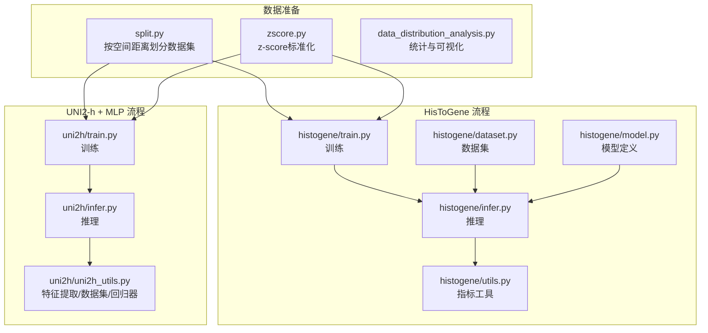
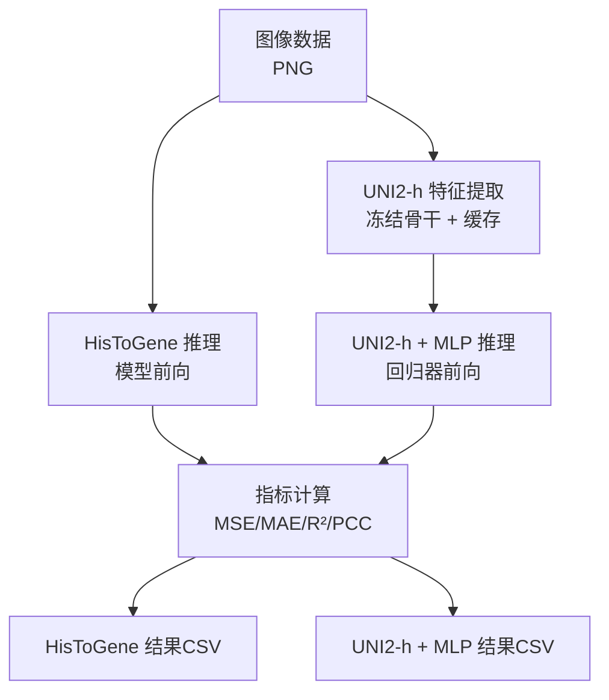
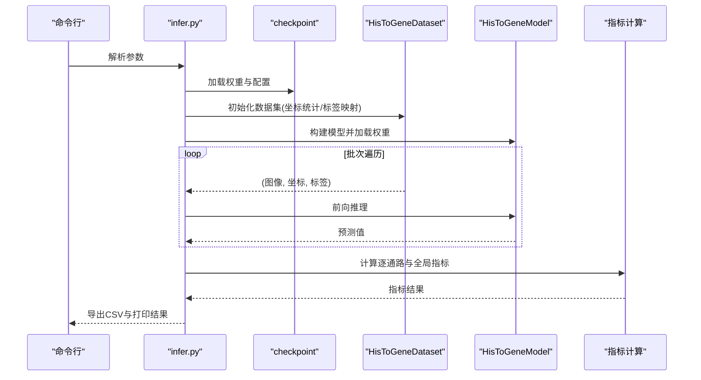
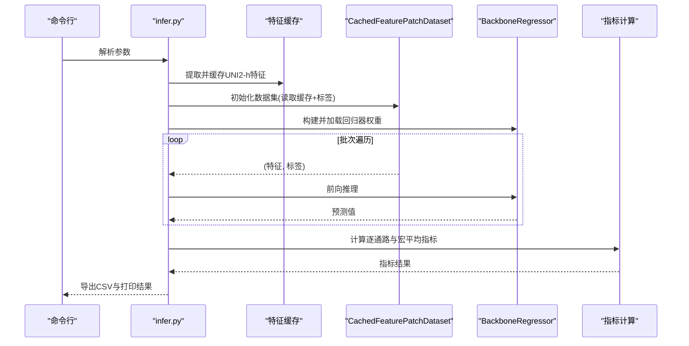
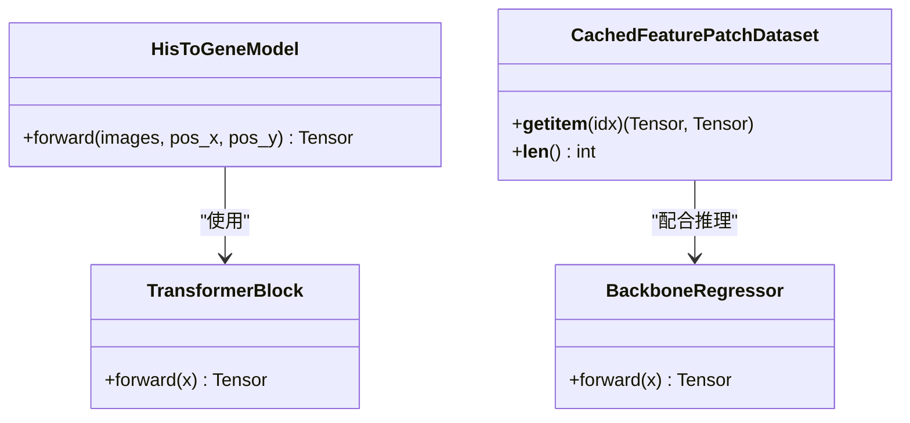
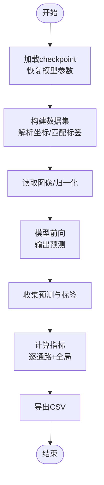
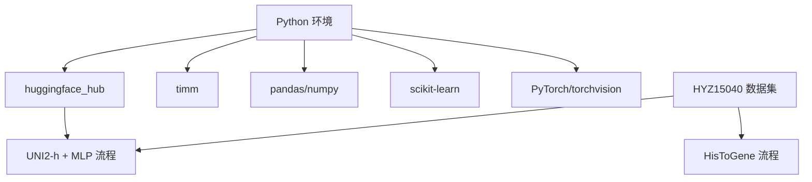

# 推理评估系统

<cite>
**本文引用的文件**
- [README.md](file://README.md)
- [histogene/infer.py](file://histogene/infer.py)
- [histogene/model.py](file://histogene/model.py)
- [histogene/dataset.py](file://histogene/dataset.py)
- [histogene/utils.py](file://histogene/utils.py)
- [uni2h/infer.py](file://uni2h/infer.py)
- [uni2h/uni2h_utils.py](file://uni2h/uni2h_utils.py)
- [uni2h/train.py](file://uni2h/train.py)
- [histogene/train.py](file://histogene/train.py)
- [split.py](file://split.py)
- [zscore.py](file://zscore.py)
- [HYZ15040_ssGSEA_scores.csv](file://HYZ15040_ssGSEA_scores.csv)
- [analysis_output/statistics_summary.csv](file://analysis_output/statistics_summary.csv)
- [data_distribution_analysis.py](file://data_distribution_analysis.py)
</cite>

## 目录
1. [简介](#简介)
2. [项目结构](#项目结构)
3. [核心组件](#核心组件)
4. [架构总览](#架构总览)
5. [详细组件分析](#详细组件分析)
6. [依赖关系分析](#依赖关系分析)
7. [性能考量](#性能考量)
8. [故障排查指南](#故障排查指南)
9. [结论](#结论)
10. [附录](#附录)

## 简介
本项目提供两类推理评估流程，用于将组织学切片图像映射到8条通路的ssGSEA评分，并进行统计指标评估与结果导出。两类流程的主要差异在于特征来源与推理策略：
- HisToGene：直接以图像为输入，通过视觉Transformer提取空间位置信息与图像特征，端到端回归8条通路评分。
- UNI2-h + MLP：冻结UNI2-h骨干网络，先提取1536维特征并缓存，再用轻量级MLP回归器进行回归预测。

系统同时提供数据划分、z-score标准化、统计分析与可视化工具，支持批量推理与结果对比分析。

## 项目结构
- histogene：HisToGene模型与训练/推理脚本
- uni2h：UNI2-h特征提取与回归器训练/推理脚本
- HYZ15040：数据集目录（包含train_patches与val_patches）
- analysis_output：统计分析输出
- split.py：按空间距离约束划分训练/验证集
- zscore.py：对ssGSEA评分进行z-score标准化
- data_distribution_analysis.py：数据分布统计与可视化
- README.md：环境与使用说明

**图表来源**
- [README.md:1-44](file://README.md#L1-L44)
- [histogene/train.py:1-338](file://histogene/train.py#L1-L338)
- [histogene/infer.py:1-169](file://histogene/infer.py#L1-L169)
- [histogene/model.py:1-160](file://histogene/model.py#L1-L160)
- [histogene/dataset.py:1-118](file://histogene/dataset.py#L1-L118)
- [histogene/utils.py:1-31](file://histogene/utils.py#L1-L31)
- [uni2h/train.py:1-227](file://uni2h/train.py#L1-L227)
- [uni2h/infer.py:1-175](file://uni2h/infer.py#L1-L175)
- [uni2h/uni2h_utils.py:1-303](file://uni2h/uni2h_utils.py#L1-L303)
- [split.py:1-200](file://split.py#L1-L200)
- [zscore.py:1-203](file://zscore.py#L1-L203)
- [data_distribution_analysis.py:1-482](file://data_distribution_analysis.py#L1-L482)

**章节来源**
- [README.md:1-44](file://README.md#L1-L44)
- [split.py:1-200](file://split.py#L1-L200)
- [zscore.py:1-203](file://zscore.py#L1-L203)

## 核心组件
- HisToGene 推理
  - 模型：视觉Transformer + 归纳头，输入图像与空间坐标，输出8条通路评分
  - 数据集：从PNG图像解析坐标，匹配z-score标签
  - 推理：批量化前向，收集预测与真实值，计算指标并导出CSV
- UNI2-h + MLP 推理
  - 特征提取：冻结UNI2-h骨干，提取1536维特征并缓存
  - 数据集：从缓存.pt文件读取特征，匹配标签
  - 推理：批量化前向，计算指标并导出CSV

**章节来源**
- [histogene/infer.py:66-169](file://histogene/infer.py#L66-L169)
- [uni2h/infer.py:43-175](file://uni2h/infer.py#L43-L175)
- [uni2h/uni2h_utils.py:137-170](file://uni2h/uni2h_utils.py#L137-L170)

## 架构总览
两类流程在“特征来源”和“推理策略”上存在显著差异：
- HisToGene：端到端，特征由图像直接产生，推理时进行GPU张量运算
- UNI2-h + MLP：离线特征提取+缓存，推理时仅进行轻量回归，减少显存占用

**图表来源**
- [histogene/infer.py:52-136](file://histogene/infer.py#L52-L136)
- [uni2h/infer.py:107-116](file://uni2h/infer.py#L107-L116)
- [uni2h/uni2h_utils.py:137-170](file://uni2h/uni2h_utils.py#L137-L170)

## 详细组件分析

### HisToGene 推理流程
- 模型加载：从checkpoint恢复模型权重与训练参数，构建HisToGeneModel
- 数据加载：HisToGeneDataset按文件名解析坐标，匹配z-score标签，归一化到[0, n_pos-1]
- 推理执行：DataLoader批量化，模型前向得到预测，收集全部预测与标签
- 指标计算：逐通路与全局指标（MSE、MAE、R²、PCC），并导出CSV

**图表来源**
- [histogene/infer.py:66-169](file://histogene/infer.py#L66-L169)
- [histogene/dataset.py:23-118](file://histogene/dataset.py#L23-L118)
- [histogene/model.py:64-160](file://histogene/model.py#L64-L160)
- [histogene/utils.py:20-31](file://histogene/utils.py#L20-L31)

**章节来源**
- [histogene/infer.py:66-169](file://histogene/infer.py#L66-L169)
- [histogene/dataset.py:23-118](file://histogene/dataset.py#L23-L118)
- [histogene/model.py:64-160](file://histogene/model.py#L64-L160)
- [histogene/utils.py:20-31](file://histogene/utils.py#L20-L31)

### UNI2-h + MLP 推理策略
- 特征提取与缓存：load_uni2h_backbone加载冻结骨干，extract_and_cache_features对每个patch提取特征并保存.pt文件
- 数据集：CachedFeaturePatchDataset从缓存读取特征，按标签CSV匹配targets
- 推理：BackboneRegressor进行回归，收集预测与标签，计算指标并导出CSV

**图表来源**
- [uni2h/infer.py:43-175](file://uni2h/infer.py#L43-L175)
- [uni2h/uni2h_utils.py:137-226](file://uni2h/uni2h_utils.py#L137-L226)
- [uni2h/uni2h_utils.py:228-247](file://uni2h/uni2h_utils.py#L228-L247)

**章节来源**
- [uni2h/infer.py:43-175](file://uni2h/infer.py#L43-L175)
- [uni2h/uni2h_utils.py:137-226](file://uni2h/uni2h_utils.py#L137-L226)
- [uni2h/uni2h_utils.py:228-247](file://uni2h/uni2h_utils.py#L228-L247)

### 模型类与数据结构
- HisToGeneModel
  - Patch Embedding + 位置编码（X/Y分离嵌入）+ CLS Token + Transformer编码器 + 归纳头
  - 输入：(B, 3, H, W)图像与(X,Y)坐标索引
  - 输出：(B, 8)通路评分
- CachedFeaturePatchDataset
  - 从缓存目录读取特征(.pt)，匹配标签CSV，返回特征与targets
- BackboneRegressor
  - 线性层 + GELU + Dropout + 线性层，输出回归值

**图表来源**
- [histogene/model.py:64-160](file://histogene/model.py#L64-L160)
- [histogene/model.py:49-62](file://histogene/model.py#L49-L62)
- [uni2h/uni2h_utils.py:173-226](file://uni2h/uni2h_utils.py#L173-L226)
- [uni2h/uni2h_utils.py:228-247](file://uni2h/uni2h_utils.py#L228-L247)

**章节来源**
- [histogene/model.py:64-160](file://histogene/model.py#L64-L160)
- [uni2h/uni2h_utils.py:173-226](file://uni2h/uni2h_utils.py#L173-L226)
- [uni2h/uni2h_utils.py:228-247](file://uni2h/uni2h_utils.py#L228-L247)

### 数据流与算法细节
- 坐标归一化：将像素坐标映射到[0, n_pos-1]，用于X/Y独立嵌入
- 特征缓存：按patch文件名建立缓存键，避免重复计算
- 指标计算：逐通路MSE/MAE/R²/PCC，全局取均值；R²对常数列保护

**图表来源**
- [histogene/infer.py:66-169](file://histogene/infer.py#L66-L169)
- [histogene/dataset.py:89-95](file://histogene/dataset.py#L89-L95)
- [histogene/utils.py:20-31](file://histogene/utils.py#L20-L31)

**章节来源**
- [histogene/dataset.py:89-95](file://histogene/dataset.py#L89-L95)
- [histogene/utils.py:20-31](file://histogene/utils.py#L20-L31)

## 依赖关系分析
- 环境与依赖：PyTorch、torchvision、Pillow、scikit-learn、pandas、numpy、timm、huggingface_hub
- 数据依赖：HYZ15040数据集（train_patches/val_patches）、z-score标签文件
- 特征依赖：UNI2-h骨干模型（HuggingFace Hub），需配置token

**图表来源**
- [README.md:17-28](file://README.md#L17-L28)
- [uni2h/uni2h_utils.py:24-28](file://uni2h/uni2h_utils.py#L24-L28)

**章节来源**
- [README.md:17-28](file://README.md#L17-L28)
- [uni2h/uni2h_utils.py:24-28](file://uni2h/uni2h_utils.py#L24-L28)

## 性能考量
- 批量推理优化
  - 增大批大小（如HisToGene默认64，UNI2-h默认256）可提升吞吐，但需平衡显存占用
  - pin_memory与num_workers在CUDA可用时可加速数据传输
  - UNI2-h流程通过特征缓存避免重复特征提取，显著降低推理时间
- 显存管理
  - UNI2-h骨干冻结，仅回归器参与推理，显存占用更低
  - HisToGene需在GPU上进行端到端推理，注意batch_size与图像尺寸
- 混合精度
  - HisToGene训练阶段支持AMP，推理阶段可按需开启（需在推理脚本中扩展）

**章节来源**
- [histogene/infer.py:114-117](file://histogene/infer.py#L114-L117)
- [uni2h/infer.py:84-90](file://uni2h/infer.py#L84-L90)
- [uni2h/train.py:102-115](file://uni2h/train.py#L102-L115)
- [histogene/train.py:197-200](file://histogene/train.py#L197-L200)

## 故障排查指南
- 数据集路径与文件
  - 确认split.py已正确划分train_patches/val_patches
  - 确认zscore.py已生成HYZ15040_ssGSEA_scores_zscore.csv
- HuggingFace token
  - UNI2-h骨干需要有效token，可在环境变量或脚本内设置
- 特征缓存
  - 若缓存缺失或损坏，使用--rebuild_cache重建
- 指标异常
  - 当标签为常数列时，R²可能为NaN，脚本已做保护
- 设备与显存
  - CUDA不可用时自动切换CPU；显存不足时减小batch_size或关闭pin_memory

**章节来源**
- [README.md:17-28](file://README.md#L17-L28)
- [uni2h/infer.py:38-39](file://uni2h/infer.py#L38-L39)
- [uni2h/infer.py:124-129](file://uni2h/infer.py#L124-L129)
- [uni2h/uni2h_utils.py:60-67](file://uni2h/uni2h_utils.py#L60-L67)

## 结论
本系统提供了两条互补的推理评估路径：HisToGene适合端到端学习与高精度回归；UNI2-h + MLP适合大规模批量推理与资源受限场景。两者均提供完善的指标计算与结果导出，并配套数据划分、标准化与统计分析工具，便于结果对比与质量控制。

## 附录

### 评估指标计算方法
- MSE：均方误差
- MAE：平均绝对误差
- R²：决定系数，常数列时返回NaN
- PCC：皮尔逊相关系数，零方差时返回NaN
- 宏平均：对8条通路取均值

**章节来源**
- [histogene/utils.py:20-31](file://histogene/utils.py#L20-L31)
- [uni2h/uni2h_utils.py:90-134](file://uni2h/uni2h_utils.py#L90-L134)
- [uni2h/infer.py:141-150](file://uni2h/infer.py#L141-L150)

### 结果导出格式与可视化
- 推理结果CSV：包含patch_id、true_*、pred_*列
- 指标CSV：逐通路与宏平均指标
- 统计分析：直方图、QQ图、箱线图、相关性热力图、偏度/峰度对比

**章节来源**
- [histogene/infer.py:126-136](file://histogene/infer.py#L126-L136)
- [histogene/infer.py:161-164](file://histogene/infer.py#L161-L164)
- [uni2h/infer.py:159-170](file://uni2h/infer.py#L159-L170)
- [data_distribution_analysis.py:166-377](file://data_distribution_analysis.py#L166-L377)

### 数据准备与质量控制
- 数据划分：按空间距离阈值（350px）划分训练/验证集，避免空间重叠
- 标准化：对8条通路评分进行z-score标准化
- 统计分析：偏度、峰度、异常值检测、正态性检验，辅助质量控制

**章节来源**
- [split.py:22-96](file://split.py#L22-L96)
- [zscore.py:141-203](file://zscore.py#L141-L203)
- [data_distribution_analysis.py:65-137](file://data_distribution_analysis.py#L65-L137)
- [analysis_output/statistics_summary.csv:1-10](file://analysis_output/statistics_summary.csv#L1-L10)