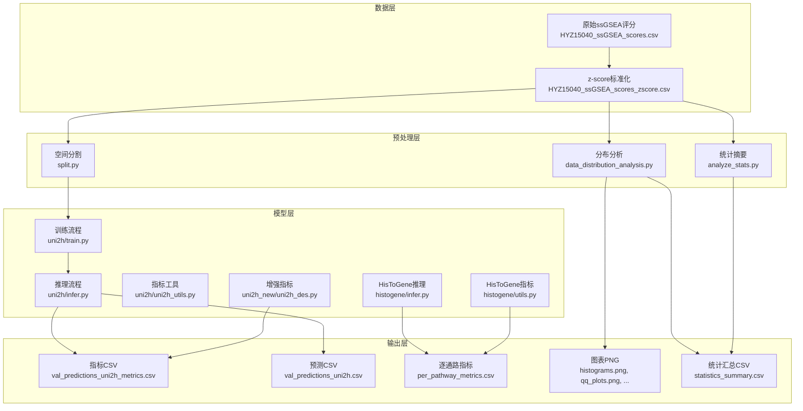
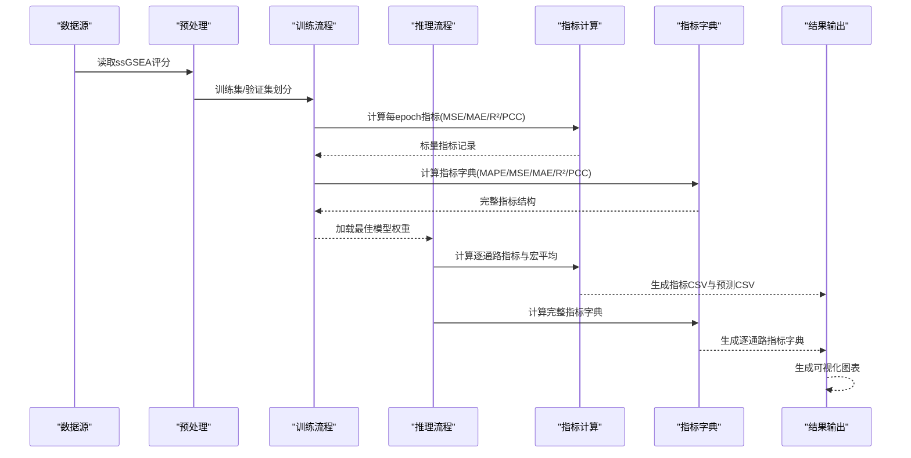
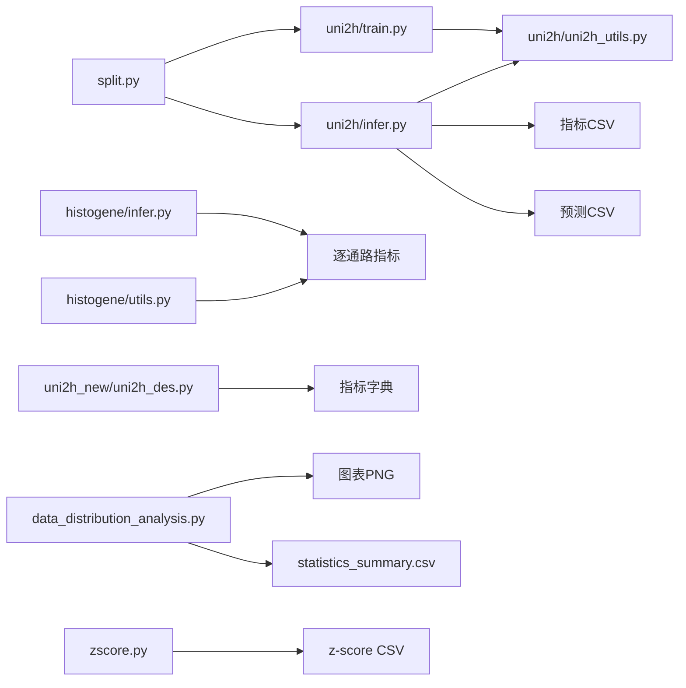

# 评估指标与结果分析

<cite>
**本文档引用的文件**
- [analyze_stats.py](file://analyze_stats.py)
- [data_distribution_analysis.py](file://data_distribution_analysis.py)
- [zscore.py](file://zscore.py)
- [split.py](file://split.py)
- [uni2h/train.py](file://uni2h/train.py)
- [uni2h/infer.py](file://uni2h/infer.py)
- [uni2h/uni2h_utils.py](file://uni2h/uni2h_utils.py)
- [histogene/utils.py](file://histogene/utils.py)
- [histogene/model.py](file://histogene/model.py)
- [histogene/infer.py](file://histogene/infer.py)
- [uni2h_new/uni2h_des.py](file://uni2h_new/uni2h_des.py)
- [HYZ15040_ssGSEA_scores.csv](file://HYZ15040_ssGSEA_scores.csv)
- [HYZ15040_ssGSEA_scores_zscore.csv](file://HYZ15040_ssGSEA_scores_zscore.csv)
- [analysis_output/statistics_summary.csv](file://analysis_output/statistics_summary.csv)
- [histogene/infer_results/per_pathway_metrics.csv](file://histogene/infer_results/per_pathway_metrics.csv)
- [README.md](file://README.md)
</cite>

## 更新摘要
**变更内容**
- 评估系统从简单标量值扩展为完整的指标字典结构
- 新增MAPE（平均绝对百分比误差）指标，提供更全面的误差度量
- 支持每个目标的详细分析，包括逐通路指标和全局指标
- 增强了指标计算的鲁棒性和异常值处理能力
- 完善了训练和推理阶段的指标输出机制

## 目录
1. [简介](#简介)
2. [项目结构](#项目结构)
3. [核心组件](#核心组件)
4. [架构概览](#架构概览)
5. [详细组件分析](#详细组件分析)
6. [依赖关系分析](#依赖关系分析)
7. [性能考虑](#性能考虑)
8. [故障排除指南](#故障排除指南)
9. [结论](#结论)
10. [附录](#附录)

## 简介
本技术文档围绕评估指标与结果分析展开，系统阐述了均方误差(MSE)、平均绝对误差(MAE)、平均绝对百分比误差(MAPE)、决定系数(R²)、皮尔逊相关系数(PCC)的计算原理、应用场景与实现细节，并结合本项目的实际代码，给出逐通路指标与全局指标的差异、模型间可比性分析、结果可视化方案、导出格式规范、统计显著性检验与置信区间计算方法、结果质量控制与异常检测策略，以及与其他研究结果的对比分析框架。

**更新** 评估系统现已从简单的标量值扩展为完整的指标字典结构，支持每个目标的详细分析和多种误差度量方式。

## 项目结构
该项目围绕空间转录组学数据构建预测模型，主要涉及以下模块：
- 数据预处理与探索：z-score标准化、数据分布分析与可视化
- 模型训练与推理：基于UNI2-h特征的回归模型训练与推理
- 指标计算：MSE、MAE、MAPE、R²、PCC的实现与使用
- 结果导出：CSV、图表文件的生成与组织

**图表来源**
- [split.py:99-200](file://split.py#L99-L200)
- [data_distribution_analysis.py:416-482](file://data_distribution_analysis.py#L416-L482)
- [analyze_stats.py:1-40](file://analyze_stats.py#L1-L40)
- [uni2h/train.py:52-227](file://uni2h/train.py#L52-L227)
- [uni2h/infer.py:43-175](file://uni2h/infer.py#L43-L175)
- [uni2h/uni2h_utils.py:90-135](file://uni2h/uni2h_utils.py#L90-L135)
- [histogene/infer.py:141-169](file://histogene/infer.py#L141-L169)
- [histogene/utils.py:20-31](file://histogene/utils.py#L20-L31)
- [uni2h_new/uni2h_des.py:159-247](file://uni2h_new/uni2h_des.py#L159-L247)

**章节来源**
- [README.md:1-44](file://README.md#L1-L44)
- [HYZ15040_ssGSEA_scores.csv:1-200](file://HYZ15040_ssGSEA_scores.csv#L1-L200)
- [HYZ15040_ssGSEA_scores_zscore.csv:1-200](file://HYZ15040_ssGSEA_scores_zscore.csv#L1-L200)

## 核心组件
本节聚焦评估指标的实现与使用，涵盖：
- 指标计算函数：MSE、MAE、MAPE、R²、PCC
- 逐通路与全局指标：单目标与宏平均
- 训练与推理流程中的指标输出
- 可视化与导出

**更新** 现在支持完整的指标字典结构，包含overall和per_target两个层级，提供更详细的分析维度。

**章节来源**
- [uni2h/uni2h_utils.py:90-135](file://uni2h/uni2h_utils.py#L90-L135)
- [uni2h_new/uni2h_des.py:159-247](file://uni2h_new/uni2h_des.py#L159-L247)
- [histogene/infer.py:141-169](file://histogene/infer.py#L141-L169)
- [histogene/utils.py:20-31](file://histogene/utils.py#L20-L31)

## 架构概览
下图展示了从数据到指标输出的完整流程，强调指标计算在训练与推理阶段的应用位置。

**图表来源**
- [uni2h/train.py:137-166](file://uni2h/train.py#L137-L166)
- [uni2h/infer.py:102-171](file://uni2h/infer.py#L102-L171)
- [uni2h/uni2h_utils.py:90-135](file://uni2h/uni2h_utils.py#L90-L135)
- [uni2h_new/uni2h_des.py:159-247](file://uni2h_new/uni2h_des.py#L159-L247)

## 详细组件分析

### 指标计算原理与实现
- 均方误差(MSE)：衡量预测值与真实值差值平方的期望，对异常值敏感，适合连续变量回归评估。
- 平均绝对误差(MAE)：衡量预测值与真实值差值绝对值的期望，对异常值相对稳健。
- 平均绝对百分比误差(MAPE)：衡量预测误差占真实值的百分比，对尺度不敏感，适合跨目标比较。
- 决定系数(R²)：反映模型解释方差的比例，取值范围(-∞,1]，越接近1越好。
- 皮尔逊相关系数(PCC)：衡量线性相关程度，取值范围[-1,1]，越接近±1线性关系越强。

**更新** 新增MAPE指标计算，包含异常值处理和无穷值过滤机制，确保指标的稳定性和可靠性。

实现要点：
- 使用sklearn.metrics计算MSE、MAE、R²、MAPE。
- 使用numpy.corrcoef或自定义函数计算PCC，注意当任一变量标准差为0时返回缺失值以避免除零错误。
- 训练阶段提供逐样本指标，推理阶段提供逐通路与宏平均指标。
- 支持完整的指标字典结构，包含overall和per_target两个层级。

**章节来源**
- [uni2h/uni2h_utils.py:90-135](file://uni2h/uni2h_utils.py#L90-L135)
- [uni2h_new/uni2h_des.py:159-247](file://uni2h_new/uni2h_des.py#L159-L247)
- [histogene/utils.py:20-31](file://histogene/utils.py#L20-L31)

### 逐通路指标与全局指标
- 逐通路指标：针对每个基因集评分目标独立计算MSE、MAE、MAPE、R²、PCC，便于识别表现较差的目标。
- 全局指标（宏平均）：对8个目标的指标取算术平均，作为整体性能的综合评价。
- 指标字典结构：包含overall（全局）和per_target（逐目标）两个层级，提供完整的分析维度。

**更新** 新增完整的指标字典结构，支持更细致的分析需求。

**章节来源**
- [uni2h/infer.py:141-169](file://uni2h/infer.py#L141-L169)
- [uni2h_new/uni2h_des.py:159-247](file://uni2h_new/uni2h_des.py#L159-L247)

### 训练与推理中的指标使用
- 训练阶段：每轮epoch输出训练与验证集的MSE、MAE、R²、PCC，用于监控收敛与过拟合。
- 推理阶段：加载最佳模型权重，计算逐通路与宏平均指标，并导出预测结果与指标CSV。
- 指标字典：支持完整的指标结构，包含overall和per_target两个层级。

**更新** 训练和推理阶段都支持指标字典输出，提供更丰富的分析信息。

**章节来源**
- [uni2h/train.py:137-166](file://uni2h/train.py#L137-L166)
- [uni2h/infer.py:102-171](file://uni2h/infer.py#L102-L171)
- [uni2h_new/uni2h_des.py:512-568](file://uni2h_new/uni2h_des.py#L512-L568)

### 数据预处理与分布分析
- z-score标准化：将各基因集评分按列中心化与标准化，消除量纲影响，提高模型稳定性。
- 分布分析：计算均值、中位数、标准差、偏度、峰度、异常值数量等，进行正态性检验（Shapiro-Wilk、D'Agostino）。
- 可视化：直方图（含正态拟合）、Q-Q图、箱线图、偏度/峰度对比图、相关性热力图。

**章节来源**
- [zscore.py:64-127](file://zscore.py#L64-L127)
- [data_distribution_analysis.py:65-137](file://data_distribution_analysis.py#L65-L137)
- [data_distribution_analysis.py:166-215](file://data_distribution_analysis.py#L166-L215)
- [data_distribution_analysis.py:217-247](file://data_distribution_analysis.py#L217-L247)
- [data_distribution_analysis.py:249-287](file://data_distribution_analysis.py#L249-L287)
- [data_distribution_analysis.py:289-348](file://data_distribution_analysis.py#L289-L348)
- [data_distribution_analysis.py:351-379](file://data_distribution_analysis.py#L351-L379)
- [analyze_stats.py:12-40](file://analyze_stats.py#L12-L40)

### 结果可视化方法
- 散点图：预测值vs真实值，配合R²与PCC标注，评估线性关系与拟合程度。
- 残差分析：残差=预测-真实，观察残差分布、异方差性与异常值。
- ROC曲线：二分类场景下的ROC曲线与AUC，本项目为回归任务，通常不直接使用。
- 其他：直方图、Q-Q图、箱线图、相关性热力图等。

**章节来源**
- [data_distribution_analysis.py:166-215](file://data_distribution_analysis.py#L166-L215)
- [data_distribution_analysis.py:217-247](file://data_distribution_analysis.py#L217-L247)
- [data_distribution_analysis.py:249-287](file://data_distribution_analysis.py#L249-L287)
- [data_distribution_analysis.py:289-348](file://data_distribution_analysis.py#L289-L348)
- [data_distribution_analysis.py:351-379](file://data_distribution_analysis.py#L351-L379)

### 结果导出格式
- CSV文件：指标CSV（逐通路与宏平均）、预测CSV（逐样本真实值与预测值）、统计汇总CSV。
- 图表文件：PNG格式的各类可视化图表。
- 指标字典：JSON格式的完整指标结构，包含overall和per_target两个层级。
- 增强指标：支持MAPE等更多误差度量的详细分析。

**更新** 新增指标字典格式的导出，支持更丰富的分析需求。

**章节来源**
- [uni2h/infer.py:152-171](file://uni2h/infer.py#L152-L171)
- [histogene/infer.py:161-169](file://histogene/infer.py#L161-L169)
- [data_distribution_analysis.py:157-164](file://data_distribution_analysis.py#L157-L164)

### 模型间可比性分析
- 同一数据集与同一评估指标体系（MSE、MAE、MAPE、R²、PCC）保证可比性。
- 逐通路指标便于比较不同模型在各目标上的表现差异。
- 宏平均指标用于整体性能对比。
- 指标字典结构支持更细致的比较分析。
- 注意：若模型对不同目标采用不同预处理或损失函数，需统一处理以确保公平比较。

**更新** 指标字典结构提供了更全面的比较维度，支持逐目标和全局层面的对比分析。

**章节来源**
- [uni2h/infer.py:102-171](file://uni2h/infer.py#L102-L171)
- [uni2h_new/uni2h_des.py:159-247](file://uni2h_new/uni2h_des.py#L159-L247)

### 统计显著性检验与置信区间
- 置信区间：可基于Bootstrap或参数法估计指标的95%置信区间，评估估计精度。
- 显著性检验：若需比较两个模型的指标差异，可采用配对t检验或非参数检验（如Wilcoxon符号秩检验）。
- 指标字典：支持对overall和per_target指标分别进行统计检验。
- 注意：本仓库未直接实现上述功能，可在外部工具或扩展模块中实现。

**章节来源**
- [data_distribution_analysis.py:382-414](file://data_distribution_analysis.py#L382-L414)

### 结果质量控制与异常检测
- 异常值检测：基于IQR法则识别异常值，统计异常值数量与比例。
- 正态性检验：Shapiro-Wilk与D'Agostino检验辅助判断数据分布形态。
- 标准化：z-score标准化减少量纲影响，提升稳定性。
- 可视化：直方图、Q-Q图、箱线图辅助识别分布异常与离群点。
- 指标鲁棒性：MAPE包含异常值处理机制，提高指标稳定性。

**更新** MAPE指标包含异常值处理和无穷值过滤，提高了指标计算的鲁棒性。

**章节来源**
- [analyze_stats.py:12-40](file://analyze_stats.py#L12-L40)
- [data_distribution_analysis.py:65-137](file://data_distribution_analysis.py#L65-L137)
- [data_distribution_analysis.py:382-414](file://data_distribution_analysis.py#L382-L414)
- [zscore.py:101-127](file://zscore.py#L101-L127)
- [uni2h_new/uni2h_des.py:197-210](file://uni2h_new/uni2h_des.py#L197-L210)

### 与其他研究结果的对比分析框架
- 指标对比：在同一数据集上，比较不同模型的MSE、MAE、MAPE、R²、PCC，关注逐通路差异。
- 可视化对比：散点图、残差图、相关性热力图用于直观对比。
- 统计检验：对关键指标进行显著性检验，评估差异是否具有统计学意义。
- 指标字典分析：利用overall和per_target两个层级进行多维度对比。
- 影响因素：分析不同预处理（如标准化）、数据划分策略（空间分割）对结果的影响。

**更新** 指标字典结构提供了更精细的对比分析框架，支持逐目标和全局层面的综合比较。

**章节来源**
- [split.py:22-96](file://split.py#L22-L96)
- [README.md:4-8](file://README.md#L4-L8)

## 依赖关系分析
- 模块耦合：训练与推理依赖指标计算模块；推理依赖训练得到的最佳模型权重。
- 外部依赖：pandas、numpy、scipy、matplotlib、seaborn、sklearn、torch等。
- 数据依赖：ssGSEA评分CSV文件、特征缓存目录、模型检查点。
- 指标字典：支持overall和per_target两个层级的数据结构。

**图表来源**
- [uni2h/train.py:52-227](file://uni2h/train.py#L52-L227)
- [uni2h/infer.py:43-175](file://uni2h/infer.py#L43-L175)
- [uni2h/uni2h_utils.py:90-135](file://uni2h/uni2h_utils.py#L90-L135)
- [histogene/infer.py:141-169](file://histogene/infer.py#L141-L169)
- [histogene/utils.py:20-31](file://histogene/utils.py#L20-L31)
- [uni2h_new/uni2h_des.py:159-247](file://uni2h_new/uni2h_des.py#L159-L247)
- [data_distribution_analysis.py:416-482](file://data_distribution_analysis.py#L416-L482)
- [zscore.py:141-202](file://zscore.py#L141-L202)
- [split.py:99-200](file://split.py#L99-L200)

**章节来源**
- [uni2h/train.py:52-227](file://uni2h/train.py#L52-L227)
- [uni2h/infer.py:43-175](file://uni2h/infer.py#L43-L175)
- [uni2h/uni2h_utils.py:90-135](file://uni2h/uni2h_utils.py#L90-L135)
- [histogene/infer.py:141-169](file://histogene/infer.py#L141-L169)
- [histogene/utils.py:20-31](file://histogene/utils.py#L20-L31)
- [uni2h_new/uni2h_des.py:159-247](file://uni2h_new/uni2h_des.py#L159-L247)
- [data_distribution_analysis.py:416-482](file://data_distribution_analysis.py#L416-L482)
- [zscore.py:141-202](file://zscore.py#L141-L202)
- [split.py:99-200](file://split.py#L99-L200)

## 性能考虑
- 计算效率：指标计算在GPU上进行，批量处理提升速度。
- 内存管理：推理阶段聚合所有样本的预测与真实值，注意内存占用。
- 可视化性能：图表保存时设置合适的分辨率与布局，平衡质量与体积。
- 指标字典优化：完整的指标结构增加了计算开销，但提供了更丰富的分析信息。

**更新** 指标字典结构增加了计算复杂度，需要在分析深度和计算效率之间找到平衡。

**章节来源**
- [uni2h/train.py:251-277](file://uni2h/train.py#L251-L277)
- [uni2h/infer.py:107-115](file://uni2h/infer.py#L107-L115)
- [uni2h_new/uni2h_des.py:512-568](file://uni2h_new/uni2h_des.py#L512-L568)

## 故障排除指南
- 指标缺失：当某目标为常数时，R²可能返回NaN，需在计算前检查标准差。
- 异常值影响：异常值可能导致指标失真，建议先进行异常值检测与处理。
- 数据类型：确保CSV列可转换为数值，必要时进行清洗与填充。
- 模型加载：检查检查点路径与设备兼容性，避免加载失败。
- 指标字典异常：检查指标字典结构的完整性，确保overall和per_target两个层级都正确生成。

**更新** 新增指标字典相关的故障排除指导，包括结构完整性检查。

**章节来源**
- [uni2h/uni2h_utils.py:121-126](file://uni2h/uni2h_utils.py#L121-L126)
- [zscore.py:40-62](file://zscore.py#L40-L62)
- [uni2h/infer.py:48-56](file://uni2h/infer.py#L48-L56)
- [uni2h_new/uni2h_des.py:159-247](file://uni2h_new/uni2h_des.py#L159-L247)

## 结论
本项目通过严格的指标计算、可视化与质量控制流程，实现了对空间转录组学预测任务的全面评估。**更新** 评估系统现已从简单的标量值扩展为完整的指标字典结构，新增MAPE等指标，支持每个目标的详细分析。逐通路与全局指标相结合，既能洞察模型在各目标上的表现，又能提供整体性能参考。建议在后续工作中引入统计显著性检验与置信区间估计，进一步增强结果的可信度与可比性。

## 附录
- 数据文件：ssGSEA评分CSV（原始与z-score版本）
- 输出文件：指标CSV、预测CSV、统计汇总CSV、各类图表PNG、指标字典JSON
- 工具函数：指标计算、数据标准化、分布分析、可视化
- 增强功能：MAPE指标、指标字典结构、逐目标分析

**章节来源**
- [HYZ15040_ssGSEA_scores.csv:1-200](file://HYZ15040_ssGSEA_scores.csv#L1-L200)
- [HYZ15040_ssGSEA_scores_zscore.csv:1-200](file://HYZ15040_ssGSEA_scores_zscore.csv#L1-L200)
- [analysis_output/statistics_summary.csv:1-10](file://analysis_output/statistics_summary.csv#L1-L10)
- [histogene/infer_results/per_pathway_metrics.csv:1-10](file://histogene/infer_results/per_pathway_metrics.csv#L1-L10)
- [README.md:4-8](file://README.md#L4-L8)