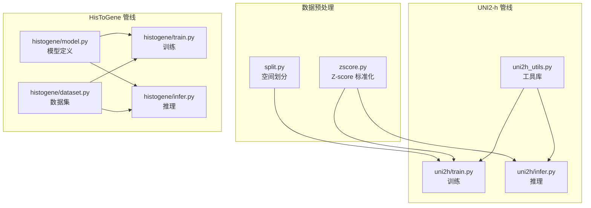
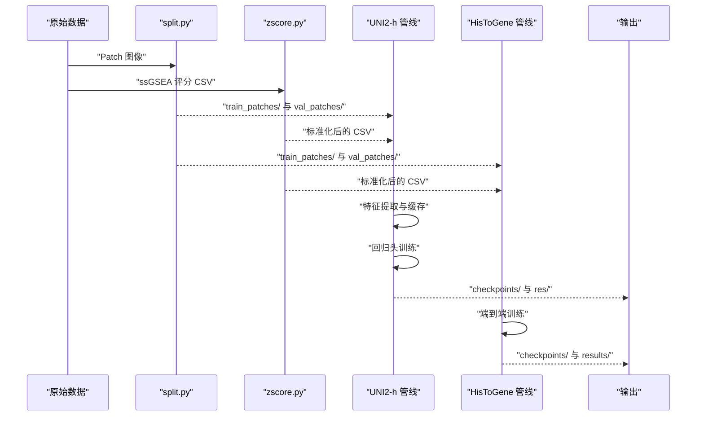
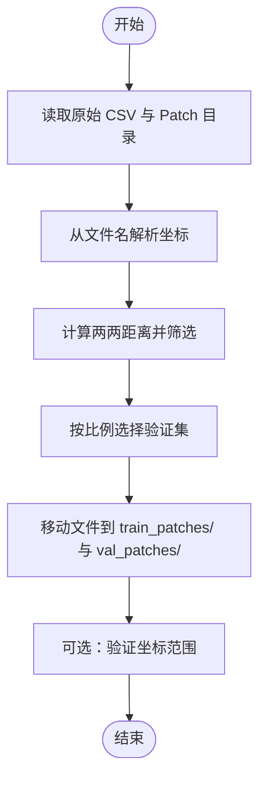
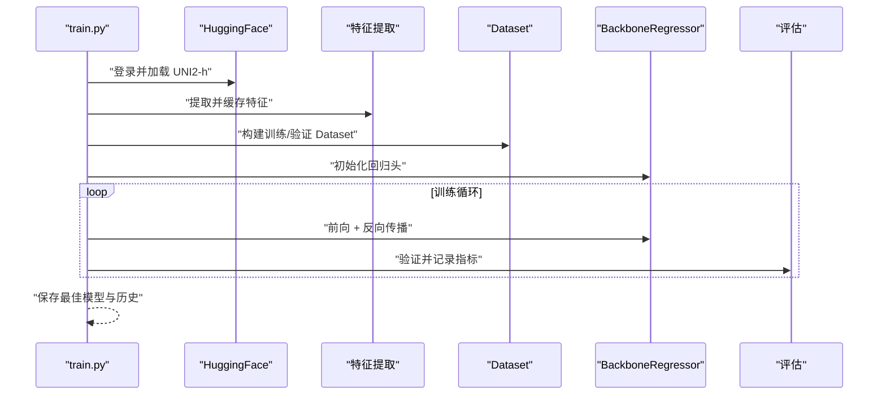
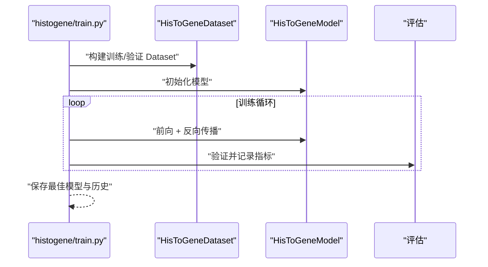
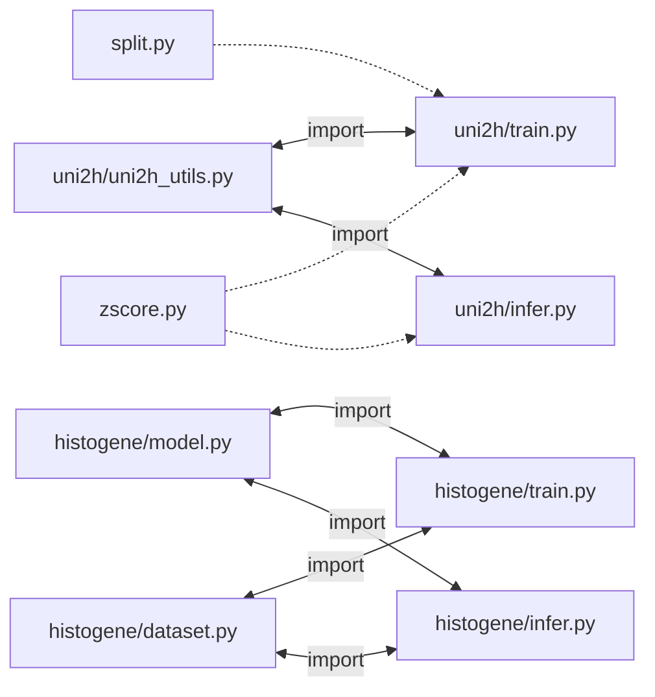

# 故障排除与常见问题

<cite>
**本文引用的文件**
- [README.md](file://README.md)
- [PFMval学习指南.md](file://PFMval学习指南.md)
- [HisToGene应用规划.md](file://HisToGene应用规划.md)
- [split.py](file://split.py)
- [zscore.py](file://zscore.py)
- [uni2h/train.py](file://uni2h/train.py)
- [uni2h/infer.py](file://uni2h/infer.py)
- [uni2h/uni2h_utils.py](file://uni2h/uni2h_utils.py)
- [histogene/train.py](file://histogene/train.py)
- [histogene/infer.py](file://histogene/infer.py)
- [analyze_stats.py](file://analyze_stats.py)
- [data_distribution_analysis.py](file://data_distribution_analysis.py)
</cite>

## 目录
1. [简介](#简介)
2. [项目结构](#项目结构)
3. [核心组件](#核心组件)
4. [架构总览](#架构总览)
5. [详细组件分析](#详细组件分析)
6. [依赖关系分析](#依赖关系分析)
7. [性能考虑](#性能考虑)
8. [故障排除指南](#故障排除指南)
9. [结论](#结论)
10. [附录](#附录)

## 简介
本指南面向使用 PFMval 项目的用户，聚焦于安装、配置、训练与推理全流程中的常见问题与排障方法。内容覆盖：
- 环境与依赖问题
- 数据准备与预处理问题（空间划分、Z-score 标准化）
- 模型加载与特征提取问题（HuggingFace Token、UNI2-h 模型下载）
- 训练与推理问题（显存不足、过拟合、指标异常）
- 日志与调试技巧
- 社区支持与问题反馈渠道
- 版本兼容与迁移升级注意事项

## 项目结构
项目采用“脚本驱动 + 模块化工具”的组织方式，核心由数据预处理脚本与两个可替换的模型训练/推理管线组成：
- 数据预处理：split.py（空间无重叠划分）、zscore.py（Z-score 标准化）
- 模型管线一（UNI2-h + MLP）：uni2h/train.py、uni2h/infer.py、uni2h/uni2h_utils.py
- 模型管线二（HisToGene ViT + 位置编码）：histogene/train.py、histogene/infer.py、histogene/model.py、histogene/dataset.py、histogene/utils.py

**图表来源**
- [split.py:1-200](file://split.py#L1-L200)
- [zscore.py:1-203](file://zscore.py#L1-L203)
- [uni2h/train.py:1-227](file://uni2h/train.py#L1-L227)
- [uni2h/infer.py:1-175](file://uni2h/infer.py#L1-L175)
- [uni2h/uni2h_utils.py:1-303](file://uni2h/uni2h_utils.py#L1-L303)
- [histogene/train.py:1-338](file://histogene/train.py#L1-L338)
- [histogene/infer.py:1-169](file://histogene/infer.py#L1-L169)

**章节来源**
- [README.md:1-44](file://README.md#L1-L44)
- [PFMval学习指南.md:1-499](file://PFMval学习指南.md#L1-L499)

## 核心组件
- 数据预处理
  - split.py：基于文件名坐标进行空间距离约束划分，确保训练/验证集之间无空间泄漏。
  - zscore.py：对最后 N 列（8 个通路评分）执行 Z-score 标准化，统一量纲。
- UNI2-h 管线
  - uni2h_utils.py：加载 UNI2-h 骨干（冻结）、特征提取与缓存、Dataset、回归头、训练/评估函数。
  - uni2h/train.py：两阶段流程：特征提取与缓存 → 回归头训练（MSELoss、AdamW、ReduceLROnPlateau、早停）。
  - uni2h/infer.py：加载最佳 checkpoint，对验证集进行推理与指标评估。
- HisToGene 管线
  - histogene/train.py：端到端训练，使用 Huber 损失、AdamW、早停与学习率调度。
  - histogene/infer.py：加载 checkpoint，对指定目录进行推理，输出逐通路指标与 CSV。

**章节来源**
- [PFMval学习指南.md:26-499](file://PFMval学习指南.md#L26-L499)
- [uni2h/uni2h_utils.py:1-303](file://uni2h/uni2h_utils.py#L1-L303)
- [uni2h/train.py:1-227](file://uni2h/train.py#L1-L227)
- [uni2h/infer.py:1-175](file://uni2h/infer.py#L1-L175)
- [histogene/train.py:1-338](file://histogene/train.py#L1-L338)
- [histogene/infer.py:1-169](file://histogene/infer.py#L1-L169)

## 架构总览
下图展示了从原始数据到训练/推理结果的端到端流程，以及两条可选的模型管线。

**图表来源**
- [split.py:99-200](file://split.py#L99-L200)
- [zscore.py:141-203](file://zscore.py#L141-L203)
- [uni2h/train.py:60-227](file://uni2h/train.py#L60-L227)
- [uni2h/infer.py:43-175](file://uni2h/infer.py#L43-L175)
- [histogene/train.py:174-338](file://histogene/train.py#L174-L338)
- [histogene/infer.py:66-169](file://histogene/infer.py#L66-L169)

## 详细组件分析

### 数据预处理：空间划分与 Z-score
- 空间划分（split.py）
  - 依据文件名中的坐标（patch_x..._y...）计算欧氏距离，确保验证集与训练集之间距离阈值（默认 350px）。
  - 支持随机种子固定，保证可重复性；最终精确控制验证集数量。
  - 输出 train_patches/ 与 val_patches/ 两个文件夹。
- Z-score 标准化（zscore.py）
  - 对最后 N 列（默认 8）执行 z = (x - mean) / std，样本标准差（ddof=1）。
  - 自动检测无法转换为数值的列并提示；标准差为 0 的列跳过标准化。
  - 生成标准化后的 CSV，并保存统计摘要。

**图表来源**
- [split.py:22-198](file://split.py#L22-L198)

**章节来源**
- [split.py:1-200](file://split.py#L1-L200)
- [zscore.py:1-203](file://zscore.py#L1-L203)

### UNI2-h 管线：特征提取与回归头训练
- 特征提取与缓存
  - 通过 load_uni2h_backbone 加载冻结的 UNI2-h（224×224，1536 维输出），对每个 Patch 图像提取特征并缓存为 .pt 文件。
  - 支持断点续传（rebuild 参数控制是否重建缓存）。
- 数据集与回归头
  - CachedFeaturePatchDataset：从缓存读取特征，从 CSV 读取标签，匹配 patch_id。
  - BackboneRegressor：LayerNorm → Linear(1536→hidden_dim) → GELU → Dropout → Linear(hidden_dim→8)。
- 训练与评估
  - 损失：MSELoss；优化器：AdamW；学习率调度：ReduceLROnPlateau；早停：patience=10。
  - 保存最佳 checkpoint 与训练历史 CSV。

**图表来源**
- [uni2h/uni2h_utils.py:31-71](file://uni2h/uni2h_utils.py#L31-L71)
- [uni2h/uni2h_utils.py:137-170](file://uni2h/uni2h_utils.py#L137-L170)
- [uni2h/uni2h_utils.py:172-226](file://uni2h/uni2h_utils.py#L172-L226)
- [uni2h/uni2h_utils.py:228-248](file://uni2h/uni2h_utils.py#L228-L248)
- [uni2h/train.py:60-227](file://uni2h/train.py#L60-L227)

**章节来源**
- [uni2h/uni2h_utils.py:1-303](file://uni2h/uni2h_utils.py#L1-L303)
- [uni2h/train.py:1-227](file://uni2h/train.py#L1-L227)

### HisToGene 管线：端到端训练与推理
- 数据集与模型
  - HisToGeneDataset：从文件名解析坐标，归一化到 [0, n_pos-1]，返回 (image, pos_idx, targets)。
  - HisToGeneModel：Patch Embedding + Transformer Encoder + MLP Head，输出 8 维通路评分。
- 训练与推理
  - 损失：Huber Loss；优化器：AdamW；早停：patience=15；学习率调度：ReduceLROnPlateau。
  - 推理：加载 checkpoint，对指定目录进行批量推理，输出逐通路指标与 CSV。

**图表来源**
- [histogene/train.py:174-338](file://histogene/train.py#L174-L338)
- [histogene/infer.py:66-169](file://histogene/infer.py#L66-L169)

**章节来源**
- [histogene/train.py:1-338](file://histogene/train.py#L1-L338)
- [histogene/infer.py:1-169](file://histogene/infer.py#L1-L169)

## 依赖关系分析
- 环境与依赖
  - Python 3.10 + PyTorch 2.1.0 + CUDA 11.8（官方推荐）
  - 依赖库：pandas、scikit-learn、Pillow、numpy==1.26.4、huggingface_hub、timm>=0.9.8
- 模块导入关系
  - uni2h/train.py、uni2h/infer.py 依赖 uni2h/uni2h_utils.py
  - histogene/train.py、histogene/infer.py 依赖各自 model.py、dataset.py、utils.py
  - split.py、zscore.py 为独立脚本，无内部导入

**图表来源**
- [uni2h/train.py:12-21](file://uni2h/train.py#L12-L21)
- [uni2h/infer.py:10-19](file://uni2h/infer.py#L10-L19)
- [histogene/train.py:24-26](file://histogene/train.py#L24-L26)
- [histogene/infer.py:21-23](file://histogene/infer.py#L21-L23)
- [split.py:1-200](file://split.py#L1-L200)
- [zscore.py:1-203](file://zscore.py#L1-L203)

**章节来源**
- [README.md:17-28](file://README.md#L17-L28)
- [PFMval学习指南.md:255-321](file://PFMval学习指南.md#L255-L321)

## 性能考虑
- 显存与批大小
  - UNI2-h 管线：若显存不足，建议降低 batch_size（如 128 或 64），并在 DataLoader 中关闭 pin_memory。
  - HisToGene 管线：模型参数量更大，建议从 64 开始逐步上调；Windows 下 num_workers 建议设为 0。
- 混合精度训练
  - HisToGene 管线支持 AMP（自动混合精度），在 CUDA 上启用可显著节省显存并加速训练。
- 数据增强与过拟合
  - UNI2-h 管线：默认冻结骨干，过拟合风险较低；若仍出现过拟合，可增大 dropout（0.3~0.5）、减小 hidden_dim（128）、降低学习率。
  - HisToGene 管线：建议增大 dropout（0.3~0.5），使用 AdamW + 权重衰减，早停 patience 适当放宽（15）。
- 训练稳定性
  - 损失函数：UNI2-h 使用 MSE；HisToGene 使用 Huber Loss，对异常值更鲁棒。
  - 学习率调度：ReduceLROnPlateau 有助于在验证损失停滞时自动降温和早停。

[本节为通用指导，无需特定文件引用]

## 故障排除指南

### 一、安装与环境问题
- 依赖安装失败
  - 症状：pip 安装时报错或版本冲突
  - 排查：确认 Python 3.10、PyTorch 2.1.0、CUDA 11.8 与 pip 版本匹配；优先使用 conda 创建隔离环境
  - 参考：[README.md:17-28](file://README.md#L17-L28)
- CUDA/CuDNN 版本不匹配
  - 症状：导入 torch 报错或无法使用 GPU
  - 排查：确保 PyTorch 与 CUDA 版本组合正确；必要时卸载后重新安装
  - 参考：[README.md:17-22](file://README.md#L17-L22)

**章节来源**
- [README.md:17-28](file://README.md#L17-L28)

### 二、数据准备与预处理问题
- 坐标解析失败
  - 症状：split.py 输出大量 Warning，无法解析坐标
  - 排查：确认 Patch 文件名格式为 patch_x数字_y数字.png；修正命名后再运行
  - 参考：[split.py:8-20](file://split.py#L8-L20)
- 验证集为空或比例异常
  - 症状：验证集数量远小于预期
  - 排查：检查距离阈值是否过大；确认所有文件名均可解析坐标
  - 参考：[split.py:22-96](file://split.py#L22-L96)
- Z-score 标准化后出现 NaN
  - 症状：标准化列出现 NaN
  - 排查：检查目标列是否存在常数列或缺失值；标准差为 0 的列会被跳过
  - 参考：[zscore.py:101-126](file://zscore.py#L101-L126)

**章节来源**
- [split.py:1-200](file://split.py#L1-L200)
- [zscore.py:1-203](file://zscore.py#L1-L203)

### 三、模型加载与特征提取问题
- HuggingFace Token 认证失败
  - 症状：加载 UNI2-h 报错或下载失败
  - 排查：注册 HuggingFace 账户并获取 Access Token；在代码中设置 HF_TOKEN 或环境变量
  - 参考：[README.md:15-16](file://README.md#L15-L16)、[uni2h/uni2h_utils.py:24-29](file://uni2h/uni2h_utils.py#L24-L29)
- 模型下载缓慢或中断
  - 症状：首次加载 UNI2-h 耗时较长
  - 排查：确保网络稳定；可提前在本地缓存模型；检查 .cache/huggingface/hub 目录权限
  - 参考：[README.md:32-34](file://README.md#L32-L34)

**章节来源**
- [README.md:15-16](file://README.md#L15-L16)
- [uni2h/uni2h_utils.py:24-29](file://uni2h/uni2h_utils.py#L24-L29)

### 四、训练与推理问题
- 显存不足（OOM）
  - 症状：训练/推理时报 CUDA out of memory
  - 排查：降低 batch_size；Windows 下 num_workers=0；禁用 pin_memory；启用 AMP（HisToGene）
  - 参考：[uni2h/train.py:37-46](file://uni2h/train.py#L37-L46)、[histogene/train.py:58-80](file://histogene/train.py#L58-L80)
- 严重过拟合
  - 症状：训练损失持续下降，验证损失上升
  - 排查：增大 dropout（0.3~0.5）、减小 hidden_dim（128）、降低学习率；增加早停 patience
  - 参考：[PFMval学习指南.md:167-168](file://PFMval学习指南.md#L167-L168)
- 标签与图片不匹配
  - 症状：Dataset 报错找不到对应标签
  - 排查：确认 CSV 第一列 patch_id 与文件名 stem 一致；检查路径与大小写
  - 参考：[uni2h/uni2h_utils.py:182-206](file://uni2h/uni2h_utils.py#L182-L206)
- 推理指标全 NaN
  - 症状：逐通路指标出现 NaN
  - 排查：检查预测值是否存在常数列或极端异常值；核对标签列是否正确
  - 参考：[uni2h/infer.py:123-139](file://uni2h/infer.py#L123-L139)

**章节来源**
- [uni2h/train.py:1-227](file://uni2h/train.py#L1-L227)
- [histogene/train.py:1-338](file://histogene/train.py#L1-L338)
- [uni2h/uni2h_utils.py:172-226](file://uni2h/uni2h_utils.py#L172-L226)
- [uni2h/infer.py:1-175](file://uni2h/infer.py#L1-L175)

### 五、日志与调试技巧
- 使用内置打印与进度
  - UNI2-h 管线：epoch 指标打印、最佳模型保存提示、历史 CSV 保存
  - HisToGene 管线：每轮训练/验证指标打印、最佳模型保存、历史 CSV 定期保存
- 数据分布与异常值分析
  - analyze_stats.py：计算偏度、峰度、异常值比例，Shapiro-Wilk 与 D’Agostino 正态性检验
  - data_distribution_analysis.py：生成直方图、QQ 图、箱线图、相关性热力图与统计汇总
  - 参考：[analyze_stats.py:1-40](file://analyze_stats.py#L1-L40)、[data_distribution_analysis.py:1-482](file://data_distribution_analysis.py#L1-L482)

**章节来源**
- [analyze_stats.py:1-40](file://analyze_stats.py#L1-L40)
- [data_distribution_analysis.py:1-482](file://data_distribution_analysis.py#L1-L482)

### 六、版本兼容与迁移升级
- PyTorch 与 CUDA 版本
  - 建议使用 README.md 中的官方组合（PyTorch 2.1.0 + CUDA 11.8），避免与新版本 API 不兼容
- NumPy 版本
  - 项目明确使用 numpy==1.26.4；升级可能导致行为差异
- timm 版本
  - 项目要求 timm>=0.9.8；升级时注意接口变化
- 模型迁移
  - UNI2-h 管线：checkpoint 包含模型参数与配置；迁移时确保 target_cols、n_targets 一致
  - HisToGene 管线：checkpoint 包含 args、coord_stats、target_cols，迁移时需保持输入维度一致

**章节来源**
- [README.md:17-28](file://README.md#L17-L28)
- [PFMval学习指南.md:92-101](file://PFMval学习指南.md#L92-L101)
- [uni2h/train.py:192-214](file://uni2h/train.py#L192-L214)
- [histogene/train.py:304-331](file://histogene/train.py#L304-L331)

### 七、社区支持与问题反馈
- 项目文档与解读指南
  - 参考 PFMval 学习指南与各模块解读文档，按顺序阅读可快速定位问题
- 问题反馈渠道
  - 本项目未提供专门的 issue 通道；可在项目根目录下通过文档与脚本注释进行自查与改进
- 参考资源
  - PyTorch 官方教程、timm 文档、HuggingFace Hub

**章节来源**
- [PFMval学习指南.md:232-247](file://PFMval学习指南.md#L232-L247)

## 结论
本指南围绕 PFMval 项目在安装、数据预处理、模型加载、训练与推理等环节的常见问题提供了系统性的排障方法与优化建议。建议用户：
- 严格遵循环境与依赖版本
- 先完成数据预处理再进入模型训练
- 遇到显存与过拟合问题时优先调整 batch_size、dropout 与早停策略
- 使用内置日志与数据分析脚本辅助诊断
- 在迁移与升级时关注版本兼容性

[本节为总结，无需特定文件引用]

## 附录

### A. 关键参数速查
- UNI2-h 管线
  - batch_size：默认 256；显存不足时下调
  - learning_rate：默认 1e-3；范围 1e-4~1e-2
  - hidden_dim：默认 256；范围 128~512
  - dropout：默认 0.2；过拟合时上调至 0.3~0.5
  - early_stop_patience：默认 10；快速迭代可下调，细调可上调
- HisToGene 管线
  - batch_size：默认 64；Windows 下建议 0 workers
  - dropout：建议 0.3~0.5
  - n_pos：建议 128 或 1024
  - 损失：Huber Loss（delta=1.0）

**章节来源**
- [PFMval学习指南.md:174-185](file://PFMval学习指南.md#L174-L185)
- [uni2h/train.py:37-46](file://uni2h/train.py#L37-L46)
- [histogene/train.py:57-80](file://histogene/train.py#L57-L80)

### B. 常见错误代码与含义
- HF Token 认证失败
  - 含义：HuggingFace 登录失败，无法下载 UNI2-h 权重
  - 处理：配置 HF_TOKEN 或在代码中设置 token
- 文件名坐标解析失败
  - 含义：patch 文件名不符合 patch_x..._y... 格式
  - 处理：修正命名或扩展解析规则
- 特征缓存缺失
  - 含义：CachedFeaturePatchDataset 找不到 .pt 缓存文件
  - 处理：先运行特征提取脚本，或设置 rebuild=True
- 标签列不匹配
  - 含义：CSV 目标列数量或起始列与预期不符
  - 处理：检查 target_start_col 与 num_targets 参数

**章节来源**
- [README.md:15-16](file://README.md#L15-L16)
- [split.py:8-20](file://split.py#L8-L20)
- [uni2h/uni2h_utils.py:182-206](file://uni2h/uni2h_utils.py#L182-L206)