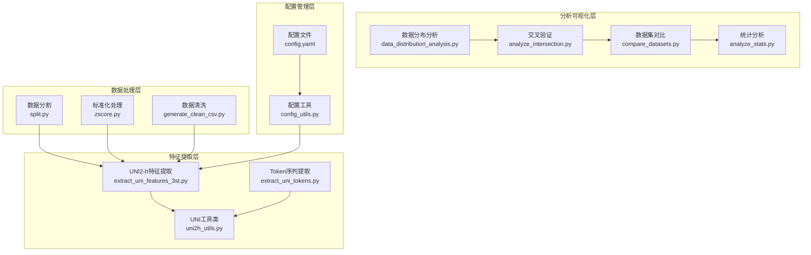
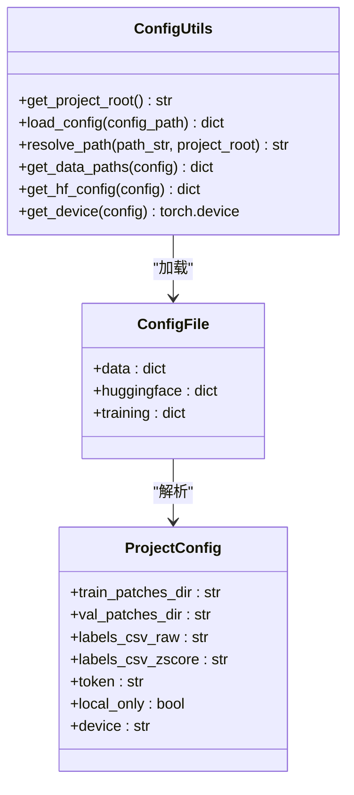
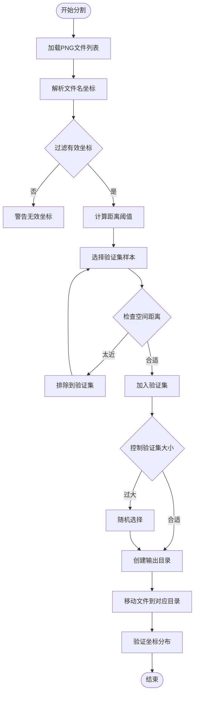
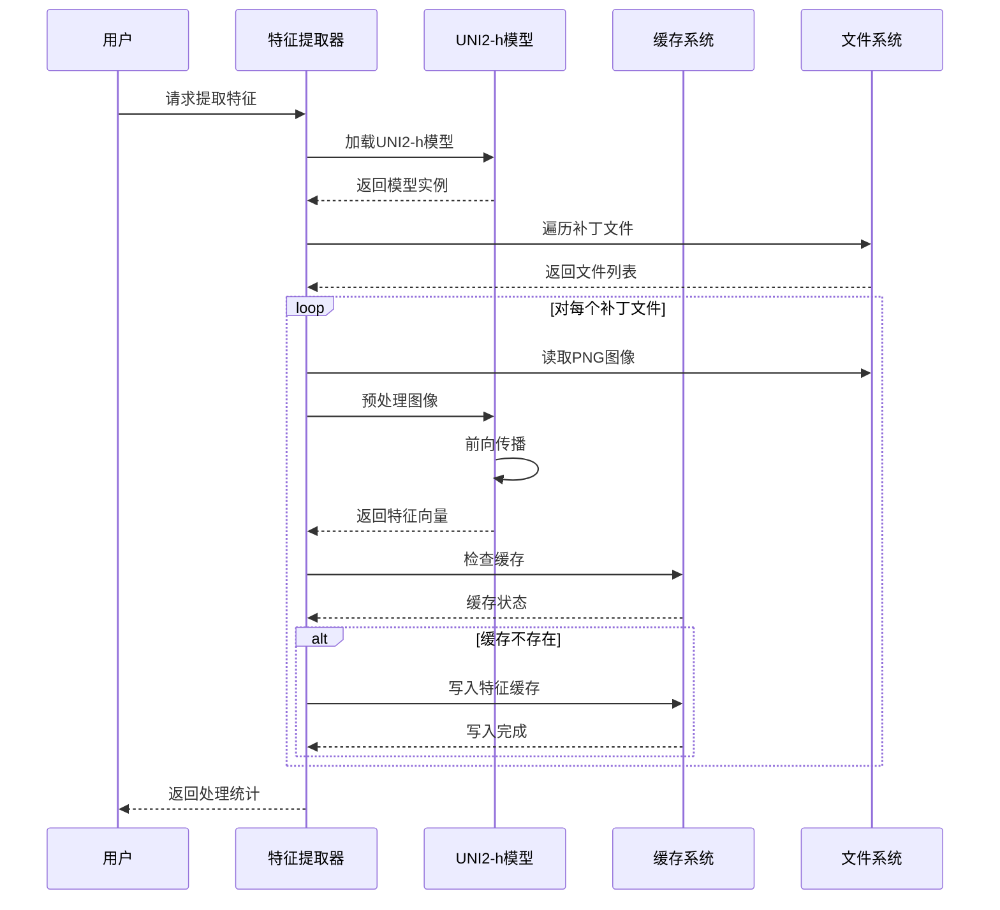
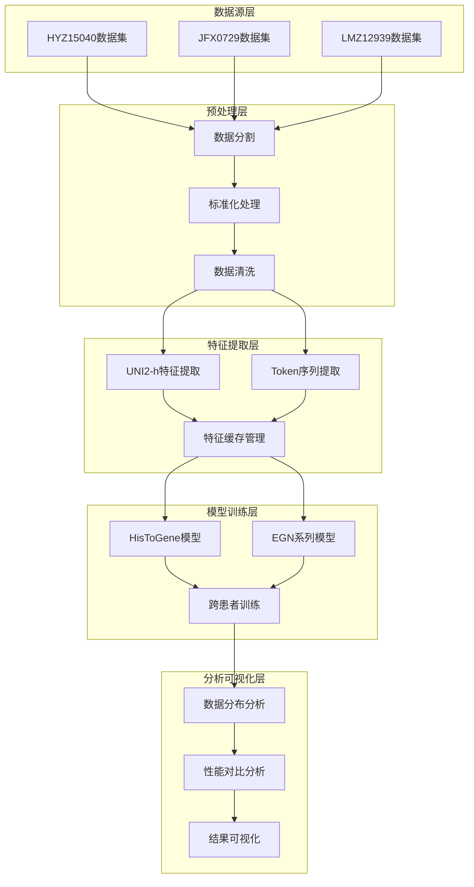
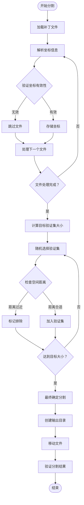
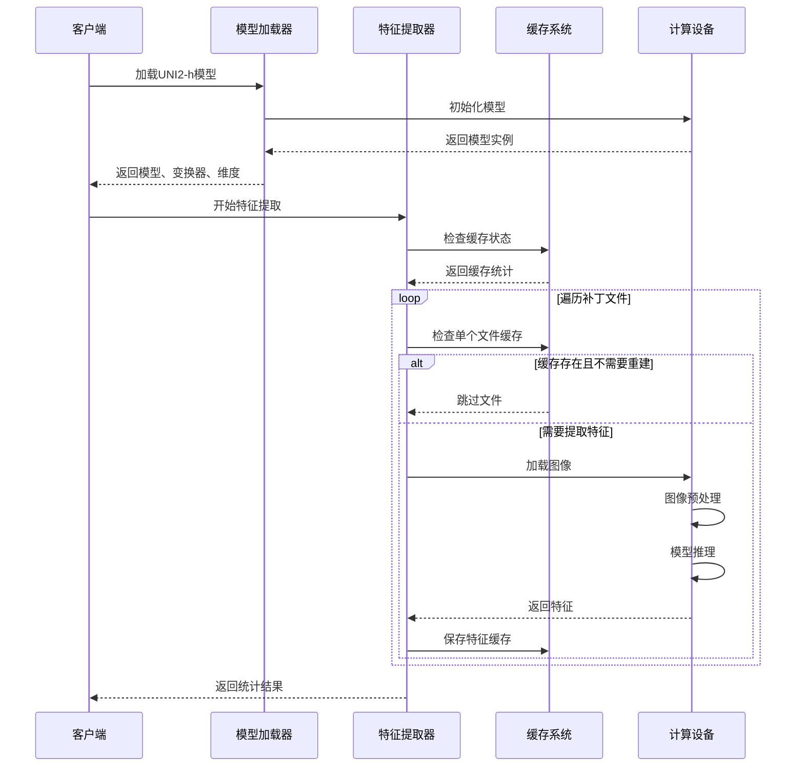
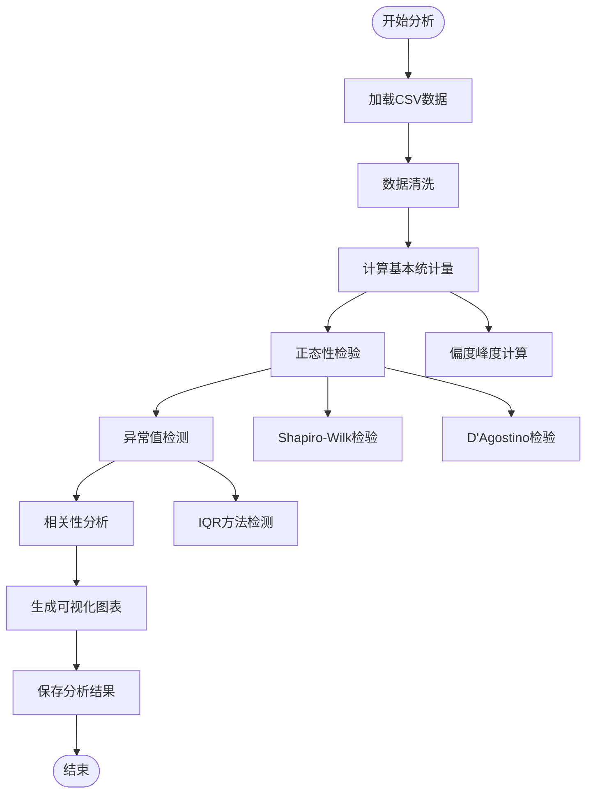
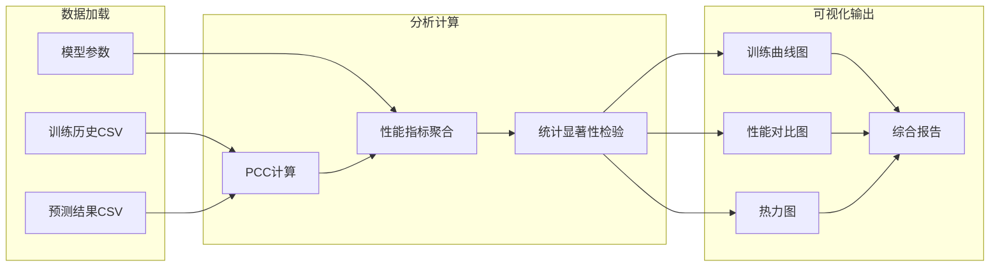
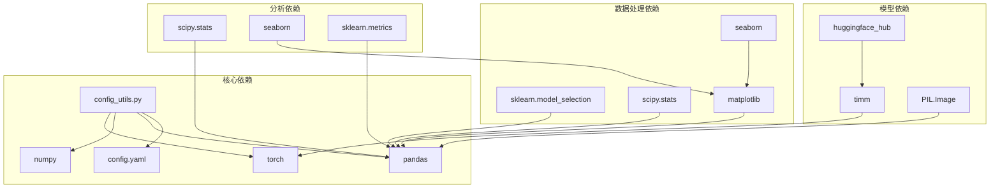

# 数据处理增强

<cite>
**本文档引用的文件**
- [README.md](file://README.md)
- [config.yaml](file://config.yaml)
- [config_utils.py](file://config_utils.py)
- [split.py](file://split.py)
- [zscore.py](file://zscore.py)
- [generate_clean_csv.py](file://generate_clean_csv.py)
- [extract_uni_features_3st.py](file://extract_uni_features_3st.py)
- [extract_uni_tokens.py](file://extract_uni_tokens.py)
- [uni2h_utils.py](file://uni2h/uni2h_utils.py)
- [analyze_intersection.py](file://analyze_intersection.py)
- [data_distribution_analysis.py](file://data_distribution_analysis.py)
- [analyze_stats.py](file://analyze_stats.py)
- [compare_datasets.py](file://compare_datasets.py)
- [verify_clean_csv.py](file://verify_clean_csv.py)
- [final_report.py](file://final_report.py)
</cite>

## 目录
1. [简介](#简介)
2. [项目结构](#项目结构)
3. [核心组件](#核心组件)
4. [架构概览](#架构概览)
5. [详细组件分析](#详细组件分析)
6. [依赖关系分析](#依赖关系分析)
7. [性能考虑](#性能考虑)
8. [故障排除指南](#故障排除指南)
9. [结论](#结论)
10. [附录](#附录)

## 简介

PFMval是一个专注于空间转录组病理研究的数据处理增强项目。该项目提供了完整的数据预处理、特征提取、模型训练和结果分析工作流程，特别针对HisToGene和EGN系列模型进行了优化。

项目的核心目标是：
- 提供标准化的数据处理管道
- 支持多数据集的统一处理和比较
- 实现高效的特征提取和缓存机制
- 提供全面的数据质量分析和验证工具

## 项目结构

项目采用模块化的组织方式，主要包含以下几个核心模块：



**图表来源**
- [config.yaml:1-32](file://config.yaml#L1-L32)
- [config_utils.py:1-294](file://config_utils.py#L1-L294)
- [split.py:1-200](file://split.py#L1-L200)
- [zscore.py:1-203](file://zscore.py#L1-L203)
- [extract_uni_features_3st.py:1-99](file://extract_uni_features_3st.py#L1-L99)

**章节来源**
- [README.md:1-44](file://README.md#L1-L44)
- [config.yaml:1-32](file://config.yaml#L1-L32)

## 核心组件

### 配置管理系统

配置管理系统提供了统一的配置加载和路径解析功能，支持灵活的配置管理策略。



**图表来源**
- [config_utils.py:17-258](file://config_utils.py#L17-L258)
- [config.yaml:8-32](file://config.yaml#L8-L32)

### 数据分割与预处理

数据分割模块实现了基于空间坐标的智能分割算法，确保训练集和验证集之间有足够的空间距离。



**图表来源**
- [split.py:22-141](file://split.py#L22-L141)

### 特征提取与缓存

特征提取模块提供了高效的UNI2-h模型特征提取和缓存机制，支持批量处理和增量更新。



**图表来源**
- [extract_uni_features_3st.py:14-87](file://extract_uni_features_3st.py#L14-L87)
- [uni2h_utils.py:138-169](file://uni2h/uni2h_utils.py#L138-L169)

**章节来源**
- [config_utils.py:1-294](file://config_utils.py#L1-L294)
- [split.py:1-200](file://split.py#L1-L200)
- [extract_uni_features_3st.py:1-99](file://extract_uni_features_3st.py#L1-L99)

## 架构概览

项目采用了分层架构设计，从底层的数据处理到顶层的分析可视化形成了完整的数据流水线。



**图表来源**
- [README.md:4-44](file://README.md#L4-L44)
- [config.yaml:8-19](file://config.yaml#L8-L19)

## 详细组件分析

### 数据分割组件

数据分割组件实现了基于空间坐标的智能分割算法，确保训练集和验证集之间的空间独立性。

#### 核心算法流程



**图表来源**
- [split.py:22-141](file://split.py#L22-L141)

#### 关键特性

1. **空间距离约束**: 确保验证集和训练集之间至少350像素的距离
2. **智能排除机制**: 自动排除无法解析坐标的文件
3. **精确控制**: 通过随机采样精确控制验证集大小
4. **坐标验证**: 提供验证集坐标分布检查功能

**章节来源**
- [split.py:1-200](file://split.py#L1-L200)

### 特征提取组件

特征提取组件提供了高效的UNI2-h模型特征提取功能，支持批量处理和增量缓存。

#### 特征提取流程



**图表来源**
- [extract_uni_features_3st.py:14-87](file://extract_uni_features_3st.py#L14-L87)
- [uni2h_utils.py:138-169](file://uni2h/uni2h_utils.py#L138-L169)

#### Token提取模式

组件支持两种Token提取模式：

| 模式 | Token数量 | 维度 | 用途 |
|------|-----------|------|------|
| lite | 65 | [1, 65, 1536] | CLS + 前64个patch token |
| full | 265 | [1, 265, 1536] | 全部265个token |

**章节来源**
- [extract_uni_features_3st.py:1-99](file://extract_uni_features_3st.py#L1-L99)
- [extract_uni_tokens.py:1-185](file://extract_uni_tokens.py#L1-L185)
- [uni2h_utils.py:1-303](file://uni2h/uni2h_utils.py#L1-L303)

### 数据分析组件

数据分析组件提供了全面的数据质量分析和可视化功能。

#### 分布分析流程



**图表来源**
- [data_distribution_analysis.py:65-137](file://data_distribution_analysis.py#L65-L137)

#### 统计指标体系

组件提供了多层次的统计分析指标：

| 指标类型 | 具体指标 | 用途 |
|----------|----------|------|
| 描述性统计 | 均值、中位数、标准差 | 数据中心趋势 |
| 形状特征 | 偏度、峰度 | 分布形状分析 |
| 正态性检验 | Shapiro-Wilk、D'Agostino | 分布正态性判断 |
| 异常值检测 | IQR方法 | 异常值识别 |
| 相关性分析 | 皮尔逊相关系数 | 变量间关系 |

**章节来源**
- [data_distribution_analysis.py:1-482](file://data_distribution_analysis.py#L1-L482)
- [analyze_stats.py:1-40](file://analyze_stats.py#L1-L40)

### 结果对比组件

结果对比组件提供了多模型、多数据集的综合性能对比分析。

#### 对比分析架构



**图表来源**
- [compare_datasets.py:83-131](file://compare_datasets.py#L83-L131)

**章节来源**
- [compare_datasets.py:1-546](file://compare_datasets.py#L1-L546)
- [final_report.py:1-73](file://final_report.py#L1-L73)

## 依赖关系分析

项目采用了模块化的依赖管理策略，各组件之间的耦合度较低，便于维护和扩展。



**图表来源**
- [config_utils.py:8-10](file://config_utils.py#L8-L10)
- [extract_uni_features_3st.py:4-12](file://extract_uni_features_3st.py#L4-L12)

### 外部依赖管理

项目对外部依赖的管理遵循以下原则：

1. **版本控制**: 所有依赖都在config.yaml中明确定义
2. **条件加载**: 支持无网络环境下的本地缓存使用
3. **设备适配**: 自动检测和选择合适的计算设备
4. **路径解析**: 统一的路径解析和配置管理

**章节来源**
- [config_utils.py:1-294](file://config_utils.py#L1-L294)
- [config.yaml:1-32](file://config.yaml#L1-L32)

## 性能考虑

### 计算效率优化

项目在多个层面实现了性能优化：

1. **特征缓存机制**: 避免重复的特征提取计算
2. **批量处理**: 支持批量特征提取和处理
3. **增量更新**: 支持增量特征提取，跳过已存在的缓存
4. **内存管理**: 合理的内存分配和垃圾回收

### 存储优化

1. **压缩存储**: 特征向量采用高效存储格式
2. **目录结构**: 采用层次化的目录组织结构
3. **增量备份**: 支持增量备份和恢复

### 并行处理

项目支持并行处理以提高效率：
- 多进程特征提取
- 批量数据处理
- 并行可视化生成

## 故障排除指南

### 常见问题及解决方案

#### 配置问题

| 问题 | 症状 | 解决方案 |
|------|------|----------|
| 配置文件找不到 | 报告找不到config.yaml | 检查项目根目录结构 |
| 路径解析错误 | 文件路径不正确 | 使用resolve_path函数 |
| 设备选择失败 | CUDA不可用 | 检查CUDA安装和权限 |

#### 数据处理问题

| 问题 | 症状 | 解决方案 |
|------|------|----------|
| 坐标解析失败 | 文件名中无坐标信息 | 检查文件命名规范 |
| 分割结果不平衡 | 训练集/验证集比例异常 | 调整距离阈值参数 |
| 特征提取中断 | 内存不足或GPU错误 | 检查硬件资源和驱动 |

#### 模型训练问题

| 问题 | 症状 | 解决方案 |
|------|------|----------|
| HuggingFace认证失败 | 无法下载模型 | 检查HF_TOKEN配置 |
| 特征维度不匹配 | 模型输入形状错误 | 验证特征缓存完整性 |
| 训练收敛困难 | 损失不下降 | 调整学习率和批次大小 |

**章节来源**
- [config_utils.py:264-294](file://config_utils.py#L264-L294)
- [extract_uni_features_3st.py:84-96](file://extract_uni_features_3st.py#L84-L96)

### 调试工具

项目提供了多种调试和验证工具：

1. **配置自检**: 自动检查配置文件和路径
2. **数据一致性验证**: 检查数据集、CSV和缓存的一致性
3. **性能监控**: 实时监控处理进度和资源使用
4. **错误日志**: 详细的错误信息和堆栈跟踪

## 结论

PFMval项目提供了一个完整、高效、可扩展的数据处理增强解决方案。通过模块化的架构设计和完善的工具链，项目能够满足空间转录组病理研究的各种需求。

### 主要优势

1. **标准化流程**: 提供了标准化的数据处理和分析流程
2. **高效实现**: 通过缓存和并行处理提高了整体效率
3. **灵活配置**: 支持灵活的配置管理和环境适配
4. **全面分析**: 提供多层次的数据分析和可视化功能

### 发展方向

1. **自动化程度提升**: 进一步减少人工干预，实现完全自动化的数据处理
2. **云端集成**: 支持云端部署和分布式计算
3. **实时监控**: 添加实时监控和告警功能
4. **API接口**: 提供RESTful API接口，支持外部系统集成

## 附录

### 快速开始指南

1. **环境准备**: 创建Python 3.10虚拟环境
2. **依赖安装**: 安装项目所需的依赖包
3. **配置设置**: 修改config.yaml中的路径配置
4. **数据准备**: 准备HYZ15040数据集
5. **运行流程**: 按顺序执行数据处理和分析步骤

### 常用命令

```bash
# 数据分割
python split.py

# 特征提取
python extract_uni_features_3st.py

# 数据分析
python data_distribution_analysis.py

# 结果对比
python compare_datasets.py
```

### 支持的模型

| 模型名称 | 特征维度 | 适用场景 |
|----------|----------|----------|
| UNI2-h | 1536 | 通用特征提取 |
| HisToGene | 可变 | 病理特征分析 |
| EGN-v1 | 可变 | 空间转录组分析 |
| EGN-v2 | 可变 | 多数据集联合分析 |