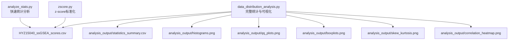
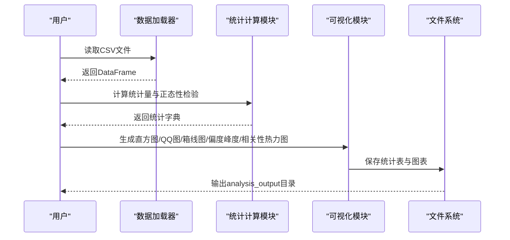
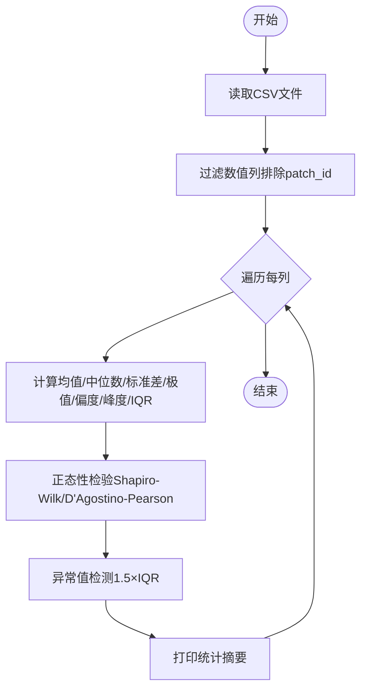
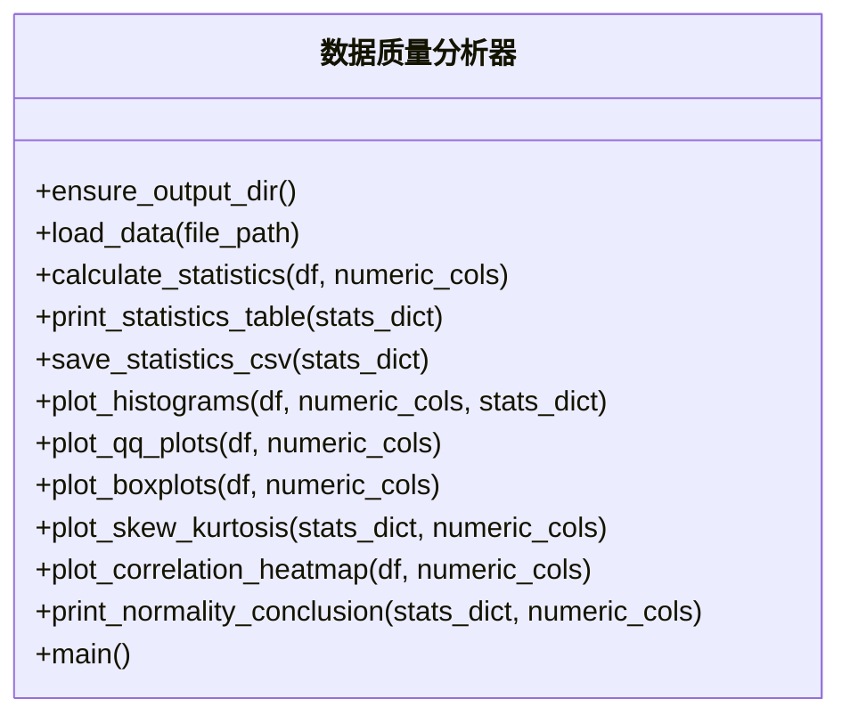
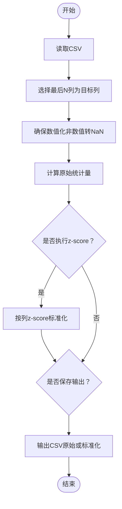
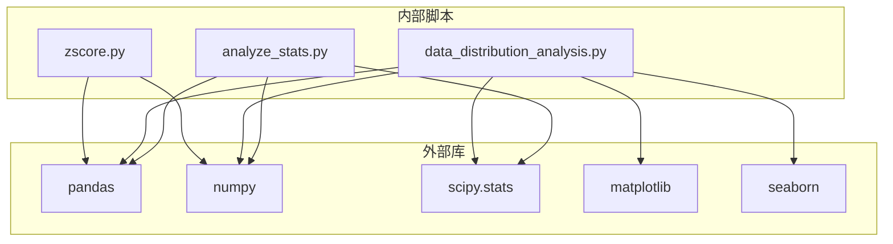

# 数据质量分析模块

<cite>
**本文引用的文件**
- [analyze_stats.py](file://analyze_stats.py)
- [data_distribution_analysis.py](file://data_distribution_analysis.py)
- [zscore.py](file://zscore.py)
- [README.md](file://README.md)
- [HYZ15040_ssGSEA_scores.csv](file://HYZ15040_ssGSEA_scores.csv)
- [analysis_output/statistics_summary.csv](file://analysis_output/statistics_summary.csv)
</cite>

## 目录
1. [简介](#简介)
2. [项目结构](#项目结构)
3. [核心组件](#核心组件)
4. [架构概览](#架构概览)
5. [详细组件分析](#详细组件分析)
6. [依赖分析](#依赖分析)
7. [性能考虑](#性能考虑)
8. [故障排除指南](#故障排除指南)
9. [结论](#结论)
10. [附录](#附录)

## 简介
本技术文档面向数据质量分析模块，聚焦于两类核心能力：
- 统计分析与质量评估：缺失值检测、异常值识别、数据完整性验证、分布形态与正态性检验、集中趋势与离散程度指标。
- 可视化分析：直方图绘制、密度估计、QQ图、箱线图、偏度峰度对比、相关性热力图等。

文档将系统阐述 analyze_stats.py 与 data_distribution_analysis.py 的实现方法，给出 API 文档式说明（参数、输出、使用示例）、质量评估指标与阈值设定、性能优化与内存管理策略，并提供常见问题的故障排除指南。

## 项目结构
本仓库包含数据质量分析相关的脚本与输出产物，核心文件如下：
- analyze_stats.py：快速统计分析脚本，逐列输出描述性统计、正态性检验与异常值计数。
- data_distribution_analysis.py：完整统计与可视化分析脚本，包含数据加载、统计计算、图表生成与结论输出。
- zscore.py：z-score 标准化工具，用于生成标准化后的评分文件，供后续分析使用。
- HYZ15040_ssGSEA_scores.csv：输入数据文件，包含 patch_id 与多个基因集评分列。
- analysis_output/statistics_summary.csv：统计结果汇总表，由 data_distribution_analysis.py 生成。
- README.md：项目背景与环境说明。

**图表来源**
- [analyze_stats.py:1-40](file://analyze_stats.py#L1-L40)
- [data_distribution_analysis.py:416-482](file://data_distribution_analysis.py#L416-L482)
- [zscore.py:141-203](file://zscore.py#L141-L203)

**章节来源**
- [README.md:1-44](file://README.md#L1-L44)
- [HYZ15040_ssGSEA_scores.csv:1-50](file://HYZ15040_ssGSEA_scores.csv#L1-L50)

## 核心组件
本模块由三个主要组件构成：
- 统计分析器（analyze_stats.py）：面向单次快速分析，输出每列的基本统计、正态性检验与异常值数量。
- 完整分析器（data_distribution_analysis.py）：提供完整的统计计算、可视化图表生成与结论输出，支持批量导出。
- 标准化器（zscore.py）：对数值列进行 z-score 标准化，生成标准化后的 CSV 文件，便于后续分析。

**章节来源**
- [analyze_stats.py:12-40](file://analyze_stats.py#L12-L40)
- [data_distribution_analysis.py:65-137](file://data_distribution_analysis.py#L65-L137)
- [zscore.py:101-127](file://zscore.py#L101-L127)

## 架构概览
整体流程从数据加载开始，经过统计计算与可视化生成，最终输出汇总表与多类图表。标准化器可独立运行，生成标准化数据供分析器使用。

**图表来源**
- [data_distribution_analysis.py:49-62](file://data_distribution_analysis.py#L49-L62)
- [data_distribution_analysis.py:65-137](file://data_distribution_analysis.py#L65-L137)
- [data_distribution_analysis.py:166-378](file://data_distribution_analysis.py#L166-L378)

## 详细组件分析

### analyze_stats.py 组件分析
- 功能概述
  - 读取指定 CSV 文件（默认 HYZ15040_ssGSEA_scores.csv）。
  - 自动识别数值列（排除第一列 patch_id）。
  - 对每个数值列计算：样本量、均值、中位数、标准差、最小值、最大值、偏度、峰度、分位数、IQR、异常值数量与比例。
  - 正态性检验：Shapiro-Wilk（样本量≤5000）与 D’Agostino-Pearson。
  - 异常值检测：基于 1.5×IQR 规则。
- 关键实现点
  - 数据读取与列过滤：[analyze_stats.py:7-10](file://analyze_stats.py#L7-L10)
  - 统计量计算与异常值检测：[analyze_stats.py:12-40](file://analyze_stats.py#L12-L40)
  - 正态性检验：Shapiro-Wilk 与 D’Agostino-Pearson：[analyze_stats.py:23-29](file://analyze_stats.py#L23-L29)
- 输出
  - 控制台打印每列统计摘要与异常值比例。
- 性能与内存
  - 逐列处理，内存占用与数据规模线性相关；Shapiro-Wilk 对大样本采用抽样（≤5000）以控制复杂度。

**图表来源**
- [analyze_stats.py:7-40](file://analyze_stats.py#L7-L40)

**章节来源**
- [analyze_stats.py:1-40](file://analyze_stats.py#L1-L40)

### data_distribution_analysis.py 组件分析
- 功能概述
  - 提供完整的统计与可视化分析流水线，包括数据加载、统计计算、图表生成与结论输出。
  - 支持输出目录自动创建、统计表保存、多类图表导出。
- 主要函数
  - ensure_output_dir：确保输出目录存在。[data_distribution_analysis.py:42-46](file://data_distribution_analysis.py#L42-L46)
  - load_data：读取 CSV 并打印基本信息。[data_distribution_analysis.py:49-62](file://data_distribution_analysis.py#L49-L62)
  - calculate_statistics：计算详细统计量（含正态性检验与异常值）。[data_distribution_analysis.py:65-137](file://data_distribution_analysis.py#L65-L137)
  - print_statistics_table/save_statistics_csv：打印与保存统计表。[data_distribution_analysis.py:140-163](file://data_distribution_analysis.py#L140-L163)
  - plot_histograms：直方图+正态拟合曲线+均值/中位数标注。[data_distribution_analysis.py:166-214](file://data_distribution_analysis.py#L166-L214)
  - plot_qq_plots：Q-Q 图。[data_distribution_analysis.py:217-246](file://data_distribution_analysis.py#L217-L246)
  - plot_boxplots：标准化箱线图对比。[data_distribution_analysis.py:249-286](file://data_distribution_analysis.py#L249-L286)
  - plot_skew_kurtosis：偏度/峰度对比柱状图。[data_distribution_analysis.py:289-348](file://data_distribution_analysis.py#L289-L348)
  - plot_correlation_heatmap：相关性热力图。[data_distribution_analysis.py:351-378](file://data_distribution_analysis.py#L351-L378)
  - print_normality_conclusion：正态性结论打印。[data_distribution_analysis.py:382-414](file://data_distribution_analysis.py#L382-L414)
  - main：主流程编排。[data_distribution_analysis.py:416-478](file://data_distribution_analysis.py#L416-L478)
- 输出产物
  - analysis_output/statistics_summary.csv：统计汇总表。
  - analysis_output/histograms.png：直方图（含正态拟合曲线）。
  - analysis_output/qq_plots.png：Q-Q 图。
  - analysis_output/boxplots.png：箱线图（标准化）。
  - analysis_output/skew_kurtosis.png：偏度/峰度对比。
  - analysis_output/correlation_heatmap.png：相关性热力图。

**图表来源**
- [data_distribution_analysis.py:42-478](file://data_distribution_analysis.py#L42-L478)

**章节来源**
- [data_distribution_analysis.py:42-478](file://data_distribution_analysis.py#L42-L478)

### zscore.py 组件分析
- 功能概述
  - 将 CSV 中最后 N 列作为目标列，确保数值化后进行 z-score 标准化。
  - 可选保存输出文件，输出包含标准化后的数据与使用的均值/标准差。
- 关键实现点
  - get_target_columns：选择最后 N 列为目标列。[zscore.py:26-37](file://zscore.py#L26-L37)
  - ensure_numeric_columns：将目标列转换为数值，非数值项转 NaN 并告警。[zscore.py:40-61](file://zscore.py#L40-L61)
  - compute_stats：计算每列的 count_non_null、missing、mean、std、min、25%、median、75%、max。[zscore.py:64-81](file://zscore.py#L64-L81)
  - zscore_by_column：按列进行 z-score 标准化，防止零标准差列导致除零。[zscore.py:101-126](file://zscore.py#L101-L126)
  - main：主流程，读取、打印统计、可选标准化与保存。[zscore.py:141-203](file://zscore.py#L141-L203)
- 输出
  - 标准化后的 CSV 文件（默认后缀 _zscore）。

**图表来源**
- [zscore.py:141-203](file://zscore.py#L141-L203)

**章节来源**
- [zscore.py:141-203](file://zscore.py#L141-L203)

## 依赖分析
- 外部依赖
  - pandas/numpy：数据结构与数值计算。
  - scipy.stats：正态性检验与概率函数。
  - matplotlib/seaborn：图表绘制。
- 内部依赖
  - data_distribution_analysis.py 依赖 analyze_stats.py 的统计思想（异常值与正态性检验），但两者为独立脚本。
  - zscore.py 与 data_distribution_analysis.py 共同消费 HYZ15040_ssGSEA_scores.csv，可先运行 zscore.py 生成标准化数据，再用 data_distribution_analysis.py 进行分析。

**图表来源**
- [data_distribution_analysis.py:24-32](file://data_distribution_analysis.py#L24-L32)
- [analyze_stats.py:1-5](file://analyze_stats.py#L1-L5)
- [zscore.py:1-4](file://zscore.py#L1-L4)

**章节来源**
- [data_distribution_analysis.py:24-32](file://data_distribution_analysis.py#L24-L32)
- [analyze_stats.py:1-5](file://analyze_stats.py#L1-L5)
- [zscore.py:1-4](file://zscore.py#L1-L4)

## 性能考虑
- 时间复杂度
  - 统计计算：O(n) 每列，n 为样本数。
  - 正态性检验：Shapiro-Wilk O(n log n)，D’Agostino-Pearson O(n)。
  - 直方图与密度估计：O(n) 直方图 bin 计算，核密度估计 O(n^2)（若使用核密度），本脚本使用理论正态拟合曲线，避免核密度估计。
- 内存管理
  - 逐列处理，避免一次性加载全量数据到内存。
  - 对大样本 Shapiro-Wilk 采用固定大小抽样（≤5000）以降低内存与时间开销。
  - 标准化时跳过零方差列，避免无效计算。
- 可扩展性
  - 可通过参数化调整 bin 数量、图表 DPI、输出目录等。
  - 可增加并行处理以加速多列统计与绘图。

[本节为通用性能讨论，无需特定文件引用]

## 故障排除指南
- 输入文件路径错误
  - 现象：无法读取 CSV 或找不到文件。
  - 处理：检查 data_distribution_analysis.py 中的 data_file 路径与 analyze_stats.py 中的 CSV 路径是否正确。
  - 参考：[data_distribution_analysis.py:426](file://data_distribution_analysis.py#L426)、[analyze_stats.py:7](file://analyze_stats.py#L7)
- 列类型问题
  - 现象：非数值列导致转换失败或统计异常。
  - 处理：使用 zscore.py 的 ensure_numeric_columns 将非数值转 NaN 并告警，确认目标列范围。
  - 参考：[zscore.py:40-61](file://zscore.py#L40-L61)
- 标准差为零
  - 现象：z-score 标准化时报错或列保持不变。
  - 处理：脚本会跳过零方差列并告警，需检查数据是否恒定。
  - 参考：[zscore.py:115-126](file://zscore.py#L115-L126)
- 正态性检验样本量限制
  - 现象：Shapiro-Wilk 仅对 ≤5000 样本有效。
  - 处理：脚本自动抽样，注意结论解释需结合样本量。
  - 参考：[data_distribution_analysis.py:94-103](file://data_distribution_analysis.py#L94-L103)
- 图表保存失败
  - 现象：无法保存 PNG 文件。
  - 处理：确认 OUTPUT_DIR 存在且具有写权限；如不存在，调用 ensure_output_dir 自动创建。
  - 参考：[data_distribution_analysis.py:42-46](file://data_distribution_analysis.py#L42-L46)

**章节来源**
- [data_distribution_analysis.py:42-46](file://data_distribution_analysis.py#L42-L46)
- [data_distribution_analysis.py:94-103](file://data_distribution_analysis.py#L94-L103)
- [zscore.py:40-61](file://zscore.py#L40-L61)
- [zscore.py:115-126](file://zscore.py#L115-L126)

## 结论
本模块提供了从统计到可视化的完整数据质量分析能力。analyze_stats.py 适合快速概览，data_distribution_analysis.py 提供全面的统计与图表输出，zscore.py 则负责数据预处理。通过合理的参数配置与阈值设定，可高效识别缺失值、异常值与分布异常，支撑后续建模与分析工作。

[本节为总结性内容，无需特定文件引用]

## 附录

### API 文档（函数级说明）
- ensure_output_dir()
  - 功能：确保输出目录存在。
  - 参数：无。
  - 返回：无。
  - 示例：直接调用以准备输出目录。
  - 参考：[data_distribution_analysis.py:42-46](file://data_distribution_analysis.py#L42-L46)

- load_data(file_path)
  - 功能：读取 CSV 并打印基本信息。
  - 参数：file_path（字符串）。
  - 返回：DataFrame。
  - 示例：df = load_data("HYZ15040_ssGSEA_scores.csv")。
  - 参考：[data_distribution_analysis.py:49-62](file://data_distribution_analysis.py#L49-L62)

- calculate_statistics(df, numeric_cols)
  - 功能：计算每列的统计量（均值、中位数、标准差、偏度、峰度、正态性检验、异常值）。
  - 参数：df（DataFrame），numeric_cols（列名列表）。
  - 返回：dict（列名->统计字典）。
  - 示例：stats = calculate_statistics(df, numeric_cols)。
  - 参考：[data_distribution_analysis.py:65-137](file://data_distribution_analysis.py#L65-L137)

- print_statistics_table(stats_dict)
  - 功能：打印统计表（简化版）。
  - 参数：stats_dict（统计字典）。
  - 返回：DataFrame。
  - 示例：print_statistics_table(stats)。
  - 参考：[data_distribution_analysis.py:140-154](file://data_distribution_analysis.py#L140-L154)

- save_statistics_csv(stats_dict)
  - 功能：保存统计表为 CSV。
  - 参数：stats_dict（统计字典）。
  - 返回：DataFrame。
  - 示例：save_statistics_csv(stats)。
  - 参考：[data_distribution_analysis.py:157-163](file://data_distribution_analysis.py#L157-L163)

- plot_histograms(df, numeric_cols, stats_dict)
  - 功能：绘制直方图与正态拟合曲线。
  - 参数：df（DataFrame），numeric_cols（列名列表），stats_dict（统计字典）。
  - 返回：无。
  - 示例：plot_histograms(df, numeric_cols, stats)。
  - 参考：[data_distribution_analysis.py:166-214](file://data_distribution_analysis.py#L166-L214)

- plot_qq_plots(df, numeric_cols)
  - 功能：绘制 Q-Q 图。
  - 参数：df（DataFrame），numeric_cols（列名列表）。
  - 返回：无.
  - 示例：plot_qq_plots(df, numeric_cols)。
  - 参考：[data_distribution_analysis.py:217-246](file://data_distribution_analysis.py#L217-L246)

- plot_boxplots(df, numeric_cols)
  - 功能：绘制标准化箱线图。
  - 参数：df（DataFrame），numeric_cols（列名列表）。
  - 返回：无。
  - 示例：plot_boxplots(df, numeric_cols)。
  - 参考：[data_distribution_analysis.py:249-286](file://data_distribution_analysis.py#L249-L286)

- plot_skew_kurtosis(stats_dict, numeric_cols)
  - 功能：绘制偏度/峰度对比柱状图。
  - 参数：stats_dict（统计字典），numeric_cols（列名列表）。
  - 返回：无。
  - 示例：plot_skew_kurtosis(stats, numeric_cols)。
  - 参考：[data_distribution_analysis.py:289-348](file://data_distribution_analysis.py#L289-L348)

- plot_correlation_heatmap(df, numeric_cols)
  - 功能：绘制相关性热力图。
  - 参数：df（DataFrame），numeric_cols（列名列表）。
  - 返回：DataFrame（相关性矩阵）。
  - 示例：corr = plot_correlation_heatmap(df, numeric_cols)。
  - 参考：[data_distribution_analysis.py:351-378](file://data_distribution_analysis.py#L351-L378)

- print_normality_conclusion(stats_dict, numeric_cols)
  - 功能：打印正态性检验结论。
  - 参数：stats_dict（统计字典），numeric_cols（列名列表）。
  - 返回：无。
  - 示例：print_normality_conclusion(stats, numeric_cols)。
  - 参考：[data_distribution_analysis.py:382-414](file://data_distribution_analysis.py#L382-L414)

- main()
  - 功能：主流程编排，依次执行数据加载、统计计算、图表生成与结论输出。
  - 参数：无。
  - 返回：无。
  - 示例：python data_distribution_analysis.py。
  - 参考：[data_distribution_analysis.py:416-478](file://data_distribution_analysis.py#L416-L478)

### 数据质量评估指标与阈值设定
- 描述性统计
  - 偏度：衡量分布不对称性。|偏度|<0.5 近似对称；0.5-1 中等偏态；>1 高度偏态。
  - 峰度：衡量分布尾部厚度。峰度≈0 为正态分布；>0 尖峰；<0 平峰。
- 正态性检验
  - Shapiro-Wilk：n≤5000，p>0.05 符合正态分布。
  - D’Agostino-Pearson：基于偏度与峰度，p>0.05 符合正态分布。
- 异常值
  - 1.5×IQR 法：异常值数量与比例可用于判断极端值占比。
- 标准化
  - z-score：均值为0，标准差为1，便于跨列比较与后续建模。

**章节来源**
- [data_distribution_analysis.py:382-414](file://data_distribution_analysis.py#L382-L414)
- [data_distribution_analysis.py:105-113](file://data_distribution_analysis.py#L105-L113)

### 使用示例
- 快速统计分析
  - 运行 analyze_stats.py 即可输出每列的统计摘要与异常值比例。
  - 参考：[analyze_stats.py:12-40](file://analyze_stats.py#L12-L40)
- 完整分析与可视化
  - 运行 data_distribution_analysis.py，生成统计表与多类图表。
  - 参考：[data_distribution_analysis.py:416-478](file://data_distribution_analysis.py#L416-L478)
- z-score 标准化
  - 修改 zscore.py 中的 NUM_TARGET_COLS、DO_ZSCORE、SAVE_OUTPUT 等参数，运行生成标准化数据。
  - 参考：[zscore.py:9-13](file://zscore.py#L9-L13)、[zscore.py:141-203](file://zscore.py#L141-L203)

**章节来源**
- [analyze_stats.py:12-40](file://analyze_stats.py#L12-L40)
- [data_distribution_analysis.py:416-478](file://data_distribution_analysis.py#L416-L478)
- [zscore.py:9-13](file://zscore.py#L9-L13)
- [zscore.py:141-203](file://zscore.py#L141-L203)