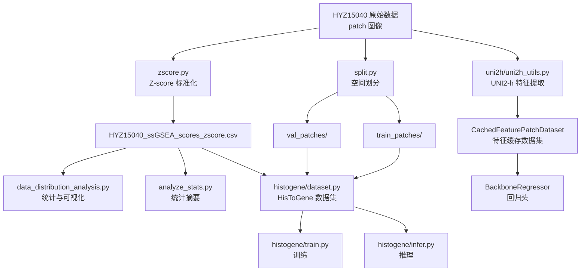
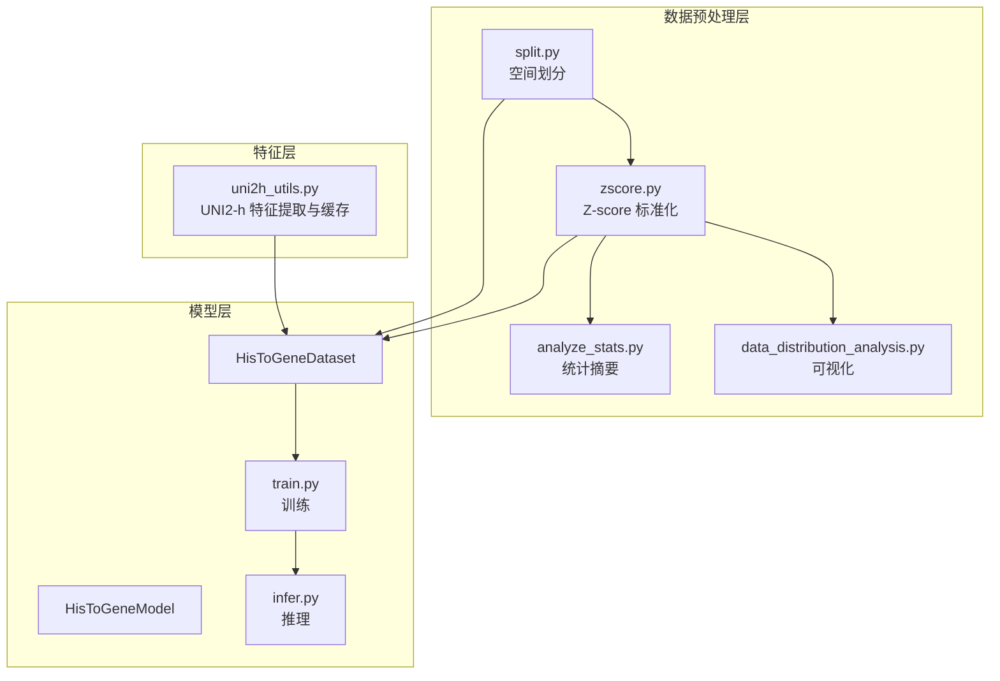
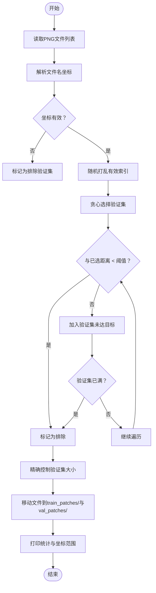
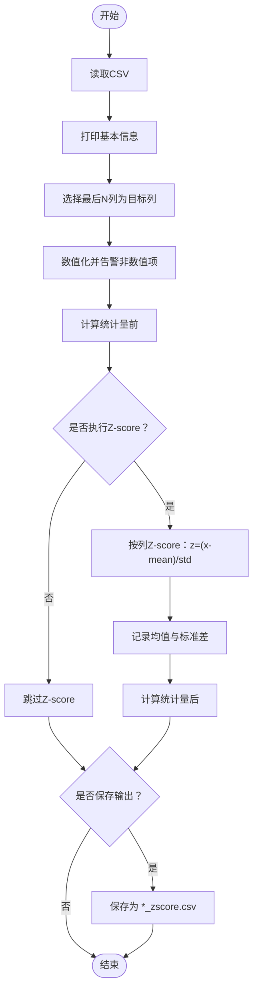
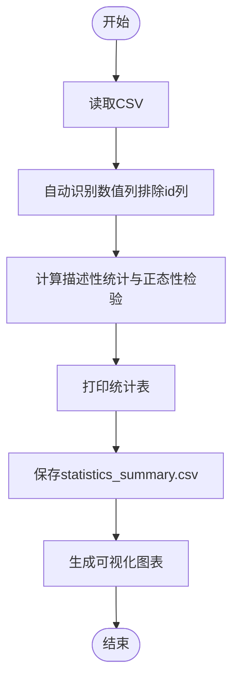
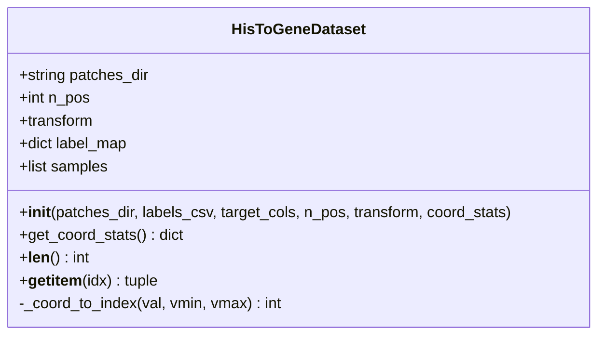
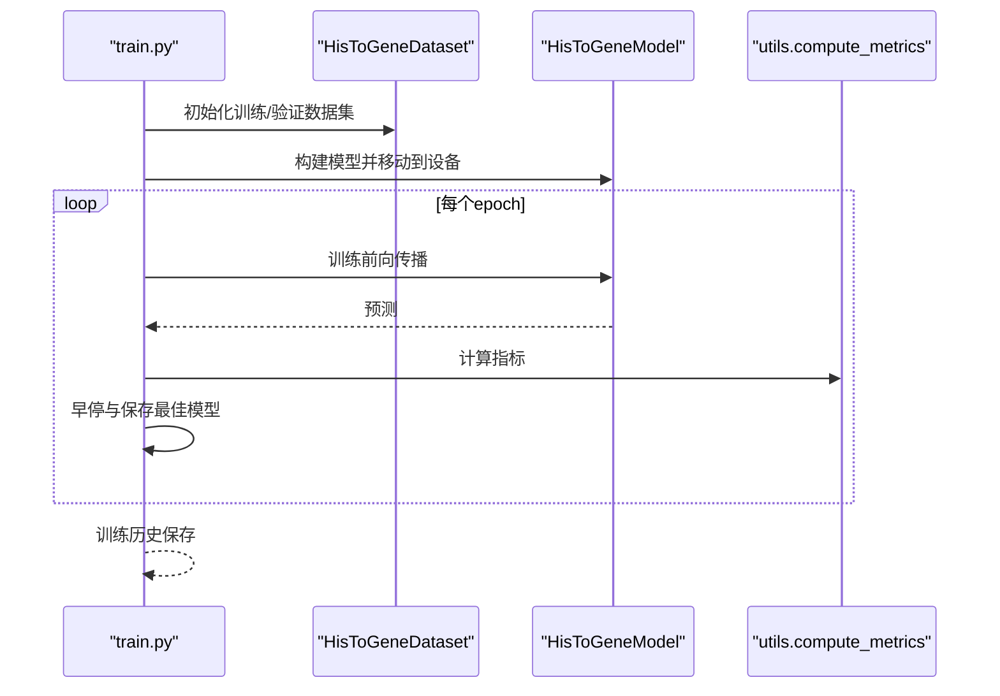
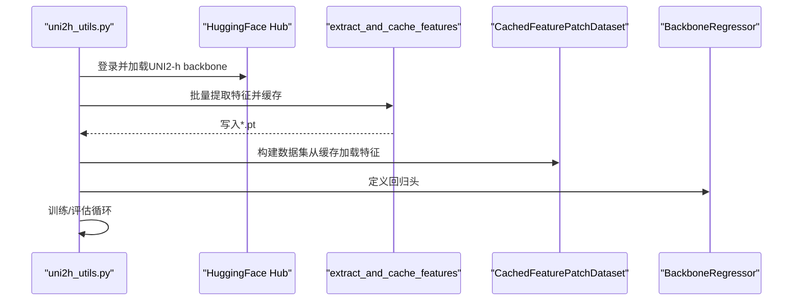
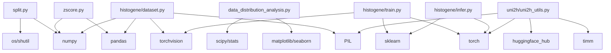

# 数据预处理系统

<cite>
**本文引用的文件**
- [README.md](file://README.md)
- [split.py](file://split.py)
- [split_解读指南.md](file://split_解读指南.md)
- [zscore.py](file://zscore.py)
- [analyze_stats.py](file://analyze_stats.py)
- [data_distribution_analysis.py](file://data_distribution_analysis.py)
- [histogene/dataset.py](file://histogene/dataset.py)
- [histogene/utils.py](file://histogene/utils.py)
- [histogene/model.py](file://histogene/model.py)
- [histogene/train.py](file://histogene/train.py)
- [histogene/infer.py](file://histogene/infer.py)
- [uni2h/uni2h_utils.py](file://uni2h/uni2h_utils.py)
- [uni2h_utils_解读指南.md](file://uni2h_utils_解读指南.md)
</cite>

## 目录
1. [简介](#简介)
2. [项目结构](#项目结构)
3. [核心组件](#核心组件)
4. [架构总览](#架构总览)
5. [详细组件分析](#详细组件分析)
6. [依赖关系分析](#依赖关系分析)
7. [性能考虑](#性能考虑)
8. [故障排除指南](#故障排除指南)
9. [结论](#结论)
10. [附录](#附录)

## 简介
本文件为“数据预处理系统”的技术文档，围绕以下目标展开：
- 深入解释空间数据划分算法，包括基于坐标距离的训练/验证集划分策略、距离阈值（350px）的选择原理与影响。
- 详细描述Z-score标准化的实现原理与数学公式，解释为何需要对ssGSEA基因集分数进行标准化处理。
- 阐述数据质量分析流程，包括统计分析、分布可视化与异常值检测。
- 提供完整的API文档，涵盖函数参数、返回值与使用示例。
- 解释数据格式要求、输入输出规范与数据验证机制。
- 给出性能优化建议与内存管理策略。
- 提供常见问题的故障排除指南。

## 项目结构
该项目以“数据预处理—模型训练—推理”为主线，形成清晰的流水线：
- 数据预处理：split.py（空间划分）、zscore.py（标准化）、analyze_stats.py（统计）、data_distribution_analysis.py（可视化）。
- 模型侧：histogene/（HisToGene模型与训练/推理）、uni2h/（UNI2-h特征提取与回归）。
- 顶层说明：README.md。

**图表来源**
- [split.py:99-200](file://split.py#L99-L200)
- [zscore.py:141-203](file://zscore.py#L141-L203)
- [data_distribution_analysis.py:416-482](file://data_distribution_analysis.py#L416-L482)
- [analyze_stats.py:1-40](file://analyze_stats.py#L1-L40)
- [histogene/dataset.py:23-118](file://histogene/dataset.py#L23-L118)
- [histogene/train.py:174-338](file://histogene/train.py#L174-L338)
- [histogene/infer.py:66-169](file://histogene/infer.py#L66-L169)
- [uni2h/uni2h_utils.py:137-303](file://uni2h/uni2h_utils.py#L137-L303)

**章节来源**
- [README.md:1-44](file://README.md#L1-L44)

## 核心组件
- 空间划分（split.py）：基于文件名解析的坐标，使用贪心策略与欧氏距离阈值进行训练/验证集划分，避免空间泄漏。
- Z-score标准化（zscore.py）：对最后N列数值进行均值-标准差归一化，记录并保存标准化参数，支持统计前后对比。
- 数据质量分析（analyze_stats.py、data_distribution_analysis.py）：提供描述性统计、正态性检验、异常值检测与多图可视化。
- 数据集适配（histogene/dataset.py）：从PNG图像与Z-score标签构建HisToGene数据集，解析坐标并进行位置编码。
- 指标工具（histogene/utils.py）：计算MSE、MAE、R²、PCC等回归指标。
- 模型与训练（histogene/model.py、train.py、infer.py）：HisToGene模型、训练循环、早停与推理。
- UNI2-h特征管线（uni2h/uni2h_utils.py）：模型加载、特征提取与缓存、回归头、训练/评估流程。

**章节来源**
- [split.py:1-200](file://split.py#L1-L200)
- [zscore.py:1-203](file://zscore.py#L1-L203)
- [analyze_stats.py:1-40](file://analyze_stats.py#L1-L40)
- [data_distribution_analysis.py:1-482](file://data_distribution_analysis.py#L1-L482)
- [histogene/dataset.py:1-118](file://histogene/dataset.py#L1-L118)
- [histogene/utils.py:1-31](file://histogene/utils.py#L1-L31)
- [histogene/model.py:1-160](file://histogene/model.py#L1-L160)
- [histogene/train.py:1-338](file://histogene/train.py#L1-L338)
- [histogene/infer.py:1-169](file://histogene/infer.py#L1-L169)
- [uni2h/uni2h_utils.py:1-303](file://uni2h/uni2h_utils.py#L1-L303)

## 架构总览
本系统采用“数据预处理—特征提取—模型训练/推理”的分层架构：
- 预处理层：split.py与zscore.py确保数据在空间上独立且数值尺度一致。
- 特征层：可选地使用UNI2-h提取高维特征并缓存，或直接使用HisToGene模型端到端训练。
- 训练层：HisToGene模型结合HisToGeneDataset进行训练与验证，支持早停与指标记录。
- 推理层：加载最佳checkpoint，对新patch进行预测并输出逐通路指标。

**图表来源**
- [split.py:99-200](file://split.py#L99-L200)
- [zscore.py:141-203](file://zscore.py#L141-L203)
- [analyze_stats.py:1-40](file://analyze_stats.py#L1-L40)
- [data_distribution_analysis.py:416-482](file://data_distribution_analysis.py#L416-L482)
- [uni2h/uni2h_utils.py:137-303](file://uni2h/uni2h_utils.py#L137-L303)
- [histogene/dataset.py:23-118](file://histogene/dataset.py#L23-L118)
- [histogene/train.py:174-338](file://histogene/train.py#L174-L338)
- [histogene/infer.py:66-169](file://histogene/infer.py#L66-L169)

## 详细组件分析

### 空间数据划分算法（split.py）
- 功能概述：从patch文件名解析坐标，基于欧氏距离与阈值（默认350px）进行贪心选择，确保验证集中任意两patch间距≥阈值，从而避免空间泄漏。
- 关键流程：
  - 文件名解析：从“patch_x{d}_y{d}.png”中提取x、y坐标。
  - 坐标有效性过滤：无法解析的文件名将被排除在验证集之外。
  - 贪心选择：随机打乱有效patch顺序，逐个检查与已选验证集的距离，若均≥阈值则加入，否则排除。
  - 精确控制验证集大小：若最终验证集数量超出目标比例，进行随机抽样。
  - 文件移动：将训练/验证集分别移动到train_patches/与val_patches/。
- 距离阈值选择原理：
  - 与patch尺寸相匹配（建议≥1.5×patch_size），确保验证集patch来自不同组织区域。
  - 过小会导致空间泄漏，过大可能导致验证集过小。
- 输出与验证：打印训练/验证集数量、比例与阈值；可选输出验证集坐标范围。

**图表来源**
- [split.py:22-96](file://split.py#L22-L96)
- [split.py:99-198](file://split.py#L99-L198)

**章节来源**
- [split.py:1-200](file://split.py#L1-L200)
- [split_解读指南.md:1-442](file://split_解读指南.md#L1-L442)

### Z-score标准化（zscore.py）
- 功能概述：对指定列（默认最后8列）进行Z-score标准化，记录每列均值与标准差，支持保存输出文件。
- 核心步骤：
  - 读取CSV，打印基本信息与列名。
  - 选择目标列（NUM_TARGET_COLS，默认8）。
  - 确保目标列数值化，非数值内容置NaN并告警。
  - 计算统计量（count、缺失、均值、标准差、min、25%、中位数、75%、max）。
  - 可选执行Z-score：z = (x - mean) / std，跳过标准差为0的列。
  - 保存输出（默认保存为“*_zscore.csv”）。
- 数学公式与适用场景：
  - Z-score标准化将原始分数转换为均值为0、标准差为1的标准正态分布形式，有利于消除不同基因集分数的量纲差异，提升模型收敛稳定性与泛化性能。
- 参数与配置：
  - CSV_PATH：输入CSV路径。
  - NUM_TARGET_COLS：目标列数量。
  - DO_ZSCORE：是否执行Z-score。
  - SAVE_OUTPUT：是否保存输出。
  - DDOF：标准差自由度（样本标准差或总体标准差）。

**图表来源**
- [zscore.py:141-203](file://zscore.py#L141-L203)

**章节来源**
- [zscore.py:1-203](file://zscore.py#L1-L203)

### 数据质量分析（analyze_stats.py、data_distribution_analysis.py）
- analyze_stats.py：对每列进行基础统计（样本量、均值、中位数、标准差、最小/最大、偏度、峰度、Shapiro-Wilk与D’Agostino-Pearson正态性检验、分位数、IQR与异常值数量）。
- data_distribution_analysis.py：提供更全面的统计与可视化，包括：
  - 描述性统计与正态性检验结论。
  - 直方图（含正态拟合曲线）。
  - Q-Q图。
  - 箱线图（标准化后）。
  - 偏度与峰度对比柱状图。
  - 相关性热力图。
  - 统计结果汇总表（statistics_summary.csv）。
- 异常值检测：基于1.5×IQR规则，输出异常值数量与占比。

**图表来源**
- [data_distribution_analysis.py:416-482](file://data_distribution_analysis.py#L416-L482)

**章节来源**
- [analyze_stats.py:1-40](file://analyze_stats.py#L1-L40)
- [data_distribution_analysis.py:1-482](file://data_distribution_analysis.py#L1-L482)

### 数据集适配（histogene/dataset.py）
- 功能概述：从PNG图像目录与Z-score标签CSV构建数据集，解析文件名中的坐标，构建标签映射，扫描图像并匹配标签，进行位置编码（x/y坐标归一化到[0, n_pos-1]）。
- 关键点：
  - 坐标解析：从文件名“patch_x{d}_y{d}.png”提取x、y。
  - 标签映射：以patch_stem为键，映射到目标列向量。
  - 位置编码：使用Embedding将坐标映射到固定维度，用于模型的空间位置信息。
  - 坐标统计：在训练集上计算x_min/x_max、y_min/y_max，推理时复用。

**图表来源**
- [histogene/dataset.py:23-118](file://histogene/dataset.py#L23-L118)

**章节来源**
- [histogene/dataset.py:1-118](file://histogene/dataset.py#L1-L118)

### 指标工具（histogene/utils.py）
- 功能概述：计算回归指标（MSE、MAE、R²、PCC），并处理常数标签导致的边界情况（标准差为0时返回0或NaN）。
- 关键点：支持NumPy与Tensor输入，自动转换为NumPy并展平计算。

**章节来源**
- [histogene/utils.py:1-31](file://histogene/utils.py#L1-L31)

### 模型与训练（histogene/model.py、train.py、infer.py）
- HisToGeneModel：基于ViT-MLP的回归模型，输入图像与空间位置编码，输出8个基因集分数。
- 训练流程：构建HisToGeneDataset，定义HuberLoss与AdamW优化器，使用ReduceLROnPlateau调度器，早停策略，混合精度（可选）。
- 推理流程：加载最佳checkpoint，构建HisToGeneDataset，输出逐通路指标与预测CSV。

**图表来源**
- [histogene/train.py:174-338](file://histogene/train.py#L174-L338)
- [histogene/dataset.py:23-118](file://histogene/dataset.py#L23-L118)
- [histogene/utils.py:20-31](file://histogene/utils.py#L20-L31)

**章节来源**
- [histogene/model.py:64-160](file://histogene/model.py#L64-L160)
- [histogene/train.py:174-338](file://histogene/train.py#L174-L338)
- [histogene/infer.py:66-169](file://histogene/infer.py#L66-L169)

### UNI2-h特征提取与回归（uni2h/uni2h_utils.py）
- 功能概述：加载UNI2-h backbone与官方预处理transform，批量提取特征并缓存，构建CachedFeaturePatchDataset，定义BackboneRegressor回归头，提供训练与评估函数。
- 关键点：
  - 特征维度：1536。
  - 缓存策略：.pt文件，支持重建开关。
  - 归一化：可选对特征进行归一化（代码中注释）。
  - 指标：MSE、MAE、R²、PCC，逐目标计算后取平均。

**图表来源**
- [uni2h/uni2h_utils.py:137-303](file://uni2h/uni2h_utils.py#L137-L303)

**章节来源**
- [uni2h/uni2h_utils.py:1-303](file://uni2h/uni2h_utils.py#L1-L303)
- [uni2h_utils_解读指南.md:1-979](file://uni2h_utils_解读指南.md#L1-L979)

## 依赖关系分析
- split.py依赖：正则表达式解析文件名坐标，NumPy进行距离计算，os/shutil进行文件操作。
- zscore.py依赖：pandas/numpy进行统计与标准化，os/pathlib进行路径处理。
- data_distribution_analysis.py依赖：matplotlib/seaborn/scipy进行可视化与统计检验。
- histogene/dataset.py依赖：PIL/torchvision进行图像加载与变换，pandas/numpy进行标签映射与坐标统计。
- histogene/train.py/infer.py依赖：torch/torchvision、einops、sklearn指标。
- uni2h/uni2h_utils.py依赖：timm/huggingface_hub进行模型加载，PIL/torch进行特征提取与缓存。

**图表来源**
- [split.py:1-5](file://split.py#L1-L5)
- [zscore.py:1-3](file://zscore.py#L1-L3)
- [data_distribution_analysis.py:24-32](file://data_distribution_analysis.py#L24-L32)
- [histogene/dataset.py:5-12](file://histogene/dataset.py#L5-L12)
- [histogene/train.py:10-16](file://histogene/train.py#L10-L16)
- [histogene/infer.py:10-14](file://histogene/infer.py#L10-L14)
- [uni2h/uni2h_utils.py:2-16](file://uni2h/uni2h_utils.py#L2-L16)

**章节来源**
- [split.py:1-200](file://split.py#L1-L200)
- [zscore.py:1-203](file://zscore.py#L1-L203)
- [data_distribution_analysis.py:1-482](file://data_distribution_analysis.py#L1-L482)
- [histogene/dataset.py:1-118](file://histogene/dataset.py#L1-L118)
- [histogene/train.py:1-338](file://histogene/train.py#L1-L338)
- [histogene/infer.py:1-169](file://histogene/infer.py#L1-L169)
- [uni2h/uni2h_utils.py:1-303](file://uni2h/uni2h_utils.py#L1-L303)

## 性能考虑
- 空间划分（split.py）：
  - 时间复杂度：O(N^2)（贪心遍历与两两距离比较），N为有效patch数量。可通过KD-Tree或R-tree优化为近似O(N log N)。
  - 内存：存储坐标数组与索引映射，建议分批处理或增量写入。
- Z-score（zscore.py）：
  - 向量化计算均值与标准差，避免循环；注意处理标准差为0的列。
- 可视化（data_distribution_analysis.py）：
  - 大量绘图操作，建议在CPU上运行并控制dpi与子图数量。
- 模型训练（histogene/train.py）：
  - 混合精度（GradScaler）在CUDA上启用可显著降低显存占用与加速训练。
  - 早停策略减少无效训练轮次。
- UNI2-h特征提取（uni2h/uni2h_utils.py）：
  - 特征提取成本高，建议缓存并复用；支持重建开关避免重复计算。
  - 推理时使用inference_mode禁用梯度，节省内存。

[本节为通用性能建议，不直接分析具体文件，故无章节来源]

## 故障排除指南
- split.py
  - 症状：验证集为空或过小。
  - 原因：距离阈值过大或文件名格式不匹配。
  - 处理：减小阈值或修正文件名格式；检查坐标解析函数。
  - 参考：调试建议与常见错误说明。
- zscore.py
  - 症状：某些列无法数值化或标准差为0。
  - 原因：非数值内容或常数列。
  - 处理：查看告警输出，清理数据或跳过该列。
- data_distribution_analysis.py
  - 症状：正态性检验失败或异常值过多。
  - 处理：考虑分箱、对数变换或剔除极端值后重跑。
- histogene/dataset.py
  - 症状：坐标解析失败或标签缺失。
  - 处理：确认文件名格式与标签CSV第一列一致。
- uni2h/uni2h_utils.py
  - 症状：HuggingFace登录失败或模型下载失败。
  - 处理：设置HF_TOKEN或HUGGINGFACE_HUB_TOKEN环境变量。

**章节来源**
- [split_解读指南.md:337-442](file://split_解读指南.md#L337-L442)
- [zscore.py:40-126](file://zscore.py#L40-L126)
- [data_distribution_analysis.py:382-414](file://data_distribution_analysis.py#L382-L414)
- [histogene/dataset.py:15-20](file://histogene/dataset.py#L15-L20)
- [uni2h/uni2h_utils.py:24-29](file://uni2h/uni2h_utils.py#L24-L29)

## 结论
本数据预处理系统通过“空间划分+标准化+质量分析”的组合，确保训练/验证集在空间上独立、数值尺度一致，并提供全面的质量洞察。在此基础上，可选地使用UNI2-h特征提取与缓存，进一步提升下游回归任务的性能与效率。建议在生产环境中引入更高效的最近邻搜索与缓存策略，持续监控数据质量并迭代优化阈值与特征工程。

[本节为总结性内容，不直接分析具体文件，故无章节来源]

## 附录

### API参考（函数与参数）

- split.py
  - parse_coordinates_from_filename(filename)
    - 参数：filename（字符串，文件名）
    - 返回：x（整数）、y（整数）或(None, None)
    - 说明：从文件名解析坐标。
  - find_valid_indices_to_exclude(patch_filenames, val_size_fraction, distance_threshold, random_state)
    - 参数：patch_filenames（列表）、val_size_fraction（浮点）、distance_threshold（整数）、random_state（整数）
    - 返回：indices_to_exclude（列表）
    - 说明：返回应排除在验证集之外的原始索引。
  - main()
    - 说明：主入口，执行空间划分、创建目录、移动文件、输出统计。

- zscore.py
  - print_basic_info(df, name)
    - 参数：df（DataFrame）、name（字符串）
    - 返回：无
    - 说明：打印DataFrame基本信息。
  - get_target_columns(df, num_target_cols)
    - 参数：df（DataFrame）、num_target_cols（整数）
    - 返回：target_cols（列表）
    - 说明：取最后num_target_cols列作为目标列。
  - ensure_numeric_columns(df, cols)
    - 参数：df（DataFrame）、cols（列表）
    - 返回：converted（DataFrame）
    - 说明：确保目标列数值化，非数值置NaN并告警。
  - compute_stats(df, cols, ddof)
    - 参数：df（DataFrame）、cols（列表）、ddof（整数）
    - 返回：stats_df（DataFrame）
    - 说明：计算统计量（count、缺失、均值、std、min、25%、中位数、75%、max）。
  - zscore_by_column(df, cols, ddof)
    - 参数：df（DataFrame）、cols（列表）、ddof（整数）
    - 返回：df_z（DataFrame）、means（Series）、stds（Series）
    - 说明：按列进行Z-score标准化。
  - make_output_path(csv_path, suffix)
    - 参数：csv_path（字符串）、suffix（字符串）
    - 返回：out_path（字符串）
    - 说明：生成输出文件路径。
  - main()
    - 说明：主入口，读取CSV、执行统计与Z-score、保存输出。

- data_distribution_analysis.py
  - ensure_output_dir()
    - 说明：确保输出目录存在。
  - load_data(file_path)
    - 参数：file_path（字符串）
    - 返回：df（DataFrame）
    - 说明：读取CSV数据。
  - calculate_statistics(df, numeric_cols)
    - 参数：df（DataFrame）、numeric_cols（列表）
    - 返回：stats_dict（字典）
    - 说明：计算描述性统计与正态性检验。
  - print_statistics_table(stats_dict)
    - 参数：stats_dict（字典）
    - 返回：stats_df（DataFrame）
    - 说明：打印统计结果汇总表。
  - save_statistics_csv(stats_dict)
    - 参数：stats_dict（字典）
    - 返回：stats_df（DataFrame）
    - 说明：保存统计结果为CSV。
  - plot_histograms(df, numeric_cols, stats_dict)
    - 参数：df（DataFrame）、numeric_cols（列表）、stats_dict（字典）
    - 说明：绘制直方图（含正态拟合曲线）。
  - plot_qq_plots(df, numeric_cols)
    - 参数：df（DataFrame）、numeric_cols（列表）
    - 说明：绘制Q-Q图。
  - plot_boxplots(df, numeric_cols)
    - 参数：df（DataFrame）、numeric_cols（列表）
    - 说明：绘制箱线图（标准化后）。
  - plot_skew_kurtosis(stats_dict, numeric_cols)
    - 参数：stats_dict（字典）、numeric_cols（列表）
    - 说明：绘制偏度与峰度对比柱状图。
  - plot_correlation_heatmap(df, numeric_cols)
    - 参数：df（DataFrame）、numeric_cols（列表）
    - 返回：corr_matrix（DataFrame）
    - 说明：绘制相关性热力图。
  - print_normality_conclusion(stats_dict, numeric_cols)
    - 参数：stats_dict（字典）、numeric_cols（列表）
    - 说明：打印正态性检验结论。
  - main()
    - 说明：主入口，执行数据加载、统计、可视化与结论输出。

- histogene/dataset.py
  - parse_coordinates(filename)
    - 参数：filename（字符串）
    - 返回：x（整数）、y（整数）或(None, None)
    - 说明：从文件名解析坐标。
  - HisToGeneDataset.__init__(patches_dir, labels_csv, target_cols, n_pos, transform, coord_stats)
    - 参数：patches_dir（字符串）、labels_csv（字符串）、target_cols（列表）、n_pos（整数）、transform（可调用）、coord_stats（字典）
    - 说明：初始化数据集，扫描图像、构建标签映射、解析坐标、位置编码。
  - HisToGeneDataset.get_coord_stats()
    - 返回：coord_stats（字典）
    - 说明：返回坐标统计（x_min/x_max/y_min/y_max）。
  - HisToGeneDataset.__getitem__(idx)
    - 返回：image（Tensor）、pos_x（LongTensor）、pos_y（LongTensor）、targets（Tensor）
    - 说明：返回图像、位置编码与目标向量。

- histogene/utils.py
  - pearson_corrcoef(y_true, y_pred)
    - 参数：y_true（ndarray/Tensor）、y_pred（ndarray/Tensor）
    - 返回：float
    - 说明：计算皮尔逊相关系数。
  - compute_metrics(y_true, y_pred)
    - 参数：y_true（ndarray/Tensor）、y_pred（ndarray/Tensor）
    - 返回：metrics（字典）
    - 说明：计算MSE、MAE、R²、PCC。

- uni2h/uni2h_utils.py
  - ensure_hf_login(token)
    - 参数：token（可选字符串）
    - 返回：无
    - 说明：确保HuggingFace登录。
  - load_uni2h_backbone(token, device)
    - 参数：token（可选字符串）、device（可选设备）
    - 返回：model（Module）、transform（可调用）、feature_dim（整数）
    - 说明：加载UNI2-h backbone与官方预处理。
  - pearson_corrcoef(y_true, y_pred)
    - 参数：y_true（ndarray）、y_pred（ndarray）
    - 返回：float
    - 说明：计算皮尔逊相关系数。
  - compute_metrics(y_true, y_pred)
    - 参数：y_true（ndarray）、y_pred（ndarray）
    - 返回：metrics（字典）
    - 说明：计算MSE、MAE、R²、PCC（逐目标后取平均）。
  - extract_and_cache_features(backbone, transform, patches_dir, cache_dir, device, rebuild)
    - 参数：backbone（Module）、transform（可调用）、patches_dir（字符串）、cache_dir（字符串）、device（设备）、rebuild（布尔）
    - 返回：num_written（整数）
    - 说明：批量提取特征并缓存。
  - CachedFeaturePatchDataset.__init__(patches_dir, labels_csv, feature_cache_dir, target_start_col, num_targets)
    - 参数：patches_dir（字符串）、labels_csv（字符串）、feature_cache_dir（字符串）、target_start_col（整数）、num_targets（整数）
    - 说明：初始化缓存数据集。
  - CachedFeaturePatchDataset.__getitem__(idx)
    - 返回：feature（Tensor）、target（Tensor）
    - 说明：从缓存加载特征与标签。
  - BackboneRegressor.__init__(feature_dim, hidden_dim, output_dim, dropout)
    - 参数：feature_dim（整数）、hidden_dim（整数）、output_dim（整数）、dropout（浮点）
    - 说明：定义回归头网络。
  - train_one_epoch(model, dataloader, criterion, optimizer, device)
    - 返回：metrics（字典）
    - 说明：单轮训练循环。
  - evaluate(model, dataloader, criterion, device)
    - 返回：metrics（字典）
    - 说明：验证/测试评估。

**章节来源**
- [split.py:8-96](file://split.py#L8-L96)
- [zscore.py:16-126](file://zscore.py#L16-L126)
- [data_distribution_analysis.py:49-379](file://data_distribution_analysis.py#L49-L379)
- [histogene/dataset.py:15-118](file://histogene/dataset.py#L15-L118)
- [histogene/utils.py:7-31](file://histogene/utils.py#L7-L31)
- [uni2h/uni2h_utils.py:24-303](file://uni2h/uni2h_utils.py#L24-L303)

### 数据格式与输入输出规范
- 空间划分（split.py）
  - 输入：HYZ15040目录下的PNG文件，文件名需满足“patch_x{d}_y{d}.png”格式。
  - 输出：train_patches/与val_patches/两个目录，分别存放训练与验证集patch。
  - 配置：patches_dir、val_size_fraction、distance_threshold_px、random_state。
- Z-score标准化（zscore.py）
  - 输入：CSV文件，最后一列起的NUM_TARGET_COLS列为目标列。
  - 输出：保存为“*_zscore.csv”，同时记录均值与标准差。
  - 配置：CSV_PATH、NUM_TARGET_COLS、DO_ZSCORE、SAVE_OUTPUT、DDOF。
- 数据质量分析（data_distribution_analysis.py）
  - 输入：CSV文件（同上）。
  - 输出：statistics_summary.csv与多张可视化图片（直方图、Q-Q图、箱线图、偏度峰度、相关性热力图）。
- HisToGene数据集（histogene/dataset.py）
  - 输入：PNG图像目录与Z-score标签CSV。
  - 输出：(image, pos_x, pos_y, targets)四元组。
- UNI2-h特征（uni2h/uni2h_utils.py）
  - 输入：PNG图像目录、标签CSV、缓存目录。
  - 输出：.pt特征文件与CachedFeaturePatchDataset。

**章节来源**
- [split.py:99-198](file://split.py#L99-L198)
- [zscore.py:141-203](file://zscore.py#L141-L203)
- [data_distribution_analysis.py:416-482](file://data_distribution_analysis.py#L416-L482)
- [histogene/dataset.py:23-118](file://histogene/dataset.py#L23-L118)
- [uni2h/uni2h_utils.py:137-303](file://uni2h/uni2h_utils.py#L137-L303)