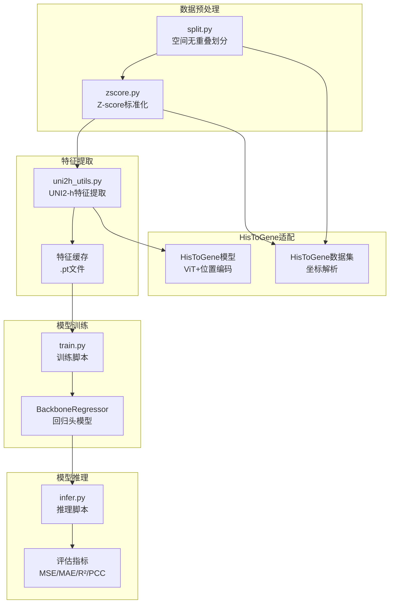
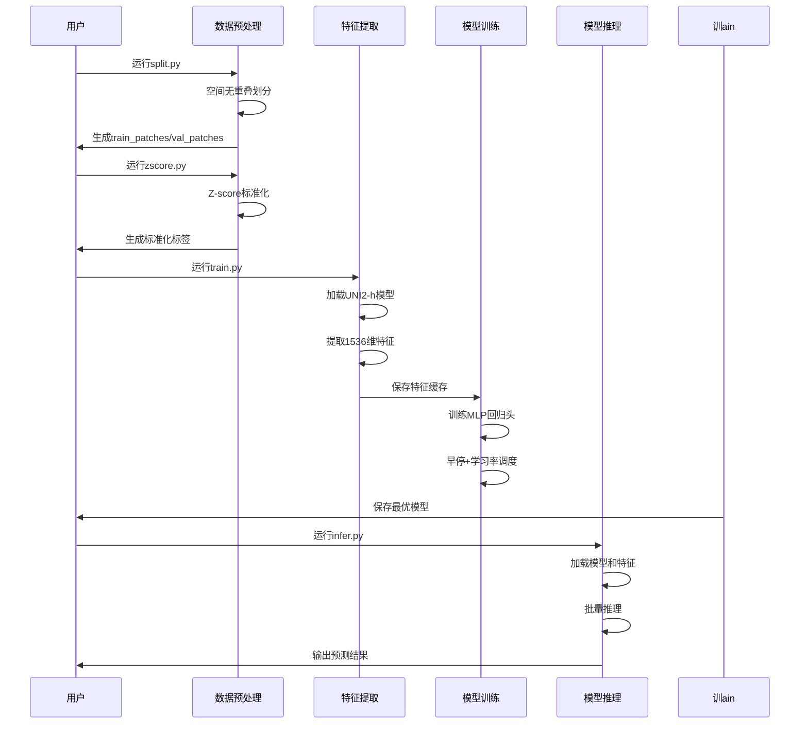
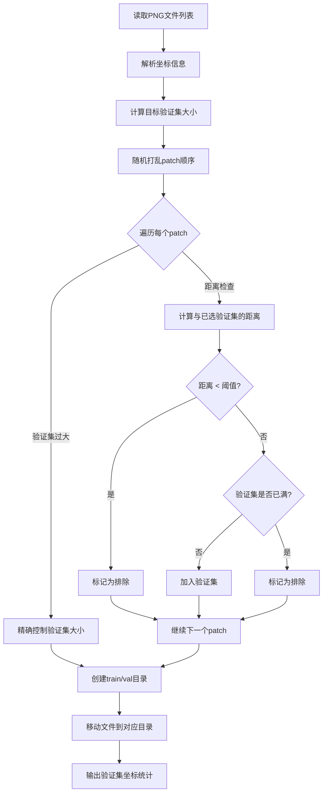
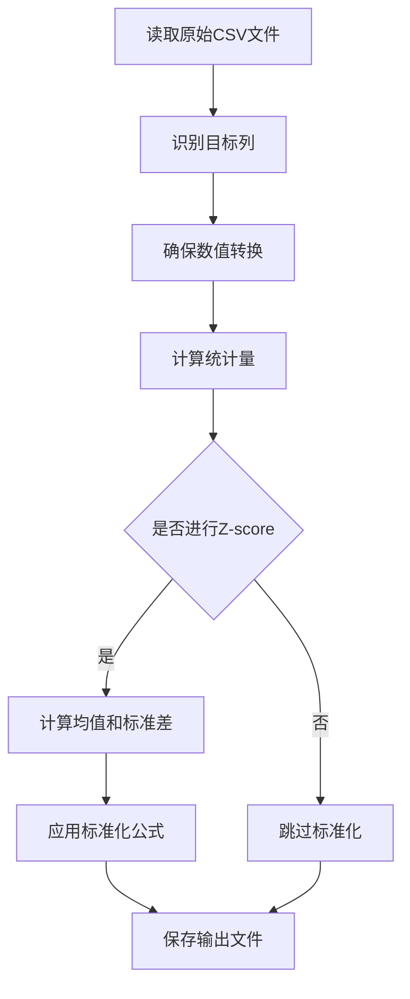
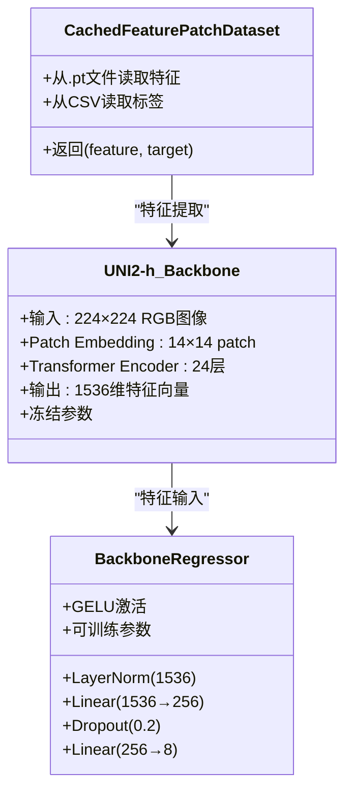
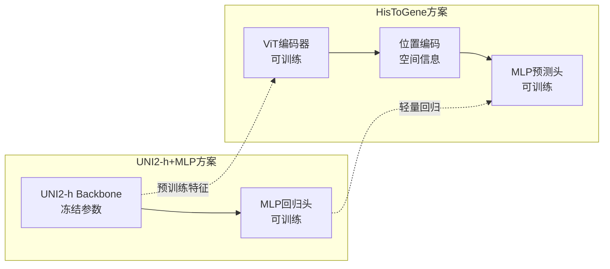
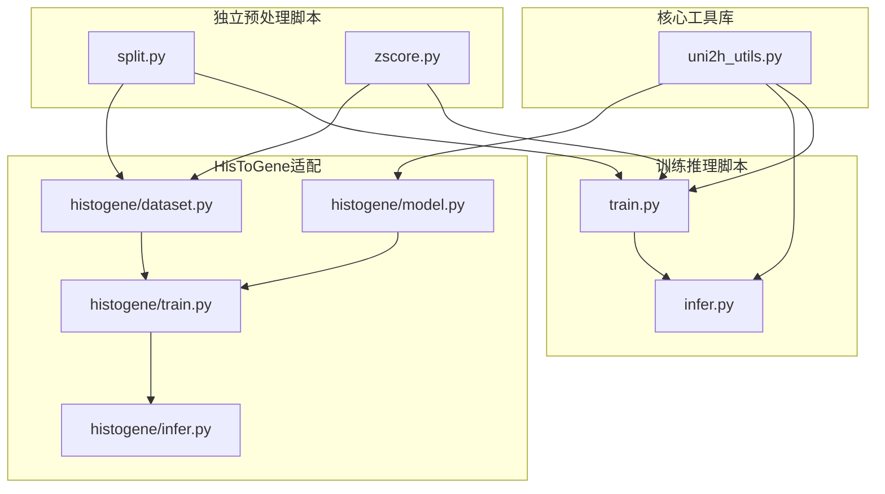
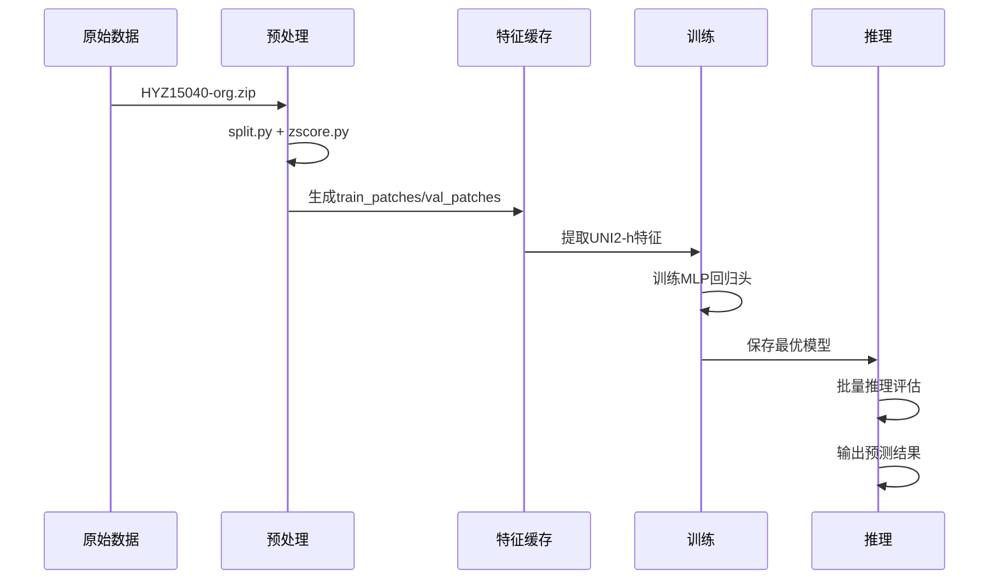

# 新数据集3ST分析报告

<cite>
**本文档引用的文件**
- [README.md](file://README.md)
- [config.yaml](file://config.yaml)
- [analyze_stats.py](file://analyze_stats.py)
- [data_distribution_analysis.py](file://data_distribution_analysis.py)
- [zscore.py](file://zscore.py)
- [split.py](file://split.py)
- [split_解读指南.md](file://split_解读指南.md)
- [train_解读指南.md](file://train_解读指南.md)
- [infer_解读指南.md](file://infer_解读指南.md)
- [uni2h_utils_解读指南.md](file://uni2h_utils_解读指南.md)
- [HisToGene应用规划.md](file://HisToGene应用规划.md)
- [PFMval学习指南.md](file://PFMval学习指南.md)
</cite>

## 目录
1. [项目概述](#项目概述)
2. [项目结构](#项目结构)
3. [核心组件](#核心组件)
4. [架构概览](#架构概览)
5. [详细组件分析](#详细组件分析)
6. [依赖关系分析](#依赖关系分析)
7. [性能考虑](#性能考虑)
8. [故障排除指南](#故障排除指南)
9. [结论](#结论)
10. [附录](#附录)

## 项目概述

PFMval是一个基于UNI2-h预训练模型的病理图像空间转录组分析系统。该项目专注于利用空间转录组数据预测组织学图像的基因表达水平，通过迁移学习的方式实现从大规模预训练模型到特定任务的适配。

该项目的核心创新在于：
- **空间无重叠数据划分**：确保训练集和验证集在空间上相互独立，防止数据泄漏
- **Z-score标准化**：统一基因集评分的量纲，提高模型训练稳定性
- **UNI2-h特征提取**：利用大规模预训练模型的强大特征提取能力
- **多目标回归**：同时预测8个基因集的表达水平

## 项目结构



**图表来源**
- [README.md:1-44](file://README.md#L1-L44)
- [HisToGene应用规划.md:175-186](file://HisToGene应用规划.md#L175-L186)

**章节来源**
- [README.md:1-44](file://README.md#L1-L44)
- [HisToGene应用规划.md:175-186](file://HisToGene应用规划.md#L175-L186)

## 核心组件

### 数据预处理组件

#### 空间无重叠划分 (split.py)
- **功能**：基于坐标距离约束将数据集划分为训练集和验证集
- **算法**：贪心算法，确保验证集内任意两点距离≥350px
- **输出**：train_patches/ 和 val_patches/ 目录

#### Z-score标准化 (zscore.py)
- **功能**：对8个基因集评分进行标准化处理
- **方法**：z = (x - μ) / σ
- **优势**：统一量纲，提高模型训练稳定性

### 特征提取组件

#### UNI2-h特征提取 (uni2h_utils.py)
- **模型**：MahmoodLab/UNI2-h，24层ViT，1536维输出
- **特性**：冻结参数，避免过拟合
- **缓存机制**：特征向量保存为.pt文件，支持断点续传

### 模型训练组件

#### 训练脚本 (train.py)
- **架构**：UNI2-h + MLP回归头
- **优化**：AdamW + ReduceLROnPlateau + 早停
- **指标**：MSE、MAE、R²、PCC

#### 推理脚本 (infer.py)
- **功能**：批量推理和性能评估
- **输出**：预测结果CSV和指标汇总

**章节来源**
- [split.py:1-200](file://split.py#L1-L200)
- [zscore.py:1-203](file://zscore.py#L1-L203)
- [uni2h_utils_解读指南.md:188-552](file://uni2h_utils_解读指南.md#L188-L552)
- [train_解读指南.md:156-222](file://train_解读指南.md#L156-L222)
- [infer_解读指南.md:134-170](file://infer_解读指南.md#L134-L170)

## 架构概览



**图表来源**
- [PFMval学习指南.md:72-89](file://PFMval学习指南.md#L72-L89)
- [HisToGene应用规划.md:422-445](file://HisToGene应用规划.md#L422-L445)

## 详细组件分析

### 空间无重叠划分算法

#### 核心算法流程


**图表来源**
- [split.py:22-96](file://split.py#L22-L96)
- [split_解读指南.md:134-144](file://split_解读指南.md#L134-L144)

#### 参数调优指南
- **distance_threshold_px**：建议设置为patch尺寸的1.5倍（≥350px）
- **val_size_fraction**：通常设置为0.1（10%）
- **random_state**：固定值确保结果可复现

**章节来源**
- [split.py:22-96](file://split.py#L22-L96)
- [split_解读指南.md:289-298](file://split_解读指南.md#L289-L298)

### Z-score标准化分析

#### 标准化流程


**图表来源**
- [zscore.py:141-203](file://zscore.py#L141-L203)

#### 统计分析功能
- **描述性统计**：均值、中位数、标准差、偏度、峰度
- **正态性检验**：Shapiro-Wilk和D'Agostino检验
- **异常值检测**：基于1.5×IQR规则
- **可视化输出**：直方图、QQ图、箱线图、相关性热力图

**章节来源**
- [analyze_stats.py:1-40](file://analyze_stats.py#L1-L40)
- [data_distribution_analysis.py:416-478](file://data_distribution_analysis.py#L416-L478)

### UNI2-h特征提取系统

#### 模型架构


**图表来源**
- [uni2h_utils_解读指南.md:488-552](file://uni2h_utils_解读指南.md#L488-L552)
- [uni2h_utils_解读指南.md:555-632](file://uni2h_utils_解读指南.md#L555-L632)

#### 训练优化策略
- **学习率调度**：ReduceLROnPlateau，因子0.5，耐心值5
- **早停机制**：耐心值10，最小改善阈值0.0
- **优化器**：AdamW，权重衰减1e-4
- **损失函数**：MSELoss

**章节来源**
- [train_解读指南.md:62-85](file://train_解读指南.md#L62-L85)
- [train_解读指南.md:300-355](file://train_解读指南.md#L300-L355)

### HisToGene模型适配

#### 模型架构对比


**图表来源**
- [HisToGene应用规划.md:80-92](file://HisToGene应用规划.md#L80-L92)
- [HisToGene应用规划.md:250-281](file://HisToGene应用规划.md#L250-L281)

#### 适配策略
- **输出维度调整**：从基因数量调整为8个通路
- **坐标解析**：从文件名提取(x,y)坐标
- **损失函数**：推荐Huber Loss处理异常值
- **位置编码**：使用可学习的位置嵌入

**章节来源**
- [HisToGene应用规划.md:249-328](file://HisToGene应用规划.md#L249-L328)
- [HisToGene应用规划.md:546-658](file://HisToGene应用规划.md#L546-L658)

## 依赖关系分析

### 文件间调用关系



**图表来源**
- [PFMval学习指南.md:255-305](file://PFMval学习指南.md#L255-L305)

### 数据流转关系



**图表来源**
- [PFMval学习指南.md:324-370](file://PFMval学习指南.md#L324-L370)

**章节来源**
- [PFMval学习指南.md:427-499](file://PFMval学习指南.md#L427-L499)

## 性能考虑

### 计算性能优化

#### 特征缓存策略
- **存储格式**：.pt文件，每个特征约6KB
- **缓存位置**：uni2h_cache/HYZ15040/{train,val}
- **复用机制**：特征提取一次，多次训练复用

#### 内存管理
- **批量大小**：256（可根据显存调整）
- **数据加载**：pin_memory=True加速GPU传输
- **设备选择**：自动检测CUDA，优先使用GPU

### 训练效率优化

#### 学习率调度
- **策略**：ReduceLROnPlateau
- **参数**：因子0.5，耐心值5
- **触发条件**：验证损失连续5轮无改善

#### 早停机制
- **耐心值**：10轮
- **最小改善**：0.0
- **监控指标**：验证损失

**章节来源**
- [train_解读指南.md:73-85](file://train_解读指南.md#L73-L85)
- [train_解读指南.md:300-355](file://train_解读指南.md#L300-L355)

## 故障排除指南

### 常见问题及解决方案

#### 环境配置问题
- **HF Token认证失败**：检查HUGGINGFACE_HUB_TOKEN环境变量
- **CUDA显存不足**：降低batch_size（64或128），使用CPU模式
- **依赖版本冲突**：确保PyTorch 2.1.0 + CUDA 11.8

#### 数据处理问题
- **坐标解析失败**：确认文件名格式为`patch_xXXX_yXXX.png`
- **特征缓存不存在**：运行特征提取或检查缓存路径
- **标签与图片不匹配**：检查CSV第一列文件名格式

#### 模型训练问题
- **严重过拟合**：增大dropout（0.3-0.5），减小hidden_dim（128）
- **训练不收敛**：调整学习率（1e-4到1e-2），检查数据预处理
- **指标异常**：检查预测值是否有常数列或极端异常值

### 调试建议

#### 数据验证
```python
# 检查特征缓存
cache_dir = Path("uni2h_cache/HYZ15040/train")
print(f"缓存文件数量: {len(list(cache_dir.glob('*.pt')))}")

# 验证Dataset加载
dataset = CachedFeaturePatchDataset(...)
print(f"数据集大小: {len(dataset)}")
feature, target = dataset[0]
print(f"特征形状: {feature.shape}, 标签形状: {target.shape}")
```

#### 训练监控
```python
# 添加训练过程打印
if batch_idx % 10 == 0:
    print(f"Batch {batch_idx}, Loss: {loss.item():.4f}")
```

**章节来源**
- [PFMval学习指南.md:161-171](file://PFMval学习指南.md#L161-L171)
- [uni2h_utils_解读指南.md:846-895](file://uni2h_utils_解读指南.md#L846-L895)

## 结论

PFMval项目展示了现代深度学习在病理图像分析中的最佳实践。通过精心设计的数据预处理、特征提取和模型训练流程，实现了从空间转录组数据到组织学图像基因表达预测的完整解决方案。

### 主要成就

1. **创新的数据划分策略**：解决了空间泄漏问题，确保验证集的独立性
2. **稳健的预处理流程**：Z-score标准化提高了模型训练的稳定性
3. **高效的特征提取**：UNI2-h预训练模型的应用大幅减少了训练时间
4. **完整的评估体系**：提供了MSE、MAE、R²、PCC等多维度评估指标

### 技术特色

- **迁移学习范式**：冻结强大的预训练模型，仅训练轻量回归头
- **特征缓存机制**：避免重复计算，提升训练效率
- **模块化设计**：清晰分离数据预处理、特征提取、模型训练和推理评估
- **可扩展性**：支持HisToGene等其他模型架构的适配

### 应用前景

该项目为病理图像的空间转录组分析提供了标准化的解决方案，具有广泛的应用价值：
- **临床诊断**：辅助病理医生进行更准确的诊断
- **药物研发**：预测药物对特定基因表达的影响
- **个性化治疗**：基于患者特定的基因表达模式制定治疗方案

## 附录

### 关键参数速查

| 参数 | 默认值 | 调优建议 | 说明 |
|------|--------|----------|------|
| distance_threshold_px | 350 | 300-400 | 空间距离阈值，防止数据泄漏 |
| val_size_fraction | 0.1 | 0.05-0.2 | 验证集比例，平衡验证准确性 |
| batch_size | 256 | 64-512 | 批量大小，受显存限制 |
| learning_rate | 1e-3 | 1e-4-1e-2 | 学习率，AdamW优化器 |
| hidden_dim | 256 | 128-512 | MLP隐藏层维度 |
| dropout | 0.2 | 0.1-0.5 | Dropout比率，防止过拟合 |
| early_stop_patience | 10 | 5-20 | 早停耐心值 |

### 推荐学习路径

1. **基础概念**：理解Patch、ssGSEA评分、Z-score标准化
2. **数据处理**：运行split.py和zscore.py，理解空间划分算法
3. **特征理论**：学习UNI2-h模型架构和特征提取原理
4. **训练优化**：掌握超参数调优和过拟合诊断
5. **结果分析**：学会解释MSE、MAE、R²、PCC指标

**章节来源**
- [PFMval学习指南.md:174-186](file://PFMval学习指南.md#L174-L186)
- [HisToGene应用规划.md:945-957](file://HisToGene应用规划.md#L945-L957)