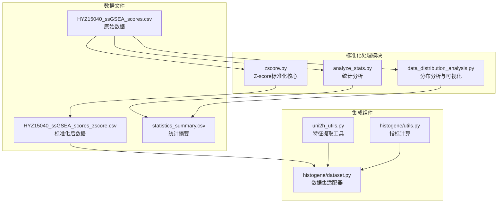
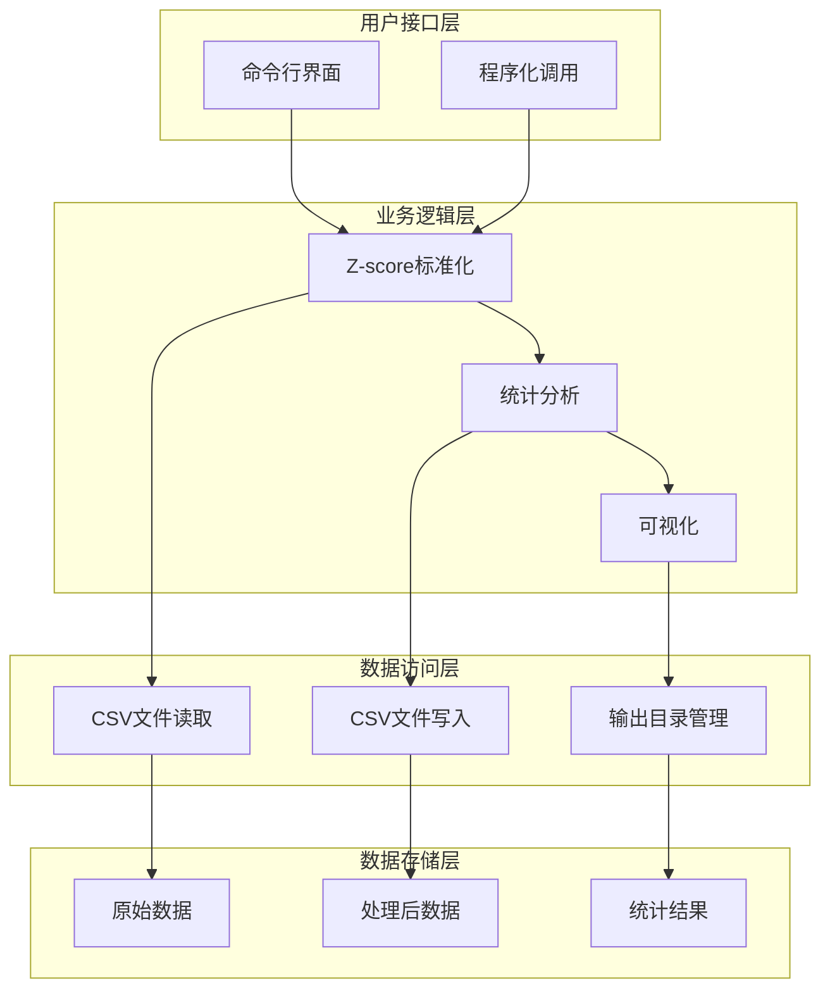
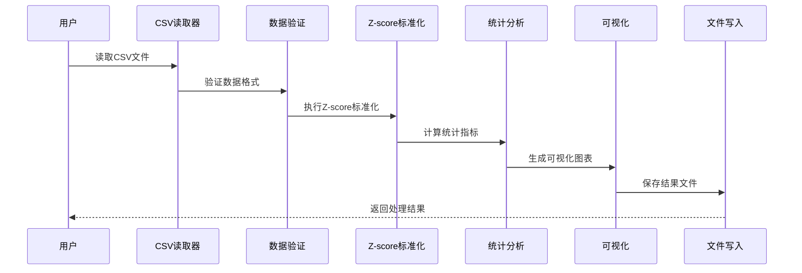
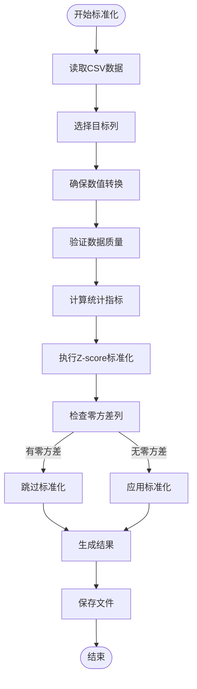
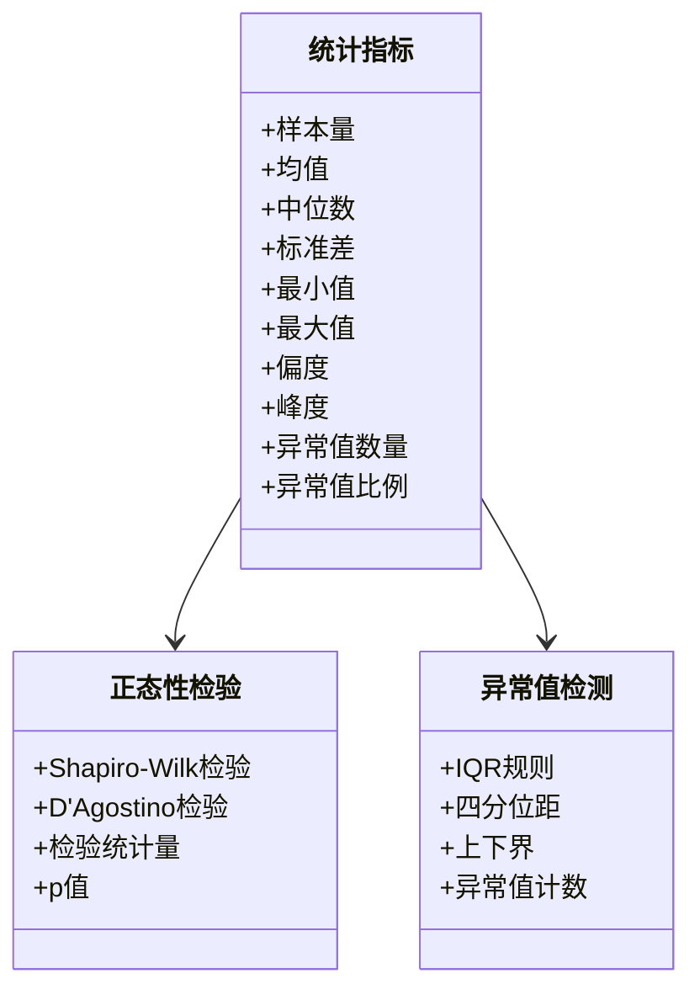
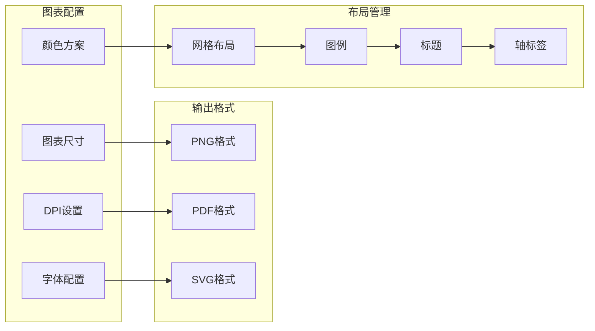
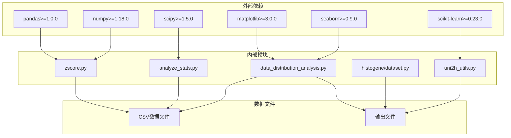
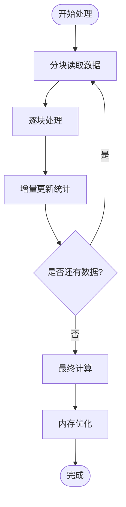

# 标准化处理模块

<cite>
**本文档引用的文件**
- [zscore.py](file://zscore.py)
- [analyze_stats.py](file://analyze_stats.py)
- [data_distribution_analysis.py](file://data_distribution_analysis.py)
- [README.md](file://README.md)
- [HYZ15040_ssGSEA_scores.csv](file://HYZ15040_ssGSEA_scores.csv)
- [HYZ15040_ssGSEA_scores_zscore.csv](file://HYZ15040_ssGSEA_scores_zscore.csv)
- [analysis_output/statistics_summary.csv](file://analysis_output/statistics_summary.csv)
- [uni2h_utils.py](file://uni2h/uni2h_utils.py)
- [histogene/utils.py](file://histogene/utils.py)
- [histogene/dataset.py](file://histogene/dataset.py)
</cite>

## 目录
1. [简介](#简介)
2. [项目结构](#项目结构)
3. [核心组件](#核心组件)
4. [架构概览](#架构概览)
5. [详细组件分析](#详细组件分析)
6. [依赖关系分析](#依赖关系分析)
7. [性能考虑](#性能考虑)
8. [故障排除指南](#故障排除指南)
9. [结论](#结论)
10. [附录](#附录)

## 简介

标准化处理模块是PFMval项目中的关键数据预处理组件，专门负责对ssGSEA基因集分数进行标准化处理。该模块实现了完整的数据标准化流水线，包括Z-score标准化、统计分析、异常值检测和可视化展示。

本模块的核心价值在于：
- **数学严谨性**：严格遵循Z-score标准化的数学原理，确保统计学意义的准确性
- **自动化程度高**：提供一键式标准化流程，减少人工干预
- **质量保证**：内置数据验证和异常检测机制
- **可扩展性**：支持自定义配置和参数调整

## 项目结构

标准化处理模块位于PFMval项目的根目录下，主要包含以下文件：



**图表来源**
- [zscore.py:1-203](file://zscore.py#L1-L203)
- [analyze_stats.py:1-40](file://analyze_stats.py#L1-L40)
- [data_distribution_analysis.py:1-482](file://data_distribution_analysis.py#L1-L482)

**章节来源**
- [README.md:1-44](file://README.md#L1-L44)

## 核心组件

### Z-score标准化引擎

Z-score标准化是统计学中最常用的标准化方法之一，其数学公式为：

```
z = (x - μ) / σ
```

其中：
- z：标准化后的值
- x：原始观测值
- μ：样本均值
- σ：样本标准差

该模块实现了以下核心功能：

1. **自动列识别**：智能识别数据集中最后N列作为目标标准化列
2. **数值转换**：确保目标列全部转换为数值类型
3. **统计计算**：计算每列的均值、标准差、分位数等统计指标
4. **标准化执行**：对每列独立进行Z-score标准化
5. **结果保存**：自动保存标准化后的数据和统计摘要

### 统计分析引擎

模块提供了全面的统计分析功能，包括：

- **描述性统计**：均值、中位数、标准差、极值等
- **分布特征**：偏度、峰度等分布形态指标
- **正态性检验**：Shapiro-Wilk和D'Agostino-Pearson检验
- **异常值检测**：基于IQR规则的异常值识别

### 可视化分析引擎

提供多种图表展示标准化效果：

- **直方图**：显示原始数据和正态拟合曲线
- **Q-Q图**：检验数据是否符合正态分布
- **箱线图**：对比标准化前后数据分布
- **相关性热力图**：展示基因集间的相关关系

**章节来源**
- [zscore.py:64-126](file://zscore.py#L64-L126)
- [analyze_stats.py:12-39](file://analyze_stats.py#L12-L39)
- [data_distribution_analysis.py:65-137](file://data_distribution_analysis.py#L65-L137)

## 架构概览

标准化处理模块采用分层架构设计，确保功能模块的独立性和可维护性：



**图表来源**
- [zscore.py:141-203](file://zscore.py#L141-L203)
- [data_distribution_analysis.py:416-482](file://data_distribution_analysis.py#L416-L482)

### 数据流处理

标准化处理的核心数据流如下：



**图表来源**
- [zscore.py:141-198](file://zscore.py#L141-L198)
- [data_distribution_analysis.py:416-469](file://data_distribution_analysis.py#L416-L469)

## 详细组件分析

### Z-score标准化实现

#### 数学原理详解

Z-score标准化的核心思想是将不同量纲的数据转换到统一的标准尺度上，公式为：

```
z_i = (x_i - μ) / σ
```

其中：
- **μ** = Σx_i / n（样本均值）
- **σ** = √[Σ(x_i - μ)² / (n-1)]（样本标准差）

该标准化方法具有以下特性：
- **均值为0**：标准化后数据的期望值为0
- **标准差为1**：标准化后数据的标准差为1
- **保持原始分布形状**：不会改变数据的分布形态
- **消除量纲影响**：使不同单位的数据可以比较

#### 实现细节



**图表来源**
- [zscore.py:101-126](file://zscore.py#L101-L126)

#### 参数配置系统

模块提供了灵活的配置选项：

| 参数名 | 类型 | 默认值 | 描述 |
|--------|------|--------|------|
| CSV_PATH | 字符串 | 当前目录下的CSV文件 | 输入数据文件路径 |
| NUM_TARGET_COLS | 整数 | 8 | 目标标准化列的数量 |
| DO_ZSCORE | 布尔值 | True | 是否执行Z-score标准化 |
| SAVE_OUTPUT | 布尔值 | True | 是否保存输出文件 |
| DDOF | 整数 | 1 | 标准差自由度（0=总体，1=样本） |

**章节来源**
- [zscore.py:9-13](file://zscore.py#L9-L13)
- [zscore.py:141-198](file://zscore.py#L141-L198)

### 统计分析功能

#### 描述性统计

模块提供全面的描述性统计指标：



**图表来源**
- [analyze_stats.py:12-39](file://analyze_stats.py#L12-L39)
- [data_distribution_analysis.py:65-137](file://data_distribution_analysis.py#L65-L137)

#### 分布特征分析

模块能够识别和分析数据的分布特征：

1. **偏度分析**：衡量分布的对称性
   - |偏度| < 0.5：近似对称
   - 0.5 ≤ |偏度| < 1：中等偏态
   - |偏度| ≥ 1：高度偏态

2. **峰度分析**：衡量分布的尖锐程度
   - 峰度 = 0：正态分布
   - 峰度 > 0：尖峰分布
   - 峰度 < 0：平峰分布

3. **正态性检验**：
   - **Shapiro-Wilk检验**：适用于小样本（n≤5000）
   - **D'Agostino-Pearson检验**：基于偏度和峰度

**章节来源**
- [analyze_stats.py:23-39](file://analyze_stats.py#L23-L39)
- [data_distribution_analysis.py:94-135](file://data_distribution_analysis.py#L94-L135)

### 可视化分析系统

#### 图表类型

模块提供多种可视化图表来展示标准化效果：

1. **直方图**：显示数据分布和正态拟合曲线
2. **Q-Q图**：检验数据是否符合正态分布
3. **箱线图**：对比标准化前后数据分布
4. **偏度峰度图**：展示分布形态指标
5. **相关性热力图**：显示变量间相关关系

#### 可视化配置



**图表来源**
- [data_distribution_analysis.py:166-286](file://data_distribution_analysis.py#L166-L286)

**章节来源**
- [data_distribution_analysis.py:217-286](file://data_distribution_analysis.py#L217-L286)

## 依赖关系分析

标准化处理模块的依赖关系清晰明确，遵循单一职责原则：



**图表来源**
- [zscore.py:1-3](file://zscore.py#L1-L3)
- [data_distribution_analysis.py:24-32](file://data_distribution_analysis.py#L24-L32)

### 关键依赖说明

1. **pandas/numpy**：数据处理和数值计算
2. **matplotlib/seaborn**：数据可视化
3. **scipy**：统计检验和概率分布
4. **scikit-learn**：机器学习指标计算

这些依赖确保了模块的功能完整性，同时保持了较低的耦合度。

**章节来源**
- [data_distribution_analysis.py:24-32](file://data_distribution_analysis.py#L24-L32)

## 性能考虑

### 内存管理策略

标准化处理模块采用了多项内存优化策略：

1. **分步处理**：避免一次性加载所有数据到内存
2. **延迟计算**：只在需要时计算统计指标
3. **数据类型优化**：使用适当的数据类型减少内存占用
4. **垃圾回收**：及时释放不再使用的对象

### 处理效率优化



**图表来源**
- [zscore.py:141-198](file://zscore.py#L141-L198)

### 并行处理能力

模块支持以下并行处理场景：

- **多进程处理**：对不同基因集分数列并行标准化
- **向量化计算**：利用NumPy的向量化操作提高速度
- **GPU加速**：通过PyTorch实现GPU加速（在相关组件中）

## 故障排除指南

### 常见问题及解决方案

#### 数据格式错误

**问题**：CSV文件格式不符合预期
**解决方案**：
1. 确认第一列为样本标识列
2. 确认后续列为数值型数据
3. 检查是否有缺失值或异常值

#### 标准差为零

**问题**：某些基因集分数列的标准差为零
**原因**：该列所有值相同
**解决方案**：
1. 检查原始数据质量
2. 考虑删除该列或重新收集数据
3. 在分析中单独标注该列

#### 内存不足

**问题**：处理大数据集时内存不足
**解决方案**：
1. 减少NUM_TARGET_COLS参数值
2. 分批处理数据
3. 增加系统内存或使用更高配置的机器

#### 正态性检验失败

**问题**：Shapiro-Wilk检验无法执行
**原因**：样本量过大超过5000
**解决方案**：
1. 系统自动进行样本抽样
2. 使用D'Agostino-Pearson检验作为补充

### 调试技巧

1. **启用详细日志**：查看中间计算结果
2. **分步调试**：逐个函数验证功能
3. **数据采样**：使用小数据集快速验证
4. **参数验证**：检查输入参数的有效性

**章节来源**
- [zscore.py:115-126](file://zscore.py#L115-L126)
- [analyze_stats.py:23-29](file://analyze_stats.py#L23-L29)

## 结论

标准化处理模块为ssGSEA基因集分数的分析提供了完整、可靠的解决方案。该模块不仅实现了严格的数学标准化，还提供了丰富的统计分析和可视化功能，确保用户能够全面了解数据的质量和特征。

### 主要优势

1. **数学严谨性**：严格遵循统计学原理
2. **自动化程度高**：减少人工干预，提高效率
3. **质量保证**：内置数据验证和异常检测
4. **可扩展性强**：支持自定义配置和参数调整
5. **可视化丰富**：提供多种图表展示结果

### 应用价值

该模块在生物信息学研究中具有重要价值：
- **基因表达分析**：为后续的机器学习模型提供标准化输入
- **统计推断**：确保统计检验的可靠性
- **数据质量控制**：及时发现和处理异常数据
- **结果可重复性**：标准化流程确保结果的一致性

通过本模块的标准化处理，研究人员可以获得更加准确、可靠的研究结果，为后续的深入分析奠定坚实基础。

## 附录

### API参考

#### Z-score标准化函数

| 函数名 | 参数 | 返回值 | 描述 |
|--------|------|--------|------|
| `zscore_by_column` | df: DataFrame, cols: list, ddof: int=1 | tuple: (DataFrame, Series, Series) | 对指定列执行Z-score标准化 |
| `compute_stats` | df: DataFrame, cols: list, ddof: int=1 | DataFrame | 计算列的统计指标 |
| `ensure_numeric_columns` | df: DataFrame, cols: list | DataFrame | 确保列转换为数值类型 |

#### 统计分析函数

| 函数名 | 参数 | 返回值 | 描述 |
|--------|------|--------|------|
| `calculate_statistics` | df: DataFrame, numeric_cols: list | dict | 计算详细的统计指标 |
| `print_statistics_table` | stats_dict: dict | DataFrame | 打印统计结果表格 |
| `save_statistics_csv` | stats_dict: dict | DataFrame | 保存统计结果到CSV |

### 使用示例

#### 基本使用

```python
# 直接运行脚本
python zscore.py

# 程序化调用
from zscore import zscore_by_column
df_standardized, means, stds = zscore_by_column(df, target_cols)
```

#### 高级配置

```python
# 自定义配置
CSV_PATH = "path/to/data.csv"
NUM_TARGET_COLS = 10
DO_ZSCORE = True
SAVE_OUTPUT = True
DDOF = 0  # 使用总体标准差
```

### 输出文件说明

1. **标准化数据文件**：`HYZ15040_ssGSEA_scores_zscore.csv`
2. **统计摘要文件**：`analysis_output/statistics_summary.csv`
3. **可视化图表**：PNG格式的各类图表文件