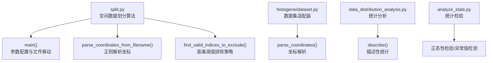
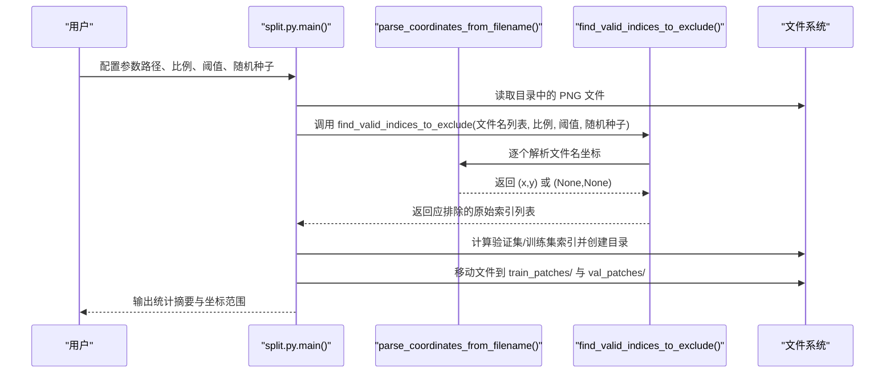
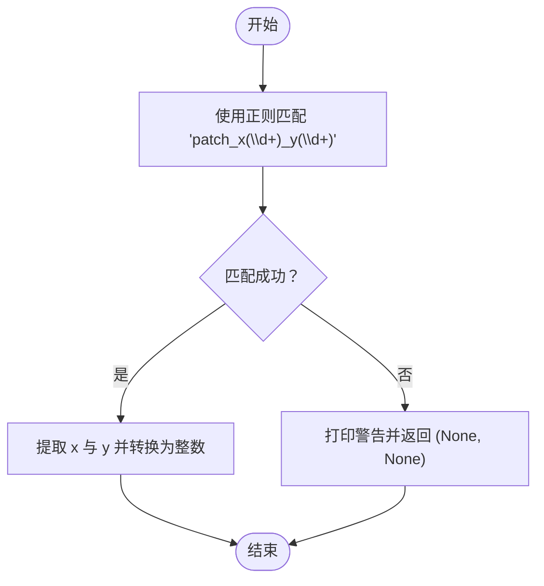
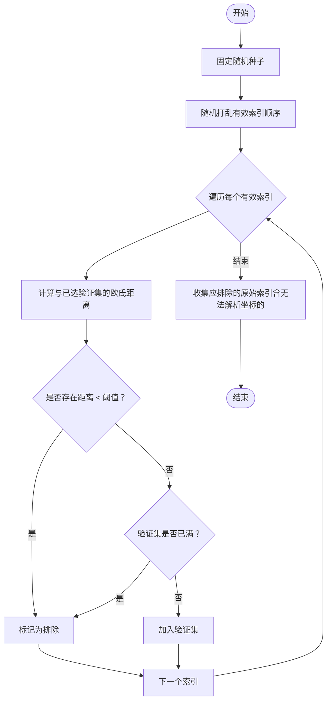
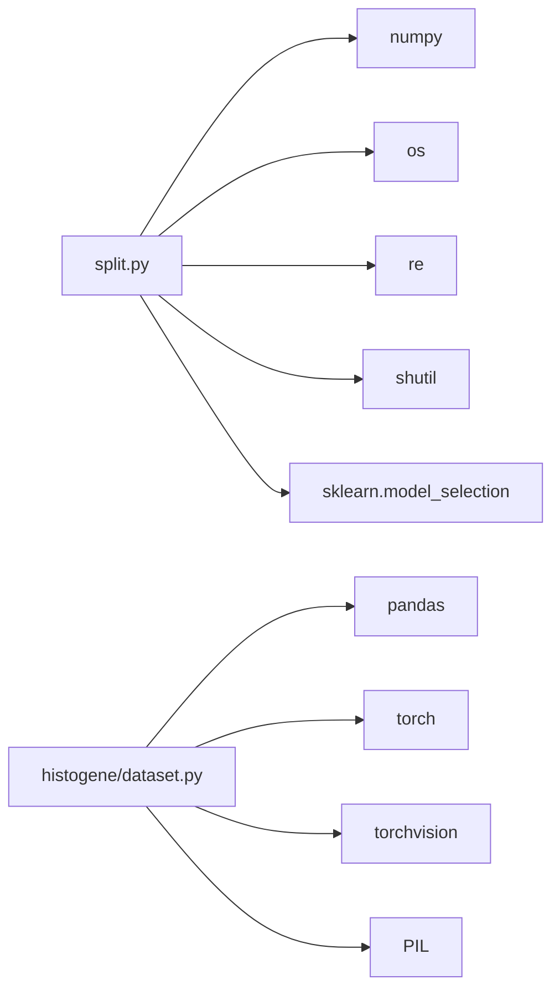

# 空间数据划分模块

<cite>
**本文引用的文件**
- [split.py](file://split.py)
- [split_解读指南.md](file://split_解读指南.md)
- [README.md](file://README.md)
- [histogene/dataset.py](file://histogene/dataset.py)
- [histogene/utils.py](file://histogene/utils.py)
- [data_distribution_analysis.py](file://data_distribution_analysis.py)
- [analyze_stats.py](file://analyze_stats.py)
</cite>

## 目录
1. [简介](#简介)
2. [项目结构](#项目结构)
3. [核心组件](#核心组件)
4. [架构概览](#架构概览)
5. [详细组件分析](#详细组件分析)
6. [依赖分析](#依赖分析)
7. [性能考虑](#性能考虑)
8. [故障排查指南](#故障排查指南)
9. [结论](#结论)
10. [附录](#附录)

## 简介
本技术文档聚焦“空间数据划分模块”，系统阐述基于坐标距离的空间数据划分算法，涵盖以下要点：
- parse_coordinates_from_filename 函数的正则表达式解析逻辑
- find_valid_indices_to_exclude 函数的距离阈值计算与排除策略
- 350px 距离阈值的选择原理及其对模型性能的影响
- 随机种子 random_state=42 的作用与可重现性保证
- 坐标解析失败的处理机制与警告信息
- 完整的 API 文档（函数参数、返回值、使用示例）
- 数据验证流程与错误处理策略
- 性能优化建议与内存管理策略

该模块是数据预处理流程的关键环节，位于图像切分（生成 patch）之后、模型训练之前，确保训练集与验证集在空间上相互独立，避免因空间邻近导致的数据泄漏。

**章节来源**
- [README.md:1-44](file://README.md#L1-L44)

## 项目结构
本仓库围绕空间数据划分与下游分析展开，其中与空间数据划分直接相关的核心文件如下：
- split.py：空间数据划分算法实现与主流程
- split_解读指南.md：对 split.py 的深度解读与流程说明
- histogene/dataset.py：数据集适配器，包含坐标解析与数据加载逻辑
- histogene/utils.py：评估指标工具函数
- data_distribution_analysis.py / analyze_stats.py：统计分析与可视化脚本（辅助理解数据分布）

**图表来源**
- [split.py:1-200](file://split.py#L1-L200)
- [histogene/dataset.py:1-118](file://histogene/dataset.py#L1-L118)
- [data_distribution_analysis.py:1-482](file://data_distribution_analysis.py#L1-L482)
- [analyze_stats.py:1-40](file://analyze_stats.py#L1-L40)

**章节来源**
- [split.py:1-200](file://split.py#L1-L200)
- [split_解读指南.md:1-442](file://split_解读指南.md#L1-L442)

## 核心组件
本模块由三个核心函数构成：
- parse_coordinates_from_filename：从文件名解析 x、y 坐标，失败时发出警告并返回空值
- find_valid_indices_to_exclude：基于欧氏距离与阈值，计算应排除在验证集之外的索引集合
- main：参数配置、文件读取、调用划分算法、创建输出目录并移动文件

此外，数据集适配器（histogene/dataset.py）也包含坐标解析逻辑，用于后续模型训练阶段的坐标处理。

**章节来源**
- [split.py:8-96](file://split.py#L8-L96)
- [split.py:99-198](file://split.py#L99-L198)
- [histogene/dataset.py:15-21](file://histogene/dataset.py#L15-L21)

## 架构概览
空间数据划分的整体流程如下：
- 输入阶段：读取指定目录下的 PNG 文件列表
- 坐标解析阶段：从文件名中提取 x、y 坐标；无法解析的文件将被排除
- 空间划分阶段：以贪心策略随机打乱 patch，逐个检查与已选验证集的距离，若小于阈值则排除
- 数据集生成阶段：计算训练/验证集索引，创建输出目录并移动文件

**图表来源**
- [split.py:99-198](file://split.py#L99-L198)
- [split.py:8-19](file://split.py#L8-L19)

## 详细组件分析

### 函数 API 文档

#### parse_coordinates_from_filename
- 功能：从 patch 文件名中提取 x、y 坐标。支持带扩展名或不带扩展名的文件名。
- 参数
  - filename：字符串，文件名（含或不含扩展名）
- 返回值
  - x：整数或 None
  - y：整数或 None
- 行为
  - 使用正则表达式匹配形如 “patch_x{d}_y{d}” 的模式
  - 若匹配成功，返回整数坐标；否则打印警告并返回 (None, None)
- 示例
  - 输入：'patch_x4641_y16969.png' → 输出：(4641, 16969)
  - 输入：'patch_x100_y200' → 输出：(100, 200)
  - 输入：'invalid_name.jpg' → 输出：(None, None)

**章节来源**
- [split.py:8-19](file://split.py#L8-L19)
- [split_解读指南.md:83-113](file://split_解读指南.md#L83-L113)

#### find_valid_indices_to_exclude
- 功能：根据空间距离规则，计算应被排除在验证集之外的所有 patch 索引。
- 参数
  - patch_filenames：列表，文件名列表
  - val_size_fraction：浮点数，验证集占有效 patch 的比例
  - distance_threshold：整数，距离阈值（像素）
  - random_state：整数，默认 42，用于固定随机种子
- 返回值
  - 列表，应排除的原始索引（包括无法解析坐标的文件）
- 算法流程（贪心策略）
  - 解析所有文件名坐标，建立“有效索引 → 原始索引”的映射
  - 计算目标验证集大小：n_valid_patches × val_size_fraction
  - 固定随机种子并随机打乱有效索引顺序
  - 逐个检查与已选验证集的距离：若任意距离 < threshold，则标记为“排除”
  - 若未排除且验证集未满，则加入验证集；否则标记为“排除”
  - 将“无法解析坐标的文件”全部纳入排除集合
  - 将“基于距离排除的有效索引”映射回原始索引并合并
- 复杂度
  - 时间复杂度：O(N^2)，N 为有效 patch 数（两层循环比较距离）
  - 空间复杂度：O(N)，存储坐标与索引映射
- 注意事项
  - 若无有效坐标，返回全部索引（避免空验证集）
  - 若验证集过大，最终会通过随机抽样精确控制目标数量

**章节来源**
- [split.py:22-96](file://split.py#L22-L96)
- [split_解读指南.md:116-170](file://split_解读指南.md#L116-L170)

#### main
- 功能：脚本主入口，负责参数配置、调用划分算法、创建输出目录、移动文件。
- 关键步骤
  - 配置参数（路径、比例、阈值、随机种子）
  - 读取目录中的 PNG 文件
  - 调用 find_valid_indices_to_exclude 获取排除索引
  - 计算验证集/训练集索引，并精确控制验证集大小
  - 创建 train_patches/ 与 val_patches/ 目录并移动文件
  - 输出统计摘要与验证集坐标范围
- 输出
  - 控制台输出：数据集划分摘要、移动统计、验证集坐标范围
  - 文件系统：train_patches/ 与 val_patches/ 目录及内部文件

**章节来源**
- [split.py:99-198](file://split.py#L99-L198)
- [split_解读指南.md:172-207](file://split_解读指南.md#L172-L207)

### 算法细节与可视化

#### 正则表达式解析逻辑
- 正则模式：匹配形如 “patch_x{数字}_y{数字}” 的文件名
- 提取组：第一个捕获组为 x，第二个捕获组为 y
- 失败处理：打印警告并返回 (None, None)

**图表来源**
- [split.py:12-19](file://split.py#L12-L19)

**章节来源**
- [split.py:8-19](file://split.py#L8-L19)

#### 距离阈值与排除策略
- 距离计算：欧氏距离，使用向量范数计算
- 排除策略：贪心算法
  - 固定随机种子并随机打乱顺序
  - 逐个检查与已选验证集的距离，若任意距离 < threshold，则排除
  - 若未排除且验证集未满，则加入验证集
  - 若验证集已满，继续标记其余 patch 为排除（保持空间独立性）
- 350px 阈值选择原理
  - 与典型 patch 尺寸（如 224×224 或 256×256）相当，确保空间独立性
  - 太小（如 100）仍可能引入空间泄漏；太大（如 1000）可能导致验证集过小
  - 建议 threshold ≈ 1.5 × patch_size

**图表来源**
- [split.py:51-96](file://split.py#L51-L96)

**章节来源**
- [split.py:22-96](file://split.py#L22-L96)
- [split_解读指南.md:289-298](file://split_解读指南.md#L289-L298)

#### 随机种子与可重现性
- random_state=42 的作用
  - 固定随机种子，确保每次运行的打乱顺序一致
  - 使划分结果可复现，便于调试与实验对比
- 使用场景
  - 初始打乱（行号：np.random.seed(...)）
  - 验证集过大时的随机抽样（行号：np.random.choice(...)）

**章节来源**
- [split.py:51-52](file://split.py#L51-L52)
- [split.py:125-128](file://split.py#L125-L128)

#### 坐标解析失败的处理机制
- 当文件名不符合预期格式时，parse_coordinates_from_filename 返回 (None, None)
- find_valid_indices_to_exclude 会跳过无法解析坐标的 patch，并将其纳入“应排除集合”
- 控制台会打印警告信息，提示无法解析的文件名

**章节来源**
- [split.py:18-19](file://split.py#L18-L19)
- [split.py:36-37](file://split.py#L36-L37)
- [split.py:84-89](file://split.py#L84-L89)

### 数据验证与错误处理
- 数据验证
  - 文件扩展名过滤：仅处理 .png 文件
  - 坐标解析有效性：无法解析的文件将被排除
  - 验证集大小控制：若划分后验证集过大，通过随机抽样精确控制目标数量
- 错误处理
  - 文件不存在：移动阶段打印警告
  - 无有效坐标：打印警告并返回全部索引（避免空验证集）
  - 路径错误：需手动修正 patches_dir

**章节来源**
- [split.py:107-109](file://split.py#L107-L109)
- [split.py:42-44](file://split.py#L42-L44)
- [split.py:161-165](file://split.py#L161-L165)

## 依赖分析
- 内部依赖
  - split.py 依赖 numpy（数组与随机）、os（文件系统）、re（正则）、shutil（文件移动）、sklearn.model_selection（随机抽样）
- 外部依赖
  - histogene/dataset.py 依赖 pandas、torch、torchvision、PIL 等，用于数据集构建与坐标归一化
- 模块耦合
  - split.py 与 histogene/dataset.py 在“坐标解析”方面存在相似逻辑，但职责不同：前者用于数据划分，后者用于训练阶段的数据加载与归一化

**图表来源**
- [split.py:1-5](file://split.py#L1-L5)
- [histogene/dataset.py:5-12](file://histogene/dataset.py#L5-L12)

**章节来源**
- [split.py:1-5](file://split.py#L1-L5)
- [histogene/dataset.py:5-12](file://histogene/dataset.py#L5-L12)

## 性能考虑
- 时间复杂度
  - find_valid_indices_to_exclude 的核心循环为 O(N^2)，N 为有效 patch 数
  - 对于大规模数据集，建议：
    - 优先筛选高质量文件（确保文件名格式正确）
    - 调整 val_size_fraction 与 distance_threshold，减少无效尝试
    - 如需加速，可考虑使用更高效的最近邻搜索（如 KD-Tree），但需权衡实现复杂度
- 空间复杂度
  - 存储坐标与索引映射，约为 O(N)
  - 建议在内存紧张时分批处理或限制输入文件数量
- I/O 优化
  - 使用 shutil.move 替代复制，减少磁盘占用
  - 预先创建输出目录，避免重复创建开销
- 随机性与可重现性
  - 固定 random_state=42，确保结果可复现
  - 验证集过大时的随机抽样同样固定种子，保证一致性

**章节来源**
- [split.py:39-40](file://split.py#L39-L40)
- [split.py:51-52](file://split.py#L51-L52)
- [split.py:125-128](file://split.py#L125-L128)

## 故障排查指南
- 常见问题与解决方案
  - FileNotFoundError：patches_dir 路径错误，需修改为实际路径
  - 验证集为空：所有 patch 被排除，建议减小 distance_threshold 或增大验证集比例
  - 验证集过大：空间约束过松，建议增大 distance_threshold
  - 文件名解析失败：文件名格式不符，需确保为 “patch_x{d}_y{d}.png”
- 调试建议
  - 检查文件名格式与扩展名
  - 验证坐标解析结果
  - 检查划分后训练/验证集数量
  - 可选：可视化验证集坐标分布（参考数据分布分析脚本思路）

**章节来源**
- [split_解读指南.md:339-347](file://split_解读指南.md#L339-L347)
- [split_解读指南.md:348-375](file://split_解读指南.md#L348-L375)

## 结论
本空间数据划分模块通过“基于坐标距离的贪心策略”，有效避免了训练集与验证集之间的空间泄漏，确保模型评估的真实性与稳定性。350px 阈值与 random_state=42 的组合在工程实践中提供了良好的平衡：既保证了空间独立性，又确保了结果的可复现性。配合完善的错误处理与调试建议，该模块能够满足大多数病理图像 patch 数据集的划分需求。

## 附录

### API 速查表
- parse_coordinates_from_filename
  - 参数：filename（字符串）
  - 返回：(x, y) 或 (None, None)
- find_valid_indices_to_exclude
  - 参数：patch_filenames（列表）、val_size_fraction（浮点数）、distance_threshold（整数）、random_state（整数，默认 42）
  - 返回：应排除的原始索引列表（整数列表）
- main
  - 参数：无（内部硬编码路径与参数）
  - 返回：无（直接输出统计与文件移动）

**章节来源**
- [split.py:8-96](file://split.py#L8-L96)
- [split.py:99-198](file://split.py#L99-L198)

### 与数据集适配器的关系
- histogene/dataset.py 的 parse_coordinates 与 split.py 的 parse_coordinates_from_filename 功能类似，但职责不同：
  - split.py：用于划分阶段的坐标解析与排除
  - dataset.py：用于训练阶段的坐标归一化与数据加载
- 两者均依赖正则表达式解析坐标，但正则模式略有差异（前者匹配 “patch_x…_y…”；后者匹配 “x…_y…”）

**章节来源**
- [histogene/dataset.py:15-21](file://histogene/dataset.py#L15-L21)
- [split.py:8-19](file://split.py#L8-L19)