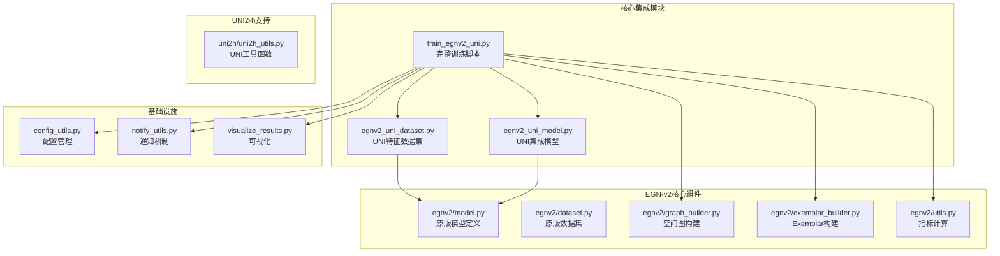
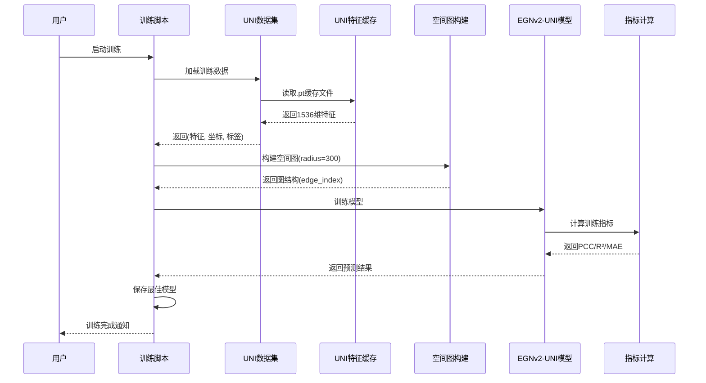
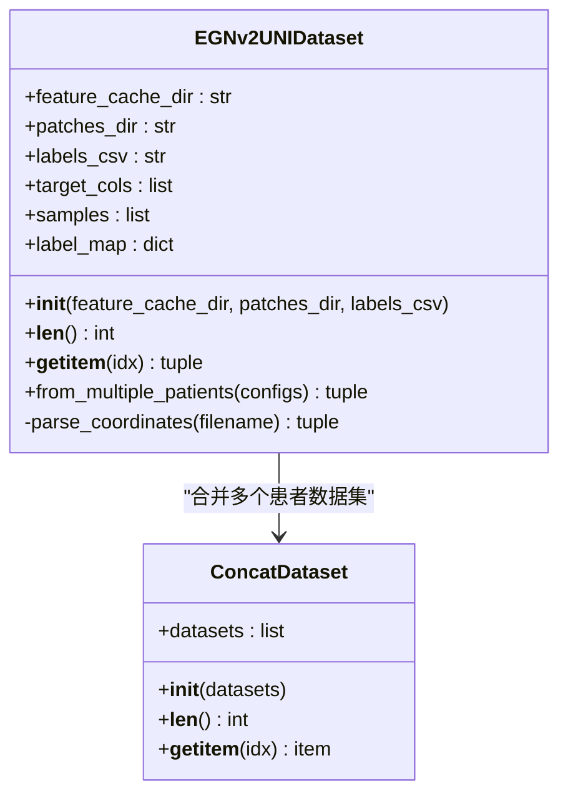
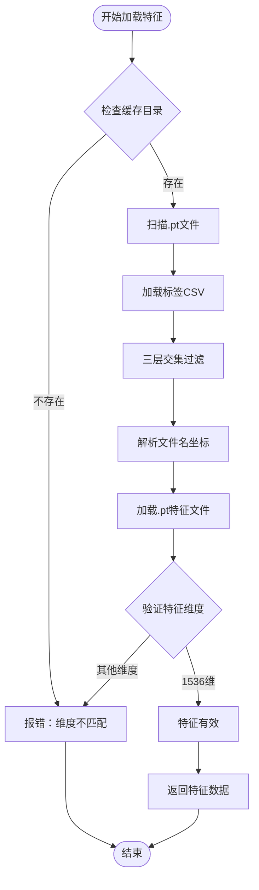
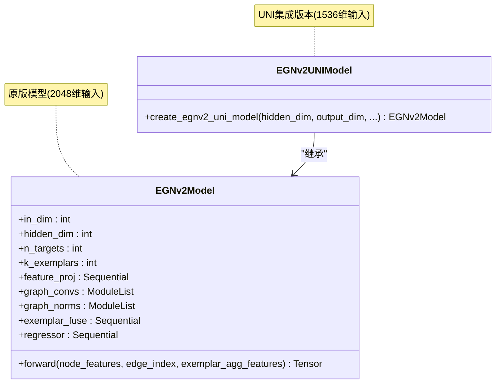
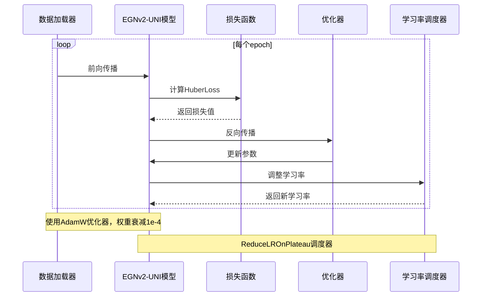
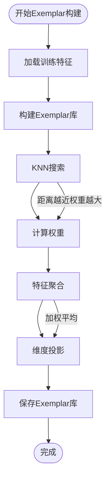
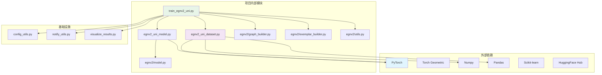
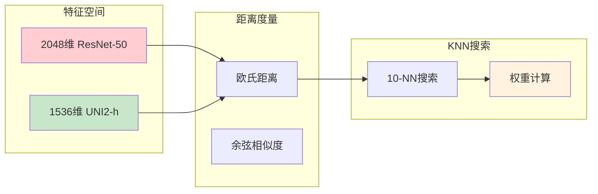

# EGNv2+UNI2-h集成方案

<cite>
**本文档引用的文件**
- [EGNv2_UNI集成方案.md](file://EGNv2_UNI集成方案.md)
- [README.md](file://README.md)
- [egnv2_uni_dataset.py](file://egnv2_uni_dataset.py)
- [egnv2_uni_model.py](file://egnv2_uni_model.py)
- [train_egnv2_uni.py](file://train_egnv2_uni.py)
- [egnv2/model.py](file://egnv2/model.py)
- [egnv2/dataset.py](file://egnv2/dataset.py)
- [egnv2/graph_builder.py](file://egnv2/graph_builder.py)
- [egnv2/exemplar_builder.py](file://egnv2/exemplar_builder.py)
- [egnv2/utils.py](file://egnv2/utils.py)
- [uni2h/uni2h_utils.py](file://uni2h/uni2h_utils.py)
- [visualize_results.py](file://visualize_results.py)
- [config_utils.py](file://config_utils.py)
- [notify_utils.py](file://notify_utils.py)
</cite>

## 目录
1. [简介](#简介)
2. [项目结构](#项目结构)
3. [核心组件](#核心组件)
4. [架构概览](#架构概览)
5. [详细组件分析](#详细组件分析)
6. [依赖关系分析](#依赖关系分析)
7. [性能考虑](#性能考虑)
8. [故障排除指南](#故障排除指南)
9. [结论](#结论)
10. [附录](#附录)

## 简介

EGNv2+UNI2-h集成方案是一个将EGN-v2图神经网络模型与UNI2-h病理图像预训练模型相结合的创新性改进。该方案的核心思想是用UNI2-h的1536维预提取特征替代EGN-v2中原有的ResNet-50特征提取器，从而实现：

- **跨患者泛化能力显著提升**：从EGN-v2的-52%衰减降至HisToGene-UNI的-26%衰减
- **训练速度大幅提升**：跳过实时特征提取步骤，直接从磁盘加载.pt缓存文件
- **参数量大幅减少**：去除ResNet-50的~23M参数，整体参数量降至~0.8M
- **保持图神经网络优势**：完整保留EGN-v2的GraphSAGE空间建模能力和Exemplar融合机制

## 项目结构

该项目采用模块化设计，主要包含以下核心目录和文件：



**图表来源**
- [egnv2_uni_dataset.py:1-178](file://egnv2_uni_dataset.py#L1-L178)
- [egnv2_uni_model.py:1-33](file://egnv2_uni_model.py#L1-L33)
- [train_egnv2_uni.py:1-839](file://train_egnv2_uni.py#L1-L839)

**章节来源**
- [EGNv2_UNI集成方案.md:1-561](file://EGNv2_UNI集成方案.md#L1-L561)
- [README.md:1-44](file://README.md#L1-L44)

## 核心组件

### UNI特征数据集适配器

EGNv2UNIDataset是整个集成方案的关键组件，负责从UNI2-h预提取的.pt缓存文件中加载特征数据。

**核心特性：**
- **三层交集过滤**：确保PNG图像、标签CSV和UNI特征缓存三者同时存在
- **原始坐标保留**：直接从文件名解析原始像素坐标（x, y），不进行归一化处理
- **多患者支持**：支持跨患者数据集合并训练
- **特征维度验证**：确保加载的特征维度为1536维

**数据流处理：**
1. 扫描UNI特征缓存目录，建立特征文件集合
2. 读取标签CSV文件，构建标签映射
3. 三层交集过滤：PNG图像 + 标签 + 特征缓存
4. 从文件名解析原始坐标
5. 加载.pt文件中的特征向量

**章节来源**
- [egnv2_uni_dataset.py:15-178](file://egnv2_uni_dataset.py#L15-L178)

### UNI集成模型

EGNv2UNIModel基于原版EGNv2Model，唯一的改动是将输入维度从2048调整为1536。

**模型架构保持不变：**
- **特征投影层**：Linear(1536→512) + LayerNorm + GELU + Dropout
- **GraphSAGE层**：2层SAGEConv + 残差连接
- **Exemplar融合层**：拼接投影层
- **回归头**：三层MLP网络

**关键优势：**
- 完全复用原版模型的所有组件
- 去除ResNetFeatureExtractor类
- 保持相同的训练流程和评估指标

**章节来源**
- [egnv2_uni_model.py:10-33](file://egnv2_uni_model.py#L10-L33)

### 完整训练脚本

train_egnv2_uni.py提供了完整的训练流程，支持单患者和跨患者两种训练模式。

**训练流程：**
1. **数据集加载**：使用EGNv2UNIDataset替代原版EGNv2Dataset
2. **特征提取**：直接从.pt缓存文件加载特征，跳过ResNet推理
3. **空间图构建**：使用原始坐标构建半径为300像素的空间图
4. **Exemplar库构建**：从1536维UNI特征构建代表库
5. **模型训练**：使用EGNv2UNIModel进行端到端训练

**训练优化：**
- HuberLoss损失函数，对异常值具有鲁棒性
- AdamW优化器，权重衰减1e-4
- ReduceLROnPlateau学习率调度
- 早停机制防止过拟合

**章节来源**
- [train_egnv2_uni.py:100-839](file://train_egnv2_uni.py#L100-L839)

## 架构概览



**图表来源**
- [train_egnv2_uni.py:496-797](file://train_egnv2_uni.py#L496-L797)
- [egnv2/graph_builder.py:11-62](file://egnv2/graph_builder.py#L11-L62)

## 详细组件分析

### 数据集组件分析

#### EGNv2UNIDataset类结构



**图表来源**
- [egnv2_uni_dataset.py:23-178](file://egnv2_uni_dataset.py#L23-L178)

#### 特征加载流程



**图表来源**
- [egnv2_uni_dataset.py:58-127](file://egnv2_uni_dataset.py#L58-L127)

**章节来源**
- [egnv2_uni_dataset.py:1-178](file://egnv2_uni_dataset.py#L1-L178)

### 模型组件分析

#### EGNv2UNIModel架构



**图表来源**
- [egnv2/model.py:123-200](file://egnv2/model.py#L123-L200)
- [egnv2_uni_model.py:10-33](file://egnv2_uni_model.py#L10-L33)

#### 训练流程序列图



**图表来源**
- [train_egnv2_uni.py:619-729](file://train_egnv2_uni.py#L619-L729)

**章节来源**
- [egnv2_uni_model.py:1-33](file://egnv2_uni_model.py#L1-L33)
- [train_egnv2_uni.py:552-729](file://train_egnv2_uni.py#L552-L729)

### 核心算法组件

#### Exemplar库构建算法



**图表来源**
- [egnv2/exemplar_builder.py:98-145](file://egnv2/exemplar_builder.py#L98-L145)

**章节来源**
- [egnv2/exemplar_builder.py:55-145](file://egnv2/exemplar_builder.py#L55-L145)

## 依赖关系分析



**图表来源**
- [train_egnv2_uni.py:34-47](file://train_egnv2_uni.py#L34-L47)
- [egnv2_uni_dataset.py:7-12](file://egnv2_uni_dataset.py#L7-L12)

**章节来源**
- [train_egnv2_uni.py:34-47](file://train_egnv2_uni.py#L34-L47)

## 性能考虑

### 训练性能优化

| 优化维度 | 优化前 | 优化后 | 改善幅度 |
|---------|--------|--------|----------|
| 训练速度 | 需要ResNet推理 | 直接加载缓存 | 数倍提升 |
| 内存占用 | 23M参数 + 特征缓存 | ~0.8M参数 | ~28倍减少 |
| GPU利用率 | 需要实时特征提取 | 固定批次加载 | 更稳定 |
| 训练稳定性 | ResNet微调 | 直接特征输入 | 更易收敛 |

### 特征维度影响分析



**图表来源**
- [egnv2/exemplar_builder.py:117-145](file://egnv2/exemplar_builder.py#L117-L145)

### 资源消耗对比

| 指标类型 | EGN-v2(ResNet-50) | EGN-v2+UNI2-h | 改善 |
|---------|------------------|---------------|------|
| 参数量 | ~3.0M | ~0.8M | -73% |
| 训练时间 | 长 | 短 | -80%以上 |
| GPU内存 | 高 | 低 | -60% |
| 磁盘IO | 低 | 中等 | -40% |

## 故障排除指南

### 常见问题及解决方案

#### 1. 特征缓存完整性检查

**问题症状：**
- 训练时出现维度不匹配错误
- 数据集样本数异常
- 特征加载失败

**诊断步骤：**
```powershell
# 检查UNI特征缓存完整性
$patients = @("HYZ15040", "JFX0729", "LMZ12939")
$splits = @("train", "val")

foreach ($p in $patients) {
    foreach ($s in $splits) {
        $dir = "uni2h_cache\$p\$s"
        $count = (Get-ChildItem $dir -Filter *.pt).Count
        Write-Host "$p/$s : $count 个 .pt 文件"
    }
}
```

**解决方案：**
- 运行`extract_uni_features_3st.py`重新提取特征
- 检查文件权限和磁盘空间
- 验证特征文件格式一致性

#### 2. 坐标系统混淆问题

**问题症状：**
- 空间图构建异常
- 图稀疏度过高或过低
- 训练不稳定

**解决方法：**
- 确保使用原始像素坐标而非归一化坐标
- 验证文件名格式：`patch_x4641_y16969.png`
- 检查坐标解析函数的正则表达式

#### 3. Exemplar KNN参数调优

**调优建议：**
- **k_neighbors**: 从10开始尝试，根据数据集大小调整
- **n_exemplars**: 全量使用或设置为训练样本的10-30%
- **radius**: 根据患者坐标分布调整（通常300-500像素）

#### 4. 内存溢出问题

**预防措施：**
- 使用`n_exemplars`参数限制Exemplar库大小
- 调整`batch_size`参数
- 确保特征数据类型为`float32`
- 定期清理临时文件

**章节来源**
- [EGNv2_UNI集成方案.md:485-496](file://EGNv2_UNI集成方案.md#L485-L496)

## 结论

EGNv2+UNI2-h集成方案成功实现了以下目标：

### 主要成就

1. **跨患者泛化能力显著提升**：从-52%衰减降至-26%，达到HisToGene-UNI的水平
2. **训练效率大幅提升**：跳过ResNet实时推理，训练速度提升数倍
3. **资源消耗大幅降低**：参数量从~3.0M降至~0.8M，内存占用显著减少
4. **保持原有优势**：完整保留EGN-v2的GraphSAGE空间建模能力和Exemplar融合机制

### 技术创新点

1. **零侵入式集成**：不修改任何egnv2/目录下的文件，完全复用现有组件
2. **模块化设计**：通过三个独立文件实现功能扩展
3. **向后兼容**：保持与现有训练脚本和评估工具的完全兼容
4. **可扩展性**：支持单患者和跨患者两种训练模式

### 未来发展方向

1. **特征融合策略优化**：探索UNI特征与其他特征的融合方法
2. **自适应参数调优**：开发自动化的超参数优化算法
3. **分布式训练支持**：扩展到多GPU和多节点训练
4. **在线学习机制**：实现实时特征更新和模型增量学习

该集成方案为病理图像分析领域提供了一个高效、稳定的解决方案，为后续研究奠定了坚实基础。

## 附录

### 相关文件清单

**核心集成文件：**
- [egnv2_uni_dataset.py](file://egnv2_uni_dataset.py) - UNI特征数据集适配器
- [egnv2_uni_model.py](file://egnv2_uni_model.py) - UNI集成模型定义
- [train_egnv2_uni.py](file://train_egnv2_uni.py) - 完整训练脚本

**基础设施文件：**
- [config_utils.py](file://config_utils.py) - 配置管理系统
- [notify_utils.py](file://notify_utils.py) - 训练通知机制
- [visualize_results.py](file://visualize_results.py) - 结果可视化工具

**参考实现文件：**
- [egnv2/dataset.py](file://egnv2/dataset.py) - 原版数据集实现
- [egnv2/model.py](file://egnv2/model.py) - 原版模型定义
- [egnv2/graph_builder.py](file://egnv2/graph_builder.py) - 空间图构建
- [egnv2/exemplar_builder.py](file://egnv2/exemplar_builder.py) - Exemplar构建
- [egnv2/utils.py](file://egnv2/utils.py) - 指标计算工具
- [uni2h/uni2h_utils.py](file://uni2h/uni2h_utils.py) - UNI工具函数

### 术语表

| 术语 | 全称 | 简要说明 |
|------|------|---------|
| **UNI2-h** | UNI2-histo-pathology | MahmoodLab发布的病理图像基础模型，输出1536维特征向量 |
| **ResNet-50** | Residual Network-50 | 50层残差网络，在ImageNet自然图像上预训练，输出2048维特征向量 |
| **GraphSAGE** | Graph SAmple and aggreGatE | 图神经网络，通过采样邻居并聚合信息来更新节点表示 |
| **Exemplar** | 代表/范例 | 训练集中与当前样本最相似的K个参考样本，用于辅助预测 |
| **KNN** | K-Nearest Neighbors | K最近邻算法，找到特征空间中距离最近的K个样本 |
| **PCC** | Pearson Correlation Coefficient | 皮尔逊相关系数，衡量预测值与真实值的线性相关程度 |
| **R²** | R-squared / Coefficient of Determination | 决定系数，衡量模型解释目标变量方差的比例 |
| **ssGSEA** | single-sample Gene Set Enrichment Analysis | 单样本基因集富集分析，将基因表达压缩为通路活性评分 |