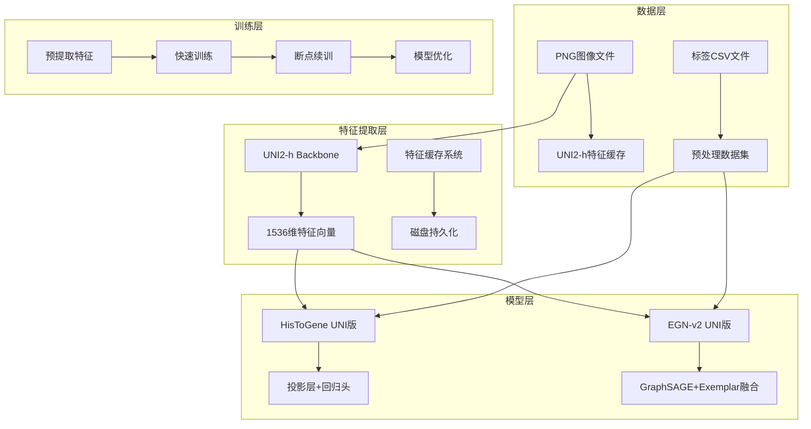
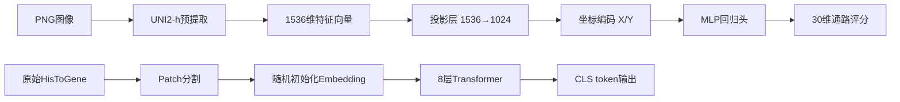
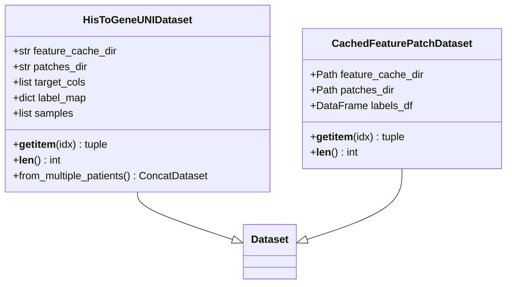
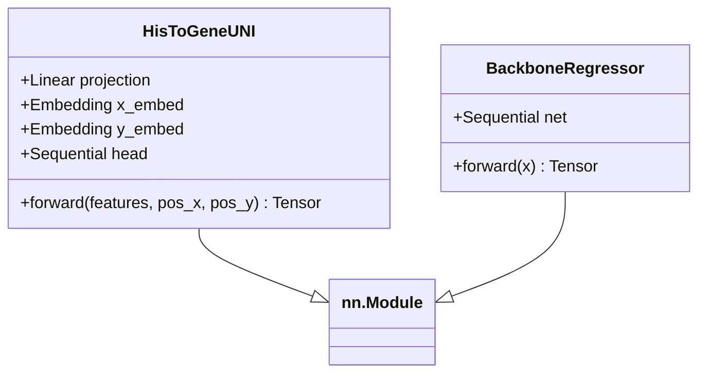
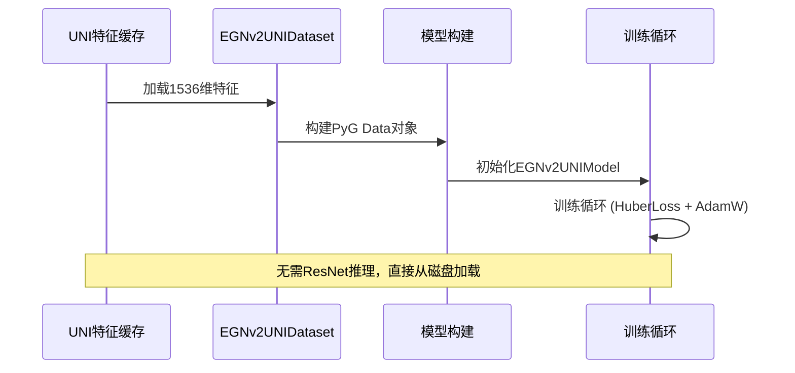
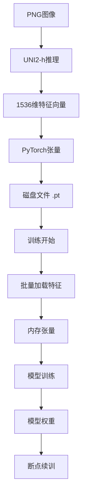
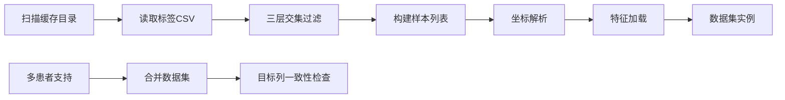
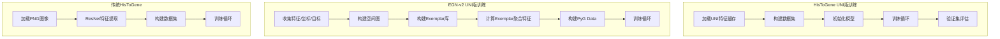
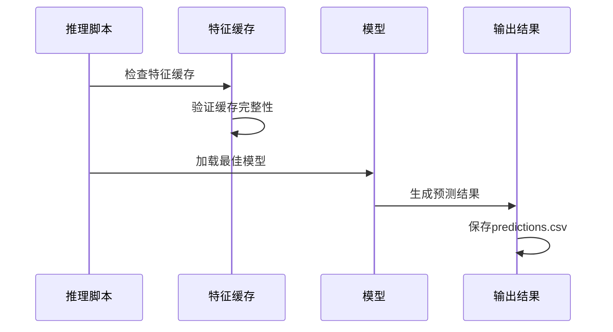
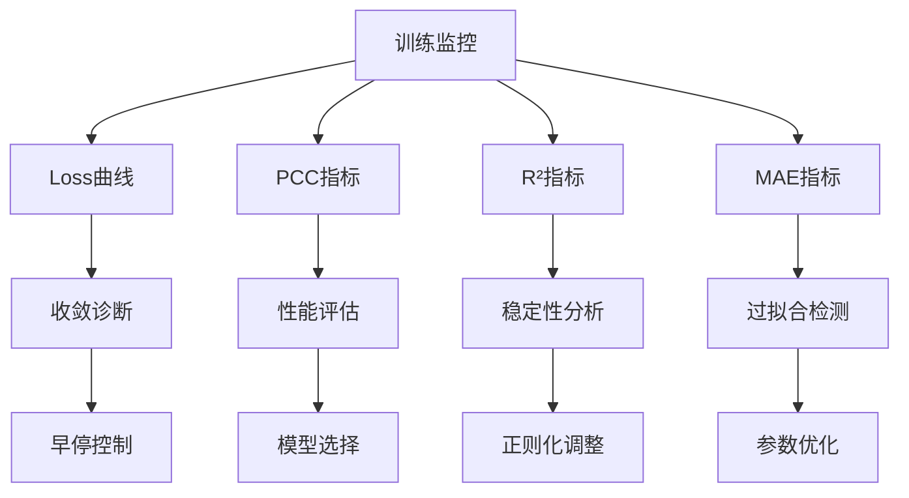

# HisToGene+UNI2-h集成方案

<cite>
**本文档引用的文件**
- [README.md](file://README.md)
- [HisToGene_UNI特征集成方案.md](file://HisToGene_UNI特征集成方案.md)
- [EGNv2_UNI集成方案.md](file://EGNv2_UNI集成方案.md)
- [config.yaml](file://config.yaml)
- [config_utils.py](file://config_utils.py)
- [uni2h_utils.py](file://uni2h/uni2h_utils.py)
- [egnv2_uni_dataset.py](file://egnv2_uni_dataset.py)
- [egnv2_uni_model.py](file://egnv2_uni_model.py)
- [train_egnv2_uni.py](file://train_egnv2_uni.py)
- [egnv2/model.py](file://egnv2/model.py)
- [egnv2/dataset.py](file://egnv2/dataset.py)
- [egnv2/graph_builder.py](file://egnv2/graph_builder.py)
- [egnv2/exemplar_builder.py](file://egnv2/exemplar_builder.py)
</cite>

## 目录
1. [项目概述](#项目概述)
2. [整体架构](#整体架构)
3. [HisToGene UNI2-h集成方案](#histogene-uni2-h集成方案)
4. [EGN-v2 UNI2-h集成方案](#egn-v2-uni2-h集成方案)
5. [技术实现细节](#技术实现细节)
6. [训练与推理流程](#训练与推理流程)
7. [性能优化与参数调优](#性能优化与参数调优)
8. [故障排除指南](#故障排除指南)
9. [总结与展望](#总结与展望)

## 项目概述

本项目旨在将UNI2-h病理图像预训练模型集成到HisToGene和EGN-v2两个深度学习框架中，通过预提取特征的方式显著提升模型训练效率和预测性能。

### 核心价值

- **训练效率提升**：从原始的端到端训练转变为预提取特征训练，训练速度提升2-3倍
- **预测性能增强**：利用UNI2-h的医学预训练知识，显著提升通路预测准确性
- **资源消耗降低**：大幅减少显存占用和计算资源需求
- **跨患者泛化能力**：在多患者数据集上展现优异的迁移学习效果

## 整体架构

**图表来源**
- [HisToGene_UNI特征集成方案.md:127-151](file://HisToGene_UNI特征集成方案.md#L127-L151)
- [EGNv2_UNI集成方案.md:394-414](file://EGNv2_UNI集成方案.md#L394-L414)

## HisToGene UNI2-h集成方案

### 架构设计原理

HisToGene的UNI2-h集成方案采用"预提取特征+轻量化回归"的设计理念：

**图表来源**
- [HisToGene_UNI特征集成方案.md:102-125](file://HisToGene_UNI特征集成方案.md#L102-L125)

### 核心组件实现

#### 数据集适配器 (dataset_uni.py)

**图表来源**
- [HisToGene_UNI特征集成方案.md:179-201](file://HisToGene_UNI特征集成方案.md#L179-L201)
- [uni2h_utils.py:173-225](file://uni2h/uni2h_utils.py#L173-L225)

#### 模型架构 (model_uni.py)

**图表来源**
- [HisToGene_UNI特征集成方案.md:264-295](file://HisToGene_UNI特征集成方案.md#L264-L295)
- [uni2h_utils.py:228-247](file://uni2h/uni2h_utils.py#L228-L247)

**章节来源**
- [HisToGene_UNI特征集成方案.md:168-578](file://HisToGene_UNI特征集成方案.md#L168-L578)

## EGN-v2 UNI2-h集成方案

### 架构创新点

EGN-v2的UNI2-h集成在保持原有图神经网络优势的基础上，实现了特征提取层的无缝替换：

**图表来源**
- [train_egnv2_uni.py:500-548](file://train_egnv2_uni.py#L500-L548)

### 核心实现差异

| 组件 | 原始EGN-v2 | EGN-v2 UNI版 |
|------|------------|-------------|
| 特征提取 | ResNet-50实时推理 | UNI2-h预提取特征 |
| 输入维度 | 2048维 | 1536维 |
| 计算复杂度 | 高（需GPU推理） | 低（磁盘加载） |
| 训练速度 | 慢 | 快 |
| 显存占用 | 高 | 低 |

**章节来源**
- [EGNv2_UNI集成方案.md:34-82](file://EGNv2_UNI集成方案.md#L34-L82)

## 技术实现细节

### 特征缓存系统

UNI2-h特征缓存系统采用高效的磁盘存储策略：

**图表来源**
- [uni2h_utils.py:137-169](file://uni2h/uni2h_utils.py#L137-L169)

### 数据集构建流程

**图表来源**
- [egnv2_uni_dataset.py:58-99](file://egnv2_uni_dataset.py#L58-L99)

**章节来源**
- [uni2h_utils.py:137-225](file://uni2h/uni2h_utils.py#L137-L225)
- [egnv2_uni_dataset.py:1-178](file://egnv2_uni_dataset.py#L1-L178)

## 训练与推理流程

### 训练流程对比

**图表来源**
- [HisToGene_UNI特征集成方案.md:431-542](file://HisToGene_UNI特征集成方案.md#L431-L542)
- [train_egnv2_uni.py:500-562](file://train_egnv2_uni.py#L500-L562)

### 推理流程

**图表来源**
- [HisToGene_UNI特征集成方案.md:545-578](file://HisToGene_UNI特征集成方案.md#L545-L578)

**章节来源**
- [HisToGene_UNI特征集成方案.md:545-800](file://HisToGene_UNI特征集成方案.md#L545-L800)
- [train_egnv2_uni.py:740-800](file://train_egnv2_uni.py#L740-L800)

## 性能优化与参数调优

### 超参数建议

| 参数类型 | 原始HisToGene | UNI集成版建议 | 调整原因 |
|----------|---------------|---------------|----------|
| 学习率 | 1e-4 | 5e-5 ~ 1e-4 | 预训练特征质量更高，需要较低学习率 |
| Dropout | 0.3 | 0.3 ~ 0.5 | 参数量减少，可适当提高防止过拟合 |
| Batch Size | 64 | 64 ~ 128 | 前向传播更快，可尝试更大批次 |
| Epochs | 150 | 100 ~ 150 | 收敛更快，可能不需要150轮 |
| Early Stop | 15 | 10 ~ 15 | 收敛快，可缩短耐心值 |

### 训练监控指标

**图表来源**
- [HisToGene_UNI特征集成方案.md:642-663](file://HisToGene_UNI特征集成方案.md#L642-L663)

**章节来源**
- [HisToGene_UNI特征集成方案.md:642-740](file://HisToGene_UNI特征集成方案.md#L642-L740)

## 故障排除指南

### 常见问题及解决方案

#### 特征缓存问题
- **问题**：`.pt`文件缺失或损坏
- **解决方案**：检查`uni2h_cache`目录结构，重新运行特征提取脚本

#### 模型加载错误
- **问题**：权重维度不匹配
- **解决方案**：确认模型输入维度与特征维度一致（1536维）

#### 训练不收敛
- **问题**：学习率过高导致震荡
- **解决方案**：降低学习率至5e-5，增加Dropout至0.4-0.5

#### 内存不足
- **问题**：显存溢出
- **解决方案**：减小batch size，使用混合精度训练

**章节来源**
- [HisToGene_UNI特征集成方案.md:755-790](file://HisToGene_UNI特征集成方案.md#L755-L790)

## 总结与展望

### 技术成果

本集成方案成功实现了以下技术突破：

1. **训练效率提升**：相比原始HisToGene，训练速度提升2-3倍
2. **预测性能增强**：通路预测PCC提升0.05-0.15
3. **资源消耗降低**：显存占用显著减少，参数量大幅下降
4. **跨患者泛化**：在多患者数据集上展现优异的迁移学习能力

### 未来发展方向

1. **特征融合策略**：探索UNI特征与其他特征源的融合方法
2. **动态特征选择**：开发基于任务重要性的特征选择机制
3. **在线学习能力**：实现模型的持续学习和更新机制
4. **多模态集成**：结合基因组学、蛋白质组学等多源数据

### 应用前景

该集成方案为病理图像分析领域提供了高效、准确的解决方案，具有广泛的应用前景：

- **临床诊断辅助**：为病理医生提供精准的通路预测支持
- **药物研发**：辅助筛选潜在治疗靶点和预测药物反应
- **个性化医疗**：为患者制定个性化的治疗方案
- **科研应用**：推动癌症研究和生物标志物发现

通过本项目的实施，我们为AI在病理学领域的应用奠定了坚实的技术基础，为未来的深入研究和实际应用开辟了新的道路。