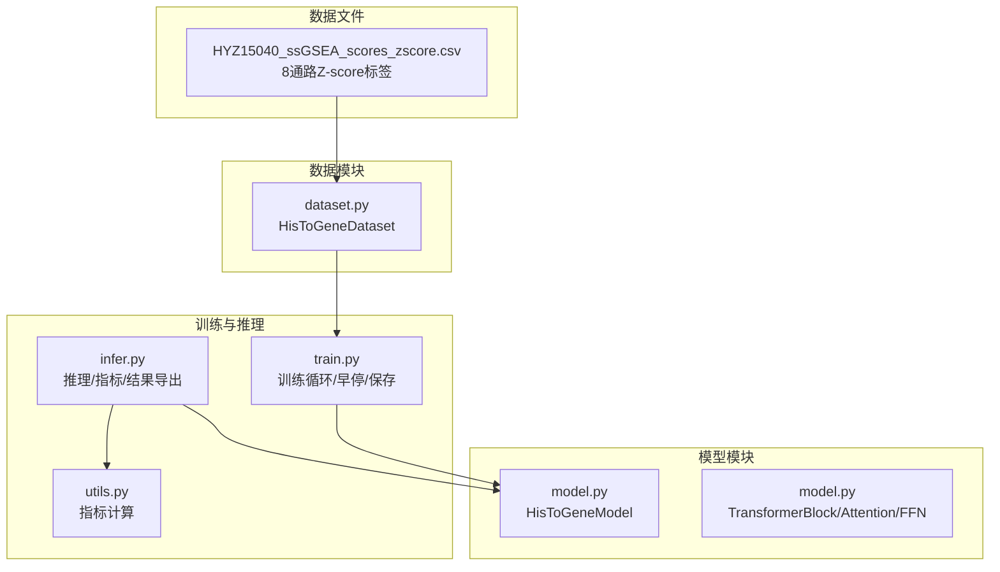
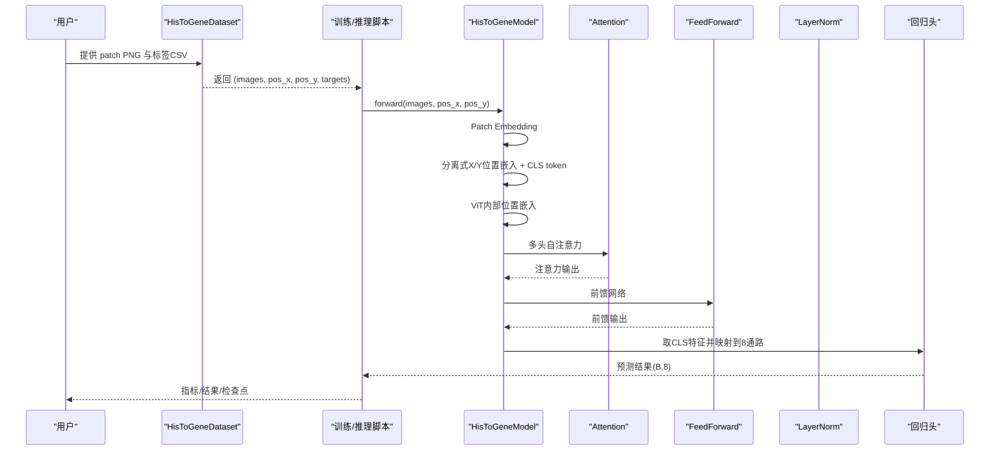
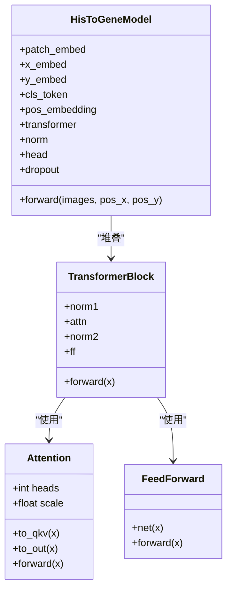
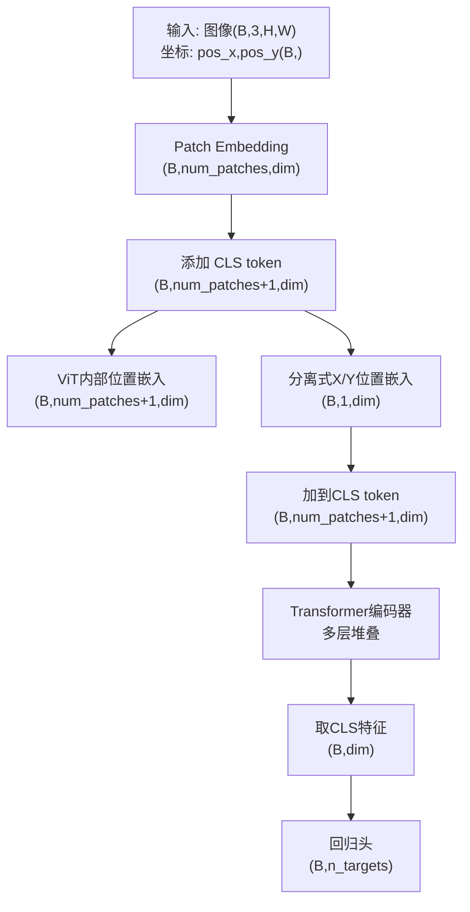
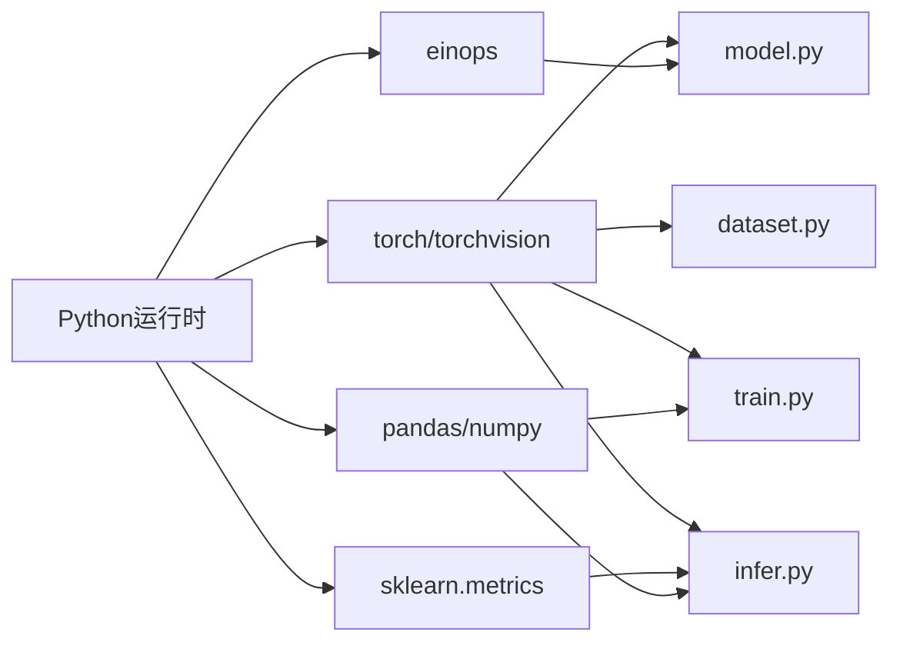

# HisToGene模型架构

<cite>
**本文档引用的文件**
- [model.py](file://histogene/model.py)
- [dataset.py](file://histogene/dataset.py)
- [train.py](file://histogene/train.py)
- [infer.py](file://histogene/infer.py)
- [utils.py](file://histogene/utils.py)
- [README.md](file://README.md)
- [HisToGene应用规划.md](file://HisToGene应用规划.md)
- [HYZ15040_ssGSEA_scores_zscore.csv](file://HYZ15040_ssGSEA_scores_zscore.csv)
</cite>

## 目录
1. [简介](#简介)
2. [项目结构](#项目结构)
3. [核心组件](#核心组件)
4. [架构总览](#架构总览)
5. [详细组件分析](#详细组件分析)
6. [依赖关系分析](#依赖关系分析)
7. [性能考量](#性能考量)
8. [故障排查指南](#故障排查指南)
9. [结论](#结论)
10. [附录](#附录)

## 简介
本文件系统化梳理 HisToGene 模型在 PFMval 项目中的端到端学习架构与实现细节。模型面向空间转录组学任务，以 224×224 RGB patch 为输入，结合其在组织切片中的空间坐标 (x, y)，预测 8 个通路的 ssGSEA 评分。模型采用 Vision Transformer 编码器，引入分离式 X/Y 位置嵌入与 CLS token，融合空间位置信息；回归头将最终特征映射到 8 通路评分。本文档提供架构图、层连接关系、输入输出规范、参数配置与训练策略，并给出可视化与排障建议。

## 项目结构
- histogene/
  - model.py：模型定义（Attention、FeedForward、TransformerBlock、HisToGeneModel）
  - dataset.py：数据集适配器（解析文件名坐标、归一化、返回图像、坐标、标签）
  - train.py：训练脚本（数据加载、训练循环、早停、保存检查点）
  - infer.py：推理脚本（加载检查点、批量推理、指标计算与结果导出）
  - utils.py：指标计算工具（MSE、MAE、R²、PCC）
- 数据与配置
  - HYZ15040_ssGSEA_scores_zscore.csv：8 通路 Z-score 标签
  - README.md：环境与基本使用说明
  - HisToGene应用规划.md：模型背景、适配方案与参数建议

图表来源
- [model.py:64-160](file://histogene/model.py#L64-L160)
- [dataset.py:23-118](file://histogene/dataset.py#L23-L118)
- [train.py:174-338](file://histogene/train.py#L174-L338)
- [infer.py:66-169](file://histogene/infer.py#L66-L169)
- [utils.py:1-31](file://histogene/utils.py#L1-L31)

章节来源
- [model.py:1-160](file://histogene/model.py#L1-L160)
- [dataset.py:1-118](file://histogene/dataset.py#L1-L118)
- [train.py:1-338](file://histogene/train.py#L1-L338)
- [infer.py:1-169](file://histogene/infer.py#L1-L169)
- [utils.py:1-31](file://histogene/utils.py#L1-L31)
- [README.md:1-44](file://README.md#L1-L44)
- [HisToGene应用规划.md:1-1092](file://HisToGene应用规划.md#L1-L1092)

## 核心组件
- Patch Embedding 层：将 224×224×3 图像切分为 16×16 的 patches，展平后线性映射至特征维度，随后进行 LayerNorm 与 Dropout。
- 多头自注意力（Attention）：实现 QKV 分离、缩放点积注意力、多头拼接与线性输出。
- 前馈网络（FeedForward）：两层线性 + GELU + Dropout。
- Transformer 编码器块（TransformerBlock）：LN → Attention → 残差；LN → FFN → 残差。
- 位置编码：
  - 分离式 X/Y 嵌入：使用独立 Embedding 将坐标映射为位置向量，加到 CLS token 上。
  - ViT 内部位置嵌入：为 patch 序列添加绝对位置信息。
- CLS token：在序列首位插入，最终特征取其对应输出参与回归。
- 回归头：LN → Linear(GELU) → Dropout → Linear(输出 8 通路)。

章节来源
- [model.py:12-61](file://histogene/model.py#L12-L61)
- [model.py:64-160](file://histogene/model.py#L64-L160)

## 架构总览
下图展示 HisToGene 的端到端流程：图像分块、位置编码融合、ViT 编码、CLS token 取特征、回归头输出 8 通路评分。

图表来源
- [model.py:122-159](file://histogene/model.py#L122-L159)
- [dataset.py:100-118](file://histogene/dataset.py#L100-L118)
- [train.py:106-144](file://histogene/train.py#L106-L144)
- [infer.py:52-63](file://histogene/infer.py#L52-L63)

## 详细组件分析

### Vision Transformer 编码器设计
- 设计理念
  - 采用标准 ViT 架构，将图像视为"序列"，通过多头自注意力捕获全局上下文。
  - 为保留空间结构信息，引入两类位置编码：分离式 X/Y 嵌入（融合到 CLS token）与 ViT 内部绝对位置嵌入（融合到 patch 序列）。
- 关键实现要点
  - Patch Embedding：将图像切分为固定大小的 patches，线性映射到特征维度，再做 LayerNorm。
  - 分离式 X/Y 位置嵌入：将坐标映射到嵌入空间，分别得到 x_pos 与 y_pos，加到 CLS token 的特征上，使模型在序列首部就融合了空间位置信息。
  - ViT 内部位置嵌入：为每个 patch 添加绝对位置向量，保证序列顺序的可区分性。
  - CLS token：在序列首位插入可学习参数，最终输出取其对应特征，便于下游回归。
  - Transformer 块：LN → Attention → 残差；LN → FFN → 残差，堆叠 depth 层。

图表来源
- [model.py:12-61](file://histogene/model.py#L12-L61)
- [model.py:64-160](file://histogene/model.py#L64-L160)

章节来源
- [model.py:12-61](file://histogene/model.py#L12-L61)
- [model.py:64-160](file://histogene/model.py#L64-L160)

### Patch Embedding 层
- 输入：(B, 3, img_size, img_size)
- 处理：将图像按 patch_size 切分，展平为 (B, num_patches, patch_dim)，其中 patch_dim = in_channels × patch_size × patch_size。
- 映射：线性层将 patch 维度映射到模型维度 dim，并进行 LayerNorm。
- 输出：(B, num_patches, dim)

章节来源
- [model.py:86-91](file://histogene/model.py#L86-L91)
- [model.py:122-131](file://histogene/model.py#L122-L131)

### 多头自注意力机制
- 结构：QKV 分离、缩放点积、softmax 得到注意力权重，加权聚合 V，多头拼接，线性输出。
- 规模控制：scale = dim_head^{-0.5}，防止点积过大导致 softmax 梯度消失。
- 实现细节：使用 einops.rearrange 进行多头重塑与拼接，确保张量维度正确。

章节来源
- [model.py:12-30](file://histogene/model.py#L12-L30)

### Transformer 编码器块
- 组合方式：LN → Attention → 残差；LN → FFN → 残差。
- FFN 结构：Linear(GELU) + Dropout + Linear + Dropout。
- 残差连接：有助于梯度流动与稳定性。

章节来源
- [model.py:49-61](file://histogene/model.py#L49-L61)
- [model.py:33-46](file://histogene/model.py#L33-L46)

### 位置编码与 CLS token 融合
- 分离式 X/Y 位置嵌入
  - 将 pos_x 与 pos_y 通过独立 Embedding 映射为 (B, 1, dim)。
  - 将 x_pos 与 y_pos 加到 CLS token 的特征上，使序列首部携带空间位置信息。
- ViT 内部位置嵌入
  - 为 patch 序列添加绝对位置向量，尺寸为 (1, num_patches+1, dim)。
- CLS token
  - 在序列首位插入可学习参数，最终取其对应特征参与回归。

图表来源
- [model.py:133-159](file://histogene/model.py#L133-L159)

章节来源
- [model.py:93-101](file://histogene/model.py#L93-L101)
- [model.py:133-146](file://histogene/model.py#L133-L146)
- [model.py:154-158](file://histogene/model.py#L154-L158)

### 回归头设计
- 结构：LayerNorm → Linear(GELU) → Dropout → Linear(n_targets)。
- 输出：(B, n_targets)，n_targets=8，对应 8 个通路评分。
- 采用 Huber Loss 作为损失函数，兼顾鲁棒性与平滑性。

章节来源
- [model.py:111-118](file://histogene/model.py#L111-L118)
- [train.py:250](file://histogene/train.py#L250)

### 数据集与坐标处理
- 文件名解析：从 patch_xXXXX_yYYYY.png 中提取 x 与 y。
- 坐标归一化：将 x/y 映射到 [0, n_pos-1]，用于 Embedding 查找。
- 标签：使用 HYZ15040_ssGSEA_scores_zscore.csv，取最后 8 列作为目标。

章节来源
- [dataset.py:15-20](file://histogene/dataset.py#L15-L20)
- [dataset.py:89-95](file://histogene/dataset.py#L89-L95)
- [dataset.py:100-118](file://histogene/dataset.py#L100-L118)
- [HYZ15040_ssGSEA_scores_zscore.csv:1](file://HYZ15040_ssGSEA_scores_zscore.csv#L1)

## 依赖关系分析
- 模型依赖
  - torch.nn：线性层、LayerNorm、Dropout、Embedding。
  - einops：张量重排（多头重塑与拼接）。
- 训练/推理依赖
  - torch.utils.data：DataLoader。
  - torchvision.transforms：图像变换（Resize、ToTensor、Normalize）。
  - sklearn.metrics：MSE、MAE、R²。
  - pandas/numpy：指标汇总与 CSV 导出。
- 数据依赖
  - HYZ15040_ssGSEA_scores_zscore.csv：8 通路 Z-score 标签。
  - Patch PNG：训练/验证/推理目录下的图像文件。

图表来源
- [model.py:7-9](file://histogene/model.py#L7-L9)
- [train.py:14-16](file://histogene/train.py#L14-L16)
- [infer.py:11-14](file://histogene/infer.py#L11-L14)
- [utils.py:2-4](file://histogene/utils.py#L2-L4)

章节来源
- [model.py:7-9](file://histogene/model.py#L7-L9)
- [train.py:14-16](file://histogene/train.py#L14-L16)
- [infer.py:11-14](file://histogene/infer.py#L11-L14)
- [utils.py:2-4](file://histogene/utils.py#L2-L4)

## 性能考量
- 模型规模与内存
  - 参数量受 dim、depth、heads、mlp_dim 等影响，可通过减少 depth 或 dim 降低显存占用。
- 训练稳定性
  - 使用 LayerNorm、残差连接与 Dropout 提升收敛稳定性。
  - Huber Loss 对异常值更鲁棒，适合非正态分布的 ssGSEA 评分。
- 数据增强
  - 在保证病理图像语义的前提下，适度随机翻转与旋转可提升泛化能力。
- 混合精度
  - 启用 autocast 与 GradScaler 可显著节省显存并加速训练（CUDA 可用时）。

## 故障排查指南
- 训练报错：CUDA OOM
  - 降低 batch_size 或使用混合精度；检查是否启用了 AMP。
- 数据加载错误：找不到文件或标签
  - 确认 patches_dir 与 labels_csv 路径正确；检查文件名是否符合 patch_x*_y*.* 格式。
- 指标异常
  - 检查标签是否为 Z-score 标准化；确认 n_targets 与 CSV 列数一致。
- 推理结果为空
  - 确认 checkpoint 路径有效；检查 target_cols 与 CSV 列名匹配。

章节来源
- [train.py:174-188](file://histogene/train.py#L174-L188)
- [infer.py:69-75](file://histogene/infer.py#L69-L75)
- [utils.py:20-31](file://histogene/utils.py#L20-L31)

## 结论
HisToGene 在 PFMval 项目中以端到端的方式实现了"图像 + 空间坐标"的联合建模，通过分离式 X/Y 位置嵌入与 CLS token 的巧妙设计，将空间位置信息融入 ViT 编码器，最终回归到 8 通路 ssGSEA 评分。模型结构清晰、易于扩展，配合 Huber Loss、早停与混合精度策略，可在有限数据条件下获得稳健的性能。建议在实际部署中根据硬件资源调整模型规模，并持续监控指标以优化训练策略。

## 附录

### 输入输出规格
- 输入
  - images：(B, 3, img_size, img_size)，RGB 图像
  - pos_x：(B,)，x 坐标（long）
  - pos_y：(B,)，y 坐标（long）
- 输出
  - predictions：(B, n_targets)，8 通路评分

章节来源
- [model.py:68-75](file://histogene/model.py#L68-L75)
- [model.py:122-159](file://histogene/model.py#L122-L159)

### 参数配置与训练策略
- 模型超参
  - img_size=224，patch_size=16，in_channels=3，dim=1024，depth=8，heads=16，mlp_dim=2048，n_pos=128，n_targets=8，dropout=0.3
- 训练超参
  - batch_size=64，num_epochs=150，lr=1e-4，weight_decay=1e-4，early_stop_patience=15，AMP 可选
- 优化器与调度
  - AdamW（带权重衰减），ReduceLROnPlateau 调度
- 损失函数
  - Huber Loss（delta=1.0）

章节来源
- [model.py:76-78](file://histogene/model.py#L76-L78)
- [train.py:57-80](file://histogene/train.py#L57-L80)
- [train.py:249-254](file://histogene/train.py#L249-L254)

### 数据准备与使用
- 数据划分
  - 使用 split.py 按空间距离划分 train_patches 与 val_patches，避免空间重叠
- 标签处理
  - 使用 zscore.py 对 ssGSEA 评分进行 Z-score 标准化
- 数据加载
  - HisToGeneDataset 自动解析文件名坐标并归一化到 [0, n_pos-1]

章节来源
- [README.md:4-8](file://README.md#L4-L8)
- [HisToGene应用规划.md:190-246](file://HisToGene应用规划.md#L190-L246)
- [dataset.py:15-20](file://histogene/dataset.py#L15-L20)
- [dataset.py:89-95](file://histogene/dataset.py#L89-L95)