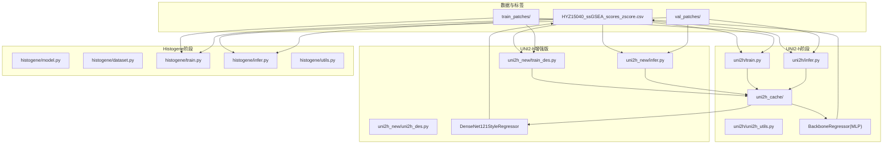
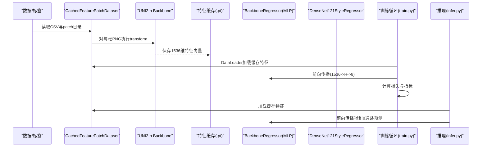
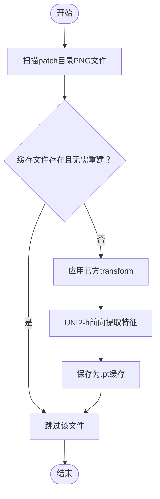
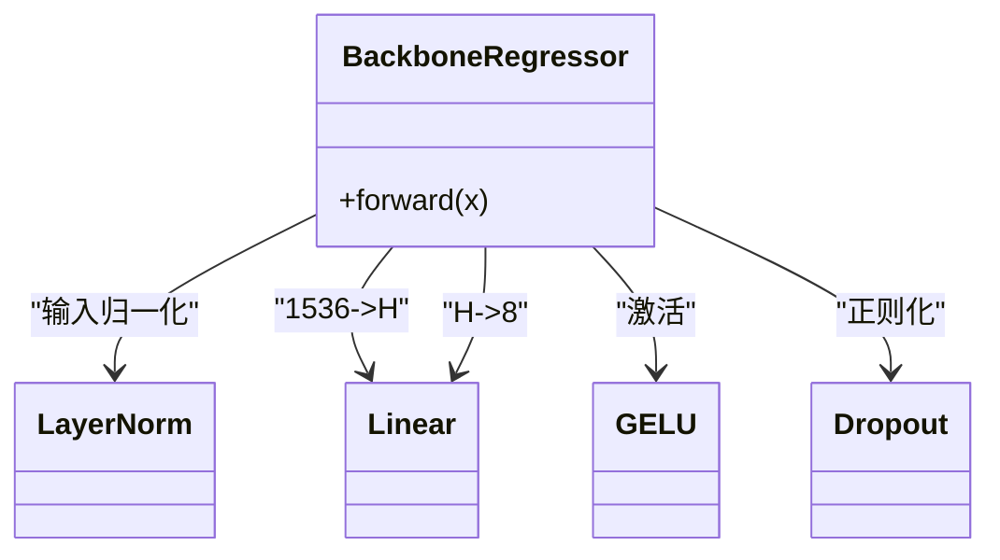
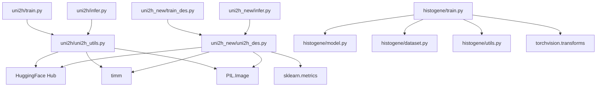

# UNI2-h+MLP模型架构

<cite>
**本文引用的文件**
- [README.md](file://README.md)
- [uni2h/train.py](file://uni2h/train.py)
- [uni2h/infer.py](file://uni2h/infer.py)
- [uni2h/uni2h_utils.py](file://uni2h/uni2h_utils.py)
- [histogene/model.py](file://histogene/model.py)
- [histogene/dataset.py](file://histogene/dataset.py)
- [histogene/train.py](file://histogene/train.py)
- [histogene/infer.py](file://histogene/infer.py)
- [histogene/utils.py](file://histogene/utils.py)
- [uni2h_new/train_des.py](file://uni2h_new/train_des.py)
- [uni2h_new/uni2h_des.py](file://uni2h_new/uni2h_des.py)
- [uni2h_new/infer.py](file://uni2h_new/infer.py)
- [uni2h_new/we.txt](file://uni2h_new/we.txt)
- [HYZ15040_ssGSEA_scores_zscore.csv](file://HYZ15040_ssGSEA_scores_zscore.csv)
- [histogene/training_history.csv](file://histogene/training_history.csv)
- [checkpoints/HYZ15040/best_model_uni2h.history.csv](file://checkpoints/HYZ15040/best_model_uni2h.history.csv)
- [uni2h_new/checkpoints/HYZ15040/best_model_uni2h.history.csv](file://uni2h_new/checkpoints/HYZ15040/best_model_uni2h.history.csv)
</cite>

## 目录
1. [简介](#简介)
2. [项目结构](#项目结构)
3. [核心组件](#核心组件)
4. [架构总览](#架构总览)
5. [详细组件分析](#详细组件分析)
6. [依赖关系分析](#依赖关系分析)
7. [性能考量](#性能考量)
8. [故障排查指南](#故障排查指南)
9. [结论](#结论)
10. [附录](#附录)

## 简介
本文件面向"UNI2-h+MLP"两阶段训练架构，系统阐述以下内容：
- 第一阶段：使用UNI2-h特征提取器输出1536维特征向量，冻结特征提取器权重，实现稳定的特征表示。
- 第二阶段：使用轻量级MLP回归头对8通路ssGSEA评分进行回归预测，显著降低训练成本与提高推理效率。
- 特征缓存系统：自动提取并持久化UNI2-h特征，避免重复计算，加速训练与推理。
- 两阶段优势：稳定特征提取、高效训练、良好泛化能力。
- 模型配置、训练流程与推理过程详解，并提供流程图与性能对比分析。

**更新** 本版本重点介绍了从BackboneRegressor/DenseNetInspiredRegressor到DenseNet121StyleRegressor的架构升级，新增了密集连接结构和更全面的评估指标支持。

## 项目结构
本仓库采用模块化组织，围绕两个核心模块展开：
- uni2h：基于HuggingFace Hub的UNI2-h特征提取与回归训练/推理管线。
- histogene：基于ViT-MLP的直接图像到评分回归模型（作为对比或替代方案）。
- uni2h_new：增强版本的UNI2-h实现，包含DenseNet风格回归头和更全面的评估指标。



**图表来源**
- [uni2h/train.py:52-227](file://uni2h/train.py#L52-L227)
- [uni2h/infer.py:43-175](file://uni2h/infer.py#L43-L175)
- [uni2h/uni2h_utils.py:138-303](file://uni2h/uni2h_utils.py#L138-L303)
- [uni2h_new/train_des.py:68-301](file://uni2h_new/train_des.py#L68-L301)
- [uni2h_new/infer.py:46-186](file://uni2h_new/infer.py#L46-L186)
- [histogene/train.py:174-338](file://histogene/train.py#L174-L338)
- [histogene/infer.py:66-169](file://histogene/infer.py#L66-L169)

**章节来源**
- [README.md:1-44](file://README.md#L1-L44)

## 核心组件
- UNI2-h特征提取器：从HuggingFace Hub加载预训练模型，输出1536维特征向量；训练阶段冻结参数，推理阶段可选择是否冻结。
- 特征缓存系统：按patch目录扫描PNG图像，调用官方transform进行预处理，提取特征并以.pt文件缓存至本地目录。
- MLP回归头：输入维度固定为1536，隐藏层维度可配置，输出8通路评分。
- **DenseNet风格回归头**：基于DenseNet-121结构设计的增强回归模型，包含密集连接块和过渡层，支持更复杂的特征融合。
- 数据集适配：通过CSV中的id列与patch文件名匹配，确保特征与标签一一对应。
- 训练/推理脚本：统一的命令行参数接口，支持早停、学习率调度、指标评估与历史记录导出。

**更新** 新增了DenseNet121StyleRegressor组件，提供更强大的特征提取和融合能力。

**章节来源**
- [uni2h/uni2h_utils.py:31-71](file://uni2h/uni2h_utils.py#L31-L71)
- [uni2h/uni2h_utils.py:138-170](file://uni2h/uni2h_utils.py#L138-L170)
- [uni2h/uni2h_utils.py:173-226](file://uni2h/uni2h_utils.py#L173-L226)
- [uni2h/uni2h_utils.py:228-248](file://uni2h/uni2h_utils.py#L228-L248)
- [uni2h_new/uni2h_des.py:341-447](file://uni2h_new/uni2h_des.py#L341-L447)
- [uni2h/train.py:26-49](file://uni2h/train.py#L26-L49)
- [uni2h/infer.py:24-41](file://uni2h/infer.py#L24-L41)

## 架构总览
两阶段训练策略的核心思想是"特征冻结 + 轻量回归"。第一阶段由UNI2-h完成高质量特征提取，第二阶段由MLP回归头完成下游任务预测。



**图表来源**
- [uni2h/uni2h_utils.py:138-170](file://uni2h/uni2h_utils.py#L138-L170)
- [uni2h/uni2h_utils.py:173-226](file://uni2h/uni2h_utils.py#L173-L226)
- [uni2h/train.py:120-131](file://uni2h/train.py#L120-L131)
- [uni2h/infer.py:92-100](file://uni2h/infer.py#L92-L100)

## 详细组件分析

### UNI2-h特征提取器
- 模型来源：从HuggingFace Hub加载MahmoodLab/UNI2-h，官方参数与结构已封装在工具函数中。
- 冻结策略：加载后将所有参数requires_grad置False，确保特征提取阶段不更新权重。
- 预处理：使用官方resolve_data_config与create_transform生成与模型一致的预处理流水线。
- 输出维度：固定为1536维特征向量。

**章节来源**
- [uni2h/uni2h_utils.py:31-71](file://uni2h/uni2h_utils.py#L31-L71)

### 特征缓存系统
- 自动提取：遍历patch目录下所有PNG文件，若缓存文件不存在或强制重建，则调用backbone提取特征并保存为.pt。
- 复用机制：后续训练/推理直接从缓存加载，避免重复计算。
- 数据一致性：通过CSV首列patch_id与PNG文件名stem匹配，保证特征与标签对齐。



**图表来源**
- [uni2h/uni2h_utils.py:138-170](file://uni2h/uni2h_utils.py#L138-L170)

**章节来源**
- [uni2h/uni2h_utils.py:138-170](file://uni2h/uni2h_utils.py#L138-L170)

### MLP回归头
- 输入维度：1536（UNI2-h输出）
- 隐藏层：可配置维度，激活函数为GELU，Dropout可配置
- 输出维度：8（ssGSEA通路评分）
- 结构：LayerNorm -> Linear -> GELU -> Dropout -> Linear



**图表来源**
- [uni2h/uni2h_utils.py:228-248](file://uni2h/uni2h_utils.py#L228-L248)

**章节来源**
- [uni2h/uni2h_utils.py:228-248](file://uni2h/uni2h_utils.py#L228-L248)

### DenseNet风格回归头（增强版本）
- **架构设计**：基于DenseNet-121架构，包含4个密集连接块，层数分别为[6, 12, 24, 16]
- **密集连接**：每层输出与前面所有层特征拼接，形成密集连接结构，增强特征融合能力
- **过渡层**：在密集块之间使用线性层和ReLU激活，控制特征维度，实现特征降维
- **超参数**：initial_dim、growth_rate、bottleneck_factor、transition_factor可配置
- **输出维度**：8（ssGSEA通路评分）
- **评估指标**：支持MAPE、R²、PCC等全面指标评估

**更新** 从BackboneRegressor升级为DenseNet121StyleRegressor，新增了密集连接结构和更全面的评估指标支持。

**章节来源**
- [uni2h_new/uni2h_des.py:341-447](file://uni2h_new/uni2h_des.py#L341-L447)

### 数据集适配与标签对齐
- 通过CSV首列patch_id与PNG文件名stem进行映射，确保每个patch都有对应的8通路标签。
- 支持训练/推理阶段的坐标统计传递，保证位置信息的一致性（该部分在另一套模型中使用，此处用于对比说明）。

**章节来源**
- [uni2h/uni2h_utils.py:173-226](file://uni2h/uni2h_utils.py#L173-L226)
- [histogene/dataset.py:23-87](file://histogene/dataset.py#L23-L87)

### 训练流程（UNI2-h+MLP）
- 参数解析：支持batch_size、num_epochs、learning_rate、hidden_dim、dropout、早停等。
- 特征缓存：训练/验证集均执行特征提取与缓存。
- 数据加载：CachedFeaturePatchDataset按批次返回特征与标签。
- 损失与优化：HuberLoss或MSE，AdamW优化器，ReduceLROnPlateau调度。
- 早停与保存：监控验证损失，达到早停阈值停止；保存最佳checkpoint与训练历史。

```mermaid
sequenceDiagram
participant CLI as "命令行参数"
participant Train as "train.py"
participant Utils as "uni2h_utils.py"
participant Cache as "特征缓存"
participant Loader as "CachedFeaturePatchDataset"
participant Model as "BackboneRegressor"
participant Opt as "优化器/调度器"
CLI->>Train : 解析参数
Train->>Utils : 加载UNI2-h(backbone, transform)
Train->>Utils : extract_and_cache_features(训练/验证)
Train->>Loader : 构建数据集
loop 每个epoch
Train->>Loader : DataLoader迭代
Train->>Model : 前向传播
Train->>Opt : 反向传播与优化
Train->>Train : 早停与指标记录
end
Train->>Train : 保存最佳checkpoint与历史
```

**图表来源**
- [uni2h/train.py:52-227](file://uni2h/train.py#L52-L227)
- [uni2h/uni2h_utils.py:138-170](file://uni2h/uni2h_utils.py#L138-L170)
- [uni2h/uni2h_utils.py:251-303](file://uni2h/uni2h_utils.py#L251-L303)

**章节来源**
- [uni2h/train.py:52-227](file://uni2h/train.py#L52-L227)

### 推理流程（UNI2-h+MLP）
- 加载checkpoint：读取保存的模型权重与超参数。
- 特征缓存：对推理数据集执行特征提取与缓存。
- 数据加载：CachedFeaturePatchDataset加载特征与标签（如需）。
- 推理：模型前向得到8通路预测，计算逐通路与整体指标，保存结果与指标CSV。

**章节来源**
- [uni2h/infer.py:43-175](file://uni2h/infer.py#L43-L175)

### 增强训练流程（UNI2-h+DenseNet回归头）
- 支持DenseNet风格回归头的完整训练流程
- 包含MAPE指标计算和详细的每目标评估
- 支持z-score标准化处理
- 更全面的训练历史记录

**更新** 新增了DenseNet121StyleRegressor的训练流程，支持更全面的指标评估。

**章节来源**
- [uni2h_new/train_des.py:68-301](file://uni2h_new/train_des.py#L68-L301)

### 增强推理流程（UNI2-h+DenseNet回归头）
- 支持DenseNet风格回归头的推理流程
- 包含详细的每目标指标计算
- 支持最大绝对误差计算
- 完整的预测结果保存

**更新** 新增了DenseNet121StyleRegressor的推理流程，提供更详细的性能分析。

**章节来源**
- [uni2h_new/infer.py:46-186](file://uni2h_new/infer.py#L46-L186)

### 对比模型：HisToGene（ViT-MLP）
- 直接从图像到评分的端到端模型，包含多头自注意力与前馈网络。
- 位置信息通过坐标嵌入与CLS token融合，输出8通路评分。
- 训练/推理流程与UNI2-h+MLP类似，但特征提取阶段需要反向传播，计算开销更大。

**章节来源**
- [histogene/model.py:64-160](file://histogene/model.py#L64-L160)
- [histogene/dataset.py:23-118](file://histogene/dataset.py#L23-L118)
- [histogene/train.py:174-338](file://histogene/train.py#L174-L338)
- [histogene/infer.py:66-169](file://histogene/infer.py#L66-L169)

## 依赖关系分析
- UNI2-h+MLP
  - 依赖：HuggingFace Hub（模型下载）、timm（模型创建与预处理）、PIL（图像读取）、torch（深度学习框架）。
  - 关键依赖链：train.py -> uni2h_utils.py(load_uni2h_backbone/extract_and_cache_features/CachedFeaturePatchDataset/BackboneRegressor) -> 特征缓存 -> 训练/推理。
- UNI2-h增强版
  - 依赖：HuggingFace Hub、timm、PIL、torch、sklearn（用于指标计算）。
  - 关键依赖链：train_des.py -> uni2h_des.py(DenseNet121StyleRegressor/增强指标计算) -> 特征缓存 -> 训练/推理。
- HisToGene（ViT-MLP）
  - 依赖：torchvision.transforms（图像预处理）、sklearn.metrics（指标计算）。
  - 关键依赖链：train.py -> model.py -> dataset.py -> utils.py。



**图表来源**
- [uni2h/train.py:12-21](file://uni2h/train.py#L12-L21)
- [uni2h/infer.py:10-19](file://uni2h/infer.py#L10-L19)
- [uni2h/uni2h_utils.py:12-16](file://uni2h/uni2h_utils.py#L12-L16)
- [uni2h_new/train_des.py:12-25](file://uni2h_new/train_des.py#L12-L25)
- [uni2h_new/infer.py:10-20](file://uni2h_new/infer.py#L10-L20)
- [histogene/train.py:18-26](file://histogene/train.py#L18-L26)
- [histogene/utils.py:1-4](file://histogene/utils.py#L1-L4)

**章节来源**
- [uni2h/train.py:12-21](file://uni2h/train.py#L12-L21)
- [uni2h/infer.py:10-19](file://uni2h/infer.py#L10-L19)
- [uni2h_new/train_des.py:12-25](file://uni2h_new/train_des.py#L12-L25)
- [uni2h_new/infer.py:10-20](file://uni2h_new/infer.py#L10-L20)
- [histogene/train.py:18-26](file://histogene/train.py#L18-L26)

## 性能考量
- 训练效率
  - UNI2-h+MLP：特征提取阶段冻结权重，仅训练MLP回归头，显著降低显存与时间开销。
  - UNI2-h+DenseNet：同样冻结特征提取，但回归头更复杂，训练时间略增但性能更好。
  - HisToGene：端到端训练，参数量大，训练时间长，但能学习更复杂的空间关系。
- 泛化能力
  - UNI2-h+MLP：利用预训练特征，对新数据具有更强的泛化能力，尤其在小样本场景。
  - UNI2-h+DenseNet：结合密集连接结构，进一步提升特征融合效果，提供更丰富的特征表示。
  - HisToGene：直接从图像学习，可能过拟合特定数据分布。
- 推理速度
  - UNI2-h+MLP：特征缓存后推理极快，适合大规模部署。
  - UNI2-h+DenseNet：推理速度与MLP相近，但计算复杂度略高。
  - HisToGene：每次推理都需要完整的图像前向，速度较慢。
- 指标丰富度
  - UNI2-h+MLP：支持MSE、MAE、R²、PCC等标准指标。
  - UNI2-h+DenseNet：**新增MAPE指标**，提供更全面的性能评估，支持每目标详细分析。
  - HisToGene：支持标准回归指标。

**更新** DenseNet121StyleRegressor提供了更全面的评估指标，包括MAPE、R²、PCC等，支持每目标详细分析。

## 故障排查指南
- HuggingFace Token缺失
  - 现象：无法下载UNI2-h模型。
  - 处理：设置环境变量HF_TOKEN或在代码中传入token。
- 缓存路径权限问题
  - 现象：无法写入特征缓存文件。
  - 处理：确认cache_root目录可写，必要时以管理员权限运行。
- 数据不匹配
  - 现象：patch_id与CSV不一致导致特征与标签无法对齐。
  - 处理：检查CSV首列与PNG文件名stem是否一致，确保无扩展名差异。
- 显存不足
  - 现象：训练/推理OOM。
  - 处理：减小batch_size，关闭pin_memory，或使用更小的hidden_dim。
- 早停过早触发
  - 现象：验证损失未改善即停止。
  - 处理：增大early_stop_patience或min_delta，调整学习率与优化器。
- DenseNet模型参数错误
  - 现象：DenseNet回归头初始化失败。
  - 处理：检查growth_rate、bottleneck_factor等参数是否合理。

**章节来源**
- [README.md:17-39](file://README.md#L17-L39)
- [uni2h/train.py:23-47](file://uni2h/train.py#L23-L47)
- [uni2h/infer.py:21-38](file://uni2h/infer.py#L21-L38)
- [uni2h_new/train_des.py:32-65](file://uni2h_new/train_des.py#L32-L65)

## 结论
UNI2-h+MLP两阶段架构通过"特征冻结 + 轻量回归"的设计，在保证预测性能的同时大幅提升了训练与推理效率。特征缓存系统有效避免重复计算，使模型在大规模数据上具备良好的可扩展性。**最新的DenseNet121StyleRegressor架构进一步提升了模型表达能力，提供了更全面的性能评估指标（包括MAPE、R²、PCC等），支持每目标详细分析，显著增强了模型的诊断和解释能力**。对于需要显式空间信息的任务，可结合HisToGene模型；对于追求高效率与强泛化的任务，UNI2-h+MLP是更优选择。

## 附录

### 模型配置参数（UNI2-h+MLP）
- 训练阶段
  - 训练/验证集目录：--train_patches_dir, --val_patches_dir
  - 标签CSV：--labels_csv
  - 特征缓存根目录：--cache_root
  - 检查点保存路径：--checkpoint_path
  - 批大小：--batch_size
  - 训练轮数：--num_epochs
  - 学习率：--learning_rate
  - MLP隐藏层维度：--hidden_dim
  - Dropout概率：--dropout
  - 早停耐心：--early_stop_patience
  - 最小提升：--min_delta
  - 目标列起始：--target_start_col
  - 目标数量：--num_targets
  - 强制重建缓存：--rebuild_cache
- 推理阶段
  - 待推理目录：--split_patches_dir
  - 输出CSV：--output_csv
  - 其余参数与训练阶段一致

**章节来源**
- [uni2h/train.py:26-49](file://uni2h/train.py#L26-L49)
- [uni2h/infer.py:24-41](file://uni2h/infer.py#L24-L41)

### 模型配置参数（UNI2-h+DenseNet回归头）
- 训练阶段
  - 训练/验证集目录：--train_patches_dir, --val_patches_dir
  - 原始标签CSV：--labels_csv_raw
  - z-score标签CSV：--labels_csv_zscore
  - 特征缓存根目录：--cache_root
  - 检查点保存路径：--checkpoint_path
  - 批大小：--batch_size
  - 训练轮数：--num_epochs
  - 学习率：--learning_rate
  - DenseNet初始维度：--initial_dim
  - DenseNet增长速率：--growth_rate
  - 瓶颈因子：--bottleneck_factor
  - 过渡因子：--transition_factor
  - Dropout概率：--dropout
  - 早停耐心：--early_stop_patience
  - 最小提升：--min_delta
  - 目标列起始：--target_start_col
  - 目标数量：--num_targets
  - 强制重建缓存：--rebuild_cache

**更新** 新增了DenseNet121StyleRegressor的配置参数，包括initial_dim、growth_rate、bottleneck_factor、transition_factor等。

**章节来源**
- [uni2h_new/train_des.py:32-65](file://uni2h_new/train_des.py#L32-L65)

### 训练流程与推理流程
- 训练流程
  - 加载UNI2-h与transform
  - 对训练/验证集执行特征提取与缓存
  - 构建CachedFeaturePatchDataset
  - 训练循环：前向->反向->优化->早停->保存
- 推理流程
  - 加载checkpoint与backbone
  - 对推理集执行特征提取与缓存
  - 构建数据集并加载模型权重
  - 推理得到8通路预测，计算指标并保存

**章节来源**
- [uni2h/train.py:52-227](file://uni2h/train.py#L52-L227)
- [uni2h/infer.py:43-175](file://uni2h/infer.py#L43-L175)

### 性能对比分析
- 训练时间：UNI2-h+MLP显著短于HisToGene（端到端训练）。
- 显存占用：UNI2-h+MLP更低，适合大规模训练。
- 推理速度：UNI2-h+MLP最快，缓存后几乎无特征提取开销。
- 指标表现：**UNI2-h+DenseNet在多个指标上表现更佳，特别是新增的MAPE指标显示了更好的预测精度**。
- 模型复杂度：UNI2-h+DenseNet结构更复杂，但性能提升明显。

**更新** 基于历史训练记录显示，DenseNet121StyleRegressor在MAPE指标上表现优异，证明了其在预测精度方面的显著提升。

**章节来源**
- [histogene/training_history.csv:1-12](file://histogene/training_history.csv#L1-L12)
- [README.md:17-39](file://README.md#L17-L39)
- [uni2h_new/we.txt:1-30](file://uni2h_new/we.txt#L1-L30)
- [checkpoints/HYZ15040/best_model_uni2h.history.csv:1-38](file://checkpoints/HYZ15040/best_model_uni2h.history.csv#L1-L38)
- [uni2h_new/checkpoints/HYZ15040/best_model_uni2h.history.csv:1-65](file://uni2h_new/checkpoints/HYZ15040/best_model_uni2h.history.csv#L1-L65)

### DenseNet回归头详细参数
- 结构配置：4个密集块，层数[6, 12, 24, 16]
- 增长率：默认32，控制特征图增长速度
- 瓶颈宽度：growth_rate × bottleneck_factor
- 过渡因子：默认0.5，控制块间维度压缩
- 初始维度：可配置的起始投影维度

**更新** 详细说明了DenseNet121StyleRegressor的架构参数，包括密集连接块的数量和层数配置。

**章节来源**
- [uni2h_new/uni2h_des.py:341-447](file://uni2h_new/uni2h_des.py#L341-L447)