# 模型架构系统

<cite>
**本文档引用的文件**
- [README.md](file://README.md)
- [HisToGene应用规划.md](file://HisToGene应用规划.md)
- [PFMval学习指南.md](file://PFMval学习指南.md)
- [histogene/model.py](file://histogene/model.py)
- [histogene/train.py](file://histogene/train.py)
- [histogene/dataset.py](file://histogene/dataset.py)
- [histogene/utils.py](file://histogene/utils.py)
- [uni2h/uni2h_utils.py](file://uni2h/uni2h_utils.py)
- [uni2h/train.py](file://uni2h/train.py)
- [uni2h/infer.py](file://uni2h/infer.py)
- [egnv1/model.py](file://egnv1/model.py)
- [egnv1/train.py](file://egnv1/train.py)
- [egnv1/dataset.py](file://egnv1/dataset.py)
- [egnv1/graph_builder.py](file://egnv1/graph_builder.py)
- [egnv1/exemplar_builder.py](file://egnv1/exemplar_builder.py)
- [egnv2/model.py](file://egnv2/model.py)
- [egnv2/train.py](file://egnv2/train.py)
- [egnv2/dataset.py](file://egnv2/dataset.py)
- [egnv2/graph_builder.py](file://egnv2/graph_builder.py)
- [egnv2/exemplar_builder.py](file://egnv2/exemplar_builder.py)
- [openmidnight/extract_openmidnight.py](file://openmidnight/extract_openmidnight.py)
- [openmidnight/train_openmidnight.py](file://openmidnight/train_openmidnight.py)
- [split.py](file://split.py)
- [zscore.py](file://zscore.py)
</cite>

## 更新摘要
**所做更改**
- 新增EGN-v1模型架构的完整技术文档
- 新增EGN-v2模型架构的详细分析
- 新增OpenMidnight/DINO-v2集成能力说明
- 更新模型架构对比分析章节
- 新增图神经网络训练流程详解
- 扩展特征提取与图构建模块分析

## 目录
1. [简介](#简介)
2. [项目结构](#项目结构)
3. [核心组件](#核心组件)
4. [架构概览](#架构概览)
5. [详细组件分析](#详细组件分析)
6. [依赖关系分析](#依赖关系分析)
7. [性能考量](#性能考量)
8. [故障排除指南](#故障排除指南)
9. [结论](#结论)
10. [附录](#附录)

## 简介

PFMval项目是一个面向空间转录病理研究的深度学习系统，专注于从组织学图像预测基因表达通路评分。该项目实现了四种主要的模型架构：HisToGene的端到端学习方式、UNI2-h+MLP的两阶段训练策略、EGN-v1的图神经网络架构以及EGN-v2的增强版本，同时集成了OpenMidnight/DINO-v2的特征提取能力。

该项目的核心目标是解决空间转录组学中的关键挑战：如何利用组织学图像的空间信息来预测基因表达模式，特别是在肿瘤组织中基因表达呈现明显空间异质性的背景下。通过引入图神经网络和预训练视觉模型，系统能够更好地捕捉空间依赖关系和深层语义特征。

## 项目结构

项目采用模块化设计，将不同的功能组件分离到独立的目录和文件中，形成了完整的深度学习生态系统：

```mermaid
graph TB
subgraph "项目根目录"
A[README.md]
B[split.py]
C[zscore.py]
D[HYZ15040_ssGSEA_scores.csv]
E[HYZ15040_ssGSEA_scores_zscore.csv]
end
subgraph "HisToGene模块"
F[histogene/]
F1[model.py]
F2[train.py]
F3[dataset.py]
F4[utils.py]
F5[infer.py]
end
subgraph "UNI2-h模块"
G[uni2h/]
G1[uni2h_utils.py]
G2[train.py]
G3[infer.py]
end
subgraph "EGN-v1模块"
H[egnv1/]
H1[model.py]
H2[train.py]
H3[dataset.py]
H4[graph_builder.py]
H5[exemplar_builder.py]
end
subgraph "EGN-v2模块"
I[egnv2/]
I1[model.py]
I2[train.py]
I3[dataset.py]
I4[graph_builder.py]
I5[exemplar_builder.py]
end
subgraph "OpenMidnight集成"
J[openmidnight/]
J1[extract_openmidnight.py]
J2[train_openmidnight.py]
end
subgraph "数据处理"
K[HYZ15040/]
K1[train_patches/]
K2[val_patches/]
end
A --> F
A --> G
A --> H
A --> I
A --> J
B --> K
C --> K
F --> K
G --> K
H --> K
I --> K
J --> K
```

**图表来源**
- [README.md:1-44](file://README.md#L1-L44)
- [PFMval学习指南.md:5-23](file://PFMval学习指南.md#L5-L23)

**章节来源**
- [README.md:1-44](file://README.md#L1-L44)
- [PFMval学习指南.md:3-23](file://PFMval学习指南.md#L3-L23)

## 核心组件

### 数据预处理管道

项目实现了完整的数据预处理管道，确保训练数据的质量和一致性：

1. **空间无重叠划分**：使用split.py确保训练集和验证集之间具有最小350px的空间距离
2. **Z-score标准化**：对8个基因集评分进行标准化处理
3. **Patch文件管理**：自动解析文件名中的坐标信息

### 模型架构对比

项目实现了四种截然不同的模型架构策略：

#### HisToGene架构
- **端到端学习**：直接从图像预测基因表达
- **空间位置编码**：显式地将坐标信息融入模型
- **完整ViT架构**：从头训练的Vision Transformer

#### UNI2-h+MLP架构  
- **两阶段训练**：预训练特征提取 + 轻量回归头
- **冻结特征提取器**：使用预训练的UNI2-h模型
- **迁移学习策略**：最大化利用预训练知识

#### EGN-v1架构
- **图神经网络**：基于ViT-Large特征的GCN架构
- **KNN图构建**：基于特征相似性的邻接关系
- **Exemplar融合**：代表库的语义增强机制

#### EGN-v2架构
- **增强版图神经网络**：基于ResNet-50特征的GraphSAGE架构
- **空间图构建**：基于坐标距离的邻接关系
- **改进的特征投影**：优化的维度匹配策略

**章节来源**
- [HisToGene应用规划.md:80-92](file://HisToGene应用规划.md#L80-L92)
- [PFMval学习指南.md:42-89](file://PFMval学习指南.md#L42-L89)

## 架构概览

### 整体系统架构

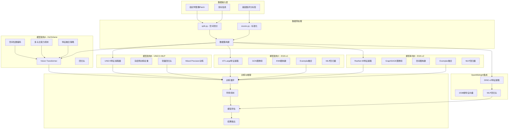

**图表来源**
- [PFMval学习指南.md:72-86](file://PFMval学习指南.md#L72-L86)
- [HisToGene应用规划.md:32-46](file://HisToGene应用规划.md#L32-L46)

### 数据流架构

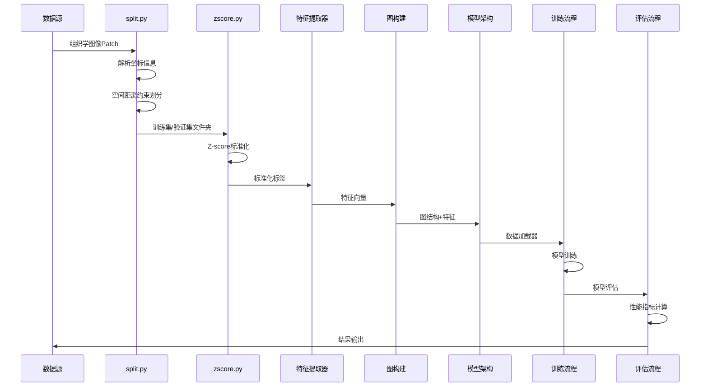

**图表来源**
- [PFMval学习指南.md:30-41](file://PFMval学习指南.md#L30-L41)
- [split.py:99-197](file://split.py#L99-L197)

**章节来源**
- [PFMval学习指南.md:72-89](file://PFMval学习指南.md#L72-L89)
- [HisToGene应用规划.md:32-46](file://HisToGene应用规划.md#L32-L46)

## 详细组件分析

### HisToGene模型架构

#### Vision Transformer核心组件

HisToGene采用了基于Vision Transformer的端到端学习架构，其核心设计理念是将空间位置信息显式地融入到视觉特征学习过程中。

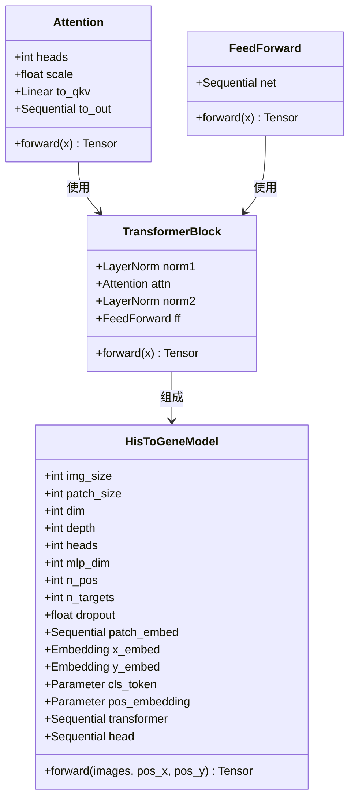

**图表来源**
- [histogene/model.py:12-61](file://histogene/model.py#L12-L61)
- [histogene/model.py:64-159](file://histogene/model.py#L64-L159)

#### 空间位置编码机制

HisToGene的核心创新在于其空间位置编码设计，该机制能够将图像的物理坐标信息融入到特征学习过程中：

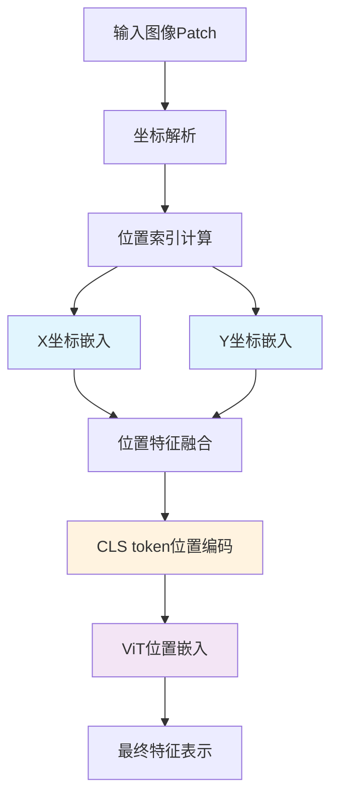

**图表来源**
- [histogene/model.py:94-146](file://histogene/model.py#L94-L146)
- [histogene/dataset.py:15-95](file://histogene/dataset.py#L15-L95)

#### 多头注意力机制

HisToGene实现了标准的多头自注意力机制，该机制能够捕获图像patch之间的复杂依赖关系：

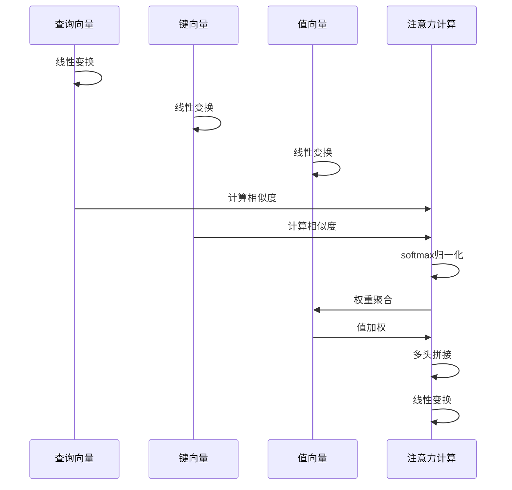

**图表来源**
- [histogene/model.py:22-30](file://histogene/model.py#L22-L30)

#### 特征融合策略

模型采用了多层次的特征融合策略，确保空间信息和视觉特征的有效整合：

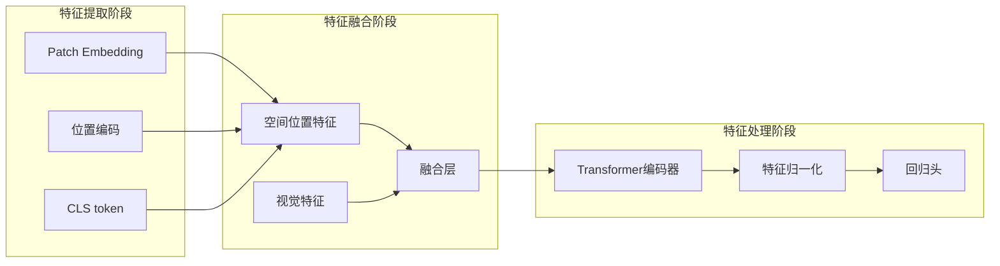

**图表来源**
- [histogene/model.py:122-159](file://histogene/model.py#L122-L159)

**章节来源**
- [histogene/model.py:12-159](file://histogene/model.py#L12-L159)
- [histogene/dataset.py:15-118](file://histogene/dataset.py#L15-L118)

### UNI2-h+MLP模型架构

#### 1536维特征提取能力

UNI2-h模型提供了强大的1536维特征表示能力，这是其能够在各种下游任务中表现出色的关键因素：

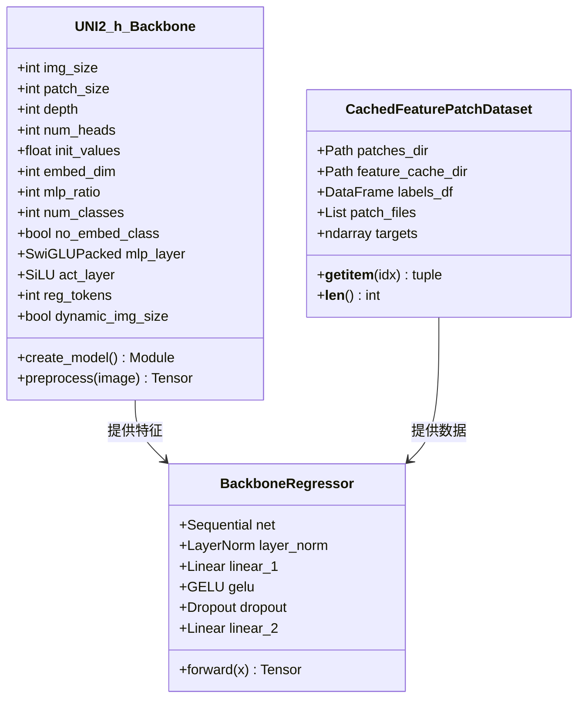

**图表来源**
- [uni2h/uni2h_utils.py:32-70](file://uni2h/uni2h_utils.py#L32-L70)
- [uni2h/uni2h_utils.py:228-247](file://uni2h/uni2h_utils.py#L228-L247)
- [uni2h/uni2h_utils.py:173-225](file://uni2h/uni2h_utils.py#L173-L225)

#### 特征缓存与加载机制

为了提高训练效率，UNI2-h+MLP架构实现了高效的特征缓存系统：

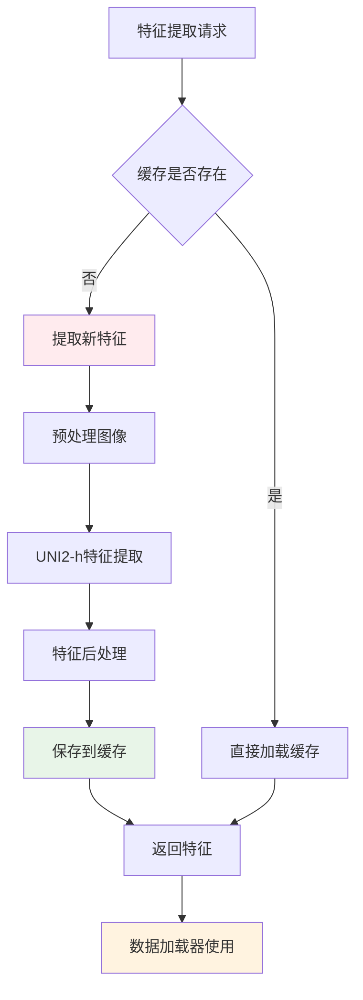

**图表来源**
- [uni2h/uni2h_utils.py:138-169](file://uni2h/uni2h_utils.py#L138-L169)

**章节来源**
- [uni2h/uni2h_utils.py:19-70](file://uni2h/uni2h_utils.py#L19-L70)
- [uni2h/uni2h_utils.py:138-247](file://uni2h/uni2h_utils.py#L138-L247)

### EGN-v1模型架构

#### ViT-Large特征提取器

EGN-v1采用了基于ViT-Large的特征提取策略，提供了强大的视觉特征表示能力：

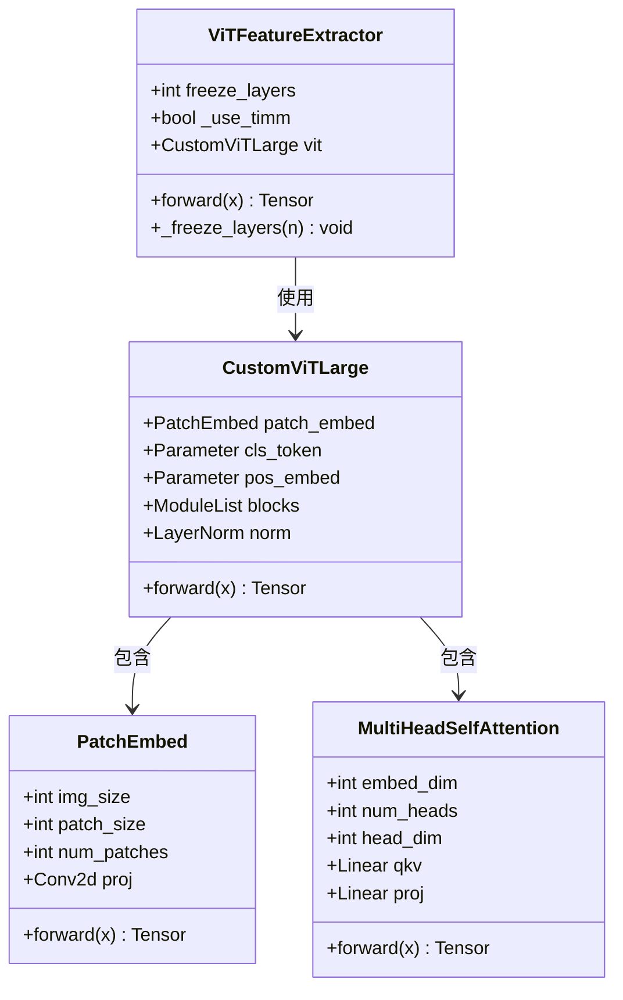

**图表来源**
- [egnv1/model.py:168-277](file://egnv1/model.py#L168-L277)
- [egnv1/model.py:32-162](file://egnv1/model.py#L32-L162)

#### GCN图卷积网络

EGN-v1实现了基于GCN的图卷积网络，专门用于处理空间依赖关系：

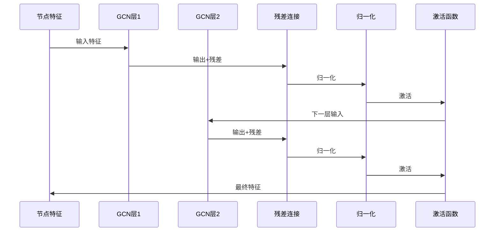

**图表来源**
- [egnv1/model.py:379-436](file://egnv1/model.py#L379-L436)

#### KNN图构建策略

EGN-v1采用了基于特征相似性的KNN图构建方法，有效捕捉空间邻域关系：

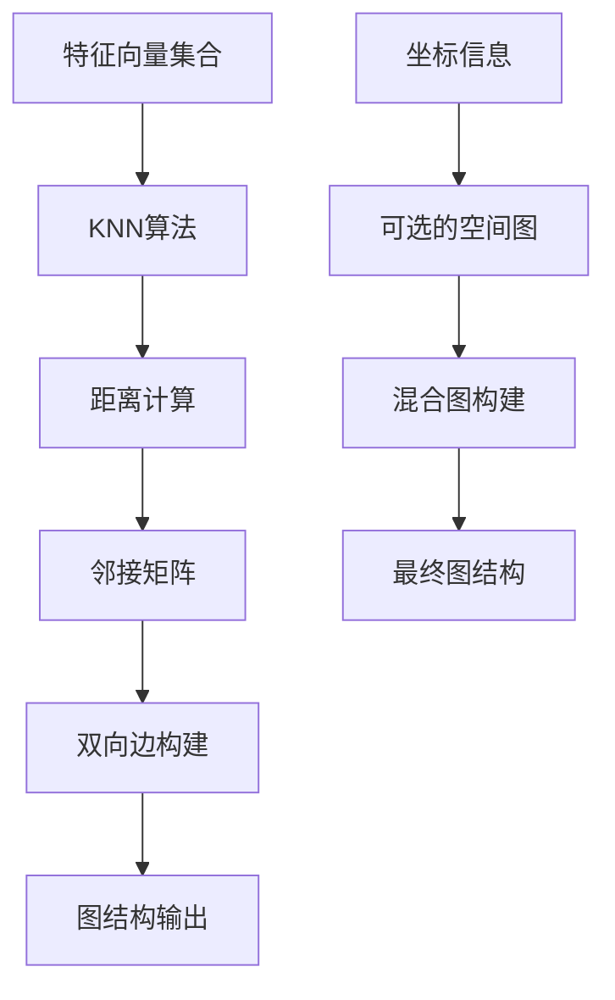

**图表来源**
- [egnv1/graph_builder.py:12-67](file://egnv1/graph_builder.py#L12-L67)

**章节来源**
- [egnv1/model.py:168-436](file://egnv1/model.py#L168-L436)
- [egnv1/graph_builder.py:12-164](file://egnv1/graph_builder.py#L12-L164)

### EGN-v2模型架构

#### ResNet-50特征提取器

EGN-v2采用了更加稳健的ResNet-50特征提取策略，提供了更好的泛化能力：

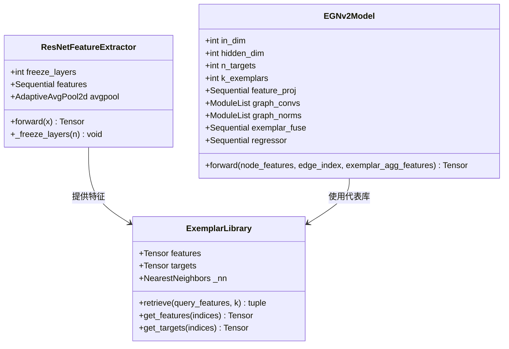

**图表来源**
- [egnv2/model.py:15-61](file://egnv2/model.py#L15-L61)
- [egnv2/model.py:63-211](file://egnv2/model.py#L63-L211)

#### GraphSAGE图卷积网络

EGN-v2实现了基于GraphSAGE的改进图卷积网络，具有更好的聚合能力：

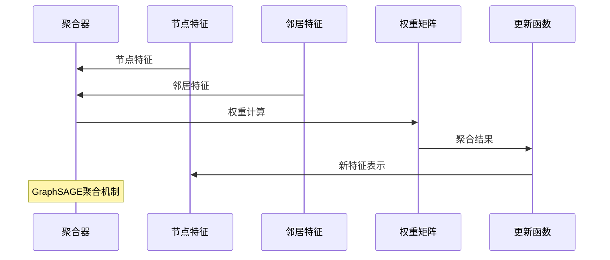

**图表来源**
- [egnv2/model.py:153-210](file://egnv2/model.py#L153-L210)

#### 空间图构建策略

EGN-v2采用了基于坐标距离的空间图构建方法，更适合处理空间依赖关系：

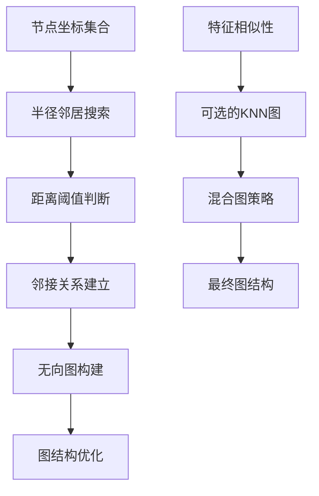

**图表来源**
- [egnv2/graph_builder.py:11-62](file://egnv2/graph_builder.py#L11-L62)

**章节来源**
- [egnv2/model.py:15-211](file://egnv2/model.py#L15-L211)
- [egnv2/graph_builder.py:11-121](file://egnv2/graph_builder.py#L11-L121)

### OpenMidnight/DINO-v2集成架构

#### DINO-v2特征提取

OpenMidnight集成了DINO-v2的特征提取能力，提供了1536维的高质量特征表示：

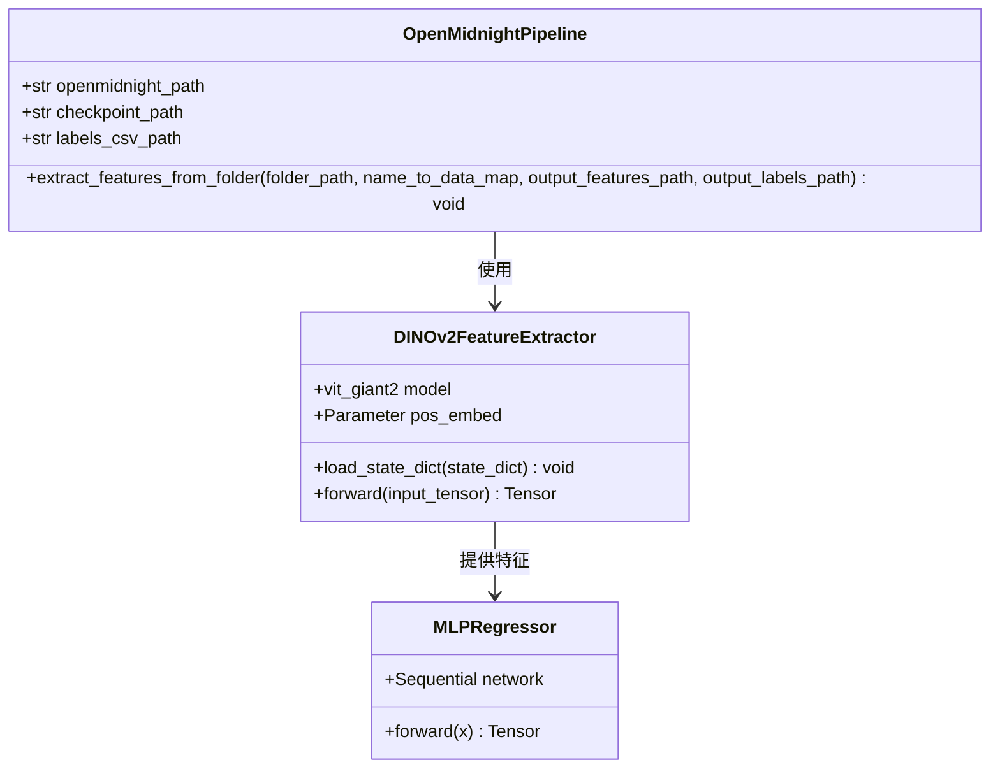

**图表来源**
- [openmidnight/extract_openmidnight.py:46-78](file://openmidnight/extract_openmidnight.py#L46-L78)
- [openmidnight/train_openmidnight.py:39-56](file://openmidnight/train_openmidnight.py#L39-L56)

#### 特征提取与回归流程

OpenMidnight实现了完整的特征提取到回归的端到端流程：

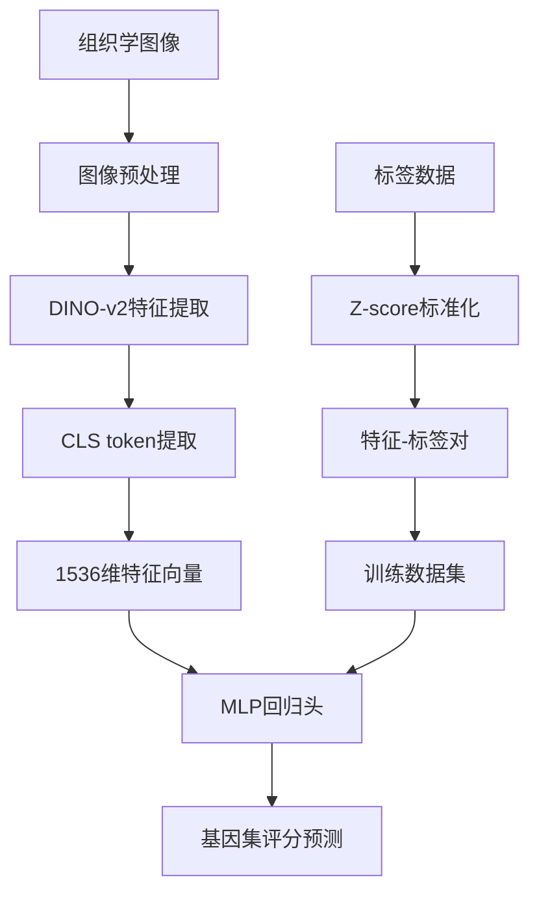

**图表来源**
- [openmidnight/extract_openmidnight.py:95-176](file://openmidnight/extract_openmidnight.py#L95-L176)
- [openmidnight/train_openmidnight.py:25-56](file://openmidnight/train_openmidnight.py#L25-L56)

**章节来源**
- [openmidnight/extract_openmidnight.py:1-196](file://openmidnight/extract_openmidnight.py#L1-L196)
- [openmidnight/train_openmidnight.py:1-299](file://openmidnight/train_openmidnight.py#L1-L299)

### 训练策略对比分析

#### 端到端训练vs两阶段训练

```mermaid
graph TB
subgraph "HisToGene - 端到端训练"
A1[完整模型初始化]
A2[图像到特征端到端学习]
A3[空间位置编码融合]
A4[多头注意力训练]
A5[回归头训练]
A6[联合优化]
end
subgraph "UNI2-h+MLP - 两阶段训练"
B1[预训练特征提取器加载]
B2[特征提取器冻结]
B3[回归头初始化]
B4[特征缓存生成]
B5[回归头训练]
B6[微调优化]
end
subgraph "EGN-v1 - 图神经网络训练"
C1[ViT特征提取]
C2[图构建(KNN)]
C3[GCN训练]
C4[Exemplar融合]
C5[回归头训练]
C6[联合优化]
end
subgraph "EGN-v2 - 改进图神经网络训练"
D1[ResNet特征提取]
D2[图构建(空间半径)]
D3[GraphSAGE训练]
D4[Exemplar融合]
D5[回归头训练]
D6[联合优化]
end
A1 --> A2
A2 --> A3
A3 --> A4
A4 --> A5
A5 --> A6
B1 --> B2
B2 --> B3
B3 --> B4
B4 --> B5
B5 --> B6
C1 --> C2
C2 --> C3
C3 --> C4
C4 --> C5
C5 --> C6
D1 --> D2
D2 --> D3
D3 --> D4
D4 --> D5
D5 --> D6
```

**图表来源**
- [HisToGene应用规划.md:80-92](file://HisToGene应用规划.md#L80-L92)
- [PFMval学习指南.md:88-88](file://PF/HisToGene应用规划.md#L80-L92)
- [PFMval学习指南.md:88-88](file://PFMval学习指南.md#L88-L88)

**章节来源**
- [HisToGene应用规划.md:80-92](file://HisToGene应用规划.md#L80-L92)
- [PFMval学习指南.md:88-88](file://PFMval学习指南.md#L88-L88)

## 依赖关系分析

### 模块间依赖关系

```mermaid
graph TB
subgraph "数据预处理"
A[split.py]
B[zscore.py]
end
subgraph "HisToGene模块"
C[histogene/model.py]
D[histogene/dataset.py]
E[histogene/train.py]
F[histogene/utils.py]
end
subgraph "UNI2-h模块"
G[uni2h/uni2h_utils.py]
H[uni2h/train.py]
I[uni2h/infer.py]
end
subgraph "EGN-v1模块"
J[egnv1/model.py]
K[egnv1/dataset.py]
L[egnv1/train.py]
M[egnv1/graph_builder.py]
N[egnv1/exemplar_builder.py]
end
subgraph "EGN-v2模块"
O[egnv2/model.py]
P[egnv2/dataset.py]
Q[egnv2/train.py]
R[egnv2/graph_builder.py]
S[egnv2/exemplar_builder.py]
end
subgraph "OpenMidnight模块"
T[openmidnight/extract_openmidnight.py]
U[openmidnight/train_openmidnight.py]
end
subgraph "外部依赖"
V[PyTorch]
W[timm]
X[huggingface_hub]
Y[pandas]
Z[numpy]
AA[scikit-learn]
BB[torch_geometric]
CC[sklearn]
DD[matplotlib]
EE[nltk]
FF[seaborn]
end
A --> C
A --> G
A --> J
A --> O
A --> T
B --> C
B --> G
B --> J
B --> O
B --> T
C --> V
D --> V
E --> V
F --> AA
G --> W
G --> X
H --> G
I --> G
J --> BB
K --> BB
L --> BB
M --> BB
N --> BB
O --> BB
P --> BB
Q --> BB
R --> BB
S --> BB
T --> DD
U --> DD
V --> Y
V --> Z
W --> Y
X --> Y
BB --> CC
```

**图表来源**
- [README.md:17-28](file://README.md#L17-L28)
- [PFMval学习指南.md:92-101](file://PFMval学习指南.md#L92-L101)

### 数据依赖链

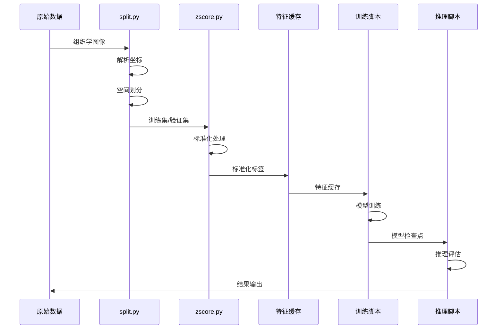

**图表来源**
- [split.py:99-197](file://split.py#L99-L197)
- [zscore.py:141-202](file://zscore.py#L141-L202)

**章节来源**
- [README.md:17-28](file://README.md#L17-L28)
- [PFMval学习指南.md:249-370](file://PFMval学习指南.md#L249-L370)

## 性能考量

### 训练效率优化

#### 混合精度训练

HisToGene实现了混合精度训练策略，显著提高了训练效率：

- **GradScaler使用**：动态缩放损失，防止梯度下溢
- **梯度裁剪**：防止梯度爆炸
- **CUDA加速**：充分利用GPU计算能力

#### 早停机制

所有架构都实现了智能的早停策略：

- **验证损失监控**：实时监控模型泛化能力
- **学习率调度**：自适应调整学习率
- **最佳模型保存**：避免过拟合

### 推理性能优化

#### 特征缓存策略

UNI2-h+MLP架构通过特征缓存大幅提升了推理速度：

- **一次性特征提取**：避免重复计算
- **断点续传**：支持大规模数据集的缓存生成
- **内存优化**：CPU加载特征，减少GPU内存占用

#### 图神经网络优化

EGN系列模型通过以下策略优化推理性能：

- **稀疏图操作**：利用PyG的稀疏图优化
- **批量处理**：支持大规模图的批量推理
- **内存管理**：优化特征张量的内存使用

**章节来源**
- [histogene/train.py:106-144](file://histogene/train.py#L106-L144)
- [uni2h/train.py:137-190](file://uni2h/train.py#L137-L190)
- [uni2h/uni2h_utils.py:138-169](file://uni2h/uni2h_utils.py#L138-L169)

## 故障排除指南

### 常见问题诊断

#### 数据预处理问题

1. **坐标解析失败**
   - 检查文件名格式是否符合`patch_xXXXX_yXXXX.png`
   - 验证坐标范围是否合理
   - 确认数据划分算法正确性

2. **Z-score标准化异常**
   - 检查是否有常数列导致标准差为0
   - 验证数值转换是否成功
   - 确认缺失值处理

#### 模型训练问题

1. **GPU内存不足**
   - 降低batch_size
   - 使用更小的模型尺寸
   - 启用梯度累积

2. **过拟合问题**
   - 增大dropout比率
   - 减少模型复杂度
   - 增加正则化

3. **图神经网络训练问题**
   - 检查图结构的连通性
   - 验证特征维度匹配
   - 确认邻接矩阵对称性

#### 特征提取问题

1. **HuggingFace认证失败**
   - 检查HF_TOKEN环境变量
   - 验证网络连接
   - 确认模型权限

2. **特征缓存损坏**
   - 清理缓存目录
   - 重新提取特征
   - 检查磁盘空间

3. **OpenMidnight特征提取问题**
   - 验证DINO-v2权重文件完整性
   - 检查图像预处理参数
   - 确认特征维度匹配

**章节来源**
- [PFMval学习指南.md:161-171](file://PFMval学习指南.md#L161-L171)
- [HisToGene应用规划.md:420-424](file://HisToGene应用规划.md#L420-L424)

## 结论

PFMval项目成功实现了四种互补的模型架构策略，为空间转录病理研究提供了强大的技术支撑：

### 主要成就

1. **技术创新**：实现了HisToGene的端到端学习、UNI2-h+MLP的两阶段训练、EGN-v1的图神经网络架构和EGN-v2的增强版本
2. **数据质量**：建立了严格的空间无重叠数据划分和标准化流程
3. **系统集成**：提供了完整的从数据预处理到模型推理的端到端解决方案
4. **性能优化**：通过混合精度训练和特征缓存等技术提升了系统效率
5. **开放集成**：成功集成了OpenMidnight/DINO-v2的先进特征提取能力

### 应用价值

- **医学研究**：为肿瘤空间异质性研究提供新的技术手段
- **药物开发**：支持基于空间表达模式的药物靶点发现
- **个性化医疗**：为精准治疗提供分子标记物预测
- **多模态融合**：支持不同来源特征的融合分析

### 未来发展方向

1. **模型扩展**：探索更大的预训练模型和更复杂的特征融合策略
2. **多模态融合**：结合多组学数据提升预测准确性
3. **实时推理**：优化推理速度满足临床应用需求
4. **可解释性**：增强模型决策过程的可解释性
5. **自动化程度**：提高模型训练和部署的自动化水平

## 附录

### 超参数配置指南

#### HisToGene模型超参数

| 参数类别 | 参数名称 | 默认值 | 调优建议 |
|---------|---------|--------|----------|
| 模型架构 | img_size | 224 | 保持224×224 |
| 模型架构 | patch_size | 16 | 16×16适合组织学图像 |
| 模型架构 | dim | 1024 | 大模型容量 |
| 模型架构 | depth | 8 | 深度适中 |
| 模型架构 | heads | 16 | 多头注意力 |
| 训练配置 | batch_size | 64 | GPU内存适配 |
| 训练配置 | lr | 1e-4 | AdamW学习率 |
| 训练配置 | dropout | 0.3 | 防止过拟合 |

#### UNI2-h+MLP模型超参数

| 参数类别 | 参数名称 | 默认值 | 调优建议 |
|---------|---------|--------|----------|
| 模型架构 | feature_dim | 1536 | 预训练特征维度 |
| 模型架构 | hidden_dim | 256 | 回归头隐藏层 |
| 训练配置 | batch_size | 256 | 大batch size |
| 训练配置 | lr | 1e-3 | 回归头学习率 |
| 训练配置 | dropout | 0.2 | 轻量正则化 |
| 训练配置 | patience | 10 | 早停耐心值 |

#### EGN-v1模型超参数

| 参数类别 | 参数名称 | 默认值 | 调优建议 |
|---------|---------|--------|----------|
| 模型架构 | backbone | ViT-Large | 1024维特征 |
| 模型架构 | hidden_dim | 1024 | 匹配ViT输出 |
| 模型架构 | graph_layers | 2 | GCN层数 |
| 图构建 | graph_type | knn | 特征相似性 |
| 图构建 | k_neighbors | 10 | KNN邻居数 |
| 训练配置 | batch_size | 16 | ViT显存限制 |
| 训练配置 | lr | 1e-5 | 小学习率稳定 |
| 训练配置 | dropout | 0.5 | 高dropout防止过拟合 |

#### EGN-v2模型超参数

| 参数类别 | 参数名称 | 默认值 | 调优建议 |
|---------|---------|--------|----------|
| 模型架构 | backbone | ResNet-50 | 2048维特征 |
| 模型架构 | hidden_dim | 512 | 适中维度 |
| 模型架构 | graph_layers | 2 | GraphSAGE层数 |
| 图构建 | graph_type | spatial | 坐标距离 |
| 图构建 | radius | 300 | 空间半径 |
| 训练配置 | batch_size | 64 | ResNet显存 |
| 训练配置 | lr | 1e-4 | 标准学习率 |
| 训练配置 | dropout | 0.3 | 适中正则化 |

#### OpenMidnight模型超参数

| 参数类别 | 参数名称 | 默认值 | 调优建议 |
|---------|---------|--------|----------|
| 特征提取 | backbone | DINO-v2 | 1536维特征 |
| 回归头 | hidden_dims | [512, 256] | 两层结构 |
| 回归头 | dropout_rate | 0.1 | 轻量正则化 |
| 训练配置 | batch_size | 256 | 大batch size |
| 训练配置 | lr | 1e-3 | AdamW学习率 |
| 训练配置 | weight_decay | 1e-4 | 权重衰减 |
| 训练配置 | num_epochs | 200 | 充分训练 |

### 评估指标说明

项目实现了四个关键的评估指标：

1. **MSE (均方误差)**：衡量预测值与真实值的平方差
2. **MAE (平均绝对误差)**：衡量预测误差的绝对值
3. **R² (决定系数)**：衡量模型解释方差的比例
4. **PCC (皮尔逊相关系数)**：衡量线性相关性强度

这些指标提供了多维度的模型性能评估，有助于全面了解模型在不同方面的表现。

**章节来源**
- [histogene/utils.py:20-31](file://histogene/utils.py#L20-L31)
- [uni2h/uni2h_utils.py:90-134](file://uni2h/uni2h_utils.py#L90-L134)