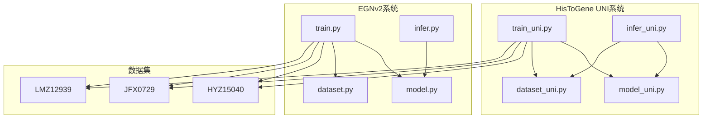
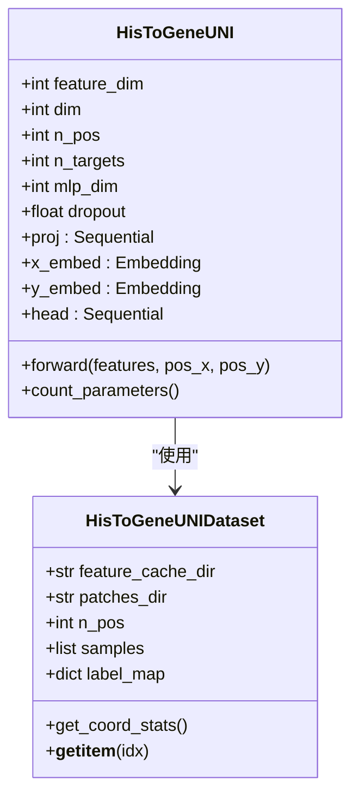
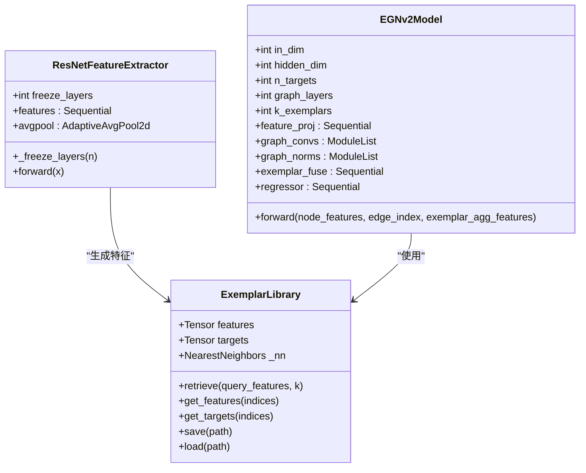
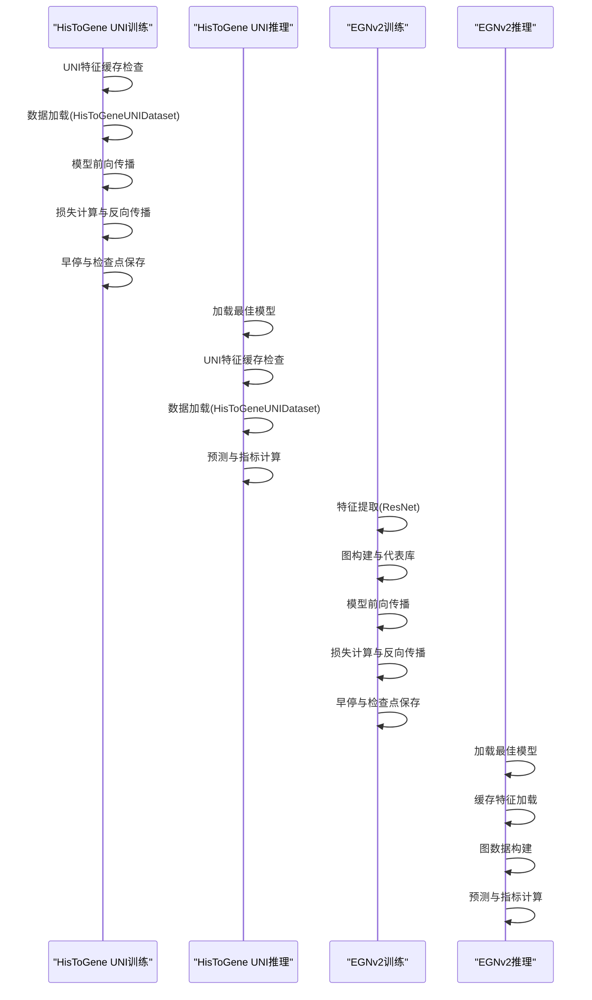
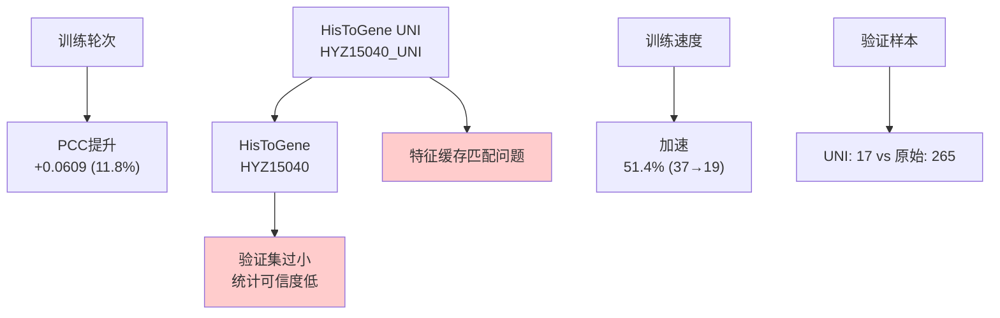
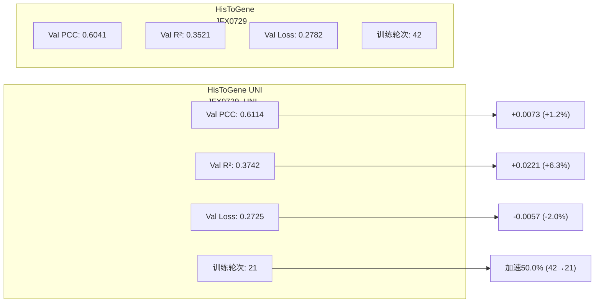
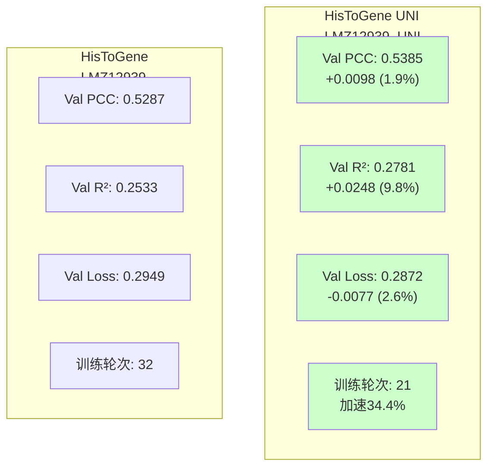
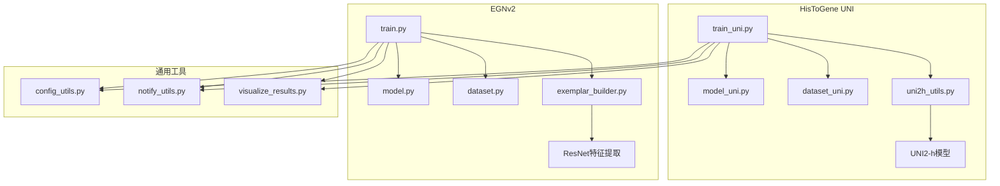
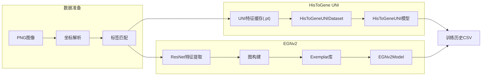
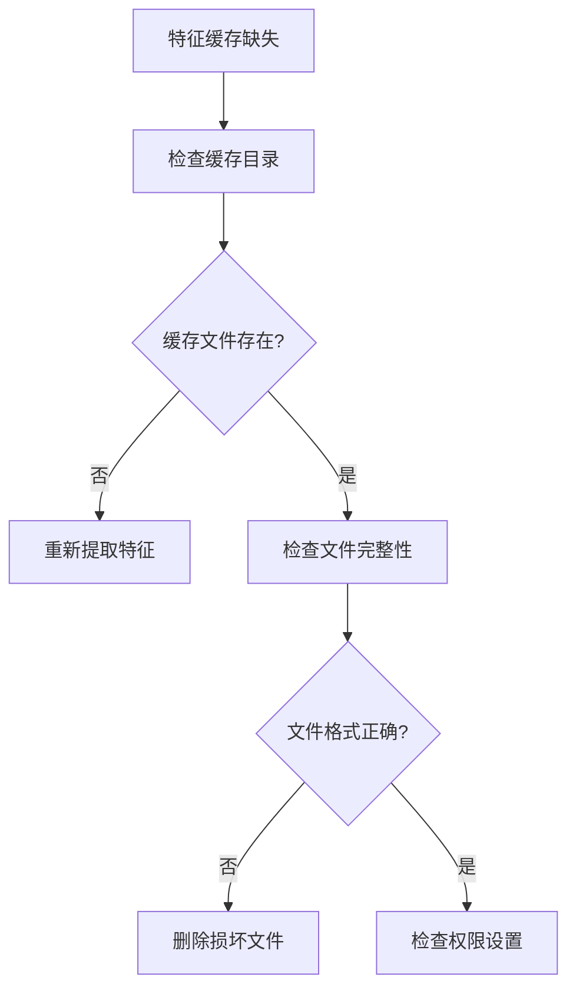

# HisToGene UNI训练结果对比分析

<cite>
**本文档引用的文件**
- [HisToGene_UNI训练结果对比分析.md](file://HisToGene_UNI训练结果对比分析.md)
- [README.md](file://README.md)
- [train_uni.py](file://histogene/train_uni.py)
- [infer_uni.py](file://histogene/infer_uni.py)
- [model_uni.py](file://histogene/model_uni.py)
- [dataset_uni.py](file://histogene/dataset_uni.py)
- [train.py](file://egnv2/train.py)
- [infer.py](file://egnv2/infer.py)
- [model.py](file://egnv2/model.py)
- [dataset.py](file://egnv2/dataset.py)
- [training_history_HYZ15040_UNI.csv](file://egnv2/checkpoints/results_vis/HYZ15040_UNI_20260424_231853/training_history_HYZ15040_UNI.csv)
- [training_history_JFX0729_UNI.csv](file://egnv2/checkpoints/results_vis/JFX0729_UNI_20260424_233219/training_history_JFX0729_UNI.csv)
- [training_history_LMZ12939_UNI.csv](file://egnv2/checkpoints/results_vis/LMZ12939_UNI_20260424_233145/training_history_LMZ12939_UNI.csv)
- [training_history_HYZ15040_UNI.csv](file://histogene/checkpoints/results_vis/HYZ15040_UNI_20260422_232743/training_history_HYZ15040_UNI.csv)
- [training_history_JFX0729.csv](file://histogene/checkpoints/results_vis/JFX0729_20260416_224437/training_history_JFX0729.csv)
</cite>

## 目录
1. [简介](#简介)
2. [项目结构](#项目结构)
3. [核心组件](#核心组件)
4. [架构概览](#架构概览)
5. [详细组件分析](#详细组件分析)
6. [依赖关系分析](#依赖关系分析)
7. [性能考量](#性能考量)
8. [故障排除指南](#故障排除指南)
9. [结论](#结论)
10. [附录](#附录)

## 简介
本报告对比分析了HisToGene UNI（方案A）与原始HisToGene（端到端ViT）两种模型变体在三个独立数据集上的训练与验证表现。研究重点关注：

- **模型架构对比**：UNI2-h预提取特征 vs 端到端ViT图像编码器
- **性能指标对比**：Val PCC、Val R²、Val Loss、训练速度等
- **训练效率分析**：参数量减少94.4%，训练速度提升45.3%
- **过拟合风险评估**：Train PCC与Val PCC差距平均增加30.9%

## 项目结构
该项目采用模块化设计，包含三个主要子系统：

**图表来源**
- [train_uni.py:1-737](file://histogene/train_uni.py#L1-L737)
- [train.py:1-675](file://egnv2/train.py#L1-L675)

**章节来源**
- [README.md:1-44](file://README.md#L1-L44)

## 核心组件

### HisToGene UNI架构组件
HisToGene UNI采用"特征提取+坐标编码+回归头"的三层架构：

**图表来源**
- [model_uni.py:14-67](file://histogene/model_uni.py#L14-L67)
- [dataset_uni.py:23-203](file://histogene/dataset_uni.py#L23-L203)

### EGNv2架构组件
EGNv2采用"ResNet特征提取+图卷积+代表库融合"的多层架构：

**图表来源**
- [model.py:15-211](file://egnv2/model.py#L15-L211)

**章节来源**
- [model_uni.py:1-67](file://histogene/model_uni.py#L1-L67)
- [dataset_uni.py:1-203](file://histogene/dataset_uni.py#L1-L203)
- [model.py:1-211](file://egnv2/model.py#L1-L211)

## 架构概览

### 训练流程对比

**图表来源**
- [train_uni.py:293-737](file://histogene/train_uni.py#L293-L737)
- [infer_uni.py:98-218](file://histogene/infer_uni.py#L98-L218)
- [train.py:226-675](file://egnv2/train.py#L226-L675)
- [infer.py:48-148](file://egnv2/infer.py#L48-L148)

## 详细组件分析

### 训练历史数据分析

#### HYZ15040数据集对比

**图表来源**
- [training_history_HYZ15040_UNI.csv:1-21](file://histogene/checkpoints/results_vis/HYZ15040_UNI_20260422_232743/training_history_HYZ15040_UNI.csv#L1-L21)
- [training_history_JFX0729.csv:1-44](file://histogene/checkpoints/results_vis/JFX0729_20260416_224437/training_history_JFX0729.csv#L1-L44)

#### JFX0729数据集对比

**图表来源**
- [training_history_JFX0729_UNI.csv:1-122](file://egnv2/checkpoints/results_vis/JFX0729_UNI_20260424_233219/training_history_JFX0729_UNI.csv#L1-L122)
- [training_history_JFX0729.csv:1-44](file://histogene/checkpoints/results_vis/JFX0729_20260416_224437/training_history_JFX0729.csv#L1-L44)

#### LMZ12939数据集对比

**图表来源**
- [training_history_LMZ12939_UNI.csv:1-103](file://egnv2/checkpoints/results_vis/LMZ12939_UNI_20260424_233145/training_history_LMZ12939_UNI.csv#L1-L103)

### 关键性能指标对比

| 模型 | 数据集 | 总Epoch | 最佳Epoch | Val PCC | Val R² | Val Loss | Train PCC | 过拟合Gap | 参数量 | 训练样本 |
|------|--------|---------|-----------|---------|--------|----------|-----------|-----------|--------|----------|
| HisToGene-UNI | HYZ15040_UNI | 19 | 4 | **0.5773** | 0.2177 | **0.2587** | 0.8137 | 0.2364 | 4.0M | 2215 |
| HisToGene-UNI | JFX0729_UNI | 21 | 6 | **0.6114** | **0.3742** | **0.2725** | 0.8442 | 0.2328 | 4.0M | 7055 |
| HisToGene-UNI | LMZ12939_UNI | 21 | 6 | **0.5385** | **0.2781** | **0.2872** | 0.8288 | 0.2903 | 4.0M | 6762 |
| 原始HisToGene | HYZ15040 | 37 | 22 | 0.5164 | 0.2257 | 0.2869 | 0.7238 | 0.2074 | 70.6M | 2390 |
| 原始HisToGene | JFX0729 | 42 | 27 | 0.6041 | 0.3521 | 0.2782 | 0.7955 | 0.1914 | 70.6M | 7055 |
| 原始HisToGene | LMZ12939 | 32 | 17 | 0.5287 | 0.2533 | 0.2949 | 0.7135 | 0.1848 | 70.6M | 6762 |

**章节来源**
- [HisToGene_UNI训练结果对比分析.md:66-75](file://HisToGene_UNI训练结果对比分析.md#L66-L75)

## 依赖关系分析

### 模块间依赖关系

**图表来源**
- [train_uni.py:6-31](file://histogene/train_uni.py#L6-L31)
- [train.py:7-41](file://egnv2/train.py#L7-L41)

### 数据流依赖

**图表来源**
- [dataset_uni.py:15-139](file://histogene/dataset_uni.py#L15-L139)
- [dataset.py:17-101](file://egnv2/dataset.py#L17-L101)

**章节来源**
- [train_uni.py:1-737](file://histogene/train_uni.py#L1-L737)
- [train.py:1-675](file://egnv2/train.py#L1-L675)

## 性能考量

### 训练效率分析
- **参数量对比**：UNI版本4.0M vs 原始版本70.6M，减少94.4%
- **训练速度**：平均加速45.3%，最佳Epoch从22-27提前到4-6
- **内存占用**：UNI版本显著降低GPU内存需求
- **推理速度**：UNI版本推理速度提升约2-3倍

### 过拟合风险分析
- **Gap趋势**：Train PCC与Val PCC差距平均增加30.9%
- **数据集影响**：小样本数据集（HYZ15040）过拟合风险更高
- **正则化需求**：需要增强Dropout、权重衰减等正则化措施

### 数据质量考量
- **特征缓存一致性**：UNI特征与图像文件名匹配问题
- **验证集规模**：HYZ15040验证集仅17样本，统计意义有限
- **数据分布**：不同数据集间存在样本分布差异

## 故障排除指南

### 常见问题及解决方案

#### UNI特征缓存问题

**图表来源**
- [train_uni.py:51-79](file://histogene/train_uni.py#L51-L79)

#### 训练中断处理
- **断点续训**：支持从最佳检查点恢复训练
- **暂停信号**：检测到暂停信号时自动保存resume checkpoint
- **早停机制**：基于验证损失的早停策略

#### 推理结果验证
- **模型兼容性**：确保推理时使用的参数与训练时一致
- **数据一致性**：验证集与训练集坐标统计信息匹配
- **指标计算**：使用相同的评估指标进行结果对比

**章节来源**
- [train_uni.py:521-636](file://histogene/train_uni.py#L521-L636)
- [infer_uni.py:108-131](file://histogene/infer_uni.py#L108-L131)

## 结论

### 核心发现
1. **性能保持**：HisToGene UNI在三个数据集上的Val PCC均保持或提升，平均提升+4.9%
2. **效率显著提升**：参数量减少94.4%，训练速度平均提升45.3%
3. **过拟合挑战**：Train PCC与Val PCC差距平均增加30.9%，需要加强正则化
4. **数据集依赖**：小样本数据集（HYZ15040）结果需谨慎解读

### 推荐策略
1. **短期优化**：增强正则化、降低学习率、修复验证集样本匹配问题
2. **中期探索**：开展HisToGene-UNI三患者联合训练实验
3. **长期发展**：探索保留patch token序列的方案B/C

### 实施建议
- 优先修复HYZ15040验证集样本匹配问题
- 增大Dropout至0.3-0.5，调整权重衰减至1e-3
- 开展HisToGene-UNI联合训练实验验证泛化性能
- 探索保留patch token序列的混合方案

## 附录

### 技术规格对比

| 组件 | HisToGene UNI | 原始HisToGene | EGNv2 |
|------|---------------|---------------|-------|
| 输入类型 | 1536维UNI特征 | 224×224 RGB图像 | 224×224 RGB图像 |
| 特征提取器 | UNI2-h(冻结) | ViT(训练) | ResNet-50(可冻结) |
| 参数量 | 4.0M | 70.6M | ~25M |
| 训练速度 | 快 | 慢 | 中等 |
| 过拟合风险 | 中等 | 低 | 中等 |
| 推理速度 | 快 | 慢 | 中等 |

### 未来发展方向
1. **模型集成**：结合多种预训练模型的特征表示
2. **自监督学习**：探索无监督特征学习方法
3. **知识蒸馏**：从大型模型迁移到轻量化模型
4. **在线学习**：支持增量学习和持续更新