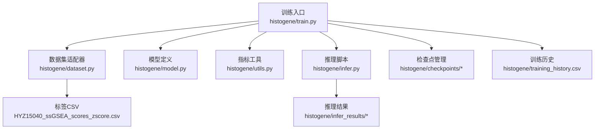
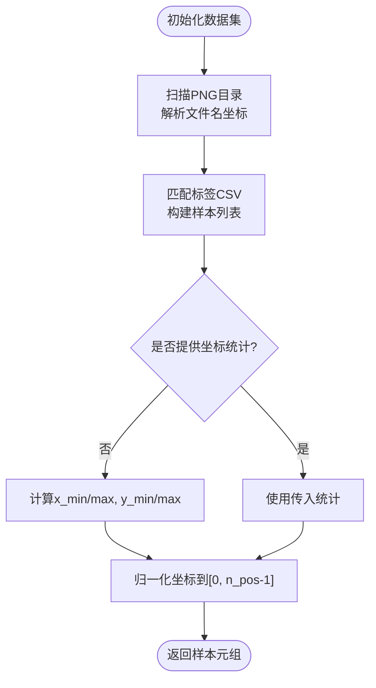
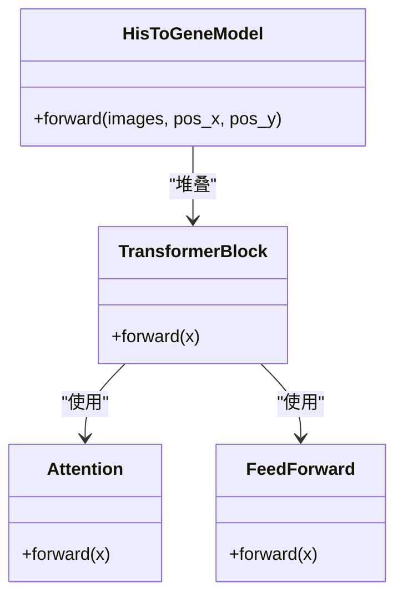

# HisToGene训练流程

<cite>
**本文引用的文件**
- [train.py](file://histogene/train.py)
- [dataset.py](file://histogene/dataset.py)
- [model.py](file://histogene/model.py)
- [utils.py](file://histogene/utils.py)
- [infer.py](file://histogene/infer.py)
- [README.md](file://README.md)
- [HYZ15040_ssGSEA_scores_zscore.csv](file://HYZ15040_ssGSEA_scores_zscore.csv)
- [training_history.csv](file://histogene/training_history.csv)
- [best_histogene.pth](file://histogene/checkpoints/best_histogene.pth)
- [predictions.csv](file://histogene/infer_results/predictions.csv)
</cite>

## 目录
1. [简介](#简介)
2. [项目结构](#项目结构)
3. [核心组件](#核心组件)
4. [架构总览](#架构总览)
5. [详细组件分析](#详细组件分析)
6. [训练流程详解](#训练流程详解)
7. [验证与推理流程](#验证与推理流程)
8. [检查点管理](#检查点管理)
9. [性能考量](#性能考量)
10. [故障排查指南](#故障排查指南)
11. [结论](#结论)
12. [附录](#附录)

## 简介
本技术文档面向HisToGene在ssGSEA通路评分上的端到端训练流程，系统阐述数据加载、坐标统计与空间位置编码、模型结构、训练循环、验证与推理、检查点管理、指标计算与日志记录，并给出命令行参数说明、性能优化建议与常见问题解决方案。目标是帮助读者快速理解并高效复现训练过程。

## 项目结构
- histogene：训练与推理相关模块
  - train.py：训练入口，包含数据加载、训练循环、验证、早停、保存
  - dataset.py：HisToGeneDataset数据集适配器，负责从PNG图像解析坐标、匹配标签、坐标统计与归一化
  - model.py：HisToGeneModel模型，基于ViT-MLP架构，融合空间位置编码与CLS token回归头
  - utils.py：指标计算工具（MSE、MAE、R²、PCC）
  - infer.py：推理脚本，加载训练好的checkpoint进行预测
- 其他支持文件：
  - README.md：环境与使用说明
  - HYZ15040_ssGSEA_scores_zscore.csv：训练标签（8个通路评分，z-score标准化）
  - training_history.csv：训练历史记录
  - best_histogene.pth：最佳模型检查点
  - infer_results/predictions.csv：推理结果



**图表来源**
- [train.py:174-338](file://histogene/train.py#L174-L338)
- [dataset.py:23-118](file://histogene/dataset.py#L23-L118)
- [model.py:64-160](file://histogene/model.py#L64-L160)
- [utils.py:20-31](file://histogene/utils.py#L20-L31)
- [infer.py:66-169](file://histogene/infer.py#L66-L169)

**章节来源**
- [train.py:174-338](file://histogene/train.py#L174-L338)
- [README.md:1-44](file://README.md#L1-L44)

## 核心组件
- 数据加载器HisToGeneDataset
  - 从PNG文件名解析坐标(x,y)，扫描目录匹配标签，构建样本列表
  - 支持训练集与验证集共享同一套坐标统计，保证归一化一致
  - 提供坐标到索引的映射，将连续坐标归一化到[0, n_pos-1]
- 模型HisToGeneModel
  - Patch Embedding + CLS Token + ViT位置嵌入 + 多头注意力 + MLP前馈
  - 空间位置编码采用独立X/Y嵌入，并加到CLS token上
  - 回归头输出8个通路评分
- 训练循环train_one_epoch
  - 支持混合精度（GradScaler）、梯度裁剪、反向传播
  - 返回epoch平均loss与指标（MAE、R²、PCC）
- 验证流程evaluate
  - 与训练类似，但不更新参数，仅计算指标
- 推理流程run_inference
  - 加载最佳模型检查点，对指定目录的patch进行推理
  - 输出逐通路指标和预测CSV文件

**章节来源**
- [dataset.py:23-118](file://histogene/dataset.py#L23-L118)
- [model.py:64-160](file://histogene/model.py#L64-L160)
- [train.py:106-172](file://histogene/train.py#L106-L172)
- [utils.py:20-31](file://histogene/utils.py#L20-L31)
- [infer.py:52-63](file://histogene/infer.py#L52-L63)

## 架构总览
训练流程从命令行参数解析开始，构建数据集与数据加载器，初始化模型、损失函数、优化器与学习率调度器，进入训练循环并在每个epoch结束后评估验证集，记录历史并保存最佳模型。推理阶段加载最佳检查点进行预测。

```mermaid
sequenceDiagram
participant CLI as "命令行"
participant Train as "train.py.main()"
participant DS as "HisToGeneDataset"
participant Loader as "DataLoader"
participant Model as "HisToGeneModel"
participant Opt as "AdamW"
participant Sch as "ReduceLROnPlateau"
participant Utils as "compute_metrics"
CLI->>Train : 解析参数
Train->>DS : 初始化训练/验证数据集
Train->>Loader : 构建DataLoader(训练/验证)
Train->>Model : 实例化模型
Train->>Opt : 配置优化器
Train->>Sch : 配置调度器
loop 每个epoch
Train->>Loader : 迭代训练批次
Train->>Model : 前向(图像, pos_x, pos_y)
Train->>Opt : 反向传播(混合精度可选)
Train->>Loader : 迭代验证批次
Train->>Model : 前向(验证)
Train->>Utils : 计算指标(MAE/R²/PCC)
Train->>Sch : step(val_loss)
Train->>Train : 记录历史/保存最佳模型
end
```

**图表来源**
- [train.py:174-338](file://histogene/train.py#L174-L338)
- [dataset.py:23-118](file://histogene/dataset.py#L23-L118)
- [model.py:122-159](file://histogene/model.py#L122-L159)
- [utils.py:20-31](file://histogene/utils.py#L20-L31)

## 详细组件分析

### 数据加载器HisToGeneDataset
- 文件名解析坐标：从patch_xXXXX_yYYYY.png提取x、y
- 标签匹配：以patch_id为键，从z-score标签CSV中读取最后8列作为targets
- 坐标统计与归一化：
  - 训练集计算全局x_min/x_max/y_min/y_max
  - 验证集接收训练集统计，避免数据泄露
  - 归一化公式：(val - vmin) / (vmax - vmin) * (n_pos-1)，并裁剪到[0, n_pos-1]
- 输出：(图像张量, pos_x索引, pos_y索引, targets张量)



**图表来源**
- [dataset.py:15-118](file://histogene/dataset.py#L15-L118)

**章节来源**
- [dataset.py:23-118](file://histogene/dataset.py#L23-L118)

### 模型HisToGeneModel
- Patch Embedding：将图像切分为patches并线性映射到模型维度
- 位置编码：
  - 独立X/Y嵌入，将pos_x、pos_y映射为位置向量
  - 加到CLS token上，保留原始HiSToGene的空间位置设计
  - 同时叠加ViT内部位置嵌入
- Transformer编码器：多层TransformerBlock（多头注意力 + 前馈）
- 回归头：LayerNorm + Linear + GELU + Dropout + Linear，输出8个通路评分



**图表来源**
- [model.py:12-160](file://histogene/model.py#L12-L160)

**章节来源**
- [model.py:64-160](file://histogene/model.py#L64-L160)

### 训练循环train_one_epoch与验证evaluate
- 训练阶段：
  - 混合精度：若启用，使用GradScaler缩放loss，unscale后clip_grad_norm，再step优化器
  - 反向传播：loss.backward() + clip_grad_norm + optimizer.step()
  - 指标：收集preds与targets，计算MAE、R²、PCC
- 验证阶段：与训练类似，但不更新参数，仅计算指标

```mermaid
sequenceDiagram
participant Train as "train_one_epoch"
participant Model as "HisToGeneModel"
participant Opt as "AdamW"
participant Scaler as "GradScaler"
participant Utils as "compute_metrics"
Train->>Model : 前向(images, pos_x, pos_y)
Train->>Opt : zero_grad()
alt AMP启用
Train->>Scaler : scale(loss)
Train->>Scaler : backward()
Train->>Opt : unscale(step)
Train->>Opt : clip_grad_norm
Train->>Scaler : update()
else AMP禁用
Train->>Model : loss.backward()
Train->>Opt : clip_grad_norm
Train->>Opt : step()
end
Train->>Utils : 计算指标
Train-->>Train : 返回avg_loss与metrics
```

**图表来源**
- [train.py:106-172](file://histogene/train.py#L106-L172)

**章节来源**
- [train.py:106-172](file://histogene/train.py#L106-L172)

### 指标计算compute_metrics
- MSE、MAE、R²直接调用sklearn.metrics
- PCC通过自定义函数计算，考虑零方差场景返回0

**章节来源**
- [utils.py:20-31](file://histogene/utils.py#L20-L31)

## 训练流程详解

### 训练循环实现细节
- 混合精度训练：使用torch.amp.GradScaler('cuda')在CUDA可用时启用
- 梯度裁剪：torch.nn.utils.clip_grad_norm_(model.parameters(), max_norm=1.0)
- 学习率调度：ReduceLROnPlateau，mode='min'，factor=0.5，patience=5
- 早停机制：连续patience个epoch未改善则停止训练
- 检查点保存：最佳验证损失对应的模型权重被保存

### 训练历史记录
- 每10个epoch保存一次训练历史CSV
- 包含epoch、train_loss、train_mae、train_r2、train_pcc、val_loss、val_mae、val_r2、val_pcc、lr等字段

**章节来源**
- [train.py:249-331](file://histogene/train.py#L249-L331)

## 验证与推理流程

### 推理脚本infer.py
- 加载最佳训练检查点（best_histogene.pth）
- 重建模型参数与结构
- 对指定目录的patch进行批量推理
- 输出预测结果CSV和逐通路指标

### 推理结果格式
- predictions.csv：包含patch_id、true_*、pred_*列
- per_pathway_metrics.csv：逐通路的MSE、MAE、R²、PCC指标
- overall指标：全局MSE、MAE、R²、PCC

**章节来源**
- [infer.py:66-169](file://histogene/infer.py#L66-L169)

## 检查点管理

### 检查点文件结构
最佳模型检查点包含以下关键信息：
- epoch：训练轮次
- model_state_dict：模型权重参数
- optimizer_state_dict：优化器状态
- val_loss：验证损失
- val_metrics：验证指标
- args：训练参数字典
- coord_stats：坐标统计信息
- target_cols：目标列名列表

### 检查点保存策略
- 每当验证损失降低时保存新的最佳模型
- 保存完整的训练历史到training_history.csv
- 支持断点续训和模型迁移

**章节来源**
- [train.py:304-318](file://histogene/train.py#L304-L318)
- [infer.py:79-102](file://histogene/infer.py#L79-L102)

## 性能考量
- 混合精度训练：在CUDA可用时启用GradScaler，显著降低显存占用并提升吞吐
- 梯度裁剪：clip_grad_norm防止梯度爆炸，提高训练稳定性
- 数据加载：num_workers=0（Windows）避免多进程问题；pin_memory仅在GPU设备启用
- 图像预处理：使用ImageNet均值/方差归一化，提升收敛稳定性
- 模型维度与深度：可通过调整heads、mlp_dim、depth控制计算复杂度与内存占用
- Huber损失：相比MSE对异常值更鲁棒，有助于稳定回归任务

## 故障排查指南
- 数据路径错误
  - 症状：提示train_patches_dir或val_patches_dir不存在
  - 处理：确认split.py已生成对应目录，或通过命令行参数指定正确路径
- 标签文件缺失
  - 症状：提示labels_csv不存在
  - 处理：确保zscore.py已生成z-score标准化后的CSV
- 设备选择
  - 症状：混合精度未生效
  - 处理：确认CUDA可用且--amp开启
- 训练中断
  - 症状：早停触发或显存不足
  - 处理：适当降低batch_size、img_size或减少heads/mlp_dim；检查数据集坐标统计一致性
- 指标异常
  - 症状：PCC为0或NaN
  - 处理：检查targets是否存在零方差；确认标签与图像ID匹配
- 检查点加载失败
  - 症状：checkpoint文件损坏或版本不兼容
  - 处理：重新训练或手动修复检查点文件

**章节来源**
- [train.py:177-188](file://histogene/train.py#L177-L188)
- [README.md:30-38](file://README.md#L30-L38)

## 结论
本文档系统梳理了HisToGene在ssGSEA通路上的完整训练流程，覆盖数据加载、坐标统计与空间位置编码、模型结构、训练循环、验证与推理、检查点管理、指标计算与日志记录。通过合理的超参数配置与性能优化策略，可在保证稳定性的同时获得良好的回归效果。建议在实际部署前，结合数据分布与硬件资源对超参数进行微调。

## 附录

### 命令行参数说明
- 数据路径
  - --train_patches_dir：训练patch目录，默认自动搜索
  - --val_patches_dir：验证patch目录，默认自动搜索
  - --labels_csv：z-score标签CSV路径，默认指向HYZ15040_ssGSEA_scores_zscore.csv
  - --checkpoint_dir：检查点保存目录，默认histogene/checkpoints
  - --history_csv：训练历史CSV保存路径，默认histogene/training_history.csv
- 训练超参
  - --batch_size：批大小，默认64
  - --num_epochs：训练轮数，默认150
  - --lr：学习率，默认1e-4
  - --num_workers：数据加载并行数，默认0（Windows）
- 模型超参
  - --img_size：输入图像尺寸，默认224
  - --patch_size：Patch大小，默认16
  - --model_dim：Embedding维度，默认1024
  - --model_depth：Transformer层数，默认8
  - --heads：注意力头数，默认16
  - --mlp_dim：前馈网络维度，默认2048
  - --n_pos：位置编码最大索引，默认128
  - --n_targets：输出通道数，默认8（ssGSEA 8通路）
  - --dropout：Dropout比率，默认0.3
- 早停与混合精度
  - --early_stop_patience：早停耐心值，默认15
  - --amp：启用混合精度（仅CUDA）
- 推理参数
  - --patches_dir：推理patch目录（必需）
  - --checkpoint：检查点文件路径，默认best_histogene.pth
  - --output_dir：输出目录，默认infer_results

**章节来源**
- [train.py:47-80](file://histogene/train.py#L47-L80)
- [infer.py:30-40](file://histogene/infer.py#L30-L40)

### 数据与标签说明
- 标签CSV包含8个ssGSEA通路评分列，经z-score标准化后使用
- 目标列：tls、tgfb、emt、hypoxia、mhc、icp、ifng、toxic
- analyze_stats.py与data_distribution_analysis.py可用于探索标签分布与统计特性

**章节来源**
- [HYZ15040_ssGSEA_scores_zscore.csv:1-200](file://HYZ15040_ssGSEA_scores_zscore.csv#L1-L200)
- [README.md:4-8](file://README.md#L4-L8)