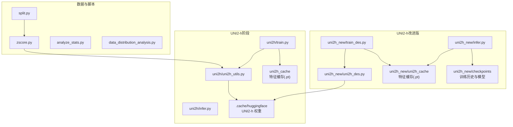
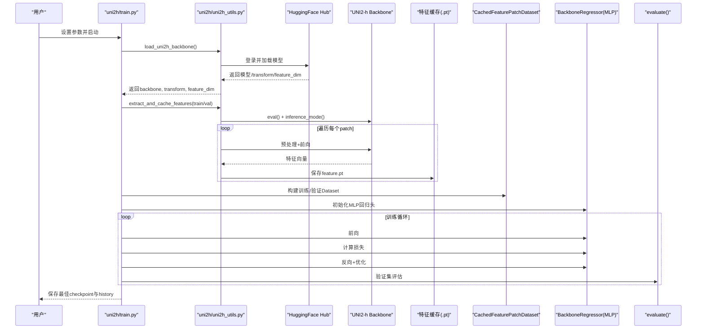
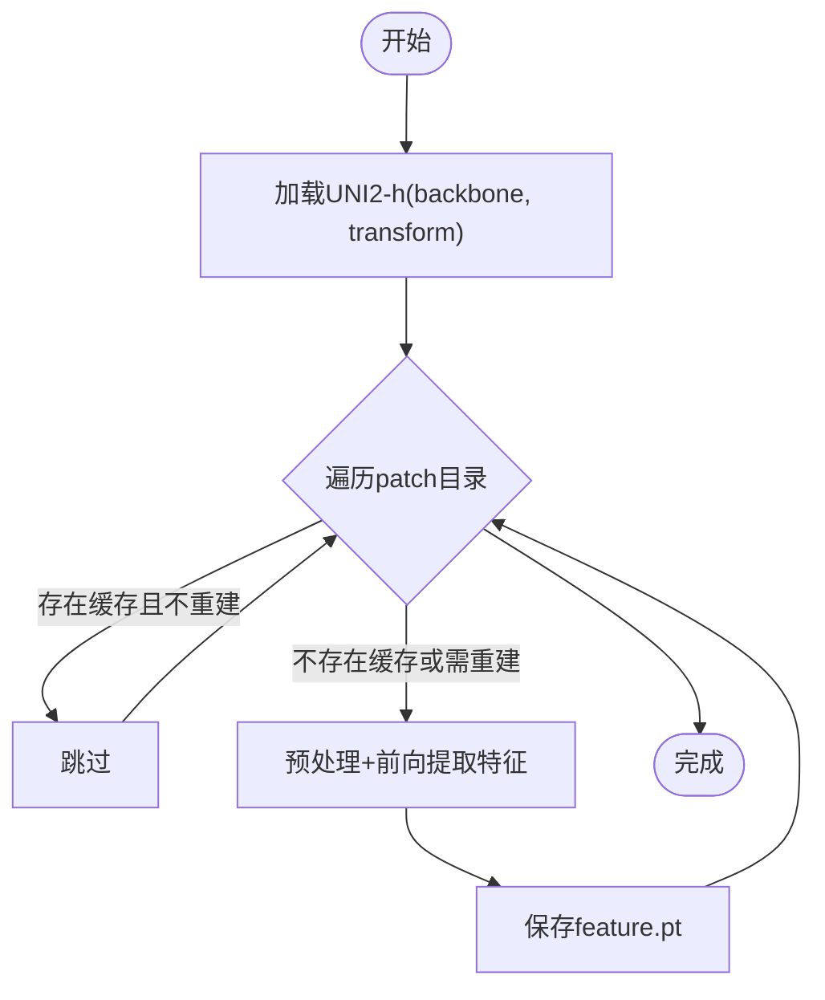
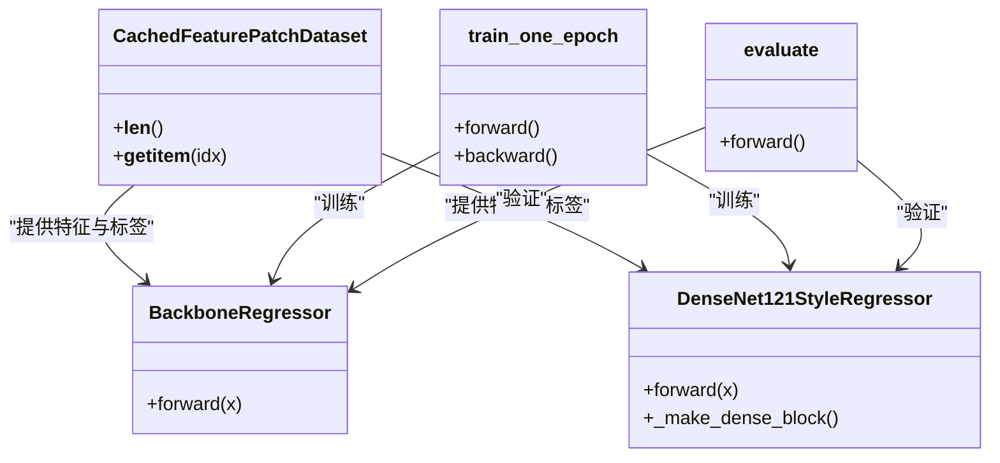
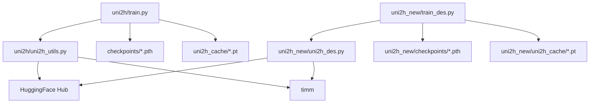

# UNI2-h+MLP训练流程

<cite>
**本文引用的文件**
- [README.md](file://README.md)
- [uni2h/train.py](file://uni2h/train.py)
- [uni2h/uni2h_utils.py](file://uni2h/uni2h_utils.py)
- [uni2h/infer.py](file://uni2h/infer.py)
- [uni2h_new/train_des.py](file://uni2h_new/train_des.py)
- [uni2h_new/uni2h_des.py](file://uni2h_new/uni2h_des.py)
- [uni2h_new/infer.py](file://uni2h_new/infer.py)
- [uni2h_new/checkpoints/HYZ15040/best_model_uni2h.history.csv](file://uni2h_new/checkpoints/HYZ15040/best_model_uni2h.history.csv)
- [HYZ15040_ssGSEA_scores_zscore.csv](file://HYZ15040_ssGSEA_scores_zscore.csv)
- [checkpoints/HYZ15040/best_model_uni2h.history.csv](file://checkpoints/HYZ15040/best_model_uni2h.history.csv)
</cite>

## 更新摘要
**变更内容**
- 目标数量从30减少到8，优化了训练效率
- 新增DenseNet121风格回归头，提升模型表达能力
- 改进评估指标，新增MAPE指标
- 增强HuggingFace集成和路径配置
- 优化特征缓存管理和训练历史记录

## 目录
1. [简介](#简介)
2. [项目结构](#项目结构)
3. [核心组件](#核心组件)
4. [架构总览](#架构总览)
5. [详细组件分析](#详细组件分析)
6. [依赖关系分析](#依赖关系分析)
7. [性能与内存优化](#性能与内存优化)
8. [故障排查指南](#故障排查指南)
9. [结论](#结论)
10. [附录：超参数与配置指南](#附录超参数与配置指南)

## 简介
本项目围绕"两阶段训练流程"展开：第一阶段使用冻结的 UNI2-h 特征提取器，将组织学切片 patch 转换为 1536 维特征向量，并缓存；第二阶段以这些特征作为输入，训练一个轻量级 MLP 多任务回归头，直接拟合 ssGSEA 通路评分。该流程显著降低计算成本，便于快速迭代与部署。

- 第一阶段（UNI2-h 特征提取与缓存）
  - 通过 Hugging Face 加载官方 UNI2-h 模型，冻结参数，使用官方预处理流水线。
  - 对训练/验证集 patch 逐一提取特征，按 patch 名称保存为 .pt 文件，形成持久化缓存。
- 第二阶段（MLP回归头训练）
  - 使用缓存的特征与标签（z-score 后的 ssGSEA 通路分数）训练简单 MLP 回归头。
  - 支持早停、学习率调度、混合精度、梯度裁剪等工程化优化。
  - **新增**：DenseNet121风格回归头，包含密集连接和过渡层，提升模型表达能力。

## 项目结构
- uni2h：两阶段流程的核心实现，包含特征提取、缓存、训练与推理。
- uni2h_new：新增的改进版本，包含 DenseNet121 风格的 MLP 回归头和 MAPE 指标。
- 数据与脚本：
  - 数据划分与 z-score 标准化脚本（split.py、zscore.py）。
  - 分析与统计输出（analyze_stats.py、data_distribution_analysis.py）。
- 缓存目录：
  - uni2h_cache：特征缓存目录，按训练/验证集划分。
  - checkpoints：模型检查点和训练历史记录。

**图表来源**
- [uni2h/train.py:52-227](file://uni2h/train.py#L52-L227)
- [uni2h/uni2h_utils.py:31-71](file://uni2h/uni2h_utils.py#L31-L71)
- [uni2h_new/train_des.py:68-301](file://uni2h_new/train_des.py#L68-L301)
- [uni2h_new/uni2h_des.py:341-447](file://uni2h_new/uni2h_des.py#L341-L447)

## 核心组件
- UNI2-h 特征提取与缓存
  - 加载官方 UNI2-h 模型与官方预处理，冻结参数，推理模式。
  - 遍历 patch 目录，对每张图提取特征并保存为 .pt 文件，支持重建缓存开关。
- CachedFeaturePatchDataset
  - 从缓存目录加载特征，按 patch 匹配标签，返回 (feature, target)。
- BackboneRegressor（MLP回归头）
  - 线性归一化 + 线性层 + GELU + Dropout + 线性输出，多任务回归。
- **新增**：DenseNet121StyleRegressor（DenseNet121风格回归头）
  - 参照 DenseNet-121 结构的多层感知机，包含密集块和过渡层，支持 MAPE 指标。
- 训练与评估循环
  - 训练：前向、Huber/L2损失、反向、梯度裁剪、优化器步进、混合精度缩放。
  - 评估：前向、计算指标（MSE、MAE、R²、PCC、**MAPE**）。
- 推理与指标导出
  - 加载 checkpoint，对新数据集进行推理，输出预测 CSV 与指标 CSV。

**章节来源**
- [uni2h/uni2h_utils.py:137-170](file://uni2h/uni2h_utils.py#L137-L170)
- [uni2h/uni2h_utils.py:173-226](file://uni2h/uni2h_utils.py#L173-L226)
- [uni2h/uni2h_utils.py:228-247](file://uni2h/uni2h_utils.py#L228-L247)
- [uni2h_new/uni2h_des.py:341-447](file://uni2h_new/uni2h_des.py#L341-L447)
- [uni2h/train.py:120-131](file://uni2h/train.py#L120-L131)
- [uni2h/train.py:137-191](file://uni2h/train.py#L137-L191)
- [uni2h/train.py:209-223](file://uni2h/train.py#L209-L223)

## 架构总览
两阶段训练流程的端到端序列如下：

**图表来源**
- [uni2h/train.py:52-227](file://uni2h/train.py#L52-L227)
- [uni2h/uni2h_utils.py:31-71](file://uni2h/uni2h_utils.py#L31-L71)
- [uni2h/uni2h_utils.py:137-170](file://uni2h/uni2h_utils.py#L137-L170)
- [uni2h/uni2h_utils.py:279-303](file://uni2h/uni2h_utils.py#L279-L303)

## 详细组件分析

### 第一阶段：UNI2-h特征提取与缓存
- 功能要点
  - 官方模型加载与冻结：通过 Hugging Face 加载 UNI2-h，设置 eval() 且 requires_grad=False。
  - 官方预处理：使用 timm 的官方数据配置与 transforms，保证与训练一致。
  - 特征提取与缓存：遍历 patch 目录，对每张图执行 transform + 前向，保存为 .pt 文件，文件名为 patch 名称（不含扩展名）。
  - 缓存重建：支持 rebuild 参数，若缓存存在则跳过，否则重新提取。
- 关键接口
  - load_uni2h_backbone：返回 backbone、transform、feature_dim。
  - extract_and_cache_features：执行特征提取与缓存。
  - CachedFeaturePatchDataset：从缓存目录读取特征并匹配标签。
- 性能与可靠性
  - 推理模式 + inference_mode 减少梯度开销。
  - 缓存文件命名与 patch 匹配，避免重复计算。
  - 缓存缺失时抛出异常，便于定位问题。

**图表来源**
- [uni2h/uni2h_utils.py:31-71](file://uni2h/uni2h_utils.py#L31-L71)
- [uni2h/uni2h_utils.py:137-170](file://uni2h/uni2h_utils.py#L137-L170)

**章节来源**
- [uni2h/uni2h_utils.py:31-71](file://uni2h/uni2h_utils.py#L31-L71)
- [uni2h/uni2h_utils.py:137-170](file://uni2h/uni2h_utils.py#L137-L170)
- [uni2h/uni2h_utils.py:173-226](file://uni2h/uni2h_utils.py#L173-L226)

### 第二阶段：MLP回归头训练
- 模型结构
  - BackboneRegressor：LayerNorm → Linear → GELU → Dropout → Linear，输出多任务分数。
  - **新增**：DenseNet121StyleRegressor：参照 DenseNet-121 结构，包含密集块和过渡层，支持 MAPE 指标。
- 数据加载
  - CachedFeaturePatchDataset：按 patch 匹配标签，返回 (feature, target)。
- 训练流程
  - 损失函数：MSE（或可替换为 Huber）。
  - 优化器：AdamW，权重衰减。
  - 学习率调度：ReduceLROnPlateau。
  - 早停：基于验证集 loss，patience 控制。
  - 混合精度：GradScaler（CUDA）。
  - 梯度裁剪：clip_grad_norm_。
- 指标计算
  - compute_metrics：MSE、MAE、**MAPE**、R²、PCC，支持多任务平均。
  - **新增**：MAPE（平均绝对百分比误差）指标计算。
  - **新增**：calculate_max_abs_diff_per_target 最大绝对差异分析。

**图表来源**
- [uni2h/uni2h_utils.py:228-247](file://uni2h/uni2h_utils.py#L228-L247)
- [uni2h_new/uni2h_des.py:341-447](file://uni2h_new/uni2h_des.py#L341-L447)
- [uni2h/uni2h_utils.py:173-226](file://uni2h/uni2h_utils.py#L173-L226)
- [uni2h_new/uni2h_des.py:512-568](file://uni2h_new/uni2h_des.py#L512-L568)

**章节来源**
- [uni2h/uni2h_utils.py:228-247](file://uni2h/uni2h_utils.py#L228-L247)
- [uni2h/uni2h_utils.py:173-226](file://uni2h/uni2h_utils.py#L173-L226)
- [uni2h/uni2h_utils.py:250-277](file://uni2h/uni2h_utils.py#L250-L277)
- [uni2h/uni2h_utils.py:279-303](file://uni2h/uni2h_utils.py#L279-L303)
- [uni2h_new/uni2h_des.py:341-447](file://uni2h_new/uni2h_des.py#L341-L447)
- [uni2h_new/uni2h_des.py:512-568](file://uni2h_new/uni2h_des.py#L512-L568)

### 数据加载与批次管理
- HisToGene 数据集（可选）
  - 从 patch 文件名解析坐标，匹配 z-score 标准化的标签，归一化到 [0, n_pos-1]。
  - 支持训练/验证共享坐标统计，保证一致性。
- UNI2-h 数据集
  - 从缓存目录读取特征，按 patch 匹配标签，支持重建缓存。
- 批次管理
  - DataLoader：shuffle、pin_memory、num_workers。
  - 非阻塞移动张量至设备，减少 CPU-GPU 传输等待。

**章节来源**
- [histogene/dataset.py:23-118](file://histogene/dataset.py#L23-L118)
- [uni2h/uni2h_utils.py:173-226](file://uni2h/uni2h_utils.py#L173-L226)
- [histogene/train.py:222-230](file://histogene/train.py#L222-L230)
- [uni2h/train.py:102-115](file://uni2h/train.py#L102-L115)

### 推理与指标导出
- HisToGene 推理
  - 加载 checkpoint，重建模型结构与参数，对指定 patch 目录进行推理，输出预测 CSV 与逐通路指标。
- UNI2-h 推理
  - 加载 checkpoint，重建回归头，对指定 split 的 patch 进行特征提取与缓存，再进行推理，输出预测与指标 CSV。

**章节来源**
- [histogene/infer.py:66-169](file://histogene/infer.py#L66-L169)
- [uni2h/infer.py:43-175](file://uni2h/infer.py#L43-L175)

## 依赖关系分析
- 外部依赖
  - HuggingFace Hub：加载 UNI2-h 模型。
  - timm：官方数据配置与 transforms。
  - PyTorch：模型、优化器、混合精度、数据加载。
  - scikit-learn：指标计算（MSE、MAE、R²、PCC、**MAPE**）。
- 内部模块
  - uni2h/train.py 依赖 uni2h/uni2h_utils.py。
  - uni2h_new/train_des.py 依赖 uni2h_new/uni2h_des.py。
  - 推理脚本依赖各自模块与 utils。

**图表来源**
- [uni2h/train.py:12-21](file://uni2h/train.py#L12-L21)
- [uni2h/uni2h_utils.py:12-16](file://uni2h/uni2h_utils.py#L12-L16)
- [uni2h_new/train_des.py:12-25](file://uni2h_new/train_des.py#L12-L25)
- [uni2h_new/uni2h_des.py:12-16](file://uni2h_new/uni2h_des.py#L12-L16)

**章节来源**
- [uni2h/train.py:12-21](file://uni2h/train.py#L12-L21)
- [uni2h/uni2h_utils.py:12-16](file://uni2h/uni2h_utils.py#L12-L16)
- [uni2h_new/train_des.py:12-25](file://uni2h_new/train_des.py#L12-L25)
- [uni2h_new/uni2h_des.py:12-16](file://uni2h_new/uni2h_des.py#L12-L16)

## 性能与内存优化
- 混合精度训练
  - 使用 GradScaler（CUDA），在不牺牲精度的前提下显著降低显存占用与加速训练。
- 梯度裁剪
  - clip_grad_norm_ 限制梯度范数，提升稳定性。
- 非阻塞数据传输
  - DataLoader 与张量移动设置 non_blocking=True，减少等待时间。
- 缓存复用
  - 特征缓存避免重复前向，显著缩短训练与推理时间。
- 数据加载策略
  - pin_memory 在 GPU 可用时启用，提高数据搬运效率。
  - num_workers 在 Windows 上设为 0（兼容性考虑），Linux 可适当增大。

**章节来源**
- [histogene/train.py:197-199](file://histogene/train.py#L197-L199)
- [histogene/train.py:124-127](file://histogene/train.py#L124-L127)
- [uni2h/train.py:128-131](file://uni2h/train.py#L128-L131)
- [uni2h/train.py:107-115](file://uni2h/train.py#L107-L115)

## 故障排查指南
- HuggingFace 登录失败
  - 确认 HF_TOKEN 或环境变量 HUGGINGFACE_HUB_TOKEN/HF_TOKEN 设置正确。
- 缓存文件缺失
  - CachedFeaturePatchDataset 在缓存缺失时抛出 FileNotFoundError，检查 cache_root 与 rebuild 参数。
- 标签列不匹配
  - CachedFeaturePatchDataset 与 z-score CSV 的列范围不一致会导致错误，核对 target_start_col 与 num_targets。
- 设备不匹配
  - 确保 checkpoint 与模型结构参数一致，推理时 map_location 正确。
- 数据集为空
  - 若 patch 目录中没有匹配的 PNG 文件或标签映射为空，会报错，检查路径与文件名。

**章节来源**
- [uni2h/uni2h_utils.py:24-29](file://uni2h/uni2h_utils.py#L24-L29)
- [uni2h/uni2h_utils.py:205-207](file://uni2h/uni2h_utils.py#L205-L207)
- [uni2h/infer.py:48-56](file://uni2h/infer.py#L48-L56)

## 结论
两阶段训练流程以 UNI2-h 作为特征提取器，结合轻量级 MLP 回归头，实现了高效、稳定且可复现的多任务回归训练。通过特征缓存与工程化优化（混合精度、早停、学习率调度、梯度裁剪），在有限资源下获得良好性能与可维护性。**新增的 DenseNet121 风格回归头和 MAPE 指标进一步提升了模型表达能力和评估精度**。目标数量从30减少到8的优化使得训练更加高效，同时保持了良好的预测性能。建议优先采用该流程，并根据下游任务进一步扩展与定制。

## 附录：超参数与配置指南
- 第一阶段（UNI2-h 特征提取）
  - cache_root：特征缓存根目录（建议与数据集划分同名子目录）。
  - rebuild_cache：是否重建缓存（首次或变更预处理时使用）。
  - hf_token：HuggingFace 访问令牌。
- 第二阶段（MLP回归头）
  - batch_size：建议 128–512，依据显存调整。
  - num_epochs：建议 50–200，配合早停。
  - learning_rate：建议 1e-3–1e-4，AdamW + weight_decay。
  - hidden_dim：建议 128–512，视数据复杂度与显存。
  - dropout：建议 0.1–0.3。
  - early_stop_patience：建议 5–20。
  - num_workers：Windows 默认 0，Linux 可设为 2–8。
  - min_delta：验证集 loss 至少下降幅度阈值。
- **新增**：DenseNet121 风格回归头参数
  - initial_dim：初始投影维度，建议 256。
  - growth_rate：增长速率，建议 32。
  - bottleneck_factor：瓶颈因子，建议 4。
  - transition_factor：过渡因子，建议 0.5。
  - **目标数量**：从30减少到8，提升训练效率。
- 数据与标签
  - labels_csv：z-score 标准化后的 ssGSEA 通路分数 CSV。
  - target_start_col、num_targets：从 CSV 中选择目标列的起始与数量。
  - **注意**：目标数量已从30减少到8。
- 模型保存与恢复
  - best_model_uni2h.pth：包含模型状态字典、超参数、缓存目录等。
  - 推理时通过 checkpoint_path 加载，自动重建回归头。

**章节来源**
- [uni2h/train.py:26-49](file://uni2h/train.py#L26-L49)
- [uni2h/uni2h_utils.py:173-226](file://uni2h/uni2h_utils.py#L173-L226)
- [uni2h/infer.py:24-41](file://uni2h/infer.py#L24-L41)
- [uni2h_new/train_des.py:32-65](file://uni2h_new/train_des.py#L32-L65)
- [uni2h_new/uni2h_des.py:341-447](file://uni2h_new/uni2h_des.py#L341-L447)
- [uni2h_new/uni2h_des.py:21-22](file://uni2h_new/uni2h_des.py#L21-L22)
- [uni2h/uni2h_utils.py:22](file://uni2h/uni2h_utils.py#L22)