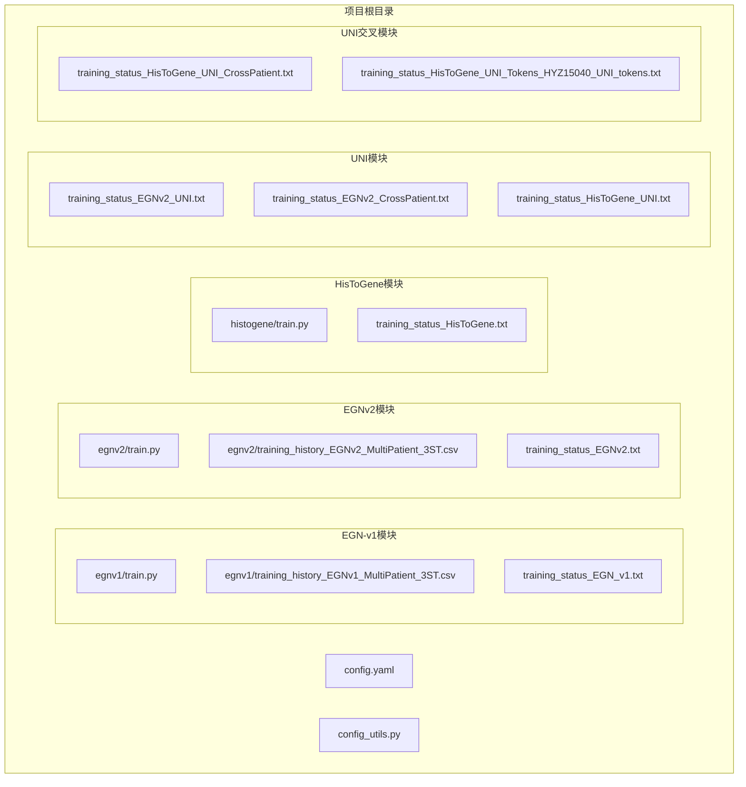
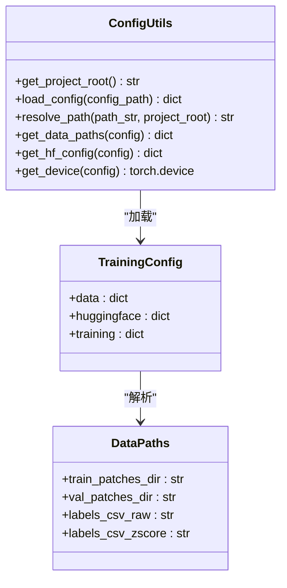
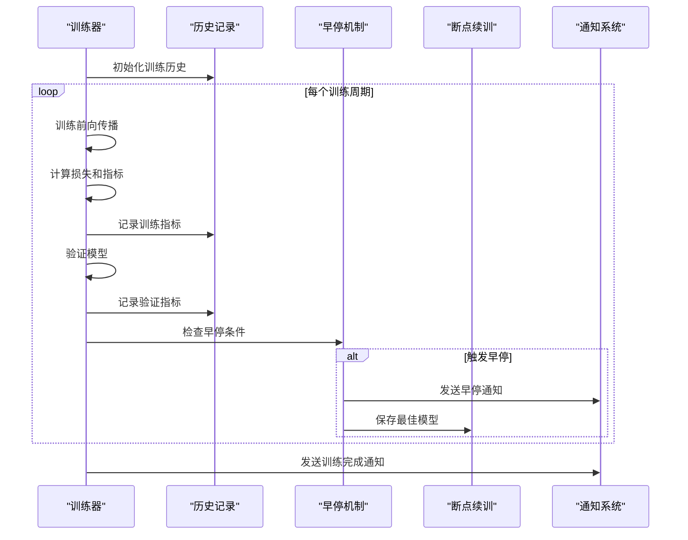
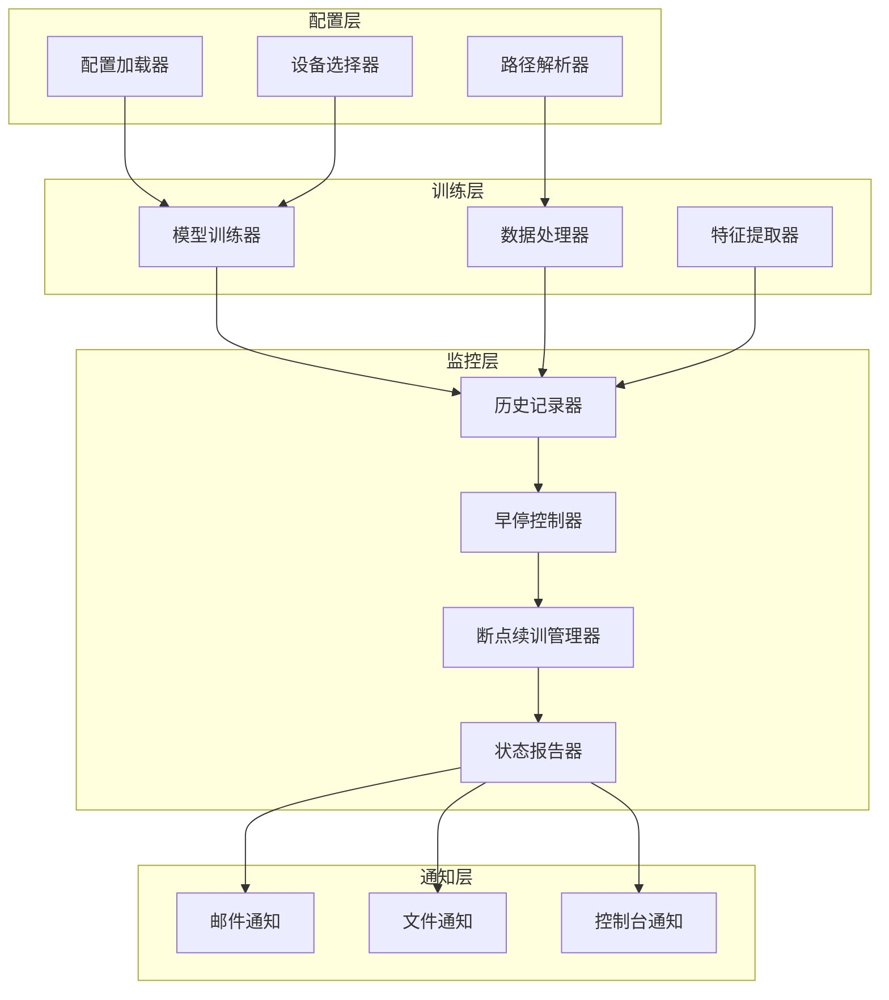
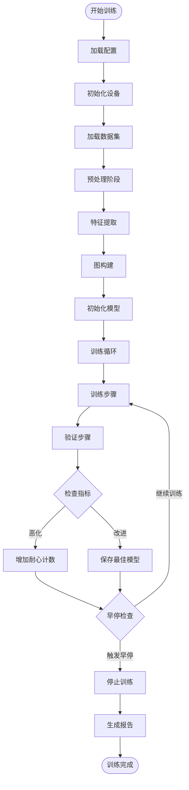
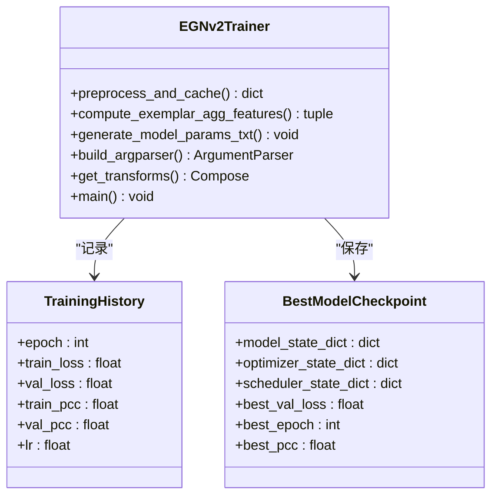
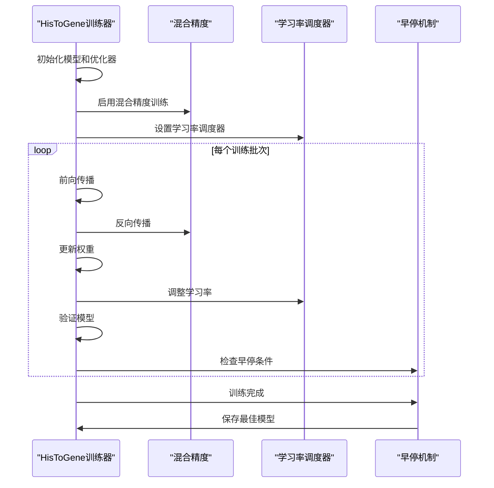
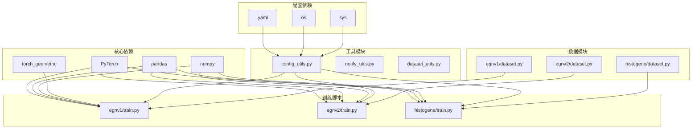

# 训练状态监控

<cite>
**本文档引用的文件**
- [training_status_EGN_v1.txt](file://training_status_EGN_v1.txt)
- [training_status_EGNv2.txt](file://training_status_EGNv2.txt)
- [training_status_HisToGene.txt](file://training_status_HisToGene.txt)
- [training_status_EGNv2_UNI.txt](file://training_status_EGNv2_UNI.txt)
- [training_status_EGNv2_CrossPatient.txt](file://training_status_EGNv2_CrossPatient.txt)
- [training_status_HisToGene_UNI.txt](file://training_status_HisToGene_UNI.txt)
- [training_status_HisToGene_UNI_CrossPatient.txt](file://training_status_HisToGene_UNI_CrossPatient.txt)
- [training_status_HisToGene_UNI_Tokens_HYZ15040_UNI_tokens.txt](file://training_status_HisToGene_UNI_Tokens_HYZ15040_UNI_tokens.txt)
- [config.yaml](file://config.yaml)
- [config_utils.py](file://config_utils.py)
- [egnv1/train.py](file://egnv1/train.py)
- [egnv2/train.py](file://egnv2/train.py)
- [histogene/train.py](file://histogene/train.py)
- [egnv1/training_history_EGNv1_MultiPatient_3ST.csv](file://egnv1/training_history_EGNv1_MultiPatient_3ST.csv)
- [egnv2/training_history_EGNv2_MultiPatient_3ST.csv](file://egnv2/training_history_EGNv2_MultiPatient_3ST.csv)
</cite>

## 目录
1. [简介](#简介)
2. [项目结构](#项目结构)
3. [核心组件](#核心组件)
4. [架构概览](#架构概览)
5. [详细组件分析](#详细组件分析)
6. [依赖关系分析](#依赖关系分析)
7. [性能考虑](#性能考虑)
8. [故障排除指南](#故障排除指南)
9. [结论](#结论)

## 简介

本项目是一个基于深度学习的空间转录组学与病理学联合分析系统，专注于训练状态监控和结果可视化。项目实现了多个版本的训练脚本，包括EGN-v1、EGNv2、HisToGene等模型，以及相应的训练状态监控机制。

训练状态监控系统提供了完整的训练过程跟踪，包括：
- 实时训练进度显示
- 验证指标监控
- 早停机制
- 断点续训支持
- 训练历史记录
- 结果可视化报告生成

## 项目结构

项目采用模块化的组织结构，每个主要模型都有独立的训练脚本和配置文件：

**图表来源**
- [config.yaml](file://config.yaml)
- [config_utils.py](file://config_utils.py)
- [egnv1/train.py](file://egnv1/train.py)
- [egnv2/train.py](file://egnv2/train.py)
- [histogene/train.py](file://histogene/train.py)

**章节来源**
- [config.yaml](file://config.yaml)
- [config_utils.py](file://config_utils.py)

## 核心组件

### 配置管理系统

配置系统提供了统一的配置管理机制，支持多种配置源和路径解析：

**图表来源**
- [config_utils.py](file://config_utils.py)

### 训练监控系统

训练监控系统实现了完整的训练生命周期管理：

**图表来源**
- [egnv1/train.py](file://egnv1/train.py)
- [egnv2/train.py](file://egnv2/train.py)
- [histogene/train.py](file://histogene/train.py)

**章节来源**
- [config_utils.py](file://config_utils.py)
- [egnv1/train.py](file://egnv1/train.py)
- [egnv2/train.py](file://egnv2/train.py)
- [histogene/train.py](file://histogene/train.py)

## 架构概览

项目采用了分层架构设计，实现了高度模块化的训练监控系统：

**图表来源**
- [config_utils.py](file://config_utils.py)
- [egnv1/train.py](file://egnv1/train.py)
- [egnv2/train.py](file://egnv2/train.py)
- [histogene/train.py](file://histogene/train.py)

## 详细组件分析

### EGN-v1 训练监控

EGN-v1实现了完整的训练监控流程，包括特征提取、图构建和模型训练：

**图表来源**
- [egnv1/train.py](file://egnv1/train.py)

**章节来源**
- [egnv1/train.py](file://egnv1/train.py)
- [egnv1/training_history_EGNv1_MultiPatient_3ST.csv](file://egnv1/training_history_EGNv1_MultiPatient_3ST.csv)

### EGNv2 训练监控

EGNv2在EGN-v1基础上进行了优化，采用了不同的特征提取策略：

**图表来源**
- [egnv2/train.py](file://egnv2/train.py)

**章节来源**
- [egnv2/train.py](file://egnv2/train.py)
- [egnv2/training_history_EGNv2_MultiPatient_3ST.csv](file://egnv2/training_history_EGNv2_MultiPatient_3ST.csv)

### HisToGene 训练监控

HisToGene实现了基于Vision Transformer的训练监控系统：

**图表来源**
- [histogene/train.py](file://histogene/train.py)

**章节来源**
- [histogene/train.py](file://histogene/train.py)

### 训练状态文件分析

项目提供了多种训练状态文件，用于记录不同模型的训练结果：

| 模型类型 | 状态文件 | 训练时长 | 最佳验证PCC | 训练状态 |
|---------|----------|----------|-------------|----------|
| EGN-v1 | training_status_EGN_v1.txt | 150轮 | 0.2460 | completed |
| EGNv2 | training_status_EGNv2.txt | 115轮 | 0.4245 | early_stop |
| HisToGene | training_status_HisToGene.txt | 39轮 | 0.5569 | early_stop |
| EGNv2_UNI | training_status_EGNv2_UNI.txt | 150轮 | 0.6075 | completed |
| HisToGene_UNI | training_status_HisToGene_UNI.txt | 18轮 | 0.5336 | early_stop |

**章节来源**
- [training_status_EGN_v1.txt](file://training_status_EGN_v1.txt)
- [training_status_EGNv2.txt](file://training_status_EGNv2.txt)
- [training_status_HisToGene.txt](file://training_status_HisToGene.txt)
- [training_status_EGNv2_UNI.txt](file://training_status_EGNv2_UNI.txt)
- [training_status_HisToGene_UNI.txt](file://training_status_HisToGene_UNI.txt)

## 依赖关系分析

项目中的组件依赖关系如下：

**图表来源**
- [egnv1/train.py](file://egnv1/train.py)
- [egnv2/train.py](file://egnv2/train.py)
- [histogene/train.py](file://histogene/train.py)
- [config_utils.py](file://config_utils.py)

**章节来源**
- [egnv1/train.py](file://egnv1/train.py)
- [egnv2/train.py](file://egnv2/train.py)
- [histogene/train.py](file://histogene/train.py)
- [config_utils.py](file://config_utils.py)

## 性能考虑

### 训练效率优化

1. **混合精度训练**: HisToGene模块支持CUDA混合精度训练，可显著提升训练速度
2. **早停机制**: 所有模型都实现了早停机制，避免无效训练
3. **断点续训**: 支持训练中断后的自动恢复
4. **批量处理**: 优化的数据加载和批处理策略

### 内存管理

1. **特征缓存**: EGN-v1和EGNv2实现了特征提取缓存机制
2. **梯度裁剪**: 防止梯度爆炸问题
3. **设备选择**: 自动检测和选择最优训练设备

## 故障排除指南

### 常见问题及解决方案

| 问题类型 | 症状描述 | 解决方案 |
|---------|----------|----------|
| 配置文件错误 | 配置加载失败 | 检查config.yaml格式和路径 |
| 设备不可用 | CUDA设备检测失败 | 检查GPU驱动和CUDA版本 |
| 数据路径错误 | 数据集加载失败 | 验证数据路径配置 |
| 内存不足 | 训练过程中内存溢出 | 调整batch_size或使用混合精度 |
| 训练中断 | 训练意外停止 | 检查断点续训文件和权限 |

### 日志分析

训练日志包含了详细的训练信息，可通过以下字段进行分析：
- `epoch`: 当前训练轮次
- `train_loss/val_loss`: 训练和验证损失
- `train_pcc/val_pcc`: 训练和验证PCC相关系数
- `lr`: 当前学习率
- `patience_counter`: 早停耐心计数器

**章节来源**
- [egnv1/train.py](file://egnv1/train.py)
- [egnv2/train.py](file://egnv2/train.py)
- [histogene/train.py](file://histogene/train.py)

## 结论

本训练状态监控系统提供了完整的机器学习训练生命周期管理，具有以下特点：

1. **模块化设计**: 每个模型都有独立的训练脚本和监控机制
2. **自动化程度高**: 支持自动配置、自动设备选择、自动早停
3. **可扩展性强**: 易于添加新的模型和监控指标
4. **可视化完善**: 自动生成训练历史和结果报告
5. **可靠性高**: 支持断点续训和多种错误处理机制

该系统为空间转录组学和病理学研究提供了强大的技术支持，能够有效监控和优化各种深度学习模型的训练过程。