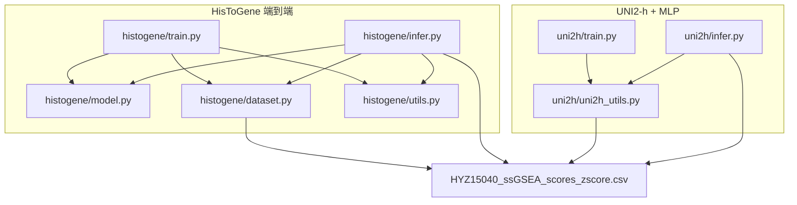
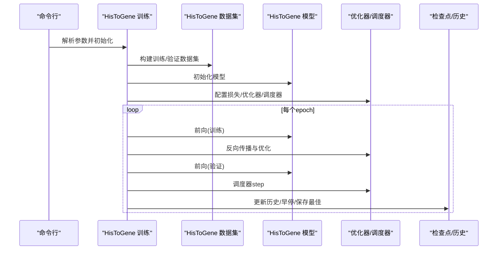
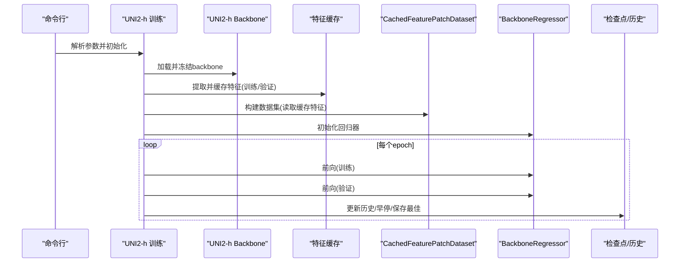
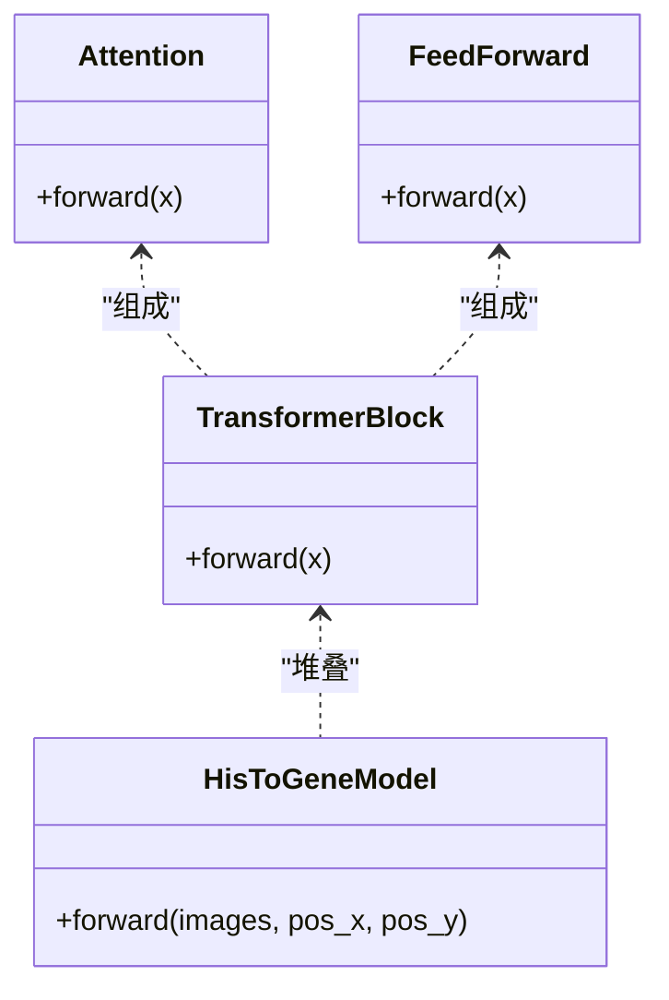
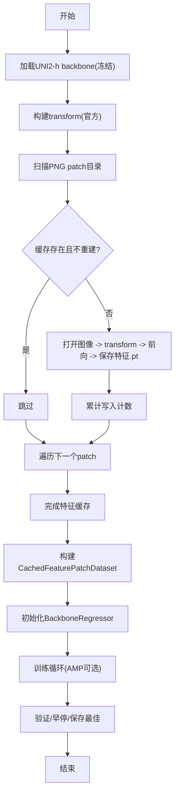
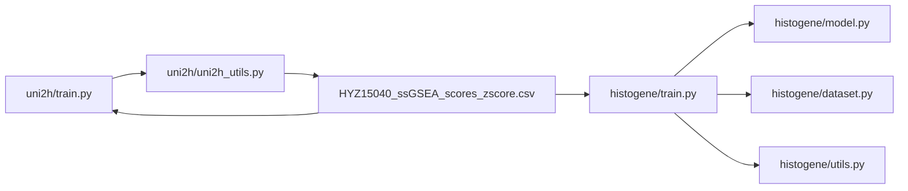

# 训练系统

<cite>
**本文引用的文件**
- [histogene/train.py](file://histogene/train.py)
- [histogene/model.py](file://histogene/model.py)
- [histogene/dataset.py](file://histogene/dataset.py)
- [histogene/utils.py](file://histogene/utils.py)
- [uni2h/train.py](file://uni2h/train.py)
- [uni2h/uni2h_utils.py](file://uni2h/uni2h_utils.py)
- [uni2h/infer.py](file://uni2h/infer.py)
- [README.md](file://README.md)
- [HYZ15040_ssGSEA_scores_zscore.csv](file://HYZ15040_ssGSEA_scores_zscore.csv)
</cite>

## 目录
1. [简介](#简介)
2. [项目结构](#项目结构)
3. [核心组件](#核心组件)
4. [架构总览](#架构总览)
5. [详细组件分析](#详细组件分析)
6. [依赖关系分析](#依赖关系分析)
7. [性能与资源](#性能与资源)
8. [训练配置与参数](#训练配置与参数)
9. [可视化与日志](#可视化与日志)
10. [故障排查](#故障排查)
11. [结论](#结论)

## 简介
本训练系统面向空间转录组与组织学图像的联合建模任务，提供两条训练路径：
- HisToGene 端到端训练：直接以组织学图像为输入，通过视觉Transformer回归ssGSEA通路评分，支持混合精度、早停与学习率调度。
- UNI2-h + MLP 两阶段训练：冻结UNI2-h特征提取器，先缓存特征，再用轻量MLP回归器拟合目标评分，显著降低显存与训练时间。

系统同时提供推理脚本与指标输出，便于评估与复现实验。

## 项目结构
- histogene：HisToGene 端到端训练与推理
  - train.py：训练入口，含数据加载、模型、优化器、早停、日志与检查点保存
  - model.py：HisToGene 模型（ViT-MLP变体，带分离坐标位置编码）
  - dataset.py：图像数据集适配器（PNG patch + 坐标 + 标签）
  - utils.py：指标计算（MSE、MAE、R²、PCC）
  - infer.py：推理入口（加载训练好的checkpoint，输出逐通路指标与CSV）
- uni2h：UNI2-h + MLP 两阶段训练与推理
  - train.py：两阶段训练主流程（特征提取缓存 + MLP回归器训练）
  - uni2h_utils.py：UNI2-h backbone加载、特征提取与缓存、数据集、回归器、指标计算、训练/验证辅助
  - infer.py：推理入口（加载缓存特征与回归器，输出指标与CSV）
- 数据与脚本
  - README.md：环境与使用说明
  - HYZ15040_ssGSEA_scores_zscore.csv：标准化后的标签文件

图表来源
- [histogene/train.py:174-338](file://histogene/train.py#L174-L338)
- [histogene/model.py:64-160](file://histogene/model.py#L64-L160)
- [histogene/dataset.py:23-118](file://histogene/dataset.py#L23-L118)
- [histogene/utils.py:20-31](file://histogene/utils.py#L20-L31)
- [uni2h/train.py:52-227](file://uni2h/train.py#L52-L227)
- [uni2h/uni2h_utils.py:31-303](file://uni2h/uni2h_utils.py#L31-L303)
- [uni2h/infer.py:43-175](file://uni2h/infer.py#L43-L175)

章节来源
- [README.md:1-44](file://README.md#L1-L44)

## 核心组件
- HisToGene 端到端训练
  - 模型：基于ViT的编码器，带分离X/Y坐标嵌入与CLS token回归头
  - 数据集：从PNG patch文件名解析坐标，匹配标签CSV，归一化到[0, n_pos-1]
  - 训练循环：Huber损失、AdamW优化器、ReduceLROnPlateau调度、早停、混合精度
  - 日志：每10轮写入CSV，保存最佳checkpoint
- UNI2-h + MLP 两阶段训练
  - 第一阶段：加载UNI2-h backbone（冻结参数），对训练/验证集提取并缓存特征
  - 第二阶段：CachedFeaturePatchDataset读取缓存特征，BackboneRegressor（MLP）回归
  - 训练循环：MSE损失、AdamW优化器、ReduceLROnPlateau调度、早停
  - 日志：保存历史与最佳checkpoint

章节来源
- [histogene/train.py:106-172](file://histogene/train.py#L106-L172)
- [histogene/model.py:64-160](file://histogene/model.py#L64-L160)
- [histogene/dataset.py:23-118](file://histogene/dataset.py#L23-L118)
- [histogene/utils.py:20-31](file://histogene/utils.py#L20-L31)
- [uni2h/train.py:52-227](file://uni2h/train.py#L52-L227)
- [uni2h/uni2h_utils.py:137-303](file://uni2h/uni2h_utils.py#L137-L303)

## 架构总览
两条训练流的总体控制流如下：

图表来源
- [histogene/train.py:174-338](file://histogene/train.py#L174-L338)
- [histogene/dataset.py:23-118](file://histogene/dataset.py#L23-L118)
- [histogene/model.py:64-160](file://histogene/model.py#L64-L160)

图表来源
- [uni2h/train.py:52-227](file://uni2h/train.py#L52-L227)
- [uni2h/uni2h_utils.py:31-303](file://uni2h/uni2h_utils.py#L31-L303)

## 详细组件分析

### HisToGene 端到端训练
- 模型结构要点
  - Patch Embedding + LayerNorm + Linear + LayerNorm
  - 分离X/Y位置嵌入（Embedding），加到CLS token上
  - ViT式位置嵌入（pos_embedding），叠加到patch序列
  - 多层Transformer Block（自注意力 + FFN），LayerNorm + 残差
  - 归纳头：LayerNorm + Linear + GELU + Dropout + Linear（输出n_targets）
- 损失函数与优化器
  - HuberLoss（delta=1.0），对异常值更鲁棒
  - AdamW（weight_decay=1e-4），梯度裁剪（max_norm=1.0）
  - ReduceLROnPlateau（min，factor=0.5，patience=5）
- 早停机制
  - 以验证损失为指标，超过耐心次数则停止
- 数据增强与批处理
  - 训练时随机水平翻转、垂直翻转、旋转；推理时仅Resize/Normalize
  - DataLoader：pin_memory按设备类型自动开启；Windows下num_workers=0
- 混合精度
  - AMP GradScaler，仅CUDA生效

图表来源
- [histogene/model.py:12-62](file://histogene/model.py#L12-L62)
- [histogene/model.py:64-160](file://histogene/model.py#L64-L160)

章节来源
- [histogene/model.py:64-160](file://histogene/model.py#L64-L160)
- [histogene/train.py:106-172](file://histogene/train.py#L106-L172)
- [histogene/train.py:249-255](file://histogene/train.py#L249-L255)
- [histogene/train.py:320-324](file://histogene/train.py#L320-L324)

### UNI2-h + MLP 两阶段训练
- 第一阶段：特征提取与缓存
  - 加载UNI2-h backbone（冻结参数），官方transform
  - 对训练/验证集逐图提取特征，保存为.pt文件，按patch stem命名
  - 支持重建缓存（rebuild_cache）
- 第二阶段：回归模型训练
  - CachedFeaturePatchDataset：读取缓存特征与标签，按patch匹配
  - BackboneRegressor：LayerNorm + Linear + GELU + Dropout + Linear
  - 训练/验证：MSE + AdamW + ReduceLROnPlateau + 早停
- 数据集与标签
  - 标签CSV中从指定列起取固定数量targets（默认8）

图表来源
- [uni2h/uni2h_utils.py:137-170](file://uni2h/uni2h_utils.py#L137-L170)
- [uni2h/uni2h_utils.py:173-226](file://uni2h/uni2h_utils.py#L173-L226)
- [uni2h/train.py:52-227](file://uni2h/train.py#L52-L227)

章节来源
- [uni2h/uni2h_utils.py:31-71](file://uni2h/uni2h_utils.py#L31-L71)
- [uni2h/uni2h_utils.py:137-170](file://uni2h/uni2h_utils.py#L137-L170)
- [uni2h/uni2h_utils.py:173-226](file://uni2h/uni2h_utils.py#L173-L226)
- [uni2h/train.py:52-227](file://uni2h/train.py#L52-L227)

### 数据加载器与数据增强
- HisToGene
  - 文件名解析坐标（x_y），匹配标签CSV
  - 坐标归一化到[0, n_pos-1]，作为Embedding索引
  - 训练时随机翻转/旋转，推理时仅Resize/Normalize
- UNI2-h
  - CachedFeaturePatchDataset：按patch stem匹配标签，读取缓存特征
  - 支持特征归一化（注释掉），可按需启用

章节来源
- [histogene/dataset.py:15-118](file://histogene/dataset.py#L15-L118)
- [uni2h/uni2h_utils.py:173-226](file://uni2h/uni2h_utils.py#L173-L226)

## 依赖关系分析
- 模块内聚与耦合
  - HisToGene：train.py高度集成（数据、模型、训练循环、日志），模块内聚高；与utils解耦良好
  - UNI2-h：train.py与uni2h_utils.py强耦合（特征提取、数据集、回归器），但功能边界清晰
- 外部依赖
  - PyTorch、torchvision、PIL、Pandas、NumPy、Scikit-learn、timm、huggingface_hub
- 可能的循环依赖
  - 未发现直接循环导入；各模块职责单一

图表来源
- [histogene/train.py:24-26](file://histogene/train.py#L24-L26)
- [uni2h/train.py:12-21](file://uni2h/train.py#L12-L21)
- [HYZ15040_ssGSEA_scores_zscore.csv](file://HYZ15040_ssGSEA_scores_zscore.csv)

章节来源
- [histogene/train.py:24-26](file://histogene/train.py#L24-L26)
- [uni2h/train.py:12-21](file://uni2h/train.py#L12-L21)

## 性能与资源
- 设备选择
  - 自动检测CUDA可用性；若不可用则回退CPU
- 混合精度
  - HisToGene：AMP GradScaler（仅CUDA），减少显存占用，加速收敛
  - UNI2-h：未启用AMP，特征提取阶段backbone已冻结，主要瓶颈在CPU侧
- 批大小与工作进程
  - HisToGene：默认batch_size=64；num_workers=0（Windows兼容）
  - UNI2-h：默认batch_size=256；num_workers=0（Windows兼容）
- 内存管理
  - HisToGene：pin_memory按设备类型开启；非阻塞传输；GradScaler缩放梯度
  - UNI2-h：特征缓存于磁盘，避免重复计算；推理时按需加载

章节来源
- [histogene/train.py:194-201](file://histogene/train.py#L194-L201)
- [histogene/train.py:222-230](file://histogene/train.py#L222-L230)
- [uni2h/train.py:102-115](file://uni2h/train.py#L102-L115)

## 训练配置与参数
- HisToGene 端到端
  - 关键参数
    - 训练：batch_size、num_epochs、lr、num_workers、amp
    - 模型：img_size、patch_size、model_dim、model_depth、heads、mlp_dim、n_pos、n_targets、dropout
    - 早停：early_stop_patience
  - 损失与优化
    - HuberLoss，AdamW(weight_decay=1e-4)，ReduceLROnPlateau(min, factor=0.5, patience=5)
  - 学习率调度：ReduceLROnPlateau
  - 早停：验证损失未下降达到耐心次数即停止
- UNI2-h + MLP
  - 关键参数
    - 训练：batch_size、num_epochs、learning_rate、num_workers、hidden_dim、dropout、early_stop_patience、min_delta、rebuild_cache
    - 标签：target_start_col、num_targets
  - 损失与优化
    - MSE，AdamW(weight_decay=1e-4)，ReduceLROnPlateau(min, factor=0.5, patience=5)
  - 早停：验证损失未下降达到耐心次数即停止

章节来源
- [histogene/train.py:47-80](file://histogene/train.py#L47-L80)
- [histogene/train.py:249-255](file://histogene/train.py#L249-L255)
- [uni2h/train.py:26-49](file://uni2h/train.py#L26-L49)
- [uni2h/train.py:128-131](file://uni2h/train.py#L128-L131)

## 可视化与日志
- HisToGene
  - 屏幕打印：每轮训练/验证指标（loss、MAE、R²、PCC）、学习率、耗时
  - 历史CSV：每10轮写入一次，最终保存
  - 最佳模型：验证损失最优时保存checkpoint
- UNI2-h
  - 屏幕打印：每轮训练/验证指标（loss、MAE、R²、PCC）、学习率
  - 历史CSV：每轮写入一次，最终保存
  - 最佳模型：验证损失最优时保存checkpoint

章节来源
- [histogene/train.py:282-331](file://histogene/train.py#L282-L331)
- [uni2h/train.py:144-214](file://uni2h/train.py#L144-L214)

## 故障排查
- 数据路径错误
  - HisToGene：训练/验证目录不存在或标签文件缺失，会直接退出
  - UNI2-h：特征缓存缺失时会报错，需先执行特征提取或允许重建
- 设备与CUDA
  - 若CUDA不可用，系统自动回退CPU；如需GPU，请确认驱动与CUDA版本匹配
- 数据加载
  - Windows下num_workers建议设为0；否则可能出现fork问题
- 标签列范围
  - UNI2-h：target_start_col与num_targets需与标签CSV列数匹配，否则抛出异常
- 指标异常
  - 当标签或预测为常数时，R²可能为NaN；系统已做保护处理

章节来源
- [histogene/train.py:177-188](file://histogene/train.py#L177-L188)
- [uni2h/uni2h_utils.py:190-194](file://uni2h/uni2h_utils.py#L190-L194)
- [uni2h/uni2h_utils.py:216-225](file://uni2h/uni2h_utils.py#L216-L225)

## 结论
本训练系统提供了两条高效可行的训练路径：
- HisToGene 端到端适合直接从图像回归通路评分，具备良好的鲁棒性与可解释性
- UNI2-h + MLP 两阶段训练在大规模数据场景下显著降低显存与训练成本，适合快速迭代与部署

两条路径均提供完善的日志、早停与检查点机制，并配套推理脚本，便于实验复现与生产落地。