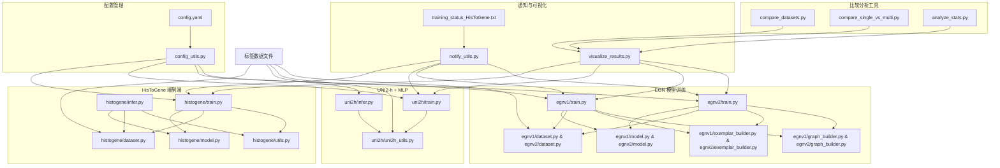
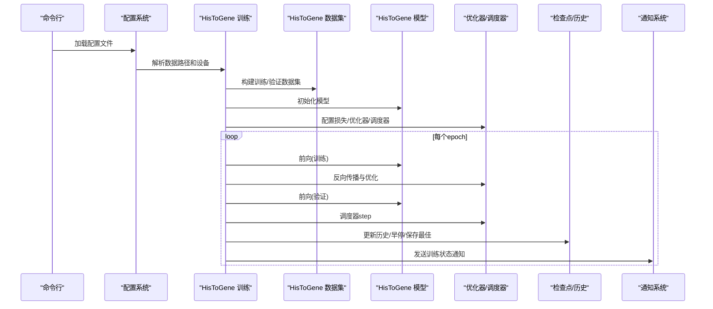
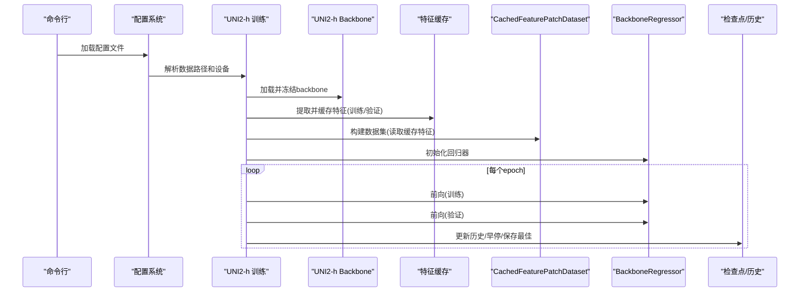
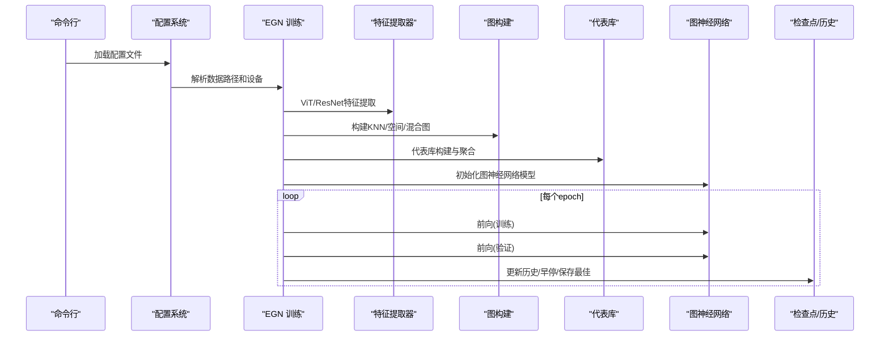
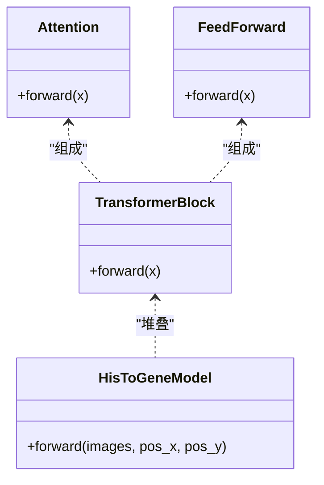
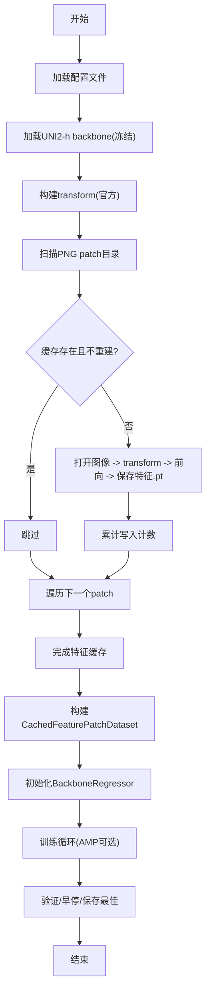
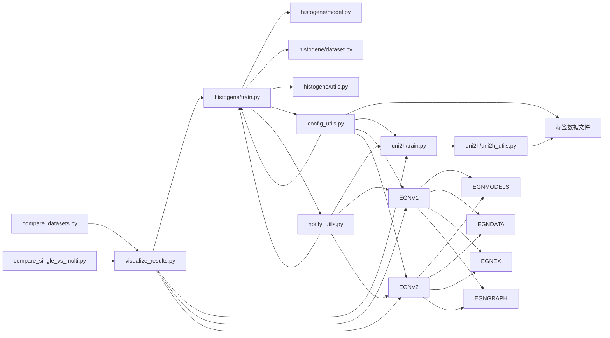

# 训练系统

<cite>
**本文引用的文件**
- [histogene/train.py](file://histogene/train.py)
- [histogene/model.py](file://histogene/model.py)
- [histogene/dataset.py](file://histogene/dataset.py)
- [histogene/utils.py](file://histogene/utils.py)
- [uni2h/train.py](file://uni2h/train.py)
- [uni2h/uni2h_utils.py](file://uni2h/uni2h_utils.py)
- [uni2h/infer.py](file://uni2h/infer.py)
- [config_utils.py](file://config_utils.py)
- [config.yaml](file://config.yaml)
- [notify_utils.py](file://notify_utils.py)
- [visualize_results.py](file://visualize_results.py)
- [README.md](file://README.md)
- [training_status_HisToGene.txt](file://training_status_HisToGene.txt)
- [compare_datasets.py](file://compare_datasets.py)
- [compare_single_vs_multi.py](file://compare_single_vs_multi.py)
- [analyze_stats.py](file://analyze_stats.py)
- [egnv1/train.py](file://egnv1/train.py)
- [egnv2/train.py](file://egnv2/train.py)
- [egnv1/training_history_EGNv1_MultiPatient_3ST.csv](file://egnv1/training_history_EGNv1_MultiPatient_3ST.csv)
- [egnv2/training_history_EGNv2_MultiPatient_3ST.csv](file://egnv2/training_history_EGNv2_MultiPatient_3ST.csv)
- [histogene/training_history_MultiPatient_3ST.csv](file://histogene/training_history_MultiPatient_3ST.csv)
- [run_egnv1_multi_3st.ps1](file://run_egnv1_multi_3st.ps1)
</cite>

## 更新摘要
**变更内容**
- 新增多患者训练能力，支持EGN-v1/v2模型的联合训练
- 新增EGN模型训练流程，包含ViT特征提取和图神经网络
- 新增比较工具使用方法，支持三数据集对比和单患者vs多患者对比
- 新增训练历史监控功能，提供详细的训练过程可视化
- 增强训练通知系统，支持多模型训练状态监控

## 目录
1. [简介](#简介)
2. [项目结构](#项目结构)
3. [核心组件](#核心组件)
4. [架构总览](#架构总览)
5. [详细组件分析](#详细组件分析)
6. [依赖关系分析](#依赖关系分析)
7. [性能与资源](#性能与资源)
8. [训练配置与参数](#训练配置与参数)
9. [可视化与日志](#可视化与日志)
10. [比较工具使用](#比较工具使用)
11. [故障排查](#故障排查)
12. [结论](#结论)

## 简介
本训练系统面向空间转录组与组织学图像的联合建模任务，提供三条训练路径：
- **HisToGene 端到端训练**：直接以组织学图像为输入，通过视觉Transformer回归ssGSEA通路评分，支持混合精度、早停、学习率调度、断点续训和训练通知。
- **UNI2-h + MLP 两阶段训练**：冻结UNI2-h特征提取器，先缓存特征，再用轻量MLP回归器拟合目标评分，显著降低显存与训练时间，支持特征缓存重建和自动目标检测。
- **EGN模型训练**：基于图神经网络的多模态融合训练，支持ViT特征提取、图构建、多患者联合训练，提供完整的训练历史监控和可视化报告。

系统同时提供完整的配置管理、通知机制、可视化报告、比较分析工具和推理脚本，便于评估与复现实验。

## 项目结构
- **histogene**：HisToGene 端到端训练与推理
  - train.py：训练入口，含数据加载、模型、优化器、早停、日志与检查点保存
  - model.py：HisToGene 模型（ViT-MLP变体，带分离坐标位置编码）
  - dataset.py：图像数据集适配器（PNG patch + 坐标 + 标签）
  - utils.py：指标计算（MSE、MAE、R²、PCC）
  - infer.py：推理入口（加载训练好的checkpoint，输出逐通路指标与CSV）
- **uni2h**：UNI2-h + MLP 两阶段训练与推理
  - train.py：两阶段训练主流程（特征提取缓存 + MLP回归器训练）
  - uni2h_utils.py：UNI2-h backbone加载、特征提取与缓存、数据集、回归器、指标计算、训练/验证辅助
  - infer.py：推理入口（加载缓存特征与回归器，输出指标与CSV）
- **egnv1/egnv2**：EGN模型训练系统
  - train.py：EGN-v1/v2训练主流程，支持多患者联合训练
  - model.py：EGN模型架构（ViT/ResNet特征提取 + 图神经网络）
  - dataset.py：EGN数据集适配器（patch + 图构建）
  - exemplar_builder.py：代表库构建与特征聚合
  - graph_builder.py：图构建算法（KNN/空间/混合）
  - utils.py：指标计算与训练辅助
- **比较分析工具**
  - compare_datasets.py：三数据集训练结果对比可视化
  - compare_single_vs_multi.py：单患者vs多患者联合训练对比分析
  - analyze_stats.py：数据统计分析工具
- **配置与工具**
  - config_utils.py：统一配置管理，支持路径解析、设备选择
  - config.yaml：项目配置文件，支持服务器迁移
  - notify_utils.py：训练通知系统，支持系统通知和状态文件
  - visualize_results.py：训练结果可视化，生成综合报告
  - 数据与脚本
  - README.md：环境与使用说明
  - training_status_HisToGene.txt：训练状态文件

**图表来源**
- [config_utils.py:17-47](file://config_utils.py#L17-L47)
- [histogene/train.py:35-47](file://histogene/train.py#L35-L47)
- [uni2h/train.py:12-21](file://uni2h/train.py#L12-L21)
- [egnv1/train.py:153-218](file://egnv1/train.py#L153-L218)
- [egnv2/train.py:143-201](file://egnv2/train.py#L143-L201)
- [compare_datasets.py:18-37](file://compare_datasets.py#L18-L37)
- [compare_single_vs_multi.py:28-46](file://compare_single_vs_multi.py#L28-L46)
- [analyze_stats.py:1-40](file://analyze_stats.py#L1-L40)

## 核心组件
- **HisToGene 端到端训练**
  - 模型：基于ViT的编码器，带分离X/Y坐标嵌入与CLS token回归头
  - 数据集：从PNG patch文件名解析坐标，匹配标签CSV，归一化到[0, n_pos-1]
  - 训练循环：Huber损失、AdamW优化器、ReduceLROnPlateau调度、早停、混合精度
  - 日志：每10轮写入CSV，保存最佳checkpoint，支持断点续训
- **UNI2-h + MLP 两阶段训练**
  - 第一阶段：加载UNI2-h backbone（冻结参数），对训练/验证集提取并缓存特征
  - 第二阶段：CachedFeaturePatchDataset读取缓存特征，BackboneRegressor（MLP）回归
  - 训练循环：MSE损失、AdamW优化器、ReduceLROnPlateau调度、早停
  - 日志：保存历史与最佳checkpoint，支持特征缓存重建
- **EGN模型训练**
  - 特征提取：ViT-ResNet特征提取器，支持冻结层配置
  - 图构建：KNN图、空间图或混合图构建
  - 多患者联合训练：支持多个患者数据集的联合训练
  - 训练循环：Huber损失、AdamW优化器、ReduceLROnPlateau调度、早停
  - 日志：完整的训练历史监控，支持断点续训
- **比较分析工具**
  - 三数据集对比：HisToGene在HYZ15040、JFX0729、LMZ12939三个数据集上的对比分析
  - 单患者vs多患者对比：分析联合训练的优势与增益
  - 统计分析：数据分布与正态性检验
- **配置管理系统**
  - 统一配置文件加载，支持路径解析和设备选择
  - 支持服务器迁移，无需修改代码
- **通知系统**
  - 训练完成/中断通知，支持系统Toast通知
  - 状态文件记录，便于监控训练状态
- **可视化系统**
  - 训练曲线、参数面板、指标表格、PCC柱状图
  - 综合报告生成，支持逐通路分析

**章节来源**
- [histogene/train.py:106-172](file://histogene/train.py#L106-L172)
- [histogene/model.py:64-160](file://histogene/model.py#L64-L160)
- [histogene/dataset.py:23-118](file://histogene/dataset.py#L23-L118)
- [histogene/utils.py:20-31](file://histogene/utils.py#L20-L31)
- [uni2h/train.py:52-227](file://uni2h/train.py#L52-L227)
- [uni2h/uni2h_utils.py:137-303](file://uni2h/uni2h_utils.py#L137-L303)
- [egnv1/train.py:278-354](file://egnv1/train.py#L278-L354)
- [egnv2/train.py:261-322](file://egnv2/train.py#L261-L322)
- [compare_datasets.py:83-107](file://compare_datasets.py#L83-L107)
- [compare_single_vs_multi.py:557-625](file://compare_single_vs_multi.py#L557-L625)
- [config_utils.py:49-89](file://config_utils.py#L49-L89)
- [notify_utils.py:10-50](file://notify_utils.py#L10-L50)
- [visualize_results.py:206-800](file://visualize_results.py#L206-L800)

## 架构总览
三条训练流的总体控制流如下：

**图表来源**
- [histogene/train.py:183-511](file://histogene/train.py#L183-L511)
- [histogene/dataset.py:23-118](file://histogene/dataset.py#L23-L118)
- [histogene/model.py:64-160](file://histogene/model.py#L64-L160)
- [notify_utils.py:10-50](file://notify_utils.py#L10-L50)

**图表来源**
- [uni2h/train.py:52-227](file://uni2h/train.py#L52-L227)
- [uni2h/uni2h_utils.py:31-303](file://uni2h/uni2h_utils.py#L31-L303)
- [config_utils.py:142-179](file://config_utils.py#L142-L179)

**图表来源**
- [egnv1/train.py:356-410](file://egnv1/train.py#L356-L410)
- [egnv2/train.py:339-391](file://egnv2/train.py#L339-L391)
- [config_utils.py:216-257](file://config_utils.py#L216-L257)

## 详细组件分析

### HisToGene 端到端训练
- **模型结构要点**
  - Patch Embedding + LayerNorm + Linear + LayerNorm
  - 分离X/Y位置嵌入（Embedding），加到CLS token上
  - ViT式位置嵌入（pos_embedding），叠加到patch序列
  - 多层Transformer Block（自注意力 + FFN），LayerNorm + 残差
  - 归纳头：LayerNorm + Linear + GELU + Dropout + Linear（输出n_targets）
- **损失函数与优化器**
  - HuberLoss（delta=1.0），对异常值更鲁棒
  - AdamW（weight_decay=1e-4），梯度裁剪（max_norm=1.0）
  - ReduceLROnPlateau（min，factor=0.5，patience=5）
- **早停机制**
  - 以验证损失为指标，超过耐心次数则停止
- **断点续训**
  - 支持从最佳模型和恢复检查点恢复训练
  - 保存优化器状态、调度器状态、梯度缩放器状态
- **训练暂停/恢复**
  - 支持检测PAUSE_TRAINING信号文件
  - 自动保存恢复检查点并退出
- **数据增强与批处理**
  - 训练时随机水平翻转、垂直翻转、旋转；推理时仅Resize/Normalize
  - DataLoader：pin_memory按设备类型自动开启；Windows下num_workers=0
  - 混合精度：AMP GradScaler，仅CUDA生效

**图表来源**
- [histogene/model.py:12-62](file://histogene/model.py#L12-L62)
- [histogene/model.py:64-160](file://histogene/model.py#L64-L160)

**章节来源**
- [histogene/model.py:64-160](file://histogene/model.py#L64-L160)
- [histogene/train.py:106-172](file://histogene/train.py#L106-L172)
- [histogene/train.py:249-255](file://histogene/train.py#L249-L255)
- [histogene/train.py:320-324](file://histogene/train.py#L320-L324)
- [histogene/train.py:277-312](file://histogene/train.py#L277-L312)
- [histogene/train.py:391-414](file://histogene/train.py#L391-L414)

### UNI2-h + MLP 两阶段训练
- **第一阶段：特征提取与缓存**
  - 加载UNI2-h backbone（冻结参数），官方transform
  - 对训练/验证集逐图提取特征，保存为.pt文件，按patch stem命名
  - 支持重建缓存（rebuild_cache）
  - 自动目标检测：从标签CSV自动推断目标列范围
- **第二阶段：回归模型训练**
  - CachedFeaturePatchDataset：读取缓存特征与标签，按patch匹配
  - BackboneRegressor：LayerNorm + Linear + GELU + Dropout + Linear
  - 训练/验证：MSE + AdamW + ReduceLROnPlateau + 早停
- **数据集与标签**
  - 标签CSV中从指定列起取固定数量targets（默认8）
  - 支持特征归一化（注释掉），可按需启用

**图表来源**
- [uni2h/uni2h_utils.py:137-170](file://uni2h/uni2h_utils.py#L137-L170)
- [uni2h/uni2h_utils.py:173-226](file://uni2h/uni2h_utils.py#L173-L226)
- [uni2h/train.py:52-227](file://uni2h/train.py#L52-L227)

**章节来源**
- [uni2h/uni2h_utils.py:31-71](file://uni2h/uni2h_utils.py#L31-L71)
- [uni2h/uni2h_utils.py:137-170](file://uni2h/uni2h_utils.py#L137-L170)
- [uni2h/uni2h_utils.py:173-226](file://uni2h/uni2h_utils.py#L173-L226)
- [uni2h/train.py:52-227](file://uni2h/train.py#L52-L227)

### EGN模型训练系统
- **多患者联合训练**
  - 支持多个患者数据集的联合训练，自动合并训练集和验证集
  - 参数配置：--multi_patient、--patient_dirs、--patient_val_dirs、--patient_csvs、--patient_names
  - 自动推断患者名称，支持自定义命名
- **特征提取与图构建**
  - EGN-v1：ViT-Large特征提取器（dim=1024），GCN图卷积
  - EGN-v2：ResNet-50特征提取器（dim=2048），GraphSAGE图卷积
  - 支持KNN图、空间图、混合图构建
- **代表库构建**
  - Exemplar Library：通过K-means聚类构建代表库
  - Exemplar Aggregation：计算每个节点的代表特征聚合
- **训练流程**
  - 预处理：特征提取 → 图构建 → 代表库构建
  - 训练：HuberLoss + AdamW + ReduceLROnPlateau + 早停
  - 推理：加载最佳模型，生成预测结果和可视化报告

**章节来源**
- [egnv1/train.py:278-354](file://egnv1/train.py#L278-L354)
- [egnv1/train.py:356-410](file://egnv1/train.py#L356-L410)
- [egnv2/train.py:261-322](file://egnv2/train.py#L261-L322)
- [egnv2/train.py:339-391](file://egnv2/train.py#L339-L391)

### 比较分析工具
- **三数据集对比工具**
  - compare_datasets.py：分析HisToGene在HYZ15040、JFX0729、LMZ12939三个数据集上的表现
  - 生成总体性能对比面板、逐通路PCC对比、热力图和综合报告
  - 支持中文字体设置和自动生成报告
- **单患者vs多患者对比工具**
  - compare_single_vs_multi.py：分析单患者训练vs多患者联合训练的效果
  - 生成总体对比、逐通路PCC对比、增益分析和综合报告
  - 提供详细的统计分析和可视化图表
- **统计分析工具**
  - analyze_stats.py：对ssGSEA数据进行统计分析，包括描述性统计、正态性检验等

**章节来源**
- [compare_datasets.py:83-107](file://compare_datasets.py#L83-L107)
- [compare_datasets.py:480-546](file://compare_datasets.py#L480-L546)
- [compare_single_vs_multi.py:557-625](file://compare_single_vs_multi.py#L557-L625)
- [analyze_stats.py:1-40](file://analyze_stats.py#L1-L40)

### 配置管理系统
- **统一配置文件**
  - config.yaml：支持数据路径、HuggingFace配置、训练设备配置
  - 支持相对路径和绝对路径，自动解析为绝对路径
  - 支持服务器迁移，无需修改代码
- **配置加载机制**
  - 支持多种加载方式：显式路径、环境变量、自动搜索
  - 自动向上搜索项目根目录，直到找到config.yaml
  - 提供配置验证和错误处理
- **设备管理**
  - 自动检测CUDA可用性
  - 支持强制CPU/GPU模式
  - 提供详细的错误信息

**章节来源**
- [config.yaml:1-32](file://config.yaml#L1-L32)
- [config_utils.py:49-89](file://config_utils.py#L49-L89)
- [config_utils.py:142-179](file://config_utils.py#L142-L179)
- [config_utils.py:216-257](file://config_utils.py#L216-L257)

### 通知系统
- **训练完成通知**
  - 写入状态文件，记录模型名称、状态、时间、最佳指标
  - 发送系统Toast通知（需要plyer库）
  - 控制台醒目输出训练结果
- **训练中断通知**
  - 记录异常信息和中断时间
  - 发送错误通知
- **暂停信号机制**
  - 检测PAUSE_TRAINING信号文件
  - 自动保存恢复检查点并退出
  - 支持手动暂停和恢复

**章节来源**
- [notify_utils.py:10-50](file://notify_utils.py#L10-L50)
- [notify_utils.py:52-80](file://notify_utils.py#L52-L80)
- [notify_utils.py:99-128](file://notify_utils.py#L99-L128)

### 可视化系统
- **训练曲线可视化**
  - Loss、MAE、R²、PCC四合一图表
  - 标注最佳验证PCC对应的epoch
  - 支持训练历史文件读取
- **参数面板**
  - 深色背景的参数展示面板
  - 类似IDE代码块的样式
  - 支持模型参数导出
- **指标表格**
  - 逐通路指标表格（MSE、MAE、R²、PCC）
  - R²和PCC列使用红→绿渐变色编码
  - 包含mean汇总行
- **PCC柱状图**
  - 横轴通路名，纵轴PCC值
  - 柱子颜色按PCC大小从红到绿着色
  - 添加均值水平线
- **综合报告**
  - 将四个可视化部分合成一张综合报告图
  - 支持A4纵向比例布局
  - 包含参数面板、训练曲线、指标表格、PCC柱状图

**章节来源**
- [visualize_results.py:206-800](file://visualize_results.py#L206-L800)
- [visualize_results.py:128-186](file://visualize_results.py#L128-L186)
- [visualize_results.py:210-278](file://visualize_results.py#L210-L278)
- [visualize_results.py:284-360](file://visualize_results.py#L284-L360)
- [visualize_results.py:366-450](file://visualize_results.py#L366-L450)
- [visualize_results.py:456-521](file://visualize_results.py#L456-L521)
- [visualize_results.py:527-800](file://visualize_results.py#L527-L800)

### 数据加载器与数据增强
- **HisToGene**
  - 文件名解析坐标（x_y），匹配标签CSV
  - 坐标归一化到[0, n_pos-1]，作为Embedding索引
  - 训练时随机翻转/旋转，推理时仅Resize/Normalize
- **UNI2-h**
  - CachedFeaturePatchDataset：按patch stem匹配标签，读取缓存特征
  - 支持特征归一化（注释掉），可按需启用
  - 自动目标检测：从标签CSV自动推断目标列范围
- **EGN模型**
  - EGNv1Dataset/EGNv2Dataset：支持多患者联合训练的数据集
  - 自动合并多个患者的训练集和验证集
  - 保持目标列的一致性

**章节来源**
- [histogene/dataset.py:15-118](file://histogene/dataset.py#L15-L118)
- [uni2h/uni2h_utils.py:173-226](file://uni2h/uni2h_utils.py#L173-L226)
- [uni2h/uni2h_utils.py:174-196](file://uni2h/uni2h_utils.py#L174-L196)
- [egnv1/train.py:322-336](file://egnv1/train.py#L322-L336)
- [egnv2/train.py:305-319](file://egnv2/train.py#L305-L319)

## 依赖关系分析
- **模块内聚与耦合**
  - HisToGene：train.py高度集成（数据、模型、训练循环、日志），模块内聚高；与utils解耦良好
  - UNI2-h：train.py与uni2h_utils.py强耦合（特征提取、数据集、回归器），但功能边界清晰
  - EGN模型：train.py与多个模块耦合（特征提取、图构建、代表库），但采用模块化设计
  - 比较工具：独立模块，与训练系统松耦合
  - 配置系统：config_utils.py独立管理，被其他模块广泛使用
- **外部依赖**
  - PyTorch、torchvision、PIL、Pandas、NumPy、Scikit-learn、timm、huggingface_hub
  - matplotlib、numpy、pandas（可视化）
  - plyer（系统通知，可选）
  - torch_geometric（EGN模型）
- **可能的循环依赖**
  - 未发现直接循环导入；各模块职责单一

**图表来源**
- [histogene/train.py:24-29](file://histogene/train.py#L24-L29)
- [uni2h/train.py:12-21](file://uni2h/train.py#L12-L21)
- [egnv1/train.py:40-49](file://egnv1/train.py#L40-L49)
- [egnv2/train.py:31-40](file://egnv2/train.py#L31-L40)
- [config_utils.py:35-47](file://config_utils.py#L35-L47)
- [notify_utils.py:29](file://notify_utils.py#L29)

**章节来源**
- [histogene/train.py:24-29](file://histogene/train.py#L24-L29)
- [uni2h/train.py:12-21](file://uni2h/train.py#L12-L21)
- [egnv1/train.py:40-49](file://egnv1/train.py#L40-L49)
- [egnv2/train.py:31-40](file://egnv2/train.py#L31-L40)

## 性能与资源
- **设备选择**
  - 自动检测CUDA可用性；若不可用则回退CPU
  - 支持强制CPU/GPU模式
- **混合精度**
  - HisToGene：AMP GradScaler（仅CUDA），减少显存占用，加速收敛
  - UNI2-h：未启用AMP，特征提取阶段backbone已冻结，主要瓶颈在CPU侧
  - EGN模型：根据backbone类型选择合适的混合精度策略
- **批大小与工作进程**
  - HisToGene：默认batch_size=64；num_workers=0（Windows兼容）
  - UNI2-h：默认batch_size=256；num_workers=0（Windows兼容）
  - EGN-v1：默认batch_size=16（ViT显存大）；EGN-v2：默认batch_size=64
- **内存管理**
  - HisToGene：pin_memory按设备类型开启；非阻塞传输；GradScaler缩放梯度
  - UNI2-h：特征缓存于磁盘，避免重复计算；推理时按需加载
  - EGN模型：特征提取器支持冻结层，减少显存占用
- **检查点管理**
  - 支持最佳模型保存和恢复检查点保存
  - 自动清理临时文件
  - 支持断点续训

**章节来源**
- [histogene/train.py:194-201](file://histogene/train.py#L194-L201)
- [histogene/train.py:222-230](file://histogene/train.py#L222-L230)
- [uni2h/train.py:102-115](file://uni2h/train.py#L102-L115)
- [egnv1/train.py:168-172](file://egnv1/train.py#L168-L172)
- [egnv2/train.py:158-159](file://egnv2/train.py#L158-L159)
- [config_utils.py:216-257](file://config_utils.py#L216-L257)

## 训练配置与参数
- **HisToGene 端到端**
  - **关键参数**
    - 训练：batch_size、num_epochs、lr、num_workers、amp
    - 模型：img_size、patch_size、model_dim、model_depth、heads、mlp_dim、n_pos、n_targets、dropout
    - 早停：early_stop_patience
    - 检查点：resume（断点续训路径）
  - **损失与优化**
    - HuberLoss，AdamW(weight_decay=1e-4)，ReduceLROnPlateau(min, factor=0.5, patience=5)
  - **学习率调度**：ReduceLROnPlateau
  - **早停**：验证损失未下降达到耐心次数即停止
  - **断点续训**：支持从最佳模型和恢复检查点恢复
- **UNI2-h + MLP**
  - **关键参数**
    - 训练：batch_size、num_epochs、learning_rate、num_workers、hidden_dim、dropout、early_stop_patience、min_delta、rebuild_cache
    - 标签：target_start_col、num_targets
  - **损失与优化**
    - MSE，AdamW(weight_decay=1e-4)，ReduceLROnPlateau(min, factor=0.5, patience=5)
  - **早停**：验证损失未下降达到耐心次数即停止
  - **特征缓存**：支持重建缓存，避免重复计算
- **EGN模型训练**
  - **关键参数**
    - 训练：batch_size、num_epochs、lr、early_stop_patience
    - 模型：backbone、graph_type、graph_layers、hidden_dim、k_neighbors、n_exemplars、radius、n_targets、dropout、freeze_layers、weight_decay
    - 多患者：--multi_patient、--patient_dirs、--patient_val_dirs、--patient_csvs、--patient_names
  - **损失与优化**
    - HuberLoss，AdamW(weight_decay=1e-4)，ReduceLROnPlateau(min, factor=0.5, patience=5)
  - **早停**：验证损失未下降达到耐心次数即停止
  - **断点续训**：支持从最佳模型和恢复检查点恢复
- **配置系统**
  - **数据路径**：支持相对路径和绝对路径
  - **HuggingFace**：支持token配置和本地缓存
  - **设备选择**：支持auto/cuda/cpu模式

**章节来源**
- [histogene/train.py:47-80](file://histogene/train.py#L47-L80)
- [histogene/train.py:249-255](file://histogene/train.py#L249-L255)
- [uni2h/train.py:26-49](file://uni2h/train.py#L26-L49)
- [uni2h/train.py:128-131](file://uni2h/train.py#L128-L131)
- [egnv1/train.py:153-218](file://egnv1/train.py#L153-L218)
- [egnv2/train.py:143-201](file://egnv2/train.py#L143-L201)
- [config.yaml:8-32](file://config.yaml#L8-L32)

## 可视化与日志
- **HisToGene**
  - 屏幕打印：每轮训练/验证指标（loss、MAE、R²、PCC）、学习率、耗时
  - 历史CSV：每10轮写入一次，最终保存
  - 最佳模型：验证损失最优时保存checkpoint
  - 训练后处理：自动生成完整可视化报告
- **UNI2-h**
  - 屏幕打印：每轮训练/验证指标（loss、MAE、R²、PCC）、学习率
  - 历史CSV：每轮写入一次，最终保存
  - 最佳模型：验证损失最优时保存checkpoint
  - 推理输出：保存逐通路指标和预测结果
- **EGN模型**
  - 屏幕打印：每轮训练/验证指标（loss、MAE、R²、PCC）、学习率、图信息
  - 历史CSV：每轮写入一次，最终保存
  - 最佳模型：验证损失最优时保存checkpoint
  - 推理输出：生成predictions.csv和完整可视化报告
  - 训练历史监控：详细的训练过程可视化
- **比较分析工具**
  - 三数据集对比：生成总体性能对比面板、逐通路PCC对比、热力图和综合报告
  - 单患者vs多患者对比：生成总体对比、逐通路PCC对比、增益分析和综合报告
  - 统计分析：数据分布、正态性检验等
- **可视化系统**
  - 训练曲线、参数面板、指标表格、PCC柱状图
  - 综合报告生成，支持逐通路分析
  - 自动文件命名和目录管理

**章节来源**
- [histogene/train.py:282-331](file://histogene/train.py#L282-L331)
- [uni2h/train.py:144-214](file://uni2h/train.py#L144-L214)
- [egnv1/train.py:561-598](file://egnv1/train.py#L561-L598)
- [egnv2/train.py:540-577](file://egnv2/train.py#L540-L577)
- [compare_datasets.py:507-546](file://compare_datasets.py#L507-L546)
- [compare_single_vs_multi.py:592-625](file://compare_single_vs_multi.py#L592-L625)
- [visualize_results.py:206-800](file://visualize_results.py#L206-L800)

## 比较工具使用
- **三数据集对比工具使用**
  - 运行命令：python compare_datasets.py
  - 功能：分析HisToGene在HYZ15040、JFX0729、LMZ12939三个数据集上的表现
  - 输出：总体性能对比面板、逐通路PCC对比、热力图和综合报告
  - 配置：可在代码中修改数据集配置和输出目录
- **单患者vs多患者对比工具使用**
  - 运行命令：python compare_single_vs_multi.py
  - 功能：分析单患者训练vs多患者联合训练的效果
  - 输出：总体对比、逐通路PCC对比、增益分析和综合报告
  - 统计：提供详细的统计分析和可视化图表
- **统计分析工具使用**
  - 运行命令：python analyze_stats.py
  - 功能：对ssGSEA数据进行统计分析
  - 输出：描述性统计、正态性检验、异常值分析等
- **多患者训练脚本**
  - EGN-v1多患者训练：run_egnv1_multi_3st.ps1
  - 支持三个数据集的联合训练
  - 自动配置训练参数和数据路径

**章节来源**
- [compare_datasets.py:480-546](file://compare_datasets.py#L480-L546)
- [compare_single_vs_multi.py:557-625](file://compare_single_vs_multi.py#L557-L625)
- [analyze_stats.py:1-40](file://analyze_stats.py#L1-L40)
- [run_egnv1_multi_3st.ps1:1-34](file://run_egnv1_multi_3st.ps1#L1-L34)

## 故障排查
- **配置文件问题**
  - config.yaml不存在：自动向上搜索项目根目录
  - 路径解析错误：检查相对路径是否基于项目根目录
  - 设备配置无效：检查CUDA可用性和配置值
- **数据路径错误**
  - HisToGene：训练/验证目录不存在或标签文件缺失，会直接退出
  - UNI2-h：特征缓存缺失时会报错，需先执行特征提取或允许重建
  - EGN模型：多患者训练时患者目录数量不一致会报错
- **设备与CUDA**
  - 若CUDA不可用，系统自动回退CPU；如需GPU，请确认驱动与CUDA版本匹配
- **数据加载**
  - Windows下num_workers建议设为0；否则可能出现fork问题
- **标签列范围**
  - UNI2-h：target_start_col与num_targets需与标签CSV列数匹配，否则抛出异常
- **训练暂停**
  - 创建PAUSE_TRAINING文件触发暂停，系统自动保存恢复检查点
  - 清除文件后可继续训练
- **通知系统**
  - 缺少plyer库时，系统会自动降级为文本通知
  - 状态文件可用于监控训练状态
- **指标异常**
  - 当标签或预测为常数时，R²可能为NaN；系统已做保护处理
- **多患者训练问题**
  - 确保所有患者目录的数量一致
  - 检查标签CSV格式和通路名称一致性
  - 验证数据路径正确性

**章节来源**
- [config_utils.py:17-47](file://config_utils.py#L17-L47)
- [histogene/train.py:177-188](file://histogene/train.py#L177-L188)
- [uni2h/uni2h_utils.py:190-194](file://uni2h/uni2h_utils.py#L190-L194)
- [uni2h/uni2h_utils.py:216-225](file://uni2h/uni2h_utils.py#L216-L225)
- [egnv1/train.py:284-291](file://egnv1/train.py#L284-L291)
- [egnv2/train.py:267-274](file://egnv2/train.py#L267-L274)
- [notify_utils.py:99-128](file://notify_utils.py#L99-L128)

## 结论
本训练系统提供了三条高效可行的训练路径，经过重大增强后具备以下优势：
- **HisToGene 端到端**适合直接从图像回归通路评分，具备良好的鲁棒性与可解释性，支持断点续训和训练通知
- **UNI2-h + MLP**两阶段训练在大规模数据场景下显著降低显存与训练成本，适合快速迭代与部署，支持特征缓存重建和自动目标检测
- **EGN模型训练**提供基于图神经网络的多模态融合训练，支持ViT特征提取、图构建、多患者联合训练，提供完整的训练历史监控和可视化报告
- **多患者训练能力**：支持EGN-v1/v2模型的联合训练，提高模型泛化能力和稳定性
- **比较分析工具**：提供三数据集对比和单患者vs多患者对比分析，帮助理解不同训练策略的效果
- **统一配置管理**：支持服务器迁移，无需修改代码
- **智能通知系统**：支持系统通知和状态文件记录
- **完整可视化**：提供训练结果综合报告
- **健壮的错误处理**：支持训练暂停/恢复和断点续训

三条路径均提供完善的日志、早停与检查点机制，并配套推理脚本，便于实验复现与生产落地。新的配置管理和通知系统大大提升了系统的易用性和可靠性。比较分析工具为模型选择和训练策略优化提供了有力支持。