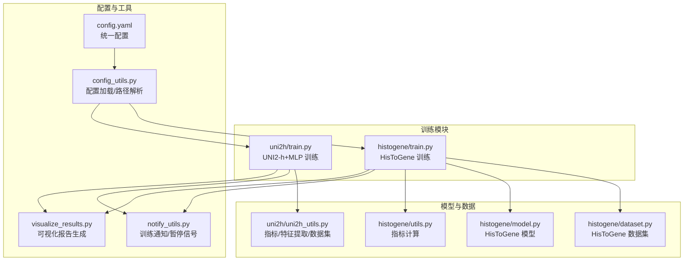
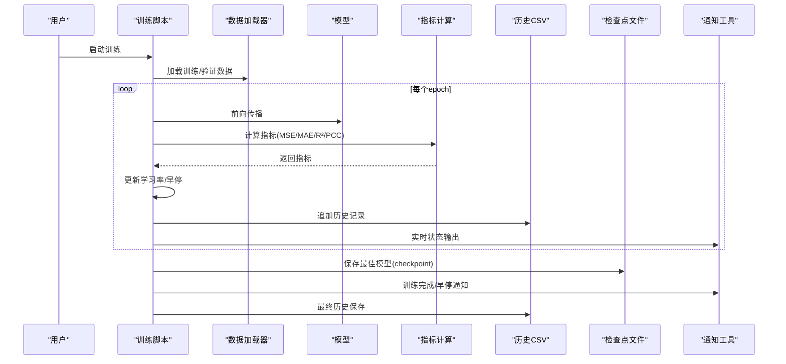
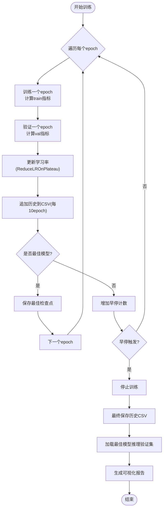
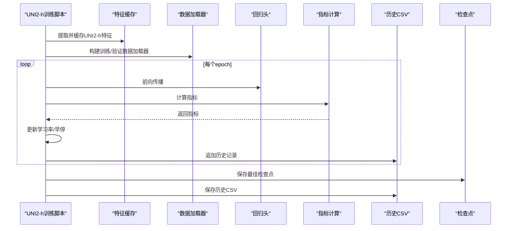
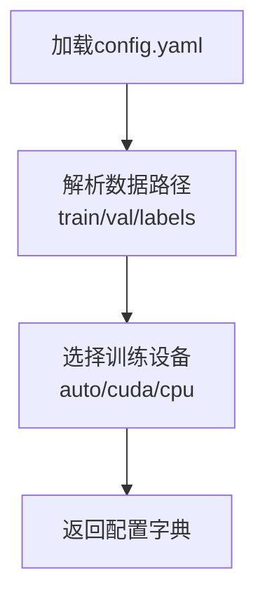
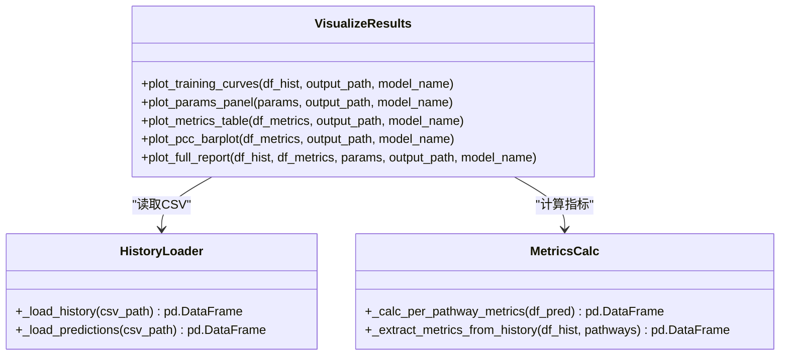
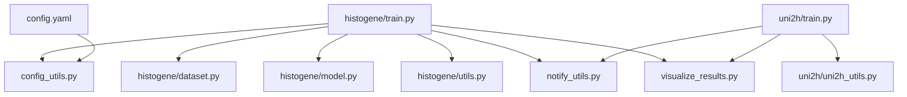

# 训练进度查看指南

<cite>
**本文档引用的文件**
- [训练进度查看指南.md](file://训练进度查看指南.md)
- [README.md](file://README.md)
- [histogene/train.py](file://histogene/train.py)
- [uni2h/train.py](file://uni2h/train.py)
- [visualize_results.py](file://visualize_results.py)
- [config_utils.py](file://config_utils.py)
- [notify_utils.py](file://notify_utils.py)
- [histogene/utils.py](file://histogene/utils.py)
- [uni2h/uni2h_utils.py](file://uni2h/uni2h_utils.py)
- [histogene/dataset.py](file://histogene/dataset.py)
- [histogene/model.py](file://histogene/model.py)
- [config.yaml](file://config.yaml)
</cite>

## 目录
1. [简介](#简介)
2. [项目结构概览](#项目结构概览)
3. [核心组件](#核心组件)
4. [架构总览](#架构总览)
5. [详细组件分析](#详细组件分析)
6. [依赖关系分析](#依赖关系分析)
7. [性能考虑](#性能考虑)
8. [故障排除指南](#故障排除指南)
9. [结论](#结论)

## 简介
本指南面向 PFMval 项目的训练进度查看与监控，涵盖实时训练输出、历史记录 CSV、检查点文件、可视化报告生成以及常见问题排查。文档基于项目中的实际训练脚本与工具模块，帮助用户在训练过程中及时掌握模型收敛状态与性能指标。

## 项目结构概览
- 训练脚本位于 histogene 与 uni2h 两个子模块中，分别对应不同的模型架构与数据流。
- 配置系统通过 config.yaml 与 config_utils.py 提供统一的路径解析与设备选择能力。
- 可视化模块 visualize_results.py 支持将训练历史与预测结果整合为综合报告图。
- 通知工具 notify_utils.py 提供训练完成/中断的状态文件与系统通知能力。

**图表来源**
- [histogene/train.py:1-511](file://histogene/train.py#L1-L511)
- [uni2h/train.py:1-227](file://uni2h/train.py#L1-L227)
- [config.yaml:1-32](file://config.yaml#L1-L32)
- [config_utils.py:1-294](file://config_utils.py#L1-L294)
- [notify_utils.py:1-128](file://notify_utils.py#L1-L128)
- [visualize_results.py:1-951](file://visualize_results.py#L1-L951)
- [histogene/dataset.py:1-119](file://histogene/dataset.py#L1-L119)
- [histogene/model.py:1-160](file://histogene/model.py#L1-L160)
- [histogene/utils.py:1-31](file://histogene/utils.py#L1-L31)
- [uni2h/uni2h_utils.py:1-303](file://uni2h/uni2h_utils.py#L1-L303)

**章节来源**
- [README.md:1-44](file://README.md#L1-L44)
- [训练进度查看指南.md:1-344](file://训练进度查看指南.md#L1-L344)

## 核心组件
- 实时训练输出：训练脚本在每个 epoch 结束后打印指标，包括 Loss、MAE、R²、PCC 以及学习率等。
- 历史记录 CSV：训练历史以 CSV 形式保存，便于离线分析与绘图。
- 检查点文件：保存最佳模型权重及相关元信息，支持模型恢复与推理。
- 可视化报告：生成训练曲线、指标表格、PCC 柱状图与综合报告图。
- 通知与暂停：训练完成/中断状态文件与系统通知；支持暂停信号文件触发保存并退出。

**章节来源**
- [训练进度查看指南.md:14-344](file://训练进度查看指南.md#L14-L344)
- [histogene/train.py:335-355](file://histogene/train.py#L335-L355)
- [uni2h/train.py:144-151](file://uni2h/train.py#L144-L151)

## 架构总览
训练流程从数据加载开始，经过模型前向与反向传播，计算指标并更新调度器，随后将历史记录写入 CSV，并在验证集上选择最佳模型保存为检查点。训练完成后，系统可自动生成可视化报告。

**图表来源**
- [histogene/train.py:320-426](file://histogene/train.py#L320-L426)
- [uni2h/train.py:137-223](file://uni2h/train.py#L137-L223)
- [notify_utils.py:10-50](file://notify_utils.py#L10-L50)

## 详细组件分析

### HisToGene 训练进度查看
- 实时输出：每个 epoch 打印 Train/Val 的 Loss、MAE、R²、PCC 以及学习率。
- 历史记录：每 10 个 epoch 或训练结束时保存 CSV。
- 最佳模型：验证损失降低时保存检查点，包含模型权重、优化器状态、调度器状态、历史等。
- 训练后处理：加载最佳模型对验证集进行推理，生成 predictions.csv 并调用可视化模块生成综合报告。

**图表来源**
- [histogene/train.py:320-426](file://histogene/train.py#L320-L426)
- [histogene/train.py:430-507](file://histogene/train.py#L430-L507)

**章节来源**
- [histogene/train.py:316-429](file://histogene/train.py#L316-L429)
- [histogene/train.py:430-507](file://histogene/train.py#L430-L507)

### UNI2-h+MLP 训练进度查看
- 实时输出：每个 epoch 打印 Train/Val 的 Loss、MAE、R²、PCC 以及学习率。
- 历史记录：每次验证后将指标追加到 CSV。
- 最佳模型：验证损失降低时保存检查点，包含模型权重、特征维度、目标数量等元信息。
- 可视化：训练结束后保存历史 CSV 并生成可视化报告。

**图表来源**
- [uni2h/train.py:68-223](file://uni2h/train.py#L68-L223)
- [uni2h/uni2h_utils.py:137-303](file://uni2h/uni2h_utils.py#L137-L303)

**章节来源**
- [uni2h/train.py:137-223](file://uni2h/train.py#L137-L223)
- [uni2h/uni2h_utils.py:137-303](file://uni2h/uni2h_utils.py#L137-L303)

### 配置系统与路径解析
- 配置文件 config.yaml 提供数据路径、HuggingFace Token 与设备选择。
- config_utils.py 提供配置加载、路径解析与设备选择逻辑，支持从任意子目录调用。
- 通过 get_data_paths() 自动解析训练/验证集路径与标签文件路径。

**图表来源**
- [config.yaml:8-32](file://config.yaml#L8-L32)
- [config_utils.py:49-257](file://config_utils.py#L49-L257)

**章节来源**
- [config.yaml:1-32](file://config.yaml#L1-L32)
- [config_utils.py:142-257](file://config_utils.py#L142-L257)

### 可视化模块
- visualize_results.py 支持：
  - 训练曲线（Loss/MAE/R²/PCC）
  - 参数面板（深色代码块风格）
  - 逐通路指标表格（颜色编码）
  - 逐通路 PCC 柱状图
  - 综合报告图（合并以上内容）
- 依赖训练历史 CSV 与预测结果 CSV（可选）。

**图表来源**
- [visualize_results.py:206-800](file://visualize_results.py#L206-L800)

**章节来源**
- [visualize_results.py:1-951](file://visualize_results.py#L1-L951)

### 指标计算工具
- HisToGene：histogene/utils.py 提供 PCC 与常用回归指标计算。
- UNI2-h+MLP：uni2h/uni2h_utils.py 提供 PCC、MSE、MAE、R² 的批量计算与宏平均。

**章节来源**
- [histogene/utils.py:7-31](file://histogene/utils.py#L7-L31)
- [uni2h/uni2h_utils.py:90-135](file://uni2h/uni2h_utils.py#L90-L135)

## 依赖关系分析
- 训练脚本依赖配置系统进行路径解析与设备选择。
- 数据加载器依赖数据集类，HisToGene 使用坐标信息进行位置编码。
- 指标计算模块被训练循环调用，同时被可视化模块复用。
- 通知工具贯穿训练生命周期，提供状态文件与系统通知。
- 可视化模块依赖历史 CSV 与预测 CSV（可选）生成报告。

**图表来源**
- [histogene/train.py:34-48](file://histogene/train.py#L34-L48)
- [uni2h/train.py:12-21](file://uni2h/train.py#L12-L21)
- [config_utils.py:49-88](file://config_utils.py#L49-L88)
- [config.yaml:1-32](file://config.yaml#L1-L32)

**章节来源**
- [histogene/train.py:26-29](file://histogene/train.py#L26-L29)
- [uni2h/train.py:12-21](file://uni2h/train.py#L12-L21)

## 性能考虑
- 混合精度训练：HisToGene 支持 AMP（自动混合精度），可显著降低显存占用并提升吞吐。
- 数据加载：Windows 下建议将 num_workers 设为 0 以避免多进程问题。
- 早停策略：通过 ReduceLROnPlateau 动态调整学习率并在验证损失不再改善时提前停止。
- 可视化生成：仅在训练完成后生成，不影响训练性能。

**章节来源**
- [histogene/train.py:212-216](file://histogene/train.py#L212-L216)
- [histogene/train.py:66-84](file://histogene/train.py#L66-L84)
- [uni2h/train.py:130-131](file://uni2h/train.py#L130-L131)

## 故障排除指南
- 训练卡住：
  - 检查 GPU 使用情况（nvidia-smi）与数据加载阻塞（num_workers=0）。
  - 查看日志输出确认当前 epoch。
- 训练异常中断：
  - notify_utils.py 会写入状态文件并发送系统通知，便于定位中断原因。
- 恢复训练：
  - HisToGene 支持从检查点恢复（resume），但需注意参数与数据一致性。
  - UNI2-h+MLP 不支持断点续训，但可加载最佳检查点继续推理或微调。
- 监控 GPU 内存：
  - 使用 torch.cuda.memory_allocated()/reserved()/total_memory() 获取显存使用情况。

**章节来源**
- [训练进度查看指南.md:200-237](file://训练进度查看指南.md#L200-L237)
- [notify_utils.py:10-80](file://notify_utils.py#L10-L80)
- [histogene/train.py:285-312](file://histogene/train.py#L285-L312)

## 结论
通过终端输出、历史 CSV、检查点文件与可视化报告，用户可以全面掌握 PFMval 项目的训练进度与性能表现。结合配置系统与通知工具，可在不同环境下稳定地进行训练监控与结果呈现。