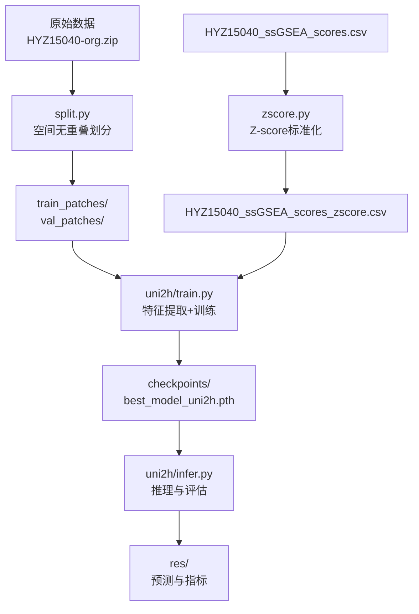
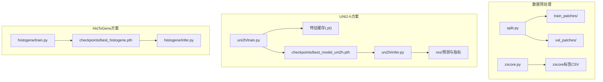
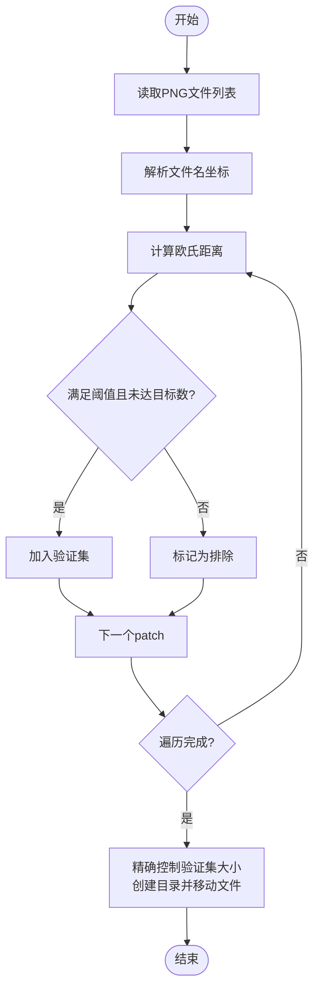
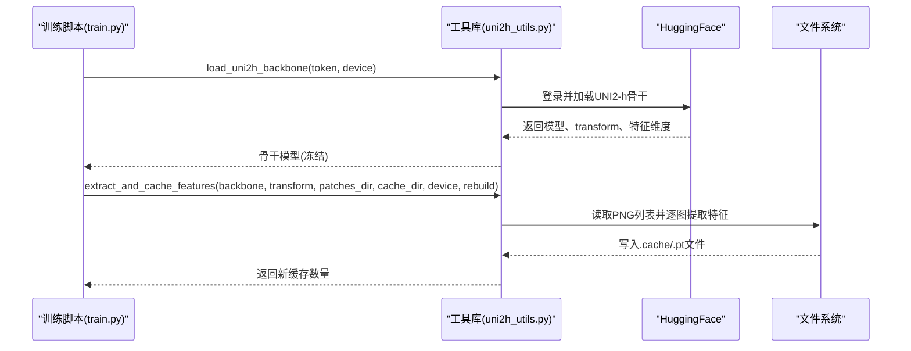
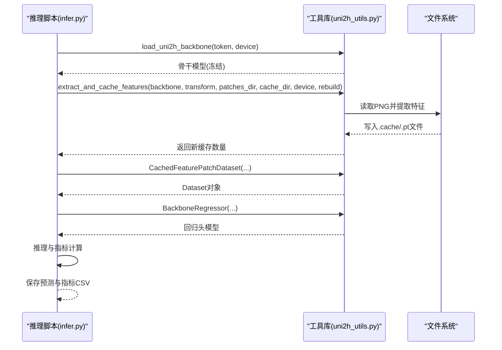
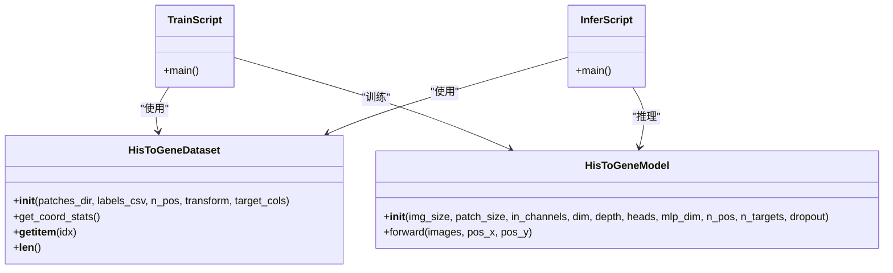
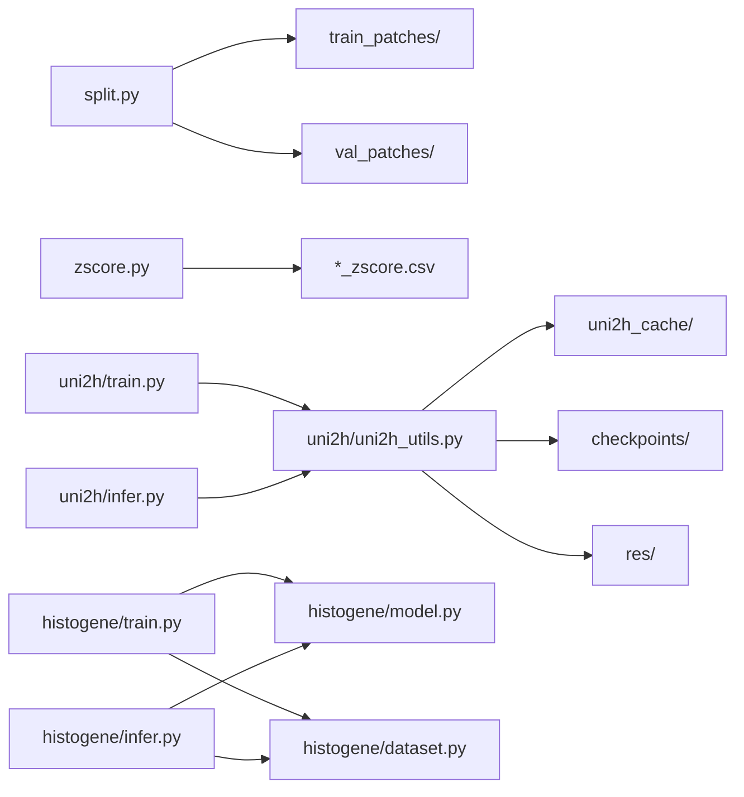

# 部署与配置

<cite>
**本文引用的文件**
- [README.md](file://README.md)
- [PFMval学习指南.md](file://PFMval学习指南.md)
- [split.py](file://split.py)
- [zscore.py](file://zscore.py)
- [uni2h/train.py](file://uni2h/train.py)
- [uni2h/infer.py](file://uni2h/infer.py)
- [uni2h/uni2h_utils.py](file://uni2h/uni2h_utils.py)
- [histogene/train.py](file://histogene/train.py)
- [histogene/infer.py](file://histogene/infer.py)
- [histogene/model.py](file://histogene/model.py)
- [histogene/dataset.py](file://histogene/dataset.py)
- [analyze_stats.py](file://analyze_stats.py)
- [data_distribution_analysis.py](file://data_distribution_analysis.py)
- [HisToGene应用规划.md](file://HisToGene应用规划.md)
</cite>

## 目录
1. [简介](#简介)
2. [项目结构](#项目结构)
3. [核心组件](#核心组件)
4. [架构总览](#架构总览)
5. [详细组件分析](#详细组件分析)
6. [依赖分析](#依赖分析)
7. [性能考虑](#性能考虑)
8. [故障排查指南](#故障排查指南)
9. [结论](#结论)
10. [附录](#附录)

## 简介
本指南面向生产环境部署与配置，围绕 PFMval 项目提供从环境准备、数据与模型管理、分布式与推理配置、压缩与加速、容器化、监控日志、模型更新维护到安全与访问控制的全流程说明。文档基于仓库内现有脚本与实现进行归纳与扩展，帮助读者在真实环境中稳定、高效地运行训练与推理任务。

## 项目结构
项目采用“数据预处理 + 特征提取 + 训练/推理”的分层结构，核心模块如下：
- 数据预处理：split.py（空间无重叠划分）、zscore.py（Z-score标准化）
- 特征提取与缓存：uni2h_utils.py（加载UNI2-h、特征提取、Dataset、回归头、指标计算）
- 训练与推理：uni2h/train.py、uni2h/infer.py
- 可选适配方案：histogene/（基于ViT的端到端方案，包含model.py、dataset.py、train.py、infer.py）

**图表来源**
- [split.py:1-200](file://split.py#L1-L200)
- [zscore.py:1-203](file://zscore.py#L1-L203)
- [uni2h/train.py:52-227](file://uni2h/train.py#L52-L227)
- [uni2h/infer.py:43-175](file://uni2h/infer.py#L43-L175)

**章节来源**
- [README.md:1-44](file://README.md#L1-L44)
- [PFMval学习指南.md:1-499](file://PFMval学习指南.md#L1-L499)

## 核心组件
- 数据预处理管线
  - split.py：基于文件名坐标与距离阈值进行空间无重叠划分，输出 train_patches/ 与 val_patches/
  - zscore.py：对最后8列基因集评分执行Z-score标准化，统一量纲
- 特征提取与缓存
  - uni2h_utils.py：加载UNI2-h骨干（冻结），批量提取并缓存特征（.pt），提供Dataset、回归头、指标计算
- 训练与推理
  - uni2h/train.py：特征提取与缓存、构建Dataset、训练循环、早停、保存最佳模型
  - uni2h/infer.py：加载checkpoint、特征提取与缓存、推理、逐目标与宏平均指标
- 可选适配方案
  - histogene/*：基于ViT+位置编码的端到端方案，包含模型、数据集、训练与推理脚本

**章节来源**
- [split.py:1-200](file://split.py#L1-L200)
- [zscore.py:1-203](file://zscore.py#L1-L203)
- [uni2h/uni2h_utils.py:1-303](file://uni2h/uni2h_utils.py#L1-L303)
- [uni2h/train.py:52-227](file://uni2h/train.py#L52-L227)
- [uni2h/infer.py:43-175](file://uni2h/infer.py#L43-L175)
- [histogene/model.py:1-160](file://histogene/model.py#L1-L160)
- [histogene/dataset.py:1-118](file://histogene/dataset.py#L1-L118)
- [histogene/train.py:174-338](file://histogene/train.py#L174-L338)
- [histogene/infer.py:66-169](file://histogene/infer.py#L66-L169)

## 架构总览
下图展示了从原始数据到训练与推理的端到端流程，以及可选的HisToGene端到端方案。

**图表来源**
- [split.py:99-180](file://split.py#L99-L180)
- [zscore.py:141-203](file://zscore.py#L141-L203)
- [uni2h/train.py:52-227](file://uni2h/train.py#L52-L227)
- [uni2h/infer.py:43-175](file://uni2h/infer.py#L43-L175)
- [histogene/train.py:174-338](file://histogene/train.py#L174-L338)
- [histogene/infer.py:66-169](file://histogene/infer.py#L66-L169)

## 详细组件分析

### 数据预处理组件
- split.py
  - 功能：按空间距离约束划分训练/验证集，避免空间泄漏
  - 关键参数：距离阈值、验证集比例、随机种子
  - 输出：train_patches/ 与 val_patches/ 目录
- zscore.py
  - 功能：对最后N列（默认8列）执行Z-score标准化，统一量纲
  - 输出：*_ssGSEA_scores_zscore.csv

**图表来源**
- [split.py:22-96](file://split.py#L22-L96)
- [split.py:99-180](file://split.py#L99-L180)

**章节来源**
- [split.py:1-200](file://split.py#L1-L200)
- [split_解读指南.md:1-442](file://split_解读指南.md#L1-L442)
- [zscore.py:1-203](file://zscore.py#L1-L203)

### 特征提取与缓存组件
- uni2h_utils.py
  - load_uni2h_backbone：从HuggingFace加载冻结的UNI2-h骨干，返回模型、transform与特征维度
  - extract_and_cache_features：批量提取并缓存特征（.pt），支持断点续传
  - CachedFeaturePatchDataset：从缓存读取特征，从CSV读取标签
  - BackboneRegressor：回归头（LayerNorm→Linear→GELU→Dropout→Linear）
  - train_one_epoch/evaluate：标准训练/验证循环
  - compute_metrics/pearson_corrcoef：指标计算（MSE、MAE、R2、PCC）

**图表来源**
- [uni2h/train.py:60-85](file://uni2h/train.py#L60-L85)
- [uni2h/uni2h_utils.py:32-70](file://uni2h/uni2h_utils.py#L32-L70)
- [uni2h/uni2h_utils.py:138-169](file://uni2h/uni2h_utils.py#L138-L169)

**章节来源**
- [uni2h/uni2h_utils.py:1-303](file://uni2h/uni2h_utils.py#L1-L303)

### 训练与推理组件
- uni2h/train.py
  - 流程：加载骨干→提取并缓存特征→构建Dataset/Dataloader→创建回归头→训练循环→早停→保存最佳模型
  - 关键超参：batch_size、learning_rate、hidden_dim、dropout、patience
- uni2h/infer.py
  - 流程：加载checkpoint→重建模型→特征提取与缓存→推理→逐目标与宏平均指标→输出CSV

**图表来源**
- [uni2h/infer.py:43-175](file://uni2h/infer.py#L43-L175)
- [uni2h/uni2h_utils.py:173-247](file://uni2h/uni2h_utils.py#L173-L247)

**章节来源**
- [uni2h/train.py:52-227](file://uni2h/train.py#L52-L227)
- [uni2h/infer.py:43-175](file://uni2h/infer.py#L43-L175)

### 可选适配方案（HisToGene端到端）
- histogene/model.py：基于ViT+位置编码的回归模型，输出8维通路评分
- histogene/dataset.py：从文件名解析坐标，归一化到[n_pos]，返回图像、坐标索引与标签
- histogene/train.py：端到端训练，Huber损失、早停、混合精度
- histogene/infer.py：端到端推理，保存逐通路指标与预测CSV

**图表来源**
- [histogene/dataset.py:23-118](file://histogene/dataset.py#L23-L118)
- [histogene/model.py:64-160](file://histogene/model.py#L64-L160)
- [histogene/train.py:174-338](file://histogene/train.py#L174-L338)
- [histogene/infer.py:66-169](file://histogene/infer.py#L66-L169)

**章节来源**
- [HisToGene应用规划.md:1-800](file://HisToGene应用规划.md#L1-L800)
- [histogene/model.py:1-160](file://histogene/model.py#L1-L160)
- [histogene/dataset.py:1-118](file://histogene/dataset.py#L1-L118)
- [histogene/train.py:174-338](file://histogene/train.py#L174-L338)
- [histogene/infer.py:66-169](file://histogene/infer.py#L66-L169)

## 依赖分析
- 文件间调用关系
  - split.py、zscore.py 为独立脚本，不依赖其他项目文件
  - uni2h/train.py、uni2h/infer.py 依赖 uni2h/uni2h_utils.py
  - histogene/train.py、histogene/infer.py 依赖 histogene/model.py 与 histogene/dataset.py

**图表来源**
- [PFMval学习指南.md:249-499](file://PFMval学习指南.md#L249-L499)

**章节来源**
- [PFMval学习指南.md:249-499](file://PFMval学习指南.md#L249-L499)

## 性能考虑
- 训练性能
  - 混合精度：在CUDA可用时启用AMP，显著降低显存占用并提升吞吐
  - 数据加载：合理设置num_workers与pin_memory，Windows建议num_workers=0
  - 早停与学习率调度：ReduceLROnPlateau减少无效训练
- 推理性能
  - 特征缓存：避免重复提取UNI2-h特征，提高推理吞吐
  - 批大小：根据GPU显存动态调整，避免OOM
- 数据分布与指标
  - analyze_stats.py 与 data_distribution_analysis.py 提供统计与可视化，辅助判断是否需要进一步清洗或变换

**章节来源**
- [histogene/train.py:194-201](file://histogene/train.py#L194-L201)
- [uni2h/train.py:120-130](file://uni2h/train.py#L120-L130)
- [analyze_stats.py:1-40](file://analyze_stats.py#L1-L40)
- [data_distribution_analysis.py:416-482](file://data_distribution_analysis.py#L416-L482)

## 故障排查指南
- HF Token认证失败
  - 确认HuggingFace账号与Access Token配置，确保网络可达
- 坐标解析失败
  - patch文件名需符合“patch_x\d+_y\d+.png”格式，否则无法匹配坐标
- 特征缓存缺失
  - 确认cache_root路径一致，先运行特征提取再进行训练/推理
- GPU显存不足
  - 降低batch_size（如128或64），确保特征加载在CPU端
- 过拟合
  - 增大dropout（0.3~0.5）、减小hidden_dim（128）、降低学习率
- 标签与图片不匹配
  - 检查CSV第一列patch_id与文件名一致性
- Z-score后出现NaN
  - 检查是否存在常数列或缺失值
- 推理指标全NaN
  - 检查预测值是否存在常数列或极端异常值

**章节来源**
- [PFMval学习指南.md:161-171](file://PFMval学习指南.md#L161-L171)
- [uni2h/uni2h_utils.py:24-29](file://uni2h/uni2h_utils.py#L24-L29)
- [uni2h/train.py:60-61](file://uni2h/train.py#L60-L61)

## 结论
本指南基于仓库现有实现，给出了生产环境部署与配置的系统性方案：明确环境与依赖、规范数据预处理、建立特征缓存与检查点管理、制定训练/推理超参策略、提供监控与日志建议、覆盖安全与访问控制要点，并给出常见问题的排查路径。读者可根据自身硬件与业务场景，在UNI2-h迁移学习方案与HisToGene端到端方案之间择优选择。

## 附录

### A. 生产环境部署要求与配置
- 环境与依赖
  - Python 3.10 + PyTorch 2.1.0 + CUDA 11.8
  - 依赖库：pandas、scikit-learn、Pillow、numpy==1.26.4、huggingface_hub、timm>=0.9.8
- 硬件配置建议
  - GPU：建议至少12GB显存（如RTX 4090/3090），显存紧张时降低batch_size
  - 内存：建议≥32GB，用于数据加载与特征缓存
  - 存储：特征缓存约数百MB至数GB，取决于数据规模；建议SSD以提升I/O
- 分布式与推理
  - 训练：单机多卡可通过DataParallel或DistributedDataParallel扩展（需自行改造）
  - 推理：特征缓存可跨节点共享，减少重复计算
- 模型压缩与加速
  - UNI2-h骨干冻结，仅训练回归头，参数量小、推理快
  - 可尝试INT8/动态量化（需评估精度）与ONNX导出（需验证兼容性）
- 容器化部署
  - Docker镜像建议：nvidia/cuda:11.8.0-runtime-ubuntu20.04 + Python 3.10 + PyTorch 2.1.0
  - 挂载卷：数据目录、特征缓存目录、检查点目录、输出结果目录
  - 运行命令示例（不含具体路径）：docker run --gpus all -v /host/data:/data -v /host/cache:/cache -v /host/checkpoints:/checkpoints -v /host/res:/res pfmval:latest python uni2h/train.py ...
- 监控与日志
  - 日志：训练/推理脚本输出stdout/stderr，建议重定向至文件并按日期轮转
  - 指标：MSE、MAE、R2、PCC，建议定期导出CSV并可视化
  - 资源：nvidia-smi、top、iostat监控GPU/CPU/磁盘
- 模型更新与维护
  - 版本控制：以Git管理代码与检查点；特征缓存以目录结构+哈希标识版本
  - 更新流程：新数据→重新运行split/zscore→重新提取特征→增量训练→评估→替换线上checkpoint
- 安全与访问控制
  - HF Token：通过环境变量或配置文件注入，避免硬编码
  - 文件权限：仅授予必要用户读写权限；缓存与检查点目录严格控制
  - 网络：若使用私有镜像仓库，配置代理与证书

**章节来源**
- [README.md:17-28](file://README.md#L17-L28)
- [PFMval学习指南.md:92-102](file://PFMval学习指南.md#L92-L102)
- [PFMval学习指南.md:188-217](file://PFMval学习指南.md#L188-L217)