# 服务器部署指南

<cite>
**本文档引用的文件**
- [服务器部署指南.md](file://服务器部署指南.md)
- [README.md](file://README.md)
- [config.yaml](file://config.yaml)
- [config_utils.py](file://config_utils.py)
- [histogene/train.py](file://histogene/train.py)
- [histogene/model.py](file://histogene/model.py)
- [uni2h/train.py](file://uni2h/train.py)
- [uni2h/uni2h_utils.py](file://uni2h/uni2h_utils.py)
- [notify_utils.py](file://notify_utils.py)
- [visualize_results.py](file://visualize_results.py)
- [run.sh](file://openmidnight/ai-bio-OpenMidnight-main/run.sh)
- [install.sh](file://openmidnight/ai-bio-OpenMidnight-main/install.sh)
</cite>

## 目录
1. [简介](#简介)
2. [项目结构](#项目结构)
3. [核心组件](#核心组件)
4. [架构概览](#架构概览)
5. [详细组件分析](#详细组件分析)
6. [依赖关系分析](#依赖关系分析)
7. [性能考虑](#性能考虑)
8. [故障排除指南](#故障排除指南)
9. [结论](#结论)

## 简介

PFMval项目是一个基于深度学习的空间转录组学分析平台，专门用于从病理切片中预测基因通路活性。该项目提供了两种主要的训练模式：

- **HisToGene模型**：基于Vision Transformer架构的多通路ssGSEA评分预测模型
- **UNI2-h模型**：基于UNI2-h视觉特征的回归模型

本指南详细介绍了如何将PFMval项目从Windows环境迁移到Linux GPU服务器，并提供了完整的部署、配置和训练流程。

## 项目结构

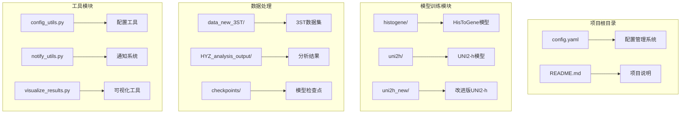

**图表来源**
- [config.yaml:1-32](file://config.yaml#L1-L32)
- [README.md:1-44](file://README.md#L1-L44)

**章节来源**
- [config.yaml:1-32](file://config.yaml#L1-L32)
- [README.md:1-44](file://README.md#L1-L44)

## 核心组件

### 配置管理系统

PFMval项目采用统一的配置管理策略，所有路径配置都集中在单一的`config.yaml`文件中：

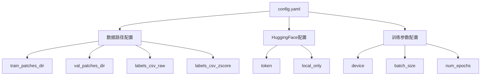

**图表来源**
- [config.yaml:6-32](file://config.yaml#L6-L32)

### 训练脚本架构

项目提供了两个主要的训练脚本，每个都有完整的训练、验证和结果生成流程：

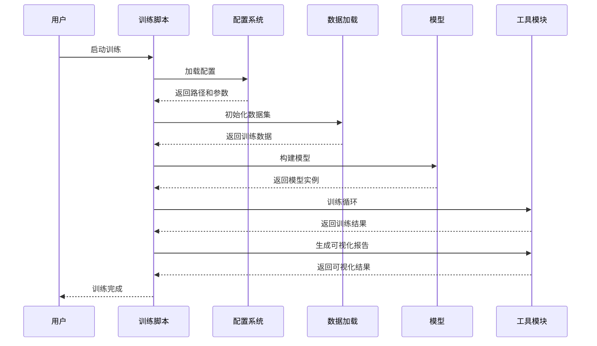

**图表来源**
- [histogene/train.py:183-511](file://histogene/train.py#L183-L511)
- [uni2h/train.py:52-227](file://uni2h/train.py#L52-L227)

**章节来源**
- [config_utils.py:17-294](file://config_utils.py#L17-L294)
- [histogene/train.py:183-511](file://histogene/train.py#L183-L511)
- [uni2h/train.py:52-227](file://uni2h/train.py#L52-L227)

## 架构概览

### 整体系统架构

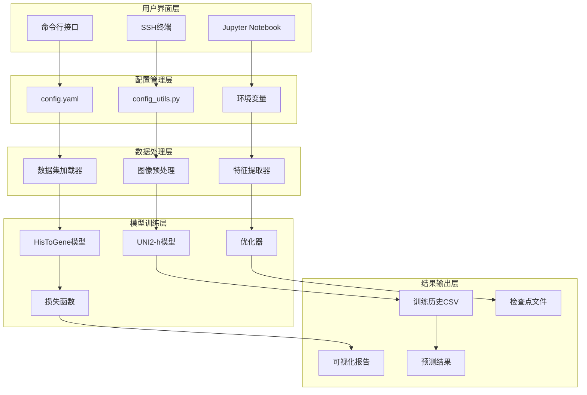

**图表来源**
- [config_utils.py:49-294](file://config_utils.py#L49-L294)
- [histogene/model.py:64-160](file://histogene/model.py#L64-L160)
- [uni2h/uni2h_utils.py:31-71](file://uni2h/uni2h_utils.py#L31-L71)

### 数据流架构

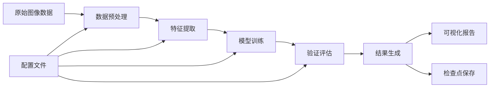

**图表来源**
- [histogene/train.py:217-246](file://histogene/train.py#L217-L246)
- [uni2h/train.py:68-85](file://uni2h/train.py#L68-L85)

**章节来源**
- [config_utils.py:142-214](file://config_utils.py#L142-L214)
- [histogene/train.py:217-246](file://histogene/train.py#L217-L246)
- [uni2h/train.py:68-85](file://uni2h/train.py#L68-L85)

## 详细组件分析

### HisToGene模型分析

HisToGene模型是项目的核心组件之一，采用了改进的Vision Transformer架构来预测多个基因通路的活性评分。

#### 模型架构

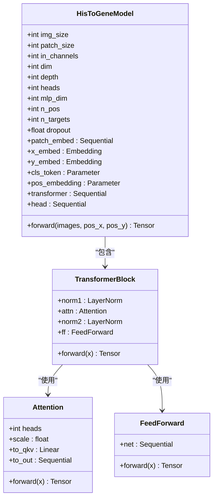

**图表来源**
- [histogene/model.py:64-160](file://histogene/model.py#L64-L160)
- [histogene/model.py:49-62](file://histogene/model.py#L49-L62)

#### 训练流程

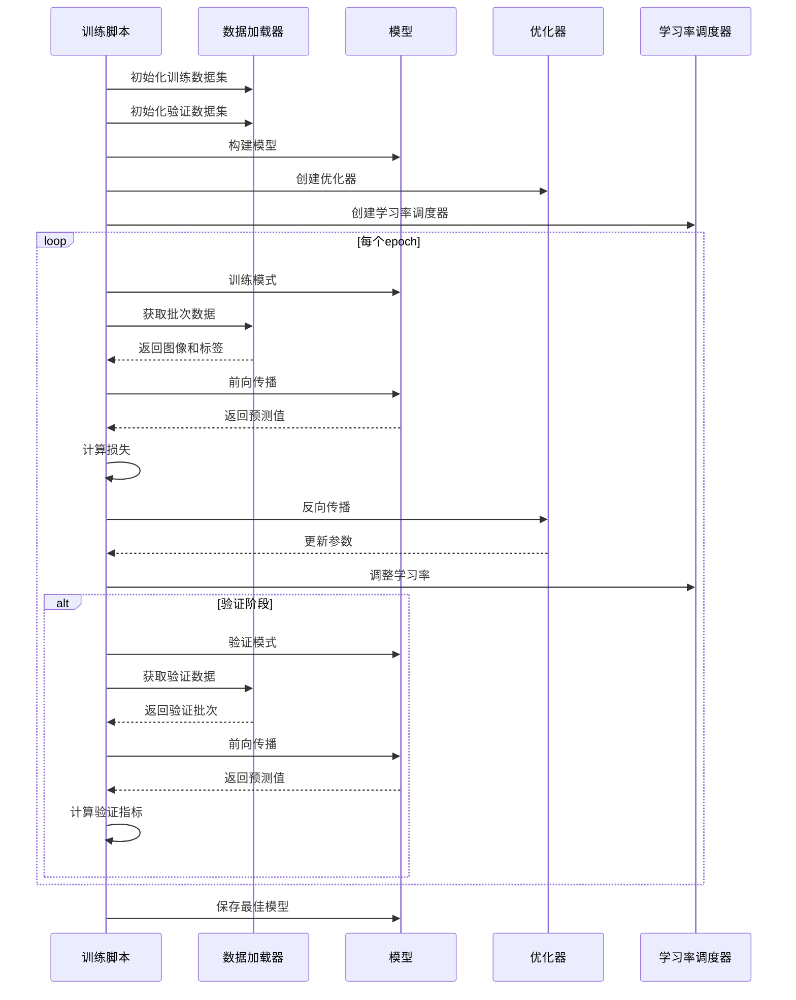

**图表来源**
- [histogene/train.py:115-181](file://histogene/train.py#L115-L181)
- [histogene/train.py:320-429](file://histogene/train.py#L320-L429)

**章节来源**
- [histogene/model.py:64-160](file://histogene/model.py#L64-L160)
- [histogene/train.py:115-181](file://histogene/train.py#L115-L181)

### UNI2-h模型分析

UNI2-h模型采用冻结的视觉特征提取器，结合简单的回归头来进行基因通路活性预测。

#### 特征提取流程

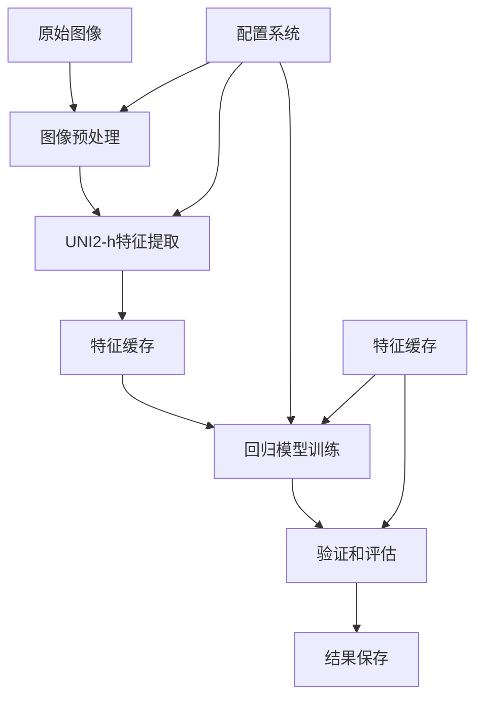

**图表来源**
- [uni2h/uni2h_utils.py:138-170](file://uni2h/uni2h_utils.py#L138-L170)
- [uni2h/train.py:68-85](file://uni2h/train.py#L68-L85)

#### 模型组件

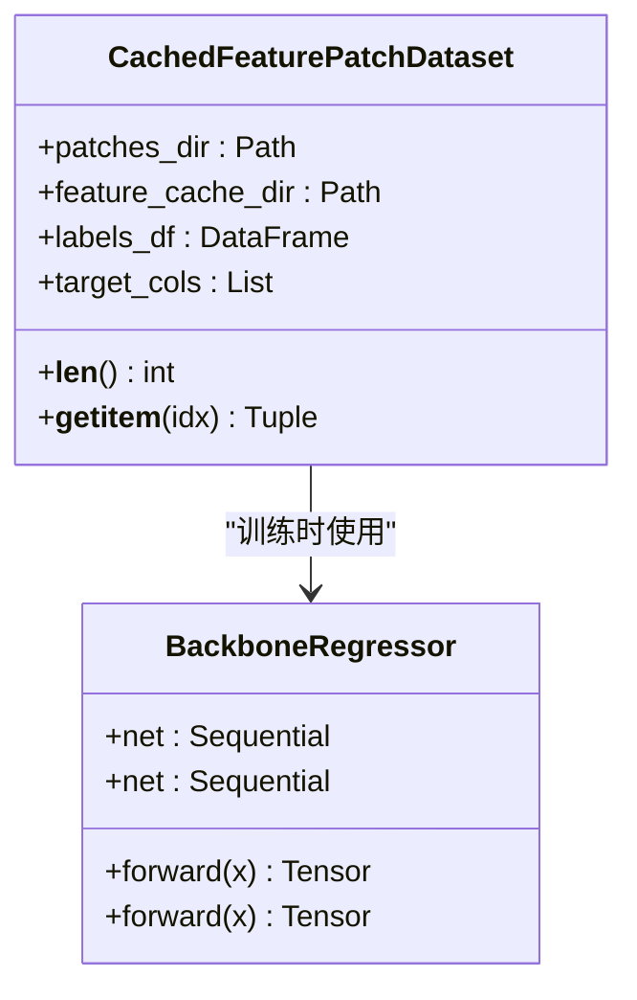

**图表来源**
- [uni2h/uni2h_utils.py:228-248](file://uni2h/uni2h_utils.py#L228-L248)
- [uni2h/uni2h_utils.py:173-226](file://uni2h/uni2h_utils.py#L173-L226)

**章节来源**
- [uni2h/uni2h_utils.py:138-170](file://uni2h/uni2h_utils.py#L138-L170)
- [uni2h/uni2h_utils.py:228-248](file://uni2h/uni2h_utils.py#L228-L248)

### 配置管理系统分析

配置管理系统是PFMval项目的核心基础设施，提供了灵活的配置管理和路径解析功能。

#### 配置加载流程

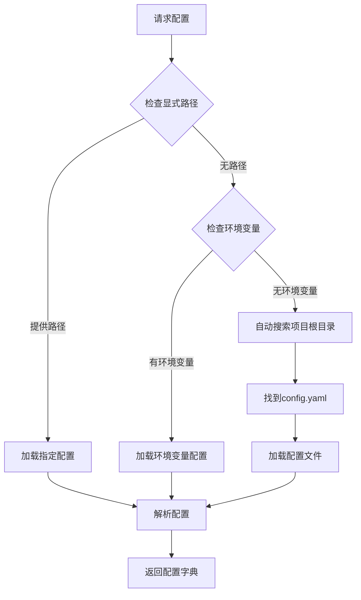

**图表来源**
- [config_utils.py:49-88](file://config_utils.py#L49-L88)

#### 路径解析机制

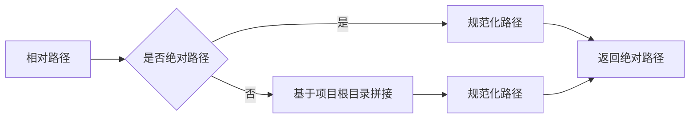

**图表来源**
- [config_utils.py:111-136](file://config_utils.py#L111-L136)

**章节来源**
- [config_utils.py:49-88](file://config_utils.py#L49-L88)
- [config_utils.py:111-136](file://config_utils.py#L111-L136)

## 依赖关系分析

### 模块依赖图

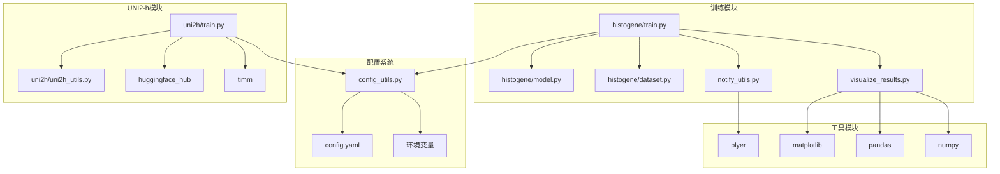

**图表来源**
- [config_utils.py:1-294](file://config_utils.py#L1-L294)
- [histogene/train.py:1-511](file://histogene/train.py#L1-L511)
- [uni2h/train.py:1-227](file://uni2h/train.py#L1-L227)

### 数据依赖关系

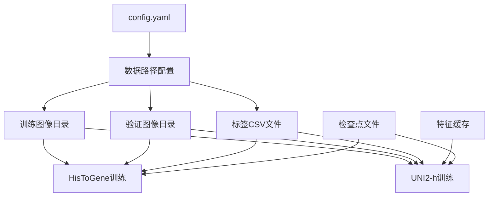

**图表来源**
- [config.yaml:6-19](file://config.yaml#L6-L19)

**章节来源**
- [config_utils.py:142-179](file://config_utils.py#L142-L179)
- [histogene/train.py:192-203](file://histogene/train.py#L192-L203)

## 性能考虑

### GPU内存优化

在服务器部署过程中，GPU内存管理是关键因素：

1. **批量大小调整**：根据GPU显存大小调整`batch_size`参数
2. **混合精度训练**：启用AMP可以显著减少内存占用
3. **梯度累积**：对于内存不足的情况，可以考虑实现梯度累积

### 训练效率优化

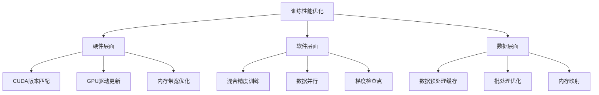

### 网络配置优化

对于需要访问HuggingFace模型的场景：

1. **离线模式配置**：在无网络环境中启用`local_only: true`
2. **缓存目录设置**：将模型缓存指向高速存储
3. **代理配置**：为国内用户提供镜像站点支持

## 故障排除指南

### 常见部署问题

| 问题类型 | 症状描述 | 解决方案 |
|---------|----------|----------|
| **CUDA内存不足** | `RuntimeError: CUDA out of memory` | 减小batch_size，启用AMP，清理GPU缓存 |
| **路径解析错误** | `FileNotFoundError` | 检查config.yaml路径格式，使用绝对路径 |
| **HuggingFace下载失败** | `HTTPError`或`timeout` | 设置HF_TOKEN，配置代理，启用离线模式 |
| **模块导入错误** | `ModuleNotFoundError` | 检查虚拟环境，重新安装依赖包 |
| **权限问题** | `PermissionError` | 修改文件权限，检查用户所有权 |

### 调试技巧

1. **日志分析**：查看`train.log`文件中的错误堆栈
2. **配置验证**：运行`python config_utils.py`验证配置正确性
3. **环境检查**：使用`nvidia-smi`和`torch.cuda.is_available()`验证GPU状态
4. **内存监控**：使用`watch -n 1 nvidia-smi`监控GPU内存使用

### 性能监控

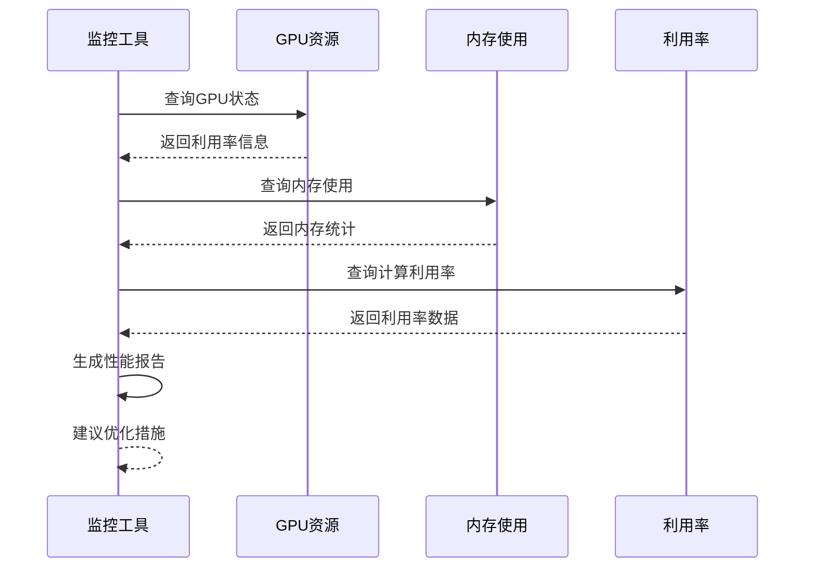

**章节来源**
- [服务器部署指南.md:441-536](file://服务器部署指南.md#L441-L536)

## 结论

PFMval项目提供了一个完整的空间转录组学分析解决方案，具有以下特点：

1. **模块化设计**：清晰的模块分离使得系统易于维护和扩展
2. **配置驱动**：统一的配置管理减少了代码修改需求
3. **灵活性**：支持多种训练模式和部署选项
4. **可视化**：完整的训练结果可视化和分析工具

通过遵循本部署指南，用户可以在Linux GPU服务器上成功部署和运行PFMval项目，实现高效的空间转录组学分析工作流程。

建议的后续步骤：
- 验证GPU环境配置
- 测试配置文件加载
- 运行小型训练任务验证系统
- 根据实际需求调整参数配置
- 建立监控和日志记录机制