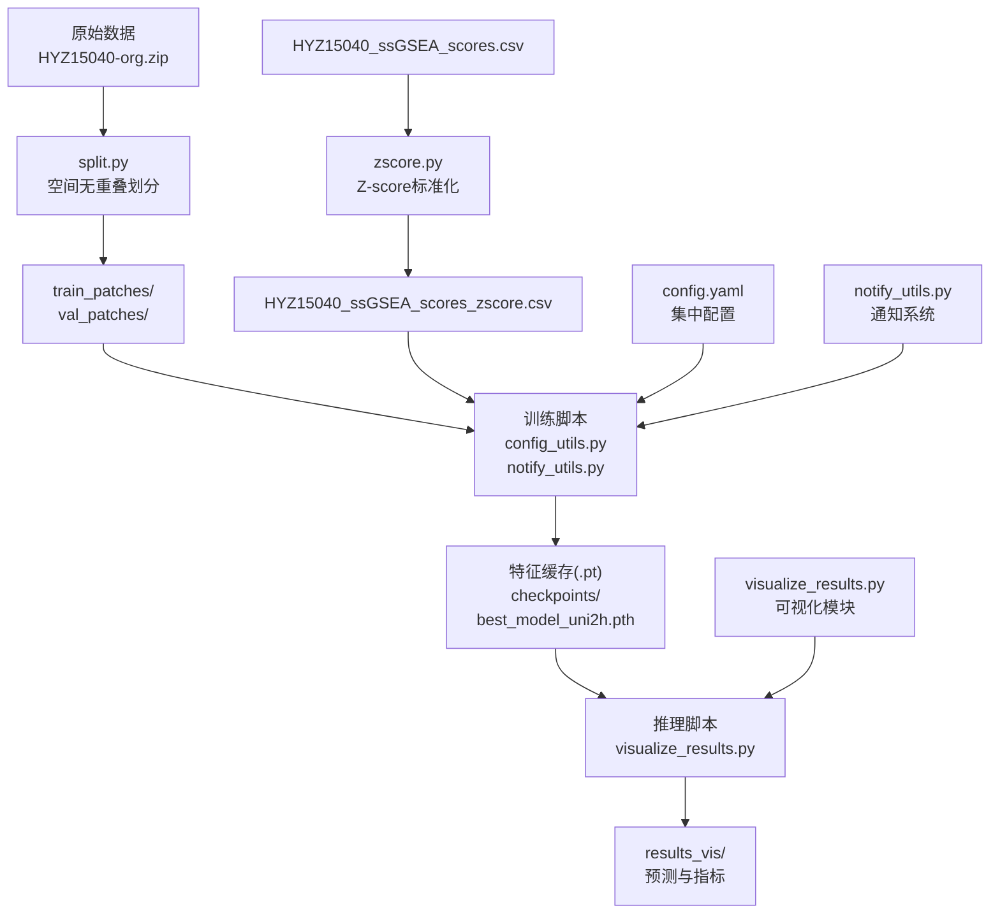
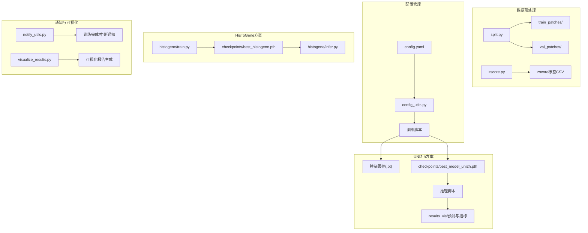
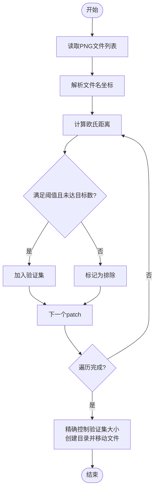
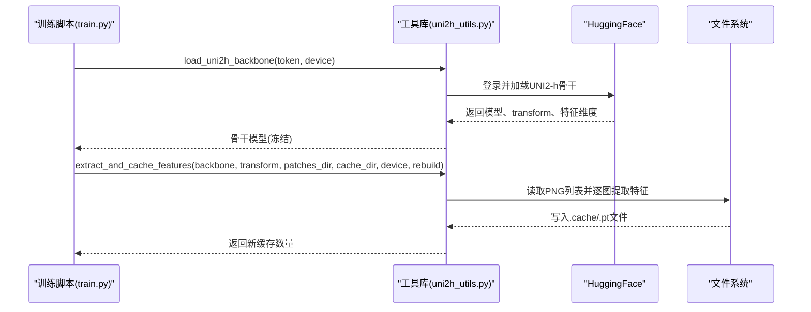
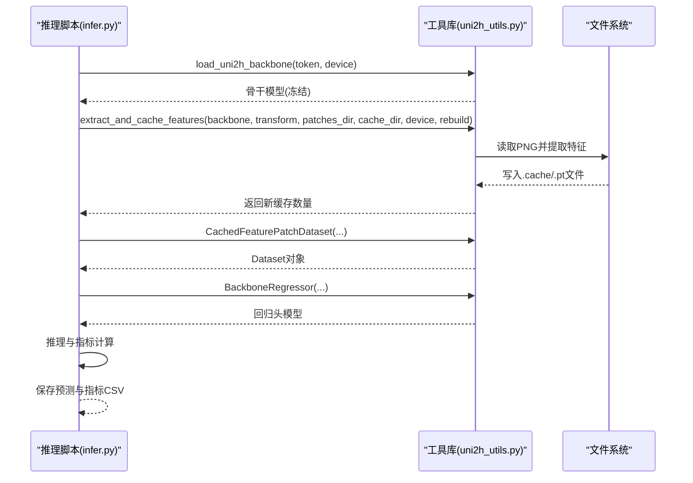
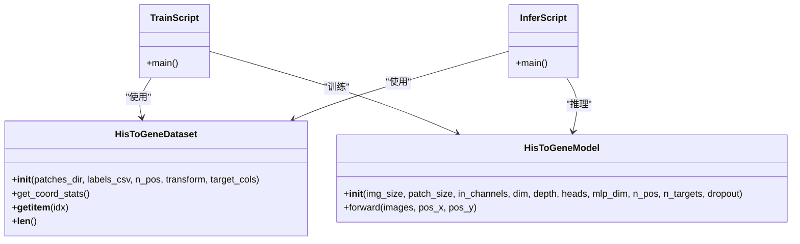
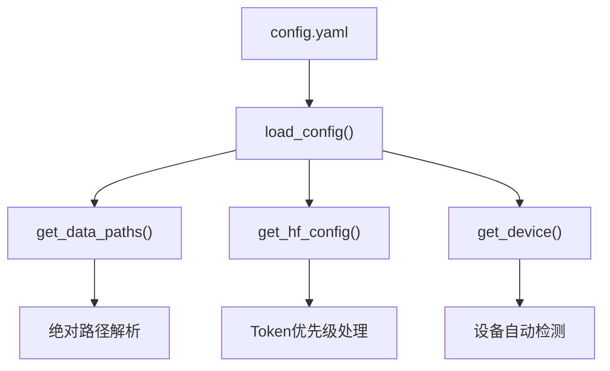
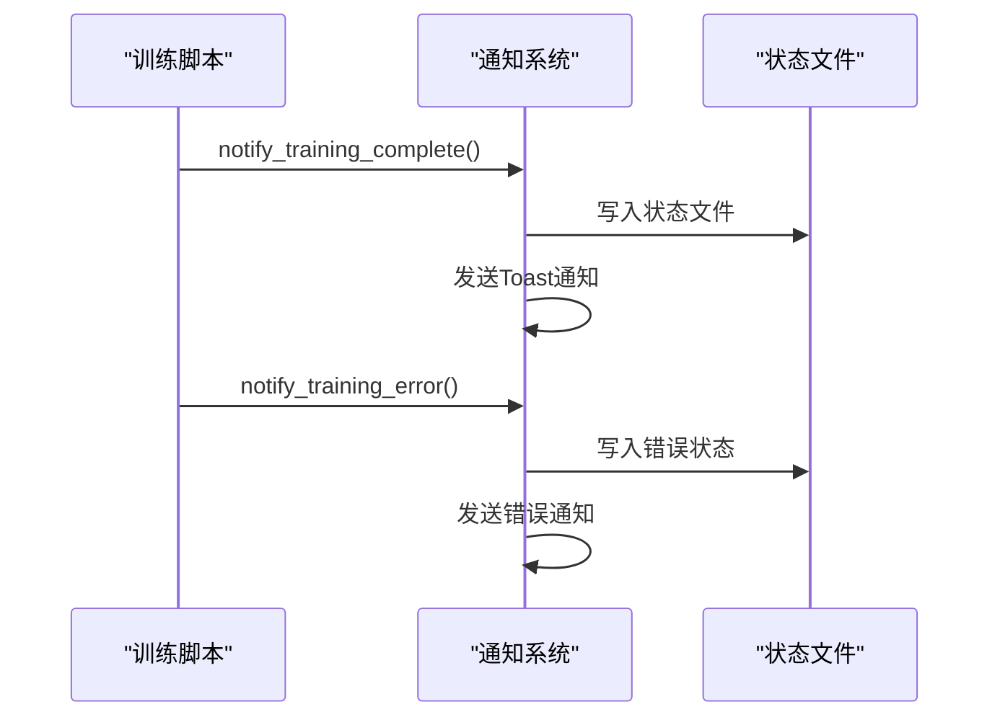
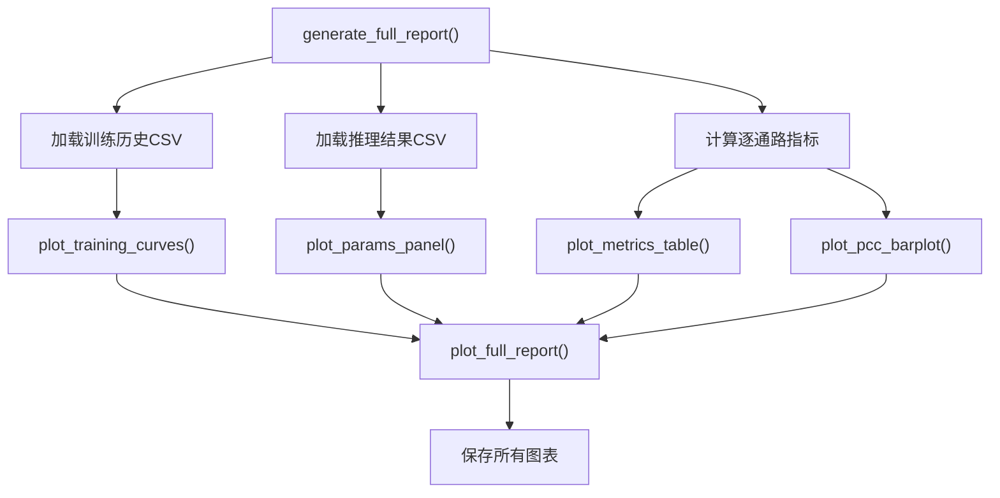
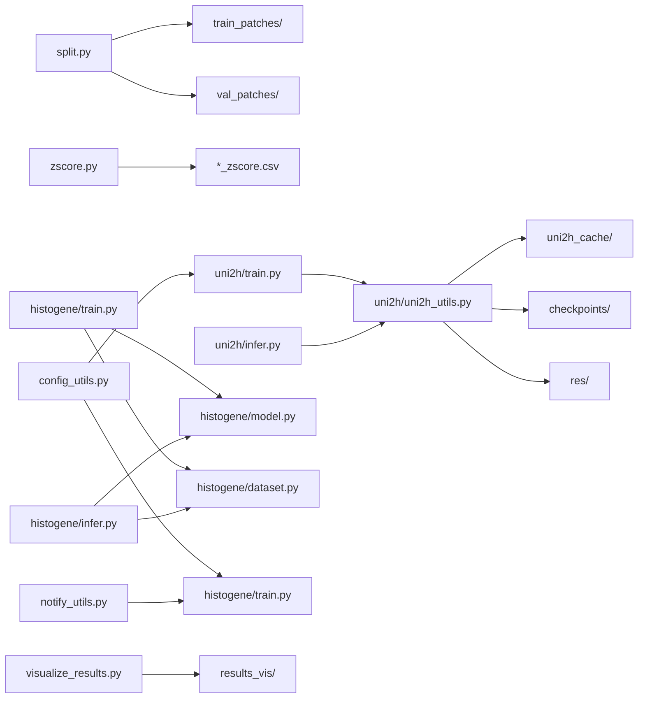

# 部署与配置

<cite>
**本文引用的文件**
- [README.md](file://README.md)
- [PFMval学习指南.md](file://PFMval学习指南.md)
- [split.py](file://split.py)
- [zscore.py](file://zscore.py)
- [uni2h/train.py](file://uni2h/train.py)
- [uni2h/infer.py](file://uni2h/infer.py)
- [uni2h/uni2h_utils.py](file://uni2h/uni2h_utils.py)
- [histogene/train.py](file://histogene/train.py)
- [histogene/infer.py](file://histogene/infer.py)
- [histogene/model.py](file://histogene/model.py)
- [histogene/dataset.py](file://histogene/dataset.py)
- [analyze_stats.py](file://analyze_stats.py)
- [data_distribution_analysis.py](file://data_distribution_analysis.py)
- [HisToGene应用规划.md](file://HisToGene应用规划.md)
- [config.yaml](file://config.yaml)
- [config_utils.py](file://config_utils.py)
- [notify_utils.py](file://notify_utils.py)
- [visualize_results.py](file://visualize_results.py)
- [uni2h_new/train_des.py](file://uni2h_new/train_des.py)
</cite>

## 更新摘要
**变更内容**
- 新增配置管理系统：config.yaml集中配置、config_utils.py配置工具
- 新增通知系统：notify_utils.py训练完成/中断通知
- 新增可视化结果模块：visualize_results.py通用可视化脚本
- 现有训练脚本已集成新配置系统和通知系统
- 更新部署流程以包含配置管理和通知功能

## 目录
1. [简介](#简介)
2. [项目结构](#项目结构)
3. [核心组件](#核心组件)
4. [架构总览](#架构总览)
5. [详细组件分析](#详细组件分析)
6. [配置管理系统](#配置管理系统)
7. [通知系统](#通知系统)
8. [可视化结果模块](#可视化结果模块)
9. [依赖分析](#依赖分析)
10. [性能考虑](#性能考虑)
11. [故障排查指南](#故障排查指南)
12. [结论](#结论)
13. [附录](#附录)

## 简介
本指南面向生产环境部署与配置，围绕 PFMval 项目提供从环境准备、数据与模型管理、分布式与推理配置、压缩与加速、容器化、监控日志、模型更新维护到安全与访问控制的全流程说明。文档基于仓库内现有脚本与实现进行归纳与扩展，特别强调新增的配置管理系统、通知系统和可视化模块，帮助读者在真实环境中稳定、高效地运行训练与推理任务。

## 项目结构
项目采用"数据预处理 + 特征提取 + 训练/推理 + 配置管理 + 通知 + 可视化"的分层结构，核心模块如下：
- 数据预处理：split.py（空间无重叠划分）、zscore.py（Z-score标准化）
- 特征提取与缓存：uni2h_utils.py（加载UNI2-h、特征提取、Dataset、回归头、指标计算）
- 训练与推理：uni2h/train.py、uni2h/infer.py、histogene/train.py、histogene/infer.py
- 配置管理：config.yaml（集中配置）、config_utils.py（配置工具）
- 通知系统：notify_utils.py（训练完成/中断通知）
- 可视化模块：visualize_results.py（通用可视化脚本）
- 可选适配方案：histogene/（基于ViT的端到端方案，包含model.py、dataset.py、train.py、infer.py）

**图表来源**
- [split.py:1-200](file://split.py#L1-L200)
- [zscore.py:1-203](file://zscore.py#L1-L203)
- [uni2h/train.py:52-227](file://uni2h/train.py#L52-L227)
- [uni2h/infer.py:43-175](file://uni2h/infer.py#L43-L175)
- [config.yaml:1-32](file://config.yaml#L1-L32)
- [config_utils.py:1-294](file://config_utils.py#L1-L294)
- [notify_utils.py:1-128](file://notify_utils.py#L1-L128)
- [visualize_results.py:1-951](file://visualize_results.py#L1-L951)

**章节来源**
- [README.md:1-44](file://README.md#L1-L44)
- [PFMval学习指南.md:1-499](file://PFMval学习指南.md#L1-L499)

## 核心组件
- 数据预处理管线
  - split.py：基于文件名坐标与距离阈值进行空间无重叠划分，输出 train_patches/ 与 val_patches/
  - zscore.py：对最后8列基因集评分执行Z-score标准化，统一量纲
- 特征提取与缓存
  - uni2h_utils.py：加载UNI2-h骨干（冻结），批量提取并缓存特征（.pt），提供Dataset、回归头、指标计算
- 训练与推理
  - uni2h/train.py：特征提取与缓存、构建Dataset、训练循环、早停、保存最佳模型
  - uni2h/infer.py：加载checkpoint、特征提取与缓存、推理、逐目标与宏平均指标
  - histogene/train.py：端到端训练，集成配置系统和通知系统
  - histogene/infer.py：端到端推理，保存逐通路指标与预测CSV
- 配置管理系统
  - config.yaml：集中配置文件，包含数据路径、HuggingFace配置、训练配置
  - config_utils.py：配置工具，提供配置加载、路径解析、设备选择等功能
- 通知系统
  - notify_utils.py：训练完成/中断通知，支持系统通知、日志文件标记、暂停信号检测
- 可视化模块
  - visualize_results.py：通用可视化脚本，生成训练曲线、参数面板、指标表格、PCC柱状图等

**章节来源**
- [split.py:1-200](file://split.py#L1-L200)
- [zscore.py:1-203](file://zscore.py#L1-L203)
- [uni2h/uni2h_utils.py:1-303](file://uni2h/uni2h_utils.py#L1-L303)
- [uni2h/train.py:52-227](file://uni2h/train.py#L52-L227)
- [uni2h/infer.py:43-175](file://uni2h/infer.py#L43-L175)
- [histogene/train.py:1-200](file://histogene/train.py#L1-L200)
- [histogene/infer.py:1-178](file://histogene/infer.py#L1-L178)
- [config.yaml:1-32](file://config.yaml#L1-L32)
- [config_utils.py:1-294](file://config_utils.py#L1-L294)
- [notify_utils.py:1-128](file://notify_utils.py#L1-L128)
- [visualize_results.py:1-951](file://visualize_results.py#L1-L951)

## 架构总览
下图展示了从原始数据到训练与推理的端到端流程，以及可选的HisToGene端到端方案，特别突出了新增的配置管理、通知和可视化模块。

**图表来源**
- [split.py:99-180](file://split.py#L99-L180)
- [zscore.py:141-203](file://zscore.py#L141-L203)
- [config.yaml:1-32](file://config.yaml#L1-L32)
- [config_utils.py:49-88](file://config_utils.py#L49-L88)
- [uni2h/train.py:52-227](file://uni2h/train.py#L52-L227)
- [uni2h/infer.py:43-175](file://uni2h/infer.py#L43-L175)
- [histogene/train.py:183-200](file://histogene/train.py#L183-L200)
- [histogene/infer.py:75-178](file://histogene/infer.py#L75-L178)
- [notify_utils.py:10-50](file://notify_utils.py#L10-L50)
- [visualize_results.py:812-906](file://visualize_results.py#L812-L906)

## 详细组件分析

### 数据预处理组件
- split.py
  - 功能：按空间距离约束划分训练/验证集，避免空间泄漏
  - 关键参数：距离阈值、验证集比例、随机种子
  - 输出：train_patches/ 与 val_patches/ 目录
- zscore.py
  - 功能：对最后N列（默认8列）执行Z-score标准化，统一量纲
  - 输出：*_ssGSEA_scores_zscore.csv

**图表来源**
- [split.py:22-96](file://split.py#L22-L96)
- [split.py:99-180](file://split.py#L99-L180)

**章节来源**
- [split.py:1-200](file://split.py#L1-L200)
- [split_解读指南.md:1-442](file://split_解读指南.md#L1-L442)
- [zscore.py:1-203](file://zscore.py#L1-L203)

### 特征提取与缓存组件
- uni2h_utils.py
  - load_uni2h_backbone：从HuggingFace加载冻结的UNI2-h骨干，返回模型、transform与特征维度
  - extract_and_cache_features：批量提取并缓存特征（.pt），支持断点续传
  - CachedFeaturePatchDataset：从缓存读取特征，从CSV读取标签
  - BackboneRegressor：回归头（LayerNorm→Linear→GELU→Dropout→Linear）
  - train_one_epoch/evaluate：标准训练/验证循环
  - compute_metrics/pearson_corrcoef：指标计算（MSE、MAE、R2、PCC）

**图表来源**
- [uni2h/train.py:60-85](file://uni2h/train.py#L60-L85)
- [uni2h/uni2h_utils.py:32-70](file://uni2h/uni2h_utils.py#L32-L70)
- [uni2h/uni2h_utils.py:138-169](file://uni2h/uni2h_utils.py#L138-L169)

**章节来源**
- [uni2h/uni2h_utils.py:1-303](file://uni2h/uni2h_utils.py#L1-L303)

### 训练与推理组件
- uni2h/train.py
  - 流程：加载骨干→提取并缓存特征→构建Dataset/Dataloader→创建回归头→训练循环→早停→保存最佳模型
  - 关键超参：batch_size、learning_rate、hidden_dim、dropout、patience
- uni2h/infer.py
  - 流程：加载checkpoint→重建模型→特征提取与缓存→推理→逐目标与宏平均指标→输出CSV
- histogene/train.py（已集成配置系统和通知系统）
  - 流程：集成config_utils配置加载→数据路径解析→设备选择→训练循环→早停→保存最佳模型
  - 集成notify_utils通知系统，支持训练完成/中断通知
- histogene/infer.py
  - 流程：端到端推理，保存逐通路指标与预测CSV

**图表来源**
- [uni2h/infer.py:43-175](file://uni2h/infer.py#L43-L175)
- [uni2h/uni2h_utils.py:173-247](file://uni2h/uni2h_utils.py#L173-L247)
- [histogene/train.py:35-47](file://histogene/train.py#L35-L47)
- [histogene/train.py:28-29](file://histogene/train.py#L28-L29)

**章节来源**
- [uni2h/train.py:52-227](file://uni2h/train.py#L52-L227)
- [uni2h/infer.py:43-175](file://uni2h/infer.py#L43-L175)
- [histogene/train.py:1-200](file://histogene/train.py#L1-L200)
- [histogene/infer.py:1-178](file://histogene/infer.py#L1-L178)

### 可选适配方案（HisToGene端到端）
- histogene/model.py：基于ViT+位置编码的回归模型，输出8维通路评分
- histogene/dataset.py：从文件名解析坐标，归一化到[n_pos]，返回图像、坐标索引与标签
- histogene/train.py：端到端训练，Huber损失、早停、混合精度，集成配置系统和通知系统
- histogene/infer.py：端到端推理，保存逐通路指标与预测CSV

**图表来源**
- [histogene/dataset.py:23-118](file://histogene/dataset.py#L23-L118)
- [histogene/model.py:64-160](file://histogene/model.py#L64-L160)
- [histogene/train.py:174-338](file://histogene/train.py#L174-L338)
- [histogene/infer.py:66-169](file://histogene/infer.py#L66-L169)

**章节来源**
- [HisToGene应用规划.md:1-800](file://HisToGene应用规划.md#L1-L800)
- [histogene/model.py:1-160](file://histogene/model.py#L1-L160)
- [histogene/dataset.py:1-118](file://histogene/dataset.py#L1-L118)
- [histogene/train.py:174-338](file://histogene/train.py#L174-L338)
- [histogene/infer.py:66-169](file://histogene/infer.py#L66-L169)

## 配置管理系统

### config.yaml集中配置
config.yaml作为项目的统一配置中心，提供以下配置项：
- 数据路径配置：train_patches_dir、val_patches_dir、labels_csv_raw、labels_csv_zscore
- HuggingFace配置：token、local_only
- 通用训练配置：device选择

### config_utils.py配置工具
config_utils.py提供完整的配置管理功能：
- get_project_root()：自动搜索项目根目录，支持从任意子目录调用
- load_config()：加载配置文件，支持多种查找方式（显式路径、环境变量、自动搜索）
- resolve_path()：路径解析，支持绝对路径和相对路径
- get_data_paths()：获取数据路径配置，自动解析为绝对路径
- get_hf_config()：获取HuggingFace配置，支持配置文件和环境变量优先级
- get_device()：获取训练设备，支持自动检测、强制GPU、强制CPU

**图表来源**
- [config.yaml:1-32](file://config.yaml#L1-L32)
- [config_utils.py:49-88](file://config_utils.py#L49-L88)
- [config_utils.py:142-179](file://config_utils.py#L142-L179)
- [config_utils.py:182-213](file://config_utils.py#L182-L213)
- [config_utils.py:216-257](file://config_utils.py#L216-L257)

**章节来源**
- [config.yaml:1-32](file://config.yaml#L1-L32)
- [config_utils.py:1-294](file://config_utils.py#L1-L294)

## 通知系统

### notify_utils.py通知工具
notify_utils.py提供完整的训练通知功能：
- notify_training_complete()：训练完成通知，支持多种状态（completed、early_stop、error）
- notify_training_error()：训练异常中断通知
- _send_toast_notification()：系统Toast通知（Windows平台）
- check_pause_signal()：暂停信号检测
- clear_pause_signal()：清除暂停信号

### 集成到训练脚本
现有训练脚本已集成通知系统：
- histogene/train.py：集成训练完成/中断通知，支持暂停信号检测
- uni2h_new/train_des.py：集成通知系统，支持训练状态跟踪

**图表来源**
- [notify_utils.py:10-50](file://notify_utils.py#L10-L50)
- [notify_utils.py:52-80](file://notify_utils.py#L52-L80)
- [notify_utils.py:99-128](file://notify_utils.py#L99-L128)
- [histogene/train.py:28-29](file://histogene/train.py#L28-L29)
- [uni2h_new/train_des.py:61-62](file://uni2h_new/train_des.py#L61-L62)

**章节来源**
- [notify_utils.py:1-128](file://notify_utils.py#L1-L128)
- [histogene/train.py:1-200](file://histogene/train.py#L1-L200)
- [uni2h_new/train_des.py:1-200](file://uni2h_new/train_des.py#L1-L200)

## 可视化结果模块

### visualize_results.py通用可视化脚本
visualize_results.py提供完整的训练结果可视化功能：
- 训练曲线可视化：Loss、MAE、R²、PCC四合一图表
- 模型参数面板：深色代码块风格的参数展示
- 逐通路指标表格：颜色编码的指标表格
- 逐通路PCC柱状图：按PCC值着色的柱状图
- 综合报告图：完整的A4纵向布局报告

### 功能特性
- 支持命令行和Python函数两种使用方式
- 自动字体配置，支持中文字体
- 红→绿渐变色映射，直观显示指标质量
- 自动创建时间戳子文件夹
- 完整的错误处理和警告机制

**图表来源**
- [visualize_results.py:812-906](file://visualize_results.py#L812-L906)
- [visualize_results.py:210-277](file://visualize_results.py#L210-L277)
- [visualize_results.py:284-359](file://visualize_results.py#L284-359)
- [visualize_results.py:366-449](file://visualize_results.py#L366-449)
- [visualize_results.py:456-520](file://visualize_results.py#L456-520)
- [visualize_results.py:527-805](file://visualize_results.py#L527-805)

**章节来源**
- [visualize_results.py:1-951](file://visualize_results.py#L1-L951)

## 依赖分析
- 文件间调用关系
  - split.py、zscore.py 为独立脚本，不依赖其他项目文件
  - uni2h/train.py、uni2h/infer.py 依赖 uni2h/uni2h_utils.py
  - histogene/train.py、histogene/infer.py 依赖 histogene/model.py 与 histogene/dataset.py
  - 新增：config_utils.py被训练脚本导入，提供配置管理功能
  - 新增：notify_utils.py被训练脚本导入，提供通知功能
  - 新增：visualize_results.py独立运行，生成可视化报告

**图表来源**
- [PFMval学习指南.md:249-499](file://PFMval学习指南.md#L249-L499)
- [config_utils.py:26-29](file://config_utils.py#L26-L29)
- [histogene/train.py:28-29](file://histogene/train.py#L28-L29)
- [uni2h_new/train_des.py:61-62](file://uni2h_new/train_des.py#L61-L62)

**章节来源**
- [PFMval学习指南.md:249-499](file://PFMval学习指南.md#L249-L499)

## 性能考虑
- 训练性能
  - 混合精度：在CUDA可用时启用AMP，显著降低显存占用并提升吞吐
  - 数据加载：合理设置num_workers与pin_memory，Windows建议num_workers=0
  - 早停与学习率调度：ReduceLROnPlateau减少无效训练
  - 配置系统优化：通过config_utils自动检测设备，避免手动配置错误
- 推理性能
  - 特征缓存：避免重复提取UNI2-h特征，提高推理吞吐
  - 批大小：根据GPU显存动态调整，避免OOM
  - 通知系统：通过暂停信号机制，支持长时间训练的中断恢复
- 数据分布与指标
  - analyze_stats.py 与 data_distribution_analysis.py 提供统计与可视化，辅助判断是否需要进一步清洗或变换
  - 可视化模块：通过generate_full_report自动生成完整的训练结果报告

**章节来源**
- [histogene/train.py:194-201](file://histogene/train.py#L194-L201)
- [uni2h/train.py:120-130](file://uni2h/train.py#L120-L130)
- [config_utils.py:216-257](file://config_utils.py#L216-L257)
- [notify_utils.py:99-128](file://notify_utils.py#L99-L128)
- [visualize_results.py:812-906](file://visualize_results.py#L812-L906)
- [analyze_stats.py:1-40](file://analyze_stats.py#L1-L40)
- [data_distribution_analysis.py:416-482](file://data_distribution_analysis.py#L416-L482)

## 故障排查指南
- HF Token认证失败
  - 确认HuggingFace账号与Access Token配置，确保网络可达
  - 检查config.yaml中的huggingface.token或环境变量HF_TOKEN
- 坐标解析失败
  - patch文件名需符合"patch_x\d+_y\d+.png"格式，否则无法匹配坐标
- 特征缓存缺失
  - 确认cache_root路径一致，先运行特征提取再进行训练/推理
  - 检查config_utils.resolve_path()是否正确解析路径
- GPU显存不足
  - 降低batch_size（如128或64），确保特征加载在CPU端
  - 使用config_utils.get_device()自动检测设备，避免手动配置错误
- 过拟合
  - 增大dropout（0.3~0.5）、减小hidden_dim（128）、降低学习率
- 标签与图片不匹配
  - 检查CSV第一列patch_id与文件名一致性
- Z-score后出现NaN
  - 检查是否存在常数列或缺失值
- 推理指标全NaN
  - 检查预测值是否存在常数列或极端异常值
- 配置文件加载失败
  - 检查config.yaml格式是否正确，确认项目根目录包含config.yaml
  - 使用config_utils.load_config()的错误处理机制
- 通知系统异常
  - 检查plyer库安装情况，Windows平台Toast通知需要相应支持
  - 验证PAUSE_TRAINING信号文件是否存在
- 可视化生成失败
  - 检查matplotlib字体配置，确保中文字体可用
  - 验证输入的CSV文件格式和路径

**章节来源**
- [PFMval学习指南.md:161-171](file://PFMval学习指南.md#L161-L171)
- [uni2h/uni2h_utils.py:24-29](file://uni2h/uni2h_utils.py#L24-L29)
- [uni2h/train.py:60-61](file://uni2h/train.py#L60-L61)
- [config_utils.py:49-88](file://config_utils.py#L49-L88)
- [notify_utils.py:84-96](file://notify_utils.py#L84-L96)
- [visualize_results.py:43-57](file://visualize_results.py#L43-L57)

## 结论
本指南基于仓库现有实现，结合新增的配置管理系统、通知系统和可视化模块，给出了生产环境部署与配置的系统性方案：明确环境与依赖、规范数据预处理、建立特征缓存与检查点管理、制定训练/推理超参策略、集成配置管理与通知功能、提供可视化报告生成、覆盖安全与访问控制要点，并给出常见问题的排查路径。新增的功能模块显著提升了项目的可维护性和用户体验，读者可根据自身硬件与业务场景，在UNI2-h迁移学习方案与HisToGene端到端方案之间择优选择。

## 附录

### A. 生产环境部署要求与配置
- 环境与依赖
  - Python 3.10 + PyTorch 2.1.0 + CUDA 11.8
  - 依赖库：pandas、scikit-learn、Pillow、numpy==1.26.4、huggingface_hub、timm>=0.9.8、matplotlib、plyer
- 硬件配置建议
  - GPU：建议至少12GB显存（如RTX 4090/3090），显存紧张时降低batch_size
  - 内存：建议≥32GB，用于数据加载与特征缓存
  - 存储：特征缓存约数百MB至数GB，取决于数据规模；建议SSD以提升I/O
- 分布式与推理
  - 训练：单机多卡可通过DataParallel或DistributedDataParallel扩展（需自行改造）
  - 推理：特征缓存可跨节点共享，减少重复计算
- 模型压缩与加速
  - UNI2-h骨干冻结，仅训练回归头，参数量小、推理快
  - 可尝试INT8/动态量化（需评估精度）与ONNX导出（需验证兼容性）
- 容器化部署
  - Docker镜像建议：nvidia/cuda:11.8.0-runtime-ubuntu20.04 + Python 3.10 + PyTorch 2.1.0
  - 挂载卷：数据目录、特征缓存目录、检查点目录、输出结果目录
  - 运行命令示例（不含具体路径）：docker run --gpus all -v /host/data:/data -v /host/cache:/cache -v /host/checkpoints:/checkpoints -v /host/res:/res pfmval:latest python uni2h/train.py ...
- 监控与日志
  - 日志：训练/推理脚本输出stdout/stderr，建议重定向至文件并按日期轮转
  - 指标：MSE、MAE、R2、PCC，建议定期导出CSV并可视化
  - 资源：nvidia-smi、top、iostat监控GPU/CPU/磁盘
  - 通知：通过notify_utils.py提供训练完成/中断通知，支持系统Toast通知
- 模型更新与维护
  - 版本控制：以Git管理代码与检查点；特征缓存以目录结构+哈希标识版本
  - 更新流程：新数据→重新运行split/zscore→重新提取特征→增量训练→评估→替换线上checkpoint
  - 配置管理：通过config.yaml集中管理所有配置，支持环境变量覆盖
- 安全与访问控制
  - HF Token：通过config_utils.py的优先级机制管理，支持配置文件和环境变量
  - 文件权限：仅授予必要用户读写权限；缓存与检查点目录严格控制
  - 网络：若使用私有镜像仓库，配置代理与证书
- 可视化与报告
  - 自动生成训练报告：通过visualize_results.py生成完整的可视化报告
  - 支持命令行和Python函数两种使用方式
  - 自动字体配置，支持中文字体显示

**章节来源**
- [README.md:17-28](file://README.md#L17-L28)
- [PFMval学习指南.md:92-102](file://PFMval学习指南.md#L92-L102)
- [PFMval学习指南.md:188-217](file://PFMval学习指南.md#L188-L217)
- [config.yaml:1-32](file://config.yaml#L1-L32)
- [config_utils.py:1-294](file://config_utils.py#L1-L294)
- [notify_utils.py:1-128](file://notify_utils.py#L1-L128)
- [visualize_results.py:1-951](file://visualize_results.py#L1-L951)