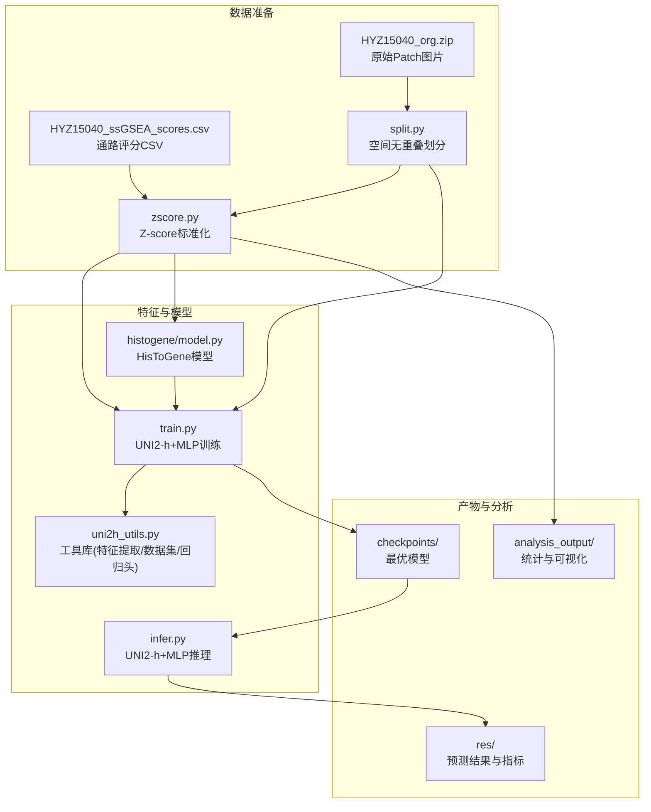
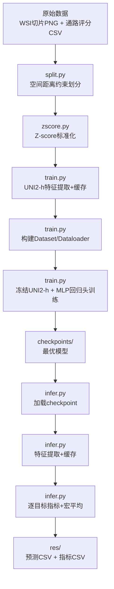
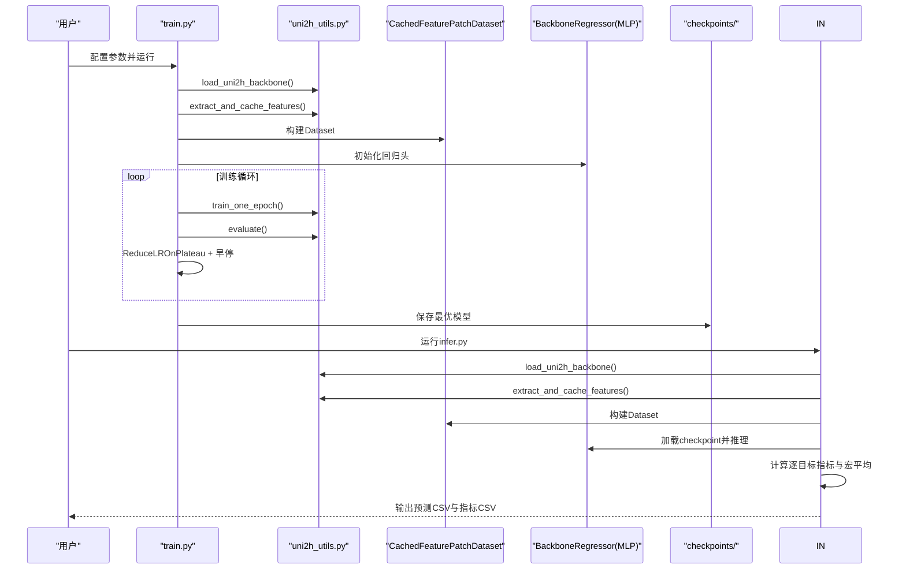
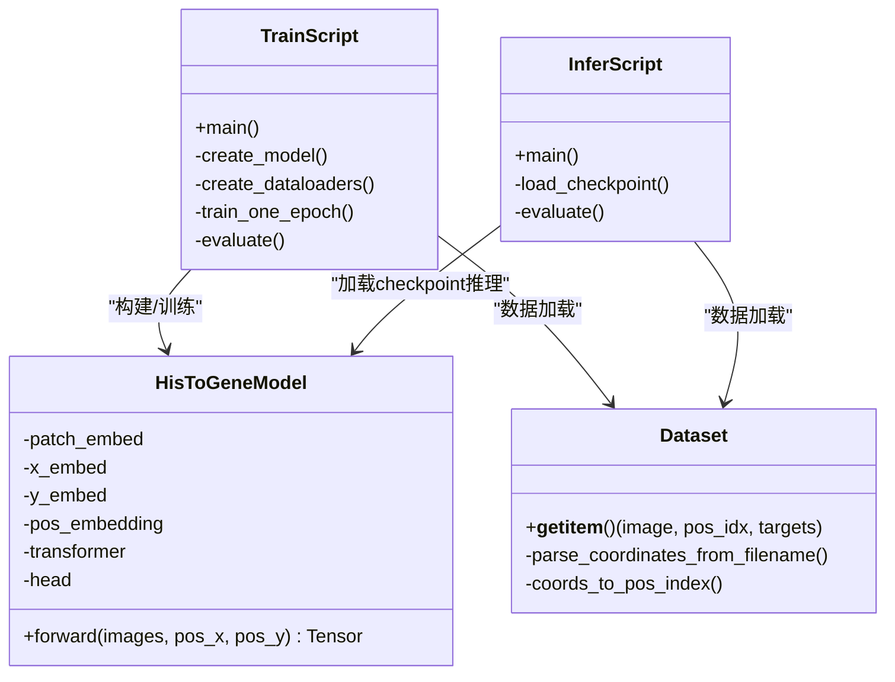
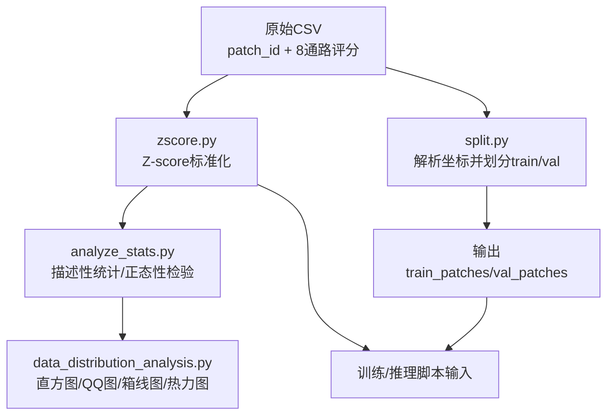
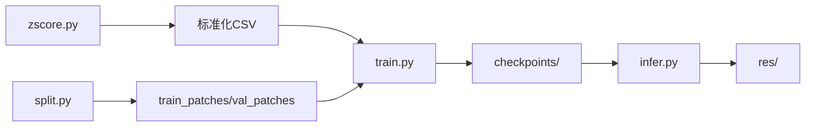

# 项目概述

<cite>
**本文引用的文件**
- [README.md](file://README.md)
- [PFMval学习指南.md](file://PFMval学习指南.md)
- [HisToGene应用规划.md](file://HisToGene应用规划.md)
- [split.py](file://split.py)
- [zscore.py](file://zscore.py)
- [uni2h/uni2h_utils.py](file://uni2h/uni2h_utils.py)
- [uni2h/train.py](file://uni2h/train.py)
- [uni2h/infer.py](file://uni2h/infer.py)
- [histogene/model.py](file://histogene/model.py)
- [HYZ15040_ssGSEA_scores.csv](file://HYZ15040_ssGSEA_scores.csv)
- [analyze_stats.py](file://analyze_stats.py)
- [data_distribution_analysis.py](file://data_distribution_analysis.py)
</cite>

## 目录
1. [简介](#简介)
2. [项目结构](#项目结构)
3. [核心组件](#核心组件)
4. [架构总览](#架构总览)
5. [详细组件分析](#详细组件分析)
6. [依赖关系分析](#依赖关系分析)
7. [性能考量](#性能考量)
8. [故障排查指南](#故障排查指南)
9. [结论](#结论)
10. [附录](#附录)

## 简介
PFMval项目旨在将空间转录组学与数字病理学相结合，通过深度学习模型从WSI（全切片成像）的组织切片中预测基因表达通路评分。项目提供了两条技术路径：
- 当前成熟路径：基于预训练UNI2-h特征的迁移学习（UNI2-h + MLP），通过冻结UNI2-h骨干网络，仅训练轻量回归头，实现高效稳定的端到端预测。
- 规划扩展路径：基于HisToGene的ViT+MLP架构，显式融合空间坐标信息，探索端到端的视觉-空间联合建模。

本项目强调“空间无重叠”的数据划分策略，避免验证集与训练集在空间上出现“数据泄漏”，并通过Z-score标准化统一通路评分量纲，提升模型训练稳定性与泛化能力。

## 项目结构
项目采用模块化设计，围绕数据预处理、特征提取、训练与推理、可视化分析四大环节展开，形成清晰的流水线。

**图表来源**
- [README.md:1-44](file://README.md#L1-L44)
- [PFMval学习指南.md:3-17](file://PFMval学习指南.md#L3-L17)
- [split.py:99-200](file://split.py#L99-L200)
- [zscore.py:141-203](file://zscore.py#L141-L203)
- [uni2h/train.py:52-227](file://uni2h/train.py#L52-L227)
- [uni2h/infer.py:43-175](file://uni2h/infer.py#L43-L175)
- [histogene/model.py:64-160](file://histogene/model.py#L64-L160)

**章节来源**
- [README.md:1-44](file://README.md#L1-L44)
- [PFMval学习指南.md:3-17](file://PFMval学习指南.md#L3-L17)

## 核心组件
- 数据预处理
  - split.py：基于文件名坐标，按空间距离阈值（默认350px）进行训练/验证集划分，确保空间无重叠。
  - zscore.py：对最后8列通路评分执行Z-score标准化，统一量纲并缓解极端值影响。
- 特征提取与缓存
  - uni2h_utils.py：封装UNI2-h骨干加载、特征提取与缓存、带缓存的Dataset、回归头MLP、训练/验证循环与指标计算。
- 训练与推理
  - train.py：加载冻结UNI2-h → 特征缓存 → 构建Dataset/Dataloader → 定义回归头 → 训练+早停+学习率调度 → 保存最优模型。
  - infer.py：加载checkpoint → 特征缓存 → 推理 → 每目标指标与宏平均 → 输出预测与指标CSV。
- 可视化与统计分析
  - analyze_stats.py：对8个通路评分进行描述性统计、正态性检验与异常值分析。
  - data_distribution_analysis.py：生成直方图、Q-Q图、箱线图、偏度峰度对比与相关性热力图，并输出统计汇总。

**章节来源**
- [split.py:22-96](file://split.py#L22-L96)
- [zscore.py:101-126](file://zscore.py#L101-L126)
- [uni2h/uni2h_utils.py:31-71](file://uni2h/uni2h_utils.py#L31-L71)
- [uni2h/train.py:68-84](file://uni2h/train.py#L68-L84)
- [uni2h/infer.py:66-75](file://uni2h/infer.py#L66-L75)
- [analyze_stats.py:12-39](file://analyze_stats.py#L12-L39)
- [data_distribution_analysis.py:65-137](file://data_distribution_analysis.py#L65-L137)

## 架构总览
从WSI切片到最终预测结果的完整数据流如下：

**图表来源**
- [PFMval学习指南.md:72-86](file://PFMval学习指南.md#L72-L86)
- [uni2h/train.py:60-115](file://uni2h/train.py#L60-L115)
- [uni2h/infer.py:48-90](file://uni2h/infer.py#L48-L90)

## 详细组件分析

### UNI2-h + MLP（当前方案）
- 设计理念
  - 冻结预训练UNI2-h骨干（24层ViT，1536维输出），仅训练轻量回归头（LayerNorm → Linear(1536→256) → GELU → Dropout → Linear(256→8)），显著降低参数量与过拟合风险，适合中小规模数据集。
- 数据流
  - 通过CachedFeaturePatchDataset从缓存读取1536维特征，从CSV读取8个通路评分标签，形成特征-标签对。
- 训练策略
  - 损失：MSELoss；优化器：AdamW；学习率调度：ReduceLROnPlateau；早停：patience=10；支持断点续训与缓存复用。
- 评估指标
  - MSE、MAE、R2、PCC；支持逐目标与宏平均两种汇总方式。

**图表来源**
- [uni2h/train.py:52-227](file://uni2h/train.py#L52-L227)
- [uni2h/infer.py:43-175](file://uni2h/infer.py#L43-L175)
- [uni2h/uni2h_utils.py:173-247](file://uni2h/uni2h_utils.py#L173-L247)

**章节来源**
- [uni2h/train.py:120-190](file://uni2h/train.py#L120-L190)
- [uni2h/infer.py:92-150](file://uni2h/infer.py#L92-L150)
- [uni2h/uni2h_utils.py:228-247](file://uni2h/uni2h_utils.py#L228-L247)

### HisToGene（规划扩展方案）
- 设计理念
  - 采用ViT编码器（8层，1024维嵌入，16注意力头），在图像patch嵌入基础上引入空间位置编码（x,y），端到端学习“哪里”的基因表达模式。
- 关键差异
  - 空间信息：显式位置编码（HisToGene）vs 仅使用预提取特征（UNI2-h）。
  - 输入处理：端到端图像→预测 vs 预提取特征→回归。
  - 参数量：较大（完整ViT+MLP）vs 小（仅MLP回归头）。
- 适配要点
  - 输出维度：从基因数量改为8个通路评分。
  - 坐标解析：从文件名解析(x,y)，并归一化到位置嵌入索引。
  - 损失函数：考虑非正态与异常值，可选用Huber Loss或加权MSE。

**图表来源**
- [histogene/model.py:64-160](file://histogene/model.py#L64-L160)
- [HisToGene应用规划.md:469-544](file://HisToGene应用规划.md#L469-L544)
- [HisToGene应用规划.md:662-764](file://HisToGene应用规划.md#L662-L764)

**章节来源**
- [HisToGene应用规划.md:32-68](file://HisToGene应用规划.md#L32-L68)
- [HisToGene应用规划.md:80-92](file://HisToGene应用规划.md#L80-L92)
- [HisToGene应用规划.md:249-320](file://HisToGene应用规划.md#L249-L320)

### 数据预处理与质量分析
- 空间划分算法
  - 从文件名解析(x,y)，计算候选验证集与已选验证集间的欧氏距离，若小于阈值（默认350px）则排除，确保空间无重叠。
- Z-score标准化
  - 对最后8列通路评分执行z=(x-mean)/std，跳过标准差为0的列，输出标准化后的CSV。
- 统计与可视化
  - 描述性统计、正态性检验（Shapiro-Wilk、D’Agostino）、异常值检测（1.5×IQR）、偏度/峰度、相关性热力图等，辅助理解数据分布与选择合适的损失函数。

**图表来源**
- [zscore.py:141-203](file://zscore.py#L141-L203)
- [analyze_stats.py:12-39](file://analyze_stats.py#L12-L39)
- [data_distribution_analysis.py:416-482](file://data_distribution_analysis.py#L416-L482)
- [split.py:99-140](file://split.py#L99-L140)

**章节来源**
- [split.py:22-96](file://split.py#L22-L96)
- [zscore.py:101-126](file://zscore.py#L101-L126)
- [analyze_stats.py:12-39](file://analyze_stats.py#L12-L39)
- [data_distribution_analysis.py:65-137](file://data_distribution_analysis.py#L65-L137)

## 依赖关系分析
- 文件间调用关系
  - split.py、zscore.py为独立脚本，不导入其他项目文件，仅生成中间产物供后续使用。
  - train.py/infer.py均导入uni2h_utils.py，依赖其工具函数与类。
  - HisToGene规划中，train.py/infer.py将导入histogene/model.py与dataset.py（当前未实现，规划中）。
- 数据流转
  - 原始数据 → split.py → train_patches/val_patches
  - 原始CSV → zscore.py → 标准化CSV
  - 标准化CSV + train_patches/val_patches → train.py → 特征缓存 + 最优模型
  - 最优模型 + val_patches → infer.py → 预测CSV + 指标CSV

**图表来源**
- [PFMval学习指南.md:324-369](file://PFMval学习指南.md#L324-L369)

**章节来源**
- [PFMval学习指南.md:257-305](file://PFMval学习指南.md#L257-L305)
- [PFMval学习指南.md:324-369](file://PFMval学习指南.md#L324-L369)

## 性能考量
- 计算效率
  - UNI2-h+MLP：冻结骨干，仅训练MLP回归头，参数量小、推理快、显存占用低，适合中小规模数据。
  - HisToGene：完整ViT+MLP，参数量大，需更强硬件与更长训练时间，但具备显式空间建模能力。
- 过拟合控制
  - UNI2-h+MLP：冻结特征、小回归头、Dropout、早停、学习率调度，天然抗过拟合。
  - HisToGene：需更严格的正则化（更高dropout、早停耐心、损失函数鲁棒性）。
- 数据质量
  - 空间无重叠划分与Z-score标准化显著提升模型稳定性与泛化能力。
  - 统计分析有助于识别异常值与分布特性，指导损失函数选择（如Huber Loss）。

[本节为通用指导，不直接分析具体文件]

## 故障排查指南
- HF Token认证失败
  - 确认HuggingFace账号与Access Token配置，或设置环境变量HF_TOKEN。
- 坐标解析失败
  - 确保Patch文件名遵循“patch_xXXXX_yYYYY.png”格式，否则无法解析坐标。
- 特征缓存缺失
  - 确认cache_root路径一致，先运行特征提取再进行训练/推理。
- GPU显存不足
  - 降低batch_size（如128或64），确保特征加载在CPU端。
- 严重过拟合
  - 增大dropout（0.3~0.5）、减小hidden_dim（128）、降低学习率。
- 标签与图片不匹配
  - 检查CSV第一列patch_id与文件名一致性。
- Z-score后出现NaN
  - 检查是否存在常数列或缺失值。
- 推理指标全NaN
  - 检查预测值是否存在常数列或极端异常值。

**章节来源**
- [PFMval学习指南.md:161-171](file://PFMval学习指南.md#L161-L171)

## 结论
PFMval项目通过严谨的数据预处理（空间无重叠划分、Z-score标准化）与高效的迁移学习范式（UNI2-h+MLP），实现了从WSI切片到基因通路评分的稳健预测。其核心优势在于：
- 明确的“空间无泄漏”数据策略，保障验证有效性；
- 冻结预训练特征+轻量回归头的工程化设计，兼顾性能与稳定性；
- 完整的训练/推理流水线与可视化分析工具，便于复现与优化。

同时，项目为HisToGene的端到端空间建模提供了清晰的适配蓝图，未来可在保持现有工程优势的基础上，进一步探索显式空间信息对预测性能的提升潜力。

[本节为总结性内容，不直接分析具体文件]

## 附录
- 技术栈与依赖
  - Python 3.10 + PyTorch 2.1.0 + CUDA 11.8
  - timm ≥ 0.9.8（加载ViT架构）
  - huggingface_hub（下载UNI2-h权重）
  - pandas + scikit-learn + Pillow + numpy 1.26.4
- 关键参数速查
  - distance_threshold_px（默认350）、batch_size（默认256）、learning_rate（默认1e-3）、hidden_dim（默认256）、dropout（默认0.2）、early_stop_patience（默认10）

**章节来源**
- [PFMval学习指南.md:174-185](file://PFMval学习指南.md#L174-L185)
- [README.md:17-28](file://README.md#L17-L28)