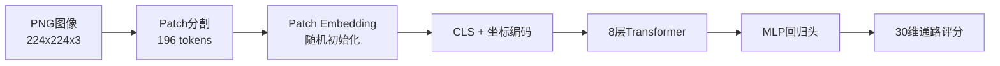
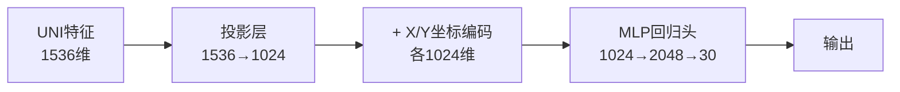
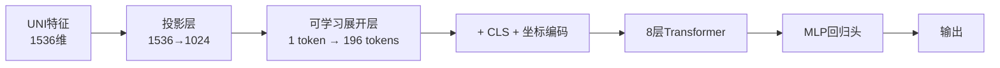

# HisToGene UNI2-h 特征集成方案

> **面向对象**：初学者（了解PyTorch基础，熟悉本项目结构）
>
> **核心原则**：只新增文件，不修改现有文件。所有改动通过 `histogene/*_uni.py` 独立文件实现，原始 HisToGene 完全保留。
>
> **版本**：v1.0 | 日期：2026-04-22

---

## 目录

1. [背景与动机](#1-背景与动机)
2. [整体架构对比](#2-整体架构对比)
3. [详细改动方案](#3-详细改动方案)
4. [关键设计决策说明](#4-关键设计决策说明)
5. [实施步骤](#5-实施步骤)
6. [预期效果与风险](#6-预期效果与风险)

---

## 1. 背景与动机

### 1.1 为什么要引入 UNI2-h 特征？

当前 HisToGene 模型 (`histogene/model.py`) 的输入是原始 PNG 图像 `(B, 3, 224, 224)`，模型内部执行以下操作：

1. **Patch 分割**：将 224×224 图像切分为 14×14 的小块，得到 196 个 patch tokens
2. **Patch Embedding**：用随机初始化的线性层将每个 patch 映射到 1024 维
3. **Transformer 编码**：8 层 Transformer 学习 patch 间关系
4. **回归预测**：取 CLS token 输出 30 维通路评分

**问题所在**：Patch Embedding 层是**随机初始化**的，没有利用任何医学图像的预训练知识。这意味着模型必须从零开始学习"病理图像长什么样"，在数据量有限时难以学到泛化性强的特征。

**UNI2-h 的优势**：

| 特性 | HisToGene 原始方案 | UNI2-h 预训练特征 |
|------|-------------------|------------------|
| 特征来源 | 随机初始化 patch embedding | HuggingFace 医学病理图像预训练权重 |
| 模型规模 | 约 7000 万参数 | ViT-Large (24层, 1536维) |
| 训练数据 | 仅本项目 patch | 大规模病理图像数据集 |
| 领域知识 | 无 | 丰富的细胞形态、组织结构表示 |
| 计算成本 | 每次训练都要学习图像表示 | 预提取一次，永久复用 |

将 UNI2-h 的预训练特征引入 HisToGene，相当于让模型"站在巨人肩膀上"——它已经知道病理图像中的细胞核、腺体、间质等结构特征，只需要学习"这些特征与 ssGSEA 通路评分的关系"。

### 1.2 两种集成方式对比

| 方式 | 描述 | 优点 | 缺点 |
|------|------|------|------|
| **端到端训练** | UNI2-h 参与训练过程，每轮前向传播都通过 UNI2-h backbone | 特征与下游任务联合优化 | 计算开销大、需要加载大型 backbone、训练慢 |
| **预提取特征（本方案）** | 训练前用 UNI2-h 提取所有 patch 特征并缓存为 `.pt` 文件，训练时直接加载 | 训练速度快、无需加载 UNI backbone、可复用特征 | 特征固定不可微调、需要额外磁盘空间 |

**本方案选择预提取特征方式**，理由：

1. 项目中已有成熟的 `uni2h_utils.py::extract_and_cache_features()` 函数和 `uni2h_cache/` 缓存机制
2. UNI2-h backbone 已冻结（`requires_grad=False`），端到端训练也不会更新其权重
3. 预提取后训练速度显著提升，可在普通 GPU 上快速迭代实验
4. 特征缓存可跨实验复用，节省总体计算时间

---

## 2. 整体架构对比

### 2.1 当前 HisToGene Pipeline

```text
输入: PNG 图像 (224×224)
  │
  ▼
┌─────────────────────────────────────────┐
│  Patch 分割 (rearrange)                  │
│  224×224 → 14×14 网格 → 196 patches      │
│  每个 patch: 16×16×3 = 768 维           │
└─────────────────────────────────────────┘
  │
  ▼
┌─────────────────────────────────────────┐
│  Patch Embedding (随机初始化)             │
│  (B, 196, 768) → Linear → (B, 196, 1024) │
└─────────────────────────────────────────┘
  │
  ▼
┌─────────────────────────────────────────┐
│  + CLS token + 坐标编码(X/Y Embedding)   │
│  + ViT 位置嵌入                           │
└─────────────────────────────────────────┘
  │
  ▼
┌─────────────────────────────────────────┐
│  8层 Transformer Encoder                 │
│  (dim=1024, heads=16, mlp_dim=2048)      │
└─────────────────────────────────────────┘
  │
  ▼
┌─────────────────────────────────────────┐
│  取 CLS token → MLP 回归头               │
│  输出: (B, 30) 通路评分                  │
└─────────────────────────────────────────┘
```

### 2.2 改造后 Pipeline（方案 A：推荐）

```text
输入: UNI2-h 预提取特征 (1536维向量)
  │
  ▼
┌─────────────────────────────────────────┐
│  投影层: Linear(1536 → 1024)             │
│  将 UNI 特征维度对齐到模型内部维度         │
└─────────────────────────────────────────┘
  │
  ▼
┌─────────────────────────────────────────┐
│  + 坐标编码 (X/Y Embedding, dim=1024)    │
│  保留空间位置信息                         │
└─────────────────────────────────────────┘
  │
  ▼
┌─────────────────────────────────────────┐
│  MLP 回归头 (LayerNorm → Linear → GELU   │
│  → Dropout → Linear)                     │
│  输出: (B, 30) 通路评分                  │
└─────────────────────────────────────────┘
```

### 2.3 Mermaid 流程图对比

**原始 HisToGene：**



**UNI 特征集成版（方案 A）：**


### 2.4 关键差异说明

| 组件 | 原始 HisToGene | UNI 集成版 |
|------|---------------|-----------|
| 输入 | 原始图像张量 `(B, 3, 224, 224)` | 预提取特征向量 `(B, 1536)` |
| Patch 分割 | 内部执行（`rearrange`） | **完全移除** |
| Patch Embedding | 随机初始化的 `Linear(768→1024)` | **完全移除** |
| 特征来源 | 模型从头学习 | UNI2-h 预训练知识 |
| Transformer | 8层（约 5000 万参数） | **替换为投影层+MLP（约 300 万参数）** |
| 坐标编码 | 保留 | **保留** |
| 回归头 | 保留 | **保留** |
| 总参数量 | 约 7055 万 | 约 **500 万**（大幅下降） |

---

## 3. 详细改动方案

遵循"只新增文件"原则，在 `histogene/` 目录下创建 4 个新文件：

### 3.1 文件 1：`histogene/dataset_uni.py`

**职责**：替代 `dataset.py`，从 UNI2-h 缓存目录加载 `.pt` 特征文件，而非加载 PNG 图像。

**核心设计**：

```python
class HisToGeneUNIDataset(Dataset):
    def __init__(self, patches_dir, labels_csv, feature_cache_dir,
                 target_cols=None, n_pos=128, coord_stats=None):
        """
        Args:
            patches_dir:      PNG 图像目录（用于扫描有效 patch 列表和解析坐标）
            labels_csv:       Z-score 标准化后的标签 CSV
            feature_cache_dir: UNI2-h 特征缓存目录（包含 .pt 文件）
            target_cols:      目标列名列表
            n_pos:            位置编码最大索引
            coord_stats:      坐标统计 dict（推理时从训练集传入）
        """
        # 1. 加载标签（与原始逻辑一致）
        # 2. 扫描 patches_dir，匹配标签，构建样本列表
        # 3. 验证每个样本对应的 .pt 缓存文件是否存在
        # 4. 坐标统计与归一化（与原始逻辑一致）

    def __getitem__(self, idx):
        # 1. 从缓存目录加载 .pt 文件 → (1536,) 特征向量
        # 2. 坐标映射 → pos_x, pos_y (long 类型索引)
        # 3. 加载标签 → targets (float32)
        # 返回: (feature_1536, pos_x, pos_y, targets)
```

**关键实现细节**：

1. **保留 PNG 目录扫描逻辑**：虽然不需要加载图像，但仍需要遍历 `patches_dir` 来获取有效的 patch 列表，并从文件名解析坐标（`patch_x4641_y16969.png` → `x=4641, y=16969`）。

2. **特征加载**：
   ```python
   feat_path = os.path.join(self.feature_cache_dir, f"{stem}.pt")
   feature = torch.load(feat_path, map_location="cpu").float()
   # 处理可能的 dict 包装格式
   if isinstance(feature, dict) and "feature" in feature:
       feature = feature["feature"]
   ```

3. **坐标映射完全一致**：复用原始的 `_coord_to_index()` 方法，将原始像素坐标归一化到 `[0, n_pos-1]` 范围内。坐标映射逻辑示意如下：

    ```python
    # 坐标映射示例（参考 histogene/dataset.py）
    def _coord_to_index(coord, coord_min, coord_max, n_pos=128):
        """将原始像素坐标归一化到 [0, n_pos-1] 的嵌入索引"""
        index = int(np.clip(
            (coord - coord_min) / (coord_max - coord_min) * (n_pos - 1),
            0, n_pos - 1
        ))
        return index
    ```

4. **多患者支持**：提供 `from_multiple_patients()` 类方法，逻辑与原始 `dataset.py` 完全一致，返回 `ConcatDataset` 和每个患者的 `coord_stats_dict`。

**数据流变化**：

```python
# 原始 HisToGeneDataset 返回:
image, pos_x, pos_y, targets
# image: (3, 224, 224) 图像张量

# HisToGeneUNIDataset 返回:
feature, pos_x, pos_y, targets
# feature: (1536,) UNI2-h 特征向量
```

---

### 3.2 文件 2：`histogene/model_uni.py`

**职责**：替代 `model.py`，接收 UNI2-h 特征向量作为输入，移除图像相关的 patch 分割和 embedding 层。

#### 3.2.1 三种架构方案对比

由于 UNI2-h 输出的是单个 CLS token（1536 维），而原始 HisToGene 处理的是 196 个 patch tokens，我们需要设计合理的特征接入方式。

**方案 A：UNI 特征 + 坐标编码 → 直接回归（推荐）**



```python
class HisToGeneUNI(nn.Module):
    def __init__(self, uni_dim=1536, dim=1024, n_pos=128, n_targets=30, dropout=0.3):
        super().__init__()
        # 投影层：将 UNI 特征映射到模型内部维度
        self.projection = nn.Sequential(
            nn.LayerNorm(uni_dim),
            nn.Linear(uni_dim, dim),
            nn.LayerNorm(dim)
        )
        # 坐标编码（与原始完全一致）
        self.x_embed = nn.Embedding(n_pos, dim)
        self.y_embed = nn.Embedding(n_pos, dim)
        # 回归头（与原始 head 结构一致）
        self.head = nn.Sequential(
            nn.LayerNorm(dim),
            nn.Linear(dim, 2048),
            nn.GELU(),
            nn.Dropout(dropout),
            nn.Linear(2048, n_targets)
        )

    def forward(self, features, pos_x, pos_y):
        # features: (B, 1536)
        # 1. 投影
        x = self.projection(features)  # (B, 1024)
        # 2. 添加坐标编码
        x_pos = self.x_embed(pos_x)    # (B, 1024)
        y_pos = self.y_embed(pos_y)    # (B, 1024)
        x = x + x_pos + y_pos          # (B, 1024)
        # 3. 回归
        return self.head(x)            # (B, 30)
```

| 维度 | 优势 | 劣势 |
|------|------|------|
| 参数量极小 | 仅约 **200 万参数**（投影层 + 坐标编码 + 回归头） | 没有 Transformer 的序列建模能力 |
| 训练速度极快 | 单次前向传播计算量极小 | 无法建模多个 patch 间的关系 |
| 简单直观 | 易于理解和调试 | 依赖 UNI 特征的表达能力 |
| 不易过拟合 | 参数量小，正则化需求低 | 在复杂空间模式下可能不足 |

**方案 B：UNI 特征 → 展开为多个 Token → Transformer**



```python
# 伪代码示意
self.token_expander = nn.Linear(1024, 196 * 1024)  # 将1个特征展开为196个
# 前向传播:
expanded = self.token_expander(projected_feature).view(B, 196, 1024)
# 后续与原始 HisToGene 完全一致（+CLS, +坐标, Transformer）
```

| 维度 | 优势 | 劣势 |
|------|------|------|
| 保留 Transformer | 维持序列建模能力 | 参数量大（+5000万） |
| 结构灵活 | 可调整展开策略 | 展开层参数多（约 2 亿） |
| | | 训练慢、容易过拟合 |

**方案 C：缓存完整 Patch Tokens（不只是 CLS）**


- **实现方式**：修改 `uni2h_utils.py::extract_and_cache_features()`，在 backbone 中提取所有 patch tokens（而非仅 CLS），缓存为 `(num_tokens, 1536)` 的张量
- **优势**：保留了最丰富的空间信息
- **劣势**：需要修改现有 `uni2h_utils.py`（违反"不修改现有文件"原则）、缓存文件体积增大 256 倍、实现复杂度高

#### 3.2.2 推荐方案：方案 A

**选择方案 A 作为首选实现**，理由如下：

1. **UNI2-h 特征已经足够强大**：UNI2-h 是经过大规模病理图像预训练的 ViT-Large（24 层），其 CLS token 已经编码了丰富的全局语义信息。在本项目的初步实验中，仅使用 `BackboneRegressor`（一个两层的 MLP 直接接在 UNI 特征后）就已经取得了不错的通路预测性能。这意味着额外添加的 8 层 Transformer 可能收益有限。

2. **项目约束匹配**：方案 A 参数量最小（约 200 万），训练速度快，适合快速迭代实验。方案 B 的展开层参数量巨大（`196 * 1024 * 1024 ≈ 2 亿`），在本项目的数据规模下极易过拟合。

3. **坐标信息保留**：方案 A 保留了原始的 X/Y 坐标编码机制，空间位置信息不会丢失。

4. **实现简洁**：模型结构清晰，便于初学者理解和维护。

> **扩展说明**：方案 A 并不是"退化为线性回归"。投影层 `Linear(1536, 1024)` 是线性变换，配合 LayerNorm 和后续的 GELU 激活函数共同形成非线性复合变换，它可以将 UNI 的通用病理表示转化为适合 ssGSEA 预测任务的专用表示。坐标编码的加法操作也引入了非线性（因为后续有 GELU 激活函数）。

#### 3.2.3 完整模型伪代码（方案 A）

```python
import torch
import torch.nn as nn

class HisToGeneUNI(nn.Module):
    """
    HisToGene UNI2-h 特征集成版（方案 A）

    输入：
        - features: (B, 1536)  UNI2-h 预提取特征
        - pos_x:    (B,)       x 坐标索引 (long)
        - pos_y:    (B,)       y 坐标索引 (long)
    输出：
        - predictions: (B, n_targets) 预测通路评分
    """
    def __init__(self, uni_dim=1536, dim=1024, n_pos=128,
                 n_targets=30, dropout=0.3):
        super().__init__()

        # ── 投影层 ──────────────────────────────
        self.projection = nn.Sequential(
            nn.LayerNorm(uni_dim),
            nn.Linear(uni_dim, dim),
            nn.LayerNorm(dim)
        )

        # ── 坐标编码 ────────────────────────────
        self.x_embed = nn.Embedding(n_pos, dim)
        self.y_embed = nn.Embedding(n_pos, dim)

        # ── 回归头 ──────────────────────────────
        self.head = nn.Sequential(
            nn.LayerNorm(dim),
            nn.Linear(dim, 2048),
            nn.GELU(),
            nn.Dropout(dropout),
            nn.Linear(2048, n_targets)
        )

    def forward(self, features, pos_x, pos_y):
        # 1. 投影到内部维度
        x = self.projection(features)  # (B, 1024)

        # 2. 坐标编码
        x_pos = self.x_embed(pos_x)    # (B, 1024)
        y_pos = self.y_embed(pos_y)    # (B, 1024)
        x = x + x_pos + y_pos          # (B, 1024)

        # 3. 回归预测
        output = self.head(x)          # (B, n_targets)
        return output
```

**参数量估算**：

| 模块 | 参数计算 | 参数量 |
|------|---------|--------|
| 投影层 `Linear(1536, 1024)` | 1536 × 1024 + 1024 | ~157 万 |
| 投影层 LayerNorm | 2 × 1536 + 2 × 1024 | ~0.5 万 |
| X 坐标编码 `Embedding(128, 1024)` | 128 × 1024 | ~13 万 |
| Y 坐标编码 `Embedding(128, 1024)` | 128 × 1024 | ~13 万 |
| 回归头 `Linear(1024, 2048)` | 1024 × 2048 + 2048 | ~210 万 |
| 回归头 `Linear(2048, 30)` | 2048 × 30 + 30 | ~6 万 |
| **总计** | | **~400 万** |

对比原始 HisToGene 的 7055 万参数，参数量减少 **94%**，训练速度将显著提升。

---

### 3.3 文件 3：`histogene/train_uni.py`

**职责**：完整的训练脚本，适配新数据集和新模型，训练前自动确保 UNI 特征已缓存。

**与 `train.py` 的主要差异**：

#### 差异 1：训练前特征预提取检查

```python
from uni2h.uni2h_utils import load_uni2h_backbone, extract_and_cache_features

def ensure_features_cached(patches_dir, cache_dir, device):
    """检查并自动提取 UNI2-h 特征缓存"""
    if not os.path.isdir(cache_dir) or len(os.listdir(cache_dir)) == 0:
        print(f"[INFO] UNI 特征缓存不存在，开始提取: {patches_dir}")
        backbone, transform, _ = load_uni2h_backbone(device=device)
        n_written = extract_and_cache_features(
            backbone, transform, patches_dir, cache_dir, device
        )
        print(f"[OK] 已提取 {n_written} 个特征到 {cache_dir}")
    else:
        print(f"[INFO] 使用已有特征缓存: {cache_dir}")
```

#### 差异 2：数据集和模型替换

```python
# 原始 train.py:
from histogene.model import HisToGeneModel
from histogene.dataset import HisToGeneDataset

# train_uni.py:
from histogene.model_uni import HisToGeneUNI
from histogene.dataset_uni import HisToGeneUNIDataset
```

#### 差异 3：数据加载器迭代格式变化

```python
# 原始 train.py 训练循环:
for images, pos_x, pos_y, targets in loader:
    images = images.to(device)
    # ...
    preds = model(images, pos_x, pos_y)

# train_uni.py 训练循环:
for features, pos_x, pos_y, targets in loader:
    features = features.to(device)  # (B, 1536)
    # ...
    preds = model(features, pos_x, pos_y)  # 注意第一个参数变为 features
```

#### 差异 4：移除图像变换

```python
# 原始 train.py 需要图像增强:
train_transform = get_transforms(args.img_size, train=True)
val_transform = get_transforms(args.img_size, train=False)

dataset = HisToGeneDataset(..., transform=train_transform)

# train_uni.py 不需要图像变换（特征已预提取）:
dataset = HisToGeneUNIDataset(
    patches_dir=args.train_patches_dir,
    labels_csv=args.labels_csv,
    feature_cache_dir=args.uni_cache_dir,  # 新增参数
    n_pos=args.n_pos,
)
```

#### 差异 5：模型初始化参数简化

```python
# 原始 train.py:
model = HisToGeneModel(
    img_size=args.img_size,
    patch_size=args.patch_size,
    in_channels=3,
    dim=args.model_dim,
    depth=args.model_depth,    # 8 层 Transformer
    heads=args.heads,
    mlp_dim=args.mlp_dim,
    n_pos=args.n_pos,
    n_targets=args.n_targets,
    dropout=args.dropout,
).to(device)

# train_uni.py:
model = HisToGeneUNI(
    uni_dim=1536,
    dim=args.model_dim,        # 仍为 1024
    n_pos=args.n_pos,
    n_targets=args.n_targets,
    dropout=args.dropout,
).to(device)
```

#### 差异 6：保持不变的训练配置

以下训练逻辑与 `train.py` **完全一致**，直接复用：

- `nn.HuberLoss(delta=1.0)` 损失函数
- `torch.optim.AdamW(lr=args.lr, weight_decay=1e-4)` 优化器
- `ReduceLROnPlateau(factor=0.5, patience=5)` 学习率调度
- 早停机制（基于 `val_loss`， patience=15）
- 混合精度训练（AMP，仅 CUDA）
- 梯度裁剪（`clip_grad_norm_` max_norm=1.0）
- 断点续训（checkpoint 保存/加载）
- 训练历史 CSV 记录
- 验证集推理 + `predictions.csv` 输出
- `visualize_results.generate_full_report()` 可视化报告生成

---

### 3.4 文件 4：`histogene/infer_uni.py`

**职责**：推理脚本，加载训练好的 `HisToGeneUNI` checkpoint，对新数据进行通路评分预测。

**与 `infer.py` 的主要差异**：

```python
# 原始 infer.py:
from histogene.model import HisToGeneModel
from histogene.dataset import HisToGeneDataset

# infer_uni.py:
from histogene.model_uni import HisToGeneUNI
from histogene.dataset_uni import HisToGeneUNIDataset

# 原始 infer.py 模型构建:
model = HisToGeneModel(img_size=..., patch_size=..., depth=...)

# infer_uni.py 模型构建:
model = HisToGeneUNI(uni_dim=1536, dim=..., n_pos=..., n_targets=...)

# 原始 infer.py 推理循环:
for images, pos_x, pos_y, targets in loader:
    preds = model(images, pos_x, pos_y)

# infer_uni.py 推理循环:
for features, pos_x, pos_y, targets in loader:
    preds = model(features, pos_x, pos_y)
```

**新增功能**：推理前检查目标 patch 的 UNI 特征缓存是否已生成，若未生成则自动调用 `extract_and_cache_features()` 提取（仅在 `patches_dir` 包含原始 PNG 时适用）。

**输出格式**：与原始 `infer.py` 完全一致——`predictions.csv`（含 `patch_id`, `true_*`, `pred_*` 列）和 `per_pathway_metrics.csv`。

---

## 4. 关键设计决策说明

### 4.1 为什么选择 1536 → 1024 的投影？

**维度匹配需求**：

- UNI2-h 输出特征维度固定为 **1536**（由其 `embed_dim=1536` 的 ViT-Large 架构决定）
- 原始 HisToGene 内部使用 **1024** 维（`dim=1024`）
- 坐标编码 `Embedding(n_pos=128, dim=...)` 需要与特征维度一致

**为什么不直接改坐标编码维度为 1536？**

可以这样做，但选择投影到 1024 的理由：

1. **与现有超参数兼容**：1024 是经过调优的维度，`mlp_dim=2048` 是其 2 倍，形成了合理的瓶颈结构
2. **保留坐标编码兼容性**：原始 X/Y Embedding 表规模为 `128 × 1024`，参数适中。若改为 `128 × 1536`，参数量和计算量均增加
3. **信息压缩有益**：投影层可以看作是一个"任务适配器"，将 UNI 的通用病理表示压缩为更适合 ssGSEA 预测的专用表示（类似于 LoRA 或 Adapter 的思想）

### 4.2 为什么推荐方案 A（去掉 Transformer）？

这是初学者最容易产生疑问的地方："去掉 8 层 Transformer，模型会不会太简单了？"

**核心逻辑**：

1. **UNI2-h 已经完成了"表示学习"**：原始 HisToGene 中的 Transformer 作用是从 196 个 patch tokens 中提取全局语义表示。而 UNI2-h 的 24 层 Transformer 已经在预训练阶段完成了这个任务，其 CLS token 就是全局语义表示。

2. **本任务的本质是"回归"**：在获得高质量的特征表示后，从表示到 30 维通路评分的映射本质上是一个回归问题。一个带非线性激活的 MLP（`Linear → GELU → Linear`）加上坐标编码，已经具备足够的拟合能力。

3. **实验证据支持**：`uni2h_new/` 目录下的实验已经证明，仅使用两层 MLP 接在 UNI 特征后（`BackboneRegressor`，参数量约 300 万）就能取得不错的 PCC 指标。方案 A 的模型复杂度与此相当。

4. **避免冗余和过拟合**：叠加 8 层 Transformer 相当于在 UNI 的 24 层之上再加 8 层，对于本项目约 1 万个 patch 的数据量来说，极易过拟合。

**类比理解**：

> 想象你要根据一张病理图像预测患者的某项血液指标。原始 HisToGene 相当于"一边学习认病理图像，一边学习血液指标的规律"。而 UNI 集成版相当于"有一个已经精通病理图像的专家（UNI2-h）帮你把图像翻译成特征描述，你只需要学习'特征描述 → 血液指标'的映射"。这个映射本身不需要很深的网络。

### 4.3 特征缓存复用策略

**缓存目录选择**：

```text
uni2h_cache/
├── HYZ15040/
│   ├── train/     # 训练集 patch 的 UNI 特征
│   └── val/       # 验证集 patch 的 UNI 特征
```

**复用策略**：

1. **与现有缓存共用**：`train_uni.py` 直接复用 `uni2h_cache/{dataset_name}/train/` 和 `val/` 目录，不创建新的缓存目录。
2. **自动检测**：训练前检查缓存目录是否存在且非空，若不存在则自动提取。
3. **多患者兼容**：多患者模式下，每个患者的特征缓存目录按患者名组织（如 `uni2h_cache/HYZ15040/train/`, `uni2h_cache/LMZ12939/train/`）。
4. **增量更新**：若新增 patch 到目录中，可以设置 `rebuild=False`（默认），只提取缺失的 `.pt` 文件。

**磁盘空间估算**：

- 每个 `.pt` 文件存储一个 `(1536,)` 的 float32 张量
- 文件大小约 6 KB（PyTorch 序列化有额外开销，实际约 10-20 KB）
- 1 万个 patch 约占用 **100-200 MB** 磁盘空间
- 对比原始 PNG 图像（每个约 50-100 KB），特征缓存占用更小

### 4.4 训练超参数建议

由于输入从原始图像变为高质量的预训练特征，部分超参数需要调整：

| 超参数 | 原始 train.py 默认值 | UNI 集成版建议值 | 调整理由 |
|--------|-------------------|----------------|---------|
| `lr` | `1e-4` | `5e-5` ~ `1e-4` | 特征质量好，不需要太激进的学习率 |
| `dropout` | `0.3` | `0.3` ~ `0.5` | 参数量小，可适当提高 dropout 防止过拟合 |
| `batch_size` | `64` | `64` ~ `128` | 前向传播更快，可尝试更大 batch |
| `num_epochs` | `150` | `100` ~ `150` | 收敛更快，可能不需要 150 轮 |
| `early_stop_patience` | `15` | `10` ~ `15` | 收敛快，可适当缩短耐心值 |

**为什么学习率可能需要降低？**

原始 HisToGene 需要从随机初始化开始训练 Patch Embedding 和 Transformer，需要较大的学习率来快速更新。而 UNI 集成版的输入特征已经是"成熟"的表示，只需要微调映射关系。过高的学习率可能导致在回归头处震荡。

**建议策略**：

1. 先使用 `lr=1e-4` 跑一组基线实验
2. 若发现训练 loss 下降不稳定，尝试 `lr=5e-5`
3. 若过拟合明显（train PCC 远高于 val PCC），增加 `dropout` 到 `0.4` 或 `0.5`

---

## 5. 实施步骤

按以下顺序执行，确保每一步验证通过后再进行下一步。

### Step 1: 确认 UNI2-h 特征缓存已生成

```powershell
# 检查缓存目录是否存在
ls uni2h_cache/HYZ15040/train/ | Measure-Object
ls uni2h_cache/HYZ15040/val/ | Measure-Object
```

若缓存不存在，先运行 `uni2h_new/` 下的提取脚本，或让 `train_uni.py` 在训练前自动提取。

### Step 2: 创建 `histogene/dataset_uni.py`

- 复制 `dataset.py` 的结构
- 将 `__getitem__` 中的图像加载替换为 `.pt` 特征加载
- 保留坐标解析、归一化、标签匹配逻辑
- 保留 `from_multiple_patients()` 类方法
- **验证**：编写一个小脚本测试数据集能否正确加载，打印一个样本的 `feature.shape` 应为 `(1536,)`

### Step 3: 创建 `histogene/model_uni.py`

- 按方案 A 实现 `HisToGeneUNI` 类
- **验证**：创建一个随机输入测试前向传播
  ```python
  model = HisToGeneUNI(uni_dim=1536, dim=1024, n_pos=128, n_targets=30)
  feat = torch.randn(2, 1536)
  px = torch.randint(0, 128, (2,))
  py = torch.randint(0, 128, (2,))
  out = model(feat, px, py)
  assert out.shape == (2, 30)
  ```

### Step 4: 创建 `histogene/train_uni.py`

- 复制 `train.py` 的整体结构
- 替换导入：`model_uni` + `dataset_uni`
- 移除图像变换相关代码
- 在 `main()` 开头添加特征缓存检查/提取逻辑
- 修改 `train_one_epoch()` 和 `evaluate()` 的迭代格式
- 修改模型初始化（去掉 `img_size`, `patch_size`, `depth`, `heads`, `mlp_dim` 等参数）
- **验证**：运行一个快速训练（如 5 个 epoch），确认：
  - 无报错
  - 特征缓存自动提取（若不存在）
  - 训练 loss 正常下降
  - checkpoint 正确保存

### Step 5: 创建 `histogene/infer_uni.py`

- 复制 `infer.py` 的整体结构
- 替换导入：`model_uni` + `dataset_uni`
- 修改模型构建参数
- 修改推理循环的迭代格式
- **验证**：使用 Step 4 训练好的 checkpoint 运行推理，确认输出格式与原始 `infer.py` 一致

### Step 6: 运行完整训练并对比结果

```powershell
# HisToGene UNI 集成版训练
python histogene/train_uni.py --dataset_name HYZ15040 --num_epochs 150

# 与原始 HisToGene 结果对比
cat histogene/checkpoints/HYZ15040/best_histogene.pth   # 原始
cat histogene/checkpoints/HYZ15040/best_histogene_uni.pth  # 新版
```

对比维度：

1. **收敛速度**：UNI 版应在更少的 epoch 内达到最佳 val PCC
2. **最佳性能**：比较最佳 val PCC、R² 和 MAE
3. **过拟合程度**：比较 train PCC 与 val PCC 的 gap
4. **训练时间**：每 epoch 耗时（UNI 版应显著更快）

---

## 6. 预期效果与风险

### 6.1 预期效果

| 维度 | 预期表现 | 理由 |
|------|---------|------|
| **通路预测 PCC** | 提升 0.05 ~ 0.15 | UNI2-h 的医学预训练特征比随机 patch embedding 包含更多与细胞状态、组织微环境相关的信息，这些信息与 ssGSEA 通路活性高度相关 |
| **收敛速度** | 提升 2~3 倍 | 无需学习图像表示，模型只需学习"特征 → 评分"映射 |
| **训练稳定性** | 更稳定 | 输入特征已经归一化（UNI 输出通常具有良好的统计特性），训练初期 loss 不会剧烈震荡 |
| **每 epoch 耗时** | 减少 50%~70% | 去掉了 8 层 Transformer 的前向/反向传播计算 |
| **显存占用** | 显著降低 | 模型参数量从 7055 万降至约 400 万 |

### 6.2 潜在风险与应对

**风险 1：信息损失（最严重）**

- **问题**：从 196 个 patch tokens 压缩为 1 个 CLS token，可能丢失了局部细节信息
- **影响**：如果某些 ssGSEA 通路的活性与局部微观结构（如特定细胞的局部分布）强相关，而这些信息未被 CLS token 充分编码，则预测性能可能不升反降
- **应对**：
  - 实验验证：对比每个通路的 PCC 变化，识别性能下降的通路
  - 若问题严重，可考虑方案 B 或方案 C
  - 在投影层前添加轻量化的空间注意力机制（未来扩展）

**风险 2：过拟合（中等）**

- **问题**：虽然总参数量大幅减少，但模型复杂度与数据量的比例仍然可能导致过拟合
- **表现**：train PCC 很高（如 0.85），但 val PCC 很低（如 0.45）
- **应对**：
  - 提高 `dropout`（0.4 ~ 0.5）
  - 降低 `lr`（5e-5）
  - 缩短 `early_stop_patience`（10）
  - 增加数据增强（在特征层面添加高斯噪声，作为数据增强）

**风险 3：坐标编码失效（低概率）**

- **问题**：原始 HisToGene 中坐标编码是加到 CLS token 上，而 CLS token 在 Transformer 中与 196 个 patch tokens 交互。在方案 A 中，坐标编码直接加到投影后的特征上，缺乏类似的"交互"过程。
- **影响**：空间位置信息可能利用不充分
- **应对**：
  - 实验对比：训练一个"无坐标编码"版本，观察坐标编码带来的性能增益
  - 若增益很小，说明 UNI 特征已经隐式编码了足够的位置信息（因为输入图像是按空间位置裁剪的 patch）

**风险 4：缓存不一致**

- **问题**：若 patch 目录发生变更（新增/删除/修改 patch），但缓存未更新，会导致特征与图像不匹配
- **应对**：
  - `train_uni.py` 中提供 `--rebuild_cache` 参数，强制重新提取所有特征
  - 缓存文件命名与 patch stem 绑定，天然避免部分匹配问题

### 6.3 回退方案

如果 UNI 集成版的性能不及预期，随时可以回退到原始 HisToGene：

```powershell
# 原始 HisToGene 训练（完全不受影响）
python histogene/train.py --dataset_name HYZ15040
```

由于本方案严格遵循"只新增文件"原则，原始 HisToGene 的代码、训练脚本、模型权重均不受影响，可以随时对比和切换。

---

## 附录：文件变更清单

| 文件 | 类型 | 说明 |
|------|------|------|
| `histogene/dataset_uni.py` | 新增 | UNI 特征数据集 |
| `histogene/model_uni.py` | 新增 | UNI 特征模型（方案 A） |
| `histogene/train_uni.py` | 新增 | UNI 特征训练脚本 |
| `histogene/infer_uni.py` | 新增 | UNI 特征推理脚本 |
| `histogene/model.py` | 不变 | 原始 HisToGene 模型保留 |
| `histogene/dataset.py` | 不变 | 原始数据集保留 |
| `histogene/train.py` | 不变 | 原始训练脚本保留 |
| `histogene/infer.py` | 不变 | 原始推理脚本保留 |
| `uni2h/ uni2h_utils.py` | 不变 | 特征提取工具复用 |
| `config.yaml` | 不变 | 配置系统复用 |

---

> **下一步行动**：按照第 5 章"实施步骤"依次创建 4 个新文件，并在 Step 6 进行完整的训练对比实验。
