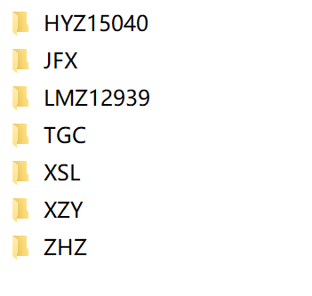
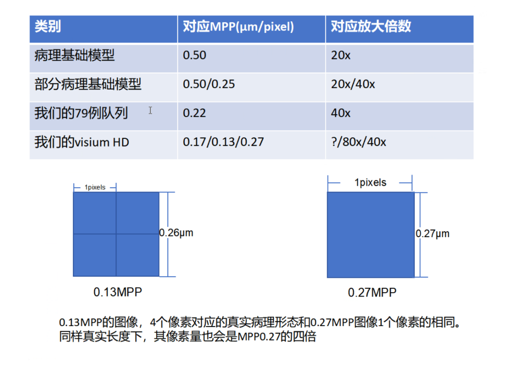
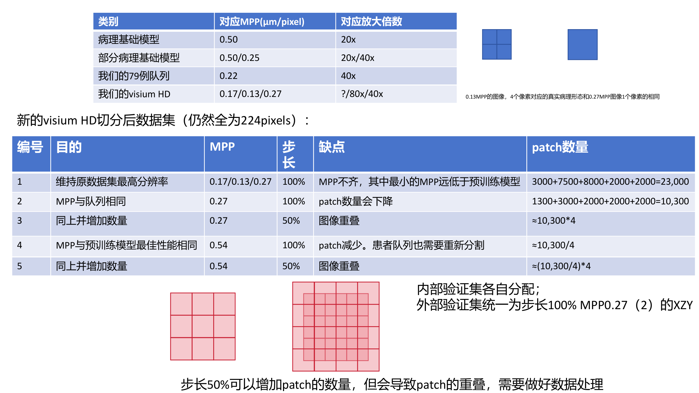

# 2026-06-30 数据最新情报完整提取

> 本文件为源 DOCX 与 PDF 的 Markdown 提取稿，包含可抽取正文、表格、图片资产引用，以及经视觉核对转写的图片内容。

## 来源文件

- DOCX: `D:\AI空间转录病理研究\文献\数据最新情报.docx`
- PDF: `D:\AI空间转录病理研究\文献\260627 空转patch分割.pdf`
- 输出时间: 2026-06-30 23:58:37

## 提取完整性说明

- DOCX: 提取到 4 条非空段落，2 张嵌入图片；图片已保存到 `2026-06-30_数据最新情报_完整提取_assets/` 并在下文引用。
- PDF: 提取到 1 页；第 1 页已渲染为 PNG 进行视觉核对，文本和主要表格均可抽取。
- 图片中的文字已根据视觉核对转写；原图仍保留，便于后续复核。

---

## 一、DOCX：数据最新情报.docx

### 1. 可抽取正文

#### 当前服务器数据情况

我们5张7例的visium HD都分割好啦，放在D:/aipatho/Patch/visiumhd_patch文件夹，这次加了一个MPP(μm/pixel）指标用于划分。之前的划分方式在编号1文件夹中。同时加了按照MPP统一的patch分割方式，分别在2-5文件夹中。大家可能要对比试一下哪种分割性能较好，外部验证集可以用文件夹2的xzy做留一验证。具体的分割方式我在组会上再详细介绍一下

一个附加要求：优先取XZY作为跨患者训练外部验证集，建议先做XZY为外部验证集的训练对比5种划分方式效果，后续再做交叉留一训练。

#### 病理数据集：

### 2. DOCX 嵌入图片与转写

#### 图片 1



转写内容：

- HYZ15040
- JFX
- LMZ12939
- TGC
- XSL
- XZY
- ZHZ

#### 图片 2



转写内容：

| 类别 | 对应MPP(μm/pixel) | 对应放大倍数 |
| --- | --- | --- |
| 病理基础模型 | 0.50 | 20x |
| 部分病理基础模型 | 0.50/0.25 | 20x/40x |
| 我们的79例队列 | 0.22 | 40x |
| 我们的visium HD | 0.17/0.13/0.27 | ?/80x/40x |

- 0.13MPP 的图像：4 个像素对应的真实病理形态与 0.27MPP 图像 1 个像素相同。
- 同样真实长度下，其像素量也会是 MPP0.27 的四倍。

---

## 二、PDF：260627 空转patch分割.pdf

### 1. PDF 页面渲染图



### 2. PDF 可抽取文本

#### 第 1 页文本

```text
类别 对应MPP(μm/pixel) 对应放大倍数
病理基础模型 0.50 20x
部分病理基础模型 0.50/0.25 20x/40x
我们的79例队列 0.22 40x
我们的visium HD 0.17/0.13/0.27 ?/80x/40x
0.13MPP的图像，4个像素对应的真实病理形态和0.27MPP图像1个像素的相同
新的visium HD切分后数据集（仍然全为224pixels）：
编号 目的 MPP 步 缺点 patch数量
长
1 维持原数据集最高分辨率 0.17/0.13/0.27 100% MPP不齐，其中最小的MPP远低于预训练模型 3000+7500+8000+2000+2000=23,000
2 MPP与队列相同 0.27 100% patch数量会下降 1300+3000+2000+2000+2000=10,300
3 同上并增加数量 0.27 50% 图像重叠 ≈10,300*4
4 MPP与预训练模型最佳性能相同 0.54 100% patch减少。患者队列也需要重新分割 ≈10,300/4
5 同上并增加数量 0.54 50% 图像重叠 ≈(10,300/4)*4
内部验证集各自分配；
外部验证集统一为步长100% MPP0.27（2）的XZY
步长50%可以增加patch的数量，但会导致patch的重叠，需要做好数据处理
```

### 3. PDF 表格结构化提取

#### 第 1 页 - 表格 1

| 类别 | 对应MPP(μm/pixel) | 对应放大倍数 |
| --- | --- | --- |
| 病理基础模型 | 0.50 | 20x |
| 部分病理基础模型 | 0.50/0.25 | 20x/40x |
| 我们的79例队列 | 0.22 | 40x |
| 我们的visium HD | 0.17/0.13/0.27 | ?/80x/40x |

#### 第 1 页 - 表格 2

| 编号 | 目的 | MPP | 步<br>长 | 缺点 | patch数量 |
| --- | --- | --- | --- | --- | --- |
| 1 | 维持原数据集最高分辨率 | 0.17/0.13/0.27 | 100% | MPP不齐，其中最小的MPP远低于预训练模型 | 3000+7500+8000+2000+2000=23,000 |
| 2 | MPP与队列相同 | 0.27 | 100% | patch数量会下降 | 1300+3000+2000+2000+2000=10,300 |
| 3 | 同上并增加数量 | 0.27 | 50% | 图像重叠 | ≈10,300*4 |
| 4 | MPP与预训练模型最佳性能相同 | 0.54 | 100% | patch减少。患者队列也需要重新分割 | ≈10,300/4 |
| 5 | 同上并增加数量 | 0.54 | 50% | 图像重叠 | ≈(10,300/4)*4 |

### 4. PDF 视觉核对转写版

#### MPP 与放大倍数对应关系

| 类别 | 对应MPP(μm/pixel) | 对应放大倍数 |
| --- | --- | --- |
| 病理基础模型 | 0.50 | 20x |
| 部分病理基础模型 | 0.50/0.25 | 20x/40x |
| 我们的79例队列 | 0.22 | 40x |
| 我们的visium HD | 0.17/0.13/0.27 | ?/80x/40x |

- 0.13MPP 的图像，4 个像素对应的真实病理形态和 0.27MPP 图像 1 个像素的相同。

#### 新的 visium HD 切分后数据集（仍然全为 224pixels）

| 编号 | 目的 | MPP | 步长 | 缺点 | patch数量 |
| --- | --- | --- | --- | --- | --- |
| 1 | 维持原数据集最高分辨率 | 0.17/0.13/0.27 | 100% | MPP不齐，其中最小的MPP远低于预训练模型 | 3000+7500+8000+2000+2000=23,000 |
| 2 | MPP与队列相同 | 0.27 | 100% | patch数量会下降 | 1300+3000+2000+2000+2000=10,300 |
| 3 | 同上并增加数量 | 0.27 | 50% | 图像重叠 | ≈10,300*4 |
| 4 | MPP与预训练模型最佳性能相同 | 0.54 | 100% | patch减少。患者队列也需要重新分割 | ≈10,300/4 |
| 5 | 同上并增加数量 | 0.54 | 50% | 图像重叠 | ≈(10,300/4)*4 |

- 内部验证集各自分配。
- 外部验证集统一为步长 100%、MPP0.27、编号 2 的 XZY。
- 步长 50% 可以增加 patch 的数量，但会导致 patch 的重叠，需要做好数据处理。

---

## 三、关键信息原样摘录

- 5 张 7 例 visium HD 都已分割完成，位置为 `D:/aipatho/Patch/visiumhd_patch`。
- 本次新增 MPP(μm/pixel) 指标用于划分。
- 旧划分方式在编号 1 文件夹。
- 按 MPP 统一的 patch 分割方式分别在 2-5 文件夹。
- 建议对比 5 种划分方式的性能。
- 外部验证集可先使用文件夹 2 的 XZY 做留一验证。
- 附加要求：优先取 XZY 作为跨患者训练外部验证集，建议先做 XZY 为外部验证集的训练，对比 5 种划分方式效果，后续再做交叉留一训练。
