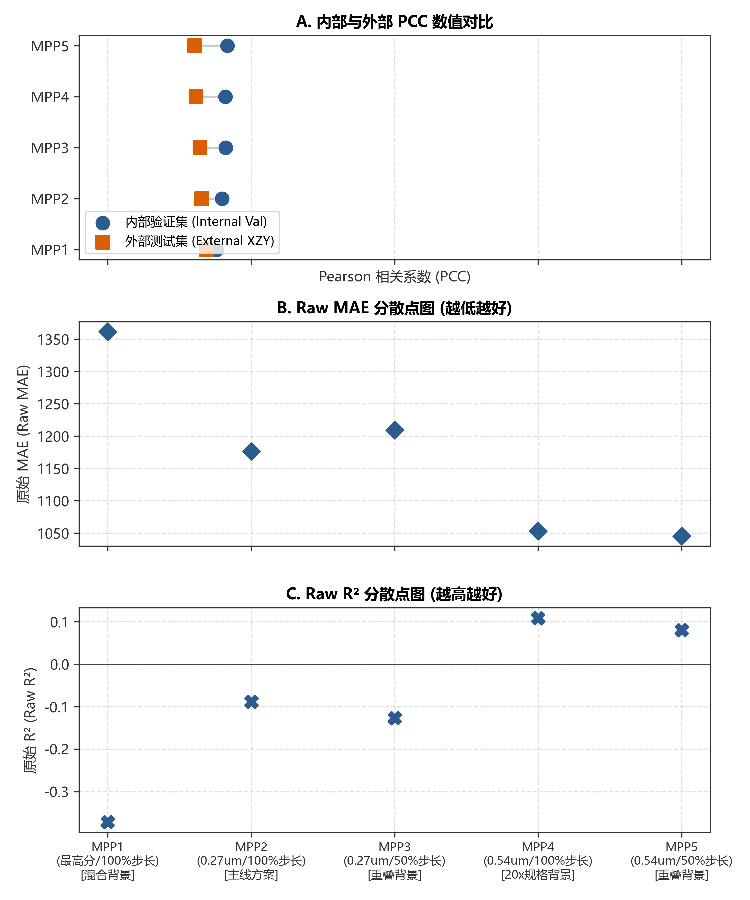
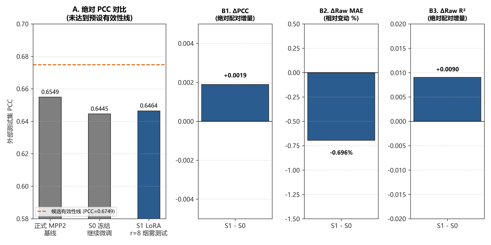
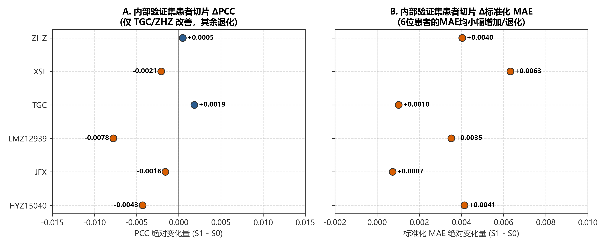
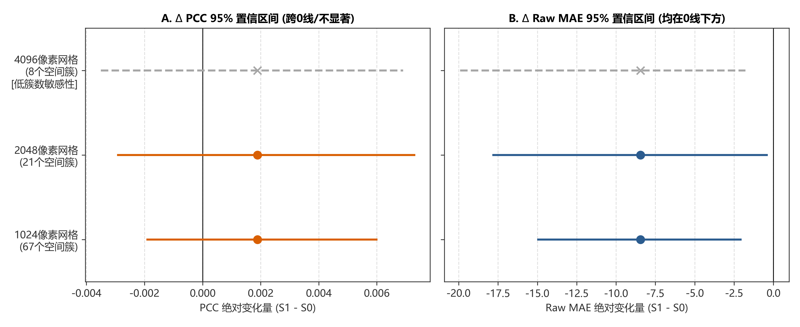
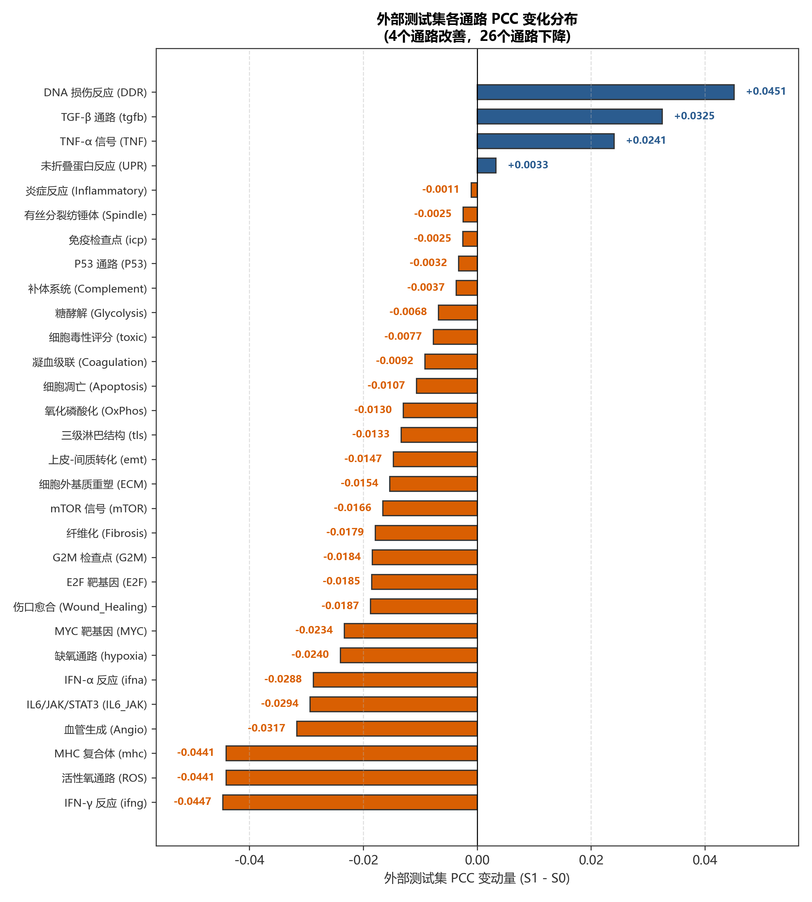

# MPP 与 LoRA 空间转录组预测研究性模型表现解读报告 (配对烟雾测试诊断版)

本报告基于 2026 年 7 月 11 日完成的修复数据（Repaired Data，数据标识：`barcode-repair-20260711-d626ad8-v003:1204018178a4d355`）及 7 月 12 日完成的 MPP2 LoRA 配对烟雾测试（S0/S1 paired smoke）结果编写。本报告旨在从算法外推性、患者及通路一致性以及统计学敏感性三个维度，对当前模型表现进行系统化诊断，为后续深入探索提供决策依据。

---

## 💡 特别说明：S0 与 S1 实验配置与实际结果直白解读

为了便于非算法专业读者审阅，本节用直白语言对本次实验的配置及定位进行阐明：

### 1. 什么是 S0 与 S1？
* **S0 (基线同期冻结对照)**：锁定（Frozen）整个深度学习病理大模型及其预测头部的所有网络权重参数，不在新数据集上做任何梯度调整，直接以初始参数对图像进行预测。它扮演的是“零微调”的同期冻结基准线角色。
* **S1 (LoRA 旁路微调模型)**：锁定病理大模型 95% 以上的参数，仅在旁路引入约 1,769,472 个低秩矩阵参数进行轻量级微调更新（总可训练参数为 3,374,110 个），并在新数据上训练 3 个周期。它扮演的是“轻量自适应微调”角色。

### 2. 为什么这只是一次“烟雾测试 (Smoke Test)”？
* 完整的 LoRA 性能评测通常需要多随机种子（Multi-seed）训练、大规模超参数网格搜索（Sweep）以及完整的训练周期（通常 15 个周期以上）。
* 本次实验中，S0 与 S1 均仅在随机种子 42 下进行了 **3 个周期的轻量训练**。其核心目的在于进行**工程烟雾测试**（即验证服务器代码能否跑通、显卡显存是否溢出、数据流是否正常），而非最终有效性评估。
* **结论**：本报告所呈数据仅属于“开发流程中的早期趋势诊断”，**不应被读作正式的 LoRA 性能有效性/无效性结论**。

### 3. 实际运行的直白结果
* **工程验证（通过）**：程序稳定运行，显存峰值约 4.24 GiB，证明 LoRA 训练在工程层面上完全可行。
* **相关性指标（未达标）**：外部测试集 PCC 相关性仅微增了 **`+0.0019`**（S0 为 0.6445，S1 为 0.6464），未能达到预设的性能门槛线（在修复基线 0.6549 的基础上提升 0.02，达到 **0.6749** 门槛）。
* **患者群体（出现退化信号）**：在内部验证的 6 名患者中，虽然有 2 名患者相关性微升，但 **6 位患者的标准化预测绝对偏差 (MAE) 均出现小幅增加（说明预测误差变大）**。内部验证轨迹表现出了一定程度的退化信号，尚不足以判定其具体物理机制。
* **通路覆盖（多数下降）**：外部测试集的 30 个通路中，仅有 4 个通路的 PCC 有所改善，其余 26 个通路的相关性均有不同程度的下降。

---

## 一、 数据修复与可比性边界

在前期的版本中，由于跨患者条形码标签的交叉污染（Contamination），导致评估指标存在偏高或失真现象。2026 年 7 月 11 日，团队完成了基于 1 对 1 患者和条形码映射的精细化修复（Evidence ID: `barcode-repair-20260711-d626ad8-v003`），纠正了跨患者条形码标签错配与污染问题，恢复了纯净的数据可比性边界。

**核心约束原则**：
1. **纯净事实源**：本报告仅使用已验收的 Repaired Data 表现作为事实依据。历史被污染数据已予以归档，不再参与任何实质结论的推导。
2. **外部评估独立性**：外部 XZY 测试集在任何阶段均不参与 Checkpoint 选择、Rank 选择或超参数调整，以保证其作为独立验证集的外推可信度。

---

## 二、 不同 MPP 采样方案的表现权衡分析 (方案 1)

不同采样分辨率和空间重叠策略（MPP1 至 MPP5）下的模型表现呈现出明显的非单调特征与内部/外部不一致性：

| 方案 | 内部验证集 PCC (↑) | 外部 XZY 测试集 PCC (↑) | 原始 MAE (↓) | 原始 R² (↑) |
|---|---:|---:|---:|---:|
| **MPP1** | 0.7597 | 0.6900 | 1360.96 | -0.3719 |
| **MPP2** | 0.7971 | 0.6549 | 1176.21 | -0.0880 |
| **MPP3** | 0.8225 | 0.6436 | 1209.39 | -0.1265 |
| **MPP4** | 0.8209 | 0.6151 | 1053.17 | 0.1090 |
| **MPP5** | 0.8347 | 0.6072 | 1045.66 | 0.0811 |

### 方案 1 研究性模型表现解读图注：



> **图 1：不同 MPP 采样方案的表现对比 (独立 PDF 矢量版参见 `report_figures/lora_vis_20260713/chart1_mpp_comparison.pdf`)**
> * **散点对比图 (A)** 展示了内部验证集 PCC（蓝色圆点）与外部 XZY 测试集 PCC（橙色方块）之间的数值差异。内部验证集 PCC 随不同 MPP 分割方案的变化整体呈升高走势，从 MPP1 的 0.7597 提升至 MPP5 的 0.8347，但呈现非单调波动（MPP3 略高于 MPP4）。外部测试 PCC 则从 MPP1 的 0.6900 降至 MPP5 的 0.6072。
> * **分散点图 (B & C)** 展示了原始 MAE 与 R² 指标的变化。随着 MPP 采样覆盖的变化，MAE 呈现波动下降（误差减小），从 MPP1 的 1360.96 降至 MPP5 的 1045.66，但 MPP3 出现局部退化（MAE 比 MPP2 更差）；原始 $R^2$ 在 MPP4 和 MPP5 上实现转正，而在 MPP1–3 上均为负值。
> * **研究性模型表现解读**：结果显示内部验证与外部测试表现排序不一致。进行模型综合评价时需谨慎评估不同方案间的权衡。MPP1 的相关性（PCC）最高，但绝对表达量量纲偏差（MAE/R²）较差；MPP4/5 预测绝对量级较准，但损失了部分通路变异的相关性。

---

## 三、 MPP2 LoRA 配对增量性能与有效性评估 (方案 2)

针对下游跟进方案 MPP2，我们实施了 paired S0（继续冻结微调）和 S1（LoRA r=8 微调）的对比测试：

- **基线 MPP2 (Repaired Base)**：PCC = **0.6549**
- **S0 (冻结继续继续微调，3 epoch)**：PCC = **0.6445**，Raw MAE = **1215.284**，Raw R² = **-0.1449**
- **S1 (LoRA r=8，3 epoch)**：PCC = **0.6464**，Raw MAE = **1206.826**，Raw R² = **-0.1358**

### 方案 2 研究性模型表现解读图注：



> **图 2：LoRA (S1) 与同期冻结对照 (S0) 指标对比 (独立 PDF 矢量版参见 `report_figures/lora_vis_20260713/chart2_lora_comparison.pdf`)**
> * **绝对指标对比 (A)** 表明，S1 LoRA（0.6464）与同期冻结微调的 S0（0.6445）相比几乎相同，且两者相较于修复基线（0.6549）均有小幅退化，没有达到预先设定的候选性能门槛线（绝对 PCC 0.6749 = 基线 0.6549 + 0.02 增量）。
> * **配对变动率 (B1 - B3)** 表明，S1 相对 S0：PCC 仅微增 `+0.0019`；Raw MAE 平均改善 `-0.696%`（降低约 8.46）；$R^2$ 改善 `+0.0090`。
> * **研究性模型表现解读**：虽然 LoRA 微调在工程层面上能够稳定运行（峰值显存约 4.24 GiB），但同期配对增量十分微小，未达到预注册的性能有效性基准，且外部绝对 PCC 并未突破修复基线。

---

## 四、 增量收益的研究性统计学诊断

为探究上述微小增益的真实外推性，我们对预测数据进行了多维敏感性分析与诊断：

### 1. 跨患者一致性诊断 (方案 3)
在包含 6 位患者（HYZ15040, JFX, LMZ12939, TGC, XSL, ZHZ）的内部验证集切片上：
* S1 相较于 S0 的 PCC 表现：仅 TGC (+0.0019) 和 ZHZ (+0.0005) 出现极微幅上升，其余 4 位患者的 PCC 均出现退化。
* MAE 表现：6 位患者的标准化 MAE（Z-score 尺度）均呈现小幅增加，提示预测精度改善缺乏跨患者一致性。

### 方案 3 研究性模型表现解读图注：



> **图 3：内部验证集患者切片指标变化图 (独立 PDF 矢量版参见 `report_figures/lora_vis_20260713/chart3_patient_slope.pdf`)**
> * **患者变动散点图 (A & B)** 直观展示了 6 位患者在 PCC 和标准化 MAE 上的差值（S1 - S0）。橙色的负向变动（退化）占据主导，所有 6 名患者在标准化 MAE 上的变化均大于 0，说明误差发生增长。
> * **研究性模型表现解读**：这表明 LoRA 在少数患者上的微弱 PCC 提升是以全患者群体绝对表达量预测偏差增加为代价的，表现缺乏跨患者的一致性，内部验证轨迹出现退化信号，尚不足以判定其因果物理机制。

### 2. 空间相关性统计学敏感性分析 (方案 4)
为评估自相关效应的影响，我们使用固定网格空间 cluster bootstrap 对外部 XZY 测试集进行敏感性分析（对应的空间自相关簇数在三档网格下分别为 67/21/8 个）：
* **Delta PCC (95% CI)**：三档网格下均包含 0（1024 网格：`[-0.00190, +0.00599]`；2048 网格：`[-0.00291, +0.00729]`；4096 网格：`[-0.00350, +0.00691]`）。探索性置信区间跨 0 表明相关性指标的微小改善不具备统计学显著性。
* **Delta Raw MAE (95% CI)**：三档网格置信区间均完全在 0 以下（1024 网格：`[-14.94, -2.09]`），表明在空间自相关修正后，平均 Raw MAE 的小幅改善在平均数层面具有一定稳定性，但由于通路变动方向不一致，泛化仍然存在局限。

### 方案 4 研究性模型表现解读图注：



> **图 4：外部测试集空间自适应 Bootstrap 置信区间 (独立 PDF 矢量版参见 `report_figures/lora_vis_20260713/chart4_bootstrap_ci.pdf`)**
> * **置信区间森林图 (A & B)** 显示，PCC 变化的置信区间均跨越 0 线（无明确稳定改善证据），而 Raw MAE 变化的置信区间整体低于 0（存在显著的小幅改善）。
> * **研究性模型表现解读**：图表用统计学语言表明，S1 相对 S0 仅在平均误差上存在小幅稳定性增益，而在相关性（PCC）上未表现出明确、稳定的显著提升。4096 像素网格因仅含 8 个空间簇，属于低簇数敏感性分析，结论应极保守。

---

## 五、 当前决策与后续方向

1. **冻结训练决策**：由于 S1 (LoRA r=8) 未能通过预注册的有效性门禁，且在患者和通路维度上均表现出泛化不稳定性。根据 Codex 规定，**判定当前 LoRA 配置为 `candidate_effectiveness_fail`，维持 `no_go_formal` 指令，停止任何后续的大规模训练、超参数搜索或 multi-seed 扩展**。
2. **本阶段工作闭环**：工作区已合并归档至 main 主线的 `27e5381` 提交。
3. **后续研究方向**：若后续需继续探索 LoRA 微调，必须在**获得显式新授权的前提下**，通过内部验证集（Internal Val）独立评估，限制为基于单因素的探索性烟雾测试（exploratory smoke），禁止利用外部测试集 XZY 指导超参选择以防信息泄露。

---

## 六、 附录：通路异质性分析 (方案 5)

外部测试集包含的 30 个通路中：
* PCC 变动：外部 30 个通路中，PCC 上升幅度较大的通路仅 4 个（包含 DNA 损伤反应、TGF-β 通路、TNF-α 信号通路和未折叠蛋白反应），其余 26 个通路均出现不同程度的 PCC 下降。
  - PCC上升的通路：DNA 损伤反应 (DNA_Damage_Response: `+0.0451`)、TGF-$\beta$ 信号通路 (tgfb: `+0.0325`)、TNF-α 信号通路 (TNF_Signaling: `+0.0241`) 以及未折叠蛋白反应 (Unfolded_Protein_Response: `+0.0033`)；
  - PCC下降较大的通路：IFN-$\gamma$ 反应 (ifng: `-0.0447`)、活性氧通路 (Reactive_Oxygen_Species: `-0.0441`)、MHC 复合体 (mhc: `-0.0441`) 以及 IL6/JAK/STAT3 信号通路。
* 性能变化集中在少数通路，但尚不能据此推断具体的生物学机制或临床关联。

### 方案 5 研究性模型表现解读图注：



> **图 5：外部测试集各通路 PCC 变化分布 (独立 PDF 矢量版参见 `report_figures/lora_vis_20260713/chart5_pathway_comparison.pdf`)**
> * **水平双向柱状图 (A)** 按变化大小对 30 个通路进行了排序，右侧蓝色代表 PCC 上升，左侧橙色代表 PCC 下降，揭意了通路间的异质性。
> * **研究性模型表现解读**：在绝大部分生理通路上，LoRA 的引入并未带来外推相关性（PCC）的稳定提升，反而引入了额外的波动。

---

## 七、 门禁核验与数据可重复性审计说明

1. **项目工程门禁状态**：
   项目当前运行了安全环境核验：
   ```powershell
   python deploy/pfmval_ops.py agent start-check --strict
   ```
   **核验结果**：`PASS=6 / WARN=6 / FAIL=0`。
   **范围说明**：该核验仅表明项目目录结构、指令集版本、元数据事实源合规无冲突，并已完成对齐，**不能用作 LoRA 模型泛化有效性的支持性论据**。同时，它也**并未自动消除或消除**历史遗留的非阻塞 WARN 提示（如 MPP 标准化标签存在重复/冲突条形码等背景报警）。
   
2. **数据可复现链审计哈希**：
   为确保绘图数据的可复现性和防篡改，生成本报告所用图表的 4 个预测文件已通过 SHA-256 完整性校验。其权威特征哈希登记如下：
   * `s0_predictions_external_xzy.csv` (外部对照预测): `b5972c69d14fe4dde57c33eb32c4423523d8f7bac9d95c21e7424cddcbe3deee`
   * `s0_predictions_internal_val.csv` (内部对照预测): `fab7798511b9bb80ce172f0f961d9e3517ec14b3e8f31183c40453e0f26a1b57`
   * `s1_predictions_external_xzy.csv` (外部LoRA预测): `78a69e69a7b412d3f94c649c8425b157c3cc04e5cd3ffa071af5307fb9d7886b`
   * `s1_predictions_internal_val.csv` (内部LoRA预测): `1ae94c7fa5ab8489012d1a077f4a64233a44f0ed3523062904a18c746c46ae8a`

---
**数据说明汇总表可参见项目下的 [plot_data_summary.csv](report_figures/lora_vis_20260713/plot_data_summary.csv) 文件，用于进一步科学计算与复核。**
