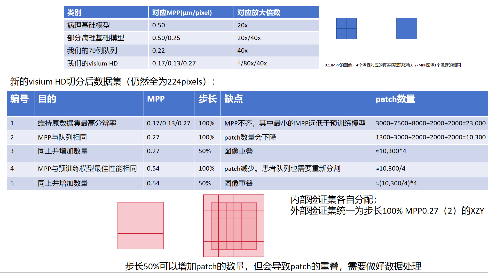

# MPP 显微倍率与医学解释依据记录

日期：2026-07-08

用途：记录组会 PPT 与医生口述给出的 MPP/放大倍数医学背景，并对照当前项目中 MPP1-5 统一标准重跑的真实划分信息。本文只记录医学规格与数据口径依据，不替代实验指标报告。

> **2026-07-09 更新**：团队讨论后已决定，后续 MPP 方案只使用 **MPP2**。本文中关于 MPP1 / MPP4 的优势解释仅保留为背景边界，不再表示它们是后续并列候选。

证据截图：`01_指南与解读/分析报告/report_figures/mpp_medical_spec_ppt_20260708.png`

## 一、PPT 原始信息转写

### 1.1 病理基础模型与队列规格

| 类别 | 对应 MPP (um/pixel) | 对应放大倍数 |
|------|:---:|:---:|
| 病理基础模型 | 0.50 | 20x |
| 部分病理基础模型 | 0.50 / 0.25 | 20x / 40x |
| 我们的 79 例队列 | 0.22 | 40x |
| 我们的 Visium HD | 0.17 / 0.13 / 0.27 | ? / 80x / 40x |

PPT 注释：0.13 MPP 图像中 4 个像素对应的真实病理形态，与 0.27 MPP 图像中 1 个像素相同。

### 1.2 新 Visium HD 切分后数据集设计

PPT 说明：新的 Visium HD 切分后数据集仍全为 224 pixels。

| 编号 | 目的 | MPP | 步长 | 缺点 | PPT 估算 patch 数量 |
|:---:|------|:---:|:---:|------|------|
| 1 | 维持原数据集最高分辨率 | 0.17 / 0.13 / 0.27 | 100% | MPP 不齐，其中最小 MPP 远低于预训练模型 | 3000+7500+8000+2000+2000=23,000 |
| 2 | MPP 与队列相同 | 0.27 | 100% | patch 数量会下降 | 1300+3000+2000+2000+2000=10,300 |
| 3 | 同上并增加数量 | 0.27 | 50% | 图像重叠 | 约 10,300*4 |
| 4 | MPP 与预训练模型最佳性能相同 | 0.54 | 100% | patch 减少，患者队列也需要重新分割 | 约 10,300/4 |
| 5 | 同上并增加数量 | 0.54 | 50% | 图像重叠 | 约 (10,300/4)*4 |

PPT 额外说明：

- 内部验证集各自分配。
- 外部验证集统一为步长 100%、MPP 0.27 的 XZY。
- 步长 50% 可以增加 patch 数量，但会导致 patch 重叠，需要做好数据处理。

## 二、与当前项目记录的对应关系

当前项目的统一标准重跑已经在以下文件中落地：

- `01_指南与解读/分析报告/执行计划_MPP1-5统一标准重跑_20260706.md`
- `01_指南与解读/分析报告/MPP1-5统一标准划分结果快照_20260708.md`
- `mpp_standard_splits/group_{1..5}/split_manifest.csv`
- `mpp_standard_splits/group_{1..5}/split_info.json`
- `experiments/experiment_registry.json`

### 2.1 MPP 编号语义对照

| 编号 | PPT 医学/数据设计含义 | 当前项目对应状态 |
|:---:|------|------|
| MPP1 | 保留原始 Visium HD 最高分辨率，MPP 混合 | 已对应为 `group_1`，100% stride，`none_100pct_stride`，无 embargo |
| MPP2 | 0.27 MPP，100% stride，与外部临床/队列采样口径更一致 | 已对应为 `group_2`，100% stride，固定外部测试也使用 MPP-2/XZY |
| MPP3 | 0.27 MPP，50% stride，用重叠换取更多 patch | 已对应为 `group_3`，`bbox_embargo`，leakage_pairs=0 |
| MPP4 | 0.54 MPP，100% stride，更接近 20x/约 0.50 MPP 病理基础模型规格 | 已对应为 `group_4`，100% stride，`none_100pct_stride`，无 embargo |
| MPP5 | 0.54 MPP，50% stride，用重叠补回 patch 数 | 已对应为 `group_5`，`bbox_embargo`，leakage_pairs=0 |

### 2.2 当前实际划分计数

PPT 中的 patch 数量是组会阶段的旧版 5 患者估算值；当前统一标准重跑使用 6 名非 XZY 患者（HYZ15040, JFX, LMZ12939, TGC, XSL, ZHZ）并以 manifest 为准。

| 编号 | 当前 total | train | internal_val | embargo | 当前划分策略 |
|:---:|---:|---:|---:|---:|------|
| MPP1 | 21,850 | 19,640 | 2,210 | 0 | 100% stride，无 embargo |
| MPP2 | 10,550 | 9,472 | 1,078 | 0 | 100% stride，无 embargo |
| MPP3 | 42,125 | 35,227 | 4,395 | 2,503 | 50% stride，bbox embargo |
| MPP4 | 2,845 | 2,553 | 292 | 0 | 100% stride，无 embargo |
| MPP5 | 11,370 | 9,166 | 1,206 | 998 | 50% stride，bbox embargo |

### 2.3 外部测试口径

当前重跑计划与 PPT 一致：外部测试固定为 `MPP-2 / XZY`，并且只在 best checkpoint 固定后评估一次；XZY 不参与训练、不参与 z-score fit、不参与 epoch selection。

这一点让 MPP2 具备“队列/外部测试采样口径一致性”的医学解释优势，但不等价于所有实验指标上必然最优。

## 三、医学解释边界

### 3.1 MPP2 的解释优势

医生口述来源：MPP2 的 MPP 数值更贴合临床外部队列/40x 采样口径；因此，MPP2 在医学解释上可以作为“队列一致性优先”的核心候选。

在报告中建议写法：

> MPP2 (0.27 MPP, 100% stride) 接近 40x 采样口径，并与本轮固定外部测试集 MPP-2/XZY 处于同一 MPP 体系，因此具备队列一致性和临床解释优势。

不建议写法：

> MPP2 与 UNI2-h 官方预训练规格完全一致。

原因：官方 UNI2-h 预提取特征数据卡明确标注 20x magnification；项目中通常将 20x 对应约 0.50 MPP。因此，按病理基础模型预训练规格看，MPP4 (0.54 MPP) 更接近 20x/0.50 MPP。

### 3.2 MPP4 的解释优势

MPP4 的核心意义不是队列一致性，而是病理基础模型规格一致性。它对应 0.54 MPP，最接近 UNI2-h 20x/约 0.50 MPP 的使用口径；在当前修正报告中，MPP4 也对应最低 Test Loss 和唯一正 R2_raw。

在报告中建议写法：

> MPP4 (0.54 MPP, 100% stride) 更接近 UNI2-h 20x/约 0.50 MPP 的病理基础模型输入口径，可作为“基础模型预训练一致性 + 绝对值稳定性”候选。

## 四、外部来源核验状态

已快速核验的公开来源：

- Hugging Face [`MahmoodLab/UNI2-h`](https://huggingface.co/MahmoodLab/UNI2-h) 模型卡：UNI2-h 是 ViT-H/14 pathology pretrained vision backbone，预训练数据为 200M+ tiles / 350k+ WSIs，并给出 224 输入配置。
- Hugging Face [`MahmoodLab/UNI2-h-features`](https://huggingface.co/datasets/MahmoodLab/UNI2-h-features) 数据卡：UNI2-h 预提取特征用于 TCGA/CPTAC/PANDA，明确写明 patch size 256 x 256 pixels at 20x magnification。
- [`MahmoodLab/UNI`](https://github.com/mahmoodlab/UNI) GitHub：UNI2-h 于 2025-01 发布，ViT-h/14-reg8，提供 TCGA/CPTAC/PANDA 预提取 WSI embeddings 与 benchmark。

证据边界：

- “20x”有官方特征数据卡直接支持。
- “0.50 MPP”是本项目/PPT 中对 20x 的显微倍率换算口径，应作为项目内换算约定使用，而不是写成 Hugging Face 模型卡逐字声明。

## 五、对报告引用的建议（2026-07-09 更新）

后续引用 MPP1-5 结果时，应采用“MPP2 主线 + 其它方案背景化”的框架：

| 候选 | 推荐定位 | 依据 |
|------|------|------|
| **MPP2** | **后续唯一主线方案** | 0.27 MPP 接近 40x，且与固定外部测试 MPP-2/XZY 同口径；团队已决定后续使用 MPP2 |
| MPP1 | 暂弃，仅作排序性能上限背景 | 外部 global PCC 最高，但 Test Loss/R2 风险大 |
| MPP4 | 暂弃，仅作基础模型规格/数值稳定性背景 | 0.54 MPP 接近 20x/约 0.50 MPP；当前 Test Loss 最低且 R2_raw 为正 |

结论边界：医生口述的 MPP2 可解释性和团队决策共同构成后续主线选择。MPP1 的 PCC 上限与 MPP4 的数值稳定性可以作为结果解释背景，但不再用于启动后续 MPP 分支。
