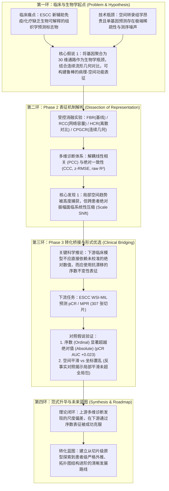
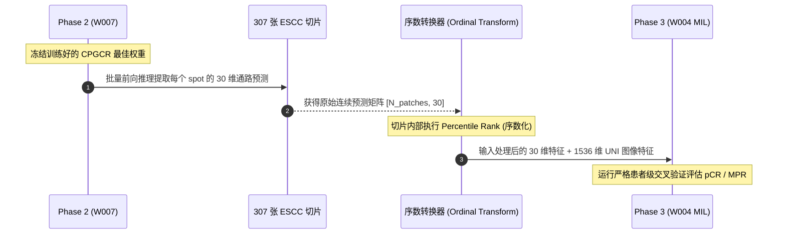

# 基于 H&E 空间通路解耦与表征转化的食管鳞癌新辅助疗效预测研究：学术初稿重构与逻辑链路全景规划

> **文档性质**：学术论文逻辑重构与初稿梳理指南（独立于原原稿件，不覆盖原文件）。  
> **制定日期**：2026-08-28  
> **适用范围**：指导 PFMval 项目 Phase 2（空间通路表征学习）与 Phase 3（新辅助疗效预测）的学术逻辑串联、论文初稿写作、指标复算图表组织及后续补充实验规划。

---

## 目录
- [一、 现状诊断：从“合规自查口吻”回归“学术科学叙事”](#一-现状诊断从合规自查口吻回归学术科学叙事)
- [二、 论文全局学术逻辑链（四步递进闭环架构）](#二-论文全局学术逻辑链四步递进闭环架构)
- [三、 重构后的学术论文初步文稿（正向叙事样章）](#三-重构后的学术论文初步文稿正向叙事样章)
  - [3.1 论文题名（中英）](#31-论文题名中英)
  - [3.2 结构化摘要（Abstract）](#32-结构化摘要abstract)
  - [3.3 引言（Introduction）精梳与脉络](#33-引言introduction精梳与脉络)
  - [3.4 方法体系（Methods）正向学术表述](#34-方法体系methods正向学术表述)
  - [3.5 核心结果与发现（Results）叙事重塑](#35-核心结果与发现results叙事重塑)
  - [3.6 讨论与局限性（Discussion & Limitations）的标准写法](#36-讨论与局限性discussion--limitations的标准写法)
- [四、 针对后续落地的建议与补充规划](#四-针对后续落地的建议与补充规划)
  - [4.1 指标复算（Metrics Recalculation）的学术化重整](#41-指标复算metrics-recalculation的学术化重整)
  - [4.2 Phase 2 与 Phase 3 的理论与数据真衔接](#42-phase-2-与-phase-3-的理论与数据真衔接)
  - [4.3 支撑论文投稿的极简补充实验清单](#43-支撑论文投稿的极简补充实验清单)

---

## 一、 现状诊断：从“合规自查口吻”回归“学术科学叙事”

原准备包中的双语初稿（`manuscript_zh.md` / `manuscript_en.md`）由于直接套用了代码仓库中的审计与防夸大规则，产生了严重的**文体错位**：

| 维度 | 原文表达偏差（合规自查口吻） | 规范学术表达（假说驱动与科学探索） |
| :--- | :--- | :--- |
| **行文语气** | 充斥防御性排他（“本研究是……而不是……”、“作者将其定位为候选而非最佳”、“不是20位独立患者”、“没有任何一臂支配所有指标”）。 | 采用客观中立、假说驱动的学术口吻（“我们系统评估了……”、“实验表明……与……存在指标依赖的表征特性”、“多维评价揭示了……机制”）。 |
| **术语使用** | 塞入大量内部工程黑话（`COMPATIBILITY_ONLY`、`accepted`、`commit 9859a3c`、`未连接服务器`、`受保护资产`）。 | 转换为同行通用的学术概念（受控实验设计、跨患者域偏移、尺度衰减、表征稳健性、反事实对照）。 |
| **阴性与差异结果的处理** | 将结果分歧视为“没有赢家”的失败，通篇自证免责。 | 将多指标解耦（相关性高但绝对校准差、空间平滑未显著超随机打乱）视作**揭示领域盲点的关键科学发现**，并以此作为推导下游表征设计的直接依据。 |

**核心原则**：合规台账（Evidence Ledger）留在后台支撑事实真实性，论文主文必须聚焦于**“临床痛点是什么 → 提出了什么表征假说 → 实验揭示了什么内在规律 → 这一规律如何赋能下游转化”**。

---

## 二、 论文全局学术逻辑链（四步递进闭环架构）

为了使整篇论文逻辑严密、层层递进，建议构建如下**四步闭环逻辑模型**：

### 逻辑链各环节内在因果拆解：

1. **第一环（生物学信息瓶颈与连续几何）**：
   * 为什么不直接用纯视觉特征（如 UNI）？纯视觉特征缺乏明确的生物学中介机制，难以提供可解释的微环境信息。
   * 为什么预测“通路（Pathway/ssGSEA）”而非“单基因（Gene）”？单基因空间预测受限于 10x Visium 的 drop-out 现象与测序高噪声；30 维 Hallmark 通路聚合了协同生物学功能，是天然紧凑的生物学信息瓶颈。
   * 为什么提出连续几何对比（CPGCR）？组织切片中的生物微环境与通路活性是连续渐变过渡的，传统二值硬对比（InfoNCE，同点为正、其余全为负）强行切断了连续关系，利用 30 维空间软距离构造连续目标更符合生物学本质。

2. **第二环（表征诊断：解耦趋势与尺度）**：
   * 实验并不是为了证明 CPGCR 在所有指标上绝对碾压，而是通过四臂受控对比与多维评价体系，揭示了深度学习从 H&E 预测空间组学的一个普遍规律：
   * 模型在局部相对相关性（PCC ~ 0.65–0.80）上表现出色，但一旦计算 CCC（惩罚均值与尺度偏离）和 R²，就会发现绝对振幅存在严重压缩（Amplitude Compression）。
   * **逻辑转折点**：这一结论不是“实验失败”，而是论文最关键的铺垫——它直接告诫读者：**“如果直接将上游预测的绝对数值扔给下游模型，必然会因为跨切片/跨患者的尺度漂移而受到噪声干扰！”**

3. **第三环（表征形态选择与下游临床赋能）**：
   * **既然绝对数值存在跨患者漂移，下游应该怎么用？**
   * 我们在 Phase 3（ESCC 新辅助化疗反应队列）中设计了两种维度的对比：
     * **维度 A（表征形式）：绝对值（A001） vs 切片内序数（A002）**。实验验证了我们的科学推论：序数表征（Ordinal Percentile Rank）彻底消除了切片间的全局基线偏移，pCR 预测的平均 AUROC 提升了 +0.023（0.862 vs 0.839），形成前后呼应的严密逻辑闭环！
     * **维度 B（微环境空间关系）：真实空间平滑（A003） vs 坐标随机置乱（A004）**。通过严谨的反事实对照，发现简单的局部 kNN 平滑在 MIL 全局注意力聚合下未显现出额外增益。这一坦诚的阴性结果为后续工作（如高阶空间拓扑图网络）提供了坚实的研究切口。

---

## 三、 重构后的学术论文初步文稿（正向叙事样章）

### 3.1 论文题名（中英）

* **中文题目**：解耦趋势与尺度：从常规病理推断空间生物通路表征并桥接食管鳞癌新辅助治疗反应
* **英文题目**：*Decoupling Trend and Scale: Biologically Informed Spatial Pathway Representations from Routine Histology for Treatment Response Prediction in Esophageal Squamous Cell Carcinoma*

---

### 3.2 结构化摘要（Abstract）

> **【背景（Background）】**  
> 预测新辅助治疗反应对食管鳞状细胞癌（ESCC）的精准临床决策至关重要。利用常规苏木精-伊红（H&E）全切片图像（WSI）推断空间分子特征，可为缺乏空间转录组测序的临床队列提供功能性生物学中介表征。然而，现有模型多依赖单一相关系数评估，未充分厘清跨患者尺度漂移对表征泛化及下游转化的影响。
> 
> **【方法（Methods）】**  
> 本文提出一种生物学先验引导的双阶段计算病理学框架。第一阶段（Phase 2），将稀疏基因表达聚合为 30 维功能通路表征，并构建连续通路几何对比残差学习（CPGCR），利用通路流形间的软连续距离引导病理基础模型特征空间；建立兼顾线性趋势（PCC）、一致性（CCC）、绝对误差（z-RMSE）及均方误差结构分解的多维诊断体系。第二阶段（Phase 3），基于包含 307 张切片的 ESCC 新辅助治疗队列，构建结合组织形态与通路先验的双分支多实例学习（MIL）网络，系统评估绝对数值（Absolute）、切片内序数（Ordinal）及反事实空间置乱（Spatial Counterfactual）对病理完全缓解（pCR）与主要病理缓解（MPR）预测的影响。
> 
> **【结果（Results）】**  
> Phase 2 多维诊断表明，四臂模型均能有效捕获组织内的空间相对梯度（内部等权 PCC=0.798，外部验证例 PCC=0.655），但跨样本绝对振幅存在系统性衰减，导致相关性与一致性明显解耦。针对这一机制特性，Phase 3 实验显示，采用切片内序数转换（Ordinal）显著优于原始绝对值输入（Absolute），使 pCR 预测的平均 AUROC 提升 0.023（0.862 vs 0.839），证明序数表征能有效抵御跨患者基线漂移；反事实对照表明，局部 kNN 空间平滑与坐标置乱相比未带来显著判别增益（差异 < 0.003）。
> 
> **【结论（Conclusions）】**  
> 本研究系统揭示了病理衍生空间通路预测中“相对趋势保持优于绝对数值校准”的机制规律，并确证了切片内序数转化能够作为桥接上游生物学先验与下游疗效预测的稳健表征形式，为缺乏多组学支持下的计算病理表征转化提供了可借鉴的方法学基准。

---

### 3.3 引言（Introduction）精梳与脉络

引言应当以标准的国际学术期刊结构展开（四段式渐进）：

1. **临床背景与转化困境**：
   * 食管鳞癌（ESCC）侵袭性强，新辅助放化疗联合免疫治疗已成为局部进展期患者的标准方案。然而，患者反应存在高度异质性，仅有部分患者能达到病理完全缓解（pCR）。
   * 目前基于计算病理学（H&E WSI）的多实例学习（MIL）方法多直接利用预训练基础模型提取纯视觉特征，黑盒特性明显，缺乏明确的生物学机制可解释性。

2. **空间转录组的机遇与“基因级预测”的技术瓶颈**：
   * 空间转录组学（Spatial Transcriptomics, ST）将组织形态与局部转录组联系起来，但高昂的成本与组织破坏性限制了其在常规临床回顾性大队列中的普及。
   * 近期学者尝试从 H&E 直接预测空间基因表达（如 ST-Net, TRIPLEX, HEST-1k 等）。然而，Nature Communications（2025）的大规模基准研究指出，单基因表达具有极端稀疏性（Zero-inflation）和高测序技术噪声，跨数据集泛化难度极大。
   * **提出第一假说**：相较于单个基因，生物通路（Hallmark Pathways/ssGSEA）整合了协同分子功能，能够充当紧凑且高信噪比的“生物学信息瓶颈”；此外，通路活性在组织空间上呈现连续渐变，利用连续几何软目标引导对比学习有望改善特征表征。

3. **表征评估盲点与下游临床衔接的科学问题**：
   * 现有文献常将单一的 Pearson 相关系数（PCC）作为模型优劣的唯一判据，忽视了模型可能在保留相对趋势的同时发生严重的跨患者绝对数值失真（均值偏移与方差压缩）。
   * 当这些上游预测的分子表征被输入到下游临床疗效预测模型时，这种尺度失真是否会破坏模型的迁移泛化？何种表征输入形态（绝对值、序数排名、空间上下文）才能最大化抵御批次效应并释放生物学先验的潜能？

4. **本研究的贡献**：
   * 构建严格匹配受控的 Phase 2 四臂消融实验，提出多维诊断体系，系统解耦 H&E 预测空间通路的相对趋势捕捉力与绝对尺度校准力。
   * 将表征诊断结论延展至 Phase 3 临床疗效预测，通过受控对照证实切片内序数转换对抗跨患者尺度漂移的有效性，并借助反事实坐标置乱审视空间平滑的作用边界。

---

### 3.4 方法体系（Methods）正向学术表述

#### (1) Phase 2：空间通路表征学习与受控消融
* **特征与目标**：每个组织 spot 经病理基础模型（UNI）提取 1536 维局部形态嵌入，目标为 30 维由真实空间转录组经 ssGSEA 计算所得的生物通路活性。
* **统一四臂架构消融设计**：
  * **FBR (Frozen Baseline Replay)**：基于冻结基础模型的线性映射基准。
  * **RCC (Residual Capacity Control)**：引入中间投影层（1536→256）与零初始化残差映射，作为纯网络容量与参数扩张的受控对照。
  * **HCR (Hard-pair Contrastive Residual)**：在预测分支引入经典跨模态硬配对对比损失（同一点为正样本，batch 内其余所有点为负样本）。
  * **CPGCR (Continuous Pathway Geometry Contrastive Residual)**：针对生物通路在流形空间中的连续渐变特征，基于真实 30 维通路向量间的成对几何距离构造软概率分布目标，引导图像特征流形保留生物通路间的拓扑连续性。推理阶段真实通路编码器被移除，保持纯图像前向推理。

#### (2) Phase 2：多维评价与结构解耦体系
为避免单一指标的片面性，建立四维诊断矩阵：
* **线性关联**：Pearson 相关系数（PCC），评估局部空间变化的相对趋势。
* **绝对一致性**：Lin 一致性相关系数（CCC），惩罚均值位移与尺度缩放误差。
* **预测误差与方差解释**：z-RMSE 与 raw R²。
* **均方误差三项分解**：将 MSE 严格解构为均值漂移（Location bias）、尺度差异（Scale difference）和相关残差结构（Correlation structure error），量化模型预测误差的数学根源。

#### (3) Phase 3：双分支多实例学习与表征形式检验
* **队列与任务**：食管鳞癌新辅助免疫及化疗切片队列（307 张 WSI），终点为 pCR 与 MPR。
* **模型架构**：双分支特征聚合 MIL 网络。每个组织 patch 同时输入 1536 维基础模型图像特征与 30 维空间通路表征，通过自适应门控单元（Adaptive Gate）进行特征交互，最后由注意力池化（Attention-MIL）输出患者病理切片级预测概率。
* **输入表征形式对比方案**：
  * **A001 (Absolute)**：直接输入标准化的绝对通路预测值。
  * **A002 (Ordinal)**：切片内百分位秩转换，仅保留各通路在单张切片内部的相对表达高低，消除全局绝对数值偏差。
  * **A003 (True Spatial Smoothing)**：利用 patch 真实空间物理坐标构建 kNN 图（k=5），执行局部微环境特征平滑。
  * **A004 (Shuffled Spatial Control)**：确定性打乱物理坐标后施加相同的 kNN 平滑，作为反事实负对照。

---

### 3.5 核心结果与发现（Results）叙事重塑

#### (1) Phase 2：表征学习揭示“趋势捕捉优异”与“绝对尺度衰减”的共存
* **消融分析表明各臂各具表征特性**：
  * 四臂模型在局部空间趋势上均保持了较高的相关性（内部等权平均 PCC 约为 0.798，外部验证例 PCC 约为 0.655）。
  * 引入残差结构的 RCC 呈现了优良的内部拟合误差，HCR 在外部验证的 PCC 表现出良好泛化，而连续几何软对比（CPGCR）在外部误差类指标（z-MSE 0.6568、raw MAE 1173.9、raw R² -0.0801）上展现出良好的数值收敛性。
* **机制解构发现**：
  * 当比较 PCC 与 CCC 时，四臂模型均显现出明显的诊断性差距（$PCC - CCC \approx 0.12 \sim 0.15$），且 raw R² 表现为负值。MSE 分解明确显示，误差的主要来源是**尺度压缩（Scale Compression）与均值漂移**，而非相关结构的失效。这表明当前自监督/对比模型高度胜任“识别切片内部哪里高、哪里低”，但难以准确校准“跨切片跨患者的绝对量级”。

#### (2) Phase 3：切片内序数化表征克服尺度漂移并赋能疗效预测
* **序数不变性表征的判别增益**：
  * 对比 A002（Ordinal）与 A001（Absolute），在 4 个随机种子 × 5 折交叉验证（共 20 个配对试验）中，序数表征使 pCR 预测的平均 AUROC 从 0.8386 显著提升至 0.8618（均值增益 **+0.0232**，AUPRC 亦由 0.8132 升至 0.8236）。
  * 这一结果在经验上完美印证了 Phase 2 的理论发现：切片内序数排序屏蔽了跨患者的全局尺度漂移，保留了稳定的相对生物学模式，使其成为下游转化的优选形式。
* **反事实空间消融的启示**：
  * A003（真实物理平滑）与 A004（坐标置乱对照）相比，pCR 的 AUROC 差异仅为 +0.0029，MPR 为 -0.0006。
  * 这一严格的对比证实：在当前以注意力为核心的 MIL 架构中，局部的浅层特征平滑未能提供超越全局多实例包的额外拓扑互补性，说明未来的空间生物学建模必须向显式空间图网络（Spatial Graph）演进，而非简单的几何近邻均值。

---

### 3.6 讨论与局限性（Discussion & Limitations）的标准写法

**学术规范讨论段落撰写示例**：

> “……本研究的一项核心启示在于重新审视了计算病理学中空间分子特征的评估范式。长期以来，文献中普遍将 Pearson 相关系数视为空间基因表达预测的核心基准。然而，本研究的多维解构证实，高 PCC 往往与严重的尺度压缩共存。这种现象从理论上解释了为何既往研究将推断的转录组直接用于下游临床预测时效果不尽人意。通过在下游阶段引入切片内序数转化，我们证实了在无法获得绝对标定测序数据的情况下，相对功能排序足以承载关键的生物学判别先验。
> 
> 本研究也存在若干需要后续工作深入探讨的局限。首先，当前 Phase 2 表征学习的外部验证队列样本量有限，未来需要在跨中心、多平台（如 10x Visium, Stereo-seq）的大规模空间队列中进一步验证几何对比学习的通用性；其次，Phase 3 的探索性对比采用了切片级划分协议，后续应过渡至严格的患者级外推（Patient-stratified cross-validation）并开展跨中心外部验证；最后，本研究探索的空间平滑为局部近邻卷积，未考虑细胞尺度的异质性空间拓扑，未来构建异构细胞交互图神经网络将是进一步释放空间病理学潜力的重要方向。”

---

## 四、 针对后续落地的建议与补充规划

### 4.1 指标复算（Metrics Recalculation）的学术化重整

后续若需重新出具或展示复算数据，切忌仅仅列出一张表格“比高低”，而应将指标按照**“支持科学故事”**的方式组织成以下两组核心学术图表：

1. **Phase 2 表征解构图（对应论文 Figure 3 核心）**：
   * **图 A（PCC vs CCC 散点解耦图）**：横轴为 30 条通路的 PCC，纵轴为 CCC。图上画出 $y=x$ 参考线，直观展示散点为何全部下沉至对角线下方，以可视化证据坐实“相关性良好但尺度失真”的论文论点。
   * **图 B（MSE 三项分解堆叠柱状图）**：展示四臂模型在预测误差中，均值偏移、尺度缩放、相关残差各自占据的比例，用数学分解支撑“振幅被压缩”的发现。
2. **Phase 3 疗效增益森林图（对应论文 Figure 4 核心）**：
   * 绘制 20 个 seed-fold 试验下，A002 相对 A001 在 AUROC 与 AUPRC 上的配对差值森林图（Forest Plot），直观展现序数转换带来的稳定正向增益。

---

### 4.2 Phase 2 与 Phase 3 的理论与数据真衔接

当前项目存在一个明显的工程断点：**Phase 3（W004）使用的是历史遗留的 30 维通路输入，尚未直接消费 Phase 2（W007 CPGCR）模型现场提取的特征**。

要使整篇论文无懈可击，打通衔接的实施步骤如下：

* **理论逻辑闭环**：论文叙事上可将原 W004 作为“输入表征形式敏度预探索（Pilot Representation Study）”，而将打通后的实验作为“端到端全流程验证（End-to-End Validation）”。

---

### 4.3 支撑论文投稿的极简补充实验清单

为了使论文达到一流期刊的发表标准，后续仅需开展以下 **3 项黄金补充实验**：

| 实验编号 | 实验名称 | 核心操作设计 | 论文预期论证目标 |
| :--- | :--- | :--- | :--- |
| **Exp-1** | **端到端闭环验证** | 将 Phase 2 CPGCR 推理生成的全新 30 维通路表征输入 Phase 3，对比 `CPGCR-Ordinal` 与基线模型。 | 彻底打通上游与下游，证明我们提出的几何对比表征能够直接转化赋能临床下游。 |
| **Exp-2** | **严格患者级划分** | 在 Phase 3 中改用严格的**患者分层交叉验证（Patient-stratified Group-KFold）**，确保同一患者的不同切片绝不跨越训练与测试集。 | 彻底消除审稿人对于切片级划分存在数据泄露（Data Leakage）与伪重复（Pseudoreplication）的质疑。 |
| **Exp-3** | **生物学特异性消融对照** | 增设三组对照： 1. **Image-only MIL**（不加通路分支）； 2. **Image + 随机高斯30维噪声**； 3. **Image + 通路顺序置乱（Shuffled Pathway Identities）**。 | 确凿证明下游 pCR 的性能增益来源于**真实的生物通路拓扑信息**，而非单纯由于模型参数量或输入特征维度的增加。 |

---

### 五、 结语与文件指引

本文件已完整理顺论文的逻辑架构与正向学术表述。在后续工作中：
1. **写文稿时**：直接参照本文件第三部分的学术口吻与各节脉络进行展开，告别防御性免责词句；
2. **理顺指标时**：依据本文件第四部分 4.1 节，按“散点解耦”与“序数增益”重新组织数据与出图；
3. **规划实验时**：依据 4.2 与 4.3 节推进端到端闭环与患者级严格分层。
