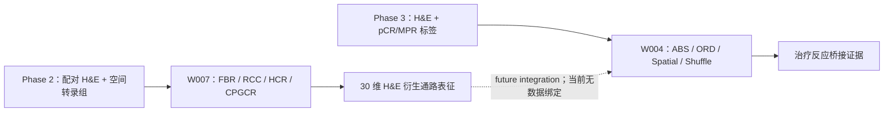

# 方法—代码—证据映射

> 生命周期：`pending_user_review`。本文件是静态审查，不运行训练，不证明服务器可执行性。

## 1. 两阶段关系

关键边界：W004 使用 `legacy_zscore_compatibility`，没有代码或数据证据表明其读取 W007 CPGCR 输出。因此本文只能提出双阶段研究叙事，不能宣称已验证端到端 CPGCR→Phase 3 流程。

## 2. W007 / CPGCR 静态映射

W007 结果已接纳，但完整训练源码不在当前 `main` 物理树；方法事实绑定历史 Git 对象。复核方式为 `git show <commit>:<path>`，不恢复或修改历史树。

| 论文方法表述 | 实现证据 | 证据状态 |
|---|---|---|
| 四臂：FBR 冻结基线复放、RCC 仅残差对照、HCR 硬配对对比、CPGCR 连续几何软对比 | `0f81be3:experiments/workspaces/W007/mpp2_cpgcr_probe/mpp2_cpgcr/model.py`；四臂 critical contract | 运行指标 `accepted`；源码 historical source-bound；RCC 不能单独证明纯容量因果效应 |
| 冻结 B0，永久 `eval/no_grad`，排除 optimizer | `model.py:28-45,119-138,175-197` | 方法事实 |
| 图像投影 `1536→256`，零初始化残差头 `256→30` | `model.py:48-57,73-99,102-165` | 方法事实 |
| HCR/CPGCR 训练期通路编码器 `30→256→256`，推理只走图像支路 | `model.py:60-70,123-165` | 方法事实 |
| 患者等权 z-MSE：先算患者内 spot×pathway MSE，再患者等权 | `losses.py:23-52` | 方法事实 + accepted 运行 |
| HCR：同 spot 正样本，双向 InfoNCE，`tau_z=0.07` | `losses.py:72-89` | 方法事实 |
| CPGCR：真实 30 维通路间均方距离形成软目标，双向软交叉熵；总损失为 absolute + 0.1×contrastive | `losses.py:92-145,196-241` | 方法事实；不能据损失值比例推断梯度占比 |
| `tau_y` 仅由训练患者跨患者对距离中位数估计，seed 42 | `losses.py:148-193` | 无外部集选择 |
| batch 为 6 患者×5 spots；Adam 1e-4；最多 50 epoch；patience 10；按 internal patient-balanced z-MSE 选模 | historical `configs/protocol_v001.yaml`、`batch_plan.py`、`train_eval.py` | accepted protocol |
| 输入为每 spot 1536 维冻结图像特征、30 维 train-zscore ssGSEA、patient、spot_id | `train_eval.py:208-396` | 方法事实 |
| 输出为 30 维 z/raw 预测；部署不需要真实 ssGSEA | `train_eval.py:426-514`、`result_contract.py:33-76` | 方法事实 |

绑定提交：FBR=`7be042a27d7a914744dfca1969ecae9ed6a3fb2d`；RCC=`24a87c72c90122fb061ef6f93ad133a04a3ab3d1`；HCR/CPGCR=`0f81be3cd542baa19ef3a2fe97bb146122a055bb`。

## 3. W004 Phase 3 Stage 2 静态映射

| 论文方法表述 | 当前代码/配置 | 证据状态 |
|---|---|---|
| 每张切片包含 pathology `[N,1536]`、pathway `[N,30]` 与坐标 | `experiments/workspaces/W004/code/phase3_pipeline/run_stage2.py:183-321`；`io.py:55-75` | current implementation |
| 双分支映射至 hidden 128，经 adaptive gate 融合、attention MIL 聚合并输出二分类 logit | `models.py:62-128` | current implementation |
| 患者加权 BCE：病例的每张片权重为 `1/n_slides`；AdamW 1e-3；20 epoch；patience 5；按 validation BCE 选模 | `engine.py:76-192` | current code + bundle proof |
| A001 ABS：legacy z-score 通路输入 | `run_stage2.py:49-65,245-275` | accepted / COMPATIBILITY_ONLY |
| A002 ORD：每张切片内逐通路百分位秩 | `transforms.py:49-80` | accepted / COMPATIBILITY_ONLY |
| A003：真实坐标 kNN 平滑，k=5，lambda=0.5 | `transforms.py:88-129` | accepted / COMPATIBILITY_ONLY |
| A004：确定性打乱坐标后使用相同平滑 | `run_stage2.py:260-271` | accepted / COMPATIBILITY_ONLY |
| pCR 与 MPR 各 4 seeds × 5 folds：每终点每臂 20 fits，两个终点合计每臂 40 fits | `run_stage2.py:420-655`；四包 metrics | accepted / COMPATIBILITY_ONLY；fit 不是独立患者 |
| 数据为切片级重复分层留出，78 cases 存在患者跨 train/val/test 重叠警告 | resolved config + `engine.py:143-156` | 硬限制；非 patient-independent |

### W004 通路输入来源边界

当前可核验链为：A001 读取既有 30 维输入 → 关键合同将其标为 `legacy_zscore_compatibility` → A002/A003/A004 只对该输入做 ordinal 或空间变换。该合同同时固定 `raw_mpp2_claim=false`。本任务没有重新核验 legacy 分数的上游生成过程，因此不能把当前 W004 输入写成已证明由 W007、CPGCR 或同一张 H&E 图像生成；“同源 H&E 双表征”只用于未来来源链完整核验后的拟议流程。

## 4. 超参数与输出摘要

| 模块 | W007 | W004 |
|---|---|---|
| 主要任务 | 30 通路连续回归 | pCR/MPR 二分类 |
| 图像维度 | 1536 | 1536/patch |
| 通路维度 | 30 | 30/patch |
| 优化器 | Adam, lr=1e-4 | AdamW, lr=1e-3 |
| 选模 | internal patient-balanced z-MSE | validation BCE |
| seeds | 42 | 1, 2, 42, 61 |
| 统计单位限制 | internal 6 patients；外部病例 E1 1 patient | slide-level repeated holdout；case overlap |
| 正式范围 | accepted single-seed Phase 2 evidence | accepted `COMPATIBILITY_ONLY` group |

## 5. 消融设计表

| 比较 | 可以回答 | 当前不能回答 |
|---|---|---|
| RCC−FBR | 残差协议整体变化 | 纯容量因果效应 |
| HCR−RCC | 匹配架构下硬配对对比监督增量 | 连续几何有效性 |
| CPGCR−HCR | 固定超参数下软几何相对硬目标增量 | 损失尺度/梯度冲突被排除 |
| A002−A001 | ordinal 相对 absolute 的兼容性信号 | 患者独立收益或 W007 下游效用 |
| A003−A004 | 真实坐标相对坐标反事实的数值差异 | 稳定空间机制或临床效用 |

## 6. 论文表述门禁

- 可写：W007 四臂已运行并接纳；CPGCR 是 pathway-aware（通路感知）候选；W004 四臂已受限接纳。
- 不可写：CPGCR 性能最佳；W004 使用 CPGCR 输出；raw MPP2；patient-independent OOF；稳定空间增益；融合协同；临床效用。
- 当前 main 不含完整 W007 训练源码，复现包需在未来独立任务中恢复 source-bound tree 后再验证。
