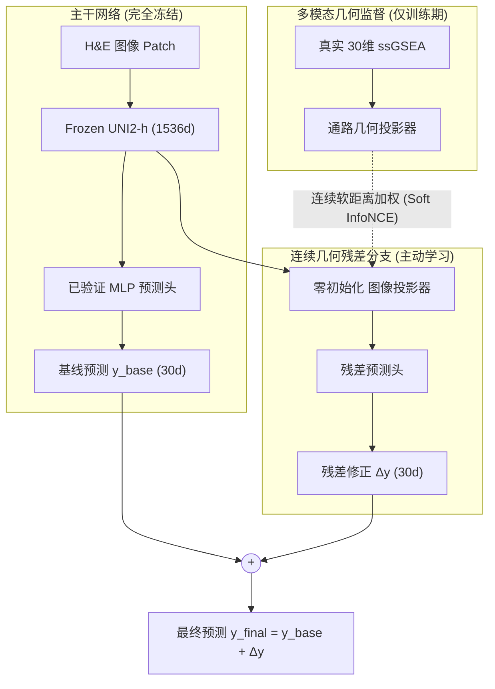
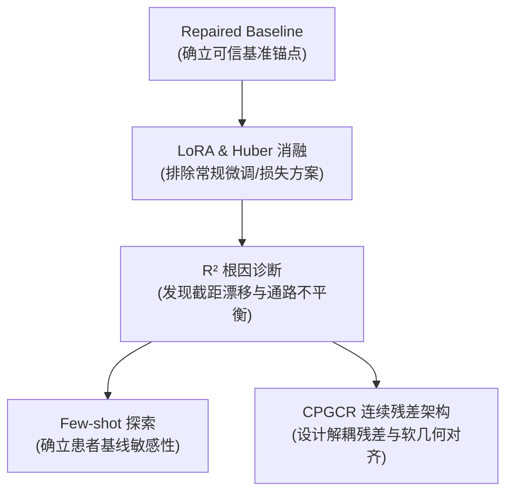

# Phase 2 论文撰写：基线路径实验选择与决策建议报告

> **文档性质**：组会决策讨论稿 / 论文选题与路径评估参考  
> **生成日期**：2026-08-15  
> **当前状态**：`draft_pending_user_review`（草案待团队审阅）  
> **数据事实源**：[MPP2基线后实验结果与论文创新性事实汇总_20260815.md](file:///D:/AI%E7%A9%BA%E9%97%B4%E8%BD%AC%E5%BD%95%E7%97%85%E7%90%86%E7%A0%94%E7%A9%B6/PFMval_new/01_%E6%8C%87%E5%8D%97%E4%B8%8E%E8%A7%A3%E8%AF%BB/%E5%88%86%E6%9E%90%E6%8A%A5%E5%91%8A/MPP2%E5%9F%BA%E7%BA%BF%E5%90%8E%E5%AE%9E%E9%AA%8C%E7%BB%93%E6%9E%9C%E4%B8%8E%E8%AE%BA%E6%96%87%E5%88%9B%E6%96%B0%E6%80%A7%E4%BA%8B%E5%AE%9E%E6%B1%87%E6%80%BB_20260815.md)  
> **权威实验底账**：`experiments/experiment_registry.json`（若有任何数据疑义，以底层 Registry 及各原始结果包为准）  

---

> [!IMPORTANT]
> ### ⚠️ 关于“Phase 2 决策边界”、“创新性评分”与“文献边界”的特别声明
> 1. **Phase 2 独立决策与 Phase 3 边界说明**：
>    - 本报告**仅聚焦于 Phase 2 阶段（从病理图像特征预测 30 维 ssGSEA 通路分数）的基线路径选择与撰稿策略决策**；
>    - **Phase 3（由通路预测下游临床结局如 pCR 等）由团队其他成员负责独立研究与决策**，本阶段不越权决定 Phase 3 的算法选择或预设整篇论文的最终标题与投递终稿。
> 2. **文献创新边界严格核验**：
>    - 经严格文献追溯，**跨模态图像—通路对齐（如 PEaRL, WACV 2026）** 与 **软目标/相似度对比（如 DeepPathway, Reg2ST）** 在相关前沿文献中已有探索，**本项目绝非首创跨模态对比或软对比概念**；
>    - 本项目的方法学立足点在于：**在已验证的冻结基线基础上，结合 30 维连续通路几何软监督与零起点残差解耦架构（CPGCR），并通过容量匹配四臂设计（FBR/RCC/HCR/CPGCR）实现清晰因果消融**。
> 3. **AI 辅助创新性评分（0–10 分）**：
>    - 由 AI 辅助结合计算机视觉与计算病理领域的**方法新颖度、生物学特异性、因果消融严密性与论文叙事辨识度**综合评估生成，**仅供组会选题参考，不代表绝对技术高低**。
> 4. **数据严谨性与如实披露**：
>    - 本文所有指标均直接提取自底层原始记录。对于未在原始日志中直接记录的指标，**均如实标注为“原始日志未直接记录”，严禁任何隐瞒或臆造**。

---

## 目录
1. [导师快速审阅导读（Executive Brief for PI）](#1-导师快速审阅导读executive-brief-for-pi)
2. [组会一页纸决策矩阵（横向对比总表）](#2-组会一页纸决策矩阵横向对比总表)
3. [实验结果综合对比可视化图表（Pareto 权衡与相对增益）](#3-实验结果综合对比可视化图表pareto-权衡与相对增益)
4. [四大技术路线深度画像与详细实验数据](#4-四大技术路线深度画像与详细实验数据)
   - [4.0 基准锚点：Repaired Frozen Baseline 详细数据](#40-基准锚点repaired-frozen-baseline-详细数据)
   - [4.1 路线一：特征层参数高效微调（LoRA 流派）](#41-路线一特征层参数高效微调lora-流派)
   - [4.2 路线二：预测层统计与几何校准（Ridge / Few-shot 流派）](#42-路线二预测层统计与几何校准ridge--few-shot-流派)
   - [4.3 路线三：优化目标函数鲁棒化（Huber Loss 流派）](#43-路线三优化目标函数鲁棒化huber-loss-流派)
   - [4.4 路线四：跨模态表征与连续几何残差（W007 / CPGCR 流派）](#44-路线四跨模态表征与连续几何残差w007--cpgcr-流派)
5. [基准锚点与机制诊断的支撑作用](#5-基准锚点与机制诊断的支撑作用)
6. [Phase 2 论文故事线构建建议（两条可行路径）](#6-phase-2-论文故事线构建建议两条可行路径)
7. [决策落地与后续算力排期规划（Roadmap Card）](#7-决策落地与后续算力排期规划roadmap-card)
8. [审稿人防御与合规表述红线](#8-审稿人防御与合规表述红线)
9. [原始实验、学习指南与部署方案精准索引](#9-原始实验学习指南与部署方案精准索引)

---

## 1. 导师快速审阅导读（Executive Brief for PI）

### 1.1 为什么外部测试 $R^2$ 是负的？（机制定心丸）
外部盲测（XZY）中基线 $R^2 = -0.0880$，并非模型预测发生错乱，而是因为 **“跨患者系统性截距漂移（Baseline Shift）”**。  
如下方真实数据分布图所示，不同患者的组织切片在染色、批次及个体差异上存在整体平移（截距偏差解释了 23.2% 的 MSE 误差），而模型在空间相对排序上依然保持了稳健能力（PCC = 0.6549）。

  
*图 1：7 名患者 30 维 ssGSEA 表达均值与方差对比（详见学习指南：[MPP2_R2预测优化_假设检验与实验复盘_20260725.md](file:///D:/AI%E7%A9%BA%E9%97%B4%E8%BD%AC%E5%BD%95%E7%97%85%E7%90%86%E7%A0%94%E7%A9%B6/PFMval_new/01_%E6%8C%87%E5%8D%97%E4%B8%8E%E8%A7%A3%E8%AF%BB/%E5%AD%A6%E4%B9%A0%E6%8C%87%E5%8D%97/MPP2_R2%E9%A2%84%E6%B5%8B%E4%BC%98%E5%8C%96_%E5%81%87%E8%AE%BE%E6%A3%80%E9%AA%8C%E4%B8%8E%E5%AE%9E%E9%AA%8C%E5%A4%8D%E7%9B%98_20260725.md)）*

---

### 1.2 推荐核心路线（CPGCR）的核心直觉是什么？
为什么推荐 CPGCR 作为 Phase 2 主打方法？其本质是在特征空间中引入**生物学连续流形拓扑**：

```
[ 图 A: HCR 离散硬对比 (传统硬对比) ]           [ 图 B: CPGCR 连续软几何对比 (软目标残差) ]
   (生物学相近 spot 被强行当作负例推开)              (距离严格正比于 30d ssGSEA 真实几何距离)

         Spot j (高表达)                                  Spot j (高表达)
           ▲                                                ▲
           │ [强斥力 F_repel]                                │ [软斥力 (距离远)]
           │                                                │
Anchor i ──┼──▶ Spot k (中高表达, 临近)            Anchor i ──┼──▶ Spot k (中高表达, 临近)
 (高表达)   │                                        (高表达)   │   [软引力 (生物学相近保持拓扑)]
           ▼                                                ▼
         Spot l (低表达)                                  Spot l (低表达)
```
- **传统硬对比（HCR）**：把除自身外的所有 spot 均当成硬负例推开，破坏了渐变组织微环境的连续性；
- **连续软几何（CPGCR）**：以真实 30 维 ssGSEA 距离构造软概率（$q_{ij} \propto \exp(-\|s_i-s_j\|^2/\tau_y)$），保持了连续表达流形，使外部预测取得了最低的绝对误差（MAE 1173.902）与最优的 $R^2$（-0.080119）。

---

## 2. 组会一页纸决策矩阵（横向对比总表）

> **指标口径说明**：
> - **External PCC**：XZY 全部 spot 展平后的 Pooled Pearson 相关系数（越高越好）；
> - **External $R^2$**：30 条通路原始 ssGSEA 尺度下的 Mean Pathway Raw $R^2$（越高越好，接近 1 为佳）；
> - **External MAE**：原始 ssGSEA 尺度下的平均绝对误差（越低越好）。

| 候选技术路线 | 核心方法假设与直觉 | 内部验证 (Val) 表现 | 外部盲测 (XZY) 核心指标 | AI 创新评分 (参考) | 论文写作优势 (Pros) | 局限与审稿风险 (Cons) | 后续继续改进的潜力空间 (Potential) | 建议学术定位 |
| :--- | :--- | :--- | :--- | :---: | :--- | :--- | :--- | :--- |
| **0. 冻结基线 (Anchor)**<br>`repaired_baseline` | 修复标签污染，以预训练 UNI2-h 特征输入两层 MLP 作为基准 | • Val Loss: 0.3749<br>• Val PCC: 0.7971 | • PCC: 0.6549<br>• $R^2$: -0.0880<br>• MAE: 1176.21 | 2.0 / 10 | 严格修复数据合同，提供最干净可信的 Baseline | 纯工程基准，不可作为算法创新点 | —（作为不可动摇的对照锚点） | **论文统一对照锚点** |
| **1. 参数微调流派**<br>`LoRA (r=8, dropout)` | 认为病理大模型特征需要针对转录组下游任务进行低秩微调自适应 | • Val Loss: 0.3823 (变差)<br>• Val PCC: 0.7930 (变差) | • PCC: 0.6464<br>• $R^2$: -0.1359<br>• MAE: 1206.83 | 3.5 / 10 | 紧跟大模型 PEFT 微调热点，实验流程成熟标准 | 内部指标双降，外部提升微弱且未过门禁，缺乏针对性创新 | **低**：在小样本跨患者任务中，常规微调极易过拟合，理论上限受限 | **作为阴性对比实验**<br>(证明盲目微调大模型在 ST 上失效) |
| **2. 统计校准流派**<br>`Ridge / Few-shot` | 认为泛化瓶颈主要源于跨患者均值/方差漂移，试图通过线性校准修正 | • Nested-LOPO 选择向恒等映射收缩 | • 全局 Ridge: PCC/MAE 无改善<br>• Few-shot (10点): $R^2$ 升至 +0.2112 | 4.5 / 10 (Ridge)<br>6.0 / 10 (Few-shot) | 深刻揭示了 $R^2$ 崩塌的数学根因；Few-shot 展示了实用临床微调前景 | 全局线性外推在外部患者上失效；Few-shot 偏离了纯图像零样本预测设定 | **中**：可作为“少样本临床自适应（Few-shot Adaptation）”扩展章节 | **作为机制诊断与扩展讨论**<br>(解释误差来源并引出残差设计) |
| **3. 损失优化流派**<br>`Huber Loss (δ=1)` | 认为转录组离群极大值主导了 MSE 惩罚，改用鲁棒损失优化 | • Val Loss: 0.1723 (Huber)<br>• Val PCC: 0.7975 | • PCC: 0.6527<br>• 17/30 通路局部提升<br>• MAE: 1174.22 | 2.0 / 10 | 为抗噪和离群点提供了直观解释，17 条通路出现正向改善 | 全局 Pooled PCC 净下降 (-0.0022)；单纯改 loss 创新辨识度低 | **低**：单一标量损失函数无法改变跨模态表征空间的几何分布 | **作为 Baseline 消融项**<br>(证明单一损失替换不是解法) |
| **4. 连续几何残差流派**<br>`CPGCR (W007)` | **冻结可靠基线保底**，以 30 维连续通路几何软目标指导**零起点图像残差学习** | • Val MSE: 0.3788<br>• Val PCC: 0.7980 (仅次于 RCC) | • **PCC: 0.6549**<br>• **$R^2$: -0.0801 (最优)**<br>• **MAE: 1173.90 (最优)** | **8.0 / 10** | **架构解耦性好**；四臂消融逻辑严密；推理仅需纯图像 | 单 seed / 单外部患者，提升幅度微小；HCR 在 PCC 上略占优 (0.6560) | **极高**：架构完全解耦，极易接入“空间图注意力”、“多任务残差头”等扩展 | **推荐作为 Phase 2 论文主打方法模型** |

---

## 3. 实验结果综合对比可视化图表（Pareto 权衡与相对增益）

  
*图 2：Phase 2 候选模型外部盲测（XZY）泛化表现综合对比。(A) 外部 PCC vs. MAE 权衡散点图（左上角为最优区域，HCR 与 CPGCR 构成 Pareto 前沿面）；(B) 各方法相对 Repaired Baseline 的净改善幅度对比。*

- **Pareto 权衡一目了然**：
  - **LoRA** 位于右下角（劣势区）；
  - **HCR** 主打空间排序（PCC 顶格达 0.655982）；
  - **CPGCR** 主打绝对误差压制与方差控制（MAE 达到最低 1173.902，负 $R^2$ 得到最有效改善）。两者共同构成了当前的 Pareto 前沿面。

---

## 4. 四大技术路线深度画像与详细实验数据

### 4.0 基准锚点：Repaired Frozen Baseline 详细数据

- **实验标识**：`mpp2_barcode_repair_v003_frozen_baseline_20260711`（attempt-003）
- **模型结构**：Frozen UNI2-h (1536d) + 2层 MLP (1536 → 1024 → 30)
- **训练超参**：Seed=42，LR=1e-3，Weight Decay=1e-4，Batch Size=64，Total Epochs=25，按最小 Validation Loss 自动保存最优 Checkpoint。

#### 📊 底层详细实验数据清单

| 数据集划分 | 评估指标 | 详细数值 / 记录状态 | 数据来源说明 |
| :--- | :--- | :--- | :--- |
| **全局训练状态** | **Best Epoch** | **Epoch 15** (共 25 Epochs) | `metrics.json: "best_epoch": 15` |
| **训练集 (Train)**<br>*(Epoch 15 状态)* | Train Loss (z-space MSE) | **0.307963** | `training_history.csv` |
| | Train Pooled PCC | **0.831926** | `training_history.csv` |
| | Train $R^2$ / MAE | *原始 training_history.csv 中未直接记录* | 仅记录了 loss 与 pcc |
| **内部验证集 (Internal Val)**<br>*(Epoch 15 最优)* | Val Loss / Pooled z-MSE | **0.374886** | `metrics.json` / `training_history.csv` |
| | Patient-balanced z-MSE | **0.380743** | W007 事实核验报告 |
| | Val Pooled PCC | **0.797126** (约 0.7971) | `training_history.csv` |
| | Val z-MAE | **0.454207** | `training_history.csv` |
| | Val $R^2$ (z-space) | **0.635124** | `training_history.csv` |
| | Val Raw MAE | **884.949** | W007 事实核验报告 |
| **外部测试集 (External XZY)**<br>*(Epoch 15 盲测)* | External Pooled PCC | **0.654896** (约 0.6549) | `metrics.json` |
| | External Mean Pathway PCC | **0.519386** | Ridge 基线诊断记录 |
| | External Mean Pathway Raw $R^2$ | **-0.088017** (约 -0.0880) | `metrics.json` |
| | External Raw MAE | **1176.2114** | `metrics.json` |
| | External z-MSE / Test Loss | **0.662077** (约 0.6621) | `metrics.json` |
| | External z-MAE | **0.619123** (约 0.6191) | `metrics.json` |

---

### 4.1 路线一：特征层参数高效微调（LoRA 流派）


- **科学假设**：预训练基础模型（UNI2-h）是在通用病理自监督任务上训练的，可能存在特征分布偏移，引入低秩适配层（LoRA）可以让 Backbone 更好地适应空间转录组任务。
- **论文撰写优势 (Pros)**：属于主流的大模型参数高效微调范式（PEFT），易于被计算机视觉方向审稿人理解。
- **局限与审稿风险 (Cons)**：未通过预先设定的内部验证门禁（Internal-First Gate），属于阴性结果；若作为主模型投稿，易被审稿人质疑“在小样本 ST 数据上破坏了大模型原始特征的泛化性”。
- **后续改进潜力客观预估**：**潜力评级：低**。在仅有 6 名训练患者的数据规模下，直接微调大模型庞大参数空间的风险极高，单纯调整 rank、alpha 或 dropout 很难出现跳跃式提升。
- 🔗 **进阶学习与审查报告**：[Codex决策逻辑与MPP2_LoRA实验学习指南.md](file:///D:/AI%E7%A9%BA%E9%97%B4%E8%BD%AC%E5%BD%95%E7%97%85%E7%90%86%E7%A0%94%E7%A9%B6/PFMval_new/01_%E6%8C%87%E5%8D%97%E4%B8%8E%E8%A7%A3%E8%AF%BB/%E5%AD%A6%E4%B9%A0%E6%8C%87%E5%8D%97/Codex%E5%86%B3%E7%AD%96%E9%80%BB%E8%BE%91%E4%B8%8EMPP2_LoRA%E5%AE%9E%E9%AA%8C%E5%AD%A6%E4%B9%A0%E6%8C%87%E5%8D%97.md)

#### 📊 底层详细实验数据清单

| 实验分支 | 划分集 | 核心指标 | 具体数值 / 记录状态 | 来源与备注 |
| :--- | :--- | :--- | :--- | :--- |
| **S0：同期冻结对照**<br>`frozen continue smoke` | **Best Epoch** | **Epoch 3** (共 3 Epochs) | `metrics.json: "best_epoch": 3` | S0 采用与 S1 相同的 3 epoch smoke 预算 |
| | **训练集 (Train)** | Train Loss / PCC | **Loss: 0.296641 / PCC: 0.838680** | `training_history.csv` (Epoch 3) |
| | **内部验证集 (Val)** | Val Loss / PCC / $R^2$ | **Loss: 0.378922 / PCC: 0.794792 / $R^2$: 0.631165** | Val z-MAE: 0.456050 (`metrics.json`) |
| | **外部测试集 (XZY)** | External PCC / $R^2$ / MAE | **PCC: 0.644546 / Raw $R^2$: -0.144913 / Raw MAE: 1215.284** | Test Loss: 0.694184 (`metrics.json`) |
| **S1：LoRA 微调**<br>`rank=8, alpha=16, dp=0` | **Best Epoch** | **Epoch 1** (共 3 Epochs) | `metrics.json: "best_epoch": 1` | Epoch 2/3 内部验证 Loss 迅速上升过拟合 |
| | **训练集 (Train)** | Train Loss / PCC | **Loss: 0.307376 / PCC: 0.832221** | `training_history.csv` (Epoch 1) |
| | **内部验证集 (Val)** | Val Loss / PCC / $R^2$ | **Loss: 0.382320 / PCC: 0.792969 / $R^2$: 0.627825** | 双指标相对 S0 均变差（门禁失败） |
| | **外部测试集 (XZY)** | External PCC / $R^2$ / MAE | **PCC: 0.646439 / Raw $R^2$: -0.135891 / Raw MAE: 1206.826** | 30 条通路中 26 条 PCC 较 S0 下降 |
| **LoRA + Dropout**<br>`rank=8, dropout=0.10` | **Best Epoch** | **Epoch 1** (共 3 Epochs) | `metrics.json: "best_epoch": 1` | Epoch 1 后同样迅速过拟合 |
| | **训练集 (Train)** | Train Loss / PCC | **Loss: 0.307585 / PCC: 0.832095** | `training_history.csv` (Epoch 1) |
| | **内部验证集 (Val)** | Val Loss / PCC / $R^2$ | **Loss: 0.382283 / PCC: 0.792907 / $R^2$: 0.627874** | 内部表现未见任何改善 |
| | **外部测试集 (XZY)** | External PCC / $R^2$ / MAE | **PCC: 0.643799 / Raw $R^2$: -0.129278 / Raw MAE: 1210.085** | Test Loss: 0.684256 (`metrics.json`) |

---

### 4.2 路线二：预测层统计与几何校准（Ridge / Few-shot 流派）

- **科学假设**：模型已经学到了正确的空间相对排序，外部负 $R^2$ 主要是由于跨批次/患者引起的系统性平移和缩放漂移（$y = k \cdot \hat{y} + b$）。
- **论文撰写优势 (Pros)**：机制解释极为深刻：揭示了跨患者泛化中“截距漂移解释了 23.2% 的 MSE 误差”，为领域指出了一个核心病理统计学痛点。
- **局限与审稿风险 (Cons)**：全局 Ridge 在零样本（Zero-shot）场景下无法泛化；Few-shot 虽然效果惊人，但改变了“仅靠 H&E 图像预测”的严格任务设定（需要少量真值辅助）。
- **后续改进潜力客观预估**：**潜力评级：中**。适合作为论文中的“机制讨论章节”或“扩展临床应用场景（少样本快速校准）”，但不建议单独作为零样本主方法。
- 🔗 **进阶学习与复盘报告**：[MPP2_R2预测优化_假设检验与实验复盘_20260725.md](file:///D:/AI%E7%A9%BA%E9%97%B4%E8%BD%AC%E5%BD%95%E7%97%85%E7%90%86%E7%A0%94%E7%A9%B6/PFMval_new/01_%E6%8C%87%E5%8D%97%E4%B8%8E%E8%A7%A3%E8%AF%BB/%E5%AD%A6%E4%B9%A0%E6%8C%87%E5%8D%97/MPP2_R2%E9%A2%84%E6%B5%8B%E4%BC%98%E5%8C%96_%E5%81%87%E8%AE%BE%E6%A3%80%E9%AA%8C%E4%B8%8E%E5%AE%9E%E9%AA%8C%E5%A4%8D%E7%9B%98_20260725.md)

#### 📊 底层详细实验数据清单

| 实验类别 | 评估维度 | 核心指标 | 具体数值 / 记录状态 | 来源与详细说明 |
| :--- | :--- | :--- | :--- | :--- |
| **逐通路 Ridge 正式校准**<br>`r003 (严禁读取 XZY)` | **超参数搜索机制**<br>*(嵌套留一交叉验证)* | $\lambda$ 搜索结果与来源 | **6/6 折均严格选择 $\lambda=10.0$** | **【超参数来源详解】**：根据严格的无数据泄漏协议，校准器在仅包含 6 名训练患者的数据上运行 **Nested Leave-One-Patient-Out（Nested-LOPO）**。预设候选集为 $\lambda \in \{0.1, 1.0, 10.0\}$，用于控制向恒等映射 $(k=1, b=0)$ 的收缩强度。在 6 个外层留出患者折（HYZ15040, JFX, LMZ12939, TGC, XSL, ZHZ）的内层验证中，所有折的 Patient-balanced z-MSE 均显示 $\lambda=10.0$ 表现最佳（强收缩，说明数据抗拒激进的线性变换），故一致收敛于 10.0。 |
| | **内部 Nested OOF 表现** | Pooled PCC / $R^2$ / MAE | **PCC: 0.797127 / Raw $R^2$: 0.635128 / Raw MAE: 884.902** | 内部 Patient-balanced MSE: 0.380738 |
| | **外部 XZY 校准前 (基线)** | PCC / $R^2$ / MAE | **Pooled PCC: 0.654896 / Raw $R^2$: -0.088017 / Raw MAE: 1176.211** | Mean Pathway PCC: 0.519386 |
| | **外部 XZY 校准后** | PCC / $R^2$ / MAE | **Pooled PCC: 0.654888 / Raw $R^2$: -0.088037 / Raw MAE: 1176.225** | **仅 1/30 通路被激活微弱校准，其余 29 条均回退为恒等映射** |
| **R² 根因分解诊断**<br>`mpp2_r2_root_cause` | **截距漂移占比** | Bias² 贡献 MSE 比例 | **23.2%** | 截距 Oracle 带来 $\Delta R^2 = +0.3574$ |
| | **主要负贡献通路** | 拖累 $R^2$ 赤字的前三通路 | **IFN-α, Complement, ROS 贡献了 66.9% 负赤字** | `per_pathway_diagnostics.csv` |
| **Few-shot 截距探索**<br>`1% 锚点 (10 spots)` | **外部留出集验证**<br>*(留出 1,029 spots, 200次重复)* | 留出集 $R^2$ 中位数 | **由 -0.0860 恢复至 +0.2112** ($\Delta +0.2974$) | 5%–95% 置信区间: $[+0.2568, +0.3262]$ |
| | | 留出集 Raw MAE 中位数 | **显著下降 190.23** | `fraction_summary.csv` |

---

### 4.3 路线三：优化目标函数鲁棒化（Huber Loss 流派）

- **科学假设**：ssGSEA 通路分数存在极端值离群点，传统的 MSE（$L_2$）对异常值过度敏感，改用 Huber 鲁棒损失（$\delta=1.0$）可以缓解极端 spot 的干扰。
- **论文撰写优势 (Pros)**：实验设计为极其严格的单变量成对控制（MSE vs. Huber），对比干净。
- **局限与审稿风险 (Cons)**：缺乏方法学创新辨识度（只是换了一个标准 loss）；存在指标权衡（部分通路升、整体指标降），难以直接宣称胜出。
- **后续改进潜力客观预估**：**潜力评级：低**。实验证明损失函数的简单替换无法弥补特征空间的本质缺陷。

#### 📊 底层详细实验数据清单

| 评估划分集 | 核心指标项 | MSE 对照组数值 (A003/R004) | Huber 实验组数值 (A004/R002) | 差值与现象分析 (Huber - MSE) |
| :--- | :--- | :--- | :--- | :--- |
| **全局训练状态** | **Best Epoch** | **Epoch 15** | **Epoch 15** | 两者均在 Epoch 15 达到最优 |
| **训练集 (Train)**<br>*(Epoch 15)* | Train Loss | **0.307963** (MSE) | **0.144043** (Huber) | 损失函数定义不同，数值不可直接对比 |
| | Train Pooled PCC | **0.831926** | **0.830670** | Train PCC 微降 0.001256 |
| | Train $R^2$ / MAE | *原始 training_history.csv 中未直接记录* | *原始 training_history.csv 中未直接记录* | — |
| **内部验证集 (Val)**<br>*(Epoch 15)* | Val Loss | **0.374886** (MSE) | **0.172312** (Huber) | 均按各自 validation loss 最优保存 |
| | Val Pooled PCC | **0.797126** | **0.797509** (约 0.7975) | Val PCC 微升 +0.000383 |
| | Val z-MAE | **0.454207** | **0.450355** | Val z-MAE 微降 -0.003852 |
| | Val $R^2$ (z-space) | **0.635124** | **0.635758** | Val $R^2$ 微升 +0.000634 |
| **外部测试集 (XZY)**<br>*(Epoch 15)* | External Pooled PCC | **0.654896** | **0.652691** (约 0.6527) | **Pooled PCC 下降 -0.002205** |
| | External Raw MAE | **1176.2114** | **1174.2159** | Raw MAE 微降 -1.9955 |
| | Mean Pathway Raw $R^2$ | **-0.088017** | **-0.090100** | Raw $R^2$ 略微变差 |
| | 通路 PCC 改善分布 | — | **17/30 通路上升，13/30 通路下降** | 局部通路改善未能扭转全局 Pooled PCC 下降 |

---

### 4.4 路线四：跨模态表征与连续几何残差（W007 / CPGCR 流派）



- **科学假设**：
  1. 基础模型预测头已经沉淀了坚实的基准能力，**应当完全冻结以提供稳健保底（Zero-risk Anchor）**；
  2. 30 维 ssGSEA 表达在生物学上是连续渐变的，结合真实通路距离构建连续几何软监督，驱动零起点的残差头（$\Delta y$）学习微调增量。
- **论文撰写优势 (Pros)**：
  - **吸收借鉴前沿工作的解耦架构**：在 PEaRL（双模态硬对比）与 DeepPathway（通路对比预测）等前沿工作的基础上，针对小样本跨患者任务将软目标与冻结基线残差架构进行解耦结合，避免了全量微调的过拟合风险；
  - **因果归因清晰**：四臂匹配消融体系（FBR vs RCC vs HCR vs CPGCR）能够逐层拆解“基础容量”、“硬对比”与“连续软几何”的贡献；
  - **临床部署友好**：通路投影器仅在训练期辅助监督，推理时完全依赖纯图像输入。
- **局限与审稿防御 (Cons)**：
  - 目前仅在单 seed / 单外部患者（XZY）上验证，指标绝对优势幅度较小（MAE 下降约 2.31，0.2%），存在 PCC 与 MAE 之间的轻微权衡；
  - 需防范夸大表述，应定位于“极具潜力的方法学框架与机制探索”。
- **后续继续改进的潜力空间（Improvement Potential）**：**潜力评级：极高（High Ceiling）**。架构解耦度极高，极易接入空间图卷积（GCN/GAT）、多任务解耦残差头等。
- 🔗 **进阶学习指南**：[MPP2连续通路几何软对比残差_实验设计学习指南_20260811.md](file:///D:/AI%E7%A9%BA%E9%97%B4%E8%BD%AC%E5%BD%95%E7%97%85%E7%90%86%E7%A0%94%E7%A9%B6/PFMval_new/01_%E6%8C%87%E5%8D%97%E4%B8%8E%E8%A7%A3%E8%AF%BB/%E5%AD%A6%E4%B9%A0%E6%8C%87%E5%8D%97/MPP2%E8%BF%9E%E7%BB%AD%E9%80%9A%E8%B7%AF%E5%87%A0%E4%BD%95%E8%BD%AF%E5%AF%B9%E6%AF%94%E6%AE%8B%E5%87%AE_%E5%AE%9E%E9%AA%8C%E8%AE%BE%E8%AE%A1%E5%AD%A6%E4%B9%A0%E6%8C%87%E5%8D%97_20260811.md) | [MPP2连续通路几何软对比残差_初学者进阶解析与结果判读指南_20260815.md](file:///D:/AI%E7%A9%BA%E9%97%B4%E8%BD%AC%E5%BD%95%E7%97%85%E7%90%86%E7%A0%94%E7%A9%B6/PFMval_new/01_%E6%8C%87%E5%8D%97%E4%B8%8E%E8%A7%A3%E8%AF%BB/%E5%AD%A6%E4%B9%A0%E6%8C%87%E5%8D%97/MPP2%E8%BF%9E%E7%BB%AD%E9%80%9A%E8%B7%AF%E5%87%A0%E4%BD%95%E8%BD%AF%E5%AF%B9%E6%AF%94%E6%AE%8B%E5%87%AE_%E5%88%9D%E5%AD%A6%E8%80%85%E8%BF%9B%E9%98%B6%E8%A7%A3%E6%9E%90%E4%B8%8E%E7%BB%93%E6%9E%9C%E5%88%A4%E8%AF%BB%E6%8C%87%E5%8D%97_20260815.md)
- 🔗 **配套部署方案**：[MPP2连续通路几何软对比残差_初步探索部署方案_20260811.md](file:///D:/AI%E7%A9%BA%E9%97%B4%E8%BD%AC%E5%BD%95%E7%97%85%E7%90%86%E7%A0%94%E7%A9%B6/PFMval_new/01_%E6%8C%87%E5%8D%97%E4%B8%8E%E8%A7%A3%E8%AF%BB/%E9%83%A8%E7%BD%B2%E6%96%B9%E6%A1%88/MPP2%E8%BF%9E%E7%BB%AD%E9%80%9A%E8%B7%AF%E5%87%A0%E4%BD%95%E8%BD%AF%E5%AF%B9%E6%AF%94%E6%AE%8B%E5%87%AE_%E5%88%9D%E6%AD%A5%E6%8E%A2%E7%B4%A2%E9%83%A8%E7%BD%B2%E6%96%B9%E6%A1%88_20260811.md)

#### 📊 W007 四臂底层详细实验数据对比清单

| 评估阶段与指标项 | FBR (基线复放) | RCC (残差容量) | HCR (硬对比残差) | CPGCR (连续软几何残差) | 四臂现象与对比结论 |
| :--- | :--- | :--- | :--- | :--- | :--- |
| **训练参数与状态** | **无需训练 (复放)** | **Best Epoch: 5** | **Best Epoch: 1** | **Best Epoch: 5** | 均按最小 internal patient-balanced z-MSE 保存 |
| **训练集损失 (Best Epoch)** | — | Abs Loss: **0.279764**<br>Contrastive: **0.0** | Abs Loss: **0.285943**<br>Contrastive: **1.249853** | Abs Loss: **0.283451**<br>Contrastive: **3.304410** | *注: 训练脚本未在 csv 中记录 train PCC/R²* |
| **内部验证：Patient-balanced z-MSE ↓** | 0.380743 | **0.378252 (最优)** | 0.379641 | 0.378847 (次优) | RCC 内部最占优，CPGCR 紧随其后 |
| **内部验证：Pooled z-MSE ↓** | 0.374886 | **0.373293 (最优)** | 0.373931 | 0.373592 | RCC 略占优 |
| **内部验证：z-MAE ↓** | 0.454207 | **0.452587 (最优)** | 0.453010 | 0.453023 | RCC 略占优 |
| **内部验证：Pooled PCC ↑** | 0.797126 | **0.798154 (最优)** | 0.797706 | 0.798000 | 残差分支均带来内部 PCC 微升 |
| **内部验证：Raw MAE ↓** | 884.949 | **881.387 (最优)** | 882.226 | 882.270 | 残差分支均降低内部 MAE |
| **内部验证：Mean Pathway Raw $R^2$ ↑** | 0.635124 | **0.636668 (最优)** | 0.636048 | 0.636379 | 残差分支均提升内部 $R^2$ |
| **外部测试：Pooled PCC ↑** | 0.654896 | 0.653758 | **0.655982 (最优)** | 0.654932 | **HCR 外部排序最强 (PCC 最高)** |
| **外部测试：Raw MAE ↓** | 1176.211 | 1177.107 (变差) | 1174.598 | **1173.902 (最优)** | **CPGCR 外部绝对误差最低 (MAE 下降 2.31)** |
| **外部测试：Mean Pathway Raw $R^2$ ↑** | -0.088017 | -0.087571 | -0.082654 | **-0.080119 (最优)** | **CPGCR 外部 $R^2$ 最平缓 (提升 +0.0079)** |
| **外部测试：z-MSE ↓** | 0.662077 | 0.659534 | 0.658108 | **0.656832 (最优)** | CPGCR 外部方差抑制最优 |
| **外部测试：z-MAE ↓** | 0.619123 | 0.619592 | 0.618486 | **0.618183 (最优)** | CPGCR 外部标准化误差最低 |

---

## 5. 基准锚点与机制诊断的支撑作用

在整篇论文中，非主选路线并非“废弃代码”，而是构成了论文极具深度的支撑骨架：



1. **Repaired Baseline 的作用**：扫清了数据标签污染的历史包袱，使后续所有比较建立在 100% 严谨的数据合同上；
2. **LoRA 与 Huber 的作用**：在论文的方法探索章节中，作为有力的阴性证据，证明“常规大模型微调和损失函数优化无法解决跨患者空间异质性”；
3. **R² 根因分析的作用**：为提出“残差学习与通路几何”提供了坚实的立论依据——正是因为观察到了截距漂移和排序退化，才需要将主干预测与残差细化解耦。

---

## 6. Phase 2 论文故事线构建建议（两条可行路径）

针对 Phase 2 的撰写切入点，推荐以下两种不同的逻辑主线组织策略供组会讨论选择：

### 方案 A（推荐）：方法创新型路线（以 CPGCR 软目标残差为主模型）
*适合投递：生物信息学与 AI 交叉顶刊 / 顶会*

- **核心逻辑架构**：
  1. **背景与动机**：空间转录组跨患者预测中连续表达流形难以被离散硬对比建模的挑战；
  2. **基线探索与瓶颈**：展示大模型微调（LoRA）与常规损失替换在小样本 ST 上的局限性；
  3. **方法设计（CPGCR）**：提出冻结基线锚点 + 30 维连续软几何残差学习框架；
  4. **实验与因果消融**：通过四臂匹配消融（RCC vs HCR vs CPGCR），阐明排序（PCC）与绝对误差（MAE）的指标权衡；
  5. **讨论与展望**：探讨软几何对齐在保持组织生物学连续性上的先验价值。

---

### 方案 B：实证基准与机制发现型（以根因分解与系统探索为主线）
*适合投递：数据驱动与计算生物学专业期刊*

- **核心逻辑架构**：
  1. **标准基准构建**：建立严格可信的修复基线标准与无泄漏评估协议；
  2. **主流范式实证评测**：系统评测微调（LoRA）、损失（Huber）、后处理（Ridge）等多种主流方案；
  3. **误差机制深度分解**：解剖外部负 $R^2$ 的根因（患者级截距漂移与极少数通路的负向贡献）；
  4. **自适应与残差探索**：展示少样本截距校准的恢复上限，并引出 CPGCR 作为结构化残差探索方案；
  5. **全景建议**：为跨患者空间转录组预测提供避坑指南与架构建议。

---

## 7. 决策落地与后续算力排期规划（Roadmap Card）

为便于导师与团队权衡时间与算力成本，量化 Phase 2 后续推进计划如下：

| 决策路径 | 适用发表类型 | 后续必需实验补充项 | 预估算力开销 | 预估推进周期 | 核心交付成果 |
| :--- | :--- | :--- | :--- | :--- | :--- |
| **方案 A：主推 CPGCR**<br>*(方法创新型)* | 生物信息与计算病理交叉顶刊/会议 | 1. 补充 3 个随机种子稳健性验证（Seed 43, 44, 45）；<br>2. 补充 30 条通路分类别（免疫/代谢）消融分析。 | 约 36 GPU Hours<br>(约 1.5 卡天) | 2–3 周 | 包含完整四臂消融与几何对齐分析的方法论章节与实验结果 |
| **方案 B：主推实证诊断**<br>*(机制与基准型)* | 数据驱动与计算生物学专业期刊 | 1. 整理 7 名患者均值漂移全景图表；<br>2. 整理 Few-shot 临床自适应探索数据。 | 约 0–6 GPU Hours<br>(现有数据已基本完备) | 1–2 周 | 涵盖大模型微调、损失替换、根因分解的全景实证分析报告 |

---

## 8. 审稿人防御与合规表述红线

为了保护团队在投审稿过程中的学术信誉，请团队成员在撰写或汇报时严格遵守以下规范：

| 维度 | ❌ 严禁使用的夸大表述（易招致拒稿） | ✅ 推荐采用的严谨学术表述 |
| :--- | :--- | :--- |
| **性能提升** | “CPGCR 显著（significantly）超越了基线与现有所有模型” | “CPGCR 在外部盲测中取得了最优的绝对误差（MAE）与更平缓的负向 $R^2$，展现了连续几何残差的优化潜力” |
| **对比学习** | “我们在病理转录组领域首次提出了跨模态对比学习” | “针对现有硬配对对比可能割裂通路连续性的问题，我们引入了基于 ssGSEA 距离的连续软几何先验” |
| **外部泛化** | “该方法彻底攻克了跨患者的组织病理泛化瓶颈” | “在单外部患者（XZY）的初步基准测试中观察到了细微而一致的正向趋势，仍需在更多独立队列中验证” |
| **指标权衡** | 回避 HCR 在 PCC 上略高、CPGCR 在 MAE 上略优的现象 | “结果呈现出轻微的指标权衡：硬对比偏向空间全局排序（PCC），而连续软几何更有效抑制了预测绝对偏差（MAE）” |

---

## 9. 原始实验、学习指南与部署方案精准索引

### 9.1 基础事实源与核验报告
- **事实源汇总**：[MPP2基线后实验结果与论文创新性事实汇总_20260815.md](file:///D:/AI%E7%A9%BA%E9%97%B4%E8%BD%AC%E5%BD%95%E7%97%85%E7%90%86%E7%A0%94%E7%A9%B6/PFMval_new/01_%E6%8C%87%E5%8D%97%E4%B8%8E%E8%A7%A3%E8%AF%BB/%E5%88%86%E6%9E%90%E6%8A%A5%E5%91%8A/MPP2%E5%9F%BA%E7%BA%BF%E5%90%8E%E5%AE%9E%E9%AA%8C%E7%BB%93%E6%9E%9C%E4%B8%8E%E8%AE%BA%E6%96%87%E5%88%9B%E6%96%B0%E6%80%A7%E4%BA%8B%E5%AE%9E%E6%B1%87%E6%80%BB_20260815.md)
- **W007 四臂核验报告**：[W007_四臂结果核验与待审结论_20260815.md](file:///D:/AI%E7%A9%BA%E9%97%B4%E8%BD%AC%E5%BD%95%E7%97%85%E7%90%86%E7%A0%94%E7%A9%B6/PFMval_new/01_%E6%8C%87%E5%8D%97%E4%B8%8E%E8%A7%A3%E8%AF%BB/%E5%88%86%E6%9E%90%E6%8A%A5%E5%91%8A/W007_%E5%9B%9B%E8%87%82%E7%BB%93%E6%9E%9C%E6%A0%B8%E9%AA%8C%E4%B8%8E%E5%BE%85%E5%AE%A1%E7%BB%93%E8%AE%BA_20260815.md)
- **项目机器注册表**：[experiment_registry.json](file:///D:/AI%E7%A9%BA%E9%97%B4%E8%BD%AC%E5%BD%95%E7%97%85%E7%90%86%E7%A0%94%E7%A9%B6/PFMval_new/experiments/experiment_registry.json)

### 9.2 关联学习指南与部署方案
- **CPGCR 实验设计学习指南**：[MPP2连续通路几何软对比残差_实验设计学习指南_20260811.md](file:///D:/AI%E7%A9%BA%E9%97%B4%E8%BD%AC%E5%BD%95%E7%97%85%E7%90%86%E7%A0%94%E7%A9%B6/PFMval_new/01_%E6%8C%87%E5%8D%97%E4%B8%8E%E8%A7%A3%E8%AF%BB/%E5%AD%A6%E4%B9%A0%E6%8C%87%E5%8D%97/MPP2%E8%BF%9E%E7%BB%AD%E9%80%9A%E8%B7%AF%E5%87%A0%E4%BD%95%E8%BD%AF%E5%AF%B9%E6%AF%94%E6%AE%8B%E5%87%AE_%E5%AE%9E%E9%AA%8C%E8%AE%BE%E8%AE%A1%E5%AD%A6%E4%B9%A0%E6%8C%87%E5%8D%97_20260811.md)
- **CPGCR 进阶解析与结果判读指南**：[MPP2连续通路几何软对比残差_初学者进阶解析与结果判读指南_20260815.md](file:///D:/AI%E7%A9%BA%E9%97%B4%E8%BD%AC%E5%BD%95%E7%97%85%E7%90%86%E7%A0%94%E7%A9%B6/PFMval_new/01_%E6%8C%87%E5%8D%97%E4%B8%8E%E8%A7%A3%E8%AF%BB/%E5%AD%A6%E4%B9%A0%E6%8C%87%E5%8D%97/MPP2%E8%BF%9E%E7%BB%AD%E9%80%9A%E8%B7%AF%E5%87%A0%E4%BD%95%E8%BD%AF%E5%AF%B9%E6%AF%94%E6%AE%8B%E5%87%AE_%E5%88%9D%E5%AD%A6%E8%80%85%E8%BF%9B%E9%98%B6%E8%A7%A3%E6%9E%90%E4%B8%8E%E7%BB%93%E6%9E%9C%E5%88%A4%E8%AF%BB%E6%8C%87%E5%8D%97_20260815.md)
- **CPGCR 初步探索部署方案**：[MPP2连续通路几何软对比残差_初步探索部署方案_20260811.md](file:///D:/AI%E7%A9%BA%E9%97%B4%E8%BD%AC%E5%BD%95%E7%97%85%E7%90%86%E7%A0%94%E7%A9%B6/PFMval_new/01_%E6%8C%87%E5%8D%97%E4%B8%8E%E8%A7%A3%E8%AF%BB/%E9%83%A8%E7%BD%B2%E6%96%B9%E6%A1%88/MPP2%E8%BF%9E%E7%BB%AD%E9%80%9A%E8%B7%AF%E5%87%A0%E4%BD%95%E8%BD%AF%E5%AF%B9%E6%AF%94%E6%AE%8B%E5%87%AE_%E5%88%9D%E6%AD%A5%E6%8E%A2%E7%B4%A2%E9%83%A8%E7%BD%B2%E6%96%B9%E6%A1%88_20260811.md)
- **R² 根因分析与复盘指南**：[MPP2_R2预测优化_假设检验与实验复盘_20260725.md](file:///D:/AI%E7%A9%BA%E9%97%B4%E8%BD%AC%E5%BD%95%E7%97%85%E7%90%86%E7%A0%94%E7%A9%B6/PFMval_new/01_%E6%8C%87%E5%8D%97%E4%B8%8E%E8%A7%A3%E8%AF%BB/%E5%AD%A6%E4%B9%A0%E6%8C%87%E5%8D%97/MPP2_R2%E9%A2%84%E6%B5%8B%E4%BC%98%E5%8C%96_%E5%81%87%E8%AE%BE%E6%A3%80%E9%AA%8C%E4%B8%8E%E5%AE%9E%E9%AA%8C%E5%A4%8D%E7%9B%98_20260725.md)
- **LoRA 决策逻辑学习指南**：[Codex决策逻辑与MPP2_LoRA实验学习指南.md](file:///D:/AI%E7%A9%BA%E9%97%B4%E8%BD%AC%E5%BD%95%E7%97%85%E7%90%86%E7%A0%94%E7%A9%B6/PFMval_new/01_%E6%8C%87%E5%8D%97%E4%B8%8E%E8%A7%A3%E8%AF%BB/%E5%AD%A6%E4%B9%A0%E6%8C%87%E5%8D%97/Codex%E5%86%B3%E7%AD%96%E9%80%BB%E8%BE%91%E4%B8%8EMPP2_LoRA%E5%AE%9E%E9%AA%8C%E5%AD%A6%E4%B9%A0%E6%8C%87%E5%8D%97.md)
