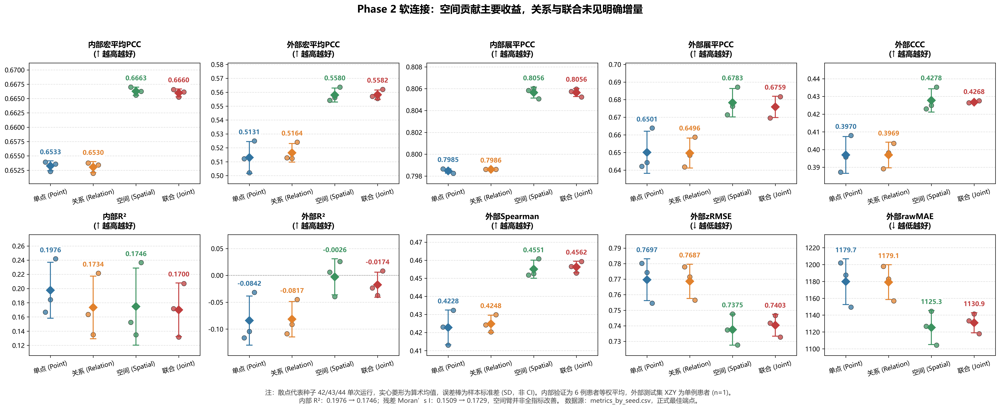
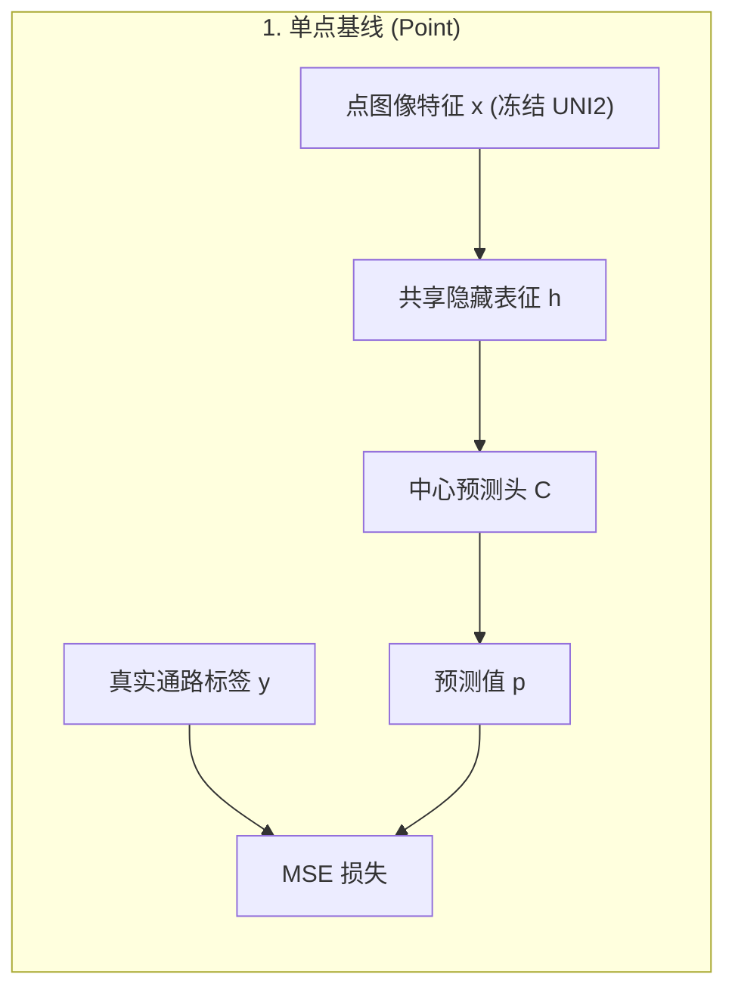
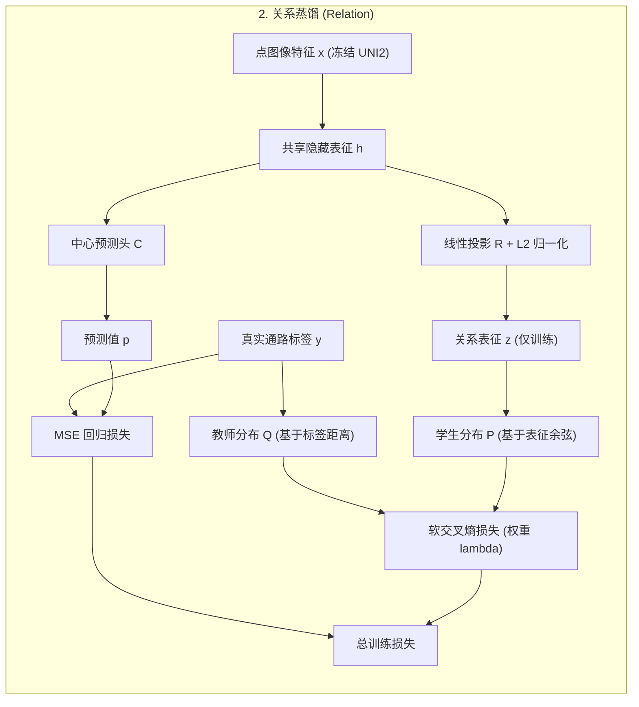
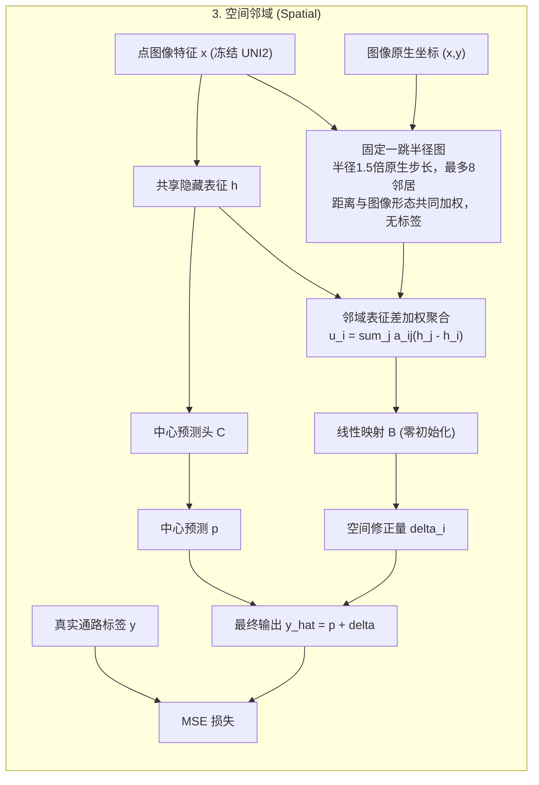
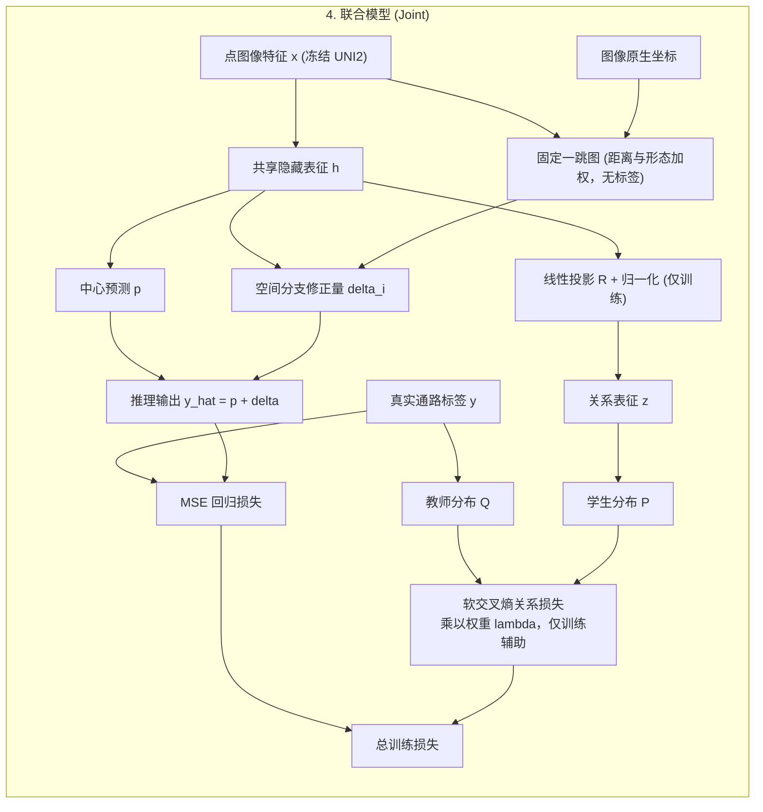
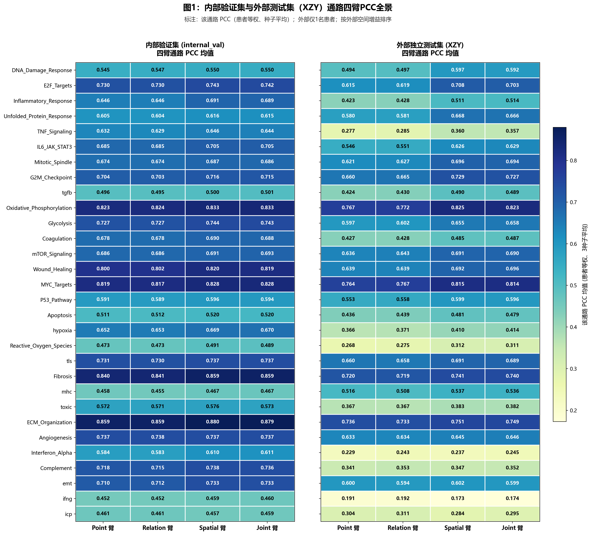
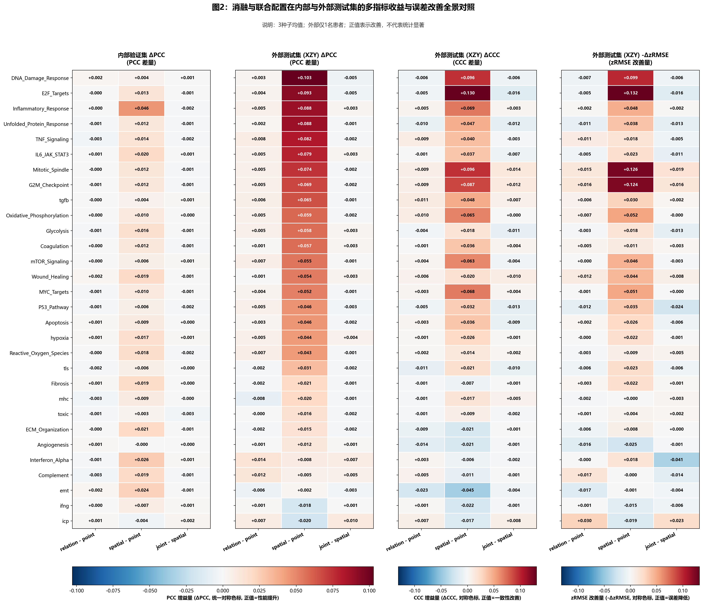
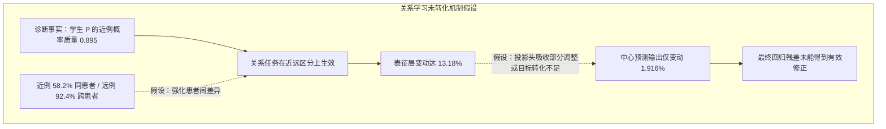

# Phase 2 软连接本地实验结果与机制分析报告 (v2.1)

注：已有图中文字保留原样。图中“宏平均PCC”统一对应逐通路平均 PCC（即患者—通路等权平均 PCC）；图中“展平PCC”统一对应平均池化 pooled PCC（整体展平 PCC）。下文与今后登记采用这两个名称。

单点（point）：对应初始的UNI2-h+MLP简单网络，参照论文改变了隐藏层维数

**核心结论**：在冻结病理基础模型特征的前提下，引入固定一跳空间邻域聚合分支带来了主要且稳健的预测增益；关系辅助蒸馏任务单独带来的改善微弱，与空间模块联合使用时相比纯空间分支未见明确的宏观性能增量。

---

### 图示导读与整体阅读说明

上图汇总了本次实验四个对照臂在 3 个随机种子（42、43、44）下的关键表现，包含内部验证集（6 例患者等权平均）与外部测试集（患者 XZY，n=1）的核心指标。图中散点代表各独立种子运行结果，菱形与误差棒分别展示均值与样本标准差（SD，非置信区间 CI），面板标注了各指标更优方向。阅读本报告时，建议重点关注空间分支在跨患者迁移中带来的误差收敛，同时客观审视未达预期的关系分支及其在联合模型中的表现。

---

## 一、四臂结构设计与实验设置

本轮比较不同预测头能否改善空间转录组通路活性预测。四臂输入均为冻结 UNI2-h 编码器提取的1536维图像特征：先经一层线性映射与GELU激活得到256维隐藏表征 $h$，再经中心回归头得到30条通路预测；Dropout(0.3，随机失活)只用于中心回归路径。主任务采用均方误差损失（MSE）。四臂共享划分、逐种子初始化和随机流，具体信息流如下：

需要强调的是：
1. **图构建完全无标签参与**：空间分支使用的邻接图基于物理距离（原生步长 1.5 倍阈值，最多 8 个邻居）与冻结 UNI2 特征的余弦相似度共同加权构成，不包含任何通路标签信息；
2. **关系头的辅助定位**：关系表征 $z$ 仅在训练阶段通过软交叉熵约束共享表征 $h$，在推理阶段不参与数值加和，预测值完全由中心回归头与空间分支生成；
3. **损失函数统一**：四臂的主回归损失严格为 MSE，排除了损失函数形式变动带来的干扰。

训练集为9472点，最大60轮；正式端点从第6轮起按内部患者等权PCC选择，同分时参考患者等权zMSE。关系项在第1–5轮权重为0，第6–15轮逐步升至0.05。外部XZY只评估已经冻结的端点。

---

## 二、核心评估结果：三大基本事实

本次评测严格执行患者等权算术平均口径，不与展平点位计算混用。3 个种子的完整均值如下表所示：

### 两种PCC怎么读：定义与内部、外部结果

#### 1. 评估口径定义与统计机制
- **逐通路平均 PCC（即患者—通路等权平均 PCC） (`pcc`)**：主口径一。先在各患者内部针对每条通路跨空间点位计算PCC，再在患者间与30条通路间进行等权算术平均，反映每名患者内、每条通路跨点位变化的预测相关性；PCC本身不直接测量空间梯度。
- **平均池化 pooled PCC（整体展平 PCC） (`flattened_pcc`)**：主口径二（点位与通路两个维度共同展平统计，非神经网络平均池化层）。将所有点位×30通路的z分数展开为长向量进行单次相关计算。该口径将跨通路与跨患者的基线和方差差异一并纳入，本轮数值高于逐通路平均 PCC（即患者—通路等权平均 PCC），但两者没有固定的大小关系，回答的是全样本长向量重构问题，数值较大不代表局部空间预测性能更优。
- **通路级合并PCC (`pooled_pathway_pcc`)**：第三口径（见附表）。先跨患者合并点位，对各通路分别计算PCC后再做跨通路均值。在单患者外部测试集（XZY）中无跨患者拼接，数学上严格等同于逐通路平均 PCC（即患者—通路等权平均 PCC）；在内部多患者验证集中则保留患者间水平差异。

#### 2. 两种主PCC口径统计表（种子样本均值 ± SD）
| 数据集 | 结构分支 (Arm) | 逐通路平均 PCC（即患者—通路等权平均 PCC） (`pcc`) | 平均池化 pooled PCC（整体展平 PCC） (`flattened_pcc`) |
| :--- | :--- | :--- | :--- |
| **内部验证 (internal_val)** | point | 0.6533 ± 0.0009 | 0.7985 ± 0.0002 |
| | relation | 0.6530 ± 0.0010 | 0.798608 ± 0.000010 |
| | spatial | 0.6663 ± 0.0007 | 0.8056 ± 0.0005 |
| | joint | 0.6660 ± 0.0007 | 0.8056 ± 0.0004 |
| **外部测试 (XZY)** | point | 0.5131 ± 0.0115 | 0.6501 ± 0.0120 |
| | relation | 0.5164 ± 0.0066 | 0.6496 ± 0.0085 |
| | spatial | 0.5580 ± 0.0051 | 0.6783 ± 0.0081 |
| | joint | 0.5582 ± 0.0035 | 0.6759 ± 0.0060 |

*注：SD为多随机种子样本标准差，非置信区间CI。*

#### 3. 客观比较与决策记录
- **分支表现比较**：`relation` 相比 `point`，外部逐通路平均 PCC（即患者—通路等权平均 PCC）略有上升（0.5131升至0.5164，+0.0033），但平均池化 pooled PCC（整体展平 PCC）略有下降（0.6501降至0.6496，-0.0005）；`joint` 相比 `spatial`，外部逐通路平均 PCC（即患者—通路等权平均 PCC）高0.000154（0.558155 vs 0.558001），而平均池化 pooled PCC（整体展平 PCC）低0.002393（0.675879 vs 0.678272）。
- **结论与状态**：两种口径回答不同问题，今后的注册与报告都并列展示。本轮结果已登记，原因解释待确认，模型冻结决策维持不变。

#### 附表：第三口径（通路级合并PCC `pooled_pathway_pcc`）对照
| 数据集 | 结构分支 (Arm) | 通路级合并PCC (mean ± SD) | 机制说明 |
| :--- | :--- | :--- | :--- |
| **内部验证 (internal_val)** | point | 0.7952 ± 0.0002 | 合并点位后仍包含患者间差异；本轮数值恰处两主口径之间，并非一般规律 |
| | relation | 0.7953 ± 0.0001 | |
| | spatial | 0.8023 ± 0.0004 | |
| | joint | 0.8022 ± 0.0001 | |
| **外部测试 (XZY)** | point | 0.5131 ± 0.0115 | 单外部样本无需跨患者拼接，数值与逐通路平均 PCC（即患者—通路等权平均 PCC）完全一致 |
| | relation | 0.5164 ± 0.0066 | |
| | spatial | 0.5580 ± 0.0051 | |
| | joint | 0.5582 ± 0.0035 | |

[两种主PCC及第三口径的完整统计](../../experiments/results/phase2_softlink_local_v2/20260908_005325_810_8d306c10/analysis/pcc_side_by_side.csv)。

### 内部验证集表现（6 例患者等权平均）
| 实验臂 | 逐通路平均 PCC（即患者—通路等权平均 PCC） | 平均池化 pooled PCC（整体展平 PCC） | CCC | Spearman | zRMSE | rawMAE | rawR2 |
| :--- | :---: | :---: | :---: | :---: | :---: | :---: | :---: |
| 单点基线 (Point) | 0.653263 | 0.798467 | 0.612486 | 0.613291 | 0.594476 | 884.900583 | 0.197575 |
| 关系蒸馏 (Relation) | 0.653046 | 0.798608 | 0.610871 | 0.612147 | 0.594535 | 885.514859 | 0.173354 |
| 空间邻域 (Spatial) | 0.666275 | 0.805644 | 0.628584 | 0.628926 | 0.583193 | 862.934106 | 0.174558 |
| 联合模型 (Joint) | 0.665985 | 0.805648 | 0.627861 | 0.628716 | 0.583341 | 863.225065 | 0.170006 |

### 外部测试集表现（患者 XZY，n=1，冻结端点评估）
| 实验臂 | 逐通路平均 PCC（即患者—通路等权平均 PCC） | 平均池化 pooled PCC（整体展平 PCC） | CCC | Spearman | zRMSE | rawMAE | rawR2 |
| :--- | :---: | :---: | :---: | :---: | :---: | :---: | :---: |
| 单点基线 (Point) | 0.513057 | 0.650099 | 0.396951 | 0.422798 | 0.769698 | 1179.695535 | -0.084181 |
| 关系蒸馏 (Relation) | 0.516391 | 0.649649 | 0.396928 | 0.424792 | 0.768668 | 1179.129432 | -0.081682 |
| 空间邻域 (Spatial) | 0.558001 | 0.678272 | 0.427755 | 0.455055 | 0.737503 | 1125.285474 | -0.002628 |
| 联合模型 (Joint) | 0.558155 | 0.675879 | 0.426757 | 0.456231 | 0.740331 | 1130.867586 | -0.017411 |

基于上述客观测量数据，可以得出三个明确结论：

### 1. 空间模块贡献了主要收益
空间分支在三个种子上都优于单点基线：外部相关系数PCC的绝对差为 +0.04494（逐种子为 +0.04196、+0.05409、+0.03879），标准化误差zRMSE下降4.18%，原始通路得分的绝对误差rawMAE下降4.61%。30条通路中，28条PCC上升、22条CCC上升、25条RMSE下降、24条R²上升，改善并非仅由少数通路拉动。这里PCC反映相关性，CCC反映数值一致性，Spearman反映排序；它们上升与误差下降共同支持邻域信息有用。icp和ifng的PCC仍分别下降0.0197和0.0182。

### 2. 关系模块单独收益微弱
在内部验证集上，关系分支的各核心指标均未超过单点基线（PCC 0.653046 vs 0.653263，Spearman 0.612147 vs 0.613291）；在外部测试集上，PCC 仅微升 0.003334，CCC 几乎持平，误差降幅不足 0.2%。这表明仅依靠当前基于标签距离构建的对比蒸馏，难以转化为有效的泛化预测能力。

### 3. 联合模型未见明确额外增量
联合模型相比纯空间模型，外部PCC仅高0.000154，而zRMSE与rawMAE略差；内部合并全部点位后计算的pooled_zRMSE虽略好（0.600970 vs 0.601194），主要宏平均指标却未增加。因此，joint相比point有收益，但未显示超越spatial的明确增量。spatial也是内部冻结摘要已经推荐的实验臂，这一判断不涉及按XZY重新选择模型。

---

## 二（补充）、逐通路表现：收益落在哪里

### 数据记录与指标规范

本次评测的逐种子通路表共包含 720 行记录，对应 4 个模型臂、30 条通路、2 个评估集与 3 个随机种子的逐项指标记录，并非逐点位的原始推断数据。在数据划分上，内部验证集基于 6 名患者的同患者点位留出验证，外部测试集（XZY）为单例独立患者。在消融结构定义上，Point 臂为单点前馈基线，Relation 臂引入关系辅助损失，Spatial 臂采用固定的单跳邻域残差建模，Joint 臂为两者的联合配置。

为确保统计概念与术语规范统一，报告中各项指标统一定义如下：
- 全局汇总指标区分为“逐通路平均 PCC（即患者—通路等权平均 PCC）”与“平均池化 pooled PCC（整体展平 PCC）”；
- 单条通路指标表述为“该通路 PCC（患者等权、种子平均）”，反映跨点位预测值与真实值的线性相关程度，而非局部几何相关；
- zRMSE 衡量标准化预测误差而非离散度；
- $R^2$ 衡量模型预测相对真实均值预测的相对误差表现；
- rawMAE 因各通路固有数值标度不同不宜直接横向对比，亦不据此推断基因表达丰度原因。

### 四臂通路表现与多指标一致性

消融对比展示了各模块引入后的表现差异（详见图 1 与图 2）：
- **空间模块增益**：Spatial 臂相较 Point 基线展现出较广的增益覆盖，内部验证集中 28/30 条通路、外部测试集中 26/30 条通路在 3 个种子上均取得正向改善。外部按种子均值计有 28/30 条通路改善，其中上述 26 条在三个种子上方向一致。外部测试集增益排名前 5 的通路分别为 DNA_Damage_Response (+0.102812)、E2F_Targets (+0.092878)、Inflammatory_Response (+0.088453)、Unfolded_Protein_Response (+0.088118) 与 TNF_Signaling (+0.082290)。此 5 条通路在 CCC 上升的同时伴随 zRMSE 下降，仅能支持这几条通路在多指标上呈现一致改善；
- **负向变化**：ifng (-0.018223) 与 icp (-0.019658) 在外部测试集的 3 个种子上均呈现 PCC 下降；
- **关系与联合模块**：Relation 臂在外部有 24/30 条通路的 PCC 种子均值上升，其中仅 4/30 条在三个种子上均上升；Joint 臂相对 Spatial 臂在外部有 11/30 条通路的 PCC 种子均值上升，其中仅 2/30 条在三个种子上均上升。需要说明的是，30 条通路之间可能存在相关性，在尚未核对各通路共享基因的情况下，不能断言存在共享网络；关系模块收益的种子一致性偏低是当前观察到的现象，不宜直接引申为初始化敏感性或泛化脆弱已获证明；联合模块的部分微幅变化亦不附加长程交互或代谢机制等未经核验的推断。

### 指标分离反例与校准审视

多指标对照显示，跨点位线性相关（PCC）与数值校准水平存在明确的分离现象，不可将单项 PCC 提升直接等同于预测质量的全面优化：
- **反例通路分析**：部分通路在 PCC 出现微增的同时，绝对一致性与标准化误差反而恶化。典型反例如 Angiogenesis（PCC +0.011680，但 CCC -0.020757，zRMSE +0.025303）、Complement（PCC +0.005393，CCC -0.011025，zRMSE +0.000426）以及 emt（PCC +0.001778，CCC -0.044800，zRMSE +0.000884）。这表明线性相关的改善并不必然带来数值尺度的准确对齐；
- **校准与负 $R^2$ 表现**：在外部测试集的 Spatial 臂中，Glycolysis 虽取得 0.654752 的较高 PCC，但 $R^2$ 为 -0.470582；Interferon_Alpha 与 Complement 的 $R^2$ 则分别为 -2.095575 与 -1.701259。负 $R^2$ 表示平方误差大于用该通路真实均值作预测的基线；尺度偏差、均值偏差与相关不足都可能贡献，不能仅由负值判定原因，并不代表生物通路本身的活性高低，说明相关性与校准度必须分开看待。

### 后续诊断与验证建议

针对上述实证发现，后续工作建议按以下步骤稳步推进：
1. **基因集与空间图核对**：在训练集与内部验证集上首先核对 30 条通路的基因集合构成与空间邻域连接图，系统诊断邻域特征混合与尺度偏差假说；
2. **新患者留出复验**：在后续实验中引入更多新患者样本进行独立留出复验，避免使用外部测试集（XZY）进行端点挑选或超参数调整；
3. **坚持多指标综合研判**：避免基于单一指标得出过宽推论，在后续研发中坚持相关性、一致性与校准误差的联合评估。

各通路在四臂消融下的完整数据可参阅 [Phase2四臂逐通路指标附表_20260908.md](Phase2四臂逐通路指标附表_20260908.md)。

统计说明：720条逐种子指标汇总为240组，每组均值、样本标准差和有效计数完整保留；SD不是患者泛化置信区间。“平均池化 pooled PCC（整体展平 PCC）”是跨点位与通路的整体相关，不能把单条通路PCC当作该整体指标的可加总分量。图中0.000可能是四舍五入后的微小差值，改善计数使用未舍入值。

---

## 三、空间模块有效性的证据链分析

补充诊断从“邻居是否有信息”到“预测变化是否纠错”提供了以下证据；它们帮助定位原因，但还不能替代单因素消融实验。

### 1. 邻域标签的目标相关性事实
在内部6名患者中，我们计算图上邻居之间30条通路真实z分数的加权均方差，并与同患者内随机另一点的精确期望比较。对照包含除中心自身之外的所有点，也包括近邻；两边保留相同的中心权重，不做随机抽样或参数拟合。

邻域差异与随机对照的比值分别为：HYZ15040 0.594、JFX 0.416、LMZ12939 0.528、TGC 0.397、XSL 0.363、ZHZ 0.320，即图上邻居的通路差异低41%–68%。这支持当前图中的邻居含有可利用的目标相关信息；但不能据此确认细胞间通讯，也无法分离几何距离与图像形态权重的各自贡献。[邻域相关性明细](../../experiments/results/phase2_softlink_local_v2/20260908_005325_810_8d306c10/analysis/mechanism_neighbor_coherence.csv)

### 2. 误差分解的恒等式检验
为了理解预测值变化的具体作用，我们将预测改变量分解为恒等式：设单点基线误差为 $e = p - y$，空间模型的预测改变为 $d = p_{\text{spatial}} - p$，则均方误差的变化满足：
$$\Delta \text{MSE} = 2 \operatorname{mean}(e \cdot d) + \operatorname{mean}(d^2)$$

必须明确，该式为描述性代数恒等式，误差向量 $e$ 与改变量 $d$ 之间并不正交，$d^2$ 反映的是预测改变量的均方能量（包含均值偏移），而非纯方差惩罚；同时 $d$ 包含了重新训练中心网络带来的整体参数漂移，不能等同于空间分支 $\Delta$ 的独立因果效应。

在内部验证集上的等权计算结果为：
*   **纠错项 $2 \operatorname{mean}(e \cdot d)$**：空间模型为 -0.030449，联合模型为 -0.031167，关系模型仅为 -0.003393；
*   **扰动代价 $\operatorname{mean}(d^2)$**：空间模型为 +0.017502，联合模型为 +0.018304，关系模型为 +0.003337；
*   **最终净收益**：空间模型实现了 -0.012947 的 MSE 净降低，而关系模型的净变化几乎为零（-0.000056）。

这说明空间网络引入的输出调整在方向上有效削减了原有预测的残差，且削减幅度足以抵消改变量本身引入的扰动能量。

### 3. 固定图平滑的对照启示
已在3个种子的单点基线最佳端点输出 $p$ 上实际计算无参数的固定图加权平滑（图权重与空间分支完全一致，β=1），内部验证集逐通路平均 PCC（即患者—通路等权平均 PCC）为 0.667261，zRMSE 降至 0.580910，均优于可学习的空间分支；但固定平滑的 CCC 仅为 0.614800，低于空间分支的 0.628584。

这一对比支持局部降噪能解释相当一部分内部收益。可学习空间臂的CCC更高，说明它在数值一致性方面更好，但这尚不能单独归因于矩阵 $B$，因为中心网络也一起训练。固定平滑是方案预先定义的β=1诊断，未拟合参数，只在内部验证实施；不能据此断定它在外部也优于可学习模型。

相同训练轮次也支持空间收益：第15轮point/spatial的内部PCC为0.648976/0.661102，第25轮为0.652436/0.665606，说明提升不只是最佳端点不同。[同轮结果与误差分解](../../experiments/results/phase2_softlink_local_v2/20260908_005325_810_8d306c10/analysis/mechanism_error_decomposition.csv)

---

## 四、关系与联合模块未获增量的机制分析

关系分支与联合模型未能取得增量，不能简单归咎于“模型没有收敛”，而涉及更深层的优化目标与特征转化问题：

### 1. 关系项确实生效，但近例内部监督很弱
第15轮固定训练诊断覆盖256个点，不使用Dropout。relation的学生分布 $P$ 将约0.895的概率质量放在近例上，joint为0.891，而同一支持集合的均匀基准约0.1765；加权关系梯度范数约为回归梯度的20%–27%。这说明关系项运行并影响了优化，不能归因为“没有梯度”，但仅凭该批次概率不能断言关系任务完全收敛。

更关键的是，完整训练预检中教师 $Q$ 的近例归一化熵为0.998312（1表示均匀），近例内部权重几乎相同。因此监督主要区分近与远，连续距离的细微差异传递较弱。这是值得先检查的信息质量问题，不能简单用加大损失系数解决。[预检与训练诊断](../../experiments/results/phase2_softlink_local_v2/20260908_005325_810_8d306c10/analysis/mechanism_training_diagnostics.csv)

### 2. 表征约束未能向预测输出有效传递
同一固定训练诊断中，relation的共享隐藏特征相对point变化13.18%，最终预测只变化1.916%。一种可能是关系投影头吸收了部分几何调整；另一种可能是相对角度约束对绝对通路得分的帮助有限。这两种解释尚不能区分。结合前面的误差分解，更稳妥的判断是：当前关系任务改变了表征，却没有带来稳定的回归增量。

### 3. 采样结构带来的潜在特征偏置假设
近例58.24%来自同患者，远例仅7.61%来自同患者，训练点随机配对的同患者基准约20%。关系目标因此与患者身份明显相关，模型可能利用技术差异或个体生物学差异区分近远样本。当前数据不能判断哪一种占主导，也不能称为已经发现泄漏。内部训练与验证来自同6名患者的空间块，尚不足以检验这类表征是否能稳定迁移到新患者。

### 4. 联合模型的冗余与微弱抵消
联合模型没有显示额外增量，可能是两种辅助信息部分重复，也可能是新增扰动抵消了纠错收益。joint相对point的预测变化能量略大于spatial（0.018304 vs 0.017502），净MSE改善却相近。现有诊断未记录梯度方向，不能进一步认定发生了梯度冲突，也不能推论关系学习普遍无效。

---

## 五、反面事实、未解决问题与模型局限

在肯定空间模块价值的同时，必须客观记录本次实验暴露的技术局限与反面事实：

### 1. ZHZ 患者 mhc 通路的异常表现
在内部验证集的 6 位患者中，有 5 位患者宏平均 $R^2$ 均有提升，但空间模型的整体宏平均 $R^2$ 却从单点基线的 0.197575 下滑至 0.174558。深入排查发现，该指标被 ZHZ 患者的 mhc 通路严重拉低：
*   单点基线在该患者-通路上的 $R^2$ 为 -41.26，而空间模型恶化至 -48.55；
*   该患者该通路的预测与真值标准差之比从6.47扩大到6.94。

该通路真值的波动相对预测很小，R²以真值方差为分母，因而对误差特别敏感。这里预测幅度过大是事实；是否与组织均质、标签处理或模型修正有关，仍需查证。应保留这个失败通路，不能删除后再宣称全指标改善。

### 2. 外部验证集的系统性偏差与幅度压缩
外部XZY上，空间模型平均标准化偏差为 $\text{bias}_z=-0.279$，逐通路预测/真值标准差之比平均0.594。预测整体偏低，波动幅度也偏小，与外部宏平均R²接近0、CCC仅0.427755共同说明绝对数值校准仍不足。这里的R²是逐通路平均，不能理解为所有通路都没有预测价值。

### 3. 残差空间自相关尚未消除
相同内部图上的残差Moran's I从0.150878升到0.172893，说明空间成团残差仍然存在。这个归一化指标也受残差方差等因素影响，变大不自动等于绝对误差变大；目前尚未分解其变化原因，不能说空间误差结构已经得到修复。

### 4. 样本规模与统计边界限制
外部仅1名患者XZY、1039点，内部为6名患者、1078点。空间分组来自完整特征来源组，并不等于已核实的物理切片条码。3种子标准差反映训练随机性，不能替代患者群体置信区间。本报告支持当前数据上的数值改善，不宣称统计显著或普遍跨患者提升。

---

## 六、下一阶段有限验证建议

后续工作应严格控制变量，在已有训练与内部验证框架内逐步排查，不针对外部 XZY 盲测集进行任何参数调优：

### 建议一：在已完成固定平滑对照上，继续拆分空间增益来源（优先）
*   **验证目的**：确认空间分支的增益究竟来自真实的图像形态指导，还是仅源于纯粹的坐标邻近平滑。
*   **实施方案**：沿用已完成的内部point、固定β=1平滑和spatial对照，再分别比较纯几何图与几何×形态图、同患者内打乱邻居与真实邻居。每次只改变一个因素。如果打乱后性能不降，会削弱“特定局部邻接关系是必要条件”的解释，但还不能证明收益仅来自全局平滑。

### 建议二：关系监督信号的单因素检查
*   **验证目的**：检验关系蒸馏是否受制于粗糙的温度设置与患者捷径。
*   **实施方案**：
    1. 在保留原近远标签距离资格的前提下，单独比较患者平衡采样或同患者远例，观察有效近远例率及内部指标。不能强求同患者/跨患者比例完全相同，也不预设患者差异都是技术伪影。
    2. 比较当前软权重与“近例均匀权重、远例仍为0”的对照；若调整教师温度，也单独开展。现有教师已使用softmax(-距离/温度)，降低温度可能增强细粒度差异，也可能放大噪声，应在训练与内部验证决定。

### 建议三：关系分支的保留与裁剪决策
*   **验证目的**：在架构演进前确定关系分支的存废。
*   **实施方案**：记录共享层上关系梯度与回归梯度的方向夹角，并结合内部预测变化和配对指标判断。负相关或正交只是诊断，不能单独决定删除分支；若调整监督信息后仍无稳定内部增量，建议优先保留spatial候选、暂停扩大联合。当前不据此改写项目主线决定。

### 建议四：内部标度校准试验
*   **验证目的**：缓解跨切片预测幅度压缩与偏置问题。
*   **实施方案**：仅利用训练集和内部验证集的统计矩，探索简单的线性仿射校准（尺度放缩与平移），检验其能否修复类似 ZHZ-mhc 的低方差敏感异常。严禁直接对外部测试集拟合任何后处理参数。

---

## 七、研究问答：平滑、空间划分与跨患者对齐

本节回答你提出的三个问题，并单列参数量与 LoRA 预算。先讲已经做过什么，再讲目前能解释到哪一步；后续方案均未运行。

---

### 7.1 固定图平滑到底做没做，建议消融是否自相矛盾？

**直接回答**：
已经做过固定图平滑对照。前文写成“如果进行平滑”不够准确，确实容易让人误解。后续消融要进一步区分几何距离、形态权重与可学习修正的贡献。两段不冲突，但原报告没有充分区分“已完成的对比”和“尚未拆清的原因”。

**直观例子**：
把预测结果看成一张有噪声的通路地图。固定平滑直接把中心和邻居的预测值按固定权重平均；空间分支则先比较邻居与中心的隐藏图像特征，再学习怎样修正30条通路预测。前者是输出后处理，后者是可学习的特征修正。

**实证数据与指标对比**：
在实验登记表 [registration_metrics_by_seed.csv](../../experiments/results/phase2_softlink_local_v2/20260908_005325_810_8d306c10/analysis/registration_metrics_by_seed.csv) 中，记录了固定图平滑组（`fixed_smoothing`）在随机种子 42、43、44 下内部验证集（`internal_val/best`）的实际评测结果。该方案直接采用独立训练的最佳单点模型（`point`）的预测输出，套用与空间分支完全一致的“物理空间距离与冻结图像形态特征联合构成的权重图”，平滑系数取 $\beta=1$。整个平滑过程完全在推理后处理中完成，无任何新增训练参数，未拟合平滑超参数 $\beta$，且不参与最佳检查点（Checkpoint）的选择。需要特别说明的是：**外部测试集上的固定图平滑目前尚未进行**。

内部验证集上三种方案的 4 项核心评价指标均值与样本标准差（SD）对比如下（表中规范并列展示了两种计算口径的皮尔逊相关系数）：

| 模型方案 | 逐通路平均 PCC（即患者—通路等权平均 PCC） | 平均池化 pooled PCC（整体展平 PCC） | 林氏一致性相关系数 （CCC） | 均方根误差 （zRMSE） | 实验性质说明 |
| :--- | :---: | :---: | :---: | :---: | :--- |
| **单点基线（point）** | 0.653263 ± 0.000864 | 0.798467 ± 0.000207 | 0.612486 ± 0.003482 | 0.594476 ± 0.000266 | 独立前向数值回归，无空间图修正 |
| **固定图平滑（fixed_smoothing）** | 0.667261 ± 0.000794 | 0.807286 ± 0.000836 | 0.614800 ± 0.004506 | 0.580910 ± 0.001653 | 已实际后处理计算，无额外训练，未调超参 |
| **空间学习分支（spatial）** | 0.666275 ± 0.000709 | 0.805644 ± 0.000505 | 0.628584 ± 0.001798 | 0.583193 ± 0.000150 | 端到端训练空间修正映射 $B$ |

由实测数据可见：固定图平滑的逐通路平均 PCC（即患者—通路等权平均 PCC，为0.667261）和平均池化 pooled PCC（整体展平 PCC，为0.807286）略高于单点基线与空间学习分支，而空间分支在 CCC 指标上表现出优势（0.628584）。因此，固定平滑是本轮内部验证中有竞争力的对照；SD反映种子波动，不是患者泛化置信区间。

**数学机理与因果边界**：
设中心点 $i$ 的深度特征为 $h_i$，单点模型的线性回归预测为 $p_i = C h_i + b$；空间修正分支的预测形式为：
$$p_i + B \sum_{j \in \mathcal{N}_i} a_{ij} (h_j - h_i)$$
其中 $a_{ij}$ 为图结构中经过自环归一化的边权重，$B$ 是一个将 256 维特征隐空间映射至 30 维通路增量的可学习线性映射（参数量 $256 \times 30 = 7680$），而非空间邻接矩阵本身。在推理阶段，固定同一套 $h,C,b$ 和图权重，若取 $B = C$，上述公式在代数上完全展开等价于：
$$a_{\text{self}} p_i + \sum_{j} a_{ij} p_j$$
这恰好完全退化为固定输出加权平滑；而当 $B = 0$ 时，模型则退化为单点独立预测。因此，可学习空间机制在数学形式上包含固定图平滑作为一个特例，同时赋予网络针对不同通路学习非凸修正的能力。但在真实工程中，四臂的共享层与中心头使用相同初始化，但分别训练后，共享隐藏层与中心头会改变；冻结的 UNI2-h 特征提取器没有更新。因此，不能将 CCC 上的数值变化草率断言为 $B$ 这一结构带来的单一必然因果；“实现了形式更一般的空间修正机制”并不等同于“已证明在所有指标上超越平滑”，更不代表“发现了新的组织微环境生物学机制”。

**澄清与后续建议**：
前期分析材料中“如果进行平滑”的表述引发了你关于“平滑到底做没做”的疑问，在此明确更正为“内部验证集已实际计算”。后续建议开展的消融实验，不是去重新证明固定平滑是否存在，而是进一步拆分图结构中“纯物理坐标距离图”、“坐标距离×形态相似度图”、“真实坐标邻域”、“随机打乱邻域”以及“显式约束 $B=C$ 的对照网络”，每次保持其它条件不变。现在能说“邻域信息和局部平滑有收益”，还不能说“可学习的新机制已独立超越平滑”。注意已有固定图含形态权重，不能把它称为纯坐标对照。

---

### 7.2 每患者90/10数据划分是否破坏了邻域？代码如何处理？

**直接回答**：
当前采用的划分方案不是无视空间位置的逐点随机抽样，而是严格复用了以随机种子 42 生成的**空间局部小块划分（Spatial Block Split）**；代码在全局建图与批次采样逻辑上专门设计了防泄漏与邻域完整性保障，但在小块切割边缘确实存在局部邻居截断现象，且尚未引入隔离缓冲带，因此目前严格定义为“同患者切片内的局部块留出验证”，不能外推为“新患者泛化验证”。

**直观例子**：
如果将一张病理切片比作一幅由众多拼图块拼成的完整画卷，逐点随机划分相当于随机扣掉 10% 的独立拼图片，这会产生分散空缺，削弱邻域连通性；而空间小块划分则是用网格刀将画卷切成若干连续的小方块，随机选取其中的部分小方块作为内部验证集。这样保留了小块内部的邻接，但跨越训练—验证边界的邻居仍被切断。当前块不大，不能假定大多数点都拥有完整邻域。

**划分实施事实与样本分布**：
根据本地划分配置文件 [split_info.json](../../experiments/phase2_softlink_local_v2/inputs/mpp2/split_info.json) 与元数据清单 [split_manifest.csv](../../experiments/phase2_softlink_local_v2/inputs/mpp2/split_manifest.csv)，本轮实验对 6 位患者固定复用空间块切分策略，方块边长设定为 `block_size = 672` 个原始坐标单位（不是已统一的微米长度）。验证集目标比例为 10%（允许浮动区间 8%-12%）。总体样本包含 9472 个训练点与 1078 个验证点，实际验证集占比为 10.22%。训练种子 42、43、44 均共享此唯一切分，不重新随机划分。各患者具体样本分布如下表所示：

| 患者编号 | 训练集样本点数（Train） | 验证集样本点数（Val） | 该患者内部验证比例 | 空间块尺寸与说明 |
| :--- | :---: | :---: | :---: | :--- |
| **HYZ15040** | 1309 | 145 | 9.97% | block_size = 672 原始坐标单位 |
| **JFX** | 1826 | 203 | 10.00% | 同上 |
| **LMZ12939** | 3014 | 337 | 10.06% | 同上 |
| **TGC** | 998 | 118 | 10.57% | 同上 |
| **XSL** | 1365 | 161 | 10.55% | 同上 |
| **ZHZ** | 960 | 114 | 10.61% | 同上 |
| **合计（6位患者）** | **9472** | **1078** | **10.22%** | **模型训练使用同一份划分** |

**工程实现与图邻域度数统计**：
在构图机制上，系统严格执行“同患者、同切片、同数据集（Split）”原则，即训练集点与验证集点绝对禁止互为图邻居，避免了通过图边跨划分共享邻居特征。建图设定空间截断半径为 1.5 倍基准步长（native step），最多保留 8 个最近物理邻居。系统在数据集加载阶段分别为训练与验证点构建同划分图，当批次随机抽取中心点时，直接根据全局图引出其所有关联邻居并送入计算图，因此邻居特征不受批次随机采样是否恰好抽中邻居的限制。此外，构图特征仅使用物理坐标与预提取的冻结形态特征，未引入任何转录组标签。

根据图预检诊断报告 [precheck_report.json](../../experiments/results/phase2_softlink_local_v2/20260908_005325_810_8d306c10/00_precheck/raw/precheck_report.json)，训练集与验证集的拓扑结构实测参数如下：

| 拓扑检查指标 | 训练集（Train Graph） | 验证集（Val Graph） | 机制原因与工程说明 |
| :--- | :---: | :---: | :--- |
| **节点总数** | 9472 | 1078 | 来自 6 位患者切片的空间点 |
| **平均节点度数（Mean Degree）** | 6.682432 | 3.653061 | 验证集小块面积较小且分散，边界截边使外围节点失去跨块邻居 |
| **孤立节点数及占比** | 13 / 9472（0.137%） | 0 / 1078（0%） | 极少数边缘点物理间距超出 1.5 倍步长截断阈值 |
| **自环权重均值（$a_{\text{self}}$）** | 0.673761 | 0.774448 | 固定自权重与邻居原始权重求和归一化；验证集的平均自权重更高（无额外图Softmax层） |

原生步长由完整train+val划分清单的坐标网格推断并核对固定值，不是分别从稀疏验证点推断；回传边的距离与归一化距离也相符。不过完整特征来源组不自动证明物理整张WSI身份。相关处理见[回传prepare_inputs.py](../../experiments/results/phase2_softlink_local_v2/20260908_005325_810_8d306c10/source_snapshot/src/prepare_inputs.py)和[图构建及邻居读取代码](../../experiments/results/phase2_softlink_local_v2/20260908_005325_810_8d306c10/source_snapshot/src/graph.py)。

**证据边界与演进建议**：
这些实现考虑了块内邻接、图边隔离与批次之外的邻居读取，并未把所有空间连续性问题一次解决。然而，当前依然存在客观边界：
1. **度数分布偏移**：验证集平均度数明显低于训练集（3.65 vs 6.68），同划分构图会截断边界邻居，是这一区别的直接结构性来源之一，不可在测试时人为强行扩大邻域半径去连接物理远距离点；
2. **空间相关性残留**：实验配置中 `embargo_enabled = false`，未在训练块与验证块之间设立物理隔离带；诊断中的 `leakage_pairs = 0` 仅指补丁的外接矩形框在像素层面无空间交叠，不能直接等同于统计学意义上的空间自相关完全消除。

因此，在报告中应始终如实界定为“同切片内的空间块保留评估”；未来计划引入更大面积的连续空间块并增加物理隔离缓冲带（Embargo），同时补充患者层面的留一法（Leave-one-patient-out）验证；若评估整张切片无标签上下文共享，需预先严格界定转导式（Transductive）与归纳式（Inductive）的评估语境，不宜直接把训练与验证样本合并建图作为默认修复手段。

---

### 7.3 关系学习为什么无增益、与空间关系重合吗、能否跨患者对齐？

**直接回答**：
辅助关系学习学习的是连续通路谱相似性引导下的图像语义度量，本质是“表型相似性度量”，并非物理坐标上的空间邻居学习；本轮未观察到关系项带来明确、稳定的额外回归收益。它有梯度，也有近远区分能力；教师权重接近均匀、患者组成不均衡以及关系目标与数值预测不完全一致，是值得优先核查的线索，尚不能认定某一条就是主要原因。它与空间分支作用不同、信息可能重叠；跨患者对齐值得试，先做小改动即可。

**直观例子**：
假设甲患者切片上的点 A 与乙患者切片上的点 B 来自不同患者，虽然物理空间上毫无交集，但如果两者的 30 维通路表达谱非常接近（通路距离 $d \le q_{10}$），在关系学习中它们就是一对“正例（相近例）”；相反，同一张切片上彼此相邻紧挨着的两个点，若一个处于浸润肿瘤核心，另一个处于基质纤维区，两者的通路表达谱大相径庭，在关系学习中它们就应当被判定为“负例（远例）”。因此，关系分支学习的是“表型相似时图像应拉近”，而空间分支学习的是“局部物理组织如何提供平滑背景”，两者可能利用部分重叠信息，但本轮未测量关系候选与空间邻居的重合率，不能声称完全重复或完全独立。

**算法实现细节与超参数**：
根据模型源码 [relations.py](../../experiments/results/phase2_softlink_local_v2/20260908_005325_810_8d306c10/source_snapshot/src/relations.py)，关系学习分支只在训练阶段作为辅助正则项参与梯度回传，在推理评估时完全弃用。其数学逻辑如下：
1. **通路空间距离**：定义两点之间的真实标签距离 $d$ 为 30 维通路标准化 z 得分差值的均方误差：$d = \frac{1}{30} \sum_{k=1}^{30} (z_{1,k} - z_{2,k})^2$，绝非物理坐标距离，亦非单条通路内不同基因的比对；
2. **分位数阈值与样本筛选**：在训练集标签中离线抽取 200,000 个样本对，测定距离分位数为 $q_{10} = 0.750190$ 与 $q_{50} = 1.812484$。每个大小为 256 的批次内，对于中心点，挑选 $d \le q_{10}$ 的点作为近例候选（最多保留相似度最高的 8 个），挑选 $d \ge q_{50}$ 的点作为远例候选（随机保留最多 32 个），舍弃处于中间过渡带的样本；
3. **软对比学习目标**：教师目标分布 $Q$ 对近例采用 $Q = \text{softmax}(-d / \tau_y)$，对远例硬性置 0；学生模型通过 256 维投影头计算 L2 归一化后的余弦相似度并缩放 $P = \text{softmax}(\cos / \tau_z)$，计算 $P$ 与 $Q$ 的交叉熵损失；
4. **超参数设定**：温度超参 $\tau_y = 1.0$、$\tau_z = 0.1$，损失权重 $\lambda$ 在第 1-5 轮为 0，第 6-15 轮线性提升至 0.05。正例允许跨患者选择，负例默认在全批次中抽取。

**严格区分两类实证诊断线索**：
在分析失败原因时，必须严格区分“输入数据分布的预检诊断”与“第 15 轮固定训练样本诊断”（并未据此确认收敛），切忌将二者混淆：

*第一，输入分布预检诊断（源自 [precheck_report.json](../../experiments/results/phase2_softlink_local_v2/20260908_005325_810_8d306c10/00_precheck/raw/precheck_report.json)）*：
* 批次内具备有效近例的中心点比例为 96.667%；
* 近例中来自“同一患者”的比例达到 58.24%，高于随机分配时的患者身份基线（20.55%）；而远例中同患者比例仅为 7.61%（随机基线为 19.96%）。这提示模型可能存在借助“区分患者身份”这一简单捷径来降低对比损失的风险；但同患者样本的高相似性在病理学上常对应切片内部连续的真实组织表型，不能简单将其一概斥为批次噪声；
* 近例教师分布的归一化信息熵高达 0.998312（极度接近最大熵 1.0），且近例间的平均距离跨度仅为 0.1808。在 $\tau_y = 1.0$ 的较大平滑作用下，各个正例的权重几乎完全均等。当前监督更强调区分“相似的一组”和“不相似的一组”，近例之间精细强弱的监督较弱；不是严格的二分类网络，也不能仅凭熵判定精细关系完全没学到。

*第二，第 15 轮训练动态诊断（源自 [mechanism_training_diagnostics.csv](../../experiments/results/phase2_softlink_local_v2/20260908_005325_810_8d306c10/analysis/mechanism_training_diagnostics.csv)）*：
* 在对 256 个固定训练中心点的跟踪诊断中，学生预测概率 $P$ 分配在近例上的质量总和达到了约 0.895（若为均匀随机分配仅为约 0.1765），这说明模型在这些诊断点上已有较强的近远区分能力；结合下面的梯度记录，不能解释为关系分支完全没生效；
* 关系损失回传至共享特征层的加权梯度模长达到了回归主任务梯度的 22%-25%（在 joint 组为 20%-27%）；
* 关系分支使共享隐藏表征（Hidden Representation）相对于单点基线发生了约 13.18% 的相对位移，但最终通过中心回归头输出的通路预测值仅改变了 1.916%。

**为什么学到了关系却未能转化为主任务增益？**：
这一反差给出了清晰的机理线索：中心回归头 $C$ 是一个将 256 维压缩至 30 维的投影矩阵，固定这个线性头时，存在至少226维零空间（改变特征但不改变输出的方向），因此某些特征调整可以不改变最终30维输出；同时，关系投影头 $R$ 拥有独立的 65,536 个参数，可以通过自身参数调整去适应关系目标；此外，余弦相似度约束的是特征的夹角方向，无法对数值回归所需的全局绝对尺度与偏差形成刚性约束。需要强调的是，当前并未测量任务间的梯度余弦夹角，因此不可轻率断言“多任务梯度冲突已被证实”；由于目前仅在 3 个种子和 1 位外部测试患者上观察到增量不明显，亦不能武断得出“对比表征学习在空间转录组中普遍无效”的结论。

**PEaRL 与我们到底哪里不同？**：
> 核对近期发表的 [PEaRL (arXiv:2510.03455v1)](https://arxiv.org/html/2510.03455v1) 第 3.2-3.3 节：该研究采用 1024 维的 UNI v1 基础模型，通过解冻并微调其最后 4 层 Transformer 模块，构建跨模态对比框架；图像与通路得分分别经由编码器映射至 256 维潜空间并进行双向图像-通路对比学习；预训练完成后冻结表征网络，仅训练 MSE 回归头以实现无须转录组输入的推断。必须澄清：PEaRL 原文明确采用分层解冻微调，核对的首版全文未提及 LoRA；其 WACV 会议链接存在 403 权限限制，在此仅以 arXiv 首版为准，切勿与同名文献混为一谈。

这些解释目前都是待验证假说。尤其没有测量隐藏特征改变究竟有多少落在上述零空间中，不能把这个数学可能性直接当成实际训练原因。仅凭现有结果也不能判定是超参数单独导致：温度偏平有实测线索，但采样、监督目标、冻结图像特征的信息上限都值得检查。

**针对本项目的独立跨患者改进建议**：
当前关系项用通路标签指导“图像—图像”的相似关系；PEaRL直接学习“图像—通路得分”的配对。建议先做最小改动：保留现有关系头与MSE，只改变患者均衡采样及可信跨患者正例，验证后再考虑新增通路编码器。具体可分为：
1. **构建紧凑的通路编码器**：直接利用本项目现有的 30 维连续通路打分，构建轻量级通路 MLP（$30 \to 128 \to 256$，参数量仅 36,992），与现有的图像投影头 $R$ 形成跨模态对齐，无需重算全基因集富集分析（ssGSEA），亦不增加基因预测开销；
2. **批次内患者均衡与困难负例采样**：每个批次内按患者均匀抽取样本（维持 256 样本量不变），优先提供可信的跨患者语义正例，并主动将同患者但通路差异大的点作为“困难负例”，减少仅靠患者身份区分近远例的机会；
   正负例仍以训练通路得分为依据，不能仅凭患者身份指定。没有可信跨患者正例时可跳过该中心，不能强行拉近；同患者且得分相远的候选也需先检查数量。新的通路编码器仅训练时使用，推理不输入真实标签。
3. **防范假负例机制**：PEaRL 将非配对样本全视为负例，但这容易将不同患者体内激活相同通路的真实相似微区误判为负例。建议参考 [SupCon (arXiv:2004.11362)](https://arxiv.org/abs/2004.11362) 的多正例思想与 [BLEEP (arXiv:2306.01859)](https://arxiv.org/abs/2306.01859) 的跨模态对比范式，引入基于通路差异的软正例平滑加权；
4. **审慎调优步骤**：不宜盲目调大 $\lambda$。建议先在离线候选集上评估温度系数 $\tau_y$ 调整为 0.1 或 0.3（仅作为诊断对比候选，非预设最优值）对信息熵与权重分布的影响，先在冻结特征上完成单因素验证，确认内部验证回归表现受益后，再评估更复杂的空间联合网络。

---

### 7.4 参数量核算、PEaRL借鉴可行性与小范围LoRA设计

**直接回答**：
当前 4 组模型均为轻量预测头架构，训练参数量在 40.1 万至 47.4 万之间，底层 6.81 亿参数的 UNI2-h 主干网络全程处于完全冻结状态；借鉴 PEaRL 的关键在于学习其“跨模态目标对齐”的结构设计，而非照搬其解冻层数；在当前框架下引入小范围 LoRA 具有工程可行性，但必须遵循“先理顺对齐目标与数据机制，再小范围解冻适配”的渐进路径，不可草率断言“引入 LoRA 一定带来性能提升”。

**直观例子**：
将冻结的大模型骨干比作一位通晓各类显微病理图像的资深病理学专家，而我们下游的预测头就像是给专家配备的一名助理。目前遇到的表征增益无法转化的问题，可能涉及助理使用的规则不够合适（目标函数与数据组织），也可能受限于专家已有特征能提供的信息，目前还不能区分。此时若急于让专家本人去适应新的打分习惯（大范围解冻或强推 LoRA），不仅计算代价高昂，而且在仅有 6 位患者样本的情况下，模型仍可能记住少数患者的局部画风而过拟合。先理顺助理的规则，再让专家微调最后几个神经回路，才是合理的科研节奏。

**当前 4 臂模型参数量精确盘点**：
根据模型配置快照 [config_snapshot.json](../../experiments/results/phase2_softlink_local_v2/20260908_005325_810_8d306c10/config_snapshot.json) 与源码实现，底层图像主干网络采用 [MahmoodLab/UNI2-h](https://huggingface.co/MahmoodLab/UNI2-h)（共 24 层 Transformer 块，隐藏通道维度 $d=1536$，全模型 6.81 亿参数，本轮全量冻结）。
各轻量组件的具体参数量严格核算如下：
* **共享特征投影头（shared_head）**：$1536 \to 256$（含偏置项），参数量为 $1536 \times 256 + 256 = 393,472$；
* **中心预测头（center_head）**：$256 \to 30$（含偏置项），参数量为 $256 \times 30 + 30 = 7,710$；
* **辅助关系投影头（relation_head）**：$256 \to 256$（无偏置项），参数量为 $256 \times 256 = 65,536$；
* **空间特征映射（spatial_head）**：$256 \to 30$（无偏置项，即矩阵 $B$），参数量为 $256 \times 30 = 7,680$。

当前 4 组架构的可训练参数量分布如下表所示：

| 模型组别 | 训练阶段可训练参数量 | 推理所需头部参数量（不含骨干） | 包含组件说明 | 骨干网络状态 |
| :--- | :---: | :---: | :--- | :--- |
| **单点回归（point）** | **401,182** | 401,182 | 共享头（393,472）+ 中心头（7,710） | 681M 骨干全冻结 |
| **关系辅助（relation）** | **466,718** | 401,182 | 包含上述组件 + 辅助关系头（65,536，推理舍弃） | 681M 骨干全冻结 |
| **空间学习（spatial）** | **408,862** | 408,862 | 包含 point 头 + 空间映射 $B$（7,680） | 681M 骨干全冻结 |
| **联合模型（joint）** | **474,398** | 408,862 | 包含上述全部组件（关系头推理舍弃） | 681M 骨干全冻结 |

**历史 LoRA 烟雾测试对比**：
历史阶段曾基于旧版预测头进行过 LoRA 探索，记录于检查点 [metrics.json](../../checkpoints/mpp_uni2h_mlp/mpp2_lora_r8_dropout10_smoke_20260714_r001/metrics.json)。在当时的配置中，全 24 层 Transformer 的所有注意力投影矩阵（$q, k, v$ 以及输出投影）均注入了秩 $r=8$ 的适配器，对应参数量为 $24 \times 6 \times 1536 \times 8 = 1,769,472$；配合当时较宽的旧版预测头（$1536 \to 1024 \to 30$，共 1,604,638 参数），总训练参数量达到 3,374,110。当前 joint 方案的训练头参数量比旧版预测头缩减了 70.44%，总参数量较历史 LoRA 模型下降了 85.94%。必须说明：历史中于 7 月 12 日与 14 日开展的实验属于短程烟雾测试（Smoke Test），可作趋势诊断，在内部验证上并未显现出性能优势；由于历史评测与当前新版 PCC 指标的统计口径不同，不能直接跨期并表，历史记录仅作为参数预算的比照参考。

**小范围 LoRA 候选方案设计（建议性质，尚未实施）**：
基于经典参数高效微调方法 [LoRA (arXiv:2106.09685)](https://arxiv.org/abs/2106.09685)，保持主干预训练权重 $W$ 冻结，通过旁路低秩矩阵分解 $\Delta W = B \cdot A$ 引入增量。若严格限定仅在注意力模块的 Query（$Q$）与 Value（$V$）投影矩阵注入，每层引入的参数量为 $2 \times (2 \times d \times r) = 4 d r$。针对 $d=1536$ 的 UNI2-h，我们提出两套递进的候选设计（均为理论设计，不能视为已测试成果）：
* **起始轻量方案**：仅在主干网络最后 2 层 Transformer 块的 $Q$ 和 $V$ 矩阵注入秩 $r=2$ 的 LoRA，新增参数量仅为 $2 \times 4 \times 1536 \times 2 = 24,576$；
* **备选进阶方案**：在主干网络最后 4 层 Transformer 块的 $Q$ 和 $V$ 矩阵注入秩 $r=4$ 的 LoRA，新增参数量为 $4 \times 4 \times 1536 \times 4 = 98,304$。

下表汇总了结合不同预测头与 LoRA 组合的参数预算设计（除现有joint基准外，新增组合均为未运行建议；跨模态组合预算按保留joint全部头计算）：

| 模型方案与架构组合 | 头部参数量 | 骨干 LoRA 参数量 | 总可训练参数量 | 方案定位与设计初衷 |
| :--- | :---: | :---: | :---: | :--- |
| **现有 joint 方案（骨干冻结）** | 474,398 | 0 | 474,398 | 当前基准，完全复用预提取特征缓存 |
| **joint + 起始 LoRA（末2层 Q/V, r=2）** | 474,398 | 24,576 | 498,974 | 极轻量探索，微幅增加约 5.2% 训练参数 |
| **joint + 备选 LoRA（末4层 Q/V, r=4）** | 474,398 | 98,304 | 572,702 | 增加末端特征的可调整范围，参数增加约 20.7% |
| **joint + 通路MLP（骨干冻结）** | 511,390 | 0 | 511,390 | 增加 $30 \to 128 \to 256$ 结构（36,992），暂不解冻骨干 |
| **跨模态MLP + 起始 LoRA（候选）** | 511,390 | 24,576 | 535,966 | 目标重构后的推荐试验起点 |
| **跨模态MLP + 备选 LoRA（候选）** | 511,390 | 98,304 | 609,694 | 参数更多的备选对比组，收益待验证 |

**实施前需要明确的边界**：
在考虑采纳上述建议时，必须高度重视以下工程与统计边界：
1. **计算开销需重新评估**：目前之所以能快速训练，是因为完全基于预提取并缓存好的 1536 维静态嵌入向量。一旦对骨干引入 LoRA，通常需重新读取图像patch进行在线前向与适配层反向传播，不能从已缓存的最终1536维向量反向更新骨干。显存与耗时不会随新增参数比例简单缩放，需要实际测量，数据增强、批次组织均会发生连锁变化；
2. **代码实现陷阱**：timm 库中广泛采用熔合的 QKV 投影层，必须在代码层面做严格的切片索引，不能将全量 QKV 注入表述为“仅注入 Q/V”；建议超参将缩放系数比值 $\alpha/r$ 设为 2.0，LoRA Dropout 设为 0.05 作为基线测试；
3. **固定空间图特征**：为避免多变量混杂，空间图的节点形态权重在初始阶段应继续沿用预提取的冻结特征，不随骨干参数动态重算；
   其它骨干层、归一化层、偏置和前馈层先保持冻结；若以后改变这些范围，应重新核算可训练参数。LoRA的低秩矩阵与空间修正矩阵虽然都可用字母B表示，但不是同一个模块。
4. **参数少仍可能过拟合**：需要记住，来自 6 位患者的 9472 个空间点绝不等于 9472 个独立的样本实例。切片内部存在高度的空间自相关，即便仅增加 2 万个参数，也仍可能过拟合患者特征；
5. **评估准则**：不能直接断言“LoRA 必定优于当前模型”。后续若启动试验，必须设计“冻结 vs LoRA”与“单点回归 vs 跨模态对齐”的 $2 \times 2$ 严格消融矩阵，保持随机种子与数据划分完全一致，并在主表中严格并列展示“逐通路平均 PCC（即患者—通路等权平均 PCC）”与“平均池化 pooled PCC（整体展平 PCC）”，结合训练-验证差距和患者留出检验作出客观判断。

本轮仅更新分析报告和核对材料，未修改训练实现，也未启动新训练。

本节事实复核来源：[参数核对](../../experiments/results/phase2_softlink_local_v2/20260908_005325_810_8d306c10/analysis/三问参数核对_20260908.json)、[划分与回传图核对](../../experiments/results/phase2_softlink_local_v2/20260908_005325_810_8d306c10/analysis/三问划分图核对_20260908.json)、[GPT事实与推理底稿](../../experiments/results/phase2_softlink_local_v2/20260908_005325_810_8d306c10/analysis/三个问题_GPT事实与推理_20260908.md)。文字结构由Gemini 3.8 Flash High润色，GPT逐项复核事实与解释边界。

---

## 附录：元数据与计算口径说明

### 1. 实验环境与代码版本信息
*   **实验批次目录**：`experiments/results/phase2_softlink_local_v2/20260908_005325_810_8d306c10`
*   **代码版本 (code_version)**：`v2.1.1`（记录于 `package.json` 与 `run.json`）
*   **配置版本 (config_version)**：`v2.1.0`（记录于 `config_snapshot.json` 与 `batch_manifest.json`）
*   **注册表记录**：已登记，`registration_status=registered`、`evidence_status=pending`；实验事实可查，机制解释仍待确认。23种指标口径、24条正式内外评估，加上同轮15/25、固定平滑及历史参考共53条记录；逐患者通路明细全部保留。`analysis/verification.json`是登记前分析核对记录，当前登记状态以`registration_verification.json`为准。

### 2. 缺口数据与未适用指标说明
*   **Masked SSIM / Top-k重叠率**：前者未预定义有效窗口与mask，后者未预定义k，本轮明确记录为未计算；这不表示连续回归任务天然不适用这些指标。
*   **外部 Moran's I**：外部图在预测时构建，但本批未回传同口径可审计边表，因而不补造指标。
*   **置信区间**：3 个种子的计算结果仅提供样本均值与样本标准差（SD），不做置信区间外推。

### 3. 工作流分工记录
*   **GPT 协同方**：负责提供底层事实核查、指标重算对齐、机制原因假说梳理与逻辑边界约束；
*   **Gemini 协同方**：负责撰写面向研究员的严谨学术分析正文、组织多面板绘图代码与 Mermaid 架构呈现；
*   **最终复核**：GPT核对事实、修正概念与因果边界，并校正Gemini绘图代码的数据筛选和坐标范围；文字结构、绘图设计与Markdown逻辑图由Gemini 3.8 Flash High完成。

### 4. 与历史基线的口径对齐

本轮主表先逐患者逐通路计算，再患者、通路和种子等权平均；RMSE先在患者/通路内开方，不能与合并全部点位后开方的pooled_zRMSE混用。历史PCC先在每通路对患者进行Fisher变换后平均：历史FBR内部0.667369对应算术0.648464，本轮spatial的Fisher值为0.685267、算术值为0.666275。两种口径均有改善，但不能交叉比较数字。外部只有一个患者，spatial PCC 0.558001也高于历史FBR的0.519386；模块贡献仍以同批point为主要对照。

### 5. 快速复核入口

- [实验结果注册表](../../experiments/experiment_registry.json)；[23种口径的逐种子完整指标](../../experiments/results/phase2_softlink_local_v2/20260908_005325_810_8d306c10/analysis/registration_metrics_by_seed.csv)；[登记核对结果](../../experiments/results/phase2_softlink_local_v2/20260908_005325_810_8d306c10/analysis/registration_verification.json)。
- [逐患者逐通路明细](../../experiments/results/phase2_softlink_local_v2/20260908_005325_810_8d306c10/analysis/metrics_by_patient_pathway.csv)；[完整配对差值](../../experiments/results/phase2_softlink_local_v2/20260908_005325_810_8d306c10/analysis/registration_paired_deltas.csv)；[Fisher兼容口径](../../experiments/results/phase2_softlink_local_v2/20260908_005325_810_8d306c10/analysis/fisher_compatible_pcc.csv)。
- [实际批次与模型选择记录](../../experiments/results/phase2_softlink_local_v2/20260908_005325_810_8d306c10/batch_manifest.json)；[实际配置快照](../../experiments/results/phase2_softlink_local_v2/20260908_005325_810_8d306c10/config_snapshot.json)；[回传模型实现](../../experiments/results/phase2_softlink_local_v2/20260908_005325_810_8d306c10/source_snapshot/src/model.py)。
- [预检证据](../../experiments/results/phase2_softlink_local_v2/20260908_005325_810_8d306c10/00_precheck/raw/precheck_report.json)；[新增机制分析与说明](../../experiments/results/phase2_softlink_local_v2/20260908_005325_810_8d306c10/analysis/mechanism_analysis.json)；[GPT事实来源与大纲](../../experiments/results/phase2_softlink_local_v2/20260908_005325_810_8d306c10/analysis/GPT事实包与报告大纲_20260908.md)。
- [总览SVG矢量图](report_figures/phase2_softlink_v21_20260908/关键结果总览.svg)；[Gemini绘图代码（经GPT事实校正）](report_figures/phase2_softlink_v21_20260908/绘图脚本.py)。

上述后续实验均为建议，本轮未启动新训练、未按XZY调参，也未将待确认的原因解释登记为已确认结论。

---

## 八、fable 5.1 的评审与修改建议

本节由 Claude Fable 5.1 独立评审撰写，只追加前文未覆盖或存在缺陷的内容，前文已成立的结论不再重复。所有新增数字均由评审者在本地从本批回传原始文件直接计算（`raw/history.csv`、`raw/internal_best.npz`、`raw/diagnostics/epoch_15.npz`、`checkpoints/formal_best.pt`、`analysis/registration_*.csv`、`analysis/pathway_paired_deltas_20260908.csv`、`00_precheck/raw/precheck_report.json`、`external_*/raw/external_predictions.npz`），计算脚本未入库，全部属于**探索结果／待登记**；未启动任何训练，未用 XZY 标签做任何选择或拟合，不改变 Registry 状态与模型冻结决策。

### 8.1 核对范围与两条流程备注

| 核对项 | 来源 | 结果 |
|---|---|---|
| 正式端点与 λ 时序 | `batch_manifest.json` | 12 个运行的正式端点均在第 24–39 轮，λ 自第 15 轮起已满值 ≥9 轮；point/relation 与 spatial/joint 的 warmup 最优分数逐位相同，证实前 5 轮两两恒等，"端点落在爬坡期"这一潜在解释可以排除 |
| 逐轮训练/验证轨迹 | 12 份 `history.csv` | 见 8.3.1、8.3.2 |
| 标签结构 | `internal_best.npz` 中 `target_z`（1078 点 × 30 通路，训练集统计量标准化） | 见 8.2.1、8.2.2 |
| 学到的 $B$ 与 $C$ | 6 份 spatial/joint `formal_best.pt` | 见 8.2.4 |
| 关系表征几何 | `diagnostics/epoch_15.npz`（256 固定训练中心） | 见 8.3.2 |
| 逐种子配对差值 | `registration_paired_deltas.csv` | 见 8.3.1 |
| 外部坐标步长 | `external_predictions.npz` 的 `x, y` | XZY 两轴唯一步长均为 224，见 8.2.3 |

流程备注（不影响结果数值，建议在登记中补注原因）：
- `train_42_spatial/run.json` 记录耗时 477.6 分钟，但 `events.jsonl` 显示实际训练仅 44 秒（01:04:23→01:05:07 UTC），其间约 8 小时无任何事件；另两个 spatial 运行各 1.2 分钟。疑为机器休眠或首次图构建卡顿，应查明并备注。
- 各臂单次训练耗时：point ≈0.5 分钟、spatial ≈1.2 分钟、relation/joint ≈10–13 分钟。关系臂的耗时几乎全部来自 `relations.py` 中 `build_batch_support` 的 256×256 纯 Python 双重循环（每批约 6.5 万次逐对 `float()` 比较），不是模型计算。这决定了 8.4 中留一患者方案的成本。

### 8.2 漏诊原因判断（任务 1）

#### 8.2.1 患者水平的标签偏移约占标签方差 31%，前文完全未讨论（最重要的漏诊）

**事实**（内部验证 1078 点，标签按训练集统计量 z 化）：
- 六名患者 30 通路平均 z 的患者均值：HYZ15040 −0.452、LMZ12939 −0.348、XSL +0.134、JFX +0.321、TGC +0.531、ZHZ +0.570。
- 患者间方差占标签总方差的份额：30 通路平均 0.308，范围 0.066–0.506；最高的通路为 Apoptosis 0.51、Unfolded_Protein_Response 0.49、Interferon_Alpha 0.46、IL6_JAK_STAT3 0.43、P53_Pathway 0.42、TNF_Signaling 0.42。
- 患者内标签标准差（30 通路平均）0.68–0.96，即患者内方差只占总方差的 46%–92%。

**这一事实同时解释了前文三处"待查证"现象**：
1. **外部 bias$_z$ = −0.28 的性质**。内部验证与训练共享六名患者，模型在样本内学到了患者偏移，所以内部 bias$_z$ 仅 0.01–0.05；XZY 的 −0.28 与训练患者之间 ±0.3–0.57 的偏移同量级。这说明外部"校准不足"的主体是**新患者的截距不可辨识**，而不是点级模型缺陷：六名患者只能给出六个"图像→患者偏移"样本，任何点级结构（关系或空间）都不能从中学到可迁移的截距。
2. **关系教师的跨患者正例被结构性封死**。近例判据 $d \le q_{10} = 0.750$ 作用于未去偏移的 z。仅按患者平均偏移之差平方估计下界，跨簇患者对（HYZ/LMZ 簇 vs JFX/TGC/ZHZ 簇，XSL 居中）对 $d$ 的贡献约 0.45–1.04，已接近或超过 $q_{10}$；同簇内该项仅 0.002–0.06。因此近例 58.2% 同患者不只是采样不均衡，而是**距离定义把"表型相似"改写成了"同患者簇"**。前文建议二的患者平衡采样无法解决此问题，因为被阻断的是资格判据本身。
3. **指标间的分化**。逐患者 PCC 对患者偏移不敏感，zRMSE/CCC/R²/bias 都敏感；前文观察到的"内部 R²、CCC 表现明显好于外部"有相当部分来自这一结构，而非模型在内部更"准"。

**尚未核对**：偏移是生物学差异还是技术批次（ssGSEA 逐样本归一化、测序深度、组织构成）。需读取六名训练患者原始 ssGSEA 的逐患者均值与 QC 指标；这决定回归目标是保持全局 z 还是改为患者内中心化 z——两者回答不同的科学问题，项目应明确选择其一。

#### 8.2.2 ZHZ 患者 mhc 通路的标签近似常数（SD = 0.03），疑为数据问题

前文 5.1 把该异常记为"预测幅度过大是事实，原因待查"。实际情况是：mhc 标签 z 的患者内标准差为 HYZ 1.285、LMZ 1.189、TGC 0.525、JFX 0.497、XSL 0.462，而 **ZHZ 仅 0.030**——比其他患者小 15–40 倍。同一通路在一名患者 114 个点内近似常数，用组织均质解释很牵强，更像该样本 mhc 基因集检出退化（基因缺失、表达矩阵中相关基因为零或 ssGSEA 退化输出）。应直接检查 `ZHZ_ssGSEA.csv` 的 mhc 列。若确认为数据退化，R² 报告应对 $\text{SD}_z < 0.1$ 的患者-通路单元采用**公开声明的排除规则**（并同时给出中位数 R²），这与"删除失败通路后宣称全指标改善"不同，属于对退化分母的披露性处理。此单元对 6.5–6.9 倍的预测/真值标准差比负全责，也对"空间模型整体宏平均 R² 下滑"负主要责任。

#### 8.2.3 内部验证图的度数偏移使空间修正整体缩小约 31%，外部增益更大有结构性原因

前文 7.2 记录了度数差（6.68 vs 3.65）但未推导其对预测量级的影响。由 $u_i = \sum_j a_{ij}(h_j - h_i) = (1 - a_{\text{self}})\,(\bar h_{\mathcal N_i} - h_i)$，邻居总权重 $1 - a_{\text{self}}$ 在训练图为 0.326、在内部验证图为 0.226，即**内部验证是在训练量级约 69% 的修正幅度下评估空间分支**。

外部 XZY 的情况相反：坐标步长推断为 224（与 TGC、XSL、ZHZ 相同），1039 点落在约 39×40 的紧凑格点上（占用约三分之二），外部图度数应接近训练图（未核实：外部边表未回传）。此外，三名 224 步长患者恰是邻域标签最一致（比值 0.32–0.40）且空间增益最大的患者（逐患者 ΔMSE 种子均值：TGC −0.028、ZHZ −0.016、XSL −0.011；对照 HYZ 336 步长 −0.002、LMZ 336 步长 −0.009；JFX 448 步长 −0.011 为例外）。因此**外部 +0.045 vs 内部 +0.013 的差距中，度数偏移、步长/邻域一致性和更低的基线（0.51）三者都在起作用**，不应读作"空间分支在跨患者迁移中表现更好"。图示导读中"跨患者迁移中带来的误差收敛"一句应据此弱化。

#### 8.2.4 学到的 $B$ 不是平滑矩阵，但内部增益几乎只与它的"平滑分量"相关

前文 7.1 从代数上说明 $B = C$ 退化为固定平滑，但没有检查实际学到的 $B$。六个 spatial/joint 端点检查点给出一致结果：

| 量 | 范围（6 个检查点） |
|---|---|
| $\cos(\mathrm{vec}B, \mathrm{vec}C)$ | 0.42–0.49 |
| 最优标量 $\beta^\ast = \langle B, C\rangle / \|C\|^2$ | 0.59–0.63 |
| $\|B - \beta^\ast C\|^2 / \|B\|^2$（与平滑无关的能量份额） | 0.87–0.91 |
| $\|B\| / \|C\|$ | 1.28–1.39 |
| 逐通路行余弦 $\cos(B_k, C_k)$ | −0.24（icp）、−0.13（Angiogenesis）… +0.74（Inflammatory_Response）、+0.83（Interferon_Alpha） |

即 $B$ 的能量约九成与"输出平滑"正交，而且它的范数大于 $C$。但在内部验证上，**30 条通路的 $\cos(B_k, C_k)$（种子平均）与空间臂 ΔPCC（种子均值）的 Spearman 相关为 +0.71（p<0.001），与 ΔCCC 为 +0.72**；在外部 XZY 上该相关消失（+0.07，p=0.71，单患者）。行余弦为负的仅有两条通路恰是两个异常案例：icp 是唯一在内部和外部都于 3/3 种子 PCC 下降的通路；Angiogenesis 内部无增益（1/3 种子为正）、外部则是 PCC 升而 CCC/zRMSE 恶化的反转案例。反例也要记录：ifng 外部 3/3 种子下降但行余弦为 0.67，不能用 $B$ 的几何解释，更像 XZY 特异。

合起来看：内部增益由 $B$ 中约一成的平滑分量携带，约九成的非平滑分量对 PCC/zRMSE 贡献很小（与固定平滑在这两项上不输空间臂一致），它可能携带了 CCC 的优势，也可能只是拟合训练特有结构。这是假说，但有一个**零训练**的判别实验（见 8.4 第 4 条）。

#### 8.2.5 残差 Moran's I 上升的机制可以直接写出，且绝对结构化残差略有增加

前文 5.3 称"尚未分解其变化原因"。当 $B \approx \beta C$ 时，$\hat y_i = C\big[(1 - \beta(1 - a_{\text{self}}))\,h_i + \beta(1 - a_{\text{self}})\,\bar h_{\mathcal N_i}\big]$，是对预测的低通滤波：残差中空间白噪声成分被平均掉，剩余残差相对更"成团"，归一化 Moran's I 上升是**任何平滑器的通性**，不说明空间误差结构恶化。但用宏平均粗估绝对结构化残差能量 $I \times \text{zMSE}$：point 0.151 × 0.378 ≈ 0.057，spatial 0.173 × 0.366 ≈ 0.063，略有上升，提示修正在去噪之外也引入了少量空间相干的新误差（最可能是跨组织边界的过度平滑）。这需要逐患者精确计算，并按"边界点/内部点"分层（用邻居标签异质度或邻居图像余弦作边界代理）。

#### 8.2.6 前文建议四（仿射校准）不能达到其声明目的

- PCC 对仿射变换不变，校准不可能改变主口径。
- 预测/真值标准差比与 PCC 几乎相等（XZY spatial 0.594 vs 0.558；内部各患者差 +0.02–+0.11；ZHZ 因 mhc 单元例外），这是 **MSE 最优预测的正常收缩**（联合高斯下最优比值就是 ρ）。把方差放大到与真值一致，在 ρ = 0.56 时 MSE 约增加 28%（由 $1-\rho^2$ 升到 $2(1-\rho)$，以真值方差为单位），换取 CCC 上升——是权衡，不是修复。
- 截距项：内部 bias$_z$ 已约为 0，所以在训练/内部验证上拟合的平移量约为 0，对 XZY 的 −0.28 毫无作用（见 8.2.1）。
- ZHZ-mhc 的 6.5 倍方差比是单患者单通路问题，全局仿射不可能修复，逐患者逐通路缩放又需要该患者标签。

结论：建议四应撤换为 8.4 第 1、5 条。

### 8.3 对比学习（关系分支）效果不显著的原因分析（任务 2）

#### 8.3.1 效应在整条训练轨迹上为零或微负，不是端点或种子的偶然

- 同种子逐轮比较内部验证 PCC（relation − point）：种子 42 平均 −0.00018（relation 领先 5/41 轮）、43 −0.00032（1/42 轮）、44 −0.00004（10/34 轮）；三个种子的最大领先幅度仅 +0.00027。第 15、25 轮同轮比较亦 relation ≤ point。
- 逐种子配对差值（best 端点）：内部 PCC −0.00022、CCC −0.00162，**3/3 种子为负**；外部 PCC +0.0033（2/3 种子为正，范围 −0.0009…+0.0102）、整体展平 PCC −0.0005（1/3 为正）。即内部是微小但系统的负效应，外部处于噪声内。
- 一个前文未提的旁证：外部种子标准差在有关系项的臂上更小（PCC：relation 0.0066 vs point 0.0115；joint 0.0035 vs spatial 0.0051；整体展平 PCC 同向）。关系项可能压缩了种子间方差而非移动均值。n = 3 不足以下结论，但值得用更多种子廉价核实。

#### 8.3.2 关系任务确实被学会，但对回归函数"免费"——不是正则化，也不是冲突

- 关系交叉熵：第 6 轮 2.44 → 第 15 轮 2.11 → 第 30 轮 2.02；教师熵下界 $H(Q)$ = 1.84，端点处 KL(Q‖P) ≈ 0.18 nat，任务基本已解。
- **相邻轮次的训练 MSE 两臂几乎相同**（种子 42：relation 第 30 轮 0.307 vs point 第 31 轮 0.304；种子 44：0.316 vs 0.319）。真正的正则化器会抬高训练损失、压低验证损失；这里两者都不变，说明关系约束对回归函数不施加任何有效约束。
- 训练本身处于轻度过拟合区（含 dropout 的训练 MSE 0.29–0.32 vs 验证 zMSE 0.378，且早停后训练 MSE 仍在下降，如种子 42 point 第 31→41 轮 0.304→0.287，验证 0.378→0.380）。也就是说**正则化的空间存在，但关系项没有占用它**。
- 表征几何：$h$ 的有效秩（参与比）point 64.2–67.3 vs relation 64.3–67.4，几乎不变；$z$ 的有效秩约 30，8–10 维即解释 90% 方差；而 30 通路标签相关矩阵的参与比为 5.2（前 1/2/4 主成分解释 38.5%/55.4%/69.4%）。即投影头 $R$ 把 $h$ 读到了与 $C$ 相同的低维标签子空间上，$h$ 自身几何未被重塑。这在前文 4.2 "两种解释尚不能区分"中，为"投影头吸收"一侧提供了定量支持。

#### 8.3.3 根本原因：教师完全由 $y$ 派生，编码器冻结，系统没有新信息入口

四臂共享同一假设空间 $p = C\,\mathrm{GELU}(Wx + b) + c$。$Q$ 是训练标签的确定函数，而训练标签已通过 MSE 全部进入系统，关系项不引入任何新信息，只能作为约束起作用；8.3.2 表明该约束对回归函数无效。PEaRL、BLEEP 一类方法的收益来自把像素信息经微调写入表征，这里编码器全冻结、共享头只有一层线性+GELU，该路径不存在。**在冻结特征上做表征学习目标，零效应是预期结果而非意外**。这也意味着 7.3 提出的"通路编码器 + 跨模态对齐"若仍在冻结特征上做，将面对同一天花板；编码器适配（LoRA）是它的前提而不是后续。

#### 8.3.4 患者偏移把表型相似改写为同患者簇（承 8.2.1）

42% 的跨患者正例几乎都来自偏移相容的患者对，模型从中学到的是"同簇"而非跨患者不变的表型。关系项在设计上要解决的跨患者泛化问题，在监督信号里就被取消了。

#### 8.3.5 任务太容易：过渡带被丢弃，负例全是容易负例

远例判据 $d \ge q_{50}$（中位数）且 $(q_{10}, q_{50})$ 区间整体丢弃，意味着没有任何困难负例；第 15 轮学生已把 0.895 的概率放在近例上，其后梯度主要是把容易负例的余弦继续压低的"均匀化"压力，与表型分辨无关。$z$ 的非对角余弦均值 0.47–0.49（集中在一个锥内），$h$ 无维度塌缩。前文建议二只涉及温度，未涉及截断与过渡带。

#### 8.3.6 关系与空间不是同一批点对，却共享同一低维因子

批内出现某个真实一跳邻居的期望数约为 $6.68 \times 255 / 9471 \approx 0.18$，占约 6.7 个近例的不到 3%，字面重合可以忽略。联合臂无额外增量的解释不需要"梯度冲突"：两个辅助信号都作用于同一个约 5 维的标签因子结构，而 MSE 已把这个结构学到。

#### 8.3.7 选择准则看不见关系分支要带来的收益

内部验证与训练共享患者，跨患者不变性带来的收益既不能被模型选择奖励，也不能被内部指标测到。当前设计在结构上无法检出它想检验的效应。

### 8.4 修改意见（任务 3）

只列前文没有或需要修正的项目；全部限定在训练集与内部验证/留一患者框架内，不对 XZY 做任何调参。

**优先级 A：不训练即可完成的数据与评估修正**

1. **患者偏移诊断与目标定义**：读取六名训练患者原始 ssGSEA 的逐患者均值、患者内 SD、测序深度与组织构成；判定偏移是技术还是生物学。据此明确回归目标是全局 z 还是患者内中心化 z，并写入方案。这一决定影响 8.4 第 7 条关系教师的定义。
2. **ZHZ-mhc 原始标签核查**：检查 `ZHZ_ssGSEA.csv` mhc 列；若退化，采用公开的 $\text{SD}_z < 0.1$ 排除规则重报 R²，并给出中位数 R²。
3. **补回外部图审计量与度数敏感性分析**：回传 XZY 的度数直方图、$a_{\text{self}}$ 均值与边表（只需坐标与图像余弦，无标签）；在内部验证上追加一次**明确标注为敏感性分析**的转导式评估（用训练+验证点建图，只在验证点上评估，图不含标签），量化 8.2.3 的度数偏移效应。同时给出"逐患者空间增益 × 步长 × 邻域一致性比值"表。
4. **$B$ 分解的零训练判别**：在内部验证推理时，把 $B$ 分别替换为 $\beta^\ast C$ 与 $B - \beta^\ast C$，三个种子各评估一次。若 $\beta^\ast C$ 复现全部 PCC/zRMSE 增益，则非平滑分量惰性或过拟合；若 CCC 随之下降，则它携带的是 CCC。结果直接决定第 9 条是否值得做。
5. **补充患者中心化指标**：在现有指标旁并列"逐患者去均值后的 zRMSE/CCC"，把患者截距与点级误差分离；Moran's I 旁并列 $I \times \text{zMSE}$。这两项替代前文建议四。

**优先级 B：关系分支"判死刑前"的三项最小实验（以留一患者为评估）**

6. **为配置级决定增加一层患者不相交评估（两层协议，见 8.6.3；当前划分仍是训练、逐轮选择与交付 Phase 3 的主划分，不被替代）**：这是让任何关系类或编码器级实验有机会显示目标收益、并暴露患者捷径的前提。成本：point+spatial 每折每种子约 1.7 分钟，6 折 × 3 种子约半小时；relation/joint 按当前实现每运行 10–13 分钟，约 7 小时。先把 `build_batch_support` 向量化（距离矩阵已是 NumPy，近/远筛选与截断可整体用数组操作完成），关系臂可降到分钟级。
7. **重定义关系教师**（每次只改一项）：
   a. 距离 $d$ 改在患者内中心化的 z 上计算（回归目标不变），消除 8.2.1 的簇效应；
   b. 用全批次软目标 $Q_{ij} = \mathrm{softmax}_j(-d_{ij}/\tau_y)$ 取代 $q_{10}/q_{50}$ 截断，$\tau_y$ 以训练批次上 $Q$ 的归一化熵落在 0.6–0.8 为准（在训练批次上选定，不看验证），同时解决"教师近均匀"与"无困难负例"两个问题；
   c. 若保留截断，则从 $(q_{10}, q_{50})$ 区间抽取困难负例。
8. **λ 与投影头的剂量反应诊断**：λ ∈ {0.05, 0.2, 0.5, 1.0}，以及"无投影头、直接在归一化 $h$ 上施加损失"一组。这不是调参，而是判别：验证曲线全程平坦 → 吸收假说成立，撤下分支；单调恶化 → 冲突；改善 → 原先权重过低。
   **判据**：第 7、8 条若都不能在留一患者上给出 3/3 种子、幅度不小于空间臂种子 SD（内部约 0.001–0.003）的改善，关系分支退出主线（代码保留），不再进入联合模型。

**优先级 C：空间分支的针对性改进（不是扩容）**

9. **平滑先验参数化**：把 $B$ 写成 $B = \beta C + E$，$\beta$ 可学、$E$ 加 L2 惩罚（或零初始化 + 更强衰减），使网络从携带增益的平滑解出发，只学习确有帮助的偏离；与第 4 条结果配合解释。
10. **边界感知检查**：按 8.2.5 的边界代理分层看 Δ残差；若边界点恶化，单独调 `image_temperature`（当前 0.2）或在 $|h_j - h_i|$ 上加一个可学门控，一次只改一项。
11. **物理尺度统一**：`slide_geometry.csv` 中所有切片状态仍为 `pending_slide_binding`，步长 224/336/448 未绑定 mpp，无法换算为微米。绑定后把半径改用微米定义，或至少在报告中按步长分组给出结果。

**优先级 D：对前文既有建议的修正**

- 建议四（仿射校准）撤换为第 1、5 条（理由见 8.2.6）。
- 建议二的患者平衡采样须以第 7a 条为前置，否则跨患者正例仍被距离判据阻断。
- 7.3 的通路编码器方案与 7.4 的 LoRA 方案应调换先后：在冻结特征上加跨模态对齐不能绕过 8.3.3 的信息天花板；LoRA 是前提，且应先在患者不相交评估下做带 MSE 对照的消融（具体设计见 8.5）。

### 8.5 对用户建议一的评审：先用对比学习微调基础模型，再用空间分支单独训练回归头

**结论先行**：方向可行，而且是与 8.3.3 唯一一致的路径——对比学习只有在能改写表征（编码器）时才有信息入口，空间修正只在头部起作用，两者天然分层。但"1+1>2"不是合理预期：两者作用于误差的不同分量，最好情形是近似可加，默认预期是次可加；唯一可能产生协同的通道是图权重（8.5.2）。真正决定成败的不是目标函数的选择，而是六名患者下编码器微调的"患者捷径"风险，以及能否在患者不相交的数据上看见它（承 8.6）。

#### 8.5.1 分层为什么是对的，阶段二应当怎样"不变"

- **阶段一（编码器）**：对比/关系目标改写的是 $x$ 本身。8.3.2 证明的"被投影头吸收"不再成立，因为共享头以下多了可变的表征；8.3.3 的信息天花板被打开。
- **阶段二（头部）**：**完全复用 v2.1 代码包**——同一划分、同一种子、同一选择规则、同一 point/spatial 两臂与固定平滑对照，唯一改变的是特征缓存文件。这样阶段二结果与本报告逐项可比，任何差异都能归因到特征。阶段二不再加入关系损失（8.3.2 已证明其在头部层面冗余），joint 臂由"阶段一对比 → 阶段二空间"取代。用户所说"用空间关系单独训练回归头"即此。
- 图像相似度权重先沿用冻结 UNI2 特征（7.4 第 3 条），"用微调特征建图"作为独立因子留到后面（8.5.2）。

#### 8.5.2 "1+1>2"的可能性：按误差分量算

外部 zMSE 可拆为三部分：患者截距 $\text{bias}_z^2$、点级结构性误差（特征缺少信息）、点级噪声（特征有信息但预测抖动）。以 XZY spatial 为例，$0.7375^2 = 0.544$，其中 $\text{bias}_z^2 = 0.279^2 = 0.078$（约 14%）**两个阶段都不能修复**（8.2.1：六个患者学不出新患者的截距），余下约 0.47 由后两项分担。

- 空间分支的内部增益主要是去噪（8.2.4：增益随平滑分量走；固定平滑在 PCC/zRMSE 上不输可学习分支），去噪收益与点预测的白噪声方差成正比。阶段一若使点预测更好，留给平滑去除的噪声就更少——这也是内部（基线 0.65，增益 +0.013）与外部（基线 0.51，增益 +0.045）增益差异的一部分来源。**默认预期是次可加**：微调后空间增益应缩小。
- 微调针对的是结构性误差，平滑不能替代；两者作用于不同分量时近似可加。
- 唯一可能的协同通道：微调特征若更能分辨组织边界，用它计算的 $a_{ij}$ 会减少跨边界的过度平滑（8.2.5 观察到的结构化残差增加），使 PCC 与 CCC 同时受益。这要作为单独因子检验：同一阶段二模型，图权重分别来自冻结特征与微调特征。
- 因此合理的成功判据不是"D − A > (B − A) + (C − A)"，而是 8.5.5 的可加性指数与保留率。

#### 8.5.3 阶段一的四个设计决定

**(1) 目标函数必须带 MSE 对照。** 只做"LoRA + 对比"无法区分"微调有效"与"对比有效"。建议三路并行，同 LoRA 预算、同轮数、同选择规则：
- (i) LoRA + MSE（全局 z）：对照；
- (ii) LoRA + MSE（患者内中心化 z）：患者不变的回归目标，成本最低的"抗捷径"版本；
- (iii) LoRA + 软目标对比：即建议一本身。建议采用图像–通路跨模态形式（PEaRL/BLEEP 式，通路侧用 7.3 的 $30 \to 128 \to 256$ 小编码器），但把硬负例改为全批软目标 $Q_{ij} = \mathrm{softmax}_j(-d_{ij}/\tau_y)$，$d$ 在患者内中心化 z 上计算（8.4 第 7 条）。选跨模态而非图像–图像关系的理由：每个图像有 30 维的绝对锚点，不再依赖截断支持集，且有文献先例。

(iii) 相对 (i)/(ii) 的理论优势值得写明：关系目标在中心化 z 上对患者偏移不变，与项目主口径（逐患者 PCC，本身对截距不变）**在度量上对齐**，MSE 则把容量花在不可迁移的截距上；成对损失每批提供 $B^2$ 级约束，小数据下塑形表征更省样本。但 (ii) 已拿走第一点的大部分，(iii) 是否胜出应由数据回答，不预设。

**(2) 患者捷径是编码器层面的主风险。** 头部实验里共享层只有 40 万线性参数，记住患者外观的能力有限；编码器直接看像素，染色与扫描仪差异是满足"同患者近例"最便宜的途径。必须同时使用：教师距离在患者内中心化 z 上计算；批内患者均衡；正例优先跨患者、负例包含同患者远例；像素级染色增广（HED 抖动、翻转）。并且要预先知道：在当前同患者划分下，(ii)(iii) 会因为**不记忆患者截距**而在 zRMSE/CCC 上显得比 (i) 差，只有逐患者 PCC 对此免疫——这正是 8.6 要处理的问题。

**(3) 参数预算与算力。** 全量解冻不可取：UNI2-h 每个 Transformer 块约 $2.8 \times 10^7$ 参数，是当前全部头参数（$4.7 \times 10^5$）的 60 倍；LoRA 按 7.4 的两档（末 2 块 Q/V r=2：2.5 万；末 4 块 Q/V r=4：9.8 万）起步，轮数 3–5，阶段一用 bf16 自动混合精度（阶段二保持 fp32 不变）。算力按 UNI2-h 结构（24 块、$d = 1536$、SwiGLU 打包隐层 8192、约 265 个 token）估算：前向约 15 GFLOPs/块/图块，全模型前向约 360 GFLOPs/图块；对末 4 块做 LoRA 时每图块每轮约 480 GFLOPs（含反传），9472 图块一轮约 4.5 PFLOPs。若把第 20 块输出的 token 缓存到磁盘（fp16 约 7.7 GB，验证与 XZY 另加约 1.7 GB），一轮降到约 1.7 PFLOPs，但**缓存后无法做像素级增广**，只能用 token 丢弃等弱替代。有效吞吐 5–20 TFLOPS 下单轮 1.5–15 分钟，5 轮一次微调 8–75 分钟。以上是算术估计，须在服务器实测 1 轮后再排期。

**(4) 阶段一的检查点选择**不能用对比损失（同患者验证上，患者捷径特征会让对比损失更好看），应用下游代理：把候选检查点的特征缓存后跑 point 头（0.5 分钟）取逐患者 PCC。而这一代理也只有在患者不相交的验证上才可信。

#### 8.5.4 阶段二的固定规则

不改代码；四份特征缓存（冻结、(i)、(ii)、(iii)）各跑 point 与 spatial，3 种子；每份缓存上重算固定平滑对照；图权重先用冻结特征，再加"微调特征建图"一因子。内部验证 1078 点与 XZY 全程不进入阶段一训练，只在最终编码器上抽取一次特征。

#### 8.5.5 成功判据与效应量

记 A = 冻结-point、B = 冻结-spatial、C = 微调-point、D = 微调-spatial（各为 3 种子均值，主指标逐患者 PCC，并列整体展平 PCC）。
- 可加性指数 $\eta = (D - A) / [(B - A) + (C - A)]$：$\eta \approx 1$ 可加，$\eta < 1$ 次可加（预期），$\eta > 1$ 协同。
- 空间增益保留率 $(D - C) / (B - A) \ge 0.5$：微调后空间分支仍值得保留。
- 采纳条件：D 在患者不相交评估上 3/3 种子高于 $\max(B, C)$，幅度不小于患者间 SD 的一半；且 C 的"内部增益 − 留出患者增益"不明显大于 A 的同一差值（否则是捷径）。
- 若 C ≤ A：在此数据规模上编码器微调无益，退回冻结特征。项目内已有一次先例——7.4 记录的 7 月 LoRA 烟雾测试（全 24 层 r=8 + 宽头）在内部验证上没有优势；虽是短程测试，仍提示冻结 UNI2-h 可能已接近该标签在此分辨率下的信息上限，且标签噪声上限未知。

### 8.6 对用户建议二的评审：保留当前划分，还是六折留一患者

**结论先行**："六折后不知道把哪一折交给 Phase 3"这一顾虑可以化解：交叉验证的产物是**配置决定**（臂、目标函数、LoRA 预算、轮数预算），不是模型文件；决定做出后，在当前划分上重新训练一个最终模型交付 Phase 3，交付方式与现在完全一样。因此保留当前划分作为训练、检查点选择与交付的**主划分**，评审同意。但对建议一这类改写编码器的决定，同患者验证在结构上既看不到它的主要收益，也看不到它的主要风险，需要在主划分之外加一层只用于决策的患者不相交评估。

#### 8.6.1 当前划分在什么范围内够用

v2.1 的全部比较都是冻结特征上的头部变化：假设空间相同、参数 40 万、共享层线性。这类比较的相对结论（spatial > point，relation ≈ point）在同患者验证上可信，不需要在留一患者下重做；留一患者只会为它们补上患者间置信区间。用户的立场在这个范围内完全成立。

#### 8.6.2 建议一为什么改变了这一判断

1. 编码器微调是同患者验证最失真的场景：LoRA 能通过记忆六名患者的染色与扫描特征提升内部指标，而这种提升在 XZY 上会消失，XZY 又不能用于选择。8.2.1 显示模型已在样本内学会患者截距（内部 bias ≈ 0），说明患者层面的记忆在当前划分下**已经发生且不被检出**。
2. 主口径逐患者 PCC 对截距不变，这是当前划分提供的部分保护；但它不防"患者特异的斜率与外观记忆"，而这正是编码器微调新增的自由度。
3. 留出整名患者时，验证图是完整切片图：度数与训练图一致，没有训练/验证边界截断，8.2.3 的度数偏移与 7.2 的隔离带问题同时消失——这是留一患者对空间分支评估的额外收益。
4. 报告多处声明"3 种子 SD 不能替代患者群体置信区间"；六名留出患者的均值 ± SD 正是目前缺失的那个量。

#### 8.6.3 折中方案：两层协议（推荐）

- **第一层（不变）**：当前 9472/1078 划分负责训练、逐轮检查点选择、v2.1 口径下的全部登记，以及交付 Phase 3 的最终模型。
- **第二层（新增，仅供决策）**：患者不相交评估，只回答"配置 X 是否优于配置 Y"，其模型不交付、不登记为正式结果。每折内部沿用现有结构：五名训练患者仍按当前训练块/验证块划分做逐轮选择，留出患者的**全部点**（训练块 + 验证块）只用于评估。按成本分三档：
  - **档 a（头部级决定）**：完整六折。point/spatial 每折每种子约 1.7 分钟，全套约半小时。先在冻结特征上跑一遍，为 v2.1 的结论补患者间 SD，不改变结论。
  - **档 b（编码器级决定）**：每折需单独做阶段一（阶段一用了训练患者的标签，编码器不能见过留出患者）。六折过重时用 3 折"每步长组留一名"（{TGC, XSL, ZHZ} 取一、{HYZ15040, LMZ12939} 取一、JFX），覆盖三种物理步长。
  - **档 c（最低限度）**：固定留出一名训练患者作"伪外部"，其余五名训练。n = 1，噪声与 XZY 同级，只能做粗筛。
- **每折必须重算**：z 分数统计量、$q_{10}/q_{50}$ 阈值、图，均只用该折的训练患者；留出患者的图只用自身坐标与图像特征。
- **第二层的输出**：逐患者留出指标（均值 ± SD = 患者间置信区间）、"内部增益 − 留出增益"之差（捷径探测器）、配置排序。然后在第一层重训胜出配置，XZY 只在最终模型上评估一次。
- 可选：把各折模型做预测平均作为交付物之一（集成通常更稳），但这改变交付物类型，需用户另行决定。

#### 8.6.4 成本估计（算术估计，须实测）

| 决定类型 | 方案 | 单次 | 全套 |
|---|---|---|---|
| 头部（冻结特征） | 六折 × 3 种子 × point/spatial | ≈1.7 分钟 | ≈30 分钟 |
| 头部含关系臂 | 同上 + relation/joint | 10–13 分钟（`build_batch_support` 向量化后分钟级） | ≈7 小时（向量化后 <1 小时） |
| 编码器（阶段一三种目标） | 3 折 × 3 种子 × 3 目标 = 27 次微调 | 8–75 分钟 | 4–34 小时 |
| 同上，六折 | 54 次微调 | 8–75 分钟 | 7–68 小时 |

### 8.7 两条建议合并后的执行顺序

0. 先完成 8.4-A 的数据修正：患者偏移诊断决定阶段一目标用全局 z 还是中心化 z；ZHZ-mhc 原始标签核查。
1. 冻结特征上跑档 a 六折（约半小时）：得到 v2.1 四臂的患者间 SD，作为此后所有效应量的尺度。
2. 阶段一试点：只做一折（档 c，或档 b 的一折），三种目标 × 3 种子。看两件事：留出患者 PCC 是否提高；内部增益与留出增益之差是否明显大于冻结基线。任一不成立即停，回到冻结特征路线。
3. 试点通过后补齐 3 折（或六折），按 8.5.5 判据决定配置；同时做"微调特征建图"一因子。
4. 在当前划分上重训胜出配置（阶段一 + 阶段二），冻结端点，XZY 评估一次，登记。Phase 3 拿到的仍是"一份划分、一个模型"。

### 8.8 证据边界

- 8.1–8.4 所有新增数字为评审者本地计算的探索结果，未登记；样本为 3 种子、6 名内部患者、1 名外部患者。
- 8.2.4 的行余弦–增益相关只在内部验证成立（n = 30 通路），且 $B$ 与内部验证点来自同一批患者，属描述性关联，不是因果证据。
- 8.2.1 的患者偏移份额以内部验证 1078 点估计，训练集数值应相近但未直接计算（训练标签不在本地）。
- 8.2.3 关于外部图度数的推断基于坐标格点占用率，外部边表未回传前不能确认。
- 8.5–8.7 为设计评审，除参数量与 FLOPs 的算术估计外不含新计算；UNI2-h 结构参数以 7.4 的核对为准，token 数按 256 + 1 + 8 计，须以实际模型为准；耗时须在服务器实测。8.5.2 的误差分量拆分基于宏平均近似。
- 本节不改变 spatial 作为当前候选臂的既定判断，也不主张任何结论已获确认。
