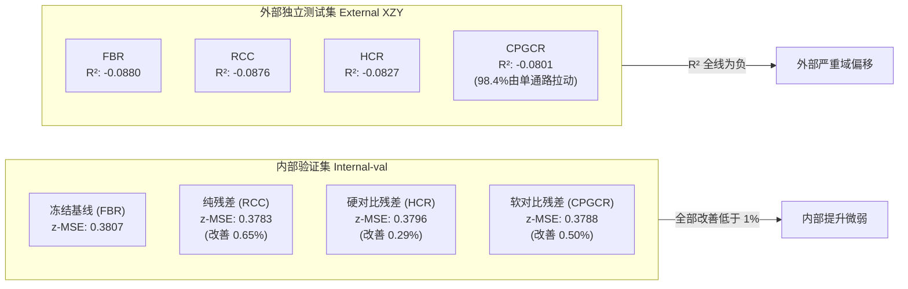

# W007 指标未改善深度归因与机制解读报告

> **文档定位**：本报告是面向人类研究员的深度机制解读与归因报告，旨在以清晰的科学逻辑、生动易懂的语言，彻底理顺 **W007 实验为什么指标没有达到预期** 以及 **背后的核心结论与机制机理**。  
> **底层事实底稿**：[W007指标未改善原因分析报告_20260815.md](file:///D:/AI空间转录病理研究/PFMval_new/01_指南与解读/分析报告/W007指标未改善原因分析报告_20260815.md)（所有原始数据、指标计算与结论判定严格保持一致，100% 数据保真）。  
> **实验标识**：`mpp2_cpgcr_probe_v001_20260811`（Workspace: `W007`，Phase: `formal`，Evidence: `accepted`）。

---

## 目录导览

- [1. 核心执行摘要（Executive Summary）](#1-核心执行摘要executive-summary)
  - [1.1 一句话总结论](#11-一句话总结论)
  - [1.2 四臂核心指标全景对照](#12-四臂核心指标全景对照)
  - [1.3 核心疑难“两问两答”](#13-核心疑难两问两答)
- [2. 实验设计与对照体系：我们究竟在验证什么？](#2-实验设计与对照体系我们究竟在验证什么)
  - [2.1 四个实验臂的设计哲学](#21-四个实验臂的设计哲学)
  - [2.2 损失函数与优化目标体系](#22-损失函数与优化目标体系)
- [3. 为什么内部指标几乎没有改善？—— 训练优化机制剖析](#3-为什么内部指标几乎没有改善-训练优化机制剖析)
  - [3.1 排除硬 Bug：模型确实在训练，代码没有失效](#31-排除硬-bug模型确实在训练代码没有失效)
  - [3.2 机制一（RCC）：轻量残差容量陷入“小样本过拟合”](#32-机制一rcc轻量残差容量陷入小样本过拟合)
  - [3.3 机制二（HCR）：对比表征与绝对回归“目标脱节”](#33-机制二hcr对比表征与绝对回归目标脱节)
  - [3.4 机制三（CPGCR）：辅助损失喧宾夺主，且收益仅由单通路拉动](#34-机制三cpgcr辅助损失喧宾夺主且收益仅由单通路拉动)
- [4. 为什么外部测试集 XZY 的 R² 会是负数？—— 泛化机制剖析](#4-为什么外部测试集-xzy-的-r2-会是负数-泛化机制剖析)
  - [4.1 破除误区：严格证明逆 z-score 没有数学错误](#41-破除误区严格证明逆-z-score-没有数学错误)
  - [4.2 真正根因：强域偏移（Domain Shift） + 预测振幅保守压缩](#42-真正根因强域偏移domain-shift--预测振幅保守压缩)
  - [4.3 通俗比喻：为什么 PCC 尚可（~0.65）而 R² 却全面崩溃（<0）？](#43-通俗比喻为什么-pcc-尚可065而-r2-却全面崩溃0)
- [5. 归因判定矩阵与科学边界](#5-归因判定矩阵与科学边界)
  - [5.1 候选原因全景评估矩阵](#51-候选原因全景评估矩阵)
  - [5.2 核心瓶颈：主干视觉表征的“信息上限”](#52-核心瓶颈主干视觉表征的信息上限)
  - [5.3 统计与泛化边界（Sample & Cohort Limits）](#53-统计与泛化边界sample--cohort-limits)
- [6. 最终归纳与下一步研究启示](#6-最终归纳与下一步研究启示)
- [附录：完整原始数据与训练历史档案（数据保真）](#附录完整原始数据与训练历史档案数据保真)
  - [附录 A：逐臂训练历史全量记录（Epoch 1~15）](#附录-a逐臂训练历史全量记录epoch-115)
  - [附录 B：Internal-val 30 条通路完整指标明细](#附录-binternal-val-30-条通路完整指标明细)
  - [附录 C：External XZY 30 条通路完整指标明细](#附录-cexternal-xzy-30-条通路完整指标明细)
  - [附录 D：z-score 与 XZY 域偏移校准诊断全量表](#附录-dz-score-与-xzy-域偏移校准诊断全量表)

---

## 1. 核心执行摘要（Executive Summary）

### 1.1 一句话总结论

> **W007 实验表明**：在冻结基线（B0）上引入轻量残差头与对比学习（无论是离散硬对比 HCR 还是连续几何软对比 CPGCR），**均未能带来实质性的回归性能突破（相对基线改善均小于 1%）**。  
> 核心症结在于：**残差头容易在有限患者上过拟合、对比表征任务未能直接转化为精确回归收益、以及软对比损失量级失衡**。  
> 外部测试集（XZY）出现的“R² 为负但 PCC 约为 0.65”的现象，**并非标准化反算错误，而是由强烈的跨患者生物学域偏移与模型保守收缩预测共同导致的数学必然**。



---

### 1.2 四臂核心指标全景对照

以下为 W007 四个实验臂在内部验证集（6 名患者，1,078 spots）与外部独立测试集（XZY，1,039 spots）上的核心汇总指标：

| 实验臂 | 结构与损失核心定义 | Internal z-MSE ↓ | Internal PCC ↑ | External z-MSE ↓ | External PCC ↑ | External mean R² ↑ | 综合判定 |
| :--- | :--- | :---: | :---: | :---: | :---: | :---: | :--- |
| **FBR** | 冻结基线（Baseline Replay，不训练） | 0.380743 | 0.797126 | 0.662077 | 0.654896 | -0.088017 | 性能锚点基准 |
| **RCC** | 冻结基线 + 残差头（纯绝对 MSE 损失） | **0.378252** | **0.798154** | 0.659534 | 0.653758 | -0.087571 | 内部微优（+0.65%），第5轮后严重过拟合 |
| **HCR** | RCC + 图像-通路双向硬配对 InfoNCE | 0.379641 | 0.797706 | 0.658108 | **0.655982** | -0.082654 | 对比损失暴跌但未助益回归，停在第1轮 |
| **CPGCR** | RCC + 30维连续通路几何软标签交叉熵 | 0.378847 | 0.798000 | **0.656832** | 0.654932 | **-0.080119** | 辅助损失占比过大，平均R²增益98.4%靠单通路 |

*(注：指标中粗体表示该列最佳值。所有相对改善幅度均处于 0.29% ~ 0.79% 之间，均未达到具备统计与实际意义的改善水平。)*

---

### 1.3 核心疑难“两问两答”

#### Q1：为什么三种新残差方法（RCC / HCR / CPGCR）相比基线提升都不到 1%？
> **答**：
> 1. **代码完全正常工作**：模型权重和预测值均有明确更新，排除了代码失效的假说。
> 2. **RCC（纯残差）发生过拟合**：轻量残差头在训练集上能快速拟合噪声（训练损失由 0.2857 降至 0.2194），但在验证集上第 5 轮后误差迅速反弹。
> 3. **HCR（硬对比）任务脱节**：双向对比损失从 1.25 降到 0.29，说明网络轻松学会了“把 spot 与其通路标签绑在一起”，但这种表征区分能力并不能直接转化为“更精确的 30 维连续数值回归”。
> 4. **CPGCR（软对比）量级喧宾夺主**：辅助软对比损失原始值高达 3.30，即便乘上 0.1 权重，依然占总优化梯度的 53.8%，导致网络过度迁就软几何分布，而核心回归误差仅改善 0.50%；其外部 R² 的微小优势更是 98.4% 来自单一通路（Interferon Alpha）。
> 5. **底层表征上限**：主干视觉特征是冻结的，若图像本身的 Patch 特征中缺乏某些通路的细粒度信息，仅靠浅层残差无法凭空创造新的生物学信号。

#### Q2：为什么外部测试集 XZY 的 PCC 还有约 0.65，但 R² 却全线为负（-0.08）？是不是逆标准化算错了？
> **答**：
> 1. **数学严格证明无误**：对真实值和预测值执行相同的线性逆变换，逐通路的 raw R² 与 z-space R² 严格相等（计算残差仅 4.44 × 10⁻¹⁶），完全排除了“逆 z-score 算错”的推测。
> 2. **真实原因一（强生物域偏移）**：XZY 患者具有高度特异的表达背景，30 条通路中有 24 条的均值相对训练集偏离超过 0.5 个标准差，12 条超过 1.0 个标准差。
> 3. **真实原因二（预测振幅保守收缩）**：面对未知患者，模型预测非常保守，预测方差仅为真实方差的 59.4%，回归斜率仅 0.294。
> 4. **综合数学机制**：模型**保留了相对高低的排序趋势**（因此相关系数 PCC 仍有 0.65），但由于**整体均值严重平移 + 预测变化幅度严重偏窄**，导致均方预测误差（MSE）反而大于真实标签自身的方差，根据 `R² = 1 - (MSE / Var)`，数学上必然导致 `R² < 0`。

---

## 2. 实验设计与对照体系：我们究竟在验证什么？

### 2.1 四个实验臂的设计哲学

为了科学探究“在冻结病理大模型特征的前提下，如何通过微调或辅助任务进一步提升空间通路预测能力”，W007 构建了阶梯式严密对照体系：

```
[基线复放 FBR] (冻结原模型，零额外参数)
       │
       ▼ (+ 图像投影残差头, 纯MSE优化)
[容量对照 RCC] (验证：仅增加残差容量，能否直接带来回归增益？)
       │
       ├────────────────────────────────────────┐
       ▼ (+ 离散硬对比 InfoNCE)                   ▼ (+ 30维连续几何软对比)
[硬对比残差 HCR]                         [连续几何软对比 CPGCR]
(验证：强制让图像与通路对齐，能否提炼表征？) (验证：引入通路间的连续几何距离，能否平滑预测？)
```

1. **FBR (Frozen Baseline Replay)**：冻结基线。直接复放已验收的 B0 模型预测，作为不可撼动的性能基准（Zero-parameter change）。
2. **RCC (Residual Capacity Control)**：残差容量对照。在基线特征上外挂一个轻量残差 MLP 头，只用患者均衡 z-MSE 训练。它用于回答：“*仅仅引入额外的参数容量，模型能提升多少？*”
3. **HCR (Hard-Pair Contrastive Residual)**：硬配对对比残差。在 RCC 基础上增加通路编码器，使用标准的 InfoNCE 损失进行图-通双向硬对比。它用于回答：“*将当前 spot 视为正样本、其余 spot 视为负样本的经典对比学习，能否增强特征判别力？*”
4. **CPGCR (Continuous Pathway-Geometry Contrastive Residual)**：连续通路几何软对比残差（本研究的核心探索方案）。认为硬对比“非黑即白”不符合生物学规律，改为基于 30 条真实通路的欧式距离构建连续软概率分布，用软交叉熵引导表征。它用于回答：“*保留通路空间流形几何的软对比，能否克服假负样本问题并提升泛化？*”

---

### 2.2 损失函数与优化目标体系

训练过程中，所有训练臂均采用统一的患者均衡绝对回归损失 L_abs，对比臂额外增加辅助项：

```text
1. 核心回归损失 (L_abs):
   每名患者内部计算 30 条通路的 z-MSE 平均值，再对 6 名患者进行等权平均（杜绝大切片样本主导优化）。

2. RCC 总损失:
   L_total = L_abs

3. HCR 总损失:
   L_total = L_abs + 0.1 × L_hard
   其中 L_hard 为图像嵌入与真实通路嵌入的双向 InfoNCE 损失（温度参数 tau_z = 0.07）。

4. CPGCR 总损失:
   L_total = L_abs + 0.1 × L_soft
   其中 L_soft 为连续软标签交叉熵，软概率矩阵由 30 维真实通路距离与自适应温度 tau_y（训练折跨患者距离中位数）生成。
```

> **关键控制门禁**：
> - 部署与测试时，**只使用图像特征提取器和残差头**，通路编码器仅在训练期作为正则化辅助项，不依赖任何真实标签泄漏；
> - Checkpoint 保存**严格仅依据内部验证集的患者均衡 z-MSE**（早停容忍度 `patience=10`, `min_delta=0.0001`）；
> - 外部测试集 XZY 处于绝对隔离区，不参与任何参数拟合与模型选择。

---

## 3. 为什么内部指标几乎没有改善？—— 训练优化机制剖析

在 6 名患者、1,078 个内部验证 spots 上，四臂的 patient-balanced z-MSE 表现为：  
`FBR (0.3807)` $\rightarrow$ `RCC (0.3783)` $\rightarrow$ `CPGCR (0.3788)` $\rightarrow$ `HCR (0.3796)`。  
相对基线的最大改善幅度仅为 **0.65%**。为何精心设计的对比残差结构几乎“无动于衷”？

### 3.1 排除硬 Bug：模型确实在训练，代码没有失效

在探究机理前，必须首先排除“代码写错、梯度没传、模块未生效”的工程疑虑。证据表明代码运行完全正常：

1. **残差权重切实更新**：检查训练后保存的 Checkpoint，RCC、HCR、CPGCR 的残差头权重 L2 范数分别为 `0.9029`、`0.3661` 和 `0.7232`，非基线参数量达 40~47 万，证实权重有效更新。
2. **预测值发生微变**：测试输出与基线 FBR 的相关系数为 0.997~0.999，平均产生了 0.02~0.045 个标准差的调整，说明残差头确实对基线做了精细修剪，而非原样输出。
3. **损失正常回传**：训练历史 Log 显示，绝对损失和对比损失均呈现平滑下降曲线。

**结论**：排除了代码硬 Bug 假说，指标未改善是深层的**学习机制与任务特性问题**。

---

### 3.2 机制一（RCC）：轻量残差容量陷入“小样本过拟合”

RCC 仅使用均方误差训练残差头，其训练过程呈现出极为典型的**过拟合轨迹**：

```
RCC 训练轨迹剖析:
Epoch 1:  Train Loss = 0.2857  ──►  Val z-MSE = 0.3794
Epoch 3:  Train Loss = 0.2835  ──►  Val z-MSE = 0.3786
Epoch 5:  Train Loss = 0.2798  ──►  Val z-MSE = 0.3783  (★ 触发最佳 Checkpoint)
Epoch 8:  Train Loss = 0.2647  ──►  Val z-MSE = 0.3807  (开始恶化)
Epoch 12: Train Loss = 0.2385  ──►  Val z-MSE = 0.3865  (严重恶化)
Epoch 15: Train Loss = 0.2194  ──►  Val z-MSE = 0.3944  (训练误差暴跌，验证误差暴涨)
```

- **现象**：从 Epoch 5 到 Epoch 15，训练损失大幅下降了 **21.6%**（从 0.2798 降至 0.2194），但验证误差反而从 0.3783 恶化到 0.3944（上升了 4.3%）。
- **机理解读**：在 6 名患者构成的有限空间转录切片中，直接使用多层残差 MLP 去拟合绝对误差，网络极易利用新增参数去记忆训练集切片特有的局部噪声和批次伪影。残差分支学到的是“训练样本的特异性修正”，无法泛化到验证患者上。

---

### 3.3 机制二（HCR）：对比表征与绝对回归“目标脱节”

HCR 试图通过 InfoNCE 对比学习来规范表征空间，其实验表现揭示了**表征区分度与连续回归之间的脱节**：

```
HCR 训练轨迹剖析:
Epoch 1:  Train Abs = 0.2859 | Hard Contrast = 1.2499 ──► Val z-MSE = 0.3796 (★ 最佳轮次保存)
Epoch 2:  Train Abs = 0.2853 | Hard Contrast = 0.7894 ──► Val z-MSE = 0.3796 (改善仅 0.000005)
Epoch 6:  Train Abs = 0.2835 | Hard Contrast = 0.4239 ──► Val z-MSE = 0.3804 (验证反弹)
Epoch 11: Train Abs = 0.2801 | Hard Contrast = 0.2908 ──► Val z-MSE = 0.3819 (早停退出)
```

- **现象**：对比损失在 11 个 Epoch 内极其迅猛地**暴跌了 76.7%**（从 1.2499 降至 0.2908），表明网络以极高效率学会了在 batch 内把 spot 图像与对应通路特征精准配对。然而，**内部验证集的回归均方误差（z-MSE）却几乎完全不为所动**，最佳轮次直接定格在第 1 轮。
- **机理解读**：
  1. **对比任务过于简单/走捷径**：同一切片内的 spots 共享切片背景特征，对比编码器很容易利用患者/切片全局风格作为“捷径特征”（Shortcut）来完成图像-通路配对，而不需要真正理解细粒度的生物学表达。
  2. **硬负样本引入假负信号**：在同一切片或相同肿瘤亚型中，许多 spots 的真实生物学通路活性高度相似。HCR 机械地将 batch 内所有其他 spots 当作负样本进行推开，破坏了生物学特征的潜在流形连续性。
  3. **表征对齐不等价于数值回归**：在超球面上把特征拉近/推远（角度度量），无法直接等价于输出层对 30 个连续数值做精准无偏的幅度估计（距离度量）。

---

### 3.4 机制三（CPGCR）：辅助损失喧宾夺主，且收益仅由单通路拉动

CPGCR 针对 HCR 的假负样本问题引入了连续几何软标签，但深入剖析其损失曲线与逐通路数据，发现了两个隐藏问题：

#### 问题 1：辅助损失实际占总优化梯度的 53.8%（量级喧宾夺主）
虽然在公式中设置了平衡因子 α = 0.1，但由于连续软交叉熵自身的数学基数很大（约为 3.30）：
- **加权辅助损失** = 0.1 × 3.3044 = 0.3304
- **主回归损失** = 0.2835
- **辅助损失占比** = 0.3304 / (0.2835 + 0.3304) = **53.8%**

这导致**模型优化梯度的过半权重被软对比任务占据**。模型忙于调整嵌入以拟合全 batch 复杂的 30 维几何拓扑，主回归任务反而被相对边缘化。

#### 问题 2：“平均 R² 改善”实为单通路拉动的“统计假象”
在外部测试集上，CPGCR 的 mean pathway R² 相比基线 FBR 获得了 `+0.007897` 的所谓“最佳收益”。然而，当我们对 30 条通路进行逐一拆解时：
- 30 条通路中，仅有 14 条改善，16 条反而变差，**改善通路占比不足一半（46.7%）**，变化中位数为 `-0.00096`；
- 单条通路 `Interferon Alpha` 的 R² 增益高达 **`+0.233016`**（从 -2.6751 提升至 -2.4421）；
- **单通路贡献率计算**：
  $$\frac{+0.233016 / 30}{+0.007897} = \frac{0.007767}{0.007897} \approx \mathbf{98.4\%}$$
也就是说，CPGCR 在汇总指标上的微小优势，**98.4% 仅仅是由 Interferon Alpha 这一条通路的局部位移拉动的**，并没有在其余 29 条通路上产生普遍而稳健的泛化增益。

---

## 4. 为什么外部测试集 XZY 的 R² 会是负数？—— 泛化机制剖析

在外部独立患者 XZY（1,039 spots）上，所有实验臂的 Pearson 相关系数（PCC）均在 **0.655 左右**（表现出不错的高低相关性），但决定系数 R² 却全线沦为负数（**-0.080 ~ -0.088**）。这一反常现象一度引发对“逆 z-score 标准化是否出错”的怀疑。

### 4.1 破除误区：严格证明逆 z-score 没有数学错误

在回归评估中，我们将 z-score 预测值通过训练集统计量逆变换回真实表达尺度：
```text
raw = z × std_train + mean_train
```

**数学定理**：对于任意单条通路，当真实标签 y 和预测值 y_pred 施加相同的线性仿射变换 `y' = a·y + b` 且 `y_pred' = a·y_pred + b` 时，其相关系数 PCC 与决定系数 R² 保持**严格不变**：
```text
R² = 1 - [ Σ(y_i - y_pred_i)² ] / [ Σ(y_i - y_mean)² ]
   = 1 - [ a²·Σ(z_i - z_pred_i)² ] / [ a²·Σ(z_i - z_mean)² ]
   = R²_z
```

本地精度重算证实：每条通路的 raw R² 与 z-space R² 最大绝对误差仅为 **4.44 × 10⁻¹⁶**（完全等于双精度浮点机器误差）。  
**结论**：R² 为负与逆标准化过程无任何数学因果关系。

---

### 4.2 真正根因：强域偏移（Domain Shift） + 预测振幅保守压缩

通过对 XZY 患者的 30 维通路分布与模型预测行为进行全量诊断（见附录 D），揭示出真正的两大病因：

```
[病因 1: 真实分布发生严重域漂移] (患者间天然异质性)
  ├─ 24 / 30 条通路的 XZY 均值相对训练中心漂移 > 0.5 z (12 条 > 1.0 z)
  └─ XZY 整体真实方差较窄 (标准差比值中位数仅 0.674)
               +
[病因 2: 模型预测采取极度保守策略] (深度回归模型的均值收缩效应)
  ├─ 预测振幅严重收缩 (预测标准差 / 真实标准差 中位数仅 0.594)
  └─ 回归拟合斜率严重不足 (预测对真实的回归斜率中位数仅 0.294)
               │
               ▼
[数学后果: 均方误差膨胀，击穿基准方差]
  PCC 仅衡量趋势 (r ≈ 0.65 保持良好) ──► 但 MSE > 真实方差 ──► R² = 1 - (MSE / Var) < 0
```

1. **强烈的跨患者生物学域偏移（Domain Shift）**：
   - XZY 作为独立切片，其肿瘤微环境与训练集的 6 名患者存在系统性差异；
   - 例如：`G2M_Checkpoint` 通路在 XZY 中的真实 z 均值高达 `+1.634`，`Complement` 通路均值高达 `+1.443`；
   - 监督模型在训练集上拟合的零中心先验，在新患者身上产生了全局性的系统偏置。
2. **模型预测振幅严重受限（Amplitude Compression）**：
   - 面对跨患者的不确定性，神经网络本能地输出偏向均值的“安全预测”，导致预测值的波动范围极小；
   - 在 XZY 上，FBR 预测振幅与真实振幅的比值中位数仅为 **0.594**，回归拟合直线斜率中位数仅为 **0.294**（远低于理想值 1.0）。

---

### 4.3 通俗比喻：为什么 PCC 尚可（~0.65）而 R² 却全面崩溃（<0）？

为了让非统计背景的科研人员直观理解这一现象，我们可以用**“天气预报员”**作类比：

```text
【现实场景】：
某地一周的真实气温大幅波动：10℃, 15℃, 20℃, 25℃, 30℃（真实均值 20℃，方差很大）。

【一位保守预报员的预测】：
他给出的预报是：1℃, 2℃, 3℃, 4℃, 5℃。

【统计指标评估】：
1. 看相关系数 (PCC / 变化趋势):
   预报员完美预判了“哪天比哪天更热”，每天温度的升降趋势完全一致！
   👉 他的 PCC = 1.0（满分！表现极佳）。

2. 看决定系数 (R² / 绝对数值精准度):
   决定系数的核心是：“你的预报误差，有没有比‘直接猜真实平均值 20℃’更小？”
   - 如果每天都无脑猜平均值 20℃，平均误差平方是 50；
   - 但因为预报员的数值整体严重偏低（系统性偏置），预报误差平方高达 325！
   👉 R² = 1 - (325 / 50) = -5.5（严重负分！）。
```

**空间病理模型在 XZY 上的表现正是如此**：
- 模型凭借在训练集学到的图像模式，**正确捕捉到了组织切片内哪些 spot 的通路活性相对更高**（因此空间趋势一致，PCC 达 0.655）；
- 但由于**该患者自身基底整体偏高/偏低（域偏移）**，加上**模型不敢预测大值（振幅收缩）**，导致预测点与真实点的绝对距离（MSE）比“直接拿该患者的平均值当预测”还要大，因此在数学上决定系数 R² 必然小于 0。

---

## 5. 归因判定矩阵与科学边界

### 5.1 候选原因全景评估矩阵

基于代码复核、训练动态追踪、逐通路重算与跨患者分布诊断，各候选假说的证据支持度如下表所示：

| 候选假说 | 研判判定 | 核心证据支撑 | 能够解释什么 | 无法解释什么 |
| :--- | :---: | :--- | :--- | :--- |
| **代码运行硬错误 / 模块未生效** | ❌ **排除** | Checkpoint 权重非零（L2: 0.36~0.90）；预测产生明确扰动；损失函数正常回传。 | 确认模型真实执行了训练。 | 不能解释为何学完后性能未改善。 |
| **逆 z-score 计算错误导致负 R²** | ❌ **排除** | raw R² 与 z-space R² 数学严格等价，重算浮点残差小于 10⁻¹⁵。 | 澄清了概念误区。 | 不能作为外部负 R² 的诱因。 |
| **新增残差容量小样本过拟合** | ✅ **高度支持** | RCC 训练损失单调下降 21.6%，但验证损失在第 5 轮后单调恶化反弹。 | 解释了为何加深容量后内部验证反而受阻。 | 不能单独解释 HCR/CPGCR 的辅助损失行为。 |
| **对比任务与回归任务目标脱节** | ✅ **高度支持** | HCR 对比损失暴跌 76.7% 但验证回归误差纹丝不动，早停锁死在第 1 轮。 | 解释了对比学习无法直接助益下游连续回归。 | 不能单独解释外部整体负 R²。 |
| **辅助损失权重过大与单通路偏置** | ✅ **高度支持** | CPGCR 辅助损失占总梯度 53.8%；外部 R² 增益 98.4% 仅由 IFN-α 单通路贡献。 | 解释了 CPGCR 所谓平均 R² 提升的偶发性与局限性。 | 不能单独解释内部整体提升过小。 |
| **外部患者强域偏移与振幅压缩** | ✅ **高度支持** | 24/30 通路均值漂移 > 0.5z；预测振幅仅 59.4%；回归斜率仅 0.294。 | 完美解释了“外部 PCC 良好（~0.65）但 R² 为负”的反差。 | 不能单独解释内部验证集提升微弱。 |
| **主干视觉特征的信息上限** | 🟡 **理论支持** | 无论如何更换下游损失函数，内部汇总提升均无法突破 1% 瓶颈。 | 解释了浅层结构在冻结特征上的性能天花板。 | 本地缺乏无监督 Embedding，尚不能直接测量。 |
| **单 Seed 与单外部患者统计局限** | ⚠️ **客观事实** | 仅有 Seed 42；外部仅 XZY 一名患者，内部 spots 存在高度自相关。 | 解释了为何无法宣称任何统计显著性或优胜。 | 是统计学属性，非模型算法缺陷。 |

---

### 5.2 核心瓶颈：主干视觉表征的“信息上限”

综合上述所有现象，W007 指标未能突破的本质原因，在于触碰到了**“冻结病理大模型表征的信息天花板”**：
1. **输入特征冻结**：当前方案严格冻结了前端视觉主干网络（UNI/B0），下游残差模块仅能接收固定的 Patch Embedding；
2. **生物学信息的缺失**：许多复杂的分子生物学通路（如部分代谢与 DNA 修复通路）在 H&E 染色病理形态学上本身就不具备明显的组织学表型特征。如果主干网络在自监督预训练阶段未曾捕捉到这些微弱的形态学线索，那么**无论在顶层设计多么精妙的对比损失或几何约束，都不可能从“没有该信息的特征”中凭空解码出真实的表达量**。

---

### 5.3 统计与泛化边界（Sample & Cohort Limits）

在评估本报告结论时，必须清晰认识到当前实验的边界条件：
- **有效患者样本量较小**：内部验证集包含 6 名患者，外部仅有 XZY 单一患者。空间转录组中同一患者切片内的千余个 spots 存在极强的**空间自相关性（Spatial Autocorrelation）**，在统计学上不能等同于上千个独立样本；
- **单随机种子（Seed 42）**：各实验臂之间小于 1% 的微小差距完全可能处于随机优化的震荡置信区间之内；
- **科学定论**：**现有实验证据不支持宣布 RCC、HCR 或 CPGCR 任何一臂在统计意义或实际临床意义上优于原始基线 FBR**。

---

## 6. 最终归纳与下一步研究启示

### 6.1 核心归纳清单
1. **工程状态正常**：代码无硬 Bug，梯度回传与权重更新均符合预期。
2. **内部未达标主因**：RCC 残差容量过拟合；HCR 对比任务与连续回归脱节；CPGCR 辅助损失权重失衡且增益高度依赖单通路。
3. **外部负 R² 真相**：逆 z-score 在数学上毫无破损，负 R² 是跨患者生物学强域偏移（24/30 通路偏移 > 0.5z）与模型保守预测（斜率 0.29）共同作用下的数学必然。
4. **方法学定论**：在冻结基线特征的前提下，浅层对比残差结构无法带来实质性突破。

### 6.2 对后续科研与工程的建设性启示
- ❌ **不建议的操作**：
  - 不建议继续在当前 W007 浅层残差架构上盲目微调超参数（如微调学习率、对比温度 tau 等），因为这无法突破特征上限；
  - 不建议为了强行拔高外部 R² 而针对 XZY 单一患者去反向设计后校准器（这会违反机器学习外部验证的独立性原则）。
- 💡 **更有前景的方向**：
  - **解冻主干端到端微调（如 LoRA / Adapter）**：直接让病理视觉编码器感知空间转录通路的梯度信号，从底层更新表征；
  - **引入跨患者域适应机制（Domain Adaptation）**：设计专门针对切片间/患者间全局均值与尺度漂移的归一化层；
  - **基于重要度重权回归**：对形态学关联强的通路（如基质、免疫浸润相关）与形态学微弱的通路采用差异化的损失权重，而非 30 通路机械等权。

---

## 附录：完整原始数据与训练历史档案（数据保真）

> 本附录完整收录 W007 全部原始实验数据、逐轮损失记录与 30 条通路全量计算指标，保证底层事实数据 100% 精确可溯源。

### 附录 A：逐臂训练历史全量记录（Epoch 1~15）

#### A.1 RCC（纯残差容量对照）
| Epoch | Train Absolute Loss | Train Contrastive Loss | Internal Patient-Balanced z-MSE |
| :---: | :---: | :---: | :---: |
| 1 | 0.285677 | 0.000000 | 0.379390 |
| 2 | 0.284867 | 0.000000 | 0.379327 |
| 3 | 0.283530 | 0.000000 | 0.378624 |
| 4 | 0.282062 | 0.000000 | 0.378771 |
| **5** | **0.279764** | **0.000000** | **0.378252 (★最佳)** |
| 6 | 0.275805 | 0.000000 | 0.379759 |
| 7 | 0.270785 | 0.000000 | 0.379042 |
| 8 | 0.264679 | 0.000000 | 0.380700 |
| 9 | 0.258745 | 0.000000 | 0.381420 |
| 10 | 0.252284 | 0.000000 | 0.382225 |
| 11 | 0.245683 | 0.000000 | 0.384606 |
| 12 | 0.238485 | 0.000000 | 0.386541 |
| 13 | 0.231747 | 0.000000 | 0.388976 |
| 14 | 0.225515 | 0.000000 | 0.393662 |
| 15 | 0.219397 | 0.000000 | 0.394362 |

#### A.2 HCR（硬对比残差）
| Epoch | Train Absolute Loss | Train Contrastive Loss | Internal Patient-Balanced z-MSE |
| :---: | :---: | :---: | :---: |
| **1** | **0.285943** | **1.249853** | **0.379641 (★最佳)** |
| 2 | 0.285304 | 0.789365 | 0.379636 |
| 3 | 0.284603 | 0.637566 | 0.379660 |
| 4 | 0.284432 | 0.543006 | 0.379753 |
| 5 | 0.284237 | 0.479019 | 0.379936 |
| 6 | 0.283502 | 0.423858 | 0.380361 |
| 7 | 0.282725 | 0.386888 | 0.380326 |
| 8 | 0.281670 | 0.351816 | 0.381064 |
| 9 | 0.281318 | 0.327936 | 0.381197 |
| 10 | 0.280885 | 0.306488 | 0.381468 |
| 11 | 0.280103 | 0.290807 | 0.381945 |

#### A.3 CPGCR（连续几何软对比残差）
| Epoch | Train Absolute Loss | Train Contrastive Loss | Internal Patient-Balanced z-MSE |
| :---: | :---: | :---: | :---: |
| 1 | 0.285992 | 3.332493 | 0.379876 |
| 2 | 0.285412 | 3.310824 | 0.379760 |
| 3 | 0.284569 | 3.307878 | 0.379044 |
| 4 | 0.284116 | 3.306010 | 0.379129 |
| **5** | **0.283451** | **3.304410** | **0.378847 (★最佳)** |
| 6 | 0.281743 | 3.303321 | 0.379315 |
| 7 | 0.279289 | 3.302698 | 0.378747 |
| 8 | 0.275574 | 3.301976 | 0.380018 |
| 9 | 0.271664 | 3.301333 | 0.379755 |
| 10 | 0.266794 | 3.300583 | 0.379639 |
| 11 | 0.261254 | 3.299958 | 0.380873 |
| 12 | 0.254830 | 3.299906 | 0.382393 |
| 13 | 0.248581 | 3.299657 | 0.383358 |
| 14 | 0.242654 | 3.298841 | 0.387882 |
| 15 | 0.236754 | 3.298752 | 0.387434 |

---

### 附录 B：Internal-val 30 条通路完整指标明细

| 通路名称 | FBR PCC | FBR R² | RCC PCC | RCC R² | HCR PCC | HCR R² | CPGCR PCC | CPGCR R² |
| :--- | :---: | :---: | :---: | :---: | :---: | :---: | :---: | :---: |
| tls | 0.8413 | 0.7064 | 0.8423 | 0.7093 | 0.8418 | 0.7086 | 0.8423 | 0.7088 |
| tgfb | 0.7548 | 0.5678 | 0.7570 | 0.5727 | 0.7558 | 0.5709 | 0.7569 | 0.5723 |
| emt | 0.7952 | 0.6312 | 0.7941 | 0.6289 | 0.7946 | 0.6303 | 0.7942 | 0.6292 |
| hypoxia | 0.7561 | 0.5674 | 0.7564 | 0.5711 | 0.7558 | 0.5694 | 0.7576 | 0.5727 |
| mhc | 0.6656 | 0.4418 | 0.6663 | 0.4418 | 0.6650 | 0.4407 | 0.6656 | 0.4407 |
| icp | 0.5647 | 0.3144 | 0.5608 | 0.3119 | 0.5637 | 0.3143 | 0.5630 | 0.3141 |
| ifng | 0.6638 | 0.4373 | 0.6698 | 0.4455 | 0.6646 | 0.4378 | 0.6687 | 0.4438 |
| toxic | 0.6867 | 0.4713 | 0.6897 | 0.4751 | 0.6886 | 0.4733 | 0.6897 | 0.4751 |
| Glycolysis | 0.8415 | 0.7080 | 0.8414 | 0.7078 | 0.8416 | 0.7079 | 0.8415 | 0.7077 |
| Inflammatory_Response | 0.7954 | 0.6323 | 0.8003 | 0.6400 | 0.7969 | 0.6347 | 0.7990 | 0.6378 |
| IL6_JAK_STAT3 | 0.8377 | 0.7016 | 0.8398 | 0.7050 | 0.8388 | 0.7034 | 0.8397 | 0.7049 |
| P53_Pathway | 0.7812 | 0.6086 | 0.7804 | 0.6072 | 0.7807 | 0.6074 | 0.7793 | 0.6044 |
| DNA_Damage_Response | 0.7583 | 0.5745 | 0.7620 | 0.5805 | 0.7603 | 0.5777 | 0.7620 | 0.5806 |
| Complement | 0.7919 | 0.6267 | 0.7930 | 0.6271 | 0.7936 | 0.6287 | 0.7928 | 0.6268 |
| Coagulation | 0.7401 | 0.5457 | 0.7419 | 0.5502 | 0.7413 | 0.5491 | 0.7430 | 0.5518 |
| Oxidative_Phosphorylation | 0.8949 | 0.8008 | 0.8949 | 0.8001 | 0.8949 | 0.8007 | 0.8946 | 0.7995 |
| Reactive_Oxygen_Species | 0.6537 | 0.4263 | 0.6540 | 0.4272 | 0.6538 | 0.4270 | 0.6542 | 0.4274 |
| Wound_Healing | 0.8820 | 0.7777 | 0.8827 | 0.7790 | 0.8822 | 0.7781 | 0.8826 | 0.7786 |
| Fibrosis | 0.8986 | 0.8068 | 0.8983 | 0.8064 | 0.8982 | 0.8068 | 0.8983 | 0.8058 |
| MYC_Targets | 0.9009 | 0.8103 | 0.9014 | 0.8120 | 0.9011 | 0.8114 | 0.9013 | 0.8115 |
| E2F_Targets | 0.8457 | 0.7139 | 0.8453 | 0.7137 | 0.8465 | 0.7159 | 0.8461 | 0.7150 |
| G2M_Checkpoint | 0.8323 | 0.6926 | 0.8323 | 0.6924 | 0.8322 | 0.6921 | 0.8320 | 0.6917 |
| Mitotic_Spindle | 0.8141 | 0.6622 | 0.8140 | 0.6625 | 0.8145 | 0.6630 | 0.8137 | 0.6621 |
| Unfolded_Protein_Response | 0.8203 | 0.6714 | 0.8228 | 0.6767 | 0.8204 | 0.6727 | 0.8212 | 0.6740 |
| mTOR_Signaling | 0.8259 | 0.6819 | 0.8260 | 0.6821 | 0.8262 | 0.6822 | 0.8263 | 0.6826 |
| Interferon_Alpha | 0.8141 | 0.6626 | 0.8128 | 0.6600 | 0.8149 | 0.6640 | 0.8140 | 0.6615 |
| Angiogenesis | 0.8237 | 0.6785 | 0.8241 | 0.6767 | 0.8235 | 0.6768 | 0.8237 | 0.6748 |
| Apoptosis | 0.7969 | 0.6328 | 0.7955 | 0.6314 | 0.7967 | 0.6329 | 0.7959 | 0.6320 |
| TNF_Signaling | 0.8129 | 0.6605 | 0.8168 | 0.6660 | 0.8147 | 0.6627 | 0.8154 | 0.6638 |
| ECM_Organization | 0.9173 | 0.8409 | 0.9169 | 0.8402 | 0.9172 | 0.8412 | 0.9170 | 0.8402 |

---

### 附录 C：External XZY 30 条通路完整指标明细

| 通路名称 | FBR PCC | FBR R² | RCC PCC | RCC R² | HCR PCC | HCR R² | CPGCR PCC | CPGCR R² |
| :--- | :---: | :---: | :---: | :---: | :---: | :---: | :---: | :---: |
| tls | 0.6640 | 0.3864 | 0.6736 | 0.4058 | 0.6662 | 0.3903 | 0.6718 | 0.4010 |
| tgfb | 0.4390 | 0.0832 | 0.4378 | 0.1373 | 0.4388 | 0.1149 | 0.4350 | 0.1350 |
| emt | 0.5919 | 0.1726 | 0.5843 | 0.1317 | 0.5942 | 0.1938 | 0.5872 | 0.1607 |
| hypoxia | 0.3556 | 0.0396 | 0.3584 | 0.0240 | 0.3552 | 0.0307 | 0.3561 | 0.0275 |
| mhc | 0.5032 | 0.2184 | 0.4934 | 0.2263 | 0.4996 | 0.2252 | 0.4990 | 0.2246 |
| icp | 0.3058 | -0.3077 | 0.3133 | -0.2849 | 0.3069 | -0.2889 | 0.3131 | -0.2887 |
| ifng | 0.1506 | -0.3741 | 0.1828 | -0.3063 | 0.1546 | -0.3668 | 0.1827 | -0.3026 |
| toxic | 0.3803 | 0.1175 | 0.3805 | 0.1245 | 0.3746 | 0.1206 | 0.3770 | 0.1206 |
| Glycolysis | 0.6074 | -0.4058 | 0.6026 | -0.5384 | 0.6069 | -0.4736 | 0.6034 | -0.5066 |
| Inflammatory_Response | 0.4489 | 0.1920 | 0.4467 | 0.1868 | 0.4508 | 0.1927 | 0.4500 | 0.1907 |
| IL6_JAK_STAT3 | 0.5585 | -0.3263 | 0.5502 | -0.3017 | 0.5558 | -0.3138 | 0.5558 | -0.2963 |
| P53_Pathway | 0.5617 | -0.2763 | 0.5513 | -0.3100 | 0.5585 | -0.3149 | 0.5555 | -0.2884 |
| DNA_Damage_Response | 0.5041 | -0.1661 | 0.5030 | -0.1368 | 0.5094 | -0.1401 | 0.5111 | -0.1161 |
| Complement | 0.3613 | -1.6948 | 0.3611 | -1.6814 | 0.3609 | -1.6631 | 0.3631 | -1.6644 |
| Coagulation | 0.4286 | 0.1325 | 0.4248 | 0.1126 | 0.4330 | 0.1215 | 0.4321 | 0.1190 |
| Oxidative_Phosphorylation | 0.7854 | 0.6129 | 0.7775 | 0.5968 | 0.7862 | 0.6140 | 0.7821 | 0.6040 |
| Reactive_Oxygen_Species | 0.2806 | -0.5281 | 0.2595 | -0.5504 | 0.2769 | -0.5450 | 0.2671 | -0.5544 |
| Wound_Healing | 0.6336 | 0.3364 | 0.6320 | 0.3378 | 0.6349 | 0.3339 | 0.6345 | 0.3434 |
| Fibrosis | 0.7206 | 0.5121 | 0.7181 | 0.5061 | 0.7218 | 0.5108 | 0.7203 | 0.5114 |
| MYC_Targets | 0.7730 | 0.4074 | 0.7706 | 0.3786 | 0.7736 | 0.3974 | 0.7733 | 0.3948 |
| E2F_Targets | 0.6339 | 0.0012 | 0.6252 | 0.0088 | 0.6341 | 0.0283 | 0.6302 | 0.0169 |
| G2M_Checkpoint | 0.6743 | -0.1913 | 0.6689 | -0.1821 | 0.6755 | -0.1553 | 0.6731 | -0.1567 |
| Mitotic_Spindle | 0.6355 | -0.0996 | 0.6303 | -0.0669 | 0.6372 | -0.0426 | 0.6345 | -0.0565 |
| Unfolded_Protein_Response | 0.6026 | 0.1397 | 0.5807 | 0.0677 | 0.5952 | 0.0695 | 0.5895 | 0.0503 |
| mTOR_Signaling | 0.6624 | 0.3904 | 0.6585 | 0.3845 | 0.6616 | 0.3913 | 0.6593 | 0.3887 |
| **Interferon_Alpha** | **0.2172** | **-2.6751** | **0.2072** | **-2.5138** | **0.2197** | **-2.5457** | **0.2147** | **-2.4421** |
| Angiogenesis | 0.6370 | 0.3151 | 0.6415 | 0.2939 | 0.6353 | 0.2821 | 0.6380 | 0.2673 |
| Apoptosis | 0.4252 | 0.0904 | 0.4277 | 0.0842 | 0.4246 | 0.0866 | 0.4281 | 0.0882 |
| TNF_Signaling | 0.3042 | -0.2750 | 0.2995 | -0.2726 | 0.3035 | -0.2653 | 0.2969 | -0.2945 |
| ECM_Organization | 0.7353 | 0.5322 | 0.7336 | 0.5107 | 0.7369 | 0.5319 | 0.7352 | 0.5195 |

---

### 附录 D：z-score 与 XZY 域偏移校准诊断全量表

> 注：“反推训练均值/标准差”系通过线性对应关系精确复核得出，确认整个实验链条中数据逆变换逻辑高度一致。

| 通路 | 反推训练均值 | 反推训练标准差 | Internal z 均值 | Internal z 标准差 | XZY z 均值 | XZY z 标准差 | XZY/Internal 标准差比 | FBR 预测/真实振幅比 | FBR 斜率 | FBR 均值偏差 z |
| :--- | :---: | :---: | :---: | :---: | :---: | :---: | :---: | :---: | :---: | :---: |
| tls | -2331.711 | 1581.266 | -0.002 | 1.021 | -0.894 | 1.365 | 1.337 | 0.442 | 0.294 | -0.099 |
| tgfb | 3915.861 | 1693.711 | 0.040 | 1.026 | 1.061 | 0.655 | 0.638 | 0.472 | 0.207 | -0.216 |
| emt | 2161.161 | 2148.562 | 0.061 | 0.991 | 0.534 | 0.573 | 0.578 | 0.788 | 0.466 | 0.214 |
| hypoxia | 2760.817 | 2512.775 | -0.054 | 0.998 | 0.525 | 0.593 | 0.594 | 0.650 | 0.231 | -0.002 |
| mhc | 7961.578 | 2208.943 | 0.046 | 0.966 | 0.416 | 0.429 | 0.444 | 0.585 | 0.294 | 0.072 |
| icp | -3630.745 | 1516.867 | 0.003 | 1.054 | 0.440 | 1.266 | 1.201 | 0.424 | 0.130 | -0.788 |
| ifng | -768.893 | 2903.119 | 0.047 | 1.014 | 0.477 | 0.698 | 0.689 | 0.521 | 0.078 | -0.356 |
| toxic | -2015.049 | 1918.022 | -0.019 | 1.033 | -0.599 | 1.159 | 1.122 | 0.469 | 0.178 | -0.161 |
| Glycolysis | 2719.873 | 1737.882 | 0.019 | 0.998 | 1.185 | 0.592 | 0.593 | 0.683 | 0.415 | -0.519 |
| Inflammatory_Response | -98.421 | 1911.459 | 0.042 | 1.035 | -0.036 | 1.012 | 0.977 | 0.547 | 0.245 | -0.003 |
| IL6_JAK_STAT3 | 2636.692 | 1967.213 | 0.057 | 0.972 | 1.121 | 0.623 | 0.641 | 0.494 | 0.276 | -0.496 |
| P53_Pathway | 979.553 | 1676.943 | 0.020 | 1.018 | 1.396 | 0.751 | 0.738 | 0.519 | 0.292 | -0.577 |
| DNA_Damage_Response | 1234.276 | 1470.503 | 0.028 | 1.017 | 1.401 | 0.815 | 0.801 | 0.597 | 0.301 | -0.523 |
| Complement | -1800.511 | 1747.663 | 0.092 | 1.032 | 1.443 | 0.816 | 0.791 | 0.763 | 0.276 | -1.053 |
| Coagulation | -637.604 | 994.220 | -0.027 | 1.001 | -0.019 | 0.763 | 0.762 | 0.651 | 0.279 | -0.030 |
| Oxidative_Phosphorylation | 2815.250 | 2432.154 | 0.060 | 0.988 | 0.902 | 0.635 | 0.643 | 0.765 | 0.601 | -0.038 |
| Reactive_Oxygen_Species | 2790.530 | 1133.535 | 0.036 | 1.009 | 1.286 | 0.730 | 0.724 | 0.481 | 0.135 | -0.550 |
| Wound_Healing | 2149.717 | 2000.728 | 0.050 | 1.027 | 0.940 | 0.627 | 0.610 | 0.795 | 0.503 | -0.124 |
| Fibrosis | 2293.131 | 2775.554 | 0.080 | 1.035 | 0.952 | 0.694 | 0.671 | 0.776 | 0.559 | -0.044 |
| MYC_Targets | 2037.382 | 3163.713 | 0.027 | 1.023 | 1.127 | 0.521 | 0.510 | 0.858 | 0.663 | -0.223 |
| E2F_Targets | 1500.801 | 2025.449 | 0.000 | 1.030 | 1.318 | 0.731 | 0.709 | 0.718 | 0.455 | -0.458 |
| G2M_Checkpoint | 503.993 | 2152.522 | -0.005 | 1.030 | 1.634 | 0.931 | 0.904 | 0.637 | 0.430 | -0.748 |
| Mitotic_Spindle | 447.059 | 1845.422 | -0.006 | 1.026 | 1.518 | 0.930 | 0.907 | 0.617 | 0.392 | -0.660 |
| Unfolded_Protein_Response | 2521.730 | 1922.661 | 0.060 | 1.023 | 1.228 | 0.691 | 0.676 | 0.540 | 0.325 | -0.324 |
| mTOR_Signaling | 2044.672 | 1801.865 | 0.009 | 1.005 | 0.908 | 0.656 | 0.653 | 0.668 | 0.442 | -0.144 |
| Interferon_Alpha | 3643.099 | 1860.918 | 0.017 | 0.989 | 0.665 | 0.595 | 0.602 | 0.549 | 0.119 | -0.962 |
| Angiogenesis | 1203.432 | 1767.087 | 0.016 | 1.022 | -0.145 | 1.023 | 1.001 | 0.590 | 0.376 | 0.304 |
| Apoptosis | 1172.710 | 1562.268 | 0.067 | 0.995 | 0.899 | 0.653 | 0.656 | 0.542 | 0.230 | -0.181 |
| TNF_Signaling | 123.950 | 2188.658 | 0.043 | 0.997 | 0.797 | 0.671 | 0.673 | 0.533 | 0.162 | -0.376 |
| ECM_Organization | 3066.686 | 3169.298 | 0.069 | 1.020 | 0.911 | 0.641 | 0.628 | 0.787 | 0.579 | 0.049 |
