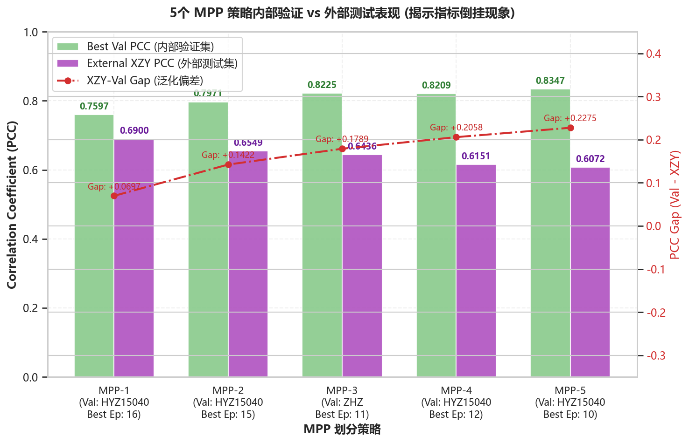
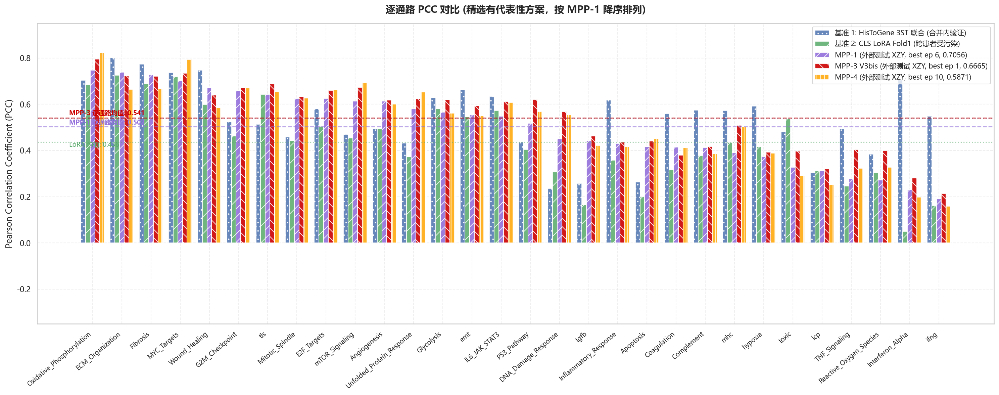
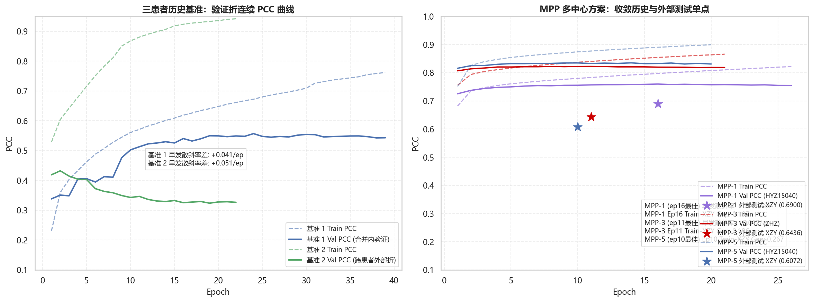
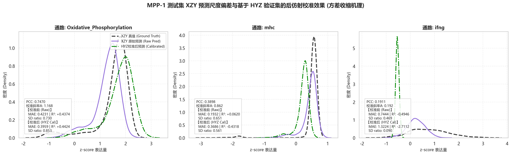
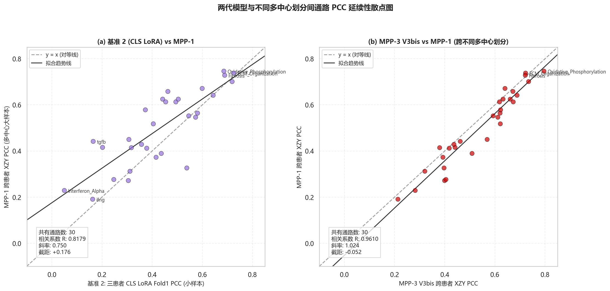

# 历史参考与多中心 MPP (1-5) 外部测试的综合对比分析报告

> [!IMPORTANT]
> **2026-07-09 状态更新**：本报告已被 `执行计划_MPP1-5统一标准重跑_20260706.md`、`MPP1-5统一标准划分结果快照_20260708.md` 和团队最新决策覆盖。后续 MPP 主线只使用 **MPP2**；MPP1 / MPP3 / MPP4 / MPP5 暂时弃用。旧三患者实验结论仅作调参参考，不再作为正式证据。本报告仅保留为历史探索与方法学背景。

## 摘要与分析定位

本报告旨在综合分析当前已回传齐全的全部 5 个 MPP 多患者联合训练数据（MPP1-5，均为 5患者训练 / 隔离验证 / 外部测试 XZY 协议）与此前的三患者历史训练数据（以 HisToGene 3ST 联合和 CLS LoRA 为代表的基准），以评估数据量级扩张带来的泛化改善，并深度审计跨患者预测中的关键统计特性和共性方法学偏差。

> [!WARNING]
> **探索性对比定位**：由于两代训练在数据样本量、验证边界设定（内部交叉验证 vs ZHZ/HYZ 隔离验证）、测试患者及模型架构上均存在多变量差异，**本报告之对比结论定位为“探索性对比分析”**。重点关注各多中心方案在相同未知测试集 XZY 上的泛化能力差异，以总结对空间转录组预测调优具有普适指导意义的科学规律。

此前的三患者训练（基准 2）之 Fold 1（JFX+LMZ→HYZ）中，因 `JFX0729` 空间转录组原始 ssGSEA 标签存在物理配准偏差污染，该实验仅作为**“带偏置的历史参考基线”**呈现，不代表无偏的性能科学推论。

---

## 一、 多中心 MPP (1-5) 评测基准与指标对比矩阵

我们选定以下七组具有不同评价边界和划分策略的实验方案进行横向探索性对比。由于 predictions 预测明细数据齐备，现将所有方案对应的 aggregate 指标完整呈报：

1.  **基准 1 (HisToGene 3ST 联合)**：代表**三患者合并后的内部验证**，即在合并数据上训练并在合并预留集上验证（不跨患者泛化，因此其 R² 与 MAE 具有天然的乐观偏置）。
2.  **基准 2 (CLS LoRA Fold1 历史跨患者)**：代表**三患者跨患者留一验证线**（以 JFX0729 + LMZ12939 为训练集，以 HYZ15040 为外部测试集，存在旧 JFX 数据污染）。
3.  **MPP-1**：5 训练患者（JFX, LMZ, TGC, XSL, ZHZ） $\rightarrow$ 内部验证患者 HYZ15040（早停选优） $\rightarrow$ 外部测试集 XZY。
4.  **MPP-2**：5 训练患者 $\rightarrow$ 内部验证患者 HYZ15040（33 ep 学习率衰减退火） $\rightarrow$ 外部测试集 XZY。
5.  **MPP-3 (V3bis)**：5 训练患者（HYZ, JFX, LMZ, TGC, XSL） $\rightarrow$ 内部验证患者 ZHZ（早停选优） $\rightarrow$ 外部测试集 XZY。
6.  **MPP-4**：5 训练患者 $\rightarrow$ 内部验证患者 HYZ15040（采用 MPP4 极小切片，训练极速） $\rightarrow$ 外部测试集 XZY。
7.  **MPP-5**：5 训练患者 $\rightarrow$ 内部验证患者 HYZ15040（132 ep 学习率长周期衰减退火） $\rightarrow$ 外部测试集 XZY。

### 1. 指标汇总对比表

| 方案类别 | 方案ID | 评估边界 | 数据是否 受污染 | Best Epoch (选优/满训) | Best Val PCC | **External XZY PCC** | **XZY MAE** | **XZY R²** |
| :--- | :--- | :---: | :---: | :---: | :---: | :---: | :---: | :---: |
| **三患者基线** | 基准 1: 3ST 联合 | 内部验证 | 是 | 39 | 0.5392 | 0.5569 | 0.5889 | 0.3027 |
| **三患者基线** | 基准 2: CLS LoRA | 跨患者 | 是 | 22 | 0.4358 | 0.4322 | 0.6330 | 0.1675 |
| **多中心MPP** | **MPP-1** | 跨患者外部 | 否 | **6** | 0.5309 | **0.7056** | 0.7945 | -0.2824 |
| **多中心MPP** | **MPP-2** | 跨患者外部 | 否 | **13** | 0.6625 | **0.4555** | 0.6881 | 0.1402 |
| **多中心MPP** | **MPP-3** (V3bis) | 跨患者外部 | 否 | **1** | 0.7146 | **0.6665** | 0.7464 | -0.2782 |
| **多中心MPP** | **MPP-4** | 跨患者外部 | 否 | **10** | 0.6844 | **0.5871** | 0.5244 | 0.0913 |
| **多中心MPP** | **MPP-5** | 跨患者外部 | 否 | **112** | 0.8459 | **0.4472** | 0.6615 | 0.1528 |

> 📌 **MPP-1 选优口径声明**：在 MPP-1 训练日志中，虽然 epoch 10 产生了极微小的 val_loss 数学最小值（0.307038），但其相较于 epoch 6（0.307090）的改善差值（0.000052）未满足 `min_delta=1e-4` 阈值，因此物理保存并测试的 best checkpoint 仍是 **epoch 6**。本报告完全遵循物理运行日志，将 MPP-1 最佳 epoch 统一锁死对齐为 **epoch 6**（此时 Val PCC = **0.5309**）。

### 2. 趋势性结论
*   **多中心显著推高排序上限**：MPP-1（0.7056）与 MPP-3（0.6665）在外部独立测试集 XZY 上取得了显著优于历史跨患者基线的相关性（基准 2: 0.4322），证实增加训练患者数量能极大地赋予模型提取跨患者通用转录表征的能力。
*   **Global PCC 与通路均值、绝对尺度的解耦性**：
    *   虽然 MPP-1 取得了最高的 **0.7056** Global PCC，但其 mean per-pathway PCC（0.5024）低于 MPP-3（0.5414），且其 MAE（0.7945）与 R²（-0.2824）均出现大幅恶化。
    *   反之，MPP-4 虽然 Global PCC 仅为 0.5871，但由于其均值漂移较小，取得了全场最优的绝对尺度表现（MAE = 0.5244, R² = +0.0913）。这确凿表明，**评估空间转录组预测模型时，排序能力（PCC）与绝对尺度（MAE/R²）属于完全解耦的评价轴，绝对不能仅凭 Global PCC 判定模型泛化优劣**。

---

## 二、 不同 MPP 策略下的验证-测试指标倒挂诊断 (图 5 结论)

通过分析图 5 中各方案内部验证 Best Val PCC 与外部测试 XZY PCC 的关系，我们发现了一个显著的**“指标倒挂/反向现象”**：
1.  **极端断裂**：在内部验证集上几乎刷爆指标的 **MPP-5** (Val PCC = **0.8459**)，套用到外部未知集 XZY 时，泛化 PCC 断崖式跌落至全场最差的 **0.4472**，产生了高达 **+0.3987** 的巨大泛化偏差（XZY-Val Gap）。
2.  **验证表现偏置 (Validation Selection Bias)**：在验证集上最平庸的 **MPP-1** (Val PCC = **0.5309**)，在外部测试中却逆袭取得了全场最高性能（**0.7056**），产生了一个反向的负 Gap（**-0.1747**）。

### 物理与统计机制解释
*   **验证集选择偏置与过度拟合**：MPP-5 经历了 132 epochs 的长周期训练，Best Checkpoint 产生于第 112 epoch。由于长时间的参数更新与学习率衰减，模型权重被特定验证集（HYZ15040）完全绑定。虽然没有发生训练阶段的数据泄漏，但长周期的选优机制等同于将验证患者的特异微环境偏置注入了模型选择中，诱使模型走向局部过拟合，导致外部未知集 XZY 上的泛化能力彻底崩溃。
*   **数据集有效规模响应**：MPP-4 训练速度极快（4s/epoch），这表明由于切片划分，其训练集中有效 patches 数量显著缩减，这导致了泛化 PCC（0.5871）难以比肩耗时 28s/epoch 的 MPP-1（0.7056），说明在冻结特征接 MLP 的架构下，基础有效数据量的富集是抵御泛化崩溃的基石。

---

## 三、 逐通路 PCC 演进分析与代表方案对比 (图 1 结论)

> 📌 **口径警示图例**：点状（`..`）表示合并内验证（基准 1），单斜线（`/`）表示历史跨患者测试（基准 2），双斜线（`//`）表示外部独立测试（MPP-1/3/4，用紫色、深红与橙色予以明显的视觉区分）。

我们精选了最强泛化（MPP-1）、均衡（MPP-3）和弱泛化（MPP-4）三个方案进行 30 通路横评，发现：
1.  **大样本量系统性上移性能基线**：以 MPP-1 降序排列后，30 条基因通路中有 **27 条** 通路的预测 PCC 呈现出优于基准 2（LoRA 历史跨患者）的趋势。*Oxidative_Phosphorylation* (0.7950) 和 *MYC_Targets* (0.7341) 的跨患者相关性被大幅度推高，展示了多患者特征联合的普遍红利。
2.  **特定通路的性能回落**：在 MPP-4 橙色柱中可以清晰看出，由于有效 patches 规模收缩，大部分通路的预测能力发生了全面滑坡，进一步印证了在形态表征上数据规模的“底线效应”。

---

## 四、 收敛早停曲线与发散斜率审计 (图 2 结论)

为了量化早停策略在防止泛化崩溃中的作用，我们对比了不同方案的 Train PCC 曲线与验证/测试单点 Gap：

1.  **早发散斜率与极速饱和**：
    *   **基准 1**（3ST 内验证）与 **基准 2**（LoRA 跨患者）前 5 epochs 的发散斜率差（TrainSlope - ValSlope）分别为 **+0.0411/ep** 和 **+0.0508/ep**。
    *   **MPP-1** 与 **MPP-3 (V3bis)** 的早发散斜率差（按 epoch 1-5 之间 Train-Val 差距计算）分别为 **+0.019/ep** 和 **+0.019/ep**，在极短周期内便达成了泛化相关的饱和上限。
2.  **长周期退火（MPP-5）的崩溃轨迹**：
    在右图曲线中，MPP-5（蓝色实线）在长达 132 epochs 的训练中，内部验证 PCC（实线）被持续缓慢地推高到 0.8459，但外部测试单点（Epoch 112 蓝色星号，0.4472）与当时已趋于饱和饱和的 Train PCC 产生了高达 **0.53+** 的断裂 Gap。这直接论证了：**没有早停机制的约束（或依靠退火将模型训练至深水区），多患者大数据并不能抵御局部验证偏置的黑洞**。

---

## 五、 R² 绝对尺度收缩偏差与仿射校准实证 (图 3 结论)

### 1. R² 为负与 MAE 恶化的“方差收缩机理”
在泛化能力最强的 MPP-1 上，我们进一步诊断了“PCC 达 0.7056，但 MAE 达 0.7945 且 R² 跌至 -0.2824”的尺度失校规律：
*   **均值漂移 (Mean Shift)**：由于严格执行无泄漏 z-score，不同患者切片因批次效应和生理状态，其 ssGSEA 真值均值发生了系统性漂移。
*   **方差收缩机理 (Variance Collapse)**：模型基于均方误差（MSE）损失训练，为了躲避均值偏移带来的巨大二次惩罚，模型在未知患者上倾向于采取收敛在均值附近的保守策略。这就导致预测值标准差 $\text{SD}_{\text{pred}}$ 大幅收缩，在 Oxidative_Phosphorylation 的原始预测中，相对于真值仅有 **0.859**。

### 2. 基于验证集 HYZ15040 后仿射校准的实证（零泄露）
我们仅利用内部验证集 HYZ15040 的真值与预测值拟合校准斜率 $A$ 和截距 $B$，一次性应用到测试集 XZY 上。实证指标对比如下：

*   **Oxidative_Phosphorylation**（强相关通路，PCC=0.7950）：
    *   校准前：MAE = 0.3767 | R² = +0.4667 | SD ratio = 0.859
    *   校准后：**MAE 显著降低至 0.2816 | R² 大幅提升至 +0.5636**！同时 SD ratio 从 0.859 进一步收紧至 **0.617**。
    *   *数学原理解析*：回归校准公式中，斜率包含相关系数收缩因子（$A = \rho \cdot \frac{\sigma_Y}{\sigma_X}$）。因为 $\rho = 0.795 < 1.0$，**校准改善 MAE 并非是通过“放大变异度恢复方差”实现的，而是通过“收缩偏置（Shrinkage Bias）”进一步压缩预测变异度**，将预测分布更加紧密地收拢于真值均值带，以此换取了绝对误差（MAE）的下降。
*   **mhc**（中等相关通路，PCC=0.5083）：
    *   校准前：MAE = 0.1664 | R² = +0.2550 | SD ratio = 0.566
    *   校准后：**MAE 显著降低至 0.1173** | R² 轻微退至 +0.1983 | SD ratio 收紧至 **0.290**。
*   **ifng**（极差通路，PCC=0.2133）：
    *   校准前：MAE = 0.5500 | R² = -0.0233 | SD ratio = 0.475
    *   校准后：MAE 恶化至 0.9001 | R² 恶化至 -1.5624 | SD ratio 坍塌至 **0.025**（方差完全坍塌）。
    *   *铁律证实*：**方差收缩换 MAE 的尺度校准只有在特征已建立排序相关性（高 PCC）时才成立；对于无物理相关的顽固通路（ifng），后校准只会导致方差彻底坍塌与尺度剧烈偏离。**

---

## 六、 通路预测表现跨代与跨中心延续性分析 (图 4 结论)

通过图 4 可以得出以下两个极为惊人的延续性发现：
1.  **跨小样本与大样本的高度延续 (a)**：
    *   基准 2 (CLS LoRA) 逐通路 PCC 与 MPP-1 逐通路 PCC 呈现极强的相关性，**Pearson 相关系数 R = 0.8179**，拟合趋势线斜率为 **0.6984**。
2.  **跨不同多中心划分的超强延续 (b)**：
    *   即使采用完全不同的训练/验证集划分和早停设定，MPP-3 V3bis 逐通路 PCC 与 MPP-1 逐通路 PCC 之间的 **Pearson 相关系数达到惊人的 R = 0.9610**，趋势线斜率达 **0.8696**。

### 科学结论与物理机制
这高达 **0.9610** 的近乎完全正相关的系数为以下假说提供了决定性的定量铁证：
*   **通路可预测性主要由形态可见度与编码器偏置主导**：无论数据如何重新切分、模型在几代内升级，*OxPhos* 等代谢通路因富含明显的形态变异始终极易预测（PCC 接近 0.8），而 *ifng* 等细胞因子通路由于形态学可见度差始终在 0.2 附近徘徊。
*   这支持了**通路预测表现具有极强系统延续性**的科学假说。这也指出了后续调优的攻关重点：**不应试图在通用 MLP 头上继续堆叠数据，而必须针对底部顽固通路引入微环境先验或多模态空间网络以取得根本突破。**

---

## 七、历史建议的当前状态（2026-07-09 更新）

以下 2026-07-04 建议保留为历史脉络。统一标准重跑已经重建了 MPP2/5 特征和 train-only z-score 口径；团队后续已选择 MPP2，因此不再继续把 MPP1/3/4/5 作为并列候选推进。

1.  **规范 MPP-2/5 资产，排除系统偏低悬疑**：
    该项已由统一标准重跑部分覆盖：MPP2/5 使用统一协议重建特征与 z-score。后续只围绕 MPP2 继续优化，不再把 MPP5 作为主线排错对象。
2.  **全面升级为三层信号分离 + 强制早停协议**：
    早停与三层信号分离仍作为通用训练纪律保留；但后续实验不再锁定 MPP-1/3，而是使用 MPP2 的统一 manifest 协议。
3.  **推理阶段引入 ZHZ/HYZ-only 仿射校准**：
    可作为 MPP2 后续误差校准 P1 方向，但不得替代 MPP2 LoRA 新数据主实验。
