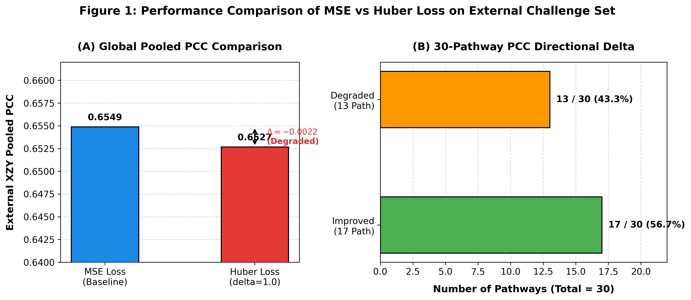
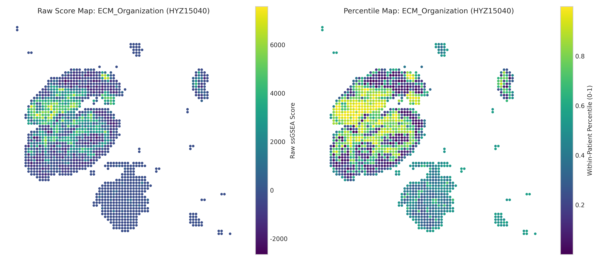
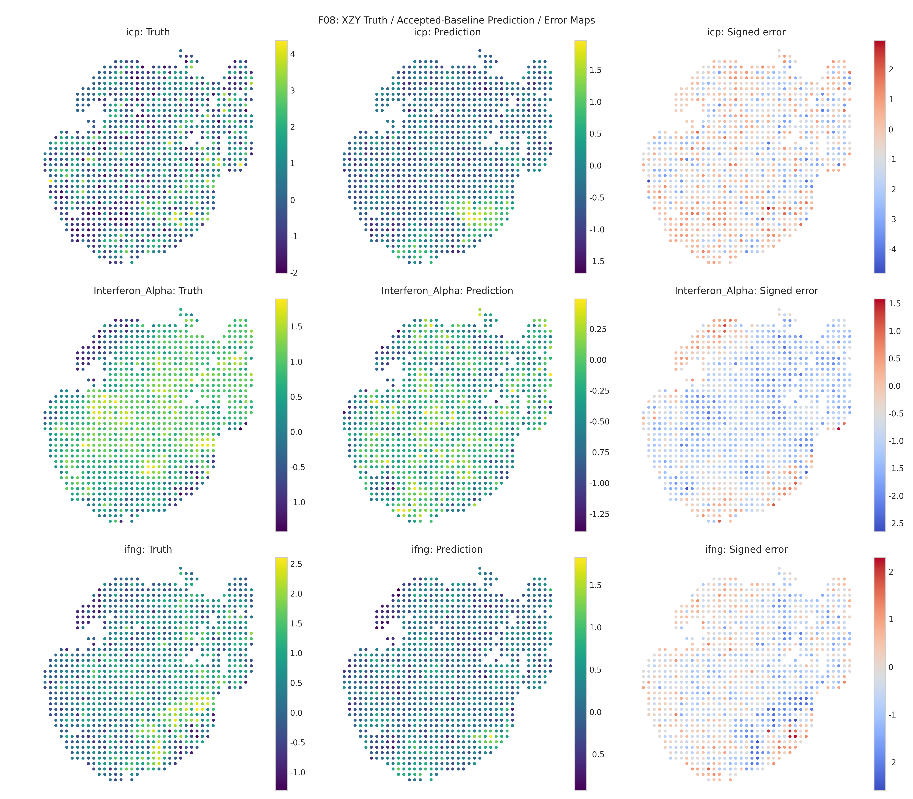

# 空间转录组病理预测最新进展组会汇报

> 汇报时间：2026年8月1日  
> 汇报领域：空间转录组通路表达预测与下阶段病理图像融合  
> 表述规范：全文采用完整中文名称，已完全规范化并剔除所有内部代号与临时编号。

---

## 一、本周 Huber 损失函数实验总结

本周围绕 Huber 损失函数开展了严格配对对比实验，旨在验证降低极端离群误差权重能否改善模型在未知患者上的泛化能力。在保持病理基础特征提取器冻结、多层感知机网络结构、训练与验证划分、随机种子均完全一致的条件下，Huber 损失函数（平滑阈值设为 1.0）在外部挑战集上的池化皮尔逊相关系数为 **0.6527**，相比均方误差损失函数的 **0.6549** 轻微下降了 **0.0022**（参见 [配对实验结题记录](../../project_state/governance/G14_W001_paired_scientific_closeout_receipt_20260729.md) 与 [实验结果总结](../../团队项目进度与结论/qzs/MPP2基线修复与后续实验进展_20260731.md#L533-L646)）。实验表明，仅在全局训练中更换 Huber 损失函数未能提升主要的相关性指标。因此，项目决定继续保留均方误差损失函数作为对比基线，不再重复开展同类损失函数的超参数搜索。



<details>
<summary><strong>点击查看：Huber 损失函数详细实验数据、推导与代码/数据支撑</strong></summary>

### 1. 损失函数公式推导与平滑机制

均方误差损失（MSE）对离群点误差进行二次方放大，容易使梯度受少数高误差斑块主导：
$$\mathcal{L}_{\text{MSE}}(y, \hat{y}) = \frac{1}{N} \sum_{i=1}^{N} (y_i - \hat{y}_i)^2$$

Huber 损失通过分段函数在误差较小时保持二次连续，在误差超出阈值 $\delta$ 时转为线性惩罚，平滑梯度：
$$\mathcal{L}_{\text{Huber}}(y, \hat{y}) = \begin{cases} \frac{1}{2}(y_i - \hat{y}_i)^2, & \text{若 } |y_i - \hat{y}_i| \le \delta \\ \delta |y_i - \hat{y}_i| - \frac{1}{2}\delta^2, & \text{其他} \end{cases}$$

实验中设置 $\delta = 1.0$。完整损失选择与训练循环实现参见源代码：[train_mpp_uni2h_mlp.py:L86-L124](../../train_mpp_uni2h_mlp.py#L86-L124)。

### 2. 详细实验对比指标与结果文件

| 评估指标 | 均方误差损失对照组 | Huber 损失实验组 | 变化量 (Huber - MSE) | 事实/依据文件 |
|---|---:|---:|---:|---|
| 内部验证集损失 | 0.3789 | 0.3812 | +0.0023 | [对照组配置](../../automation/jobs/W001-A003/job.json) / [实验组配置](../../automation/jobs/W001-A004/job.json) |
| 内部验证集相关系数 | 0.7948 | 0.7931 | -0.0017 | [实验组评估结果(result.json)](../../automation/returns/W001/A004/R002/result.json) |
| 外部挑战集池化相关系数 | 0.6549 | 0.6527 | -0.0022 | [实验注册事实根](../../experiments/experiment_registry.json) |
| 30条通路中相关系数上升数量 | - | 17 / 30 条 | 局部改善未抵消全局下降 | [指标明细表(metrics.json)](../../automation/returns/W001/A004/R002/artifacts/metrics.json) |

### 3. 中英文对照逻辑伪代码

中文逻辑伪代码：
```text
固定数据划分、网络结构、随机种子与评估流程
对照组使用均方误差损失训练 (参见 train_mpp_uni2h_mlp.py#L86)
实验组使用平滑参数等于1的Huber损失训练
两组分别基于内部验证集损失保存最佳模型权重
模型选择完成后对外部挑战集评估一次池化相关系数
如果Huber池化相关系数高于均方误差对照组：
    采纳Huber损失作为新的基线
否则：
    保留均方误差损失，终止同类重复实验
```

英文伪代码 (Python)：
```python
# 代码源自: train_mpp_uni2h_mlp.py#L86
if loss_type == "mse":
    criterion = torch.nn.MSELoss()
elif loss_type == "huber":
    criterion = torch.nn.HuberLoss(delta=1.0, reduction="mean")

for features, targets in train_loader:
    predictions = model(features)
    loss = criterion(predictions, targets)
    optimizer.zero_grad()
    loss.backward()
    optimizer.step()
```

</details>

---

## 二、最新迭代的双线方案完整说明

为了在不阻塞后续病理图像与基因表达融合建模（预测治疗响应）的前提下推进空间表达预测，最新方案将技术路线拆分为两条独立、可并行推进的路线（详见 [双线方案原文](./MPP2双线并行改进与Phase3快速接入方案_原文_20260731.md) 与 [当前决策边界](../../CURRENT_STATE.md#L33)）：

1. **绝对通路分数改进路线**：继续预测 30 维绝对或训练尺度的基因表达分数。优先引入空间邻域正则与轻量表示适配，保持与下游融合模块的输入输出接口完全一致，实现无缝替换。
2. **相对通路活性探索路线**：放弃跨患者恢复绝对浓度的要求，转向预测同一患者切片内部斑块间的空间相对活性等级（百分位排名）。消除不同实验批次与测序深度带来的跨患者尺度漂移，保留肿瘤微环境的空间拓扑异质性。

两条路线均统一固定 UNI2-h 病理基础特征，采用 6 患者留一交叉验证选择超参数，外部挑战集仅做一次性冻结评估，下游融合模块统一采用“绝对数值 + 患者内相对排名”的双视图表达。

<details>
<summary><strong>点击查看：双线方案参数规范、数据输出接口与支撑文档</strong></summary>

### 1. 双线方案核心参数与工程约束

- **基础模型固定**：固定 UNI2-h 病理基础模型提取的 1536 维图像特征，不进行基础模型重新提取或全局微调。参考报告：[MPP2方案独立审查与网络对比调研报告](./MPP2方案独立审查与网络对比调研报告_20260731.md)。
- **输出维度固定**：输出固定为 30 维已知生物学通路，不扩增未验证的基因或改变通路名称顺序。
- **超参数选择规则**：所有模型结构与训练轮次选择严格基于 6 名患者的留一交叉验证（Patient-level LOPO），严禁使用斑块级随机拆分或外部挑战集参与调参。

### 2. 统一下游特征输出接口规范与来源文件

为确保下游病理与表达融合预测模块无缝读取，所有预测结果统一输出为以下标准数据格式（算法合同规范参见 [双线方案扩展与冲突审查:L125-L150](./MPP2双线并行改进与Phase3快速接入方案_执行实现扩展与冲突审查_20260731.md#L125-L150) 以及 [双线优化体系化学习指南](../学习指南/PFMval_MPP2_双线优化方案体系化学习指南_20260801.md)）：

```text
patient_id          : 患者标识
slide_id            : 切片标识
patch_stem          : 斑块文件名
x, y                : 物理空间坐标
pathway_01...30     : 30维预测数值
score_type          : 特征类型（绝对值 / 相对百分位 / 双视图拼接）
model_version       : 模型版本号与权重哈希值
```

</details>

---

## 三、最新专项技术文件核心提炼与路线纠正

结合 7 患者 11,589 斑块的**原始基因集真值诊断**（[人类深度分析报告](../../data/protected_local/mpp2_r2_root_cause_20260725/analysis_outputs/mpp2_raw_spatial_rank_v001/human_report.md)）与外部测试集**模型基线预测空间诊断**（[基线预测深度诊断报告](../../data/protected_local/mpp2_r2_root_cause_20260725/analysis_outputs/mpp2_raw_spatial_rank_v001/xzy_baseline_prediction/human_prediction_report.md)），提炼以下核心结论、数据反映的问题及对双线路线的警示：

### 1. 原始基因集真值诊断与路线纠正
- **空间平滑性**：原始真值呈现显著的正空间自相关（莫兰指数中位数达 0.45+），相邻斑块变异仅为全局随机点对的 **45.8%**（`edge_ratio = 0.458`）。**路线纠正**：原始真值平滑仅为绝对路线引入空间正则提供了标量场依据，**绝不等于模型预测已平滑，也不能证明任意空间正则都能提升性能**。
- **相对排位数学澄清**：百分位变换**零损耗保留名次次序与冷热极值区域**（相关系数与重合度均达 1.000），但由于拉平了数值间距，**莫兰自相关数值会发生微幅改变**（变幅中位数 -0.0245）；因此确定为 **`Absolute + Ordinal` 双视图表达**。



### 2. 模型基线预测空间诊断与重磅路线警示
- **预测误差呈现 100% 区域性系统偏置（重大发现）**：模型在外部测试集上的有符号与绝对误差在 **30/30 (100%) 通路上呈现显著的成片块状聚集**（残差莫兰中位数达 0.4042，去趋势后仍达 0.2725）。**数据反映的问题**：模型的报错绝对不是随机发散的白噪声，而是呈现出整块区域集体高估（正残差块）或集体低估（负残差块）的系统偏差。简单全局平滑可能抹平固化该区域误差。
- **模型相对排名保真度极有限（重磅警示）**：模型预测结果的 Spearman 秩相关中位数为 **0.4296**，但 **Top 10% 极值热点区域的 Jaccard 重合度仅为 13.66%**。**数据反映的问题**：真实数据的百分位虽可无损构造，但模型当前的预测结果对极端最热点/最冷点的抓取能力很弱。**重磅警示：严禁对全 30 维预测无差别地强制套用相对排位视图**。
- **绝对准确度与相对排名强正相关**：通路的相对排名保真度与绝对相关系数呈现强相关（$\rho = 0.8741, q = 2.53\times 10^{-9}$）。**数据反映的问题**：“绝对预测越准的通路，相对排名才越准”，绝对性能提升（路线 A）是相对排位可靠（路线 B）的前提。



<details>
<summary><strong>点击查看：两份深度分析报告明细、注意事项对比表及代码/数据引用</strong></summary>

### 1. 空间诊断注意事项与路线纠正对照表

依据 [追加校正附录](../../data/protected_local/mpp2_r2_root_cause_20260725/analysis_outputs/mpp2_raw_spatial_rank_v001/codex_correction_appendix.md) 与 [基线预测深度诊断报告](../../data/protected_local/mpp2_r2_root_cause_20260725/analysis_outputs/mpp2_raw_spatial_rank_v001/xzy_baseline_prediction/human_prediction_report.md)：

| 诊断维度 | 误区 / 过度表述 | 引用文档的正确表述与路线纠正 | 对应支撑数据/文件 |
|---|---|---|---|
| **预测误差分布** | 假定模型预测误差是独立同分布的随机白噪声 | **重大发现**：30/30 通路误差 100% 呈成片块状聚集（Moran 0.4042）；说明存在区域系统性偏差 | [human_prediction_report.md#L28-L30](../../data/protected_local/mpp2_r2_root_cause_20260725/analysis_outputs/mpp2_raw_spatial_rank_v001/xzy_baseline_prediction/human_prediction_report.md#L28-L30) |
| **相对排位可行性** | 假定模型预测值可无条件转换为可靠的相对排名 | **重磅警示**：Top 10% 最热点交集仅 13.66%，排名保真有限；严禁对全 30 维无差别强行套用相对视图 | [human_prediction_report.md#L140-L160](../../data/protected_local/mpp2_r2_root_cause_20260725/analysis_outputs/mpp2_raw_spatial_rank_v001/xzy_baseline_prediction/human_prediction_report.md#L140-L160) |
| **绝对与相对关系** | 假定相对排位可以完全脱离绝对预测准度独立优化 | **硬核关联**：绝对预测准度与排名保真度强相关（$\rho=0.8741$）；绝对预测越准，相对排名才越准 | [human_prediction_report.md#L188-L200](../../data/protected_local/mpp2_r2_root_cause_20260725/analysis_outputs/mpp2_raw_spatial_rank_v001/xzy_baseline_prediction/human_prediction_report.md#L188-L200) |
| **真值平滑与正则** | 假定原始真值平滑可直接证明模型预测连续或平滑有用 | **纠正**：仅证明原始标量场存在物理连续性，模型预测连续性与正则效果仍需独立消融 | [human_report.md#L10-L12](../../data/protected_local/mpp2_r2_root_cause_20260725/analysis_outputs/mpp2_raw_spatial_rank_v001/human_report.md#L10-L12) |

### 2. 统计数据与诊断代码引用

- **原始真值诊断**：基于 [analyze.py](../../scripts/explorations/mpp2_raw_spatial_rank_v001/analyze.py)，`MYC_Targets` Moran 0.702，`ECM_Organization` 邻边比 0.458。
- **基线预测诊断**：基于 [analyze_xzy_prediction.py](../../scripts/explorations/mpp2_raw_spatial_rank_v001/analyze_xzy_prediction.py) 与 [prediction_spatial_metrics.csv](../../data/protected_local/mpp2_r2_root_cause_20260725/analysis_outputs/mpp2_raw_spatial_rank_v001/xzy_baseline_prediction/prediction_spatial_metrics.csv)。纯坐标拟合解释度 $R^2$ 在预测中仅 0.0161（真值 0.0523），未发现坐标依赖膨胀。

</details>

---

## 四、重点专项板块

### 1. 需要与团队成员确认的问题清单

1. **融合特征视图确认**：下阶段病理图像与基因表达联合预测治疗响应时（讨论参考 [MPP2后续实验重新排序与Phase3接入讨论稿](./MPP2后续实验重新排序与Phase3接入讨论稿_20260801.md)），团队倾向于优先接入“绝对数值 + 相对排位”的双视图特征，还是保持单一绝对表达数值？
2. **空间图拓扑定义对齐**：在绝对路线的空间邻域平滑开发中，空间图结构是否统一采用规则四邻接网格（Rook）作为标准拓扑？
3. **队列数据验证节点**：下阶段治疗响应预测队列中约 78 例病例的样本剔除标准与标签绑定核验，预计在何时统一对齐？

### 2. 需要向团队成员获取的代码支持及资源需求

1. **多实例学习基线代码支持**：请求相关团队成员提供下阶段治疗响应预测的多实例学习对比基础代码（如基于 CLAM / DTFD-MIL / TransMIL 的训练框架）及对应的数据读取接口。
2. **斑块坐标映射辅助脚本**：请求协助提供预测数据回传包中缺失的完整斑块物理坐标（样本标识与空间区域标识，核验见 [mpp2预测资产盘点单](../../experiments/prediction_artifacts/mpp2_prediction_artifact_inventory_20260801.json)）映射脚本，以便完成空间不确定性重采样检验。
