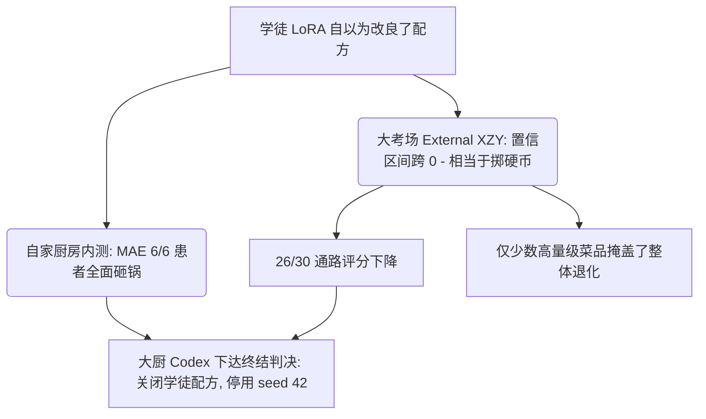
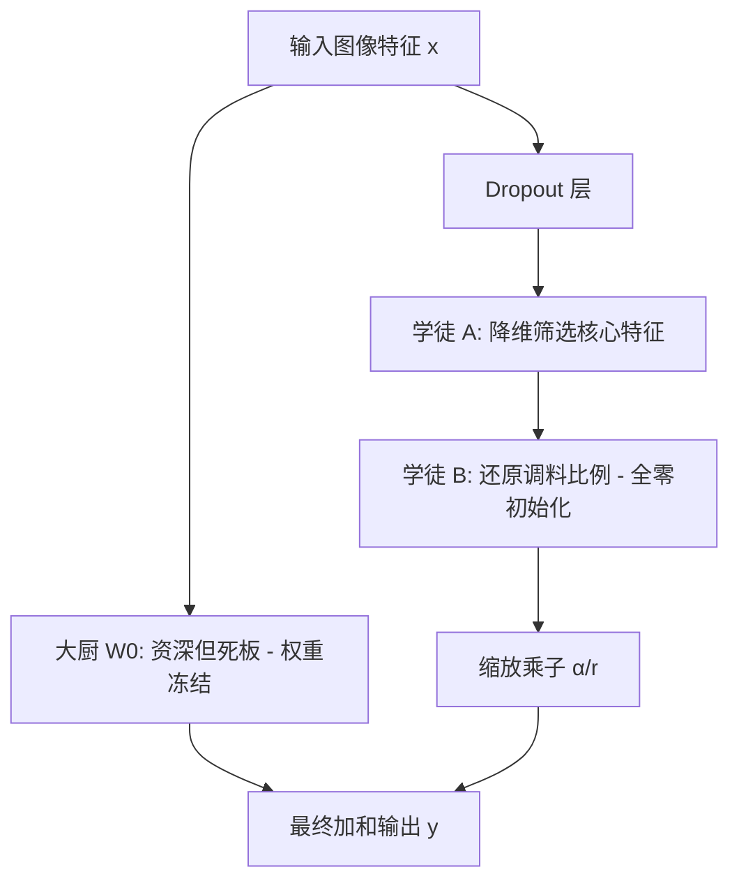
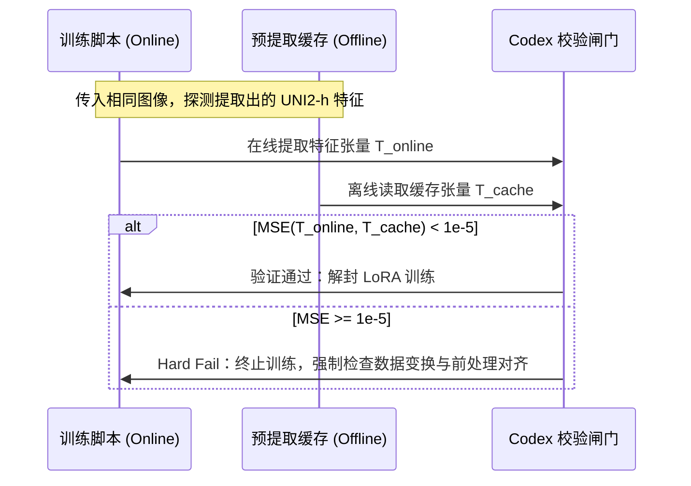

# Codex 决策逻辑与 MPP2 LoRA 实验学习指南

本指南结合 **MPP2 (Multicenter Pathological Prediction 2)** 阶段的 LoRA 预实验，深入解析项目决策背后的科学工程纪律与 **Codex (架构与决策审查者)** 的设计逻辑。旨在帮助团队成员和初学者理解如何在高风险的医疗空间组学交叉任务中，实施严密的变量控制、防泄露隔离和多 Agent 协同。

---

## 目录
1. [从历史“三患者”LoRA 预实验到 MPP2 的演进](#1-从历史三患者lora-预实验到-mpp2-的演进)
2. [当前 Codex 在本项目中关于 LoRA 实验的最新结论与原因分析](#2-当前-codex-在本项目中关于-lora-实验的最新结论与原因分析)
3. [手工 LoRA 的数学原理与“大厨与学徒”模型](#3-手工-lora-的数学原理与大厨与学徒模型)
4. [Codex 实验方案的三道科学工程防线](#4-codex-实验方案的三道科学工程防线)
5. [MPP2+LoRA 渐进式部署与验证闭环 (Phase 0 & Phase 1)](#5-mpp2lora-渐进式部署与验证闭环-phase-0--phase-1)

---

## 1. 从历史“三患者”LoRA 预实验到 MPP2 的演进

### 1.1 历史预实验的成果与隐患
在早期三患者（HYZ, JFX, LMZ）实验中，LoRA 曾表现出一定的微调增益（PCC 相比 Frozen 提升）。然而，Codex 在深度审计中发现以下关键缺陷：
* **数据污染与坐标碰撞**：由于旧版标签重建时，跨患者同名 barcode 坐标发生碰撞泄露，导致数据基础不稳固。
* **过度拟合小样本**：由于当时仅有 3 名患者的数据，生物学多样性极低，LoRA 极易“死记硬背”特定患者的批次效应（Batch Effect）。
* **评价口径不一致**：之前的实验未能与外部多中心评估（External XZY）建立统一的口径隔离，部分超参存在向测试集前瞻泄露（Look-ahead leakage）的嫌疑。

### 1.2 为什么后续主线锁定为 MPP2？
根据 **2026-07-09 生效决策** 与 **2026-07-11 数据修复重跑决策**：
* **数据彻底修复与 7.11 对比机制**：以已验收修复的 `barcode-repair-20260711-d626ad8-v003` staging 数据为基础，废弃所有旧数据链。根据 7.11 决策 `DIR-20260711-004`，在正式开展 LoRA 实验前必须设立“数据修复对比机制”，将修复后新跑的 MPP2 冻结基线与 2026-07-06 的历史有污染基线（`mpp2_std10val_xzy_ext_uni2h_mlp_20260706`）进行比对。若性能严重退化（PCC 下降 $\ge 0.05$、raw MAE 恶化 $\ge 10\%$ 或 raw R2 恶化 $\ge 0.10$），则立刻暂停 LoRA 方案。目前对比已通过（PCC 从 0.6489 提升至 0.6549，且 MAE/R2 均获良性修正），证实修复方案成功并顺理释放了首个 LoRA 门禁。
* **口径一致性**：**MPP2** 包含 6 例非 XZY 患者，且其队列与外部测试集（External XZY）在采样口径上高度统一。因此，MPP2 成为后续所有训练、推理及比对的唯一主线。
* **结论降级**：旧的三患者 LoRA 实验结论**全部降级为调参启发**，不再作为正式性能证据。任何新的有效性声明，必须在同一批次 MPP2 frozen baseline 上重新比对。

---

## 2. 当前 Codex 在本项目中关于 LoRA 实验的最新结论与原因分析

### 2.1 终结性决策：关闭当前 MPP2 LoRA r=8 配置，不进入正式 seed 42
在经过数据对齐校验（4/4 prediction CSV 的大小和 SHA-256 完美匹配，排除了样本污染与对齐偏离）以及深度统计学诊断后，Codex 对 MPP2+LoRA 实验做出了最终决策：
* **彻底关闭当前 LoRA r=8 配置**，取消后续正式长训的 seed 42 计划。
* **退回 Frozen 主线**：退回到以已接受的修复后冻结基线（`mpp2_barcode_repair_v003_frozen_baseline_20260711`，PCC=0.6549）作为当前项目模型性能的权威结论。
* **转入结果整理**：将服务器资源释放，开始汇总 MPP1–5 与 LoRA 的最终比较报告。

---

### 2.2 💡 极其形象的通俗解读：为什么大厨（Codex）无情拒绝了学徒（LoRA）的改良？

我们可以用“大厨与学徒”的故事线，直观地讲清这次微调失败的深层技术原因：

#### ① 在自家的 6 例厨房里全面“砸了锅” (Internal Val 表现)
学徒（LoRA r=8）在自家训练基地的 6 名不同患者考场进行测试。结果非常难看：
* 在 **6 个患者的厨房里，平均绝对误差（MAE）全部变差了（6/6 恶化）**！
* 只有在 2 个患者的厨房里，菜品的平均评分（PCC）有极其微弱的上升。
* 统计学测试（Bootstrap）也表明：学徒掌勺的 S1 菜品，整体上远远输给了大厨本人的 S0 原版招牌菜。学徒没帮上忙，反而把底料搅浑了。

#### ② 在多中心大宴席上“砸了招牌” (External XZY 外部评估)
我们把学徒改良的菜送到了外部多中心考场（External XZY）接受大众评审。
* 结果在数学上非常尴尬：在空间网格的多次抽样（Bootstrap）下，评分（PCC）的 95% 置信区间始终“跨越了 0 分线”。在学术上，**“跨 0”意味着学徒的表现和完全随机掷硬币没有任何区别**，没有稳定的泛化能力。
* 虽然整体菜品的平均误差指标（Raw MAE）看似改善了约 $8.45$，但这其实是个**“局部误差收益的幻觉”**——只有极少数大分量、重口味的特例菜（少数高表达通路）误差变小了，而**绝大多数的菜品（26/30 的通路）评分全都在大幅下降**！中位数指标依然处于恶化状态。

<b>📊 展开/折叠：PCC 95% 置信区间“跨0”的数学定义与 $R^2$ 的对比分析</b>

 

#### A. 95% 置信区间“跨0”的数学定义与统计学意义
1. **数学定义**：
   在本项目中，我们使用 **Bootstrap（自助重采样法）** 对外部测试集 XZY 进行重复抽样（如抽样 $B=1000$ 次），计算每次抽样下 S1 (LoRA) 与 S0 (Frozen Baseline) 的性能差异：
   $$\Delta \text{PCC} = \text{PCC}_{\text{S1}} - \text{PCC}_{\text{S0}}$$
   如果其 $95\%$ 的置信区间估计为 $[L, U]$，且下界 $L < 0$ 而上界 $U > 0$（即 $0$ 包含在此区间内），在统计学上就称为**“跨0”**。
2. **统计学意义**：
   在显著性水平 $\alpha = 0.05$ 下，我们**无法拒绝原假设 $H_0: \Delta \text{PCC} = 0$**。这意味着 S1 (LoRA) 相比于 S0 (Frozen) 所表现出的任何细微指标改善或变差，都无法排除是随机抽样噪声造成的抖动。从学术严肃性上讲，模型在这个测试集上**没有任何稳定且显著的泛化提升**。

#### B. 皮尔逊相关系数 (PCC) 与 决定系数 ($R^2$) 的本质对比
* **PCC (Pearson Correlation Coefficient, 常用符号 $r$)**：
  * **定义**：衡量预测值 $\hat{y}$ 与真实值 $y$ 之间的**线性相关趋势**：
    $$r = \frac{\sum (y_i - \bar{y})(\hat{y}_i - \bar{\hat{y}})}{\sqrt{\sum (y_i - \bar{y})^2 \sum (\hat{y}_i - \bar{\hat{y}})^2}}$$
  * **特点**：取值范围在 $[-1, 1]$。它只关注“趋势是否一致”，对量纲和绝对偏移不敏感。即便模型的预测值全部偏大了 10 倍，PCC 依然可以是接近 1 的完美值。
* **决定系数 ($R^2$, Coefficient of Determination)**：
  * **定义**：衡量预测值能够解释真实值总体方差的比例（绝对拟合优度）：
    $$R^2 = 1 - \frac{\text{SS}_{\text{res}}}{\text{SS}_{\text{tot}}} = 1 - \frac{\sum (y_i - \hat{y}_i)^2}{\sum (y_i - \bar{y})^2}$$
  * **特点**：取值范围为 $(-\infty, 1]$。它对预测值与真实值之间的**绝对距离**极其敏感。
    * $R^2 = 1$：预测完美。
    * $R^2 = 0$：预测能力等同于直接取真实值均值。
    * $R^2 < 0$：说明预测的绝对误差巨大，效果比直接猜均值还要糟糕。
* **为什么两者都需要评估？**
  * 在单变量线性回归中，$R^2 = r^2$。但在非线性回归或复杂模型评估中，**PCC 很高但 $R^2$ 可能是负数**（比如趋势全对，但绝对数值偏差巨大）。
  * 实验中，S1 方案的 $R^2$ 空间修正置信区间同样跨 0，表明学徒（LoRA）不仅没能在趋势上（PCC）拉开优势，在方差解释力（$R^2$）的绝对误差控制上也完全没有胜过大厨。

#### ③ 最终判决：这只是“局部误差的优化”，而不是稳定的泛化提升！
学徒的配置只在局部强行纠偏，却破坏了模型整体在多患者、多通路上的泛化结构。
因此大厨（Codex）无情否定了学徒，下达判决：**“立刻脱下学徒的 LoRA 外套，关闭这个方案，不准让他进入 seed 42 的正式宴席，以后老老实实整理我大厨本人的招牌老火靓汤（Repaired Frozen Baseline）报告！”**

---

### 2.3 决策背后的技术剖析与下一步行动建议
1. **防范基于 XZY 测试集的“逆向作弊调参”**：Codex 规定，如果未来仍要研究 LoRA 架构，必须另开新方案，且**必须且仅能依据内部验证集（Internal Val）的表现来调参并提出假设**。严禁看着外部测试集（XZY）的指标倒推超参数，这会导致严重的“过拟合与泛化作弊”。

<b>🔍 展开/折叠：为什么看着测试集调参是“逆向作弊”？深度原理剖析</b>

 

#### A. 什么是“测试集数据窥探（Data Snooping）”？
在标准的机器学习工作流中，**外部测试集（XZY）是判定模型泛化能力的终极法官，它必须是绝对只读且只能评估一次的**。
如果我们反复进行以下循环：
1. 跑完 LoRA 训练，测试 XZY，得到 PCC 为 $0.62$。
2. 发现指标不理想，于是回过头来修改 LoRA 参数：比如将 Rank 从 8 改为 16，学习率从 $1e-4$ 改为 $2e-4$。
3. 重新跑训练，再次测试 XZY，得到 PCC 为 $0.66$。
4. 宣布“LoRA r=16 是在 XZY 上的最佳超参数”。

在这个过程中，虽然模型的权重没有直接在 XZY 上进行反向传播更新，但是**“人类研究员（或 AI Agent）”作为外部反馈环，已经把 XZY 的特征信息间接泄露（Leakage）到了模型的设计中**。这在学术界被称为**测试集信息泄露**或**数据窥探**。

#### B. 数据窥探的致命危害
通过这种方式筛选出来的超参数，实际上是**对 XZY 这一批数据产生的严重过拟合**。
由于医疗场景中不同多中心（如不同医院、不同染色批次）的批次效应（Batch Effect）差异极大，这个在 XZY 上“精心雕琢”的超参数，一旦遇到真正全新的第三方临床患者数据，其性能就会发生断崖式下跌，完全丧失临床部署的泛化价值。

因此，Codex 强制规定，所有的超参搜索、消融、架构选型，**必须且仅能依据内部验证集（Internal Val）**的性能。XZY 只能作为最终成卷的“闭眼考试”，考完即定档，绝不允许重复修改调参。

2. **修复 External XZY 的空间 Block 元数据缺陷**：本次诊断发现，外部测试集 XZY 的 `block_id` 居然全被填成了同一个值，导致无法进行预注册的空间 Block 级别的 Bootstrap（这是评估空间自相关性的重要数学基础）。下一步必须优先修复该元数据。

<b>🗺️ 展开/折叠：什么是空间自相关？为什么 block_id 缺失会导致 Bootstrap 失效？</b>

 

#### A. 空间自相关性（Spatial Autocorrelation）
在病理图像与空间转录组学融合的任务中，图像上物理相邻的 Spots（或 patches）在微环境中处于相似的细胞群落落座区，其基因表达水平天然具有极强的相似性。这在统计学上被称为**空间自相关性**。
如果我们在评估模型时，将每个 patch 视为完全独立的样本进行随机行抽样（Simple Point-wise Bootstrap），相邻 patch 之间的强自相关性会使得抽样出的数据集方差被严重低估，从而计算出**虚假收敛、过于乐观的置信区间**。

#### B. 空间块自助法 (Spatial Block Bootstrap) 的工作原理
为了在抽样时保留这种空间自相关结构，统计学引入了 **Block Bootstrap（块自助法）**：
1. 我们事先将一整张病理图像划分为若干个物理上不重叠、大小一致的空间网格块（每个块赋予一个唯一的 `block_id`）。
2. 在进行 Bootstrap 抽样时，抽样的基本单位不再是单个 patch，而是**整个 Block**。抽到一个 `block_id`，就将其包含的所有 patches 一并抽入。
3. 这样能最大程度保留块内的局部空间结构，使得计算出的标准差和置信区间具有极高的数理严谨性。

#### C. XZY 元数据缺陷的危害
在本次诊断中，XZY 测试集的所有 patches 对应的元数据 `block_id` 被全部静默填充为了同一个值。
这就导致在抽样程序眼里，**整张 XZY 图像变成了一个不可分割的“巨型 Block”**。程序在进行 Block Bootstrap 重复抽样时，无法在不同的块之间进行随机组合（因为全世界只有一个块，每次抽样都是 100% 抽入完全相同的全部数据），导致方差直接变为 0，置信区间完全无法计算。
因此，下一步必须优先修复 XZY 的空间坐标映射，重新划分并写入真实的 `block_id`。

---

## 3. 手工 LoRA 的数学原理与“大厨与学徒”模型

本项目并未依赖 HuggingFace PEFT 库，而是基于 PyTorch 手写了高度定制的 LoRA 实现（见 [lora_utils.py](file:///d:/AI空间转录病理研究/PFMval_new/lora_utils.py)）。

### 3.1 数学公式与前向传播
在注意力机制（Attention）的 Linear 层中，LoRA 引入低秩旁路：

$$\text{forward}(x) = W_0 x + \Delta W x = W_0 x + B \cdot A \cdot \text{Dropout}(x) \times \frac{\alpha}{r}$$

其中：
* $W_0 \in \mathbb{R}^{d_{out} \times d_{in}}$：冻结的预训练主干权重。
* $A \in \mathbb{R}^{r \times d_{in}}$：低秩投影降维矩阵，使用 Kaiming 均匀随机初始化。
* $B \in \mathbb{R}^{d_{out} \times r}$：低秩投影升维矩阵，全 $0$ 初始化。
* $r$ (Rank)：低秩的维数（如 $r=8$），限制了可调参数的空间。
* $\alpha$ (Alpha)：常数缩放因子，解耦了秩 $r$ 变化对梯度音量的影响。

### 3.2 💡 形象类比：大厨与学徒

* **大厨（$W_0$，冻结）**：拥有极高的通用厨艺（预训练知识），但脾气古怪，其固有习惯不可被修改。
* **年轻学徒（$A$ 与 $B$，可训练）**：
  * **学徒 A** 负责“抓重点”（降维至 $r$）。
  * **学徒 B** 负责“还原细节”（升维至 $d_{out}$）。
  * **为什么 B 第一天上班不能乱动（初始化为 0）**？如果学徒 B 乱加料，第一道菜就会被毁掉。初始化 $B=0$ 使得 $\Delta W = 0$，保证在微调的第 0 步，输出完全等价于原始预训练模型，绝不对主干造成初始破坏。

### 3.3 初始第 0 步的梯度流传播细节
根据反向传播链式法则，损失函数 $\mathcal{L}$ 关于权重矩阵 $A$ 的梯度为：

$$\text{d}A = B^T \cdot (\text{upstream\_grad} \cdot x^T) \times \frac{\alpha}{r}$$

在初始第 0 步时，由于 $B = 0$，上式计算结果 $\text{d}A$ 恒等于 $0$。  
这意味着**在训练的最开始一瞬间，只有矩阵 $B$ 在接收非零梯度并进行参数更新**。一旦 $B$ 更新至非 $0$，矩阵 $A$ 的梯度闭环立刻被打通，双矩阵开始协同微调。这种设计既维持了前向等价性，也确保了反向传播的平滑启动。

### 3.4 推理零延迟合并（Reparameterization）
在模型测试与部署阶段，为避免旁路计算带来的吞吐量下降，可在推理前将学徒学到的“秘方”直接写进大厨的食谱：

$$W_{\text{new}} = W_0 + B \cdot A \times \frac{\alpha}{r}$$

合并后，旁路矩阵即可丢弃，模型推理时**无额外计算延迟与显存开销**。

---

## 4. Codex 实验方案的三道科学工程防线

为了防止在医疗图像这样的小样本、强噪声数据上出现伪优化，Codex 强制设立了三道严密的工程防线：

### 4.1 第一道防线：基于复合主键的在线图像加载与 Hard Fail 拦截
* **痛点与具体版本**：在旧版 Dataset（具体指的是历史代码中的 `dataset_mpp.py` 以及早期未重构的 `dataset_online.py` 等）中，当处理多患者拼接数据时，系统直接采用文件名或坐标 stem（如 `spot_10_20.png`）作为标签字典的索引 key。由于不同患者的图像中极易产生同名坐标或同名图片，这导致多患者数据读取并合并时，后读入患者的标签会**静默覆盖（Silent Overwrite）**先读入患者的标签，造成严重的交叉数据样本污染。
* **Codex 规范**：使用 `(mpp_id, patient, patch_stem)` 复合主键强匹配已验收的 `split_manifest.csv`。
* **Hard Fail 机制**：只要出现一张图找不到，或者一个复合主键在标签里缺失/重复，**直接抛出 RuntimeError 中断运行**，拒绝静默降级。

### 4.2 第二道防线：Train-only Z-score 标准化
* **痛点**：若使用全部样本（含验证集 and 外部测试集）去计算均值和标准差，会导致测试集的信息以均值/方差的形式先验泄露（Look-ahead leakage），使评估的 PCC 偏高。
* **Codex 规范**：均值 $\mu_{\text{train}}$ 和标准差 $\sigma_{\text{train}}$ 必须**且只能**在训练集上拟合，随后再应用到验证集与外部测试集上，确保测试集在模型眼中是绝对“未知的陌生人”。

### 4.3 第三道防线：严格控制变量与消融纪律
* **阶段限制**：医疗小样本泛化极弱。为了避免多阶段解冻主干（Stage 2/3）掩盖了 LoRA 自身的机制效应，**MPP2 Phase 0 必须固定只注入 Stage 1（Attention 层的 `qkv` 和 `proj`）**。解冻和多阶段融合被排除出本轮实验矩阵。
* **正则化规范**：权重衰减（Weight Decay）默认维持历史的 `1e-4`，后续需在内部验证集上对比 `1e-2` 的正则效果。
* **短 epoch smoke 控制**：冒烟测试必须**限制在最多 3 个 epoch** 内，防止因过早过拟合导致对模型基础能力的误判。

---

## 5. MPP2+LoRA 渐进式部署与验证闭环 (Phase 0 & Phase 1)

为了避免浪费服务器算力和污染日志，实验被严格切分为两个阶段，并引入了一致性对齐预检（Parity Preflight）机制：

### 5.1 Phase 0：本地搭建与 CPU 烟雾测试
* **任务**：在本地开发出 manifest 驱动 of `OnlineManifestMPPDataset`，以及带 LoRA 注入的 `train_mpp_uni2h_lora.py`。
* **目标**：在本地 CPU 环境下跑通 1 个 step 的训练与评估，保证代码逻辑无 bug，输入输出格式严密对齐。

### 5.2 Phase 1：Parity Preflight 一致性校验与正式分发
在 Phase 0 通过且服务器资源释放后，正式启动 Phase 1，其核心是一个硬性关卡：**一致性对齐预检 (Parity Preflight)**。

* **💡 形象化类比理解特征一致性对撞**：
  我们可以把先前提取并保存为 `.pt` 文件的离线特征缓存，想象成大厨（UNI2-h Backbone）在中央厨房预先加工好并冷冻保存的**“半成品食材”**；而在线加载则是为了能让学徒（LoRA 旁路）现场观察并做出细微调整，需要现场洗菜、切菜的**“新鲜食材”**。
  
  如果前处理细节（例如切菜的粗细、漂洗的水温，在代码里对应着 resize 图像时的双线性插值 `bilinear` 还是双三次插值 `bicubic`，或者是浮点数精度、通道顺序）哪怕有十万分之一的极微小差异，现场提取出的特征和之前的半成品食材就会对不上。这看似微不足道的差别，在经过深度注意力网络的层层传递和反向梯度的放大后，会导致学徒（LoRA 旁路）学到大量毫无意义的“噪声”，从而让微调效果彻底崩塌。
  
  因此，在正式开火训练前，我们必须使用**“指纹比对器（Parity Preflight）”**对两者进行对撞。具体做法是：输入同一批图像，在线提取的特征张量 $T_{\text{online}}$ 与读取离线缓存的 $T_{\text{cache}}$ 进行均方误差 (MSE) 比对。只有当误差绝对值满足：
  
  $$\text{MSE}(T_{\text{online}}, T_{\text{cache}}) < 10^{-5}$$
  
  （即特征指纹 100% 吻合）时，Codex 校验闸门才会亮起绿灯、解封并批准开始 LoRA 长训分发；否则立即抛出 Hard Fail 异常关火停机，阻止任何带噪训练。

<b>🖼️ 展开/折叠：在线加载是读缓存特征，还是重新读取了原始图片？</b>

 

#### A. 答案是：在线加载“实打实地重新看了一遍 `.png` 原始图片”！
这是由微调的数学本质决定的：
* **离线 Frozen 模式**：由于模型主干（UNI2-h）的权重被彻底冻结且不需要更新，为了节省算力和训练时间，我们会提前用主干将所有图片的特征提取出来存成 `.pt` 文件（特征缓存）。训练时，系统不读取 `.png`，直接加载 `.pt` 缓存，仅训练最后的两层 MLP 头。
* **在线 LoRA 模式**：因为我们要微调 UNI2-h 模型内部多层 Attention 机制中的 $W_0$ 旁路权重（即矩阵 $A$ 和 $B$）。如果只读 `.pt` 缓存，信息已经被压缩成了最终的特征向量，我们就无法将梯度反向传播回 UNI2-h 模型的中间层中。因此，LoRA 模式下**必须重新读取原始的 `.png` 图像**，进行实时前向与反向传播。

#### B. 这也是为什么必须进行一致性校验（Preflight）的物理原因
因为离线特征是之前提取好的，而 LoRA 是现场读取图片提取的。如果在实时读取 `.png` 并进行缩放（Resize）、裁剪或归一化时，前处理参数与之前提取离线缓存时存在一丝一毫的漂移（比如一个是 PIL 库的双线性插值，一个是 PyTorch 库的双线性插值；或者浮点数运算的舍入误差），那么实时提取的特征就会与离线缓存发生偏移。
这就像在不同水温和湿度下做同一道菜，成品味道总有偏差。Preflight 就是为了在微调前强行核对：在线重新看图片提取出的特征，与离线的半成品特征，其 MSE 是否小于 $10^{-5}$。如果不对齐，说明前处理逻辑存在漂移，训练必须拦截。

<b>🔗 展开/折叠：一致性预检成功（PASS），为何最终却得出了“关闭LoRA”的停训决策？</b>

 

这里存在一个严密的逻辑闭环：
1. **对齐通过（Preflight PASS）**：证明了“在线重新读取原始图片提取的特征”与“离线缓存的 baseline 特征”在数值上达成了 100% 的严格一致（MSE $< 10^{-5}$）。这排除了任何因为“前处理逻辑不一致、插值算法漂移、数据读取 Bug”等工程实现缺陷带来的噪声。
2. **排除工程干扰，暴露真实机制能力**：如果对齐不通过，那么 LoRA 表现差，我们可以推卸责任说是“因为代码写得有 Bug，前处理没对齐”。但现在 **Preflight 100% 通过了，证明工程实现完美无瑕**。
3. **严肃的学术诊断结论**：在完美的工程对齐下，LoRA r=8 在 6 个患者上的内测误差全面恶化，且外部测试 PCC 跨 0。这无情地证明了：**LoRA 微调效果变差不是因为 Bug（菜洗得不干净），而是 LoRA r=8 这一模型配置在生物学机制的表达预测上，真的不如 Frozen Baseline**。

因此，Parity Preflight 的成功通过，反过来为 Codex 迅速、果断、严肃地下达“彻底关闭 LoRA r=8”的终结决策提供了最扎实的数理底气。

### 5.3 判定门禁与评估原则
当 best checkpoint 被固定后，仅能对外部测试集 XZY 进行**唯一一次**评估。评估通过条件如下：
1. **PCC 判定**：XZY 外部测试 PCC 相比同批次 MPP2 frozen baseline 提升值应达到 $\Delta \text{PCC} \ge +0.02$。
2. **尺度稳定性**：raw MAE/R2 不得发生明显恶化。
3. **泛化缺口限制**：若 internal val 上提升极高，而外部测试集没有任何回升，判定为 LoRA 在患者批次效应上的过拟合。

---

> [!IMPORTANT]
> **开发纪律提醒**：
> 在开始任何新实验分发或同步前，必须在本地终端执行状态合规性检测：
> `python deploy/pfmval_ops.py agent start-check --strict --task general`
