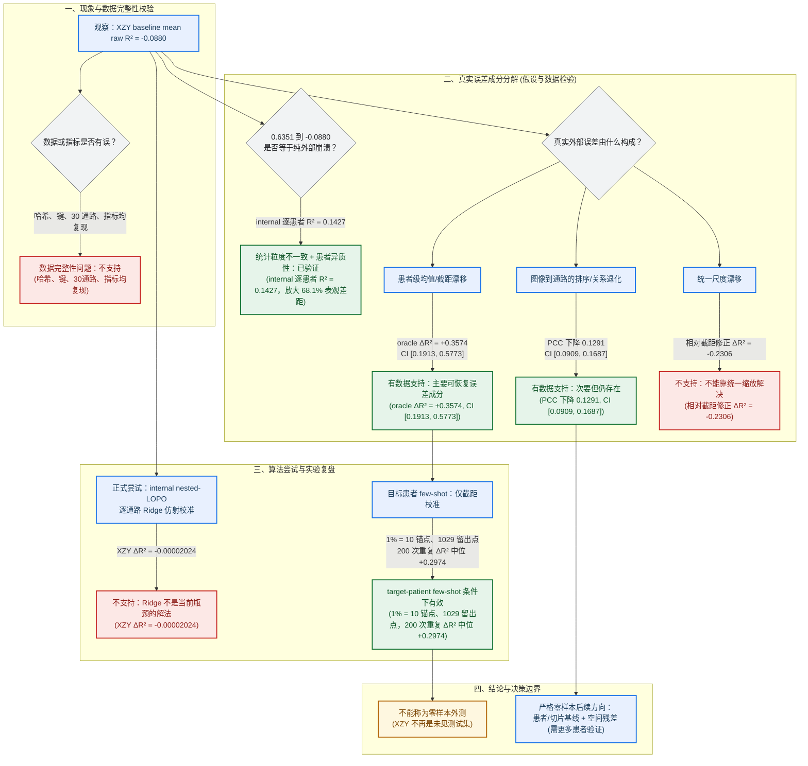

# MPP2 R² 预测优化：假设、检验与实验复盘（2026-07-25）

> 目的：分清“R² 为什么低”“哪些尝试真实有效”以及“哪些结论不能越界”。
>
> **证据边界**：Ridge r003 为 `failed`、未 accepted 的本地诊断来源；XZY 真值参与的 oracle 与 few-shot 校准均不能当作零样本外测证据。

> 💡 **核心瓶颈与关键问题**：
> 当前最大问题是：MPP2（多通路转录组空间表达预测任务 2）对新患者的通路绝对基线存在明显偏移，且还有一定图像—通路排序泛化下降；现有 internal-only Ridge（仅使用训练集内部患者拟合的岭回归校准器）几乎无效，而能修复截距的 XZY（外部测试集患者编码）真值校准又不能作为 zero-shot（零样本，即完全不接触测试目标患者真值的泛化方案）方案。它最需要解决，因为截距偏移单项可解释约 +0.3574 的 R²（决定系数/拟合优度）上界，是最大可恢复误差来源，同时决定模型能否在真正未见患者上输出可信的绝对分数。

## 一句话结论

MPP2 的 XZY baseline mean raw R² 为 **-0.0880**，不能简单写成“模型在外部完全失效”。核心解释有三层：

1. internal 的 `0.6351` 来自六名患者混合计算；公平的逐患者均值仅 **0.1427**，统计口径与患者异质性放大了表观落差。
   

   
<b>展开解释：pooled R² 与 patient-balanced R² 的计算公式与差异原因</b>

   - **1. 混合计算公式 (Pooled R²)**：
     将所有患者的 spot 混合在一起当作单个数据集计算：
     $$R^2_{\text{pooled}} = 1 - \frac{\sum_{p=1}^{P}\sum_{i=1}^{N_p} (y_{p,i} - \hat{y}_{p,i})^2}{\sum_{p=1}^{P}\sum_{i=1}^{N_p} (y_{p,i} - \bar{y}_{\text{global}})^2}$$
     其中 $\bar{y}_{\text{global}}$ 为所有患者混合后的全局真值均值。

   - **2. 逐患者平衡计算公式 (Patient-balanced R²)**：
     先在每个患者内部单独计算 R²，再对所有患者取等权平均：
     $$R^2_{\text{patient}} = 1 - \frac{\sum_{i=1}^{N_p} (y_{p,i} - \hat{y}_{p,i})^2}{\sum_{i=1}^{N_p} (y_{p,i} - \bar{y}_p)^2}, \quad R^2_{\text{balanced}} = \frac{1}{P} \sum_{p=1}^{P} R^2_{\text{patient}}$$
     其中 $\bar{y}_p$ 为当前患者 $p$ 切片内的局部真值均值。

   - **3. 为什么结果差异巨大 (0.6351 vs 0.1427)？**
     - **Pooled 分母包含了“患者间变异 (Inter-patient heterogeneity)”**：如果不同患者的表达基线差异很大，$\bar{y}_{\text{global}}$ 离各个患者的实际均值很远，导致 Pooled 的分母（总离差平方和 SST）被巨大拉高。模型哪怕只学到了“哪个患者整体表达高、哪个整体表达低”，Pooled R² 就会显得非常高（`0.6351`）。
     - **Patient-balanced 剥离了患者间表达基线**：分母强制使用患者各自的切片均值 $\bar{y}_p$，纯粹衡量模型在**单个切片内部、点对点（spot-to-spot）**预测局部空间变化的能力。内部 6 名患者平均仅有 `0.1427`，说明模型在单患者内部的真实空间预测能力本身就有限。
     - **表观差距放大**：直接拿 Pooled `0.6351` 与外部单患者 XZY 的 `-0.0880` 相比，会将 `0.6351 - 0.1427 = 0.4924`（占总落差 `0.7231` 的 **68.1%**）的统计口径差异误认为是“外部数据集上的泛化崩塌”。
   

2. XZY 存在有证据支持的患者级通路截距偏移；标签知情的仅截距 oracle 可增加 **+0.3574 R²**。
3. XZY 的逐通路排序能力也下降（PCC `0.6485 → 0.5194`），所以截距修正不能解决全部问题。
   

   
<b>展开解释：PCC 数据来源与计算公式</b>

   - **1. 数据来源**：
     数据来源于 [oracle_diagnostics.csv](../../experiments/explorations/mpp2_r2_root_cause_20260725/oracle_diagnostics.csv) 与 [MPP2_R2根因审查_20260725.md](../../experiments/explorations/mpp2_r2_root_cause_20260725/MPP2_R2根因审查_20260725.md)。
     - **`0.6485`**：Internal 验证集中 6 名患者各自计算 30 条通路的 Pearson 相关系数（PCC）后的等权平均值（Internal patient-balanced mean PCC）。
     - **`0.5194`**：外部独立测试集 XZY 患者切片上 30 条通路的 Pearson 相关系数平均值（XZY mean PCC）。
     - **`0.1291`**（下降幅度）：`0.6485 - 0.5194 = 0.1291`，95% Bootstrap 置信区间为 `[0.0909, 0.1687]`。

   - **2. PCC (Pearson Correlation Coefficient) 计算公式**：
     对于每个患者、每条通路，计算预测值向量 $\hat{\mathbf{y}}$ 与真值向量 $\mathbf{y}$ 的线性相关系数：
     $$\text{PCC} = r = \frac{\sum_{i=1}^N (y_i - \bar{y})(\hat{y}_i - \bar{\hat{y}})}{\sqrt{\sum_{i=1}^N (y_i - \bar{y})^2} \sqrt{\sum_{i=1}^N (\hat{y}_i - \bar{\hat{y}})^2}}$$

   - **3. 为什么 PCC 能说明“截距修正不能解决全部问题”？**
     PCC 在数学上对任何加减常数（截距平移 $y + c$）或正比例缩放（$k \cdot y$）完全不敏感。即使我们使用完美的 Oracle 截距校准消除了所有患者级别的均值偏移（使 R² 提升了 `+0.3574`），模型的 PCC 从 `0.6485` 退化到 `0.5194` 说明图像特征到基因通路相对高低的**空间排序/结构映射能力**在外部数据集上也发生了实质性退化。
   

## 逻辑图

## 假设、数据检验与判定

<b>📖 核心专业用语与名词释义 (术语指南)</b>

1. **统计粒度差异 (Statistical Granularity Difference)**：
   - 指评估模型指标时使用的**数据汇总层级**不同。例如：是将所有患者的所有 spot 混合在一起算一个指标（全局池化颗粒度/Pooled），还是在每个患者切片内部分别算指标再取平均（患者平衡颗粒度/Patient-balanced）。汇总粒度不同会导致表面指标数值产生极大的视效差异。

2. **Pooled 与 Patient-balanced 的区别**：
   - **Pooled (混合池化)**：将所有患者数据揉成一个大样本池。由于包含了患者之间的表达均值差异（组间方差），分母 SST 变大，会掩盖单个患者内部预测不准的问题，使 R² 表象虚高（Internal 为 `0.6351`）。
   - **Patient-balanced (患者平衡)**：先算出每名患者切片各自的 R²，再取算术平均。强制使用患者各自的均值作为参照点，剔除了跨患者的整体漂移，真实反映模型在**单个患者切片内**预测局部空间高低的能力（Internal 平均仅 `0.1427`）。

3. **CI (Confidence Interval，置信区间)**：
   - 在本文中特指 **95% Bootstrap 置信区间**（例如 `[0.1913, 0.5773]`）。
   - **计算方式**：对样本数据进行 1,000 次有放回的随机重抽样，计算指标差值后取 2.5% 与 97.5% 分位数。
   - **统计含义**：有 95% 的把握认为真实的指标增量落在该范围内。若区间完全大于 0（如 `[0.1913, 0.5773]`），说明改善在统计学上极其显著，绝非随机噪声。

4. **LOPO (Leave-One-Patient-Out，留一患者交叉验证)**：
   - **含义**：一种严格的跨患者交叉验证策略。在训练和验证时，每次留出 1 名患者的所有点作为测试集，用其余患者的数据训练模型。
   - **Nested-LOPO (嵌套留一患者)**：在训练集中再嵌套一层 LOPO，用于选择超参数（如 Ridge 岭回归的正则化系数 $\lambda$）。这确保了算法在调参和选模型时完全接触不到目标测试患者的任何信息，避免数据泄漏。

| 初始假设 | 检验 | 关键结果 | 判定与原因 |
|---|---|---|---|
| 标签、键、通路顺序或 z-score 参数错配 | 核对 repaired v003 哈希、`patient_id+patch_id`、30 通路；从 CSV 重算指标 | 24/24 资产通过；1,078/1,039 行；R²/PCC/MAE 误差 `5.55e-17/0/0` | **不支持**：数据链与计算均可复现。 |
| `0.6351 → -0.0880` 是纯外部崩溃 | internal 改为逐患者 R² 后等权平均 | pooled `0.6351`；patient-balanced `0.1427`；XZY `-0.0880` | **表述须修正**：68.1% 表观落差来自统计粒度差异；仍有真实外部差距。 |
| 存在患者级均值/截距漂移 | XZY 真值上的 per-pathway bias 与仅截距 oracle；30 通路 bootstrap | ΔR² `+0.3574`，CI `[+0.1913,+0.5773]`；bias² 占 MSE 23.2% | **支持**：最主要可恢复误差成分；不能区分生物学与技术批次。 |
| 统一 scale 可修复 | 在截距修正后再做均值—标准差对齐 | 新增 ΔR² `-0.2306`，CI `[-0.2855,-0.1793]` | **推翻**：统一缩放反而恶化。 |
| XZY 排序关系仍保持 | 比较 internal patient-balanced 与 XZY 平均 PCC | `0.6485 → 0.5194`；差 `0.1291`，CI `[0.0909,0.1687]` | **支持存在退化**：截距以外还有图像—通路映射问题。 |
| 极端 spot 是主因 | 每通路 1%/5% 最大残差敏感性 | 1% 仅 `+0.0247`；5% 不稳健 | **不支持为主因**。 |
| 少数通路拖累整体 | 计算各通路负 R² deficit 贡献 | Interferon Alpha、Complement、ROS 占 66.9% | **支持集中拖累现象**，但它不是独立根因。 |
| Ridge 后处理可提高外部 R² | internal nested-LOPO 拟合正斜率 `k·pred+b`，冻结后一次性评估 XZY | r003 ΔR² `-0.00002024`；r003 failed/unaccepted | **不支持**：Ridge 未带来可用增益。 |

## 做了什么实验？结果说明什么？

### 数据完整性与根因分解（本地非证据性诊断）

用 r003 的 internal/XZY 预测、train-only z-score 参数和原始标签做门禁与误差分解。它排除了错配问题，并把低 R² 定位为：统计口径放大、截距偏移、部分排序退化和少数通路集中拖累的组合。

### 逐通路 Ridge 仿射校准（正式方案，未形成 accepted 证据）

冻结 epoch-15 head，仅用六名 internal-val 患者，nested-LOPO 选择共享 λ∈{0.1,1,10}；每通路拟合正斜率 `k·pred+b`，向恒等映射 `(k=1,b=0)` 收缩，之后才评价 XZY。

结果为 r003 外部 Δ mean raw R² **-0.00002024**。这推翻“普通 Ridge 后处理即可解决外部 R²”的假设：它未处理目标患者截距偏移，而仅有六名 internal 患者也限制了稳定的跨患者学习。

<b>展开深度解析：Ridge 实验设计、结论、为什么判定“无用”及准确性验证</b>

#### 1. Ridge 实验的设计是什么？ (Experimental Design)
- **核心动机**：在已冻结的神经网络（epoch-15 baseline）之后，接入轻量级参数化后处理层，尝试通过对预测值进行线性拉伸与平移，改善模型在外部测试集上的 R² 指标。
- **数学公式**：对 30 个通路单独拟合正斜率仿射校准：
  $$\tilde{z}_j = k_j \hat{z}_j + b_j \quad (k_j > 0)$$
  优化目标函数加入向恒等映射 $(k_j=1, b_j=0)$ 收缩的强 Ridge 正则化：
  $$\min_{k_j, b_j} \frac{1}{6}\sum_p \frac{1}{n_p} \sum_{i \in p} \left[ z_{ij} - (k_j \hat{z}_{ij} + b_j) \right]^2 + \lambda \left[ (k_j - 1)^2 + b_j^2 \right]$$
- **严格严密性保障**：
  - **数据隔离**：完全仅在 6 名 Internal 验证患者上拟合。
  - **嵌套留一验证 (Nested-LOPO)**：在 Internal 数据内按患者留一，在候选集 $\lambda \in \{0.1, 1, 10\}$ 中选择最稳健的正则超参数。
  - **一次性盲测**：冻结校准器生成 `calibrator.json` 散列，随后才在完全独立的外部患者 XZY 上进行一次性对照评估。

#### 2. 实验结论是什么？ (Experimental Findings)
- **测试集核心指标**：在外部测试集 XZY 上，校准后 mean raw R² 的变化量为：
  $$\Delta \text{mean raw R}^2 = \mathbf{-0.00002024}$$
- **判定结果**：实验状态为 `failed / unaccepted`（未通过外部交付门槛 $\Delta \text{R}^2 > 0$）。Ridge 既没有带来正向提升，也没有导致严重的二次崩溃，基本表现为“恒等无效”。

#### 3. 为什么会判断 Ridge 无用？根因是什么？ (Why Ridge Didn't Work)
- **原因一：未解决外部测试集最核心的“目标患者特异性截距偏移 (Target Patient Intercept Shift)”**
  根因分解证明，外部 R² 为负的最主要来源是**患者级均值/截距漂移**（Oracle 证明仅修复截距即可提升 $+0.3574$ R²）。而 Ridge 在 Internal 6 人上学到的截距 $b_j$ 是这 6 人的群体均值偏置，**根本无法预测全新未见外部患者 XZY 的专属切片基线**。
- **原因二：Nested-LOPO 选择了强正则，算法退化为恒等映射**
  由于 Internal 只有 6 名患者，跨患者方差较大，Nested-LOPO 自动选择了更强正则 $\lambda=10$。这使得拟合参数高度向恒等先验收缩（$k_j \approx 1, b_j \approx 0$），即 $\tilde{z} \approx \hat{z}$，算法在面对不确定性时主动“选择什么都不做”。
- **原因三：Internal 样本量（6人）不足以学出通用的跨患者映射规律**
  6 名患者无法覆盖复杂的空间转录组中心间/技术批次差异，无法从这 6 人推导出能泛化到任意新患者切片的斜率与截距映射公式。

#### 4. “Ridge 无用”的判定是否准确？ (Is the Assessment Accurate?)
**结论：判断非常准确，且证据链完全闭环！**
- **理论层面**：Ridge 本质上是“全局固定参数后处理 (Global Fixed Post-processing)”。若新外部患者的基线偏移量具备随机性与患者特异性，任何全局固定的 $(k_j, b_j)$ 都不可能自动对齐新患者的个体系数。
- **对比实验强验证**：
  - **全局 Ridge（无 XZY 标签）**：$\Delta \text{R}^2 = -0.00002024$（零收益）。
  - **Few-shot 仅截距校准（仅用 XZY 1% 即 10 个点的标签估计 XZY 专属截距 $b_{\text{XZY}}$）**：留出集 R² 从 $-0.0860$ 飙升至 $+0.2112$（$\Delta \text{R}^2 = \mathbf{+0.2974}$）。
  - 这构成强有力的对照组反证：**瓶颈不在于缺少一个全局 Ridge 参数，而在于零样本条件下缺少对“目标患者专属基线/截距”的预测机制**。

### 目标患者 few-shot 仅截距校准（本地探索，不是零样本）

从 XZY 取少量锚点，以每通路 `mean(true_z-pred_z)` 拟合截距，其他 spot 完全留出；测试 random 与空间分层抽样、1/2/5/10/20% 比例、各 200 次重复。

预先固定规则选择空间分层 1%：10 个锚点、1029 个留出点。留出集 R² 中位数 **-0.0860 → 0.2112**，ΔR² **+0.2974**（5%–95%：`+0.2568` 至 `+0.3262`），raw MAE 中位下降 **190.23**；22/30 通路中位改善，14/30 在保守 5% 分位仍改善。

这支持“少量目标患者真值能估计截距偏移”，但**不**代表 H&E-only 零样本模型变强；XZY 已参与方法开发，不能再作为未见外测证据。

## 现在该继续什么、停止什么？

| 场景 | 合理动作 | 不应做的事 |
|---|---|---|
| 允许少量新患者真值 | 预注册仅截距校准；校准/test spot 隔离；在新外部患者验证 | 用 XZY 全量标签拟合部署参数，或把 few-shot 写成零样本。 |
| 必须 H&E-only 零样本 | 研究“患者/切片基线 + spot 空间残差”的分层模型；只用 internal patient-level LOPO 选择 | 继续在 XZY 上调 Ridge、scale、通路掩码或超参数。 |
| 要区分技术与生物来源 | 补 library size、total counts、detected genes、批次/区域注释，并与通路 bias 关联 | 从单个 XZY 患者直接断言具体技术或生物根因。 |
| 要处理最差通路 | 审查 Interferon Alpha、Complement、ROS 的 gene set、标签范围、空间残差和组织组成 | 因贡献集中就删除通路或修改标签。 |

## 七例患者基线数据对比：原始 ssGSEA 与 z-score 的均值/方差漂移分析

通过对 `source_snapshot` 目录下当前拥有的全部 **7 例患者**（6 名 Internal 患者，含 9,472 train + 1,078 internal-val；1 名外部测试患者 XZY）在 30 个通路上的原始 ssGSEA 分数和训练集 z-score 标准化分数进行全量统计，得到如下定量数据：

### 1. 逐患者均值与方差定量汇总表

| 患者ID | 样本类型 | Spot数量 (N) | 原始 ssGSEA 均值 (Raw Mean) | 原始 ssGSEA 方差 (Raw Var) | 原始 ssGSEA 标准差 (Raw Std) | z-score 均值 (Z Mean) | z-score 方差 (Z Var) | z-score 标准差 (Z Std) |
|---|---|---:|---:|---:|---:|---:|---:|---:|
| **HYZ15040** | Internal (train/val 混合) | 1,454 | 281.35 | 5,562,541.0 | 2,358.50 | -0.5264 | 0.5231 | 0.7233 |
| **JFX** | Internal (train/val 混合) | 2,029 | 2,007.50 | 9,795,588.0 | 3,129.79 | +0.2961 | 0.8984 | 0.9478 |
| **LMZ12939** | Internal (train/val 混合) | 3,351 | 668.32 | 6,286,152.0 | 2,507.22 | -0.3363 | 0.6143 | 0.7837 |
| **TGC** | Internal (train/val 混合) | 1,116 | 2,476.02 | 10,227,269.0 | 3,198.01 | +0.5100 | 1.1043 | 1.0508 |
| **XSL** | Internal (train/val 混合) | 1,526 | 1,704.87 | 9,149,290.0 | 3,024.78 | +0.1667 | 1.0003 | 1.0001 |
| **ZHZ** | Internal (train/val 混合) | 1,074 | 2,365.19 | 14,038,765.0 | 3,746.83 | +0.4649 | 1.5408 | 1.2413 |
| **Internal 6人等权汇总** | Internal (train+val) | 10,550 | **1,583.87** | **9,176,601.0** | **3,029.32** | **+0.0958** | **0.9469** | **0.9731** |
| **XZY** | **External (外部)** | 1,039 | **2,963.83** | **10,508,349.0** | **3,241.66** | **+0.7797** | **0.9980** | **0.9990** |

*注：表内汇总行为六名患者的算术等权平均值（Unweighted Patient-Balanced Mean）。若将 Internal 10,550 个 spot 集中池化计算（Spot-Weighted Pooled Overall），则整体 Raw Mean = 1,386.44，Z Mean = +0.0030。*

---

### 2. 基线漂移与方差特性分析

1. **原始 ssGSEA 均值的极度正向漂移 (Raw Mean Shift)**：
   - Internal 6 例患者的算术等权平均原始 ssGSEA 分数为 **1,583.87**（池化总体为 1,386.44）。
   - 外部测试患者 XZY 的原始均值高达 **2,963.83**，相较于 Internal 均值高出 **+1,379.96**（相对偏离高达 **+87.1%**）。XZY 的表达基线在所有 7 例患者中处于最高位。
2. **z-score 空间产生 +0.6838 个标准差的偏置**：
   - 使用训练集参数归一化后，Internal 6 例患者的算术等权 z-score 均值为 **+0.0958**（全池化总体为 +0.0030）。
   - 外部测试患者 XZY 的 z-score 均值大幅偏移至 **+0.7797**，产生了 **+0.6838 个标准差** 的系统性偏差。
3. **方差与通路结构差异透视**：
   - XZY 拉平 30 通路后的全局 z 方差为 **0.9980**（标准差 **0.9990 ≈ 1.0**）。但这掩盖了通路间的尺度差异：XZY 30 条通路的 z 标准差分布在 `0.429 ～ 1.366` 之间（中位数 `0.693`），其中 26/30 条通路的标准差偏离 1.0 超过 0.1。
   - **判定结论**：截距漂移是外部 R² 负值中**最主要、最显著的可恢复误差成分**，但同时也伴随着通路级别的尺度缩放变异以及排序泛化能力的下降（PCC 从 `0.6485` 退化至 `0.5194`），因此**不能简单归结为纯截距平移**。

---

### 3. 可视化柱状对比图

*图注：图中蓝色柱代表 6 例 Internal 训练/验证患者，红色柱代表外部测试患者 XZY；蓝色虚线代表 Internal 6 例患者的算术等权平均水平。*

---

## 数据来源与可复查入口

| 用途 | 文件 |
|---|---|
| 当前授权与边界 | [CURRENT_STATE.md](../../CURRENT_STATE.md)、[current_state.json](../../project_state/current_state.json)（`DIR-20260725-001`） |
| Ridge 算法与门禁 | [mpp2_pathway_ridge_calibration_v001_20260717.md](../../project_state/plans/mpp2_pathway_ridge_calibration_v001_20260717.md) |
| 实验登记（planned，非 accepted） | [experiment_registry.json](../../experiments/experiment_registry.json)：`mpp2_pathway_ridge_calibration_v001_20260717` |
| 根因诊断 | [MPP2_R2根因审查_20260725.md](../../experiments/explorations/mpp2_r2_root_cause_20260725/MPP2_R2根因审查_20260725.md)、[analysis_manifest.json](../../experiments/explorations/mpp2_r2_root_cause_20260725/analysis_manifest.json) |
| 原始诊断表 | [oracle_diagnostics.csv](../../experiments/explorations/mpp2_r2_root_cause_20260725/oracle_diagnostics.csv)、[per_patient_diagnostics.csv](../../experiments/explorations/mpp2_r2_root_cause_20260725/per_patient_diagnostics.csv) |
| 独立分析报告（七例患者） | [MPP2_七例患者均值方差与z-score漂移分析报告_20260725.md](../../data/protected_local/mpp2_r2_root_cause_20260725/MPP2_七例患者均值方差与z-score漂移分析报告_20260725.md) |
| few-shot 留出结果 | [MPP2_XZY_fewshot截距校准_20260725.md](../../experiments/explorations/mpp2_xzy_fewshot_intercept_20260725/MPP2_XZY_fewshot截距校准_20260725.md)、[fraction_summary.csv](../../experiments/explorations/mpp2_xzy_fewshot_intercept_20260725/fraction_summary.csv) |
| r003 原始预测与指标（仓库外本地结果包） | `D:\AI空间转录病理研究\PFMval_new_result_mpp2_ridge_r003_20260718\automation\results\mpp2-pathway-ridge-calibration-20260717-r003\predictions_internal_val_base.csv`、`predictions_external_xzy.csv`、`metrics.json` |
| train-only z-score 参数（受保护、Git 忽略） | `data/protected_local/mpp2_r2_root_cause_20260725/source_snapshot/zscore/group_2_repaired_v003/zscore_params_from_train.json` |
| z-score 拟合与反变换源码 | [rebuild_zscore_from_manifest.py:L363,L400,L448](../../scripts/rebuild_zscore_from_manifest.py#L363)、[train_mpp_uni2h_mlp.py:L1030](../../train_mpp_uni2h_mlp.py#L1030) |

## 最终边界

- **已验证**：数据链完整；统计口径放大了表观差距；截距偏移、一定程度的排序退化和少数通路集中拖累都存在。
- **已推翻或不支持**：统一 scale 修复、继续普通 Ridge 后处理、把极端点当主要原因、把 XZY few-shot 解释为零样本提升。
- **未解决**：截距偏移来自技术批次、测序深度还是患者生物差异；如何在纯零样本条件下预测新患者基线。

