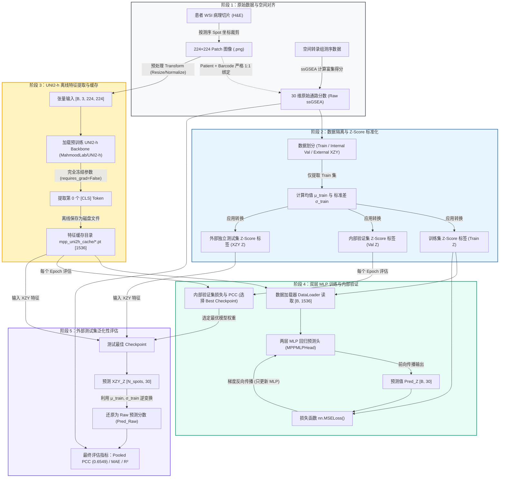
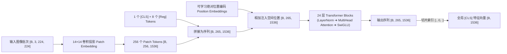
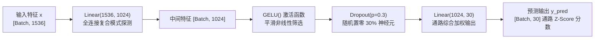

# MPP2 基线方案与 UNI2-H 特征传递深度学习指南

> **文档定位**：面向项目研发与学习者的教学指南  
> **核心主题**：MPP2 基线模型架构、UNI2-h 特征提取机制、端到端数据流转与 30 通路基因集分数预测  
> **关联代码**：[`extract_uni2h_mpp.py`](file:///D:/AI空间转录病理研究/PFMval_new/extract_uni2h_mpp.py), [`uni2h/uni2h_utils.py`](file:///D:/AI空间转录病理研究/PFMval_new/uni2h/uni2h_utils.py), [`train_mpp_uni2h_mlp.py`](file:///D:/AI空间转录病理研究/PFMval_new/train_mpp_uni2h_mlp.py)

---

## 一、核心专有名词速查表

为了让初学者与专业研究者都能准确理解技术内涵，以下每个术语均按照**【通俗大白话】➔【严谨专业定义】➔【通俗与专业对应关系】**的三段式进行解析：

| 专有名词 | 1. 通俗易懂的讲解（打比方） | 2. 严谨专业定义 | 3. 对应关系解析 |
| :--- | :--- | :--- | :--- |
| **Patch（图像瓦片/小块）** | 把一张巨大的高清病理全切片，用剪刀剪成许多个 $224 \times 224$ 像素的“小方块邮票”。 | 从高倍全切片病理图像（WSI）中裁剪出的局部正方形图像块，作为深度学习模型的最小视觉输入单元。 | “剪下来的小邮票”就是“Patch”，它解决了整张 WSI 像素过大无法直接塞进显卡的问题。 |
| **ssGSEA 基因集分数 (30 通路)** | 给细胞的 30 种不同功能（如代谢旺盛、免疫活跃、缺氧等）打出的 30 个“活力打分”（0~100分）。 | 单样本基因集富集分析（Single-Sample Gene Set Enrichment Analysis），用于计算单个空间转录组测序点在特定生物学通路基因集合上的富集得分。 | “细胞各种功能的活力打分”就是“ssGSEA 分数”，也是模型需要从病理切片中预测的目标标签。 |
| **UNI2-h 病理大模型** | 一位阅片千万张、经验极度丰富但不直接写最终结论的“病理学权威老教授”。 | 哈佛 MahmoodLab 基于上亿级多组织病理切片自监督预训练的视觉大模型（ViT-Large/Giant 变体），用作提取高质量形态特征的 Backbone。 | “老教授看切片并写出的诊断要点笔记”就是 UNI2-h 提取的特征向量；下游网络只需依据这份笔记做预测。 |
| **[CLS] Token 与 特征向量** | 把全班（256 个局部小方块）的所有讨论信息汇总后，由“班长”一个人代表全班写出的 1536 个数字的“全貌总结报告”。 | Vision Transformer 中的特殊类别标记（Classification Token），在多层自注意力机制中聚合全局 Patch 的上下文语义，最终输出形状为 $[1536]$ 的高维全局表征向量。 | “班长的总结报告”对应 $[CLS]$ Token，“报告里的 1536 条要点”对应 1536 维特征嵌入。 |
| **Register Tokens（寄存器标记）** | 老师给全班安排了 8 个“空抽屉”，专门用来存放那些容易让人分心的“废话和杂音”（如玻璃切片上的背景噪点、气泡）。 | ViT 中的无监督辅助标记（本项目设为 8 个），用于吸收图像中高频背景伪影和极端注意力权重，防止 $[CLS]$ Token 被背景无意义区域污染。 | “放废话杂音的空抽屉”就是“Register Tokens”，它让 $[CLS]$ 班长能专心记录真实的肿瘤病理结构。 |
| **Self-Attention（自注意力机制）** | 图像里的每一个局部细胞，都会主动去和切片里其他所有细胞“相互打听、互相对比”，判断彼此是否属于同一组织或肿瘤区域。 | Transformer 的核心计算层：通过计算 Query、Key 的点积相似度矩阵获得权重，对 Value 向量进行加权求和，动态捕捉全局长距离依赖关系。 | “细胞之间互相打听、建立联系”对应“$Q \times K^T$ 权重加权求和”的计算过程。 |
| **SwiGLU 激活函数** | 一个聪明的“水龙头阀门”：不仅判断信息该不该通过，还会根据内容动态调整阀门开多大。 | 结合了 SiLU（Swish）激活函数与门控线性单元（GLU）的前馈网络层，通过元素级相乘实现更平滑、非线性的特征过滤与表达。 | “动态调节开度的高级水龙头”对应“$x \cdot \text{SiLU}(Wx)$”的门控非线性变换。 |
| **两层 MLP 回归头** | 一个专门把老教授的 1536 条专业笔记，翻译成 30 种生物通路具体分数的“专业速记翻译员”。 | 由两层全连接线性层（$1536 \to 1024 \to 30$）加 GELU 激活和 Dropout 构成的轻量非线性回归预测网络。 | “翻译员的理解和输出”对应 MLP 网络的权重映射与 30 维连续数值预测。 |
| **Z-Score 标准化与严格隔离** | 考试前把大家的分数换算成离平均分差了几个标准差；且**绝对不能提前看隔壁班（验证集/外部测试集）的成绩单来算平均分**。 | 均值方差归一化：$z = \frac{x - \mu_{\text{train}}}{\sigma_{\text{train}}}$。强制仅使用训练集患者数据拟合 $\mu$ 和 $\sigma$，再冻结参数转换验证集与外部集。 | “不提前偷看别人成绩”对应“严格防止数据泄漏（Data Leakage）”的科学评估原则。 |
| **冻结 Backbone (Frozen Feature)** | 老教授的大脑和知识体系保持固定不变（不重新训练），我们只训练后面的翻译员（MLP）。 | 在训练下游回归任务时，设置 Backbone 的 `requires_grad=False`，仅通过离线提取并缓存特征，只更新 MLP 头的参数。 | “老教授经验固定不改”对应“梯度不反传至 UNI2-h”，大幅节省显存并防止小样本过拟合。 |

---

## 二、MPP2 基线方案：端到端数据流动与训练全景

### 1. 整体路线示意图



---

### 2. 数据传递与训练的 5 个关键阶段剖析

#### 阶段 1：原始数据采集与患者-空间 Spot 一一对应
- **图像端**：从食管癌切片中，以每个空间转录组测序 spot 坐标为中心，裁剪出 $224 \times 224$ 像素的 H&E 染色局部 patch 图像。
- **转录组端**：对每个 spot 的测序表达矩阵运行 ssGSEA（单样本基因集富集分析），计算出 30 条与肿瘤免疫、代谢、增殖密切相关的通路分数。
- **数据对齐修复**：在 MPP2 修复方案中，强制校验 `patient + barcode` 组合唯一性，彻底解决了跨患者标签错配的隐患。

#### 阶段 2：严格防泄漏的 Z-Score 标准化
- **科学红线**：严禁把所有患者混在一起算均值和方差，严禁偷看验证集和外部测试集（XZY）。
- **计算逻辑**：
  $$\mu = \frac{1}{N_{\text{train}}} \sum y_{\text{train}}, \quad \sigma = \sqrt{\frac{1}{N_{\text{train}}} \sum (y_{\text{train}} - \mu)^2}$$
  $$z = \frac{y - \mu}{\sigma}$$
- **参数应用**：计算出固定数组 $\mu_{\text{train}}$ 和 $\sigma_{\text{train}}$（形状均为 $[30]$）后保存为 JSON，后续所有内部验证集和外部 XZY 测试集均用这组固定参数进行标准化。

#### 阶段 3：UNI2-h 离线特征提取与 `.pt` 缓存
- **离线机制**：由于 UNI2-h 含有 24 层大型 Vision Transformer，若在每个训练 epoch 中实时前向计算，训练极其缓慢且浪费 GPU 显存。
- **操作流程**：运行 [`extract_uni2h_mpp.py`](file:///D:/AI空间转录病理研究/PFMval_new/extract_uni2h_mpp.py)，将每个 patch 图像输入冻结的 UNI2-h，提取出 1536 维的 `[CLS]` 向量，以单个 `.pt` 文件（形状 `[1536]`）保存在磁盘 `mpp_uni2h_cache/` 目录下。

#### 阶段 4：双层 MLP 训练与反向传播
- **极速训练**：训练脚本 [`train_mpp_uni2h_mlp.py`](file:///D:/AI空间转录病理研究/PFMval_new/train_mpp_uni2h_mlp.py) 只需从磁盘并发加载 1536 维向量，送入轻量 MLP。
- **早停机制**：在训练集上计算 MSE 损失并反传梯度，在内部验证集上监控 Loss / PCC，自动保存表现最优的 Checkpoint。

#### 阶段 5：外部独立评估与逆标准化
- 加载最佳 Checkpoint，对完全未参与训练的外部患者（XZY）的 patch 特征进行预测，得到预测的 $z_{\text{pred}}$。
- 逆变换公式：$y_{\text{pred\_raw}} = z_{\text{pred}} \cdot \sigma_{\text{train}} + \mu_{\text{train}}$。
- 计算最终的 Pooled Pearson 相关系数（修复后基线达到 **0.6549**）、Raw MAE 和 Raw R²。

---

## 三、UNI2-H 深度拆解：网络架构与高维特征提取

### 1. UNI2-h 的网络架构规格表

UNI2-h 是哈佛医学院 MahmoodLab 开发的病理巨型模型（基于 `ViT-H/14-reg8` 架构变体）：

| 架构参数 | 参数值 | 深入解释 |
| :--- | :--- | :--- |
| **输入分辨率 (`img_size`)** | $224 \times 224$ | 接收标准正方形病理 patch 图像，通道数为 3 (RGB) |
| **瓦片大小 (`patch_size`)** | $14 \times 14$ | 将 $224 \times 224$ 图像切分成 $16 \times 16 = 256$ 个互不重叠的空间子区域 |
| **隐藏层嵌入维度 (`embed_dim`)** | **1536** | 每个 patch 以及 CLS 向量在模型内部的特征表示长度 |
| **Transformer 层数 (`depth`)** | **24 层** | 24 个连续串联的 Transformer Encoder Block，逐层深化抽象 |
| **多头自注意力头数 (`num_heads`)** | **24 个头** | 每个注意头维度为 $1536 / 24 = 64$，多头并行捕捉不同组织学特征 |
| **寄存器标记数 (`reg_tokens`)** | **8 个** | 专门吸收背景噪点与极端权重的寄存器 Token |
| **总 Token 序列长度** | **265 个** | $1 \text{ 个 [CLS]} + 8 \text{ 个 Register} + 256 \text{ 个 Patch} = 265$ |
| **前馈网络架构 (`mlp_layer`)** | **SwiGLUPacked** | 结合 SiLU 门控线性单元的前馈网络，非线性表征能力更强 |
| **激活函数 (`act_layer`)** | **SiLU (Swish)** | $f(x) = x \cdot \text{sigmoid}(x)$，相比 ReLU 梯度更平滑 |

---

### 2. 在每个配置与层级中，它具体提取了什么信息？

UNI2-h 的 24 层网络遵循视觉特征**“由浅入深、由局域到宏观”**的阶梯式提取规律：

```
[原始图像 224×224] 
   │
   ▼ (第 1 ~ 6 层：浅层低阶特征)
[提取底层纹理] ➔ 边缘线条、细胞膜边界、染色深浅 (H&E 色调基底)、颜色对比度
   │
   ▼ (第 7 ~ 16 层：中层细胞学特征)
[提取细胞形态] ➔ 细胞核大小、核质比、核仁形态、细胞排列密度、核异型性
   │
   ▼ (第 17 ~ 24 层：深层微环境与组织学架构)
[提取高阶全局语义] ➔ 肿瘤实质区 vs 间质纤维区、浸润边界、腺管结构形成、淋巴细胞浸润程度
   │
   ▼ (最终汇聚到 [CLS] Token)
[1536 维全局病理形态特征向量]
```

- **浅层（1-6 层）**：关注像素级局部模式，辨别胶原纤维走向、红细胞与基质边缘。
- **中层（7-16 层）**：开始感知细胞级别的空间排列，捕捉恶性肿瘤细胞特有的异型性与核分裂象。
- **深层（17-24 层）**：利用全局注意力整合全切片宏观结构，理解组织微环境的交互状态（如免疫细胞是否浸润到癌巢周围）。

---

### 3. 每个 Patch 从输入到 1536 维特征的逐层提取步骤



#### 步骤 1：Patch 切分与线性投影（Patch Embedding）
- **输入张量尺寸解释 $[B, 3, 224, 224]$**：
  - **`B`（Batch Size，批次大小）**：指单次同时送入 GPU 进行并行前向计算的图像切片数量（例如 $B=16$ 或 $B=32$）。深度学习借助批处理充分利用显卡多核心并行加速，而非单张逐一处理。
  - **`3`**：图像通道数（RGB 三个颜色通道）。
  - **`224, 224`**：单张局部病理切片的高（Height）与宽（Width）像素值。
- **切分机制**：
  - 模型使用卷积核大小为 $14 \times 14$、步长为 14、输出通道为 1536 的二维卷积层（线性投影）。
  - 将 $224 \times 224$ 图像切分成 $\frac{224}{14} \times \frac{224}{14} = 16 \times 16 = 256$ 个微小 Sub-patch。
  - 每个小 Patch（包含 $14 \times 14 \times 3 = 588$ 个像素数值）被直接映射为一个 1536 维的初始向量。此时张量形状为 $[B, 256, 1536]$。

> [!NOTE]
> **重要认知澄清：UNI2-h 是单个 Patch 内的融合，不能实现跨 $224 \times 224$ 切片的 WSI 全局自注意力交融**  
> UNI2-h 是一个 **Patch-level（单切片局部视野）** 的特征提取器。它在单个 $224 \times 224$ 切片内部通过 Transformer 将 256 个 $14 \times 14$ 小块进行充分的自注意力交互融合；但**它无法在整张 WSI 上让成千上万个 $224 \times 224$ 切片之间相互进行自注意力交互**（因为整张 WSI 若有 20,000 个切片，直接做 $O(N^2)$ 全局自注意力会导致显存瞬间爆炸）。跨切片的全局空间交融必须由下游模型（如 Phase 3 的 MIL 或图神经网络 GNN/GAT）来完成。

#### 步骤 2：特殊 Token 拼接与位置编码注入
- **拼接特殊 Token**：在 256 个 Patch Token 前方拼接 **1 个可学习的 `[CLS]` Token** 以及 **8 个 `[Register]` Tokens**：
  $$\text{序列总长度} = 1 + 8 + 256 = 265$$
  拼接后的张量形状变为 $[B, 265, 1536]$。
- **1 个可学习 `[CLS]` Token 的核心作用**：
  - **角色**：全图信息的“总代表 / 班长”。
  - **机理**：256 个局部 Patch Token 各自只代表局部的微小组织（如某一处的细胞核或胶原），没有一个 Token 天然代表整张图。在 24 层 Transformer 计算中，`[CLS]` 通过自注意力不断向其他 256 个局部 Token“收集信息并加权汇总”。
  - **“可学习”含义**：初始时它是一个随机初始化的 1536 维向量，在数亿张病理图像的大规模自监督预训练中随着梯度不断更新，学会了“如何最有效地从 256 个局部切片中提炼出最具代表性的全局病理形态表征”。
- **8 个 Register Tokens（寄存器标记）的核心作用**：
  - **角色**：专门存放背景无用杂音的“垃圾桶 / 缓存抽屉”。
  - **机理（DINOv2 / UNI2-h 关键创新）**：病理切片常含有大片纯白玻片背景或无细胞组织，标准 ViT 在处理这些无意义区域时容易产生异常聚集的“注意力尖峰伪影（Attention Spikes）”。引入 8 个无监督 Register Token 后，模型会自动将背景无用高频噪声“倾倒/分流”至寄存器中暂存，从而防止 `[CLS]` 和正常组织 Token 被背景噪声污染。
- **注入位置编码（Position Embedding）**：将形状为 $[1, 265, 1536]$ 的可学习绝对位置向量与序列相加，赋予模型二维空间网格相对方位感知力。

#### 步骤 3：24 层 Transformer Block 深度自注意力与 SwiGLU 变换
在每一层 Transformer Block 内部，数据经历两次子层计算与残差连接：
1. **多头自注意力层（Multi-Head Self-Attention）**：
   - 输入向量经 LayerNorm 后生成 Query ($Q$)、Key ($K$)、Value ($V$)，拆分为 24 个 Head（每个 Head 维度为 64）。
   - 计算注意力得分：$\text{Attention}(Q, K, V) = \text{Softmax}\left(\frac{Q K^T}{\sqrt{64}}\right) V$。
   - `[CLS]` Token 与所有 256 个局部 Patch 以及 8 个 Register 充分交换信息。
   - 完成第一次残差连接：$x = x + \text{MHA}(\text{LN}(x))$。
2. **SwiGLU 前馈网络层（Feed-Forward Network）**：
   - 经 LayerNorm 后进入门控前馈网络，通过 SiLU 激活函数门控相乘：$\text{SwiGLU}(x) = (x W_1) \cdot \text{SiLU}(x W_2) W_3$。
   - 完成第二次残差连接：$x = x + \text{SwiGLU}(\text{LN}(x))$。

#### 步骤 4：提取第 0 位 [CLS] Token 作为高维病理特征
- 经过 24 层充分交互后，输出形状仍为 $[B, 265, 1536]$。
- 代码执行切片：`cls_tokens = all_tokens[:, 0, :]`，提取第 0 位的 `[CLS]` 向量，得到最终形状为 **$[B, 1536]$** 的紧凑高维特征，保存为 `.pt` 缓存文件。

---

## 四、特征流动到双层 MLP：30 通路基因集分数预测

### 1. 为什么采用“冻结 Backbone + 轻量 MLP”的架构？
1. **防止小样本灾难性过拟合**：训练集仅有数例患者，若端到端微调 6 亿参数的 UNI2-h，模型会迅速记住特定患者切片的染色批次噪声并丧失泛化性（此前 LoRA $r=8$ 实验导致外部泛化指标下降正是此原因）。
2. **极高计算效率**：仅需提取一次 $[1536]$ 维特征缓存到磁盘，后续仅训练 1.6M 参数的轻量 MLP，秒级收敛。

---

### 2. 双层 MLP 回归头（MPPMLPHead）的数学定义与逐层流转

在 [`train_mpp_uni2h_mlp.py:L99-L118`](file:///D:/AI空间转录病理研究/PFMval_new/train_mpp_uni2h_mlp.py#L99-L118) 中，模型定义如下：

```python
class MPPMLPHead(nn.Module):
    """UNI2-h CLS [1536] → 2 层 MLP → 30 通路预测。
    保持 Linear → GELU → Dropout → Linear 两层结构。
    """
    def __init__(self, in_dim: int = 1536, hidden: int = 1024,
                 out_dim: int = 30, dropout: float = 0.3):
        super().__init__()
        self.head = nn.Sequential(
            nn.Linear(in_dim, hidden),   # 1536 -> 1024
            nn.GELU(),                   # 高斯误差线性单元激活
            nn.Dropout(dropout),         # 丢弃率 0.3
            nn.Linear(hidden, out_dim),  # 1024 -> 30 (输出 30 个通路分数)
        )

    def forward(self, x: torch.Tensor) -> torch.Tensor:
        return self.head(x)
```



#### 从 1536 维到 30 维的逐步计算与特征交互：

1. **第一步：复合病理形态模式探测（$1536 \to 1024$ 线性映射）**
   - **数学公式**：$z_1 = W_1 x + b_1$，其中 $W_1 \in \mathbb{R}^{1024 \times 1536}, b_1 \in \mathbb{R}^{1024}$。
   - **交互机理**：隐层中的每个神经元都维护着一个 1536 维的权重向量，对输入的 1536 维病理特征进行全局线性加权。每一个神经元实质上是一个**“复合病理模式探测器”**（例如：某个神经元同时加权细胞核深染度与核浆比特征，专门响应“高增殖肿瘤癌巢”；另一个神经元专门响应“富纤维间质与免疫浸润”）。
2. **第二步：平滑非线性特征筛选（GELU 激活）**
   - **数学公式**：$a_1 = \text{GELU}(z_1) = z_1 \cdot \Phi(z_1)$。
   - **交互机理**：赋予模型非线性拟合能力。相比 ReLU 直接在 0 处截断，GELU 在负值区域具备平滑的非零渐近导数，允许弱负相关的病理模式依然能微弱回传梯度，利于连续型基因表达分数的回归。
3. **第三步：神经元鲁棒解耦（Dropout $p=0.3$）**
   - **交互机理**：训练时随机置零 30% 的神经元激活值，迫使 1024 个探测器不过度相互依赖，独立捕捉稳健的病理-转录组关联。
4. **第四步：通路级综合打分映射（$1024 \to 30$ 最终输出）**
   - **数学公式**：$\hat{y} = W_2 \tilde{a}_1 + b_2$，其中 $W_2 \in \mathbb{R}^{30 \times 1024}, b_2 \in \mathbb{R}^{30}$。
   - **交互机理**：30 个输出神经元分别对应 30 条生物学通路。每个通路神经元将 1024 种病理形态探测结果按照生物学相关性进行二次加权汇总（例如：缺氧通路 Hypoxia 重度加权组织坏死与微血管畸变神经元，免疫通路重度加权淋巴浸润神经元），最终输出 30 个连续的 Z-score 预测值。

#### 1536 维特征中使用了什么信息 vs 导致了什么信息丢失？

- **有效利用的信息**：
  - **细胞核异型性、核浆比与分裂象** ➔ 映射到细胞周期（Cell Cycle）、DNA 修复、Myc 等肿瘤增殖通路。
  - **淋巴细胞/巨噬细胞浸润密度** ➔ 映射到干扰素（IFN-$\alpha/\gamma$）、炎症反应、IL6-JAK-STAT3 等免疫微环境通路。
  - **成纤维细胞与胶原沉积走向** ➔ 映射到上皮-间质转化（EMT）、TGF-$\beta$、血管生成等侵袭间质通路。
- **可能导致的信息丢失**：
  1. **极端降维瓶颈丢失**：从 1536 维大幅压缩至 30 维，不可避免地丢弃了大量与这 30 条通路正交的细微病理形态信息（如细胞质颗粒感、非肿瘤间质背景微结构）。
  2. **空间邻域拓扑信息彻底丢失（最大局限）**：基线 MLP 采用单个 Spot 独立前向，完全割裂了该 spot 与周围相邻 spot 之间的组织连续性与微环境空间拓扑。
  3. **多任务共享冲突（负迁移）**：30 条通路共享相同的 1024 维隐层，若某两条通路的形态驱动因素相互对抗，共享网络可能会相互妥协，导致个别通路的预测灵敏度受损。

---

### 3. LayerNorm 详解与历史代码证据

#### (1) 什么是 LayerNorm？为什么在回归任务中将其移除？
- **定义**：层归一化（Layer Normalization），在单个样本的特征维度上计算均值和标准差并强制缩放：$\text{LN}(x) = \frac{x - \mu}{\sqrt{\sigma^2 + \epsilon}} \odot \gamma + \beta$。
- **移除原因**：在分类任务中 LayerNorm 能稳定训练；但在**连续型 Z-Score 回归预测**中，通路的表达存在自然的极端值（如极高活性的 $+3.5$ 或极低沉默的 $-2.5$）。LayerNorm 会强制把输入方差压平，**压缩了回归模型的动态输出范围（Dynamic Range Compression）**，导致极端活跃通路的预测值严重收缩偏向均值（方差被压扁）。

#### (2) 原始文件证据与历史沿革
1. **历史版本中带有 LayerNorm 的原始实现**：
   见 [`uni2h/uni2h_utils.py:L357-L363`](file:///D:/AI空间转录病理研究/PFMval_new/uni2h/uni2h_utils.py#L357-L363)
   ```python
   self.net = nn.Sequential(
       nn.LayerNorm(feature_dim),  # 早期设计的 LayerNorm
       nn.Linear(feature_dim, hidden_dim),
       nn.GELU(),
       nn.Dropout(dropout),
       nn.Linear(hidden_dim, output_dim),
   )
   ```
2. **MPP2 正式基线中移除 LayerNorm 的代码与注释**：
   见 [`train_mpp_uni2h_mlp.py:L99-L105`](file:///D:/AI空间转录病理研究/PFMval_new/train_mpp_uni2h_mlp.py#L99-L105)
   ```python
   class MPPMLPHead(nn.Module):
       """UNI2-h CLS [1536] → 2 层 MLP → 30 通路预测。
       Codex 审核：去掉 LayerNorm（压缩回归动态范围，不利极端 z-score），
       保持 Linear→GELU→Dropout→Linear 两层 MLP 结构。
       """
   ```
3. **方案审计与规范文件**：
   见 [`01_指南与解读/分析报告/MPP2_LoRA实验构建方案_Codex_20260711.md:L140`](file:///D:/AI空间转录病理研究/PFMval_new/01_指南与解读/分析报告/MPP2_LoRA实验构建方案_Codex_20260711.md#L140)
   > “回归头必须与 `MPPMLPHead` 完全一致，不添加 LayerNorm、位置编码、token pooling 或额外支路。”

---

## 五、深入探索：模型是否使用了 MIL（多实例学习）机制？

在本项目中，关于 MIL 机制的使用存在清晰的**阶段划分与尺度定位**：

```
【整个切片 WSI】
   │
   ├── Phase 2（当前 MPP2 基线）：单个 Spot / Patch 独立预测 ➔ 【无 MIL 机制】
   │     ├─ 224×224 内部（14×14 小 patch）：使用 ViT 自注意力 (Self-Attention)
   │     └─ 224×224 切片之间：各 spot 独立输入 MLP 回归，切片间互不连通
   │
   └── Phase 3（下游临床治疗响应预测）：全切片聚合 ➔ 【在 224×224 切片之间使用 MIL】
         └─ 输入：整张 WSI 切片中数千个 224×224 patch 特征 + 30 维虚拟通路分数
         └─ 机制：CLAM / TransMIL / DTFD-MIL 在【224×224 切片之间】进行注意力加权聚合
         └─ 输出：患者级单一切片向量 ➔ 预测 pCR / non-pCR 治疗响应
```

### 尺度对比速查表：

| 阶段 / 任务 | 涉及计算尺度 | 使用的算法机制 | 具体作用 |
| :--- | :--- | :--- | :--- |
| **Patch 内部 (Intra-patch)** | 单个 $224 \times 224$ 内部的 $256$ 个 $14 \times 14$ 小块 | **Vision Transformer 多头自注意力 (Self-Attention)** | 提取单个局部视野的高维病理形态表征 ($[1536]$ 维) |
| **Phase 2 空间转录组预测 (MPP2)** | 单个 $224 \times 224$ 切片独立前向 | **两层 MLP 回归头 (Point-wise Regression)** | 映射出单个测序 Spot 的 30 维通路分数（切片间无交互） |
| **Phase 3 下游临床疗效 (Patient-level)** | 整张 WSI 切片中的**成百上千个 $224 \times 224$ 切片之间** | **多实例学习机制 (MIL, 如 CLAM / DTFD-MIL / TransMIL)** | 将千张切片加权聚合成患者级向量，预测 pCR 治疗响应 |

---

## 六、项目核心代码索引

| 模块名称 | 文件路径与关键行号 | 功能说明 |
| :--- | :--- | :--- |
| **特征提取脚本** | [`extract_uni2h_mpp.py:L76-L82`](file:///D:/AI空间转录病理研究/PFMval_new/extract_uni2h_mpp.py#L76-L82) | 调用 `forward_features` 提取 `all_tokens[:, 0, :]` 并保存 `.pt` 缓存 |
| **UNI2-h 结构配置** | [`uni2h/uni2h_utils.py:L50-L78`](file:///D:/AI空间转录病理研究/PFMval_new/uni2h/uni2h_utils.py#L50-L78) | 定义 ViT-H/14 结构参数、SwiGLUPacked 与 8 个 Register Tokens |
| **两层 MLP 回归头** | [`train_mpp_uni2h_mlp.py:L99-L118`](file:///D:/AI空间转录病理研究/PFMval_new/train_mpp_uni2h_mlp.py#L99-L118) | 定义 Linear(1536,1024) -> GELU -> Dropout(0.3) -> Linear(1024,30) 结构 |
| **训练与评估主循环** | [`train_mpp_uni2h_mlp.py:L124-L150`](file:///D:/AI空间转录病理研究/PFMval_new/train_mpp_uni2h_mlp.py#L124-L150) | 训练循环、Loss 计算、反向传播与指标统计 |
| **严格 Z-score 拟合防泄漏** | [`scripts/rebuild_zscore_from_manifest.py:L233-L260`](file:///D:/AI空间转录病理研究/PFMval_new/scripts/rebuild_zscore_from_manifest.py#L233-L260) | 仅在训练集上计算均值方差并保存参数 JSON，防止数据泄漏 |
| **Phase 3 MIL 参考实现** | [`reference_implementations/phase3_clam_escc_20260801/models/model_clam.py`](file:///D:/AI空间转录病理研究/PFMval_new/reference_implementations/phase3_clam_escc_20260801/models/model_clam.py) | 跨 $224 \times 224$ 切片间的 CLAM 多实例学习注意力聚合实现 |
