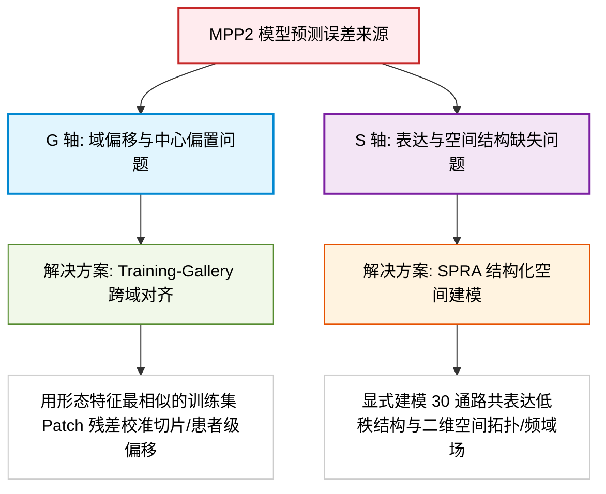
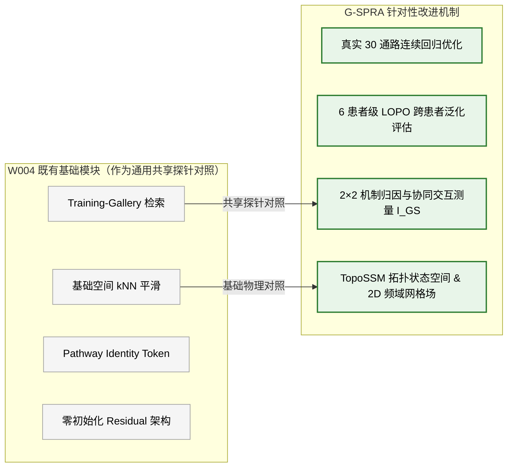
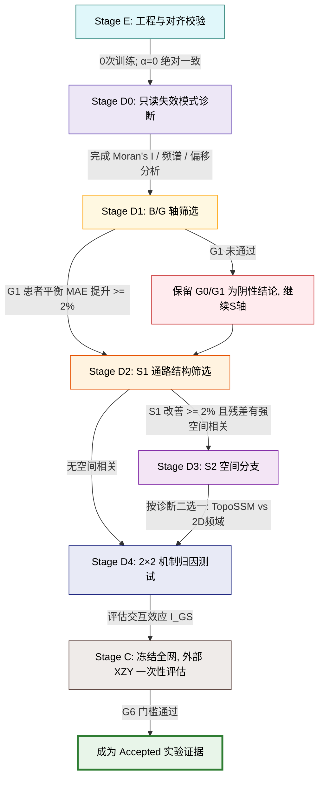
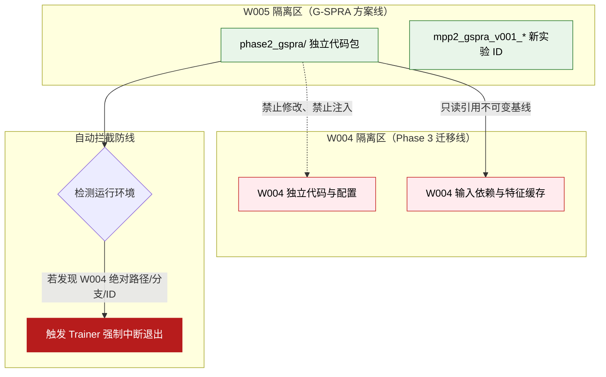

# MPP2 双机制完整方案 (G-SPRA) 深度解读与学习指南 v2

> **最新关联源方案文件**：[`project_state/plans/mpp2_dual_mechanism_gallery_spra_review_draft_v002_20260806.md`](file:///D:/AI空间转录病理研究/PFMval_new/project_state/plans/mpp2_dual_mechanism_gallery_spra_review_draft_v002_20260806.md)  
> **历史关联版本**：[`project_state/plans/mpp2_spatial_pathway_residual_adapter_review_draft_20260805.md`](file:///D:/AI空间转录病理研究/PFMval_new/project_state/plans/mpp2_spatial_pathway_residual_adapter_review_draft_20260805.md)（已由 v2 替代，保留历史备查）  
> **文档定位**：学习指南 / 方案解析（面向科研团队成员与初学者的通俗化、结构化解读）  
> **方案当前状态**：`review_draft_v2`（待审核） / `NOT RUN / pending_review`（未训练） / `NO-GO`（治理阻塞中）  
> **建议候选工作树**：`W005`（独立隔离工作树，严格只读核验 `W004`，严禁改动或抢占）  
> **更新日期**：2026-08-06

> [!NOTE]
> **W005 预留工作树与代码实施状况补充说明（2026-08-07）**：  
> 截至 2026-08-07，关于 `W005` 工作树与其对应的 G-SPRA 方案代码实施状况如下：
> 1. **工作树定位与注册状态**：`W005` 为项目注册表（`project_state/workspace_registry.json`）中下一个预留的独立永久工作树编号（`next_workspace_number: 5`），目前尚未在本地盘符正向创建实体目录，处于受保护待绑定状态。
> 2. **方案与授权准备**：绑定方案为 [`mpp2_dual_mechanism_gallery_spra_review_draft_v002_20260806.md`](file:///D:/AI空间转录病理研究/PFMval_new/project_state/plans/mpp2_dual_mechanism_gallery_spra_review_draft_v002_20260806.md)。依据 `DIR-20260806-002`，用户已授权未来新对话在显式指定并绑定 `W005` 后，采用“前端加载（Front-loaded）”方式，一次性在 `W005` 中独立包 `phase2_gspra/` 下完成全部候选、对照、训练、评估、诊断与打包代码及本地测试。
> 3. **与 W004 的代码重叠与新增实施界限**：
>    - **已在 W004 共享审计中确认存在的探针对照**：Training-Gallery 检索、空间 kNN 平滑、Pathway Identity Token 和零初始化 Residual。
>    - **W005 尚需创建的新增核心模块**：`phase2_gspra/` 独立包、真实 30 通路值 Patch/空间连续回归优化、6 患者级 LOPO 跨患者泛化评估线、2×2 机制归因与协同交互测量 $I_{GS}$、TopoSSM 拓扑状态空间与 Masked 2D 频域场。
> 4. **代码隔离断言**：W005 代码将包含硬性检查，检测到 W004 路径或分支即退出，严禁修改或污染 W004，确保两套实验逻辑与代码库严格解耦。


---

## 1. 方案更新演进：从单轴 SPRA 到双机制 G-SPRA

在 2026-08-05 的初版方案（v1）中，我们关注的核心是单一的“空间—通路残差适配器（SPRA）”。经过严密的科学审查与对当前 `W004` 既有代码的重叠审计，方案升级为 **v2 双机制完整方案**：

推荐工作名称：**G-SPRA（Gallery-aligned Spatial–Pathway Residual Adapter，图库对齐的空间—通路结构化残差适配器）**

### 为什么需要升级为 G-SPRA 两个正交机制轴？
科研团队发现，MPP2 模型预测误差的来源实际上包含两个不同层次的问题：



1. **G 轴（Training-Gallery 跨域对齐）**：
   - **痛点**：不同患者或切片之间存在形态域（Morphology Domain）、图像染色差异及预测标度的全局截距偏移。
   - **机制**：构建训练集图库（Gallery），通过图像形态特征检索极相似的邻居 Patch（$K=5$），利用训练残差校准新患者的全局偏移。
2. **S 轴（SPRA 结构化空间建模）**：
   - **痛点**：普通的 30D MLP 在局部微观层面上没有显式利用通路身份（Pathway Identity）以及空间二维上下文（Spatial Context）。
   - **机制**：先通过低秩通路查询（Pathway-Query）捕捉通路依赖，再在残差诊断有强空间相关时接入拓扑（TopoSSM）或频域（Masked 2D Spectral）模块。

<details>
<summary><b>🔍 点击展开/折叠：G 轴与 S 轴深度拆解（原理、来源、前置知识与名词扩充）</b></summary>

### 1. 概念与专有名词详细含义
- **G 轴（Training-Gallery Alignment，图库跨域对齐轴）**：
  在病理图像分析中，由于不同切片的染色光照、扫描设备及患者个体基因表达基线的差异，模型预测出的 30 通路数值容易产生全局截距偏移（Domain Shift）。G 轴通过在训练集中建立由已证明极具代表性的 Patch 特征组成的“记忆图库（Gallery）”，为新测试 Patch 检索形态最相似的邻居，并借用这些邻居在训练时的已知真实误差（残差）来纠正新样本的预测偏移。
- **S 轴（SPRA Structural Modeling，空间—通路结构化残差建模轴）**：
  传统的 30D MLP 模型把 30 条生物通路简单地视作独立的 30 个数值，忽略了生物学中通路之间的低秩共表达关系（如多个免疫通路同时升高），也忽略了肿瘤微环境中细胞在物理二维空间中的拓扑连续性（如高表达区域在空间上是成片连续而非随机散落的）。S 轴显式利用通路 Identity Query 捕捉低秩关联，并接入空间拓扑（TopoSSM）或二维频域场（Masked 2D Spectral），专门学习这种结构化微观残差 $\Delta y$。
- **形态域偏移 (Morphology Domain Shift)**：
  指同一种病理特征在不同患者、不同切片或不同批次染色下，在 1536 维 UNI2-h 特征空间中产生的系统性位移。
- **低秩通路查询 (Low-Rank Pathway Query)**：
  将高维图像特征（1536 维）通过 30 个可学习的生物通路向量（Pathway Tokens）进行软投影，将注意力集中在 30 维低秩子空间上。
- **零初始化残差 (Zero-Initialized Residual)**：
  在残差分支接入处将初始权重或门控设置为 0。在训练开始时，模型输出 100% 保持在纯 Baseline 状态；只有当残差模块确实能够降低 Loss 时，分支权重才会逐渐变大，起到物理保底作用。

### 2. 拆分为 G 轴与 S 轴的基本原理
为什么不能用单个模型一次性解决，而是要明确划分出正交的 G 轴与 S 轴？
1. **尺度解耦（宏观 vs 微观）**：
   - **G 轴属于“宏观切片/患者级”校准**：解决的是预测整体向上抬高或向下压低的截距偏移，不需要复杂的神经网络重训练，通过非参数图库检索即可瞬间修正；
   - **S 轴属于“微观 Patch/结构级”建模**：解决的是局部组织微环境中通路共表达与空间拓扑平滑问题，需要靠结构化残差模块学习。
2. **消融解耦与故障定位**：
   将两者拆开后，可通过 2×2 消融实验准确归因性能提升是来自“图库检索纠偏（G 轴效应）”还是“真正的空间生物学建模（S 轴效应）”，防止把简单的域偏移纠正误当作复杂空间模型的功劳。

### 3. 思路来源
- **G 轴思路来源**：借鉴了计算机视觉与医学图像领域中的**非参数图库记忆检索 (Non-parametric Memory Gallery)**、**kNN 邻居分类/回归器** 以及 **无监督域适应 (Domain Adaptation)**。在少样本病理任务中，检索同类病理形态的已知经验比让深度神经网络硬记更具泛化性。
- **S 轴思路来源**：借鉴了空间转录组学（Spatial Transcriptomics, SpT）中的 **生物通路低秩共表达模块 (Pathway Co-expression Modules)**、地理空间统计学中的 **空间自相关性 (Moran's I / 莫兰指数)**，以及近年深度学习中的 **拓扑状态空间模型 (Mamba / TopoSSM)** 与 **二维频域滤波 (2D FFT / DCT Spectral Filter)**。

### 4. 理解必须的前置知识
- **前置知识 1：病理切片多实例与大模型特征 (Instance & UNI2-h Feature)**
  一张 WSI 切片被切成数千个 $256 \times 256$ 的 Patch，每个 Patch 经由病理大模型 UNI2-h 提取出 1536 维的向量 $h_i$。
- **前置知识 2：ssGSEA 30 条通路表达分数与 z-score**
  空间转录组测序计算出的 30 条 Hallmark 生物通路表达量，经 z-score 标准化后作为回归目标真值 $y_i \in \mathbb{R}^{30}$。
- **前置知识 3：残差学习机制 ($\hat{y} = \text{Base} + \Delta y$)**
  主模型先给出一个基础预测值 $\hat{y}^{\text{base}}$（如简单 MLP 的输出），适配器不重新预测完整的 30 维数值，而仅仅去预测与真值之间的差值 $\Delta y$。
- **前置知识 4：全因子消融与交互效应分析 (2×2 Factorial Analysis)**
  在统计学与科学实验中，同时引入两个自变量（G 轴 ON/OFF，S 轴 ON/OFF），通过测量组合效果与各自独立效果之差 $I_{GS} = B_{GS} - B_G - B_S + B_{B0}$ 来判定两者是协同、独立还是抵消。

</details>

---

## 2. 专有名词全解析（Glossary v2 增补）

下表包含了升级版方案涉及的完整专有名词解释：

| 专有名词 | 英文全称 / 原名 | 通俗解释与直观比喻 |
| :--- | :--- | :--- |
| **G-SPRA** | Gallery-aligned SPRA | **图库对齐的空间—通路结构化残差适配器**。整合了 G 轴（形态图库校准）与 S 轴（空间通路残差）的双机制模型。 |
| **G 轴** | Training-Gallery Alignment | **图库跨域对齐轴**。从训练集中寻找形态最像的“参考病例”，用已知残差修正预测中心的偏移。 |
| **S 轴** | SPRA Structural Modeling | **结构化残差建模轴**。专注建模 30 条生物通路内部低秩依赖与二维空间连续性。 |
| **形态域偏移** | Morphology Domain Shift | **染色/设备截距偏置**。不同切片或患者在特征空间中的系统性位移，导致预测值的全局上下偏置。 |
| **低秩通路查询** | Low-Rank Pathway Query | **30 通路软投影**。用 30 个可学习的通路身份 token 与高维图像特征做注意力交互，提取低秩共表达结构。 |
| **零初始化残差** | Zero-Initialized Residual | **安全保底机制**。初始时将残差分支门控设为 0（绝对保底 Baseline），训练中仅在能降低 Loss 时才逐渐放大。 |
| **B0** | Fold-Specific Baseline Control | **分折特定基线模型**。LOPO 验证中，专门针对每个训练折重新训练的基线 MLP（防止直接借用全量 Accepted 产生数据泄漏）。 |
| **G0 / G1** | Global / KNN Gallery | `G0` 表示仅按训练集全局平均残差做修正；`G1` 表示基于 KNN 形态特征相似度做精准邻居残差校准。 |
| **2×2 机制归因** | 2x2 Factorial Attribution | 科学消融实验方法。同时评估 B0、G1、S* 和 GS* 四组，严格测量 G 轴与 S 轴的独立主效应以及协同交互效应 $I_{GS}$。 |
| **W004 重叠审计** | W004 Overlap Audit | 一项严谨的科研治理规则：确认哪些模块已在 `W004` 中被包含，并在本方案中将其归类为**通用共享探针对照**。 |
| **TopoSSM** | Topology State Space Model | **拓扑状态空间模型**。S 轴候选 A：在组织真实二维坐标图（KNN）上，利用类似 Mamba 的 SSM 模型捕捉长程拓扑依赖。 |
| **Masked 2D Spectral** | Masked 2D Spectral Field | **带掩码的二维频域场**。S 轴候选 B：把 Patch 投射到二维空间网格上，用 2D FFT/DCT 滤波提取空间平滑规律。 |
| **LOPO** | Leave-One-Patient-Out | **留一患者交叉验证**。轮流将 1 位患者留作验证集（6 患者共 6 折），彻底消除患者内部 Patch 的跨集泄漏。 |
| **Moran's I** | Moran's I (莫兰指数) | 空间自相关统计量。评估“物理距离相近的 Patch，预测残差是否具有相似性”。 |
| **XZY 队列** | External XZY Validation Cohort | 外部盲测患者集。严格封存，禁止在任何参数调优中读取，仅用于最终一次性评估。 |

---

## 3. 项目探索脉络与“W004 重叠审计”

在项目整体研发推进中，团队对各种有效算法模块进行了系统审计与分类。

针对 `W004` 代码库中已存在的 Gallery 检索、空间 KNN 平滑、通路 Identity Token 以及零初始化残差等模块，G-SPRA 方案进行了清晰的探索定位划定：



* **通用共享探针对照**：Gallery 跨域校准、基础空间 KNN 平滑、零初始化残差。
* **本项目分阶段探索的针对性改进机制**：
  1. 区别于分类任务，聚焦于**真实 30 通路值的 Patch/空间回归**；
  2. 采用严格的 **6 患者 LOPO 交叉验证** 评估跨患者泛化能力；
  3. **2×2 机制分解**：定量回答 G 轴（域偏移）与 S 轴（空间通路）是独立可加、相互协同还是相互冲突；
  4. 引入 **TopoSSM（拓扑状态空间模型）** 与 **Masked 2D Spectral Field（二维频域场）** 建模切片级空间场。

---

## 4. 双机制输出公式与 2×2 归因矩阵

### 4.1 统一数学形式

对于给定的 Patch $i$：

1. **G 轴单独校准（G-only）**：
   $$\hat{y}_i^G = \hat{y}_i^{\text{base}} + \lambda_G \cdot \frac{1}{K} \sum_{j \in \mathcal{N}_G(i)} (y_j - \hat{y}_j^{\text{base}})$$
   *基于形态特征在训练集中检索 $K=5$ 个最相似邻居，用已知训练残差校准中心偏置。*

2. **S 轴单独建模（S-only）**：
   $$\hat{y}_i^S = \hat{y}_i^{\text{base}} + \alpha \cdot g_i \odot \Delta y_i$$
   *利用通路 Query 与空间拓扑/频域网络输出结构残差 $\Delta y_i$。*

3. **G+S 双机制组合模型（GS）**：
   $$\hat{y}_i^{GS} = \mathcal{G}_{\text{train}}\left( \hat{y}_i^S, h_i \right)$$
   *先由 S 轴产生包含了空间通路结构的预测，再由仅使用训练集拟合的 Gallery 进行跨域微调。*

<details>
<summary><b>💻 点击展开/折叠：数学公式与项目代码实现（W004/G-SPRA 架构）的逐行深度映射</b></summary>

以下结合项目中已落地的底层算法模块（如 [`W004`](file:///D:/AI空间转录病理研究/PFMval_new_governed_workspaces/W004) 中的共享组件及 `G-SPRA` 设计），剖析数学公式在实际 Python / PyTorch 代码中的具体运用：

#### 1. 公式 1：G 轴单独校准代码落地解析
$$\hat{y}_i^G = \hat{y}_i^{\text{base}} + \lambda_G \cdot \frac{1}{K} \sum_{j \in \mathcal{N}_G(i)} (y_j - \hat{y}_j^{\text{base}})$$

- **变量与代码数据结构对应**：
  - $\hat{y}_i^{\text{base}}$：基线 MLP 输出向量 `y_base = mlp_baseline(h_i)`，形状为 `[Batch, 30]`。
  - $h_i$：Patch $i$ 的 1536 维 UNI2-h 特征向量 `h_i = features[i]`，形状为 `[1536]`。
  - $\mathcal{N}_G(i)$：图库中检索到的 Top-$K$ 邻居索引数组 `neighbor_indices`。
- **代码运算步骤**：
  1. **构建与存储图库 (Gallery Bank)**：
     训练阶段提取训练集所有 Patch 的图像特征 $H_{\text{train}} \in \mathbb{R}^{N_{\text{train}} \times 1536}$，并计算训练已知残差矩阵 $R_{\text{train}} = Y_{\text{train}} - \hat{Y}_{\text{train}}^{\text{base}} \in \mathbb{R}^{N_{\text{train}} \times 30}$（存储在 `GalleryMatcher` 类中）。
  2. **向量化距离检索**：
     ```python
     # 计算特征余弦相似度或欧式距离
     sim_matrix = torch.matmul(h_i_norm, H_train_norm.T) # [Batch, N_train]
     topk_sim, topk_idx = torch.topk(sim_matrix, k=5, dim=-1) # 获取 K=5 邻居
     ```
  3. **残差均值加权校准**：
     ```python
     # 提取邻居已知残差并求平均
     topk_residuals = R_train[topk_idx] # [Batch, K, 30]
     mean_residual = torch.mean(topk_residuals, dim=1) # [Batch, 30]
     
     # 公式最终输出 y_hat_G
     y_hat_G = y_base + lambda_G * mean_residual
     ```

---

#### 2. 公式 2：S 轴单独建模代码落地解析
$$\hat{y}_i^S = \hat{y}_i^{\text{base}} + \alpha \cdot g_i \odot \Delta y_i$$

- **变量与代码数据结构对应**：
  - $\Delta y_i$：结构化空间残差向量 `delta_y`，形状为 `[Batch, 30]`。
  - $g_i$：门控保护标量/向量 `gate_score`，取值区间为 $[0, 1]$，形状为 `[Batch, 1]` 或 `[Batch, 30]`。
  - $\alpha$：残差缩放可学习参数 `self.alpha`。
- **代码运算步骤**：
  1. **低秩通路查询与空间网络生成残差 $\Delta y_i$**：
     ```python
     # 1. 1536维映射到 30 通路 Token 空间
     pathway_tokens = self.pathway_query_proj(h_i) # [Batch, 30, D_token]
     
     # 2. 经过拓扑网络 TopoSSM (Mamba) 或 2D 频域网格 (Masked 2D FFT)
     spatial_context = self.spatial_backbone(pathway_tokens, coords) # [Batch, 30, D_token]
     
     # 3. 回归输出 30 维结构残差
     delta_y = self.residual_head(spatial_context) # [Batch, 30]
     ```
  2. **零初始化门控机制（Zero-Init Gate）**：
     ```python
     # 可学习门控参数初始设为负大数（如 -4.0），使得 sigmoid(-4.0) ≈ 0.018 保底
     gate_score = torch.sigmoid(self.gate_parameter)
     
     # 公式最终输出 y_hat_S
     y_hat_S = y_base + self.alpha * gate_score * delta_y
     ```

---

#### 3. 公式 3：G+S 双机制组合模型代码落地解析
$$\hat{y}_i^{GS} = \mathcal{G}_{\text{train}}\left( \hat{y}_i^S, h_i \right)$$

- **代码逻辑实现流程**：
  1. **第一阶段（S 轴结构前向传播）**：
     首先将 Patch 图像特征 $h_i$ 与空间坐标 `coords` 送入 S 轴网络，得到包含 30 通路共表达与空间拓扑信息的初步预测 `y_hat_S`。
  2. **第二阶段（G 轴基于 S 轴预测二次特征微调）**：
     在图库 `GalleryMatcher` 中，以 `y_hat_S` 及其图像特征 $h_i$ 作为双重索引，在训练集保留的二次校准残差库中做微调：
     ```python
     # 使用 S 轴预测输出与原始特征组合检索
     y_hat_GS = gallery_matcher.refine(y_hat_S, h_i, lambda_GS)
     ```

</details>

---

### 4.2 2×2 机制归因矩阵

为了证明两轴的独立性与互补性，方案设计了严格的 2×2 全因子消融矩阵：

| 机制轴组合 | Gallery OFF (无图库校准) | Gallery ON (有图库校准) |
| :--- | :--- | :--- |
| **S OFF (无空间残差)** | **B0** (Fold-Specific Baseline 基线) | **G1** (仅靠形态图库校准) |
| **S ON (有空间残差)** | **S\*** (仅靠通路空间残差) | **GS\*** (双机制组合模型) |

定义性能收益 $B = -\text{rawMAE}$，两者的交互协同效应 $I_{GS}$ 计算公式为：

$$I_{GS} = B_{GS} - B_G - B_S + B_{B0}$$

* $I_{GS} \approx 0$：说明两轴效果**独立可加**；
* $I_{GS} > 0$：说明两轴产生**互补协同作用**；
* $I_{GS} < 0$：警告两轴存在**功能冗余或相互干扰**（必须记录并分析）。

---

## 5. 升级版 7 阶段实验流水线（Stage E $\to$ D0 $\to$ D1 $\to$ D2 $\to$ D3 $\to$ D4 $\to$ C）

方案制定了严格的 7 阶段演进流水线，最大神经网络训练次预算控制在 **30 次** 以内。



### 各阶段核心任务与门槛表

| 阶段 | 核心任务 | 新增神经网络训练预算 | 核心通过条件 (GO Gate) |
| :--- | :--- | :---: | :--- |
| **Stage E** | 基础接口与输出绝对一致性校验 | 0 次 | `α=0` 时输出与 B0 **100% 逐元素一致**；通过 W004 防串线测试。 |
| **Stage D0** | 只读失效模式与残差空间/频域诊断 | 0 次 | 完整计算 Moran's I、半变异函数、频带能量与通路协方差有效秩。 |
| **Stage D1** | G 轴（Gallery 跨域校准）探针筛选 | 0 次（后处理） | G1 患者平衡 MAE 较 B0 改善 $\ge 2\%$，且 $4/6$ 患者同向改进。 |
| **Stage D2** | S1 通路结构残差筛选 | 6 次 (6-fold) | S1 患者平衡 MAE 改善 $\ge 2\%$，且显著跑赢等参数通用对照 S0。 |
| **Stage D3** | S2 空间模块（TopoSSM 或 2D 频域） | 6 次 (6-fold) | **仅诊断后二选一**；跑赢坐标打乱/频率破坏反事实对照。 |
| **Stage D4** | 2×2 机制分解与交互效应评估 | 0 次 | 计算交互系数 $I_{GS}$，明确报告 G 轴与 S 轴的主效应与协同性。 |
| **Stage C** | 外部 XZY 盲测集一次性最终验收 | 0 次（全冻结） | XZY MAE 相对基线 `1176.2114` 改善 $\ge 3\%$，PCC 不劣化。 |

---

## 6. W004 绝对隔离与安全规则

由于 `W004` 正在准备 Phase 3 任务，方案制定了更加严密的“隔离墙”规则：



1. **工作树与代码包独立**：仅在预留的 `W005` 工作树中新建 `phase2_gspra/` 独立包，严禁修改 W004 下的任何文件。
2. **硬防串线代码拦截**：新 Trainer 启动时会自动解析路径、分支和实验 ID，一旦命中 `W004` 关键字立刻报错中断。
3. **隔离结果与回填禁止**：即使 G-SPRA 方案在 Phase 2 取得显著胜利，也**绝不自动替换或回填 W004 的输入**。下游迁移必须单独立项申请。

---

## 7. 新手常见误区 FAQ v2

### Q1: 为什么要定义 B0 (Fold-Specific Baseline)？直接用现有的 Accepted Baseline 算 MAE 不行吗？
> **解答**：现有的 Accepted Baseline checkpoint（`20260711`）是在包含了当前开发集所有患者的数据上训练出来的。如果在 6-fold LOPO（留一患者交叉验证）中用这个既有 checkpoint 作为基线去评价留出的那名患者，就会产生严重的数据泄漏！因此，在 LOPO 的每一折中，我们必须**仅使用该折的 5 名训练患者**重新训练一个同结构的 MLP 作为公平比对基线（即 `B0`）。

### Q2: 既然 Gallery 校准在 W004 中已经有了代码，我们为什么还要在方案里测试 G1 呢？
> **解答**：这属于科学消融实验的需要。W004 关注的是分类任务（pCR/MPR），而本方案关注的是 30 通路连续回归。我们在 G-SPRA 中将 Gallery 定位为“共享探针”，目的是用极低成本（0 次神经网络训练）评估形态域偏移对 30 通路回归的影响，并为后文的 2×2 机制分解提供归因依据。

### Q3: 方案中的 $I_{GS}$ 如果算出来是负数，意味着什么？
> **解答**：如果交互系数 $I_{GS} < 0$，意味着同时使用 Gallery 校准和空间残差适配器时，两者的组合效果**反而不如**各自独立提升效果的简单相加。这说明“形态图库校准”与“空间频域平滑”可能在修正同一类误差（存在功能冗余），或者两者的修正向量方向存在冲突。这正是 2×2 机制归因测试的强大之处，能防止盲目组合模块。

---

## 8. 当前执行状态与审核决策点

当前方案处于 **`review_draft_v2 / NOT RUN / pending_review`** 状态，裁决为 **`NO-GO`**。

需要用户审核批准以下决策项后，方可创建 `W005` 并开启开发：

```text
[ ] 1. 是否接受将方案升级为 G-SPRA (G轴图库对齐 + S轴结构残差) 双机制正交路线？
[ ] 2. 是否确认 Gallery 与简单平滑仅作为共享探针/对照，项目重点放在 30 通路回归、LOPO 泛化与 2×2 机制归因？
[ ] 3. 是否同意使用独立工作树 W005，并遵守严格只读核验 W004 的硬隔离规则？
[ ] 4. 是否同意首轮仅开展 Stage E + D0 (0 次训练的工程校验与只读诊断)？
[ ] 5. 是否接受分阶段最大 30 次神经网络训练 attempt 的上限预算？
[ ] 6. 是否接受 Stage D3 空间模块必须“先诊断、再二选一 (TopoSSM vs 2D频域)”的规则？
```

---
*本指南基于 PFMval 治理规范编制，关联最新档案 `mpp2_dual_mechanism_gallery_spra_review_draft_v002_20260806.md`。*
