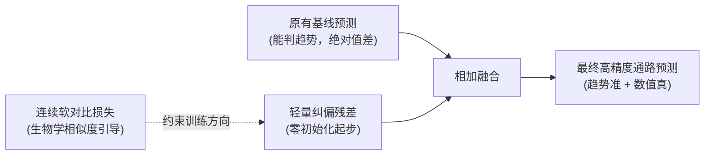
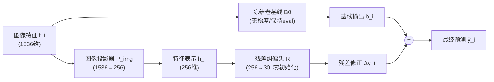
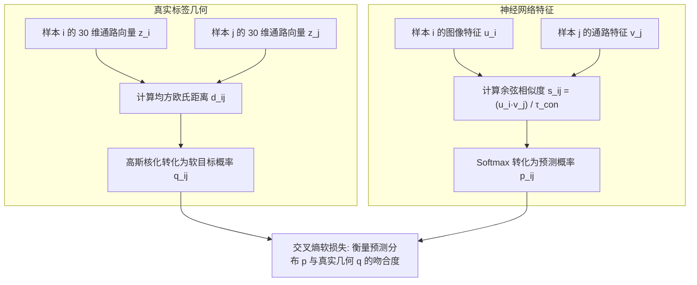
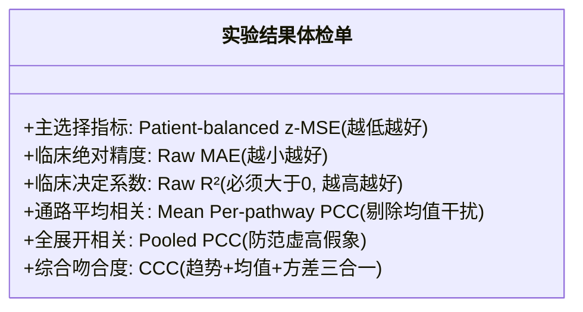
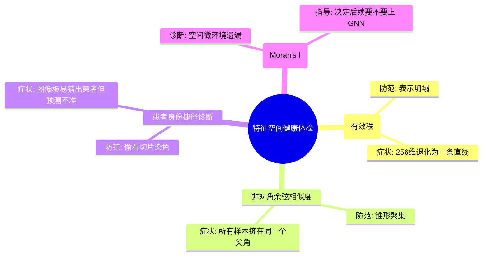
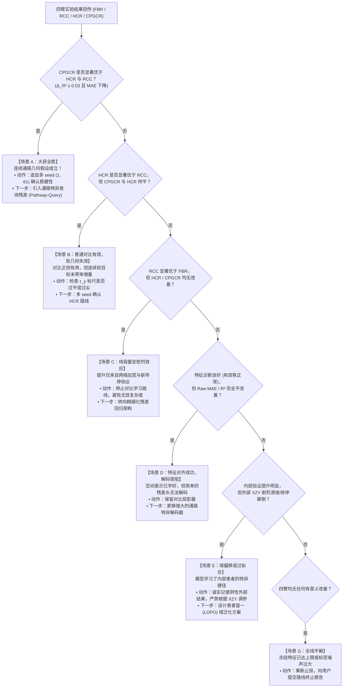

# MPP2 连续通路几何软对比残差：初学者进阶解析与结果判读指南

> **方法全称**：Continuous Pathway-Geometry Contrastive Residual（连续通路几何软对比残差，CPGCR）  
> **文档版本**：`v1.1 (初学者进阶详细答疑版)`  
> **更新日期**：2026-08-15  
> **适用范围**：Phase 2 MPP2——由病理图像特征预测 30 维 ssGSEA 通路分数  
> **拟绑定工作树**：`W007`（实验登记：`mpp2_cpgcr_probe_v001_20260811`）  
> **关联部署方案**：[MPP2连续通路几何软对比残差_初步探索部署方案_20260811.md](../部署方案/MPP2连续通路几何软对比残差_初步探索部署方案_20260811.md)  
> **关联实施方案**：[W007-mpp2_cpgcr_probe_实施方案.md](../../project_state/implementation_plans/W007-mpp2_cpgcr_probe_实施方案.md)  
> **关联权威指南**：[MPP2连续通路几何软对比残差_实验设计学习指南_20260811.md](MPP2连续通路几何软对比残差_实验设计学习指南_20260811.md)  

---

## 0. 极简导读：三分钟看懂本方案的“前世今生”

如果你是第一次接触本项目，可以用最直观的三个问答快速把握核心脉络：

1. **面临的核心痛点是什么？**  
   现有基线模型能看懂“高低趋势”（PCC 相关性达到 `0.79`），但“具体数值”严重失真（Raw R² 为负、MAE 极大）。就像天气预报员能猜中“明天比今天更热”，却把本该是 `30°C` 的炎夏报成了 `18°C`。
2. **本方案提出了什么改进（CPGCR）？**  
   在原有冻结基线旁边外挂一个轻量的“纠偏旋钮”（零初始化残差头），并在训练时让病理图像特征与 30 维通路向量进行跨模态对齐。不同于传统非黑即白的对比学习，本方案根据真实的生物学距离，给相似的组织赋予平滑的“部分分”（连续软对比）。
3. **如何证明这个改动真的有效？**  
   为了防止“模型加了几层网络”或“碰巧运气好”带来的假象，设计了严格的四臂对照实验（原基线 FBR、纯残差 RCC、硬对比 HCR、软对比 CPGCR），并制定了全套结果体检与决策树。



---

## 模块一：为什么做？从临床与病理现实痛点出发（直觉建立篇）

### 1.1 痛点具象化：“天气预报员”与 PCC 假象

在计算病理研究中，评估模型好坏通常会看 **Pearson 相关系数（PCC）** 和 **决定系数（R² / MAE）**。本项目基线暴露出了一个典型矛盾：

* **内部验证表现**：Pooled PCC 达到 `0.7971`（看起来很优秀）。
* **外部独立验证（XZY）**：Pooled PCC 为 `0.6549`，但 Raw MAE 高达 `1176.21`，Raw R² 为 `-0.088`。

> [!NOTE]
> **什么是 $R^2 < 0$？**  
> 在统计学中，$R^2 = 1 - \frac{\text{模型残差平方和}}{\text{真实值离差平方和}}$。如果 $R^2 < 0$，意味着模型的预测效果**甚至不如直接把所有样本的预测值无脑填成真实平均值**！

#### 为什么会发生这种现象？
把模型想象成一名天气预报员：
* 连续 3 天的真实气温为：`[28°C, 30°C, 32°C]`（每日升温 `2°C`）。
* 模型预测出的气温为：`[8°C, 10°C, 12°C]`（同样每日升温 `2°C`）。
* **PCC（看趋势）**：预测与真值的相关系数是完美的 `1.0`！因为趋势完全同步。
* **MAE / R²（看数值）**：每一天都差了 `20°C`，在临床上如果把高表达判成低表达，将直接导致下游诊断决策失误。

#### 为什么必须在 Phase 2 把绝对数值纠正？
整个项目的流水线分为两级：
$$\text{病理图像 Patch} \xrightarrow{\text{Phase 2}} 30 \text{ 维通路分数} \xrightarrow{\text{Phase 3}} \text{pCR 临床治疗反应}$$
下游 Phase 3 的临床预测模型依赖于通路的**真实物理幅度**。如果 Phase 2 交付的通路分数基线整体漂移、尺度压缩，Phase 3 的预测性能就会受到根本性制约。

---

### 1.2 核心数据对象通俗拆解

为了看懂后续架构，需要明确三个核心概念：

```text
[病理切片 WSI] ──> 切割为数万个 [Patch/Spot] (约数十微米)
                         │
                         ├── 经过视觉大模型 UNI2-h ──> 提取 [1536维 CLS 形态特征向量 f_i]
                         │
                         └── 经过空间转录组测序 ──> 归纳为 [30维 ssGSEA 生物通路分数 y_i]
```

1. **Patch / Spot**：高分辨率显微切片上的局部组织微区，每个微区既有图像外观，也有对应的分子表达。
2. **UNI2-h 1536 维冻结特征**：一个预训练好的病理视觉大模型（类似病理界的 GPT-4），它把图像压缩成 1536 个数字的特征向量 $f_i$。**本轮实验完全冻结 UNI2-h，不微调大模型底座**，以保证低显存消耗与特征一致性。
3. **30 维 ssGSEA 通路分数**：**单样本基因集富集分析（ssGSEA）**将上万个基因的表达汇总成 30 个具有明确生物学意义的通路活跃度（如免疫应答、细胞增殖、DNA修复、缺氧反应等）。
   * 关键特性：**它是高维连续向量，而不是离散互斥分类**。组织 A 和组织 B 可能在免疫通路上很像，在增殖通路上略有不同，不能粗暴地按类别非黑即白划分。

---

### 1.3 残差学习与“初始归零的纠偏旋钮”

如果直接扔掉老模型、从头训练一个新网络，不仅容易破坏已经学好的知识，还可能因为随机初始化导致训练初期严重震荡。

本方案采用 **残差学习（Residual Learning）** 思想：
$$\hat{y}_i = \underbrace{B_0(f_i)}_{\text{老基线预测 (已冻结)}} + \underbrace{R(h_i)}_{\text{轻量残差纠偏}}$$



> [!TIP]
> **什么是零初始化（Zero Initialization）？**  
> 在模型刚初始化的第 0 步，我们将残差头 $R$ 最后一层的权重（weights）和偏置（bias）**全部设为 0**。  
> 此时：$R(h_i) = 0 \implies \hat{y}_i = B_0(f_i) + 0 = B_0(f_i)$。  
> 就像给仪器装上了一个**出厂归零的校准旋钮**。新模型在第一秒的表现与已验收的老基线分毫不差，后续训练只会基于梯度平滑地学习“应该在什么情况下做微调”。

<details>
<summary>🔍 <b>深入理解：残差学习究竟在学什么？残差的标准是什么？（结合 W007 实验设计）</b></summary>

在 W007 实验中，初学者常问：*“残差网络究竟把什么当作输入？目标又是什么？”*

1. **学习的内容是什么？**  
   残差网络学习的内容是**老基线模型的预测误差（Deviation / Error Gap）**。  
   设样本 $i$ 的真实 30 维标准化通路标签为 $z_i$，冻结基线的预测为 $b_i = B_0(f_i)$。老模型的误差就是：
   $$r_i = z_i - b_i$$
   残差网络 $R(h_i) = \Delta z_i$ 的唯一目标就是去**逼近这个误差 $r_i$**。
2. **残差的标准是什么？**  
   残差的标准由**患者均衡均方误差（$\mathcal{L}_{abs}$）**严格衡量：
   $$\text{残差衡量标准} = \frac{1}{30} \sum_{k=1}^{30} \left( (b_{ik} + \Delta z_{ik}) - z_{ik} \right)^2 = \frac{1}{30} \sum_{k=1}^{30} (\Delta z_{ik} - r_{ik})^2$$
   * 在第 0 步：$\Delta z_i = 0$，此时总误差就是老基线原本的误差。
   * 在训练中：只要 $\Delta z_i$ 往正确的方向修正（即 $\Delta z_i \approx r_i$），总误差就会单调下降；若修正错误，损失函数会立刻通过反向传播惩罚残差头。
3. **为什么在 W007 中这样设计比直接训练新网络好？**  
   因为基线 $B_0$ 已经掌握了 80% 的全局共性趋势（PCC 接近 0.8）。如果从零训练新网络，它需要从头学习这 80% 的知识；而在残差架构下，底座知识被无损锁定，256 维的轻量残差头可以全力攻克那 20% 遗留的局部中心偏移与尺度偏差。
</details>

---

## 模块二：算法原理与数学保姆级拆解（算法原理篇）

### 2.1 对比学习直觉与双支路架构

#### 1. 普通回归损失 vs 对比学习损失

| 对比维度 | 普通回归损失（$\mathcal{L}_{abs}$，如 MSE / L1） | 对比学习损失（$\mathcal{L}_{con}$，如 InfoNCE / 软对比） |
| :--- | :--- | :--- |
| **关注核心** | **单点绝对坐标**（单个点数值准不准） | **多点拓扑几何**（点与点之间的相对距离排布） |
| **处理视角** | 孤立看待：只计算当前样本 $\hat{y}_i$ 与真实值 $y_i$ 的差值，不看邻居 | 宏观全局：在一个批次内同时比对 $B$ 个图像与 $B$ 个通路，要求“相似的靠近，相异的远离” |
| **现实比喻** | 像考官逐题打分：只看卷子上的最终数字对不对 | 像整理图书馆书架：先按生物学主题把相似的书放在相邻格子里 |
| **在病理中的局限/作用** | 易陷入局部保守极小值（倾向于无脑报均值）；特征空间混乱无序 | 强行重构特征空间，让图像表征具备良好的生物学拓扑结构，为后续回归提供坚实地基 |

#### 2. 模型内部的“双支路分工”

为了兼顾“特征空间排布”与“绝对数值预测”，在单个模型内部设计了**双支路分工**：

```text
               ┌──> L2 归一化 (模长归为1) ──> 用于对比损失 (只比对方向，像指南针)
特征表示 h_i ──┤
               └──> 保持非归一化 (保留原始模长) ──> 用于残差回归 (保留幅度大小，像速度表)
```

<details>
<summary>🔍 <b>概念辨析：模型内的“双支路分工”与实验设计的“4 臂分工”有什么区别和联系？</b></summary>

初学者很容易把这两个“分工”混淆，它们属于完全不同的两个层次：

1. **“双支路分工”是单个模型内部的前向数据流结构（Micro Architecture）**：
   * 指的是在同一个神经网络内部，图像特征 $h_i$ 被一分为二：一路做单位化后去算余弦夹角（对比损失），另一路保留模长去算绝对数值（回归损失）。
2. **“4 臂分工”是科学实验设计中的四个独立对照组（Macro Experiment Arms）**：
   * 指的是在实验验证时，为了探明究竟是哪部分带来了性能提升，而设置的 4 个独立实验组（FBR、RCC、HCR、CPGCR）。
3. **二者的联系**：
   * **FBR 臂**：老基线，两条支路都没有；
   * **RCC 臂**：**只开启非归一化支路（残差回归）**，关闭归一化支路（不加对比损失）；
   * **HCR 臂**：**同时开启两条支路**，归一化支路使用传统“硬配对”对比损失；
   * **CPGCR 臂**：**同时开启两条支路**，归一化支路使用“连续软几何”对比损失。
   * *总结*：双支路是模型内部的器官，而 4 臂实验是通过逐个“开启/替换”这些器官来做因果消融验证！
</details>

---

### 2.2 硬配对对比（HCR）的致命缺陷：非黑即白的误伤

在传统的视觉-文本对齐（如 CLIP、PEaRL）中，采用的是**硬配对 InfoNCE 损失**：
* 样本 $i$ 的图像与样本 $i$ 自己的标签是一对 $\to$ **唯一正样本**（相似度目标为 1）。
* 批次内的其他所有样本 $j \ne i$ $\to$ **全部视为负样本**（相似度目标为 0）。

#### 为什么这对连续生物通路是灾难性的？
假设同一个患者切片上有两个相邻的细胞点（Spot A 和 Spot B），它们的显微形态极其相似，30 维通路活性也几乎完全相同（例如相差不到 1%）。
* **硬对比的做法**：因为 Spot B 不是 Spot A 自己，硬对比损失会强行把 Spot A 和 Spot B 推开！
* **后果**：这破坏了连续特征空间的几何平滑性，导致大量生物学近邻被强行判定为“假负样本”（硬负样本误伤）。

---

### 2.3 连续通路几何软对比（CPGCR）的硬核数学拆解

<details>
<summary>💡 <b>对比学习前置理解：为什么要分成“真实标签几何”与“神经网络特征”？</b></summary>

把模型学习过程想象成**老师教学与学生作答**：
* **真实标签几何（Ground-Truth Topology，老师的参考答案）**：  
  通过空间转录组真实测出的 30 维通路分数。它本身客观反映了切片上细胞点之间的生物学亲疏远近。
* **神经网络特征（Predicted Embedding，学生的答卷）**：  
  神经网络仅凭显微镜图像预测出的 256 维特征向量。
* **交叉熵损失的作用**：  
  衡量“学生的答卷（特征相似度）”与“老师的参考答案（真实生物学相似度）”之间的差距。差距越小，说明图像特征越能精准还原真实的生物学组织规律。
</details>

CPGCR 不再做非黑即白的判断，而是**根据真实 30 维通路分数的物理距离，给每一个样本对赋予平滑的连续软权重（Soft Target）**。



---

#### 核心公式逻辑链条总览

```text
【公式 1：定义生物真实几何】 30维真实通路距离 ──> 高斯核化 ──> 真实软目标分布 q_ij
                                                                      │
【公式 2：计算特征表征损失】 图像/通路特征余弦 ──> Softmax ──> 预测分布 p_ij ──┴──> 软交叉熵对比损失 L_con
                                                                                              │
【公式 3：计算绝对回归损失】 预测值 ŷ 与真值 y ──> 患者等权均方误差 ──────────────────> 绝对回归损失 L_abs
                                                                                              │
                                                                                              ▼
                                                                         【总损失】 L = L_abs + λ * L_con
```

---

#### 公式 1：真实标签距离的高斯核化（软目标生成）

对批次内的任意两个样本 $i$ 和 $j$，先计算它们标准化通路标签 $z$ 的平均欧氏距离：
$$d_{ij} = \frac{1}{30} \sum_{k=1}^{30} (z_{ik} - z_{jk})^2 = \frac{1}{30} \|z_i - z_j\|_2^2$$

然后通过高斯核函数将其转化为软目标概率 $q_{ij}$：
$$q_{ij} = \frac{\exp(-d_{ij} / \tau_y)}{\sum_{k \in \mathcal{V}_i} \exp(-d_{ik} / \tau_y)}$$

> [!NOTE]
> **保姆级符号拆解与计算直觉：**
> * $d_{ij}$：样本 $i$ 和 $j$ 在 30 维生物功能空间中的物理距离。自身与自身 $d_{ii} = 0$。
> * $\tau_y$（标签几何温度）：**一把决定“宽容度”的生物标尺**。
>   * 如果 $\tau_y \to 0$：软目标退化为传统硬配对（只有自己是 1，其余全为 0）。
>   * 如果 $\tau_y \to \infty$：所有样本都被视为完全一样（概率均匀分布）。
>   * **本项目设定**：在训练集的 6 名患者中抽取跨患者样本对，取其距离中位数作为 $\tau_y$。这保证了标尺刻度完全来自真实生物数据的天然波动，不读取验证集，杜绝数据泄漏。

<details>
<summary>📊 <b>数据源实证核查：6 名患者真的能抽出 10 万对跨患者样本吗？（源码与数据底账）</b></summary>

初学者看到“6名患者”常误以为只有 6 个数据点。**这是对病理切片尺度的误解！**  
在 Visium HD 空间转录组中，每位患者的切片被划分为了成百上千个微区 Spot/Patch。

依据项目权威数据集划分快照（[`MPP1-5统一标准划分结果快照_20260708.md`](../分析报告/MPP1-5统一标准划分结果快照_20260708.md)），MPP2 标准网格（`block_size = 672px`）下 6 名训练患者的真实 Spot 数量如下：

| 患者 ID | 训练集 Spot 数量 ($N_p$) | 验证集 Spot 数量 | 患者切片总 Spot 数 |
| :--- | :---: | :---: | :---: |
| **HYZ15040** | **1,309** | 145 | 1,454 |
| **JFX** | **1,826** | 203 | 2,029 |
| **LMZ12939** | **3,014** | 337 | 3,351 |
| **TGC** | **998** | 118 | 1,116 |
| **XSL** | **1,365** | 161 | 1,526 |
| **ZHZ** | **960** | 114 | 1,074 |
| **训练集总计** | **9,472 个 Spots** | 1,078 | 10,550 |

##### 跨患者样本对（Cross-patient Spot Pairs）总数计算：
6 名患者两两配对共有 $\binom{6}{2} = 15$ 个患者对。任意两位患者 $A$ 和 $B$ 之间的跨患者点对数为 $N_A \times N_B$：
* $\text{HYZ15040} \times \text{JFX} = 1309 \times 1826 = 2,390,234$ 对
* $\text{HYZ15040} \times \text{LMZ12939} = 1309 \times 3014 = 3,945,326$ 对
* $\text{JFX} \times \text{LMZ12939} = 1826 \times 3014 = 5,503,564$ 对
* $\dots$（其余 12 个组合）
* **15 个患者对的跨患者 Spot 点对总数**：
  $$\text{总点对数} = \sum_{1 \le i < j \le 6} N_i \times N_j = \mathbf{35,903,001 \text{ 对（约 3590 万对！）}}$$

从近 **3600 万对** 真实候选池中抽取 **100,000 对**（每个患者对均匀抽取约 6,666 对）来计算中位数 $\tau_y$，仅占总可用对数的 **0.28%**。不仅抽样极其充裕，而且在统计学上具有极高的大数定律稳定性！
</details>

---

#### 公式 2：双向软交叉熵与矩阵行归一化（row_softmax）

在计算图像到通路（$I \to P$）和通路到图像（$P \to I$）的双向对齐时，必须分别构建目标矩阵：

$$Q_{I2P} = \operatorname{row\_softmax}\left(-\frac{D}{\tau_y}\right), \qquad Q_{P2I} = \operatorname{row\_softmax}\left(-\frac{D^\top}{\tau_y}\right)$$

> [!WARNING]
> **关键代码易错点：为什么 $Q_{P2I} \ne Q_{I2P}^\top$？**  
> 很多初学者会直觉地认为“反向矩阵就是正向矩阵的转置”。**这是错误的！**  
> * 假设一个 3×3 的未归一化矩阵转置后，每一列变成了每一行。
> * 但是，“对原矩阵按行做 Softmax”之后再转置，得到的新矩阵**它的每一行求和不再等于 1**！
> * 必须先转置底层距离矩阵 $D^\top$，再重新执行一次 `row_softmax`，才能保证反向目标在数学上是一个合法的概率分布。

图像到通路的软交叉熵损失为：
$$\mathcal{L}_{I \to P}^{soft} = -\frac{1}{B} \sum_{i=1}^B \sum_{j \in \mathcal{V}_i} Q_{ij}^{I2P} \log p_{ij}^{I \to P}$$
总对比损失为双向平均：
$$\mathcal{L}_{con}^{CPGCR} = \frac{1}{2}\left(\mathcal{L}_{I \to P}^{soft} + \mathcal{L}_{P \to I}^{soft}\right)$$

<details>
<summary>💡 <b>保姆级理解：软交叉熵公式到底是怎么工作的？</b></summary>

传统分类交叉熵为 $-\log p_{\text{correct}}$（只给正确答案算分）。  
软交叉熵公式 $-\sum_j Q_{ij} \log p_{ij}$ 是它的平滑升级版：
* 假设当前样本 $i$ 对自身 $i$ 的真实相似度 $Q_{ii} = 0.6$，对近邻样本 $A$ 的真实相似度 $Q_{iA} = 0.3$，对远端样本 $B$ 的真实相似度 $Q_{iB} = 0.1$。
* 模型计算出的特征相似度概率分别为 $p_{ii}, p_{iA}, p_{iB}$。
* 损失函数的值就是：
  $$\text{Loss} = - \left( 0.6 \cdot \log p_{ii} + 0.3 \cdot \log p_{iA} + 0.1 \cdot \log p_{iB} \right)$$
* **直观效果**：如果模型不仅把自身预测对了（$p_{ii}$ 很高），而且也把生物学相近的近邻识别出来了（$p_{iA}$ 较高），损失就会非常小！这在数学上等价于让预测分布逼近真实分布的 **KL 散度最小化**。
</details>

---

#### 公式 3：患者等权绝对回归损失（Patient-Balanced Loss）

总训练损失是绝对回归损失与对比正则项的加权和：
$$\mathcal{L}_{\text{total}} = \mathcal{L}_{abs} + \lambda \mathcal{L}_{con}$$

其中，绝对回归损失采用**患者均衡 z-MSE**：
$$\mathcal{L}_{abs} = \frac{1}{|\mathcal{P}|} \sum_{p \in \mathcal{P}} \left( \frac{1}{|\mathcal{I}_p| \cdot 30} \sum_{i \in \mathcal{I}_p} \sum_{k=1}^{30} (\hat{z}_{ik} - z_{ik})^2 \right)$$

> [!TIP]
> **为什么一定要按患者等权（Patient-Balanced）？**  
> 在病理数据集中，患者 LMZ12939 有 `3014` 个 Spot，而患者 ZHZ 只有 `960` 个 Spot。  
> 如果直接将所有 Spot 混在一起算平均 MSE，LMZ12939 的梯度影响将是 ZHZ 的 **3 倍以上**！模型会被大患者严重带偏。  
> 患者等权损失强制要求**每位患者在总损失中只占 $\frac{1}{6}$ 的权重**，彻底保护了小样本患者的公平性。

---

## 模块三：科研严谨性：四臂实验设计与机制消融（逻辑归因篇）

### 3.1 为什么科学实验必须做对照消融？

在深度学习研究中，最容易犯的错误是：**“我加了 A 算法，指标上升了，所以我宣称 A 算法极其有效”**。  
但实际上，指标上升可能仅仅是因为：
1. 网络多加了一层（纯参数容量变大）；
2. 换了个更好的优化器或训练轮次；
3. 随机数种子碰巧摇出了一个好结果。

为了实现**无可辩驳的机制归因（Causal Attribution）**，本方案设计了严密的**四臂对照实验体系**。

---

### 3.2 四臂对照全景矩阵

四臂实验（FBR / RCC / HCR / CPGCR）在硬件、优化器、学习率、患者均衡 Batch 规划完全锁死一致的前提下，只改变核心研究变量：

| 实验臂简称 | 实验臂全称 | 核心网络结构 | 训练损失组成 | 核心回答的科学问题 |
| :--- | :--- | :--- | :--- | :--- |
| **FBR** | **F**rozen **B**aseline **R**eplay<br>冻结基线复放 | 仅冻结老基线 $B_0$ | 不训练（直接加载已验收权重） | **地基校验**：现有代码和数据资产能否 100% 精确复现老指标？ |
| **RCC** | **R**esidual **C**apacity **C**ontrol<br>残差容量对照 | 冻结 $B_0$ + 256维残差头 $R$ | 仅患者均衡绝对损失 $\mathcal{L}_{abs}$ | **容量安慰剂**：单纯增加网络参数和新评估协议，能带来多少基线收益？ |
| **HCR** | **H**ard-pair **C**ontrastive **R**esidual<br>硬配对对比残差 | 与 RCC 完全相同 | $\mathcal{L}_{abs} + \lambda \mathcal{L}_{con}^{\text{Hard}}$ | **一般对齐增量**：传统非黑即白的 CLIP 式对比学习是否有效？ |
| **CPGCR** | **C**ontinuous **P**athway-**G**eometry<br>**C**ontrastive **R**esidual<br>连续通路几何软对比残差 | 与 RCC 完全相同 | $\mathcal{L}_{abs} + \lambda \mathcal{L}_{con}^{\text{CPGCR}}$ | **核心创新增量**：连续生物学软几何是否能超越传统硬对比？ |

<details>
<summary>🔍 <b>易混淆辨析：RCC 是把残差权重一直锁死为 0 吗？</b></summary>

**绝对不是！** 这是很多初学者容易误解的地方：

1. **第 0 步时**：RCC 的残差头权重被**零初始化（Zero-Init）**，此时它输出的修正量为 0，模型在第一秒的表现与 FBR 相同。
2. **在训练过程中**：RCC 的 256 维残差头**正常接受反向传播梯度，正常被优化器更新！**
3. **RCC 真正设为 0 的是什么？**  
   是对比损失权重 **$\lambda_{con} = 0$**（即 RCC 只用纯 MSE 绝对回归损失来训练残差头，不给它加任何对比学习损失）。
4. **为什么必须这么设计？**  
   * 如果 RCC 训练后性能明显好于 FBR，说明“光是多加一个 256 维残差头和改用患者均衡损失”就已经能带来收益；
   * 后续 HCR 和 CPGCR 同样拥有这套 256 维残差头，但它们额外加入了对比损失（$\lambda_{con} = 0.1$）；
   * 只有当 `CPGCR 显著优于 RCC` 时，我们才能 **100% 确定：超出纯参数容量的额外性能提升，完全归功于对比学习算法，而不是靠多加参数作弊！**
</details>

---

### 3.3 机制归因的减法算式

四臂跑完后，我们通过三组“减法”清晰地剥离出每种机制的纯贡献：

```text
[实验结果四臂梯队]
      FBR  ──────────────> accepted MPP2 历史表现 (基线锚点)
       │
       ▼  + (残差参数容量 + 患者均衡评估协议)
      RCC  ──────────────> 新协议下的容量上限
       │
       ▼  + (传统一对一硬对比损失)
      HCR  ──────────────> 一般跨模态对齐收益: Δ_HCR = HCR - RCC
       │
       ▼  + (连续生物通路几何软目标)
     CPGCR ──────────────> 核心软几何创新收益: Δ_CPGCR = CPGCR - HCR
```

* **$\Delta_{\text{容量协议}} = \text{RCC} - \text{FBR}$**：反映网络容量增加与患者均衡协议带来的综合变化。
* **$\Delta_{\text{普通对比}} = \text{HCR} - \text{RCC}$**：**纯净隔离**出普通对比正则化的增量。
* **$\Delta_{\text{软几何创新}} = \text{CPGCR} - \text{HCR}$**：**纯净隔离**出连续通路软目标相比于硬配对的真正创新增量。

---

### 3.4 零训练三大机制探针（BRMA-2）

在正式耗费算力跑四臂训练之前，文档设计了三个**不需训练的统计探针**，提前为假设“体检”：

1. **探针一：特征—标签距离一致性**  
   * *做法*：计算病理图像特征距离与 30 维通路距离之间的 Spearman 秩相关。  
   * *目的*：确认“显微镜下长得像的组织，生物学通路是不是真的更相近”。
2. **探针二：硬负样本误伤率统计**  
   * *做法*：统计在同一批次中，有多少生物学上高度相似的近邻样本会被 HCR 粗暴判为“负样本”。  
   * *目的*：从数据上证实 CPGCR 软对比的必要性。
3. **探针三：训练图库残差检索（Training Gallery Probe）**  
   * *做法*：只用训练集构建特征库，看验证集样本仅凭图像相似度去检索训练集误差残差，能否降低预测误差。  
   * *目的*：验证形态邻居是否天然携带可泛化的误差修正信息。

---

## 模块四：实战手册：实验结果怎么看与决策树（结果分析指南篇）

### 4.1 评估指标全景“体检单”速查

当未来的训练结果表格回传时，请对照下表逐项判读：



| 指标名称 | 关注维度 | 理想表现 | 危险信号（警示） | 为什么重要？ |
| :--- | :--- | :--- | :--- | :--- |
| **Patient-balanced z-MSE** | 标准化绝对误差 | 持续下降 | 大患者降、小患者升 | **内部 Checkpoint 挑选的唯一法官**，防止偏袒大患者。 |
| **Raw MAE** | 真实通路绝对误差 | 显著减小 | 相比基线无变化 | 直接反映 Phase 3 会接收到的真实物理误差幅度。 |
| **Raw R²** | 优于均值预测程度 | $> 0$ 且越大越好 | $< 0$（负值） | 负值意味着模型连“无脑报均值”都不如，存在严重尺度/中心偏移。 |
| **Mean Per-pathway PCC** | 单通路内样本排序 | 稳步上升 | 显著下降（$> 0.005$） | **衡量 30 条通路平均能否被预测的真实指标**。 |
| **Pooled PCC** | 全数据混总相关 | 参考指标 | 虚高（0.8+）但 R² 为负 | 极易受不同通路本身的天然均值差异拉高（见下方推导）。 |
| **CCC** | 一致性相关系数 | 越接近 1 越好 | 远低于 PCC | 只要模型预测整体偏大或偏小，CCC 就会严厉惩罚。 |

#### 深度透视：为什么 Pooled PCC 会产生“虚高假象”？
根据全协方差分解定理：
$$\text{Pooled 协方差} = \underbrace{\sum_{k=1}^{30} \sum_{i=1}^N (y_{ik} - \bar{y}_k)(\hat{y}_{ik} - \bar{\hat{y}}_k)}_{\text{第一项：通路内部真实的样本波动拟合}} + \underbrace{N \sum_{k=1}^{30} (\bar{y}_k - \mu_{\text{global}})(\bar{\hat{y}}_k - \hat{\mu}_{\text{global}})}_{\text{第二项：通路之间固有均值高低的排序}}$$

* 如果通路 A 本身平均值是 `+10`，通路 B 本身平均值是 `-10`。
* 即使模型完全没有学会任何样本间的生物学波动（第一项为 0），只要模型勉强记住了“通路 A 比通路 B 高”，**第二项就会产生极其庞大的虚假正相关**，让 Pooled PCC 飙升到 `0.8` 以上！
* **结论**：**看实验结果绝不能只看 Pooled PCC，必须以 Mean Per-pathway PCC 和 Raw R² 为准！**

---

### 4.2 特征与空间健康度体检（防范模型“耍小聪明”）

在深度学习模型评估中，单纯看损失函数和准确率很容易被模型的“作弊技巧”所蒙蔽。以下 4 项诊断指标是模型特征空间的“全套体检”：



#### 1. Effective Rank（特征有效秩）
* **前置数学背景**：线性代数中，矩阵的“秩”代表线性无关的维度数量。而在连续神经网络中，特征矩阵的奇异值往往很小但不为 0。有效秩（Effective Rank）通过计算奇异值分布的**香农熵（Shannon Entropy）**，量化评估特征实际上“占满了多少个有效维度”。
* **在本项目中的作用**：防范**表示坍塌（Representation Collapse）**。
* **异常症状与定位**：如果 256 维嵌入的有效秩骤降到接近 `1~2`，说明模型找到了对比损失的退化解，把所有切片图块映射到了同一条直线上。此时对比损失虽然很低，但特征完全失去了生物学区分度。

#### 2. 平均非对角余弦相似度（Mean Off-Diagonal Cosine Similarity）
* **前置数学背景**：对 Batch 内所有不同样本（非对角线元素，$i \ne j$）计算图像特征向量的余弦夹角并取平均值。
* **在本项目中的作用**：防范**点聚集坍塌（Clustering Collapse）**。
* **异常症状与定位**：如果平均非对角余弦相似度达到 `0.95+`（接近 1.0），说明所有样本特征全部挤在一个极度狭窄的圆锥体内。虽然有效秩可能没归零，但样本之间区分极其困难。

#### 3. 患者身份捷径诊断（Patient Shortcut Probe）
* **前置医学背景**：病理切片在制作过程中存在**批次效应（Batch Effects）**（不同患者切片的染色深浅、固定时间、切片厚度各有风格）。
* **在本项目中的作用**：防范**捷径学习（Shortcut Learning）**。
* **异常症状与定位**：我们在训练好的特征上训练一个简单的分类器去猜“这个图块属于 6 位患者中的哪一位”（随机盲猜准确率是 $\frac{1}{6} \approx 16.7\%$）。如果分类准确率飙升到 `90%+`，但通路预测指标（Raw R²）却没有明显改善，说明**模型走捷径学会了识别切片染色风格，根本没有学会生物通路！**

#### 4. 残差莫兰指数（Residual Moran's I）
* **前置统计背景**：空间自相关（Spatial Autocorrelation）的经典指标，取值范围在 $[-1, 1]$ 之间。$>0$ 表示空间聚集（相邻位置的值相似），$<0$ 表示棋盘状分散，$\approx 0$ 表示完全空间随机分布。
* **在本项目中的作用**：诊断**单 Patch 模型是否丢失了组织微环境空间信息**，作为未来是否升级为图神经网络（GNN）的科学判据。
* **异常症状与定位**：如果预测残差在切片物理坐标上呈现显著的正莫兰指数（例如 Moran's I > 0.25 且 p < 0.001），说明**模型的预测误差总是成片成块地出现**。这提示我们：仅凭单个 Patch 无法完全预测，必须在下一步引入空间图网络（GNN）来结合邻近细胞微环境。

---

### 4.3 【实战核心】实验结果 7 大场景判读决策树（EDH-7 实战映射）

当四臂实验结果完整返回后，请根据下方的决策树直接定位结论与下一步行动：



#### 决策树场景与行动速查清单

| 场景代码 | 核心现象 | 最合理解释 | 严禁声称的错误结论 | 下一步标准行动指令 |
| :--- | :--- | :--- | :--- | :--- |
| **场景 A** | `CPGCR > HCR > RCC` | 连续通路软几何提供了不可替代的核心增量 | 严禁声称“已证明全球首创” | 经用户批准后追加 `seed=1, 61` 稳健性确认；准备引入通路查询头。 |
| **场景 B** | `HCR > RCC` 且 `CPGCR ≈ HCR` | 一般对比正则有效，但软目标标尺 $\tau_y$ 划分可能不够精准 | 严禁声称“连续软几何起到了关键作用” | 深入审计 $\tau_y$ 分布熵；以 HCR 为基础进行多 seed 确认。 |
| **场景 C** | `RCC > FBR` 且对比组均无增益 | 收益全来自容量扩充与患者均衡协议，对比损失无效 | 严禁声称“对比学习改善了预测” | 停止对比学习探索，避免堆叠无用损失；转向精简残差头优化。 |
| **场景 D** | 嵌入健康度提升，但 Raw 指标不动 | 特征表示已对齐，但共享残差头无法有效还原 30 维连续幅度 | 严禁声称“模型预测能力已显著提升” | 保持对比表征，将 256→30 线性头升级为 30 通路独立的 Query 解码头。 |
| **场景 E** | 内部大涨，外部 XZY 大跌 | 发生了内部过拟合，或模型利用了患者染色批次捷径 | 严禁偷偷在 XZY 上反复微调超参数 | 忠实记录外部泛化瓶颈；排查患者捷径诊断指标；规划分折专用的 LOPO 实验。 |
| **场景 F** | 指标改善，但残差莫兰指数显著为正 | 单 Patch 预测取得进展，但微环境空间依赖性仍未被建模 | 严禁声称“组织空间问题已彻底解决” | 触发空间扩展分支：在残差后级接入轻量空间 kNN 图网络。 |
| **场景 G** | 四臂全线平躺，无任何改善 | 冻结的 UNI2-h 特征信息受限，或通路标签噪声过大 | 严禁通过堆叠更复杂的模型强行包装 | 诚实提交阴性总结；建议团队重新审查上游特征提取或标签质量。 |

---

## 模块五：核心术语/符号速查与治理底线备忘

### 5.1 核心数学符号与名词白话对照字典

| 符号 / 术语 | 英文全称 | 通俗大白话解释 |
| :--- | :--- | :--- |
| $f_i$ | UNI2-h CLS Feature | 显微图像经过大模型压缩后的 **1536 维形态指纹** |
| $y_i / z_i$ | ssGSEA Score / z-score | 样本对应的 **30 维生物功能分数**（$y$ 为原始物理量纲，$z$ 为标准化分数） |
| $B_0(f_i)$ | Frozen Baseline | **已验收的老基线模型**（输出 30 维预测，参数完全冻结、无梯度） |
| $h_i$ | Projected Representation | 图像特征压缩映射后的 **256 维中间表征** |
| $R(h_i) / \Delta y_i$ | Residual Correction | 轻量残差网络输出的 **30 维纠偏量**（零初始化起步） |
| $\tau_{con}$ | Contrastive Temperature | **对比相似度温度**（固定为 0.07，控制 Softmax 区分度） |
| $\tau_y$ | Label Geometry Temperature | **连续标签距离标尺**（由训练集 10 万对距离中位数决定） |
| $\lambda$ | Loss Weight | **对比损失调节旋钮**（初筛固定为 0.1，防止喧宾夺主） |
| $Q_{I2P} / Q_{P2I}$ | Soft Target Distribution | 图像到通路 / 通路到图像的 **双向平滑软目标概率矩阵** |

---

### 5.2 初学者必须牢记的“三项不可触碰安全红线”

在参与本项目的任何实验分析时，必须时刻坚守以下三条科研底线：

1. **红线一：严禁把外部测试集（XZY）当成调参工具**  
   * 外部 XZY 只能在四臂内部 Checkpoint 冻结后做**单次只读评估**。绝不能根据 XZY 的好坏反向挑选 Checkpoint、修改学习率或调整损失权重 $\lambda$！
2. **红线二：严禁破坏受保护的数据资产**  
   * 现有的 `manifest`、标准划分、30 维 ssGSEA 分数、z-score 参数以及 UNI2-h 特征缓存为受保护只读资产，严禁自动重写或覆盖。
3. **红线三：严格遵守双阶段审批门禁**  
   * 部署方案定版 $\to$ 编制实施方案 $\to$ 实施方案获批 $\to$ 绑定 `W007` 工作树 $\to$ 编写代码与单元测试 $\to$ 生成正式 Job 批准文件 $\to$ 调度服务器训练。绝不能跨阶段抢跑！

---

## 结语：如何使用本指南？

* **实验前**：研读【模块一】与【模块二】，彻底搞清“为什么加残差”和“软对比公式怎么算”；
* **实验中**：研读【模块三】，确保代码实现严格符合四臂消融与零训练探针规范；
* **实验后**：直接翻开【模块四】，对照“指标体检单”与“7 大场景决策树”，快速、客观、科学地得出实验结论并规划下一步！
